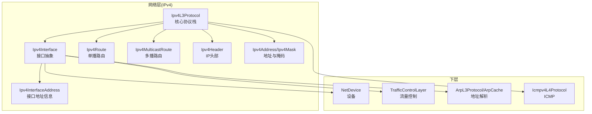
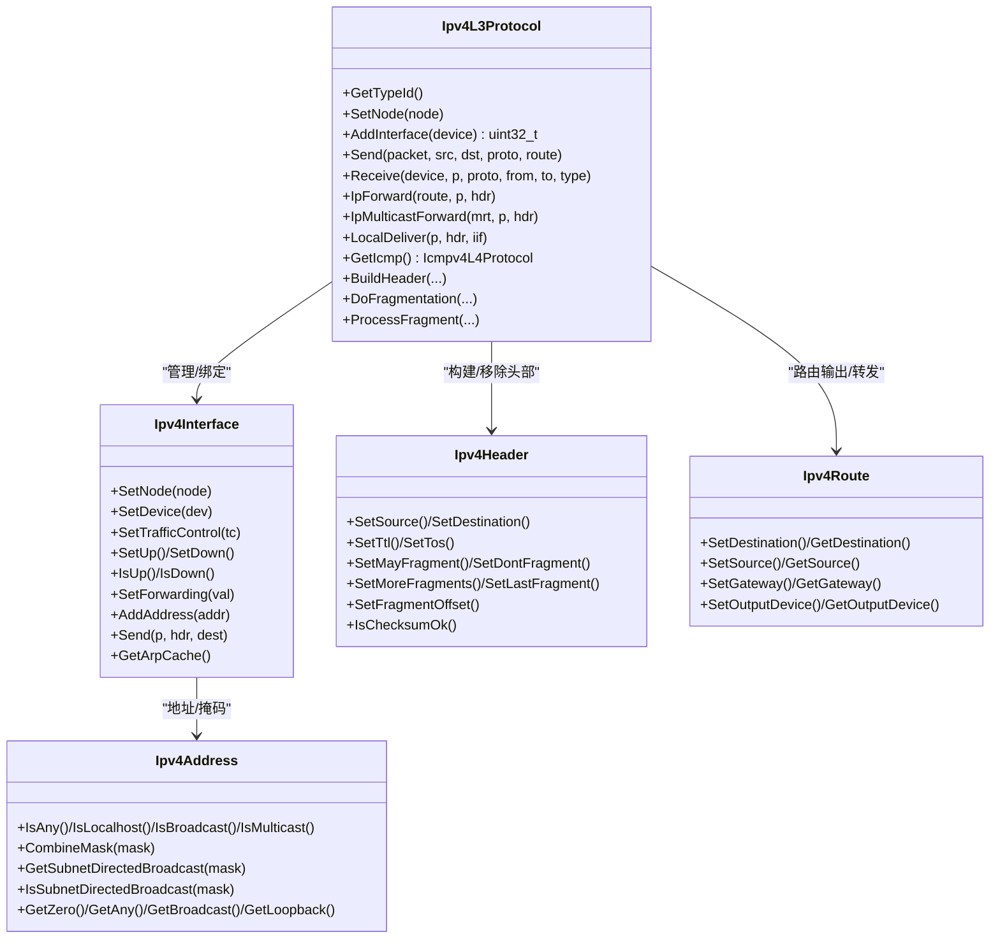
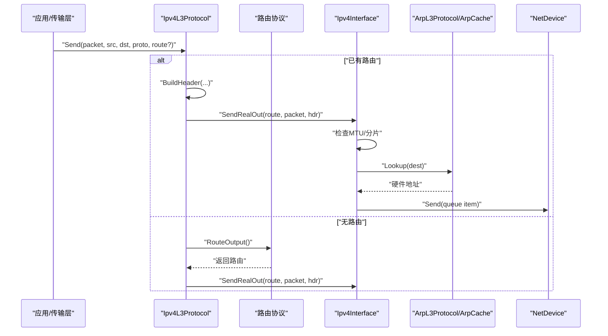
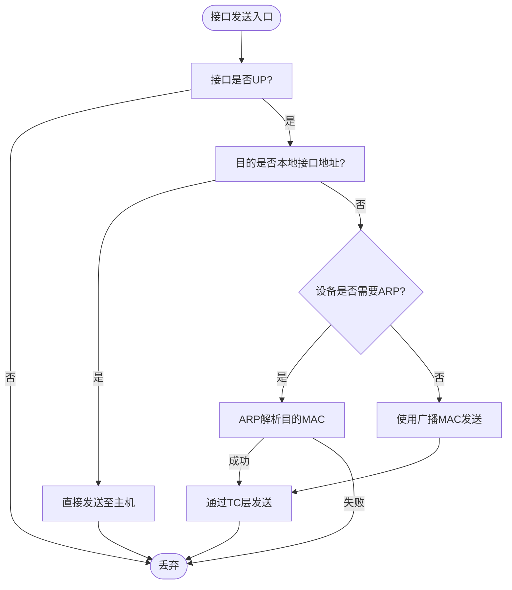
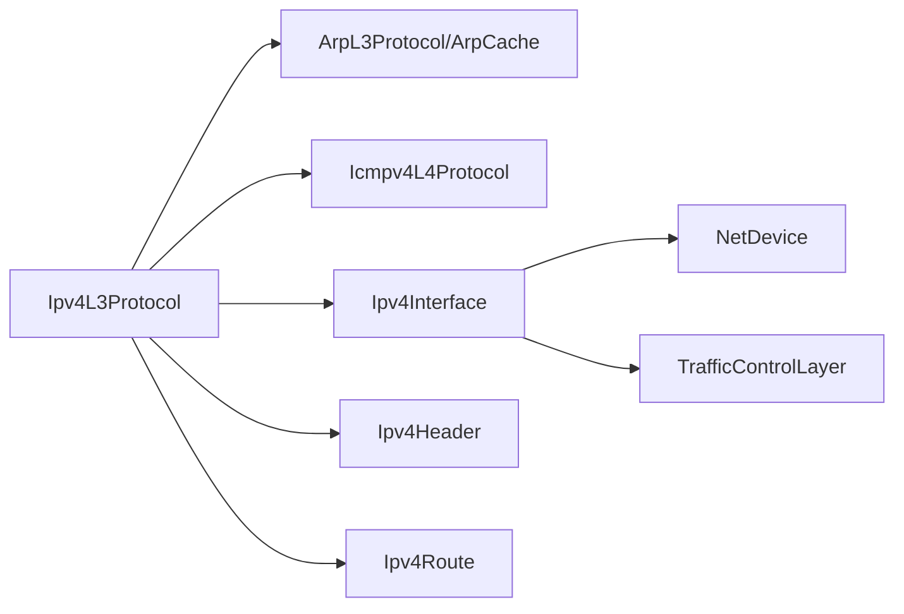

# IPv4网络层

<cite>
**本文引用的文件**   
- [ipv4-l3-protocol.cc](file://simulator/ns-3.39/src/internet/model/ipv4-l3-protocol.cc)
- [ipv4-interface.cc](file://simulator/ns-3.39/src/internet/model/ipv4-interface.cc)
- [ipv4-address.h](file://simulator/ns-3.39/src/network/utils/ipv4-address.h)
- [ipv4-interface-address.h](file://simulator/ns-3.39/src/internet/model/ipv4-interface-address.h)
- [ipv4-header.h](file://simulator/ns-3.39/src/internet/model/ipv4-header.h)
- [ipv4-route.h](file://simulator/ns-3.39/src/internet/model/ipv4-route.h)
</cite>

## 目录
1. [引言](#引言)
2. [项目结构](#项目结构)
3. [核心组件](#核心组件)
4. [架构总览](#架构总览)
5. [详细组件分析](#详细组件分析)
6. [依赖关系分析](#依赖关系分析)
7. [性能考虑](#性能考虑)
8. [故障排除指南](#故障排除指南)
9. [结论](#结论)
10. [附录：配置与示例路径](#附录配置与示例路径)

## 引言
本文件面向使用NS-3仿真平台进行IPv4网络仿真的工程师与研究者，系统化梳理并解读IPv4网络层的核心实现，重点覆盖以下方面：
- IPv4L3Protocol类：数据包封装、路由决策、分片重组、ICMP处理、多播转发、接口管理与状态控制。
- IPv4Interface类：接口状态管理（UP/DOWN）、邻居缓存（ARP）、多播支持、地址列表维护。
- IPv4Address与掩码：地址类型判断、子网计算、广播生成、掩码转换与前缀长度。
- 路由与头部：Ipv4Route/Icmpv4L4Protocol/Ipv4Header在端到端流程中的协作。
- 配置、路由设置、ICMP通信的实践路径与示例定位。
- 性能优化与常见问题排查。

## 项目结构
NS-3中IPv4网络层位于internet模块与network/utils下，核心文件如下：
- 网络层协议栈：src/internet/model/ipv4-l3-protocol.cc
- 接口抽象：src/internet/model/ipv4-interface.cc
- 地址与掩码：src/network/utils/ipv4-address.h
- 接口地址信息：src/internet/model/ipv4-interface-address.h
- 数据报头部：src/internet/model/ipv4-header.h
- 路由条目：src/internet/model/ipv4-route.h

图示来源
- [ipv4-l3-protocol.cc:45-131](file://simulator/ns-3.39/src/internet/model/ipv4-l3-protocol.cc#L45-L131)
- [ipv4-interface.cc:20-56](file://simulator/ns-3.39/src/internet/model/ipv4-interface.cc#L20-L56)
- [ipv4-header.h:33-266](file://simulator/ns-3.39/src/internet/model/ipv4-header.h#L33-L266)
- [ipv4-route.h:41-98](file://simulator/ns-3.39/src/internet/model/ipv4-route.h#L41-L98)
- [ipv4-address.h:41-243](file://simulator/ns-3.39/src/network/utils/ipv4-address.h#L41-L243)
- [ipv4-interface-address.h:44-194](file://simulator/ns-3.39/src/internet/model/ipv4-interface-address.h#L44-L194)

章节来源
- [ipv4-l3-protocol.cc:45-131](file://simulator/ns-3.39/src/internet/model/ipv4-l3-protocol.cc#L45-L131)
- [ipv4-interface.cc:20-56](file://simulator/ns-3.39/src/internet/model/ipv4-interface.cc#L20-L56)

## 核心组件
- IPv4L3Protocol：负责接收/发送、路由输入输出回调、分片/重组、TTL处理、ICMP触发、多播转发、接口聚合与事件调度。
- IPv4Interface：封装NetDevice与TrafficControlLayer，维护接口状态、ARP缓存、地址列表、本地/广播/多播转发路径。
- IPv4Address/Ipv4Mask：提供地址类型判断、掩码运算、子网定向广播生成、前缀长度转换等。
- Ipv4Header：承载TOS/DSCP/ECN、TTL、标识、分片标志、源/目的地址、校验和等字段。
- Ipv4Route/Icmpv4L4Protocol：单播路由条目与ICMP处理协议，配合L3完成错误上报与路由决策。

章节来源
- [ipv4-l3-protocol.cc:133-355](file://simulator/ns-3.39/src/internet/model/ipv4-l3-protocol.cc#L133-L355)
- [ipv4-interface.cc:63-129](file://simulator/ns-3.39/src/internet/model/ipv4-interface.cc#L63-L129)
- [ipv4-address.h:41-243](file://simulator/ns-3.39/src/network/utils/ipv4-address.h#L41-L243)
- [ipv4-header.h:33-266](file://simulator/ns-3.39/src/internet/model/ipv4-header.h#L33-L266)
- [ipv4-route.h:41-98](file://simulator/ns-3.39/src/internet/model/ipv4-route.h#L41-L98)

## 架构总览
IPv4L3Protocol作为L3核心，向上提供Socket/传输层接口，向下绑定多个IPv4Interface，并通过TrafficControlLayer与NetDevice交互；同时与ArpL3Protocol协作完成邻居解析，与Icmpv4L4Protocol协作处理ICMP。

图示来源
- [ipv4-l3-protocol.cc:133-355](file://simulator/ns-3.39/src/internet/model/ipv4-l3-protocol.cc#L133-L355)
- [ipv4-interface.cc:63-129](file://simulator/ns-3.39/src/internet/model/ipv4-interface.cc#L63-L129)
- [ipv4-header.h:33-266](file://simulator/ns-3.39/src/internet/model/ipv4-header.h#L33-L266)
- [ipv4-route.h:41-98](file://simulator/ns-3.39/src/internet/model/ipv4-route.h#L41-L98)
- [ipv4-address.h:41-243](file://simulator/ns-3.39/src/network/utils/ipv4-address.h#L41-L243)

## 详细组件分析

### IPv4L3Protocol：数据包生命周期与路由决策
- 属性与回调
  - 默认TTL、分片过期时间、重复包检测（RFC 6621）参数，以及Tx/Rx/Drop/Forward/LocalDeliver等TraceSource。
  - 回调：IpForward、IpMulticastForward、LocalDeliver、RouteInputError。
- 接口管理
  - AddInterface/AddIpv4Interface：为NetDevice注册协议处理器，绑定TrafficControlLayer，创建并加入接口列表。
  - SetupLoopback：自动添加回环设备与接口，初始化路由通知。
- 发送路径
  - Send：根据是否已有路由、目标是否广播/子网定向广播、或需要查询路由协议，构造Ipv4Header后进入SendRealOut。
  - SendRealOut：检查MTU并执行分片；调用接口Send完成ARP解析与发送。
  - BuildHeader：设置TTL/TOS/DSCP/ECN/分片标识，必要时启用校验和。
  - 分片：DoFragmentation按MTU对齐8字节规则切片；ProcessFragment按标识与偏移重组。
- 接收路径
  - Receive：移除头部、校验、更新ARP缓存、原始套接字上送、重复包检测、调用路由协议RouteInput。
  - LocalDeliver：处理分片、调用L4协议Receive，按需发送ICMP端口不可达。
  - IpForward：TTL减一，TTL=0时触发ICMP超时报；更新优先级标签后转发。
  - IpMulticastForward：遍历多播输出接口，逐接口递减TTL并转发。
- 地址选择
  - SourceAddressSelection/SelectSourceAddress：基于接口地址范围、作用域与掩码匹配选择源地址。

图示来源
- [ipv4-l3-protocol.cc:764-924](file://simulator/ns-3.39/src/internet/model/ipv4-l3-protocol.cc#L764-L924)
- [ipv4-l3-protocol.cc:986-1037](file://simulator/ns-3.39/src/internet/model/ipv4-l3-protocol.cc#L986-L1037)
- [ipv4-interface.cc:213-310](file://simulator/ns-3.39/src/internet/model/ipv4-interface.cc#L213-L310)

章节来源
- [ipv4-l3-protocol.cc:133-355](file://simulator/ns-3.39/src/internet/model/ipv4-l3-protocol.cc#L133-L355)
- [ipv4-l3-protocol.cc:582-684](file://simulator/ns-3.39/src/internet/model/ipv4-l3-protocol.cc#L582-L684)
- [ipv4-l3-protocol.cc:764-924](file://simulator/ns-3.39/src/internet/model/ipv4-l3-protocol.cc#L764-L924)
- [ipv4-l3-protocol.cc:986-1037](file://simulator/ns-3.39/src/internet/model/ipv4-l3-protocol.cc#L986-L1037)
- [ipv4-l3-protocol.cc:1077-1176](file://simulator/ns-3.39/src/internet/model/ipv4-l3-protocol.cc#L1077-L1176)
- [ipv4-l3-protocol.cc:1478-1560](file://simulator/ns-3.39/src/internet/model/ipv4-l3-protocol.cc#L1478-L1560)

### IPv4Interface：接口状态、邻居缓存与多播
- 状态与度量
  - IsUp/IsDown/SetUp/SetDown：接口状态机；SetForwarding控制是否转发。
  - GetMetric/SetMetric：度量值影响路由选择。
- 地址管理
  - AddAddress/RemoveAddress/GetAddress：维护接口地址列表；回调通知Add/Remove。
- 多播与ARP
  - 对于广播/多播/子网定向广播，使用设备提供的广播或多播MAC；否则通过ArpL3Protocol查找硬件地址。
- 发送路径
  - Send：区分回环设备、本地直连、ARP解析、设备不需ARP的情况，最终通过TrafficControlLayer入队发送。

图示来源
- [ipv4-interface.cc:213-310](file://simulator/ns-3.39/src/internet/model/ipv4-interface.cc#L213-L310)

章节来源
- [ipv4-interface.cc:63-129](file://simulator/ns-3.39/src/internet/model/ipv4-interface.cc#L63-L129)
- [ipv4-interface.cc:312-426](file://simulator/ns-3.39/src/internet/model/ipv4-interface.cc#L312-L426)

### IPv4Address与掩码：地址管理与子网计算
- 地址类型判断
  - IsAny/IsLocalhost/IsBroadcast/IsMulticast/IsLocalMulticast：用于快速判定地址用途。
- 子网与广播
  - CombineMask：按掩码计算网络号；GetSubnetDirectedBroadcast生成子网定向广播；IsSubnetDirectedBroadcast判断目标是否为子网定向广播。
- 常用常量
  - GetZero/GetAny/GetBroadcast/GetLoopback：提供常用特殊地址。
- 掩码
  - GetPrefixLength/GetInverse/GetOnes/GetZero：掩码前缀长度与反码计算。

章节来源
- [ipv4-address.h:41-243](file://simulator/ns-3.39/src/network/utils/ipv4-address.h#L41-L243)
- [ipv4-interface-address.h:44-194](file://simulator/ns-3.39/src/internet/model/ipv4-interface-address.h#L44-L194)

### Ipv4Header：头部字段与分片控制
- 关键字段
  - 源/目的地址、TTL、TOS/DSCP/ECN、协议号、标识、分片标志与偏移、校验和。
- 分片策略
  - SetMayFragment/SetDontFragment/SetMoreFragments/SetLastFragment/SetFragmentOffset：控制分片行为。
  - IsChecksumOk：接收侧校验结果。
- DSCP/ECN枚举与字符串映射：便于QoS与拥塞控制调试。

章节来源
- [ipv4-header.h:33-266](file://simulator/ns-3.39/src/internet/model/ipv4-header.h#L33-L266)

### Ipv4Route与多播路由
- 单播路由
  - Ipv4Route：保存目的/源/网关/出站设备，供转发路径使用。
- 多播路由
  - Ipv4MulticastRoute：记录组播组、源、输入接口与各输出接口的TTL映射，驱动多播转发。

章节来源
- [ipv4-route.h:41-98](file://simulator/ns-3.39/src/internet/model/ipv4-route.h#L41-L98)
- [ipv4-route.h:114-166](file://simulator/ns-3.39/src/internet/model/ipv4-route.h#L114-L166)

## 依赖关系分析
- 组件耦合
  - Ipv4L3Protocol与多个子系统强耦合：ArpL3Protocol/ArpCache（邻居解析）、Icmpv4L4Protocol（ICMP）、TrafficControlLayer（队列/调度）、NetDevice（链路层）。
  - Ipv4Interface与ArpCache/NetDevice/TrafficControlLayer存在直接依赖。
- 可能的循环依赖
  - L3通过回调与路由协议解耦；接口与ARP通过节点对象间接获取，避免直接循环。
- TraceSource与事件
  - Tx/Rx/Drop/Forward/LocalDeliver等TraceSource用于可观测性与调试；分片过期与重复包检测采用事件调度。

图示来源
- [ipv4-l3-protocol.cc:22-43](file://simulator/ns-3.39/src/internet/model/ipv4-l3-protocol.cc#L22-L43)
- [ipv4-interface.cc:20-34](file://simulator/ns-3.39/src/internet/model/ipv4-interface.cc#L20-L34)

章节来源
- [ipv4-l3-protocol.cc:22-43](file://simulator/ns-3.39/src/internet/model/ipv4-l3-protocol.cc#L22-L43)
- [ipv4-interface.cc:20-34](file://simulator/ns-3.39/src/internet/model/ipv4-interface.cc#L20-L34)

## 性能考虑
- 分片与MTU
  - 发送前按接口MTU进行分片，避免链路层帧过大；分片粒度按8字节对齐，减少碎片化开销。
- 校验和
  - 可通过全局开关启用/禁用校验和，降低CPU消耗但牺牲可靠性。
- 重复包检测（多播）
  - 启用RFC 6621重复包检测可减少冗余，但会引入缓存与定时清理成本。
- TTL与ICMP
  - TTL=0时触发ICMP超时报，避免无效转发；合理设置默认TTL以平衡可达性与安全性。
- TraceSource
  - 开启大量Trace会显著增加日志开销，建议仅在调试阶段启用。

## 故障排除指南
- 接口DOWN导致丢包
  - 现象：接收路径直接丢弃并触发DROP_INTERFACE_DOWN。
  - 处理：调用SetUp()激活接口，确保MTU≥68字节。
- 无路由
  - 现象：RouteInput返回失败，触发DROP_NO_ROUTE。
  - 处理：配置静态/动态路由协议，确保路由表包含到达目的的路径。
- 校验和错误
  - 现象：接收头部校验失败，触发DROP_BAD_CHECKSUM。
  - 处理：检查上层是否正确设置校验和，或关闭校验和验证进行对比测试。
- TTL超限
  - 现象：转发时TTL减为0，触发DROP_TTL_EXPIRED并可能发送ICMP Time Exceeded。
  - 处理：检查路径MTU与中间节点TTL设置，避免过小MTU导致频繁分片。
- 多播重复包
  - 现象：启用重复包检测后丢弃重复包，触发DROP_DUPLICATE。
  - 处理：确认组播源与接收端一致性，调整检测窗口与过期时间。
- 广播/子网定向广播
  - 现象：目标为广播或子网定向广播时，接口应使用广播MAC。
  - 处理：确认设备支持广播/多播，且接口地址配置正确。

章节来源
- [ipv4-l3-protocol.cc:582-684](file://simulator/ns-3.39/src/internet/model/ipv4-l3-protocol.cc#L582-L684)
- [ipv4-l3-protocol.cc:1077-1113](file://simulator/ns-3.39/src/internet/model/ipv4-l3-protocol.cc#L1077-L1113)
- [ipv4-interface.cc:213-310](file://simulator/ns-3.39/src/internet/model/ipv4-interface.cc#L213-L310)

## 结论
NS-3的IPv4网络层通过IPv4L3Protocol统一编排路由、分片、ICMP与多播，结合IPv4Interface实现灵活的接口状态与ARP解析，辅以IPv4Address/Ipv4Header/Ipv4Route等基础设施，形成高内聚、低耦合的模块化架构。实践中应关注接口MTU、TTL、校验和与TraceSource对性能的影响，并通过路由与ARP配置保障可达性与稳定性。

## 附录：配置与示例路径
- IPv4网络配置与接口管理
  - 添加接口与地址：参考接口管理函数路径
    - [AddInterface:402-432](file://simulator/ns-3.39/src/internet/model/ipv4-l3-protocol.cc#L402-L432)
    - [AddIpv4Interface:434-442](file://simulator/ns-3.39/src/internet/model/ipv4-l3-protocol.cc#L434-L442)
    - [AddAddress/RemoveAddress:1179-1245](file://simulator/ns-3.39/src/internet/model/ipv4-l3-protocol.cc#L1179-L1245)
- 路由设置
  - 设置路由协议与通知接口状态：参考
    - [SetRoutingProtocol:300-313](file://simulator/ns-3.39/src/internet/model/ipv4-l3-protocol.cc#L300-L313)
    - [SetUp/NotifyInterfaceUp:1368-1394](file://simulator/ns-3.39/src/internet/model/ipv4-l3-protocol.cc#L1368-L1394)
- ICMP通信
  - 获取ICMP协议与端口不可达/超时报发送：参考
    - [GetIcmp:686-699](file://simulator/ns-3.39/src/internet/model/ipv4-l3-protocol.cc#L686-L699)
    - [LocalDeliver中端口不可达:1154-1174](file://simulator/ns-3.39/src/internet/model/ipv4-l3-protocol.cc#L1154-L1174)
    - [IpForward中TTL超限:1091-1098](file://simulator/ns-3.39/src/internet/model/ipv4-l3-protocol.cc#L1091-L1098)
- 数据包封装与发送
  - 构建头部与发送流程：参考
    - [BuildHeader:938-983](file://simulator/ns-3.39/src/internet/model/ipv4-l3-protocol.cc#L938-L983)
    - [Send/SendRealOut:764-924](file://simulator/ns-3.39/src/internet/model/ipv4-l3-protocol.cc#L764-L924)
    - [DoFragmentation/ProcessFragment:1478-1560](file://simulator/ns-3.39/src/internet/model/ipv4-l3-protocol.cc#L1478-L1560)
- 地址与掩码
  - 地址类型判断与子网计算：参考
    - [Ipv4Address类型判断/子网/广播:107-161](file://simulator/ns-3.39/src/network/utils/ipv4-address.h#L107-L161)
    - [Ipv4InterfaceAddress作用域/主次地址:48-166](file://simulator/ns-3.39/src/internet/model/ipv4-interface-address.h#L48-L166)