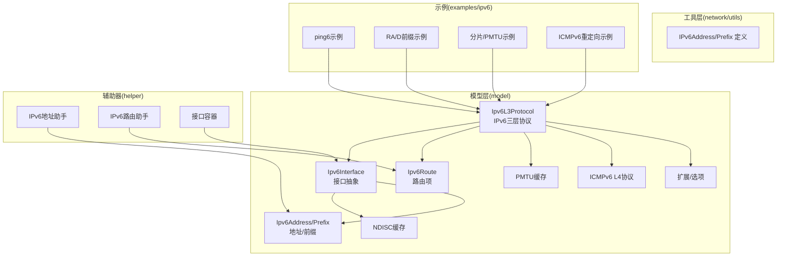
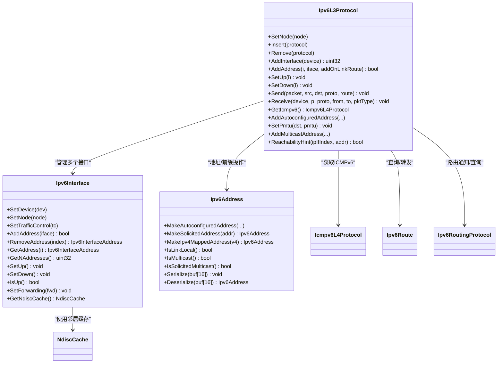
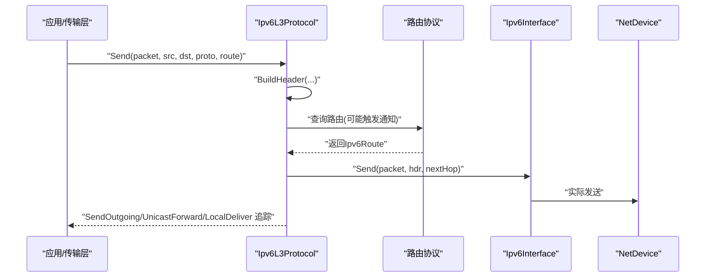
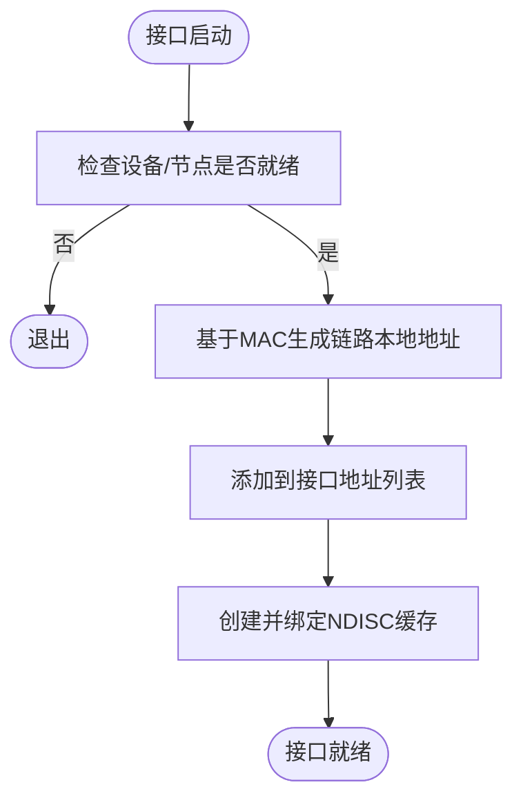
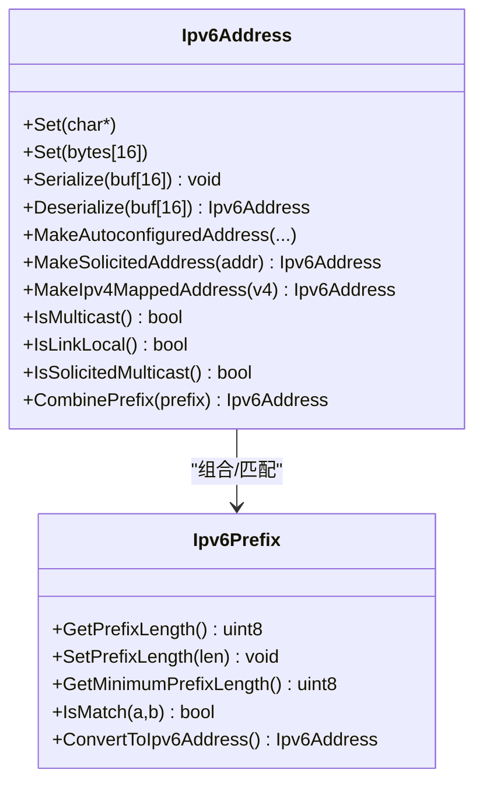
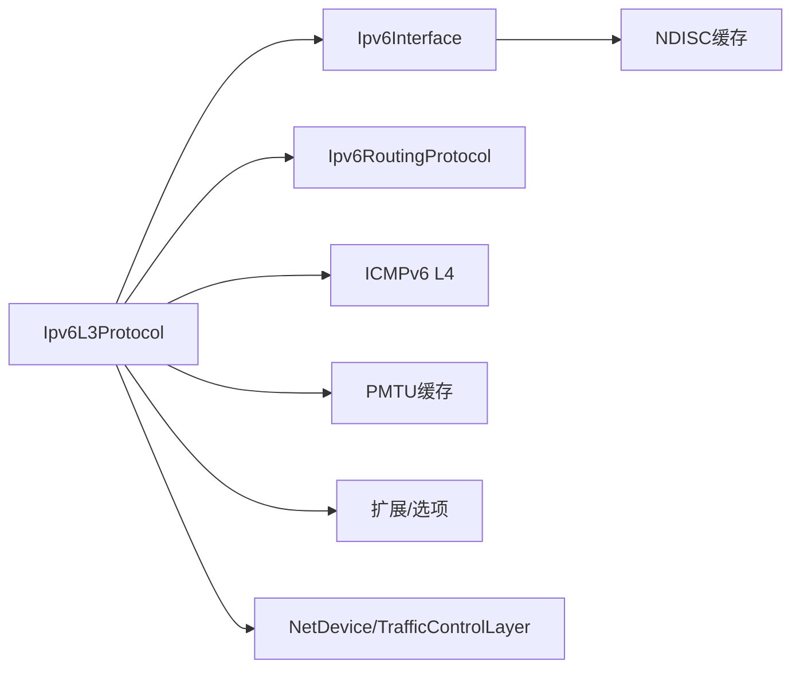

# IPv6网络层

<cite>
**本文引用的文件**
- [ipv6-l3-protocol.h](file://simulator/ns-3.39/src/internet/model/ipv6-l3-protocol.h)
- [ipv6-l3-protocol.cc](file://simulator/ns-3.39/src/internet/model/ipv6-l3-protocol.cc)
- [ipv6-interface.h](file://simulator/ns-3.39/src/internet/model/ipv6-interface.h)
- [ipv6-interface.cc](file://simulator/ns-3.39/src/internet/model/ipv6-interface.cc)
- [ipv6-address.h](file://simulator/ns-3.39/src/network/utils/ipv6-address.h)
- [ipv6-interface-address.h](file://simulator/ns-3.39/src/internet/model/ipv6-interface-address.h)
- [icmpv6-l4-protocol.h](file://simulator/ns-3.39/src/internet/model/icmpv6-l4-protocol.h)
- [ndisc-cache.h](file://simulator/ns-3.39/src/internet/model/ndisc-cache.h)
- [ipv6-header.h](file://simulator/ns-3.39/src/network/model/ipv6-header.h)
- [ipv6-pmtu-cache.h](file://simulator/ns-3.39/src/internet/model/ipv6-pmtu-cache.h)
- [ipv6-routing-protocol.h](file://simulator/ns-3.39/src/internet/model/ipv6-routing-protocol.h)
- [ipv6-route.h](file://simulator/ns-3.39/src/internet/model/ipv6-route.h)
- [ipv6-extension.h](file://simulator/ns-3.39/src/internet/model/ipv6-extension.h)
- [ipv6-extension-demux.h](file://simulator/ns-3.39/src/internet/model/ipv6-extension-demux.h)
- [ipv6-option.h](file://simulator/ns-3.39/src/internet/model/ipv6-option.h)
- [ipv6-option-demux.h](file://simulator/ns-3.39/src/internet/model/ipv6-option-demux.h)
- [ipv6-raw-socket-impl.h](file://simulator/ns-3.39/src/internet/model/ipv6-raw-socket-impl.h)
- [ipv6-raw-socket-factory-impl.h](file://simulator/ns-3.39/src/internet/model/ipv6-raw-socket-factory-impl.h)
- [ipv6-end-point.h](file://simulator/ns-3.39/src/internet/model/ipv6-end-point.h)
- [ipv6-end-point-demux.h](file://simulator/ns-3.39/src/internet/model/ipv6-end-point-demux.h)
- [ipv6-flow-classifier.cc](file://simulator/ns-3.39/src/flow-monitor/model/ipv6-flow-classifier.cc)
- [ipv6-flow-probe.cc](file://simulator/ns-3.39/src/flow-monitor/model/ipv6-flow-probe.cc)
- [ipv6-address-helper.cc](file://simulator/ns-3.39/src/internet/helper/ipv6-address-helper.cc)
- [ipv6-list-routing-helper.cc](file://simulator/ns-3.39/src/internet/helper/ipv6-list-routing-helper.cc)
- [ipv6-routing-helper.cc](file://simulator/ns-3.39/src/internet/helper/ipv6-routing-helper.cc)
- [ipv6-static-routing-helper.cc](file://simulator/ns-3.39/src/internet/helper/ipv6-static-routing-helper.cc)
- [ipv6-interface-container.cc](file://simulator/ns-3.39/src/internet/helper/ipv6-interface-container.cc)
- [neighbor-cache-helper.cc](file://simulator/ns-3.39/src/internet/helper/neighbor-cache-helper.cc)
- [test-ipv6.cc](file://simulator/ns-3.39/examples/ipv6/test-ipv6.cc)
- [ping6-example.cc](file://simulator/ns-3.39/examples/ipv6/ping6-example.cc)
- [radvd-one-prefix.cc](file://simulator/ns-3.39/examples/ipv6/radvd-one-prefix.cc)
- [radvd-two-prefix.cc](file://simulator/ns-3.39/examples/ipv6/radvd-two-prefix.cc)
- [icmpv6-redirect.cc](file://simulator/ns-3.39/examples/ipv6/icmpv6-redirect.cc)
- [fragmentation-ipv6.cc](file://simulator/ns-3.39/examples/ipv6/fragmentation-ipv6.cc)
- [fragmentation-ipv6-PMTU.cc](file://simulator/ns-3.39/examples/ipv6/fragmentation-ipv6-PMTU.cc)
- [fragmentation-ipv6-two-MTU.cc](file://simulator/ns-3.39/examples/ipv6/fragmentation-ipv6-two-MTU.cc)
- [loose-routing-ipv6.cc](file://simulator/ns-3.39/examples/ipv6/loose-routing-ipv6.cc)
- [wsn-ping6.cc](file://simulator/ns-3.39/examples/ipv6/wsn-ping6.cc)
- [socket-options-ipv6.cc](file://simulator/ns-3.39/examples/socket/socket-options-ipv6.cc)
</cite>

## 目录
1. [简介](#简介)
2. [项目结构](#项目结构)
3. [核心组件](#核心组件)
4. [架构总览](#架构总览)
5. [详细组件分析](#详细组件分析)
6. [依赖关系分析](#依赖关系分析)
7. [性能考虑](#性能考虑)
8. [故障排查指南](#故障排查指南)
9. [结论](#结论)
10. [附录：配置与示例](#附录配置与示例)

## 简介
本文件面向NS-3 IPv6网络层的使用者与开发者，系统化梳理并解释IPv6L3Protocol类的实现与职责，包括IPv6数据包处理流程、路由决策、邻居发现（NDISC）、ICMPv6功能；同时详解IPv6Interface接口设计及其地址/多播/邻居缓存管理；并深入解析IPv6Address与前缀管理机制。文档还提供IPv6网络配置、路由设置、邻居发现的实践示例，并讨论IPv6向后兼容性与迁移策略。

## 项目结构
NS-3的IPv6实现位于internet模型与网络工具模块中，核心文件组织如下：
- 模型层（model）：包含IPv6L3协议栈、接口、地址、扩展/选项、PMTU缓存、路由协议接口、ICMPv6、NDISC缓存等
- 工具层（network/utils）：包含IPv6地址与前缀类型定义
- 辅助器（helper）：提供地址/路由/接口容器等高层封装
- 示例（examples/ipv6）：覆盖基本连通性、路由器重定向、分片与PMTU、松散源路由、WSN场景等

图表来源
- [ipv6-l3-protocol.h](file://simulator/ns-3.39/src/internet/model/ipv6-l3-protocol.h)
- [ipv6-interface.h](file://simulator/ns-3.39/src/internet/model/ipv6-interface.h)
- [ipv6-address.h](file://simulator/ns-3.39/src/network/utils/ipv6-address.h)
- [icmpv6-l4-protocol.h](file://simulator/ns-3.39/src/internet/model/icmpv6-l4-protocol.h)
- [ndisc-cache.h](file://simulator/ns-3.39/src/internet/model/ndisc-cache.h)
- [ipv6-routing-protocol.h](file://simulator/ns-3.39/src/internet/model/ipv6-routing-protocol.h)
- [ipv6-route.h](file://simulator/ns-3.39/src/internet/model/ipv6-route.h)
- [ipv6-pmtu-cache.h](file://simulator/ns-3.39/src/internet/model/ipv6-pmtu-cache.h)
- [ipv6-extension.h](file://simulator/ns-3.39/src/internet/model/ipv6-extension.h)
- [ipv6-option.h](file://simulator/ns-3.39/src/internet/model/ipv6-option.h)

章节来源
- [ipv6-l3-protocol.h](file://simulator/ns-3.39/src/internet/model/ipv6-l3-protocol.h)
- [ipv6-interface.h](file://simulator/ns-3.39/src/internet/model/ipv6-interface.h)
- [ipv6-address.h](file://simulator/ns-3.39/src/network/utils/ipv6-address.h)

## 核心组件
- IPv6L3Protocol：IPv6三层协议实现，负责接收/发送、路由选择、接口管理、PMTU、ICMPv6交互、多播注册、邻居可达性提示等
- Ipv6Interface：接口抽象，管理地址列表、转发状态、邻居缓存、可达时间参数等
- Ipv6Address/Prefix：地址与前缀类型，提供自动配置、映射、范围判断、序列化/反序列化等能力
- Ipv6InterfaceAddress：接口地址实体，含状态、作用域、on-link属性、DAD UID等
- ICMPv6与NDISC：邻居发现、可达性确认、重复地址检测（DAD）
- 路由协议接口：与上层路由协议协作进行路由表维护与通知

章节来源
- [ipv6-l3-protocol.h](file://simulator/ns-3.39/src/internet/model/ipv6-l3-protocol.h)
- [ipv6-l3-protocol.cc](file://simulator/ns-3.39/src/internet/model/ipv6-l3-protocol.cc)
- [ipv6-interface.h](file://simulator/ns-3.39/src/internet/model/ipv6-interface.h)
- [ipv6-interface.cc](file://simulator/ns-3.39/src/internet/model/ipv6-interface.cc)
- [ipv6-address.h](file://simulator/ns-3.39/src/network/utils/ipv6-address.h)
- [ipv6-interface-address.h](file://simulator/ns-3.39/src/internet/model/ipv6-interface-address.h)
- [icmpv6-l4-protocol.h](file://simulator/ns-3.39/src/internet/model/icmpv6-l4-protocol.h)
- [ndisc-cache.h](file://simulator/ns-3.39/src/internet/model/ndisc-cache.h)

## 架构总览
IPv6L3Protocol作为L3协议，向上提供IPv6接口（如AddInterface/AddAddress/SetUp等），向下连接各NetDevice与TrafficControlLayer，通过路由协议进行转发决策，并与ICMPv6/NDISC协同完成邻居管理与可达性控制。

图表来源
- [ipv6-l3-protocol.h](file://simulator/ns-3.39/src/internet/model/ipv6-l3-protocol.h)
- [ipv6-interface.h](file://simulator/ns-3.39/src/internet/model/ipv6-interface.h)
- [ipv6-address.h](file://simulator/ns-3.39/src/network/utils/ipv6-address.h)
- [icmpv6-l4-protocol.h](file://simulator/ns-3.39/src/internet/model/icmpv6-l4-protocol.h)
- [ndisc-cache.h](file://simulator/ns-3.39/src/internet/model/ndisc-cache.h)
- [ipv6-route.h](file://simulator/ns-3.39/src/internet/model/ipv6-route.h)
- [ipv6-routing-protocol.h](file://simulator/ns-3.39/src/internet/model/ipv6-routing-protocol.h)

## 详细组件分析

### IPv6L3Protocol 类：三层协议实现
- 关键职责
  - 接口生命周期管理：AddInterface、SetUp/Down、IsUp、SetForwarding
  - 地址管理：AddAddress、RemoveAddress、GetAddress、GetNAddresses
  - 数据包处理：Receive（从设备接收）、Send（生成并发送）、LocalDeliver（本地投递）、IpForward/IpMulticastForward（转发）
  - 路由集成：SetRoutingProtocol、GetRoutingProtocol、NotifyAdd/RemoveRoute
  - PMTU：SetPmtu、GetMtu、PMTU缓存
  - 多播：AddMulticastAddress、RemoveMulticastAddress、IsRegisteredMulticastAddress
  - 邻居：AddAutoconfiguredAddress、RemoveAutoconfiguredAddress、ReachabilityHint
  - 可达性提示：向邻居缓存提供可达性证据，提升NCE可达时间或置为REACHABLE
  - 扩展/选项：RegisterExtensions、RegisterOptions
  - 事件追踪：Tx/Rx/Drop/SendOutgoing/UnicastForward/LocalDeliver回调

- 数据结构与容器
  - 接口列表、设备到接口索引映射、L4协议映射、原始套接字列表、自动配置前缀列表、多播地址注册表

- 关键流程
  - 发送路径：构建IPv6头 → 选择路由 → 发送到接口 → 触发SendOutgoing/UnicastForward/LocalDeliver追踪
  - 接收路径：从NetDevice接收 → 解析IPv6头 → 路由查找/多播检查 → 本地投递或转发 → 触发Rx/Tx/Drop追踪

图表来源
- [ipv6-l3-protocol.cc](file://simulator/ns-3.39/src/internet/model/ipv6-l3-protocol.cc)
- [ipv6-interface.h](file://simulator/ns-3.39/src/internet/model/ipv6-interface.h)
- [ipv6-header.h](file://simulator/ns-3.39/src/network/model/ipv6-header.h)
- [ipv6-route.h](file://simulator/ns-3.39/src/internet/model/ipv6-route.h)

章节来源
- [ipv6-l3-protocol.h](file://simulator/ns-3.39/src/internet/model/ipv6-l3-protocol.h)
- [ipv6-l3-protocol.cc](file://simulator/ns-3.39/src/internet/model/ipv6-l3-protocol.cc)

### Ipv6Interface 类：接口抽象与邻居管理
- 关键职责
  - 设备/节点绑定：SetDevice/SetNode/SetTrafficControl
  - 接口状态：SetUp/SetDown/IsUp/IsForwarding/SetForwarding
  - 地址管理：AddAddress/RemoveAddress/GetAddress/GetNAddresses/GetAddressMatchingDestination
  - 链路本地地址与“被请求多播”地址：GetLinkLocalAddress/IsSolicitedMulticastAddress
  - 邻居缓存：GetNdiscCache、回调注册（添加/移除地址时同步邻居缓存）
  - 可达性参数：SetCurHopLimit/SetBaseReachableTime/SetReachableTime/SetRetransTimer

- 自动配置链路本地地址
  - 在接口启动时，基于设备MAC自动生成链路本地地址，并建立NDISC缓存

图表来源
- [ipv6-interface.cc](file://simulator/ns-3.39/src/internet/model/ipv6-interface.cc)
- [ndisc-cache.h](file://simulator/ns-3.39/src/internet/model/ndisc-cache.h)

章节来源
- [ipv6-interface.h](file://simulator/ns-3.39/src/internet/model/ipv6-interface.h)
- [ipv6-interface.cc](file://simulator/ns-3.39/src/internet/model/ipv6-interface.cc)

### IPv6Address 与前缀管理：地址与多播/映射
- 地址能力
  - 构造/拷贝/序列化/反序列化
  - 自动配置：基于MAC生成全局/链路本地地址（EUI-64相关规范）
  - 多播判定：IsMulticast/IsLinkLocalMulticast/IsAllNodesMulticast/IsAllRoutersMulticast/IsSolicitedMulticast
  - 映射：IPv4映射地址、回环、任意地址、全1地址
  - 前缀匹配：HasPrefix/CombinePrefix
  - 输出/转换：Print/ConvertTo/ConvertFrom/IsInitialized

- 前缀能力
  - 字符串/字节数组构造、位数前缀构造
  - 匹配/打印/转换为地址
  - 最小前缀长度计算

图表来源
- [ipv6-address.h](file://simulator/ns-3.39/src/network/utils/ipv6-address.h)

章节来源
- [ipv6-address.h](file://simulator/ns-3.39/src/network/utils/ipv6-address.h)

### 邻居发现与可达性（NDISC/ICMPv6）
- 邻居发现缓存
  - Ipv6Interface持有NdiscCache指针，用于存储邻居可达状态、重传定时器、可达时间等
- DAD（重复地址检测）
  - 添加地址时触发，可按配置立即执行或延时执行
- 可达性提示
  - L4/L7协议可通过ReachabilityHint告知L3某地址已可达，从而更新NCE状态

章节来源
- [ipv6-interface.cc](file://simulator/ns-3.39/src/internet/model/ipv6-interface.cc)
- [ndisc-cache.h](file://simulator/ns-3.39/src/internet/model/ndisc-cache.h)
- [icmpv6-l4-protocol.h](file://simulator/ns-3.39/src/internet/model/icmpv6-l4-protocol.h)
- [ipv6-l3-protocol.h](file://simulator/ns-3.39/src/internet/model/ipv6-l3-protocol.h)

### 扩展/选项与原始套接字
- 扩展与选项
  - 支持扩展头与选项的注册与分发（例如松散源路由等）
- 原始套接字
  - 提供原始IPv6套接字工厂，允许上层直接构造/发送IPv6报文

章节来源
- [ipv6-extension.h](file://simulator/ns-3.39/src/internet/model/ipv6-extension.h)
- [ipv6-extension-demux.h](file://simulator/ns-3.39/src/internet/model/ipv6-extension-demux.h)
- [ipv6-option.h](file://simurator/ns-3.39/src/internet/model/ipv6-option.h)
- [ipv6-option-demux.h](file://simulator/ns-3.39/src/internet/model/ipv6-option-demux.h)
- [ipv6-raw-socket-factory-impl.h](file://simulator/ns-3.39/src/internet/model/ipv6-raw-socket-factory-impl.h)
- [ipv6-raw-socket-impl.h](file://simulator/ns-3.39/src/internet/model/ipv6-raw-socket-impl.h)

## 依赖关系分析
- 组件耦合
  - Ipv6L3Protocol与Ipv6Interface强耦合：前者管理后者集合，后者承载地址/NDISC/转发状态
  - Ipv6L3Protocol与路由协议弱耦合：通过接口通知地址/路由变更
  - Ipv6L3Protocol与ICMPv6/NDISC：用于邻居管理、可达性、自动配置前缀
- 外部依赖
  - NetDevice/LoopbackNetDevice、TrafficControlLayer、Node对象
  - 日志与仿真器（Simulator）用于DAD定时器调度

图表来源
- [ipv6-l3-protocol.cc](file://simulator/ns-3.39/src/internet/model/ipv6-l3-protocol.cc)
- [ipv6-interface.cc](file://simulator/ns-3.39/src/internet/model/ipv6-interface.cc)
- [icmpv6-l4-protocol.h](file://simulator/ns-3.39/src/internet/model/icmpv6-l4-protocol.h)
- [ndisc-cache.h](file://simulator/ns-3.39/src/internet/model/ndisc-cache.h)
- [ipv6-pmtu-cache.h](file://simulator/ns-3.39/src/internet/model/ipv6-pmtu-cache.h)
- [ipv6-extension.h](file://simulator/ns-3.39/src/internet/model/ipv6-extension.h)
- [ipv6-option.h](file://simulator/ns-3.39/src/internet/model/ipv6-option.h)

章节来源
- [ipv6-l3-protocol.cc](file://simulator/ns-3.39/src/internet/model/ipv6-l3-protocol.cc)
- [ipv6-interface.cc](file://simulator/ns-3.39/src/internet/model/ipv6-interface.cc)

## 性能考虑
- MTU与PMTU
  - 当未启用路径MTU发现时，默认返回最小MTU（1280），以保证IPv6链路兼容性
  - 启用PMTU发现时，接口MTU由底层设备决定
- 路由通知
  - 地址/前缀变化会触发路由协议通知，避免频繁重建路由表
- 邻居缓存
  - 合理设置可达时间与重传定时器，减少不必要的NS/NA交互
- 追踪回调
  - Tx/Rx/Drop/SendOutgoing等回调在高负载下可能带来开销，建议按需启用

## 故障排查指南
- 常见问题与定位
  - 接口无法UP：检查设备MTU是否小于1280，或节点/设备对象未正确聚合
  - 地址冲突：DAD失败会导致INVALID状态，需检查MAC/前缀配置
  - 多播未到达：确认AddMulticastAddress/RemoveMulticastAddress调用与接口参数
  - 分片/PMTU异常：检查SetPmtu与GetMtuDiscover配置，以及分片/重传定时器
- 关键日志与追踪
  - 使用SendOutgoing/UnicastForward/LocalDeliver/Tx/Rx/Drop追踪定位丢包原因
  - 通过ReportDrop与DropReason区分TTL过期、无路由、未知协议、分片超时等

章节来源
- [ipv6-l3-protocol.cc](file://simulator/ns-3.39/src/internet/model/ipv6-l3-protocol.cc)
- [ipv6-l3-protocol.h](file://simulator/ns-3.39/src/internet/model/ipv6-l3-protocol.h)

## 结论
NS-3的IPv6网络层以Ipv6L3Protocol为核心，结合Ipv6Interface、ICMPv6/NDISC、路由协议与PMTU缓存，提供了完整的IPv6数据面与控制面能力。通过清晰的接口抽象与丰富的追踪回调，用户可以灵活地进行网络配置、路由设置与邻居管理，同时满足从基础连通到复杂场景（如分片/PMTU、路由器重定向、松散源路由）的仿真需求。

## 附录：配置与示例

### IPv6网络配置与路由设置
- 基本配置
  - 通过InternetStackHelper安装IPv6栈，随后对节点调用Ipv6L3Protocol接口添加接口与地址
  - 使用Ipv6AddressHelper批量分配地址，或手动AddAddress
- 路由设置
  - 设置静态/动态路由协议，或使用列表路由组合多协议
  - 通过NotifyAddRoute/NotifyRemoveRoute通知地址/前缀变化

章节来源
- [ipv6-address-helper.cc](file://simulator/ns-3.39/src/internet/helper/ipv6-address-helper.cc)
- [ipv6-list-routing-helper.cc](file://simulator/ns-3.39/src/internet/helper/ipv6-list-routing-helper.cc)
- [ipv6-routing-helper.cc](file://simulator/ns-3.39/src/internet/helper/ipv6-routing-helper.cc)
- [ipv6-static-routing-helper.cc](file://simulator/ns-3.39/src/internet/helper/ipv6-static-routing-helper.cc)

### 邻居发现与可达性
- 自动配置前缀
  - 使用AddAutoconfiguredAddress根据RA提供的前缀/标志生成地址，并维护有效/首选计时器
- 可达性提示
  - L4/L7协议在确认可达后调用ReachabilityHint，加速邻居状态收敛

章节来源
- [ipv6-l3-protocol.cc](file://simulator/ns-3.39/src/internet/model/ipv6-l3-protocol.cc)
- [ipv6-interface.cc](file://simulator/ns-3.39/src/internet/model/ipv6-interface.cc)

### 示例参考
- 基本连通性与测试
  - [test-ipv6.cc](file://simulator/ns-3.39/examples/ipv6/test-ipv6.cc)
  - [ping6-example.cc](file://simulator/ns-3.39/examples/ipv6/ping6-example.cc)
- 路由器通告与前缀
  - [radvd-one-prefix.cc](file://simulator/ns-3.39/examples/ipv6/radvd-one-prefix.cc)
  - [radvd-two-prefix.cc](file://simulator/ns-3.39/examples/ipv6/radvd-two-prefix.cc)
- 路由器重定向
  - [icmpv6-redirect.cc](file://simulator/ns-3.39/examples/ipv6/icmpv6-redirect.cc)
- 分片与PMTU
  - [fragmentation-ipv6.cc](file://simulator/ns-3.39/examples/ipv6/fragmentation-ipv6.cc)
  - [fragmentation-ipv6-PMTU.cc](file://simulator/ns-3.39/examples/ipv6/fragmentation-ipv6-PMTU.cc)
  - [fragmentation-ipv6-two-MTU.cc](file://simulator/ns-3.39/examples/ipv6/fragmentation-ipv6-two-MTU.cc)
- 松散源路由
  - [loose-routing-ipv6.cc](file://simulator/ns-3.39/examples/ipv6/loose-routing-ipv6.cc)
- 无线传感器网络（WSN）
  - [wsn-ping6.cc](file://simulator/ns-3.39/examples/ipv6/wsn-ping6.cc)
- 套接字选项
  - [socket-options-ipv6.cc](file://simulator/ns-3.39/examples/socket/socket-options-ipv6.cc)

### IPv6向后兼容性与迁移策略
- IPv4映射地址
  - Ipv6Address提供MakeIpv4MappedAddress与GetIpv4MappedAddress，便于IPv4/IPv6共存场景
- 最小MTU约束
  - 默认MTU为1280，确保跨链路兼容；若设备MTU不足，接口将保持DOWN状态
- 迁移建议
  - 优先采用链路本地自动配置与RA前缀，逐步引入全局前缀
  - 使用ReachabilityHint优化移动场景下的邻居收敛
  - 对高负载场景启用必要的追踪回调，避免过度开销

章节来源
- [ipv6-address.h](file://simulator/ns-3.39/src/network/utils/ipv6-address.h)
- [ipv6-l3-protocol.cc](file://simulator/ns-3.39/src/internet/model/ipv6-l3-protocol.cc)