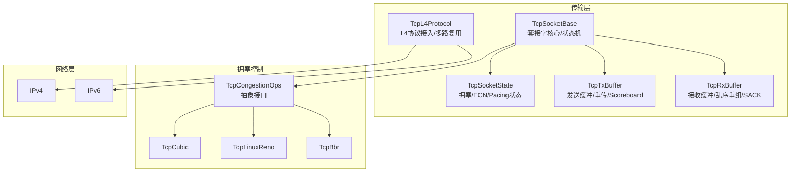
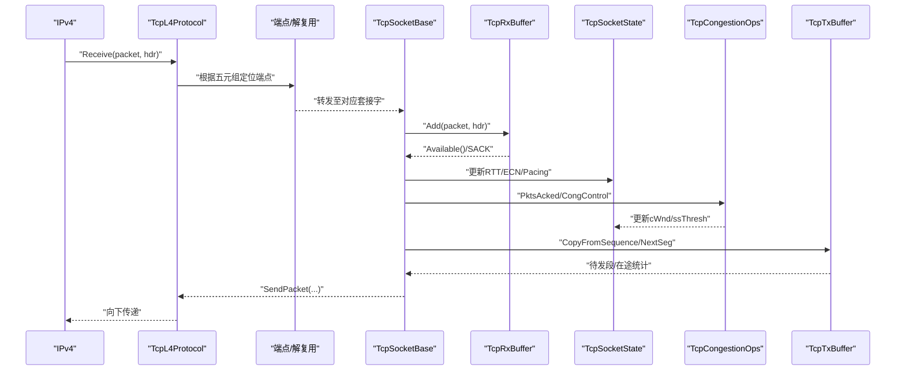
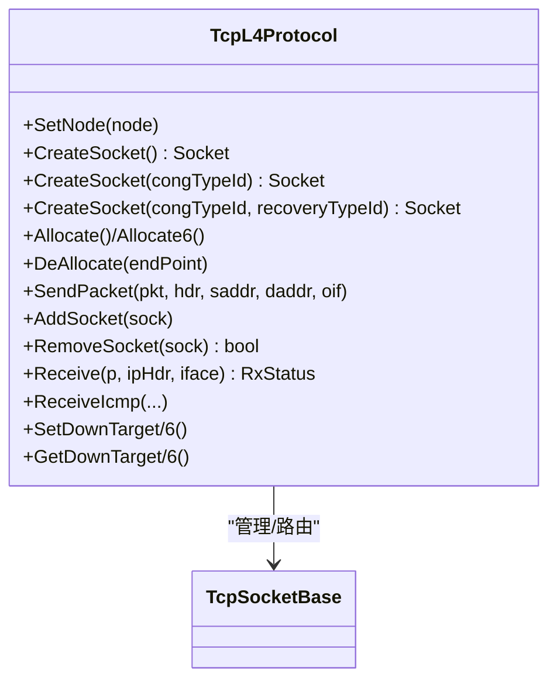
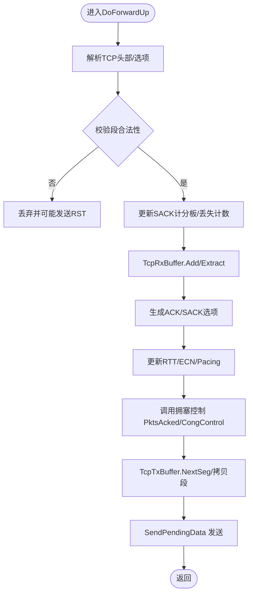
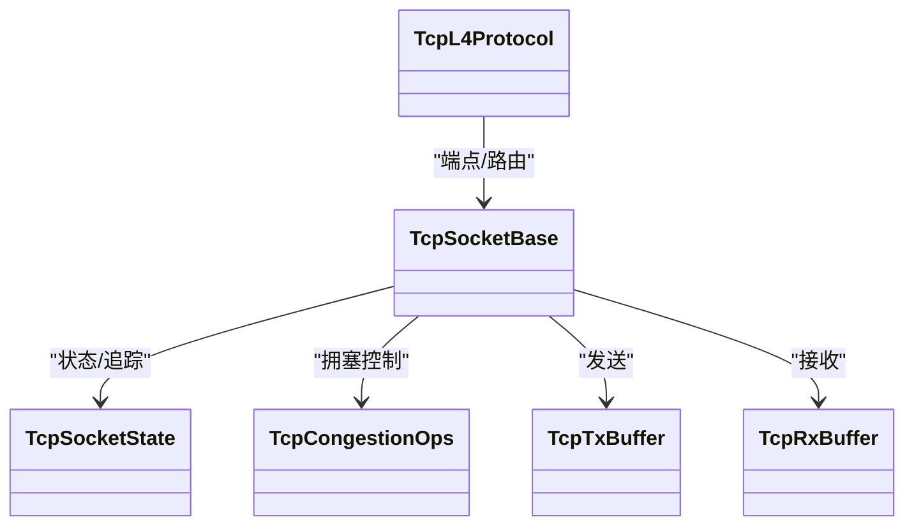

# TCP传输层

<cite>
**本文引用的文件**
- [tcp-l4-protocol.h](file://simulator/ns-3.39/src/internet/model/tcp-l4-protocol.h)
- [tcp-socket-base.h](file://simulator/ns-3.39/src/internet/model/tcp-socket-base.h)
- [tcp-congestion-ops.h](file://simulator/ns-3.39/src/internet/model/tcp-congestion-ops.h)
- [tcp-cubic.h](file://simulator/ns-3.39/src/internet/model/tcp-cubic.h)
- [tcp-bbr.h](file://simulator/ns-3.39/src/internet/model/tcp-bbr.h)
- [tcp-linux-reno.h](file://simulator/ns-3.39/src/internet/model/tcp-linux-reno.h)
- [tcp-socket.h](file://simulator/ns-3.39/src/internet/model/tcp-socket.h)
- [tcp-socket-state.h](file://simulator/ns-3.39/src/internet/model/tcp-socket-state.h)
- [tcp-tx-buffer.h](file://simulator/ns-3.39/src/internet/model/tcp-tx-buffer.h)
- [tcp-rx-buffer.h](file://simulator/ns-3.39/src/internet/model/tcp-rx-buffer.h)
</cite>

## 目录
1. [简介](#简介)
2. [项目结构](#项目结构)
3. [核心组件](#核心组件)
4. [架构总览](#架构总览)
5. [详细组件分析](#详细组件分析)
6. [依赖关系分析](#依赖关系分析)
7. [性能考量](#性能考量)
8. [故障排查指南](#故障排查指南)
9. [结论](#结论)
10. [附录：使用与配置示例路径](#附录使用与配置示例路径)

## 简介
本文件系统化梳理NS-3中TCP传输层的实现与API，重点覆盖以下方面：
- TcpL4Protocol类：端到端连接管理、多路复用/解复用、套接字生命周期管理、与IP层交互。
- TcpSocketBase类：套接字接口、状态机、事件回调、发送/接收缓冲区、RTT估算、丢包与快速重传处理。
- 拥塞控制算法：Cubic、Linux Reno、BBR等，解释其核心思想、适用场景与可配置项。
- 数据面流程：连接建立、数据收发、流量控制、拥塞控制更新、SACK与RTT采样。
- 性能调优与高级特性：拥塞控制算法切换、RTT估计器选择、ECN、Pacing、初始窗口、DelAck策略等。

## 项目结构
NS-3的TCP位于internet模块的model子目录，核心文件如下：
- 传输层协议适配：TcpL4Protocol（L4协议栈接入）
- 套接字抽象：TcpSocket、TcpSocketBase（应用接口与核心状态）
- 拥塞控制框架：TcpCongestionOps及其具体实现（Cubic、Linux Reno、BBR等）
- 缓冲区：TcpTxBuffer（发送）、TcpRxBuffer（接收）
- 状态与追踪：TcpSocketState（拥塞窗口、慢启动阈值、RTT、ECN、Pacing等）

图示来源
- [tcp-l4-protocol.h:80-384](file://simulator/ns-3.39/src/internet/model/tcp-l4-protocol.h#L80-L384)
- [tcp-socket-base.h:218-800](file://simulator/ns-3.39/src/internet/model/tcp-socket-base.h#L218-L800)
- [tcp-congestion-ops.h:55-272](file://simulator/ns-3.39/src/internet/model/tcp-congestion-ops.h#L55-L272)
- [tcp-cubic.h:69-182](file://simulator/ns-3.39/src/internet/model/tcp-cubic.h#L69-L182)
- [tcp-bbr.h:44-408](file://simulator/ns-3.39/src/internet/model/tcp-bbr.h#L44-L408)
- [tcp-linux-reno.h:39-86](file://simulator/ns-3.39/src/internet/model/tcp-linux-reno.h#L39-L86)
- [tcp-tx-buffer.h:122-646](file://simulator/ns-3.39/src/internet/model/tcp-tx-buffer.h#L122-L646)
- [tcp-rx-buffer.h:74-239](file://simulator/ns-3.39/src/internet/model/tcp-rx-buffer.h#L74-L239)

章节来源
- [tcp-l4-protocol.h:80-384](file://simulator/ns-3.39/src/internet/model/tcp-l4-protocol.h#L80-L384)
- [tcp-socket-base.h:218-800](file://simulator/ns-3.39/src/internet/model/tcp-socket-base.h#L218-L800)
- [tcp-congestion-ops.h:55-272](file://simulator/ns-3.39/src/internet/model/tcp-congestion-ops.h#L55-L272)

## 核心组件
- TcpL4Protocol：负责节点级TCP实例、端点分配与回收、上行分发与下行发送、ICMP回显处理、向下层IP的回调设置。
- TcpSocketBase：面向应用的套接字接口，封装连接状态机、RTT估计、丢包与快速重传、SACK、ECN、Pacing、发送/接收缓冲区。
- TcpSocket/TcpSocketState：定义TCP状态枚举、拥塞状态机、ECN状态机、Pacing参数、RTT与字节在途统计等。
- TcpCongestionOps及其实现：Cubic、Linux Reno、BBR等算法的接口与实现，支持按需安装与切换。
- TcpTxBuffer/TcpRxBuffer：发送侧的有序段集合、重传/丢失标记、SACK计分板；接收侧的乱序重组与SACK列表生成。

章节来源
- [tcp-l4-protocol.h:80-384](file://simulator/ns-3.39/src/internet/model/tcp-l4-protocol.h#L80-L384)
- [tcp-socket-base.h:218-800](file://simulator/ns-3.39/src/internet/model/tcp-socket-base.h#L218-L800)
- [tcp-socket.h:47-268](file://simulator/ns-3.39/src/internet/model/tcp-socket.h#L47-L268)
- [tcp-socket-state.h:42-308](file://simulator/ns-3.39/src/internet/model/tcp-socket-state.h#L42-L308)
- [tcp-congestion-ops.h:55-272](file://simulator/ns-3.39/src/internet/model/tcp-congestion-ops.h#L55-L272)
- [tcp-tx-buffer.h:122-646](file://simulator/ns-3.39/src/internet/model/tcp-tx-buffer.h#L122-L646)
- [tcp-rx-buffer.h:74-239](file://simulator/ns-3.39/src/internet/model/tcp-rx-buffer.h#L74-L239)

## 架构总览
下图展示从IP层到套接字、再到拥塞控制与缓冲区的数据通路与职责边界：

图示来源
- [tcp-l4-protocol.h:261-290](file://simulator/ns-3.39/src/internet/model/tcp-l4-protocol.h#L261-L290)
- [tcp-socket-base.h:727-799](file://simulator/ns-3.39/src/internet/model/tcp-socket-base.h#L727-L799)
- [tcp-tx-buffer.h:261-320](file://simulator/ns-3.39/src/internet/model/tcp-tx-buffer.h#L261-L320)
- [tcp-rx-buffer.h:151-177](file://simulator/ns-3.39/src/internet/model/tcp-rx-buffer.h#L151-L177)
- [tcp-congestion-ops.h:106-131](file://simulator/ns-3.39/src/internet/model/tcp-congestion-ops.h#L106-L131)

## 详细组件分析

### TcpL4Protocol 类
- 职责
  - 节点聚合与向下层回调注册（IPv4/IPv6）。
  - 端点分配与回收（IPv4/IPv6），用于多路复用/解复用。
  - 上行分发：将来自IP层的TCP报文交由对应TcpSocketBase处理。
  - 下行发送：将套接字生成的TCP报文发送到IP层。
  - 无端点时的RST回复逻辑。
- 关键API
  - CreateSocket/带拥塞控制类型构造、AddSocket/RemoveSocket维护套接字集合。
  - Allocate/DeAllocate端点分配与回收。
  - SendPacket/Receive/ReceiveIcmp等。
- 设计要点
  - 使用unordered_map维护socket索引，支持动态增删。
  - 分别为IPv4/IPv6提供SendPacketV4/V6与Receive重载。
  - 通过DownTarget回调链路与IP层对接。

图示来源
- [tcp-l4-protocol.h:101-290](file://simulator/ns-3.39/src/internet/model/tcp-l4-protocol.h#L101-L290)

章节来源
- [tcp-l4-protocol.h:80-384](file://simulator/ns-3.39/src/internet/model/tcp-l4-protocol.h#L80-L384)

### TcpSocketBase 类
- 职责
  - 面向应用的套接字接口：Bind/Connect/Listen/Close/ShutDown等。
  - 连接状态机：LISTEN、SYN_SENT、SYN_RCVD、ESTABLISHED、CLOSE_WAIT、FIN_WAIT_*、TIME_WAIT等。
  - 数据面：ForwardUp/DoForwardUp处理上行数据；SendPendingData驱动发送。
  - 控制面：RTT估计、丢包检测（DupAck/SACK）、快速重传/恢复、ECN处理。
  - 缓冲区：发送/接收缓冲区管理，SACK计分板与在途统计。
- 关键机制
  - 快速重传/快速恢复：基于DupAck阈值与SACK信息。
  - Pacing：按速率限制发送，支持慢启动/拥塞避免阶段比例。
  - ECN：ECT/CE标记、ECE/CWR处理与状态机。
  - DelAck：延迟ACK超时与计数策略。
- 可观测性
  - 大量TracedValue回调用于跟踪cWnd、ssThresh、bytesInFlight、lastRtt、nextTxSequence等。

图示来源
- [tcp-socket-base.h:727-799](file://simulator/ns-3.39/src/internet/model/tcp-socket-base.h#L727-L799)
- [tcp-tx-buffer.h:298-320](file://simulator/ns-3.39/src/internet/model/tcp-tx-buffer.h#L298-L320)
- [tcp-rx-buffer.h:151-177](file://simulator/ns-3.39/src/internet/model/tcp-rx-buffer.h#L151-L177)
- [tcp-congestion-ops.h:106-131](file://simulator/ns-3.39/src/internet/model/tcp-congestion-ops.h#L106-L131)

章节来源
- [tcp-socket-base.h:218-800](file://simulator/ns-3.39/src/internet/model/tcp-socket-base.h#L218-L800)
- [tcp-socket.h:65-95](file://simulator/ns-3.39/src/internet/model/tcp-socket.h#L65-L95)
- [tcp-socket-state.h:42-308](file://simulator/ns-3.39/src/internet/model/tcp-socket-state.h#L42-L308)

### 拥塞控制算法

#### TcpCongestionOps 抽象与接口
- 核心方法
  - GetSsThresh：计算RTO后或SACK重估后的慢启动阈值。
  - IncreaseWindow：拥塞避免阶段对cWnd的更新。
  - PktsAcked：ACK到达时的时机信息回调。
  - CongestionStateSet/CwndEvent：状态切换与事件通知。
  - CongControl（可选）：Linux风格的“cong_control”式反馈驱动更新。
- 设计理念
  - 将拥塞控制与套接字分离，通过指针注入，便于插拔与对比实验。

章节来源
- [tcp-congestion-ops.h:55-272](file://simulator/ns-3.39/src/internet/model/tcp-congestion-ops.h#L55-L272)

#### TcpCubic（CUBIC）
- 特点
  - 基于时间的窗口增长函数，独立于RTT，提升公平性与稳定性。
  - 支持HyStart混合慢启动，抑制慢启动超调。
  - 参数：C（缩放因子）、Beta、HyStart检测模式与阈值、epoch/round计数等。
- 典型适用
  - 高带宽长肥管道、跨域大时延网络，追求吞吐稳定与公平。

章节来源
- [tcp-cubic.h:69-182](file://simulator/ns-3.39/src/internet/model/tcp-cubic.h#L69-L182)

#### TcpLinuxReno（Linux Reno）
- 特点
  - 经典Reno的Linux内核实现映射：慢启动线性增长、拥塞避免加性增长、快速重传/恢复。
  - 通过SlowStart/CongestionAvoidance虚函数扩展。
- 典型适用
  - 低时延短链路、对实现一致性要求高的对比实验。

章节来源
- [tcp-linux-reno.h:39-86](file://simulator/ns-3.39/src/internet/model/tcp-linux-reno.h#L39-L86)

#### TcpBbr（Broadband/瓶颈带宽与往返时延）
- 特点
  - 基于模型的发送速率控制：Startup/Drain/ProbeBW/ProbeRTT四个阶段。
  - 动态 pacing_gain/cwnd_gain，周期性探测瓶颈带宽与最小RTT。
  - 支持重启/ProbeRTT/恢复/全管检测等复杂状态转换。
- 典型适用
  - 高抖动/高丢包网络、数据中心/长肥管道、需要抑制排队与提升利用率的场景。

章节来源
- [tcp-bbr.h:44-408](file://simulator/ns-3.39/src/internet/model/tcp-bbr.h#L44-L408)

### 缓冲区与SACK/RTT

#### TcpTxBuffer（发送缓冲）
- 能力
  - 应用数据入队、有序段提取、重传/丢失标记、SACK计分板。
  - BytesInFlight精确统计（考虑lost/sacked/retrans）。
  - NextSeg依据SACK/Reno启发式确定下一可发序列。
- 关键点
  - 通过TcpTxItem维护每个已发段的flags与序列信息。
  - 支持SACKless连接的Reno SACK模拟。

章节来源
- [tcp-tx-buffer.h:122-646](file://simulator/ns-3.39/src/internet/model/tcp-tx-buffer.h#L122-L646)

#### TcpRxBuffer（接收缓冲）
- 能力
  - 乱序段缓存、按发送顺序输出、SACK列表生成与清理。
  - Available/Size/MaxBufferSize等容量管理。
- 关键点
  - SACK列表最多4个块，遵循RFC 2018建议长度。

章节来源
- [tcp-rx-buffer.h:74-239](file://simulator/ns-3.39/src/internet/model/tcp-rx-buffer.h#L74-L239)

## 依赖关系分析
- 组件耦合
  - TcpL4Protocol与TcpSocketBase：一对多关系，通过端点与socket索引关联。
  - TcpSocketBase与TcpSocketState：强依赖，前者持有后者以驱动拥塞控制与Pacing。
  - TcpSocketBase与TcpCongestionOps：策略注入，运行期可替换。
  - TcpSocketBase与TcpTxBuffer/TcpRxBuffer：数据面双缓冲，紧密协作。
- 外部依赖
  - IP层回调（DownTarget/DownTarget6）。
  - RTT估计器（RttEstimator）。
  - 随机变量（BBR ProbeRTT等）。

图示来源
- [tcp-l4-protocol.h:337-384](file://simulator/ns-3.39/src/internet/model/tcp-l4-protocol.h#L337-L384)
- [tcp-socket-base.h:218-272](file://simulator/ns-3.39/src/internet/model/tcp-socket-base.h#L218-L272)
- [tcp-socket-state.h:42-108](file://simulator/ns-3.39/src/internet/model/tcp-socket-state.h#L42-L108)
- [tcp-tx-buffer.h:122-168](file://simulator/ns-3.39/src/internet/model/tcp-tx-buffer.h#L122-L168)
- [tcp-rx-buffer.h:74-123](file://simulator/ns-3.39/src/internet/model/tcp-rx-buffer.h#L74-L123)

章节来源
- [tcp-l4-protocol.h:337-384](file://simulator/ns-3.39/src/internet/model/tcp-l4-protocol.h#L337-L384)
- [tcp-socket-base.h:218-272](file://simulator/ns-3.39/src/internet/model/tcp-socket-base.h#L218-L272)

## 性能考量
- 拥塞控制选择
  - 长肥管道/高带宽：优先Cubic或BBR。
  - 低时延/小包：Linux Reno或Cubic均可，结合DelAck策略。
- Pacing与Initial Window
  - 启用Pacing并合理设置pacing_rate与初始窗口，有助于平滑带宽占用与降低排队。
- SACK与RTT
  - 启用SACK可显著提升丢包场景下的恢复效率；RTT估计器应与链路特性匹配。
- ECN
  - 在支持ECN的网络中启用UseEcn，可减少尾丢弃与全局同步。
- DelAck
  - 合理设置DelAckTimeout/DelAckMaxCount，在吞吐与延迟间权衡。

## 故障排查指南
- 常见问题
  - 连接无法建立：检查Bind/Connect返回值、端口占用、端点分配是否成功。
  - 丢包严重导致吞吐低：确认SACK启用、DupAck阈值、拥塞控制算法是否合适。
  - 发送停滞（零窗口）：检查接收窗口、DelAck策略、Probe机制。
  - RTO频繁触发：检查RTT估计、MinRto、ClockGranularity、重传阈值。
- 排查手段
  - 利用TcpSocketState的TracedValue（cWnd、ssThresh、bytesInFlight、lastRtt）观察行为。
  - 通过TcpL4Protocol的NoEndPointsFound逻辑判断是否收到未匹配端点的报文。
  - 检查TcpTxBuffer.BytesInFlight与TcpRxBuffer.Available，定位缓冲区瓶颈。

章节来源
- [tcp-socket-base.h:327-444](file://simulator/ns-3.39/src/internet/model/tcp-socket-base.h#L327-L444)
- [tcp-l4-protocol.h:333-335](file://simulator/ns-3.39/src/internet/model/tcp-l4-protocol.h#L333-L335)
- [tcp-tx-buffer.h:338-350](file://simulator/ns-3.39/src/internet/model/tcp-tx-buffer.h#L338-L350)
- [tcp-rx-buffer.h:130-133](file://simulator/ns-3.39/src/internet/model/tcp-rx-buffer.h#L130-L133)

## 结论
NS-3的TCP实现采用清晰的分层与插件化设计：TcpL4Protocol负责L4接入与端点管理，TcpSocketBase统一了连接状态、RTT/ECN/Pacing与缓冲区，TcpCongestionOps将拥塞控制算法作为可插拔组件。该架构既保证了与Linux内核主流实现的一致性，又提供了丰富的可观测性与可调参空间，适用于从基础教学到高级研究的广泛场景。

## 附录：使用与配置示例路径
以下为常见任务的参考路径（请在相应示例脚本中查找具体用法）：
- 创建TCP套接字与绑定
  - [tcp-socket-base.h:584-607](file://simulator/ns-3.39/src/internet/model/tcp-socket-base.h#L584-L607)
- 连接建立（客户端/服务端）
  - [tcp-socket-base.h:665-686](file://simulator/ns-3.39/src/internet/model/tcp-socket-base.h#L665-L686)
- 发送/接收数据
  - [tcp-socket-base.h:594-601](file://simulator/ns-3.39/src/internet/model/tcp-socket-base.h#L594-L601)
- 设置拥塞控制算法
  - [tcp-l4-protocol.h:114-134](file://simulator/ns-3.39/src/internet/model/tcp-l4-protocol.h#L114-L134)
  - [tcp-congestion-ops.h:448-458](file://simulator/ns-3.39/src/internet/model/tcp-congestion-ops.h#L448-L458)
- 启用/禁用Pacing与Initial Window Pace
  - [tcp-socket-base.h:572-578](file://simulator/ns-3.39/src/internet/model/tcp-socket-base.h#L572-L578)
- ECN配置
  - [tcp-socket-base.h:566-567](file://simulator/ns-3.39/src/internet/model/tcp-socket-base.h#L566-L567)
  - [tcp-socket-state.h:115-141](file://simulator/ns-3.39/src/internet/model/tcp-socket-state.h#L115-L141)
- DelAck策略
  - [tcp-socket-base.h:640-647](file://simulator/ns-3.39/src/internet/model/tcp-socket-base.h#L640-L647)
- SACK与RTT估计
  - [tcp-tx-buffer.h:173-180](file://simulator/ns-3.39/src/internet/model/tcp-tx-buffer.h#L173-L180)
  - [tcp-rx-buffer.h:169-170](file://simulator/ns-3.39/src/internet/model/tcp-rx-buffer.h#L169-L170)