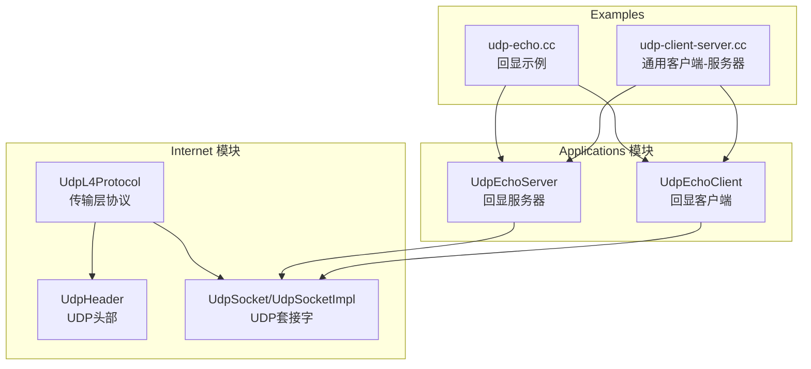
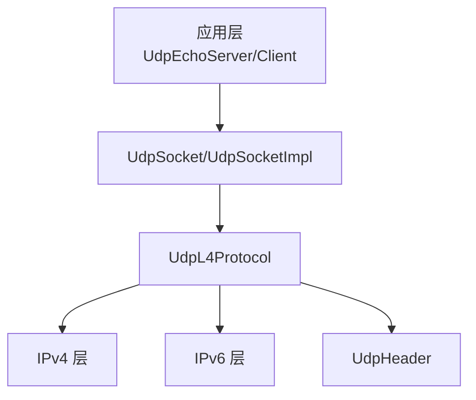
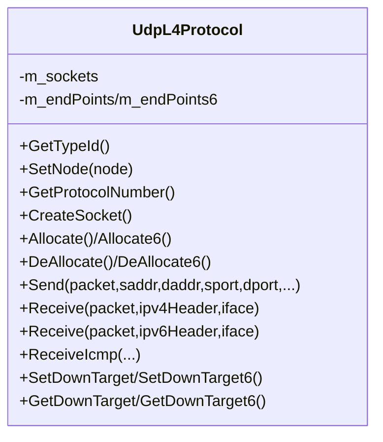
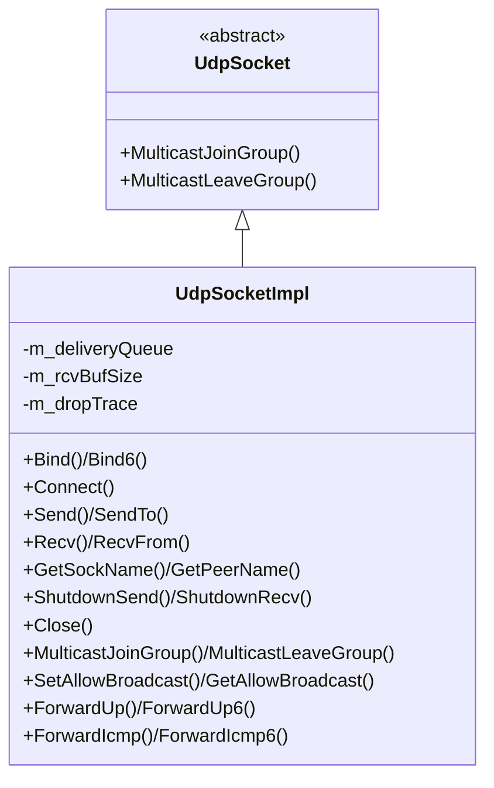
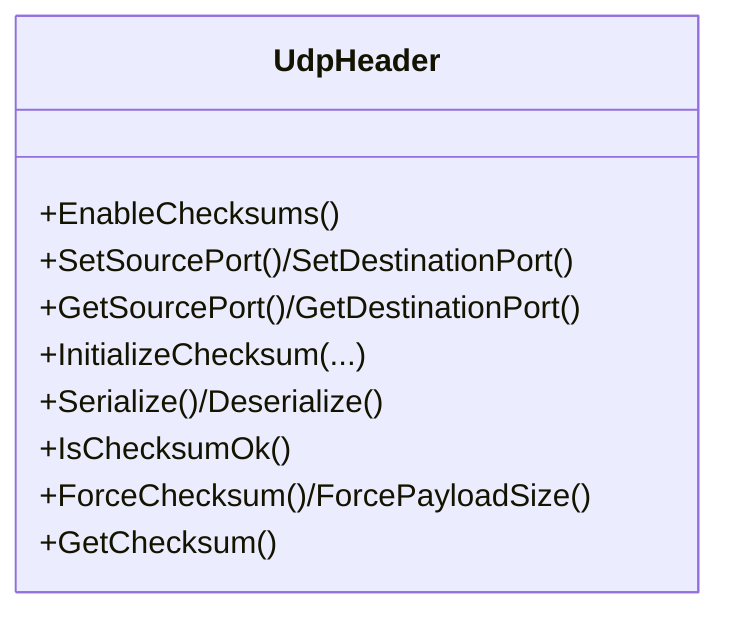
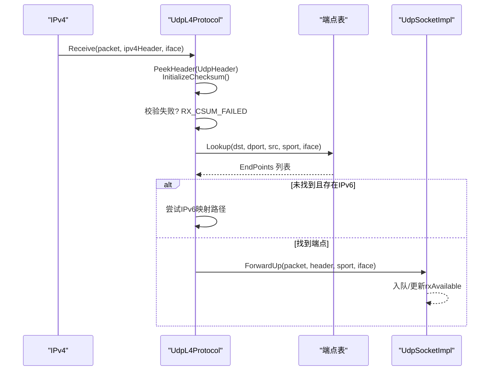
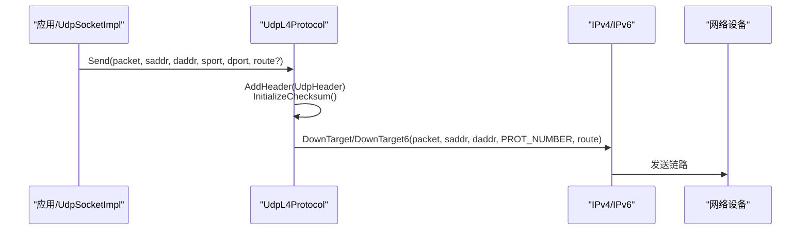
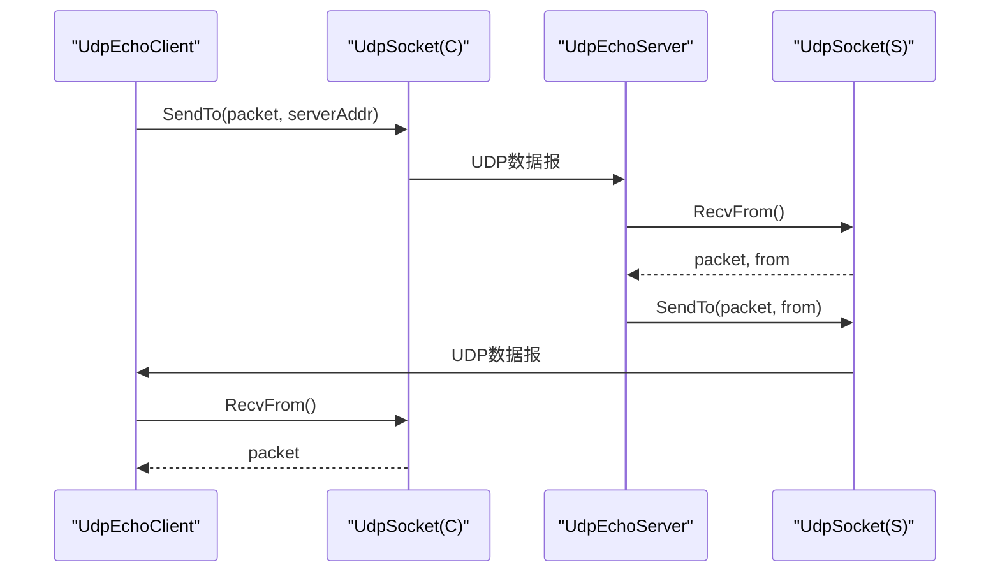
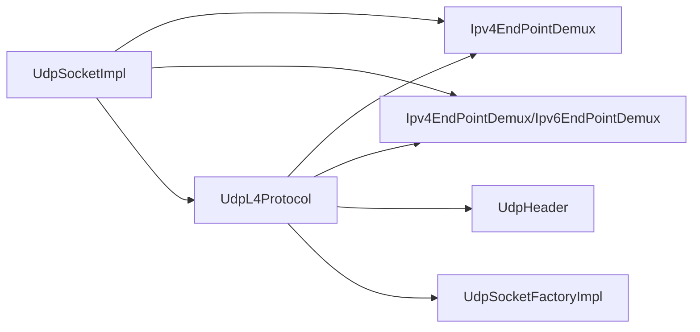

# UDP传输层

<cite>
**本文引用的文件**
- [udp-l4-protocol.h](file://simulator/ns-3.39/src/internet/model/udp-l4-protocol.h)
- [udp-l4-protocol.cc](file://simulator/ns-3.39/src/internet/model/udp-l4-protocol.cc)
- [udp-socket.h](file://simulator/ns-3.39/src/internet/model/udp-socket.h)
- [udp-socket-impl.cc](file://simulator/ns-3.39/src/internet/model/udp-socket-impl.cc)
- [udp-header.h](file://simulator/ns-3.39/src/internet/model/udp-header.h)
- [udp-header.cc](file://simulator/ns-3.39/src/internet/model/udp-header.cc)
- [udp-echo-server.h](file://simulator/ns-3.39/src/applications/model/udp-echo-server.h)
- [udp-echo-server.cc](file://simulator/ns-3.39/src/applications/model/udp-echo-server.cc)
- [udp-echo-client.h](file://simulator/ns-3.39/src/applications/model/udp-echo-client.h)
- [udp-echo.cc](file://simulator/ns-3.39/examples/udp/udp-echo.cc)
- [udp-client-server.cc](file://simulator/ns-3.39/examples/udp-client-server/udp-client-server.cc)
</cite>

## 目录
1. [简介](#简介)
2. [项目结构](#项目结构)
3. [核心组件](#核心组件)
4. [架构总览](#架构总览)
5. [详细组件分析](#详细组件分析)
6. [依赖关系分析](#依赖关系分析)
7. [性能考虑](#性能考虑)
8. [故障排查指南](#故障排查指南)
9. [结论](#结论)
10. [附录：使用示例与最佳实践](#附录使用示例与最佳实践)

## 简介
本文件系统化梳理NS-3中UDP传输层的实现与API，重点覆盖以下内容：
- UdpL4Protocol类：UDP协议栈在传输层的实现，负责数据报收发、端点管理、ICMP回传、IPv4/IPv6双栈适配。
- UdpSocket/UdpSocketImpl类：无连接UDP套接字接口与实现，支持数据报发送/接收、广播、多播（IPv6）、异步回调、错误通知等。
- 头部与校验：UdpHeader的序列化/反序列化与校验机制。
- 应用示例：基于UdpEchoServer/UdpEchoClient的请求-响应模式，以及通用UDP客户端-服务器示例。
- 性能与场景：最大报文长度、缓冲区与丢包、广播/多播行为、吞吐与延迟权衡。

## 项目结构
NS-3的UDP实现主要分布在“internet”和“applications”两个模块：
- 传输层协议与套接字实现位于internet模型目录
- 应用层示例位于applications模型目录
- 示例脚本位于examples目录

图示来源
- [udp-l4-protocol.h:63-304](file://simulator/ns-3.39/src/internet/model/udp-l4-protocol.h#L63-L304)
- [udp-l4-protocol.cc:107-128](file://simulator/ns-3.39/src/internet/model/udp-l4-protocol.cc#L107-L128)
- [udp-socket.h:47-170](file://simulator/ns-3.39/src/internet/model/udp-socket.h#L47-L170)
- [udp-socket-impl.cc:82-95](file://simulator/ns-3.39/src/internet/model/udp-socket-impl.cc#L82-L95)
- [udp-header.h:40-180](file://simulator/ns-3.39/src/internet/model/udp-header.h#L40-L180)
- [udp-echo-server.h:44-81](file://simulator/ns-3.39/src/applications/model/udp-echo-server.h#L44-L81)
- [udp-echo-server.cc:85-139](file://simulator/ns-3.39/src/applications/model/udp-echo-server.cc#L85-L139)
- [udp-echo-client.h:39-183](file://simulator/ns-3.39/src/applications/model/udp-echo-client.h#L39-L183)
- [udp-echo.cc:103-122](file://simulator/ns-3.39/examples/udp/udp-echo.cc#L103-L122)
- [udp-client-server.cc:94-109](file://simulator/ns-3.39/examples/udp-client-server/udp-client-server.cc#L94-L109)

章节来源
- [udp-l4-protocol.h:43-57](file://simulator/ns-3.39/src/internet/model/udp-l4-protocol.h#L43-L57)
- [udp-l4-protocol.cc:94-129](file://simulator/ns-3.39/src/internet/model/udp-l4-protocol.cc#L94-L129)
- [udp-socket.h:37-46](file://simulator/ns-3.39/src/internet/model/udp-socket.h#L37-L46)
- [udp-socket-impl.cc:82-95](file://simulator/ns-3.39/src/internet/model/udp-socket-impl.cc#L82-L95)
- [udp-header.h:32-39](file://simulator/ns-3.39/src/internet/model/udp-header.h#L32-L39)
- [udp-echo-server.h:33-43](file://simulator/ns-3.39/src/applications/model/udp-echo-server.h#L33-L43)
- [udp-echo-server.cc:85-139](file://simulator/ns-3.39/src/applications/model/udp-echo-server.cc#L85-L139)
- [udp-echo-client.h:33-38](file://simulator/ns-3.39/src/applications/model/udp-echo-client.h#L33-L38)
- [udp-echo.cc:103-122](file://simulator/ns-3.39/examples/udp/udp-echo.cc#L103-L122)
- [udp-client-server.cc:92-109](file://simulator/ns-3.39/examples/udp-client-server/udp-client-server.cc#L92-L109)

## 核心组件
- UdpL4Protocol：传输层UDP协议实现，负责：
  - 创建并返回UdpSocket实例
  - 端点分配/释放（IPv4/IPv6）
  - 接收路径：校验UDP校验和、查找端点、分发到上层
  - 发送路径：封装UDP头部、调用下层IP发送
  - ICMP差错转发（端点查找失败时）
- UdpSocket/UdpSocketImpl：无连接UDP套接字，提供：
  - 绑定/连接、关闭、Shutdown
  - Send/SendTo/Recv/RecvFrom
  - 广播、多播（IPv6）加入/离开
  - 接收队列、接收缓冲区大小、丢包追踪
  - ICMP回调（IPv4/IPv6）
- UdpHeader：UDP头部序列化/反序列化与校验
- 应用示例：UdpEchoServer/UdpEchoClient演示请求-响应模式；通用示例展示持续流式传输

章节来源
- [udp-l4-protocol.h:63-304](file://simulator/ns-3.39/src/internet/model/udp-l4-protocol.h#L63-L304)
- [udp-l4-protocol.cc:166-175](file://simulator/ns-3.39/src/internet/model/udp-l4-protocol.cc#L166-L175)
- [udp-socket.h:47-170](file://simulator/ns-3.39/src/internet/model/udp-socket.h#L47-L170)
- [udp-socket-impl.cc:82-95](file://simulator/ns-3.39/src/internet/model/udp-socket-impl.cc#L82-L95)
- [udp-header.h:40-180](file://simulator/ns-3.39/src/internet/model/udp-header.h#L40-L180)

## 架构总览
NS-3中UDP位于传输层，直接承载于IP之上，通过UdpL4Protocol与IP栈交互，同时为应用层提供Socket接口。

图示来源
- [udp-l4-protocol.cc:118-127](file://simulator/ns-3.39/src/internet/model/udp-l4-protocol.cc#L118-L127)
- [udp-socket-impl.cc:148-153](file://simulator/ns-3.39/src/internet/model/udp-socket-impl.cc#L148-L153)
- [udp-header.h:40-41](file://simulator/ns-3.39/src/internet/model/udp-header.h#L40-L41)

## 详细组件分析

### UdpL4Protocol 类
职责与关键能力：
- 协议标识与属性：提供协议号、对象类型ID、Socket列表属性
- 端点管理：Allocate/Allocate6、DeAllocate/DeAllocate6，支持多种绑定参数组合
- 套接字生命周期：CreateSocket、RemoveSocket
- 收包处理：Receive（IPv4/IPv6），校验UDP校验和，端点查找，分发到上层
- 发包处理：Send（IPv4/IPv6），封装UDP头部，调用下层发送
- ICMP处理：ReceiveIcmp，根据载荷端口信息定位端点并转发ICMP

图示来源
- [udp-l4-protocol.h:63-304](file://simulator/ns-3.39/src/internet/model/udp-l4-protocol.h#L63-L304)
- [udp-l4-protocol.cc:166-175](file://simulator/ns-3.39/src/internet/model/udp-l4-protocol.cc#L166-L175)

章节来源
- [udp-l4-protocol.h:63-304](file://simulator/ns-3.39/src/internet/model/udp-l4-protocol.h#L63-L304)
- [udp-l4-protocol.cc:118-129](file://simulator/ns-3.39/src/internet/model/udp-l4-protocol.cc#L118-L129)

### UdpSocket/UdpSocketImpl 类
接口与行为：
- 生命周期：Bind/Bind6、Connect、Close、ShutdownSend/ShutdownRecv
- 数据报收发：Send/SendTo、Recv/RecvFrom
- 地址查询：GetSockName/GetPeerName
- 多播支持：MulticastJoinGroup/MulticastLeaveGroup（声明接口，具体实现留待扩展）
- 广播支持：SetAllowBroadcast/GetAllowBroadcast
- 回调与事件：接收回调、ICMP回调、发送/接收事件通知
- 内部状态：接收队列、接收缓冲区大小、丢包追踪

图示来源
- [udp-socket.h:47-170](file://simulator/ns-3.39/src/internet/model/udp-socket.h#L47-L170)
- [udp-socket-impl.cc:82-95](file://simulator/ns-3.39/src/internet/model/udp-socket-impl.cc#L82-L95)

章节来源
- [udp-socket.h:47-170](file://simulator/ns-3.39/src/internet/model/udp-socket.h#L47-L170)
- [udp-socket-impl.cc:248-368](file://simulator/ns-3.39/src/internet/model/udp-socket-impl.cc#L248-L368)

### UdpHeader 类
功能要点：
- 字段：源/目的端口、长度、校验和
- 能力：启用校验、初始化校验上下文（含IPv4/IPv6）、序列化/反序列化、强制校验值与长度
- 校验：按协议族计算伪首部与校验和，支持开启/关闭

图示来源
- [udp-header.h:40-180](file://simulator/ns-3.39/src/internet/model/udp-header.h#L40-L180)
- [udp-header.cc:50-241](file://simulator/ns-3.39/src/internet/model/udp-header.cc#L50-L241)

章节来源
- [udp-header.h:40-180](file://simulator/ns-3.39/src/internet/model/udp-header.h#L40-L180)
- [udp-header.cc:104-142](file://simulator/ns-3.39/src/internet/model/udp-header.cc#L104-L142)

### UDP数据报处理流程（收包）

图示来源
- [udp-l4-protocol.cc:334-431](file://simulator/ns-3.39/src/internet/model/udp-l4-protocol.cc#L334-L431)
- [udp-socket-impl.cc:1029-1088](file://simulator/ns-3.39/src/internet/model/udp-socket-impl.cc#L1029-L1088)

章节来源
- [udp-l4-protocol.cc:334-431](file://simulator/ns-3.39/src/internet/model/udp-l4-protocol.cc#L334-L431)
- [udp-socket-impl.cc:1029-1088](file://simulator/ns-3.39/src/internet/model/udp-socket-impl.cc#L1029-L1088)

### UDP数据报处理流程（发包）

图示来源
- [udp-l4-protocol.cc:433-525](file://simulator/ns-3.39/src/internet/model/udp-l4-protocol.cc#L433-L525)
- [udp-socket-impl.cc:503-689](file://simulator/ns-3.39/src/internet/model/udp-socket-impl.cc#L503-L689)

章节来源
- [udp-l4-protocol.cc:433-525](file://simulator/ns-3.39/src/internet/model/udp-l4-protocol.cc#L433-L525)
- [udp-socket-impl.cc:503-689](file://simulator/ns-3.39/src/internet/model/udp-socket-impl.cc#L503-L689)

### 端口管理与多播支持
- 端口管理：UdpL4Protocol通过端点表对四元组（本地/远端地址+端口）进行匹配与分发
- 多播支持：UdpSocket声明了多播加入/离开接口，当前实现以注释形式提示IGMP尚未实现
- IPv6多播：UdpSocketImpl包含IPv6多播加入逻辑，通过节点的IPv6三层协议添加/移除多播地址

章节来源
- [udp-l4-protocol.h:98-174](file://simulator/ns-3.39/src/internet/model/udp-l4-protocol.h#L98-L174)
- [udp-socket.h:84-104](file://simulator/ns-3.39/src/internet/model/udp-socket.h#L84-L104)
- [udp-socket-impl.cc:1257-1301](file://simulator/ns-3.39/src/internet/model/udp-socket-impl.cc#L1257-L1301)

### UDP客户端与服务器实现模式
- 请求-响应模式：UdpEchoServer每收到一个包即回显，UdpEchoClient周期性发送并等待回显
- 流式传输模式：通用UDP客户端-服务器示例展示持续发送固定间隔的数据包

图示来源
- [udp-echo-server.cc:159-207](file://simulator/ns-3.39/src/applications/model/udp-echo-server.cc#L159-L207)
- [udp-echo-client.h:137-158](file://simulator/ns-3.39/src/applications/model/udp-echo-client.h#L137-L158)

章节来源
- [udp-echo-server.h:44-81](file://simulator/ns-3.39/src/applications/model/udp-echo-server.h#L44-L81)
- [udp-echo-server.cc:85-139](file://simulator/ns-3.39/src/applications/model/udp-echo-server.cc#L85-L139)
- [udp-echo-client.h:137-158](file://simulator/ns-3.39/src/applications/model/udp-echo-client.h#L137-L158)
- [udp-echo.cc:103-122](file://simulator/ns-3.39/examples/udp/udp-echo.cc#L103-L122)
- [udp-client-server.cc:92-109](file://simulator/ns-3.39/examples/udp-client-server/udp-client-server.cc#L92-L109)

## 依赖关系分析
- UdpL4Protocol依赖：
  - IPv4/IPv6端点复用器（Ipv4EndPointDemux/Ipv6EndPointDemux）
  - UdpHeader（封装/校验）
  - UdpSocketFactoryImpl（创建UdpSocketImpl）
- UdpSocketImpl依赖：
  - Ipv4/IPv6端点（Ipv4EndPoint/Ipv6EndPoint）
  - UdpL4Protocol（发包/端点管理）
  - 节点对象（获取路由、三层协议）

图示来源
- [udp-l4-protocol.cc:20-34](file://simulator/ns-3.39/src/internet/model/udp-l4-protocol.cc#L20-L34)
- [udp-socket-impl.cc:20-34](file://simulator/ns-3.39/src/internet/model/udp-socket-impl.cc#L20-L34)

章节来源
- [udp-l4-protocol.cc:20-34](file://simulator/ns-3.39/src/internet/model/udp-l4-protocol.cc#L20-L34)
- [udp-socket-impl.cc:20-34](file://simulator/ns-3.39/src/internet/model/udp-socket-impl.cc#L20-L34)

## 性能考虑
- 最大数据报长度：IPv4路径下最大UDP数据报为65507字节（65535-20字节IP头-8字节UDP头）
- 发送缓冲：当前实现未建模有限发送缓冲，但受最大UDP报文限制
- 接收缓冲：维护接收队列与可用空间，溢出时丢弃并触发丢包追踪
- 广播：受限于节点接口数量与是否允许广播，可能对带宽产生影响
- 多播：IPv6多播加入/离开通过三层协议实现，需注意接口绑定与过滤模式

章节来源
- [udp-socket-impl.cc:51-54](file://simulator/ns-3.39/src/internet/model/udp-socket-impl.cc#L51-L54)
- [udp-socket-impl.cc:824-831](file://simulator/ns-3.39/src/internet/model/udp-socket-impl.cc#L824-L831)
- [udp-socket-impl.cc:1071-1087](file://simulator/ns-3.39/src/internet/model/udp-socket-impl.cc#L1071-L1087)

## 故障排查指南
- 校验和失败：收包路径若校验失败，返回RX_CSUM_FAILED，检查网络设备或伪造包
- 端点未找到：收包路径找不到匹配端点时返回RX_ENDPOINT_UNREACH，检查端口/地址配置
- 接收缓冲溢出：接收队列满导致丢包并触发丢包追踪回调，增大接收缓冲或提高应用读取速率
- 无路由：发送路径无路由时返回ERROR_NOROUTETOHOST，检查路由协议与接口状态
- 广播权限：未允许广播时返回ERROR_OPNOTSUPP，需设置允许广播选项

章节来源
- [udp-l4-protocol.cc:353-357](file://simulator/ns-3.39/src/internet/model/udp-l4-protocol.cc#L353-L357)
- [udp-l4-protocol.cc:380-382](file://simulator/ns-3.39/src/internet/model/udp-l4-protocol.cc#L380-L382)
- [udp-socket-impl.cc:1084-1087](file://simulator/ns-3.39/src/internet/model/udp-socket-impl.cc#L1084-L1087)
- [udp-socket-impl.cc:683-685](file://simulator/ns-3.39/src/internet/model/udp-socket-impl.cc#L683-L685)
- [udp-socket-impl.cc:591-595](file://simulator/ns-3.39/src/internet/model/udp-socket-impl.cc#L591-L595)

## 结论
NS-3的UDP实现遵循无连接、不可靠、面向数据报的设计原则，通过UdpL4Protocol与UdpSocketImpl分别承担传输层协议与套接字接口职责，提供完整的收发、端点管理、多播与广播能力。配合UdpHeader的校验机制与应用层示例，可快速搭建从简单回显到复杂流式传输的仿真场景。

## 附录：使用示例与最佳实践
- 回显示例（请求-响应）：参考示例脚本与应用类，演示绑定、发送、接收与回显
- 通用客户端-服务器：展示持续流式传输、参数配置与仿真运行
- 编程建议：
  - 明确选择IPv4或IPv6地址族，避免混用导致的路径切换
  - 合理设置接收缓冲大小，避免频繁丢包
  - 使用回调驱动异步I/O，减少阻塞
  - 在需要时启用ICMP回调以处理不可达等错误
  - 多播场景下注意接口绑定与过滤模式

章节来源
- [udp-echo.cc:103-122](file://simulator/ns-3.39/examples/udp/udp-echo.cc#L103-L122)
- [udp-client-server.cc:92-109](file://simulator/ns-3.39/examples/udp-client-server/udp-client-server.cc#L92-L109)
- [udp-echo-server.cc:159-207](file://simulator/ns-3.39/src/applications/model/udp-echo-server.cc#L159-L207)
- [udp-echo-client.h:137-158](file://simulator/ns-3.39/src/applications/model/udp-echo-client.h#L137-L158)