# 互联网协议模块（Internet）

<cite>
**本文引用的文件**
- [CMakeLists.txt](file://simulator/ns-3.39/src/internet/CMakeLists.txt)
- [ipv4.h](file://simulator/ns-3.39/src/internet/model/ipv4.h)
- [ipv6.h](file://simulator/ns-3.39/src/internet/model/ipv6.h)
- [tcp-socket.h](file://simulator/ns-3.39/src/internet/model/tcp-socket.h)
- [udp-socket.h](file://simulator/ns-3.39/src/internet/model/udp-socket.h)
- [ipv4-global-routing.h](file://simulator/ns-3.39/src/internet/model/ipv4-global-routing.h)
- [icmpv4.h](file://simulator/ns-3.39/src/internet/model/icmpv4.h)
- [rip.h](file://simulator/ns-3.39/src/internet/model/rip.h)
</cite>

## 目录
1. [简介](#简介)
2. [项目结构](#项目结构)
3. [核心组件](#核心组件)
4. [架构总览](#架构总览)
5. [详细组件分析](#详细组件分析)
6. [依赖关系分析](#依赖关系分析)
7. [性能考量](#性能考量)
8. [故障排查指南](#故障排查指南)
9. [结论](#结论)
10. [附录：API与使用示例路径](#附录api与使用示例路径)

## 简介
本文件系统化梳理 NS-3 互联网协议模块（Internet）的 API 与实现，覆盖 IPv4/IPv6 网络层、TCP/UDP 传输层、路由协议（静态、全局、RIP）、ICMP 实现、邻居缓存与 ARP（概念性说明）、以及与网络设备的集成方式。文档以“从代码到文档”的方式呈现，强调类层次、接口规范、配置参数、数据流与控制流，并提供面向应用的 Socket 编程与数据传输参考路径。

## 项目结构
- 模块入口与构建：通过 CMake 将 Internet 子模块编译为库，聚合网络层、传输层、路由与工具组件。
- 关键目录与职责：
  - model：协议实体与核心实现（IPv4/IPv6、TCP/UDP、ICMP、路由协议、Socket 抽象等）
  - helper：高层封装与辅助工具（地址分配、路由助手、跟踪器等）
  - examples：示例脚本（如简单拓扑、邻居缓存示例等）
  - test：单元测试套件（覆盖 IPv4/IPv6、TCP/UDP、ICMP、路由等）

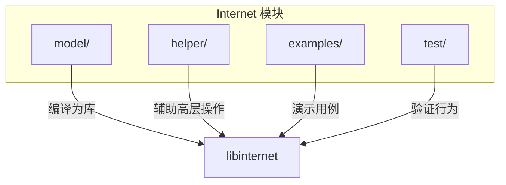

图示来源
- [CMakeLists.txt:1-354](file://simulator/ns-3.39/src/internet/CMakeLists.txt#L1-L354)

章节来源
- [CMakeLists.txt:1-354](file://simulator/ns-3.39/src/internet/CMakeLists.txt#L1-L354)

## 核心组件
- 网络层抽象与接口
  - Ipv4：统一的 IPv4 能力接口，负责路由协议绑定、接口注册与状态管理、L4 协议插入、寻址与转发等。
  - Ipv6：统一的 IPv6 能力接口，负责路由协议绑定、接口注册与状态管理、L4 协议插入、扩展与选项注册、寻址与转发等。
- 传输层抽象与接口
  - TcpSocket：TCP 套接字抽象，定义状态机、缓冲区大小、拥塞控制相关属性与回调。
  - UdpSocket：UDP 套接字抽象，定义多播加入/离开、接收缓冲、多播报文 TTL/接口/回环等属性。
- 路由协议
  - Ipv4GlobalRouting：全局路由表（可动态构建与打印），支持主机/网络/外部自治系统路由。
  - Rip：RIP（路由信息协议）IGP，周期性/触发式更新，支持水平分割与毒性逆转。
- 其他子系统
  - Icmpv4：ICMPv4 头部与错误报文类型（不可达、超时、回显等）。
  - 邻居缓存与 ARP：在 IPv4 层通过 L3 协议与链路层交互，维护可达性与下一跳映射（详见模型文件）。

章节来源
- [ipv4.h:78-471](file://simulator/ns-3.39/src/internet/model/ipv4.h#L78-L471)
- [ipv6.h:81-427](file://simulator/ns-3.39/src/internet/model/ipv6.h#L81-L427)
- [tcp-socket.h:47-253](file://simulator/ns-3.39/src/internet/model/tcp-socket.h#L47-L253)
- [udp-socket.h:47-170](file://simulator/ns-3.39/src/internet/model/udp-socket.h#L47-L170)
- [ipv4-global-routing.h:71-286](file://simulator/ns-3.39/src/internet/model/ipv4-global-routing.h#L71-L286)
- [rip.h:174-427](file://simulator/ns-3.39/src/internet/model/rip.h#L174-L427)
- [icmpv4.h:41-302](file://simulator/ns-3.39/src/internet/model/icmpv4.h#L41-L302)

## 架构总览
下图展示 Internet 模块中网络层、传输层、路由与 Socket 的交互关系与职责划分。

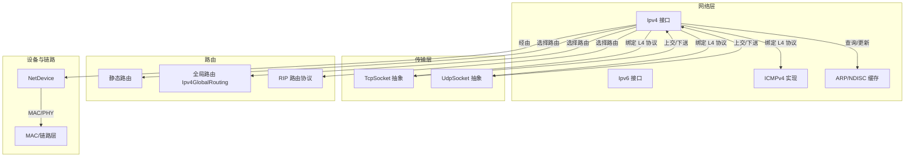

图示来源
- [ipv4.h:78-471](file://simulator/ns-3.39/src/internet/model/ipv4.h#L78-L471)
- [ipv6.h:81-427](file://simulator/ns-3.39/src/internet/model/ipv6.h#L81-L427)
- [tcp-socket.h:47-253](file://simulator/ns-3.39/src/internet/model/tcp-socket.h#L47-L253)
- [udp-socket.h:47-170](file://simulator/ns-3.39/src/internet/model/udp-socket.h#L47-L170)
- [ipv4-global-routing.h:71-286](file://simulator/ns-3.39/src/internet/model/ipv4-global-routing.h#L71-L286)
- [rip.h:174-427](file://simulator/ns-3.39/src/internet/model/rip.h#L174-L427)
- [icmpv4.h:41-302](file://simulator/ns-3.39/src/internet/model/icmpv4.h#L41-L302)

## 详细组件分析

### IPv4 网络层接口与能力
- 主要职责
  - 绑定/获取路由协议（单个或列表组合）
  - 注册 NetDevice 接口、设置接口 UP/DOWN、查询接口索引与设备
  - 地址管理（添加/删除/枚举接口地址）
  - 路径 MTU、转发标志、源地址选择
  - 插入/移除 L4 协议（TCP/UDP/ICMP 等），按接口维度绑定
  - 发送/带已有 IP 头发送、本地地址判定
- 关键方法族
  - 路由协议：SetRoutingProtocol()/GetRoutingProtocol()
  - 接口管理：AddInterface()/GetNInterfaces()/GetNetDevice()/SetUp()/SetDown()
  - 地址管理：AddAddress()/RemoveAddress()/GetAddress()/SelectSourceAddress()
  - 转发与属性：IsForwarding()/SetForwarding()/GetMtu()/SourceAddressSelection()
  - L4 绑定：Insert()/Remove()/GetProtocol()

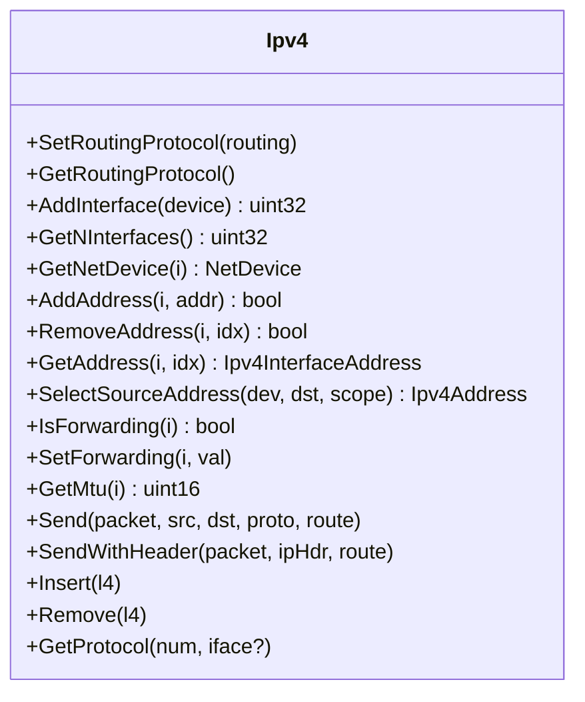

图示来源
- [ipv4.h:78-471](file://simulator/ns-3.39/src/internet/model/ipv4.h#L78-L471)

章节来源
- [ipv4.h:78-471](file://simulator/ns-3.39/src/internet/model/ipv4.h#L78-L471)

### IPv6 网络层接口与能力
- 主要职责
  - 与 IPv4 类似的接口能力，但针对 IPv6 地址族与扩展机制
  - 扩展与选项注册（RegisterExtensions()/RegisterOptions()）
  - 路由属性（转发、MTU 发现、路径 MTU 设置）
- 关键方法族
  - 路由协议：SetRoutingProtocol()/GetRoutingProtocol()
  - 接口管理：AddInterface()/GetNInterfaces()/GetNetDevice()/SetUp()/SetDown()
  - 地址管理：AddAddress()/RemoveAddress()/GetAddress()/SourceAddressSelection()
  - 转发与属性：IsForwarding()/SetForwarding()/GetMtu()/SetPmtu()/GetIpForward()/GetMtuDiscover()
  - L4 绑定：Insert()/Remove()/GetProtocol()

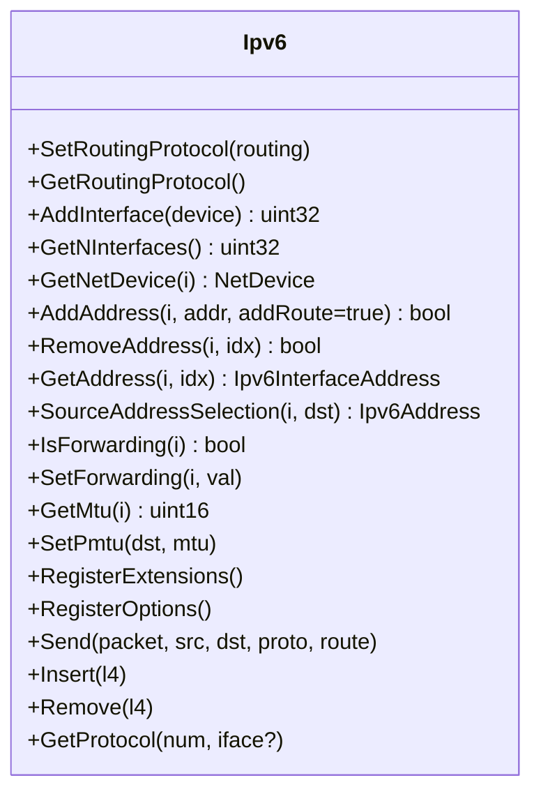

图示来源
- [ipv6.h:81-427](file://simulator/ns-3.39/src/internet/model/ipv6.h#L81-L427)

章节来源
- [ipv6.h:81-427](file://simulator/ns-3.39/src/internet/model/ipv6.h#L81-L427)

### TCP 套接字抽象与状态机
- TCP 状态机（11 个状态）
  - CLOSED、LISTEN、SYN_SENT、SYN_RCVD、ESTABLISHED、CLOSE_WAIT、LAST_ACK、FIN_WAIT_1、FIN_WAIT_2、CLOSING、TIME_WAIT
- 关键属性（通过私有虚函数间接设置/获取）
  - 发送/接收缓冲区大小、分段大小、初始慢启动阈值、初始拥塞窗口
  - 连接超时、SYN 重试次数、数据重传次数
  - 延迟 ACK 超时与计数、Nagle 算法开关、持久连接超时
- 回调与追踪
  - 状态变化的 TracedCallback，便于观测与调试

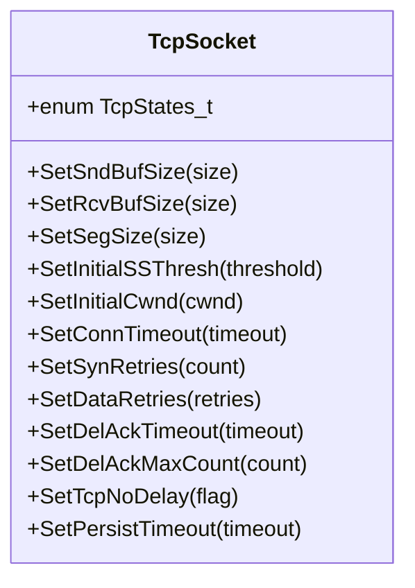

图示来源
- [tcp-socket.h:47-253](file://simulator/ns-3.39/src/internet/model/tcp-socket.h#L47-L253)

章节来源
- [tcp-socket.h:47-253](file://simulator/ns-3.39/src/internet/model/tcp-socket.h#L47-L253)

### UDP 套接字抽象与多播
- 多播 API
  - MulticastJoinGroup()/MulticastLeaveGroup()：加入/离开组播组（当前未实现 IGMP）
- 关键属性（通过私有虚函数间接设置/获取）
  - 接收缓冲区大小、IP 多播 TTL、多播接口、多播回环、MTU 发现

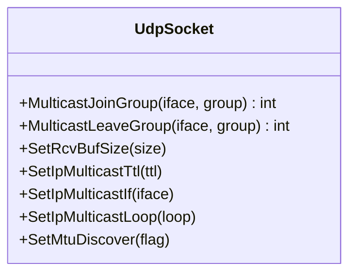

图示来源
- [udp-socket.h:47-170](file://simulator/ns-3.39/src/internet/model/udp-socket.h#L47-L170)

章节来源
- [udp-socket.h:47-170](file://simulator/ns-3.39/src/internet/model/udp-socket.h#L47-L170)

### 全局路由协议（Ipv4GlobalRouting）
- 功能概述
  - 提供全局视角的 IPv4 路由表，支持主机路由、网络路由与外部自治系统路由
  - 支持默认路由、ECMP（随机/流级）选择、接口事件响应与路由表打印
- 关键接口
  - 添加/删除路由：AddHostRouteTo()/AddNetworkRouteTo()/AddASExternalRouteTo()/RemoveRoute()
  - 查询：GetNRoutes()/GetRoute(i)/LookupGlobal()
  - 流式配置：AssignStreams()

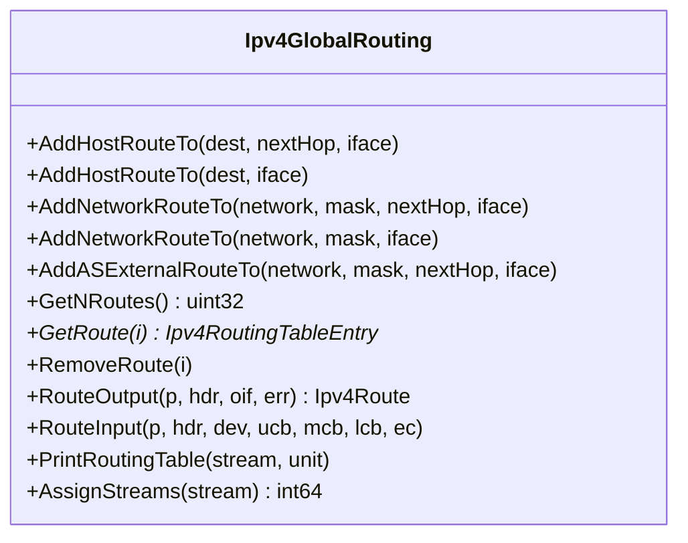

图示来源
- [ipv4-global-routing.h:71-286](file://simulator/ns-3.39/src/internet/model/ipv4-global-routing.h#L71-L286)

章节来源
- [ipv4-global-routing.h:71-286](file://simulator/ns-3.39/src/internet/model/ipv4-global-routing.h#L71-L286)

### RIP 路由协议（RIP）
- 功能概述
  - 基于 Bellman-Ford 的 IPv4 IGP，支持周期性与触发式更新
  - 水平分割策略（禁用/启用/毒性逆转）
  - 接口排除、接口度量、默认路由注入
- 关键接口
  - 路由输入/输出：RouteOutput()/RouteInput()
  - 接口事件：NotifyInterfaceUp()/NotifyInterfaceDown()/NotifyAddAddress()/NotifyRemoveAddress()
  - 更新调度：DoSendRouteUpdate()/SendTriggeredRouteUpdate()/SendUnsolicitedRouteUpdate()
  - 配置：SetInterfaceExclusions()/SetInterfaceMetric()/AddDefaultRouteTo()

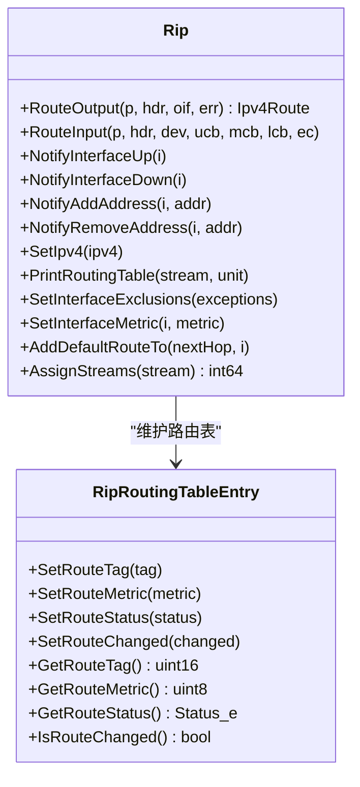

图示来源
- [rip.h:174-427](file://simulator/ns-3.39/src/internet/model/rip.h#L174-L427)

章节来源
- [rip.h:174-427](file://simulator/ns-3.39/src/internet/model/rip.h#L174-L427)

### ICMPv4 实现
- 报文类型与头部
  - 基础头部：类型/代码、校验和控制
  - 错误报文：目的不可达（含下一跳 MTU）、时间超限
  - 控制报文：回显请求/应答
- 关键类
  - Icmpv4Header：通用头部
  - Icmpv4DestinationUnreachable：目的不可达（携带被携 IPv4 头与数据）
  - Icmpv4TimeExceeded：时间超限（携带被携 IPv4 头与数据）
  - Icmpv4Echo：回显请求/应答（标识符、序列号、数据）

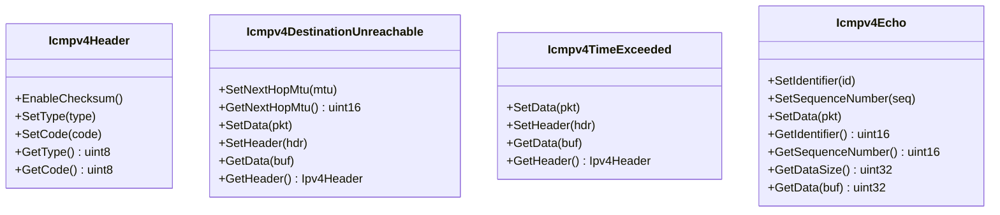

图示来源
- [icmpv4.h:41-302](file://simulator/ns-3.39/src/internet/model/icmpv4.h#L41-L302)

章节来源
- [icmpv4.h:41-302](file://simulator/ns-3.39/src/internet/model/icmpv4.h#L41-L302)

### 数据包发送流程（以 TCP/UDP 为例）
以下序列图展示应用通过 Socket 发送数据，经由传输层进入 IPv4/IPv6，再由路由协议选择下一跳并交付给 NetDevice 的典型流程。

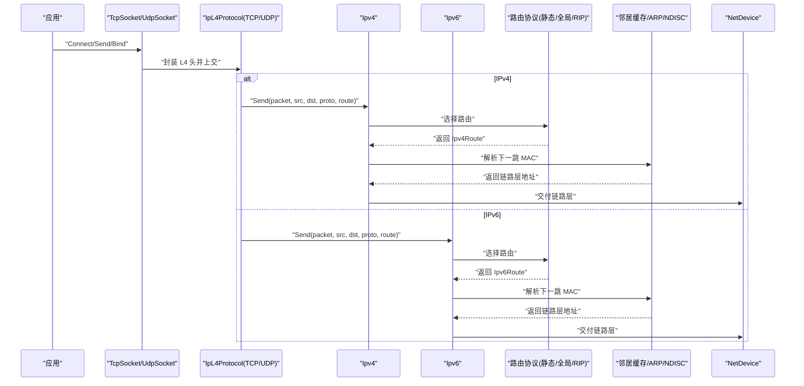

图示来源
- [ipv4.h:140-165](file://simulator/ns-3.39/src/internet/model/ipv4.h#L140-L165)
- [ipv6.h:367-384](file://simulator/ns-3.39/src/internet/model/ipv6.h#L367-L384)
- [tcp-socket.h:47-253](file://simulator/ns-3.39/src/internet/model/tcp-socket.h#L47-L253)
- [udp-socket.h:47-170](file://simulator/ns-3.39/src/internet/model/udp-socket.h#L47-L170)
- [rip.h:174-205](file://simulator/ns-3.39/src/internet/model/rip.h#L174-L205)
- [ipv4-global-routing.h:71-110](file://simulator/ns-3.39/src/internet/model/ipv4-global-routing.h#L71-L110)

章节来源
- [ipv4.h:140-165](file://simulator/ns-3.39/src/internet/model/ipv4.h#L140-L165)
- [ipv6.h:367-384](file://simulator/ns-3.39/src/internet/model/ipv6.h#L367-L384)
- [tcp-socket.h:47-253](file://simulator/ns-3.39/src/internet/model/tcp-socket.h#L47-L253)
- [udp-socket.h:47-170](file://simulator/ns-3.39/src/internet/model/udp-socket.h#L47-L170)
- [rip.h:174-205](file://simulator/ns-3.39/src/internet/model/rip.h#L174-L205)
- [ipv4-global-routing.h:71-110](file://simulator/ns-3.39/src/internet/model/ipv4-global-routing.h#L71-L110)

### 路由表管理与查询流程
- 全局路由（Ipv4GlobalRouting）
  - 通过 AddHostRouteTo()/AddNetworkRouteTo()/AddASExternalRouteTo() 增量构建
  - 通过 GetNRoutes()/GetRoute(i)/RemoveRoute(i) 访问与维护
  - 通过 LookupGlobal()/RouteOutput()/RouteInput() 参与转发决策
- RIP
  - 通过 NotifyInterface*/NotifyAddAddress* 响应拓扑变化
  - 通过 DoSendRouteUpdate()/SendTriggeredRouteUpdate() 管理更新节奏
  - 通过 Lookup() 查找最佳路径

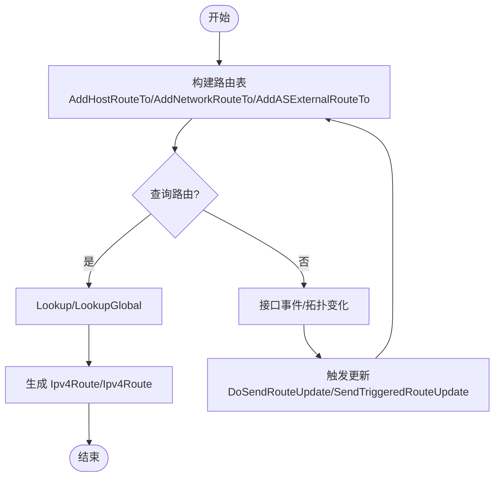

图示来源
- [ipv4-global-routing.h:110-222](file://simulator/ns-3.39/src/internet/model/ipv4-global-routing.h#L110-L222)
- [rip.h:275-392](file://simulator/ns-3.39/src/internet/model/rip.h#L275-L392)

章节来源
- [ipv4-global-routing.h:110-222](file://simulator/ns-3.39/src/internet/model/ipv4-global-routing.h#L110-L222)
- [rip.h:275-392](file://simulator/ns-3.39/src/internet/model/rip.h#L275-L392)

## 依赖关系分析
- 模块内依赖
  - Ipv4/Ipv6 依赖于 NetDevice、Socket、L4 协议（TCP/UDP/ICMP）、路由协议（静态/全局/RIP）
  - TcpSocket/UdpSocket 作为 Socket 的具体实现，向上对接 L4 协议，向下对接网络层
  - 路由协议（静态/全局/RIP）通过 Ipv4L3Protocol/Ipv6L3Protocol 与网络层交互
- 构建依赖
  - Internet 模块链接 core、network、bridge、traffic-control 等基础库

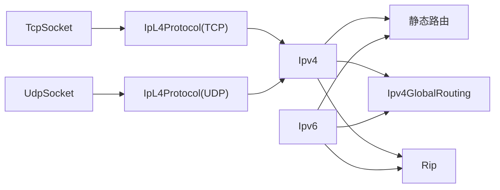

图示来源
- [ipv4.h:78-471](file://simulator/ns-3.39/src/internet/model/ipv4.h#L78-L471)
- [ipv6.h:81-427](file://simulator/ns-3.39/src/internet/model/ipv6.h#L81-L427)
- [tcp-socket.h:47-253](file://simulator/ns-3.39/src/internet/model/tcp-socket.h#L47-L253)
- [udp-socket.h:47-170](file://simulator/ns-3.39/src/internet/model/udp-socket.h#L47-L170)
- [ipv4-global-routing.h:71-110](file://simulator/ns-3.39/src/internet/model/ipv4-global-routing.h#L71-L110)
- [rip.h:174-205](file://simulator/ns-3.39/src/internet/model/rip.h#L174-L205)

章节来源
- [CMakeLists.txt:342-353](file://simulator/ns-3.39/src/internet/CMakeLists.txt#L342-L353)

## 性能考量
- 路由收敛与更新
  - 全局路由适合离线构建与大规模网络；RIP 收敛较慢，复杂拓扑需谨慎使用
  - 启用触发式更新可减少不必要的周期性广播
- TCP 拥塞控制与窗口
  - 合理设置初始拥塞窗口与慢启动阈值，避免启动阶段拥塞
  - 使用延迟 ACK 计数与超时策略平衡吞吐与延迟
- 缓冲区与分段
  - 根据链路特性调整发送/接收缓冲区大小与分段大小
- MTU 与分片
  - IPv6 默认禁用分片，建议使用 PMTU 发现；IPv4 可结合 ICMP 不可达携带下一跳 MTU

## 故障排查指南
- 路由问题
  - 检查路由协议是否正确绑定与初始化（SetRoutingProtocol/DoInitialize）
  - 使用 PrintRoutingTable 输出路由表进行核对
  - 对比接口 UP/DOWN 状态与转发标志
- 地址与接口
  - 确认接口已 AddInterface 并 SetUp
  - 使用 GetNAddresses/GetAddress 核对地址配置
- 传输层问题
  - 观察 TcpSocket 状态变化回调，定位握手/关闭异常
  - 调整缓冲区大小、分段大小与 Nagle 策略
- 多播与 ICMP
  - UDP 多播加入/离开接口可用性（当前 IGMP 未实现）
  - ICMPv4 错误报文检查（目的不可达、时间超限）与携带数据一致性

章节来源
- [ipv4-global-routing.h:108-109](file://simulator/ns-3.39/src/internet/model/ipv4-global-routing.h#L108-L109)
- [rip.h:204-205](file://simulator/ns-3.39/src/internet/model/rip.h#L204-L205)
- [tcp-socket.h:252-253](file://simulator/ns-3.39/src/internet/model/tcp-socket.h#L252-L253)
- [icmpv4.h:173-241](file://simulator/ns-3.39/src/internet/model/icmpv4.h#L173-L241)

## 结论
NS-3 互联网协议模块提供了清晰的分层抽象与可插拔的路由框架，既支持静态/全局/动态路由，又覆盖 TCP/UDP 传输层与 ICMP 工具。通过 Socket 抽象与网络层接口，用户可以灵活地搭建端到端的数据传输场景，并借助丰富的属性与回调进行性能调优与可观测性增强。实际部署中，应根据拓扑规模与实时性需求选择合适的路由策略，并结合缓冲区、分段与拥塞控制参数进行系统级优化。

## 附录：API 与使用示例路径
- 网络层接口
  - [Ipv4 接口定义:78-471](file://simulator/ns-3.39/src/internet/model/ipv4.h#L78-L471)
  - [Ipv6 接口定义:81-427](file://simulator/ns-3.39/src/internet/model/ipv6.h#L81-L427)
- 传输层接口
  - [TcpSocket 抽象:47-253](file://simulator/ns-3.39/src/internet/model/tcp-socket.h#L47-L253)
  - [UdpSocket 抽象:47-170](file://simulator/ns-3.39/src/internet/model/udp-socket.h#L47-L170)
- 路由协议
  - [Ipv4GlobalRouting 实现:71-286](file://simulator/ns-3.39/src/internet/model/ipv4-global-routing.h#L71-L286)
  - [RIP 实现:174-427](file://simulator/ns-3.39/src/internet/model/rip.h#L174-L427)
- ICMP 实现
  - [ICMPv4 头与报文:41-302](file://simulator/ns-3.39/src/internet/model/icmpv4.h#L41-L302)
- 示例与测试
  - Internet 模块示例与测试位于 examples/test 目录（例如 IPv4/IPv6、TCP/UDP、ICMP、路由测试套件）

章节来源
- [CMakeLists.txt:265-340](file://simulator/ns-3.39/src/internet/CMakeLists.txt#L265-L340)