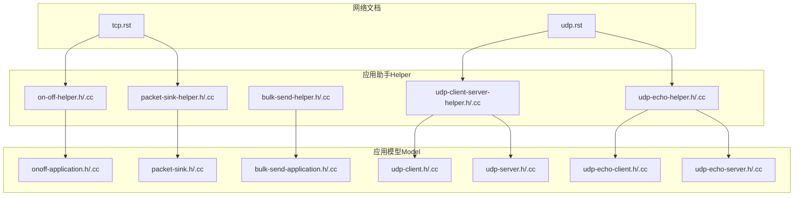
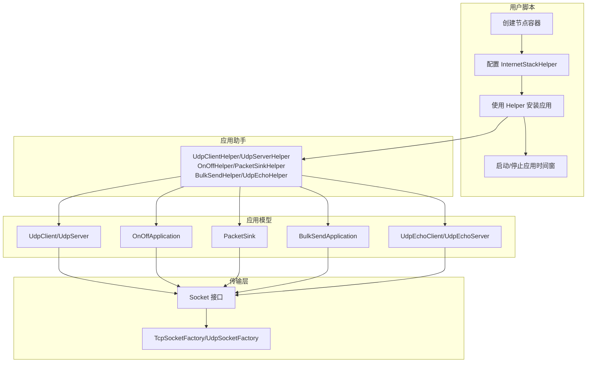
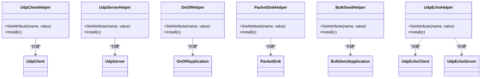
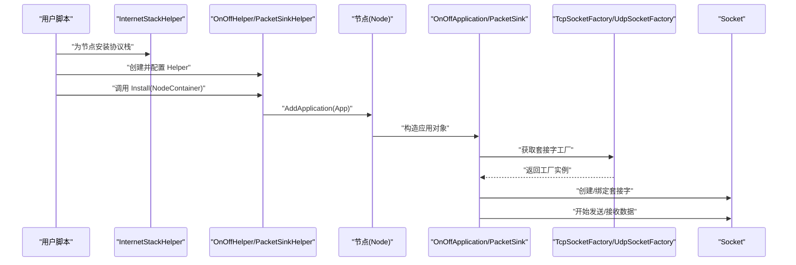
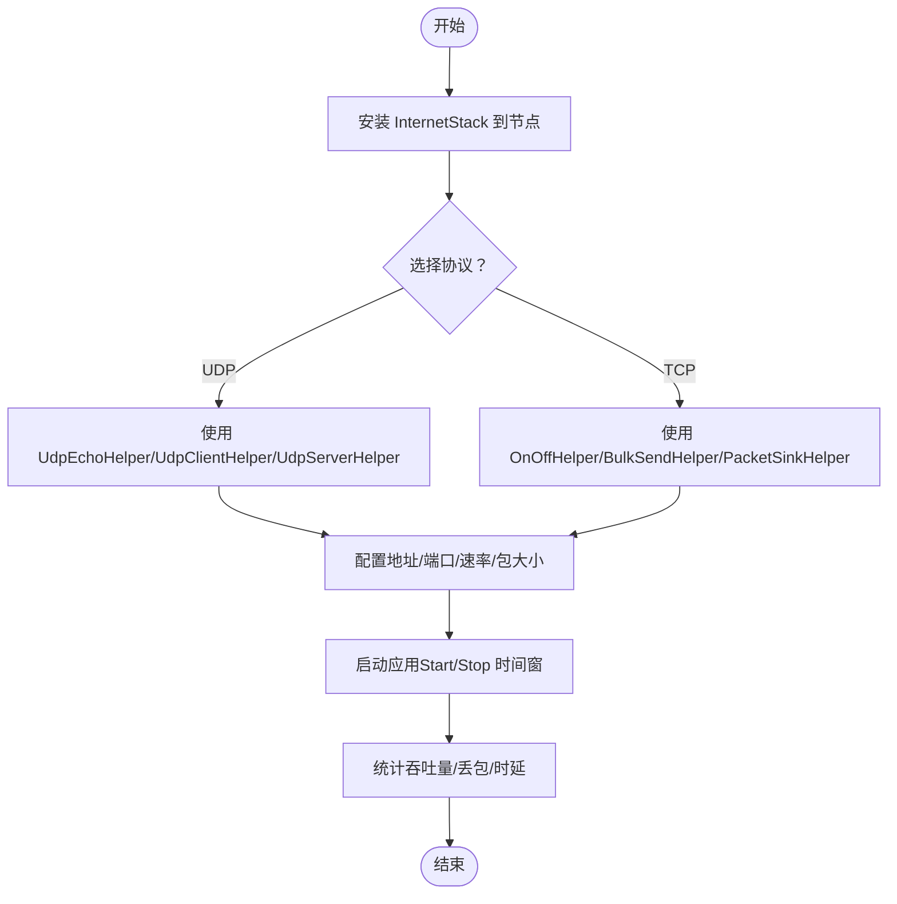

# 应用接口

<cite>
**本文引用的文件**
- [udp-client-server-helper.h](file://simulator/ns-3.39/src/applications/helper/udp-client-server-helper.h)
- [udp-client-server-helper.cc](file://simulator/ns-3.39/src/applications/helper/udp-client-server-helper.cc)
- [on-off-helper.h](file://simulator/ns-3.39/src/applications/helper/on-off-helper.h)
- [on-off-helper.cc](file://simulator/ns-3.39/src/applications/helper/on-off-helper.cc)
- [packet-sink-helper.h](file://simulator/ns-3.39/src/applications/helper/packet-sink-helper.h)
- [packet-sink-helper.cc](file://simulator/ns-3.39/src/applications/helper/packet-sink-helper.cc)
- [bulk-send-helper.h](file://simulator/ns-3.39/src/applications/helper/bulk-send-helper.h)
- [bulk-send-helper.cc](file://simulator/ns-3.39/src/applications/helper/bulk-send-helper.cc)
- [udp-echo-helper.h](file://simulator/ns-3.39/src/applications/helper/udp-echo-helper.h)
- [udp-echo-helper.cc](file://simulator/ns-3.39/src/applications/helper/udp-echo-helper.cc)
- [onoff-application.h](file://simulator/ns-3.39/src/applications/model/onoff-application.h)
- [onoff-application.cc](file://simulator/ns-3.39/src/applications/model/onoff-application.cc)
- [packet-sink.h](file://simulator/ns-3.39/src/applications/model/packet-sink.h)
- [packet-sink.cc](file://simulator/ns-3.39/src/applications/model/packet-sink.cc)
- [bulk-send-application.h](file://simulator/ns-3.39/src/applications/model/bulk-send-application.h)
- [bulk-send-application.cc](file://simulator/ns-3.39/src/applications/model/bulk-send-application.cc)
- [udp-client.h](file://simulator/ns-3.39/src/applications/model/udp-client.h)
- [udp-client.cc](file://simulator/ns-3.39/src/applications/model/udp-client.cc)
- [udp-server.h](file://simulator/ns-3.39/src/applications/model/udp-server.h)
- [udp-server.cc](file://simulator/ns-3.39/src/applications/model/udp-server.cc)
- [udp-echo-client.h](file://simulator/ns-3.39/src/applications/model/udp-echo-client.h)
- [udp-echo-client.cc](file://simulator/ns-3.39/src/applications/model/udp-echo-client.cc)
- [udp-echo-server.h](file://simulator/ns-3.39/src/applications/model/udp-echo-server.h)
- [udp-echo-server.cc](file://simulator/ns-3.39/src/applications/model/udp-echo-server.cc)
- [tcp.rst](file://simulator/ns-3.39/src/internet/doc/tcp.rst)
- [udp.rst](file://simulator/ns-3.39/src/internet/doc/udp.rst)
</cite>

## 目录
1. [引言](#引言)
2. [项目结构](#项目结构)
3. [核心组件](#核心组件)
4. [架构总览](#架构总览)
5. [详细组件分析](#详细组件分析)
6. [依赖关系分析](#依赖关系分析)
7. [性能考虑](#性能考虑)
8. [故障排查指南](#故障排查指南)
9. [结论](#结论)
10. [附录](#附录)

## 引言
本文件系统化梳理 NS-3 的应用接口，重点覆盖应用层助手类（如 UdpClientHelper、UdpServerHelper、OnOffHelper、PacketSinkHelper、BulkSendHelper 等）的设计与使用，以及标准应用模型（OnOffApplication、PacketSink、BulkSendApplication、UdpClient/UdpServer、UdpEchoClient/UdpEchoServer）的实现与配置。文档同时解释应用与传输层的集成方式（套接字工厂、地址绑定、连接管理、数据传输），并给出典型应用模式（如 UDP 回显、HTTP 客户端/服务器、FTP 风格批量传输）的参考流程与最佳实践。

## 项目结构
应用接口主要分布在 applications 模块的 helper 与 model 子目录中，并通过 internet 文档对 TCP/UDP 的使用进行说明。下图展示与本文相关的模块与文件关系：

图表来源
- [udp-client-server-helper.h:116-147](file://simulator/ns-3.39/src/applications/helper/udp-client-server-helper.h#L116-L147)
- [on-off-helper.h](file://simulator/ns-3.39/src/applications/helper/on-off-helper.h)
- [packet-sink-helper.h](file://simulator/ns-3.39/src/applications/helper/packet-sink-helper.h)
- [bulk-send-helper.h](file://simulator/ns-3.39/src/applications/helper/bulk-send-helper.h)
- [udp-echo-helper.h](file://simulator/ns-3.39/src/applications/helper/udp-echo-helper.h)
- [onoff-application.h](file://simulator/ns-3.39/src/applications/model/onoff-application.h)
- [packet-sink.h](file://simulator/ns-3.39/src/applications/model/packet-sink.h)
- [bulk-send-application.h](file://simulator/ns-3.39/src/applications/model/bulk-send-application.h)
- [udp-client.h](file://simulator/ns-3.39/src/applications/model/udp-client.h)
- [udp-server.h](file://simulator/ns-3.39/src/applications/model/udp-server.h)
- [udp-echo-client.h](file://simulator/ns-3.39/src/applications/model/udp-echo-client.h)
- [udp-echo-server.h](file://simulator/ns-3.39/src/applications/model/udp-echo-server.h)
- [tcp.rst:109-138](file://simulator/ns-3.39/src/internet/doc/tcp.rst#L109-L138)
- [udp.rst:61-93](file://simulator/ns-3.39/src/internet/doc/udp.rst#L61-L93)

章节来源
- [udp-client-server-helper.h:116-147](file://simulator/ns-3.39/src/applications/helper/udp-client-server-helper.h#L116-L147)
- [on-off-helper.h](file://simulator/ns-3.39/src/applications/helper/on-off-helper.h)
- [packet-sink-helper.h](file://simulator/ns-3.39/src/applications/helper/packet-sink-helper.h)
- [bulk-send-helper.h](file://simulator/ns-3.39/src/applications/helper/bulk-send-helper.h)
- [udp-echo-helper.h](file://simulator/ns-3.39/src/applications/helper/udp-echo-helper.h)
- [tcp.rst:109-138](file://simulator/ns-3.39/src/internet/doc/tcp.rst#L109-L138)
- [udp.rst:61-93](file://simulator/ns-3.39/src/internet/doc/udp.rst#L61-L93)

## 核心组件
- 应用助手类（Helpers）
  - UdpClientHelper/UdpServerHelper：用于快速部署 UDP 客户端/服务端应用，支持设置远端地址、端口、发送速率、包大小等属性。
  - OnOffHelper：用于部署按“开/关”模式工作的流量源（如 UDP 或 TCP），可配置 On/OFF 时间、数据速率、包大小等。
  - PacketSinkHelper：用于在接收端安装数据接收应用，统计吞吐量、丢包等指标。
  - BulkSendHelper：用于以最大可用速率持续发送数据，适合大文件或高带宽场景。
  - UdpEchoHelper：封装 UDP 回显客户端/服务端，便于测试链路连通性与延迟。
- 标准应用模型（Applications）
  - OnOffApplication：根据 On/Off 模式定时产生数据，适配 TCP/UDP 套接字。
  - PacketSink：从套接字读取数据并统计接收指标。
  - BulkSendApplication：持续发送数据，直至缓冲区清空或停止。
  - UdpClient/UdpServer：基于 UDP 的客户端/服务端应用，负责连接建立（无连接）、收发数据。
  - UdpEchoClient/UdpEchoServer：回显应用，常用于连通性测试。
- 与传输层集成
  - 通过 SocketFactory（如 TcpSocketFactory、UdpSocketFactory）选择传输协议。
  - 使用 InternetStackHelper 在节点上安装协议栈后，借助 Helper 将具体应用附加到节点。
  - 可通过 Socket::CreateSocket 获取底层套接字指针以进行更细粒度的控制（如绑定本地地址、设置选项）。

章节来源
- [udp-client-server-helper.cc:41-104](file://simulator/ns-3.39/src/applications/helper/udp-client-server-helper.cc#L41-L104)
- [on-off-helper.cc](file://simulator/ns-3.39/src/applications/helper/on-off-helper.cc)
- [packet-sink-helper.cc](file://simulator/ns-3.39/src/applications/helper/packet-sink-helper.cc)
- [bulk-send-helper.cc](file://simulator/ns-3.39/src/applications/helper/bulk-send-helper.cc)
- [udp-echo-helper.cc](file://simulator/ns-3.39/src/applications/helper/udp-echo-helper.cc)
- [onoff-application.h](file://simulator/ns-3.39/src/applications/model/onoff-application.h)
- [packet-sink.h](file://simulator/ns-3.39/src/applications/model/packet-sink.h)
- [bulk-send-application.h](file://simulator/ns-3.39/src/applications/model/bulk-send-application.h)
- [udp-client.h](file://simulator/ns-3.39/src/applications/model/udp-client.h)
- [udp-server.h](file://simulator/ns-3.39/src/applications/model/udp-server.h)
- [udp-echo-client.h](file://simulator/ns-3.39/src/applications/model/udp-echo-client.h)
- [udp-echo-server.h](file://simulator/ns-3.39/src/applications/model/udp-echo-server.h)
- [tcp.rst:109-138](file://simulator/ns-3.39/src/internet/doc/tcp.rst#L109-L138)
- [udp.rst:61-93](file://simulator/ns-3.39/src/internet/doc/udp.rst#L61-L93)

## 架构总览
下图展示了应用助手如何将应用模型安装到节点，并与传输层（TCP/UDP）协作完成数据收发：

图表来源
- [udp-client-server-helper.cc:47-104](file://simulator/ns-3.39/src/applications/helper/udp-client-server-helper.cc#L47-L104)
- [on-off-helper.cc](file://simulator/ns-3.39/src/applications/helper/on-off-helper.cc)
- [packet-sink-helper.cc](file://simulator/ns-3.39/src/applications/helper/packet-sink-helper.cc)
- [bulk-send-helper.cc](file://simulator/ns-3.39/src/applications/helper/bulk-send-helper.cc)
- [udp-echo-helper.cc](file://simulator/ns-3.39/src/applications/helper/udp-echo-helper.cc)
- [onoff-application.cc](file://simulator/ns-3.39/src/applications/model/onoff-application.cc)
- [packet-sink.cc](file://simulator/ns-3.39/src/applications/model/packet-sink.cc)
- [bulk-send-application.cc](file://simulator/ns-3.39/src/applications/model/bulk-send-application.cc)
- [udp-client.cc](file://simulator/ns-3.39/src/applications/model/udp-client.cc)
- [udp-server.cc](file://simulator/ns-3.39/src/applications/model/udp-server.cc)
- [udp-echo-client.cc](file://simulator/ns-3.39/src/applications/model/udp-echo-client.cc)
- [udp-echo-server.cc](file://simulator/ns-3.39/src/applications/model/udp-echo-server.cc)

## 详细组件分析

### 应用助手类设计与使用
- UdpClientHelper/UdpServerHelper
  - 设计要点：内部使用 ObjectFactory 创建对应应用实例；支持通过 SetAttribute 设置应用属性；Install(NodeContainer) 将应用逐个附加到节点。
  - 关键路径：[UdpClientHelper::Install:92-104](file://simulator/ns-3.39/src/applications/helper/udp-client-server-helper.cc#L92-L104)，[UdpServerHelper::Install:47-60](file://simulator/ns-3.39/src/applications/helper/udp-client-server-helper.cc#L47-L60)。
  - 典型用途：快速搭建 UDP 客户端/服务端，设置远端地址、端口、发送速率等。
- OnOffHelper
  - 设计要点：通过 SetAttribute 配置 On/Off 模式参数（如 OnTime、OffTime、DataRate、PacketSize 等）；Install 后返回 ApplicationContainer。
  - 典型用途：模拟突发流量、恒定比特率流量，支持 TCP/UDP。
- PacketSinkHelper
  - 设计要点：安装 PacketSink 到指定节点，用于统计接收吞吐量、丢包等。
- BulkSendHelper
  - 设计要点：以最大可用速率持续发送，适合大文件传输场景。
- UdpEchoHelper
  - 设计要点：封装 Echo 客户端/服务端，便于连通性与时延测试。

章节来源
- [udp-client-server-helper.h:116-147](file://simulator/ns-3.39/src/applications/helper/udp-client-server-helper.h#L116-L147)
- [udp-client-server-helper.cc:41-104](file://simulator/ns-3.39/src/applications/helper/udp-client-server-helper.cc#L41-L104)
- [on-off-helper.h](file://simulator/ns-3.39/src/applications/helper/on-off-helper.h)
- [on-off-helper.cc](file://simulator/ns-3.39/src/applications/helper/on-off-helper.cc)
- [packet-sink-helper.h](file://simulator/ns-3.39/src/applications/helper/packet-sink-helper.h)
- [packet-sink-helper.cc](file://simulator/ns-3.39/src/applications/helper/packet-sink-helper.cc)
- [bulk-send-helper.h](file://simulator/ns-3.39/src/applications/helper/bulk-send-helper.h)
- [bulk-send-helper.cc](file://simulator/ns-3.39/src/applications/helper/bulk-send-helper.cc)
- [udp-echo-helper.h](file://simulator/ns-3.39/src/applications/helper/udp-echo-helper.h)
- [udp-echo-helper.cc](file://simulator/ns-3.39/src/applications/helper/udp-echo-helper.cc)

### 标准应用模型实现
- OnOffApplication
  - 功能：根据 On/Off 模式定时产生数据包；支持 TCP/UDP 套接字。
  - 关键点：状态机驱动（ON/OFF），周期性 ScheduleTx/ScheduleStop。
  - 参考路径：[OnOffApplication 类定义](file://simulator/ns-3.39/src/applications/model/onoff-application.h)，[实现](file://simulator/ns-3.39/src/applications/model/onoff-application.cc)。
- PacketSink
  - 功能：从套接字读取数据并统计接收指标（如总字节数、吞吐量、丢包）。
  - 参考路径：[PacketSink 类定义](file://simulator/ns-3.39/src/applications/model/packet-sink.h)，[实现](file://simulator/ns-3.39/src/applications/model/packet-sink.cc)。
- BulkSendApplication
  - 功能：持续发送数据直到缓冲区清空或停止。
  - 参考路径：[BulkSendApplication 类定义](file://simulator/ns-3.39/src/applications/model/bulk-send-application.h)，[实现](file://simulator/ns-3.39/src/applications/model/bulk-send-application.cc)。
- UdpClient/UdpServer
  - 功能：UDP 客户端/服务端，负责连接（无连接）、收发数据。
  - 参考路径：[UdpClient](file://simulator/ns-3.39/src/applications/model/udp-client.h)，[UdpServer](file://simulator/ns-3.39/src/applications/model/udp-server.h)。
- UdpEchoClient/UdpEchoServer
  - 功能：回显应用，常用于连通性与延迟测试。
  - 参考路径：[UdpEchoClient](file://simulator/ns-3.39/src/applications/model/udp-echo-client.h)，[UdpEchoServer](file://simulator/ns-3.39/src/applications/model/udp-echo-server.h)。

图表来源
- [udp-client-server-helper.cc:47-104](file://simulator/ns-3.39/src/applications/helper/udp-client-server-helper.cc#L47-L104)
- [on-off-helper.cc](file://simulator/ns-3.39/src/applications/helper/on-off-helper.cc)
- [packet-sink-helper.cc](file://simulator/ns-3.39/src/applications/helper/packet-sink-helper.cc)
- [bulk-send-helper.cc](file://simulator/ns-3.39/src/applications/helper/bulk-send-helper.cc)
- [udp-echo-helper.cc](file://simulator/ns-3.39/src/applications/helper/udp-echo-helper.cc)
- [udp-client.h](file://simulator/ns-3.39/src/applications/model/udp-client.h)
- [udp-server.h](file://simulator/ns-3.39/src/applications/model/udp-server.h)
- [onoff-application.h](file://simulator/ns-3.39/src/applications/model/onoff-application.h)
- [packet-sink.h](file://simulator/ns-3.39/src/applications/model/packet-sink.h)
- [bulk-send-application.h](file://simulator/ns-3.39/src/applications/model/bulk-send-application.h)
- [udp-echo-client.h](file://simulator/ns-3.39/src/applications/model/udp-echo-client.h)
- [udp-echo-server.h](file://simulator/ns-3.39/src/applications/model/udp-echo-server.h)

章节来源
- [onoff-application.h](file://simulator/ns-3.39/src/applications/model/onoff-application.h)
- [onoff-application.cc](file://simulator/ns-3.39/src/applications/model/onoff-application.cc)
- [packet-sink.h](file://simulator/ns-3.39/src/applications/model/packet-sink.h)
- [packet-sink.cc](file://simulator/ns-3.39/src/applications/model/packet-sink.cc)
- [bulk-send-application.h](file://simulator/ns-3.39/src/applications/model/bulk-send-application.h)
- [bulk-send-application.cc](file://simulator/ns-3.39/src/applications/model/bulk-send-application.cc)
- [udp-client.h](file://simulator/ns-3.39/src/applications/model/udp-client.h)
- [udp-client.cc](file://simulator/ns-3.39/src/applications/model/udp-client.cc)
- [udp-server.h](file://simulator/ns-3.39/src/applications/model/udp-server.h)
- [udp-server.cc](file://simulator/ns-3.39/src/applications/model/udp-server.cc)
- [udp-echo-client.h](file://simulator/ns-3.39/src/applications/model/udp-echo-client.h)
- [udp-echo-client.cc](file://simulator/ns-3.39/src/applications/model/udp-echo-client.cc)
- [udp-echo-server.h](file://simulator/ns-3.39/src/applications/model/udp-echo-server.h)
- [udp-echo-server.cc](file://simulator/ns-3.39/src/applications/model/udp-echo-server.cc)

### 应用与传输层集成流程
- 选择套接字工厂
  - TCP：使用 TcpSocketFactory；默认随 InternetStack 聚合到节点。
  - UDP：使用 UdpSocketFactory；也可通过 Socket::CreateSocket 获取底层套接字。
- 安装应用
  - 通过 Helper 的 Install 将应用附加到节点；应用内部通过 SocketFactory 获取套接字。
- 数据传输
  - OnOffApplication/BulkSendApplication 等根据配置周期性发送数据。
  - PacketSink 统计接收侧指标。

图表来源
- [tcp.rst:109-138](file://simulator/ns-3.39/src/internet/doc/tcp.rst#L109-L138)
- [udp.rst:61-93](file://simulator/ns-3.39/src/internet/doc/udp.rst#L61-L93)
- [on-off-helper.cc](file://simulator/ns-3.39/src/applications/helper/on-off-helper.cc)
- [packet-sink-helper.cc](file://simulator/ns-3.39/src/applications/helper/packet-sink-helper.cc)
- [onoff-application.cc](file://simulator/ns-3.39/src/applications/model/onoff-application.cc)
- [packet-sink.cc](file://simulator/ns-3.39/src/applications/model/packet-sink.cc)

章节来源
- [tcp.rst:109-138](file://simulator/ns-3.39/src/internet/doc/tcp.rst#L109-L138)
- [udp.rst:61-93](file://simulator/ns-3.39/src/internet/doc/udp.rst#L61-L93)
- [on-off-helper.cc](file://simulator/ns-3.39/src/applications/helper/on-off-helper.cc)
- [packet-sink-helper.cc](file://simulator/ns-3.39/src/applications/helper/packet-sink-helper.cc)
- [onoff-application.cc](file://simulator/ns-3.39/src/applications/model/onoff-application.cc)
- [packet-sink.cc](file://simulator/ns-3.39/src/applications/model/packet-sink.cc)

### 典型应用模式与参考流程
- UDP 回显（Echo）
  - 步骤：安装 UdpEchoHelper 到服务端节点与客户端节点；配置本地监听地址与远端地址；设置启动/停止时间窗。
  - 参考路径：[UdpEchoHelper 安装与使用](file://simulator/ns-3.39/src/applications/helper/udp-echo-helper.cc)，[UdpEchoServer](file://simulator/ns-3.39/src/applications/model/udp-echo-server.h)，[UdpEchoClient](file://simulator/ns-3.39/src/applications/model/udp-echo-client.h)。
- UDP 文件传输（FTP 风格）
  - 思路：使用 UdpServerHelper 作为服务端，UdpClientHelper 作为客户端；客户端设置远端地址与端口；服务端使用 PacketSink 统计接收。
  - 参考路径：[UdpServerHelper:47-66](file://simulator/ns-3.39/src/applications/helper/udp-client-server-helper.cc#L47-L66)，[UdpClientHelper:68-104](file://simulator/ns-3.39/src/applications/helper/udp-client-server-helper.cc#L68-L104)，[PacketSinkHelper](file://simulator/ns-3.39/src/applications/helper/packet-sink-helper.cc)。
- TCP 大文件传输（HTTP 风格）
  - 思路：使用 OnOffHelper（TCP）或 BulkSendHelper（TCP）作为客户端，PacketSinkHelper 作为服务端；通过 TcpSocketFactory 选择 TCP 协议。
  - 参考路径：[OnOffHelper（TCP）](file://simulator/ns-3.39/src/applications/helper/on-off-helper.cc)，[PacketSinkHelper](file://simulator/ns-3.39/src/applications/helper/packet-sink-helper.cc)，[tcp.rst:109-138](file://simulator/ns-3.39/src/internet/doc/tcp.rst#L109-L138)。

图表来源
- [udp-echo-helper.cc](file://simulator/ns-3.39/src/applications/helper/udp-echo-helper.cc)
- [udp-client-server-helper.cc:47-104](file://simulator/ns-3.39/src/applications/helper/udp-client-server-helper.cc#L47-L104)
- [on-off-helper.cc](file://simulator/ns-3.39/src/applications/helper/on-off-helper.cc)
- [packet-sink-helper.cc](file://simulator/ns-3.39/src/applications/helper/packet-sink-helper.cc)
- [tcp.rst:109-138](file://simulator/ns-3.39/src/internet/doc/tcp.rst#L109-L138)
- [udp.rst:61-93](file://simulator/ns-3.39/src/internet/doc/udp.rst#L61-L93)

章节来源
- [udp-echo-helper.cc](file://simulator/ns-3.39/src/applications/helper/udp-echo-helper.cc)
- [udp-client-server-helper.cc:47-104](file://simulator/ns-3.39/src/applications/helper/udp-client-server-helper.cc#L47-L104)
- [on-off-helper.cc](file://simulator/ns-3.39/src/applications/helper/on-off-helper.cc)
- [packet-sink-helper.cc](file://simulator/ns-3.39/src/applications/helper/packet-sink-helper.cc)
- [tcp.rst:109-138](file://simulator/ns-3.39/src/internet/doc/tcp.rst#L109-L138)
- [udp.rst:61-93](file://simulator/ns-3.39/src/internet/doc/udp.rst#L61-L93)

## 依赖关系分析
- 组件耦合
  - Helper 与 Model：Helper 通过 ObjectFactory 创建具体应用实例，耦合度低，便于扩展新应用类型。
  - 应用与传输层：应用通过 SocketFactory 获取套接字，进一步解耦于具体传输协议实现。
- 外部依赖
  - InternetStackHelper：必须先在节点上安装协议栈，才能使用 Helper 安装应用。
  - SocketFactory：决定使用 TCP 还是 UDP；默认随 InternetStack 聚合到节点。

图表来源
- [on-off-helper.cc](file://simulator/ns-3.39/src/applications/helper/on-off-helper.cc)
- [packet-sink-helper.cc](file://simulator/ns-3.39/src/applications/helper/packet-sink-helper.cc)
- [udp-client-server-helper.cc:47-104](file://simulator/ns-3.39/src/applications/helper/udp-client-server-helper.cc#L47-L104)
- [onoff-application.cc](file://simulator/ns-3.39/src/applications/model/onoff-application.cc)
- [packet-sink.cc](file://simulator/ns-3.39/src/applications/model/packet-sink.cc)
- [udp-client.cc](file://simulator/ns-3.39/src/applications/model/udp-client.cc)
- [udp-server.cc](file://simulator/ns-3.39/src/applications/model/udp-server.cc)

章节来源
- [on-off-helper.cc](file://simulator/ns-3.39/src/applications/helper/on-off-helper.cc)
- [packet-sink-helper.cc](file://simulator/ns-3.39/src/applications/helper/packet-sink-helper.cc)
- [udp-client-server-helper.cc:47-104](file://simulator/ns-3.39/src/applications/helper/udp-client-server-helper.cc#L47-L104)
- [onoff-application.cc](file://simulator/ns-3.39/src/applications/model/onoff-application.cc)
- [packet-sink.cc](file://simulator/ns-3.39/src/applications/model/packet-sink.cc)
- [udp-client.cc](file://simulator/ns-3.39/src/applications/model/udp-client.cc)
- [udp-server.cc](file://simulator/ns-3.39/src/applications/model/udp-server.cc)

## 性能考虑
- 速率与包大小
  - 通过 OnOffHelper/BulkSendHelper 的 DataRate、PacketSize 属性调整吞吐与队列压力。
- 并发与多流
  - 使用多个节点容器与不同端口/地址组合，模拟多流并发场景。
- 监控与统计
  - 使用 PacketSink 统计接收侧指标；结合 FlowMonitor 进行端到端性能评估。
- 协议选择
  - TCP 适合可靠传输与大文件；UDP 适合实时性要求高、可容忍丢包的场景。

## 故障排查指南
- 应用未启动
  - 检查是否正确安装 InternetStack；确认 Helper 的 Install 是否被调用；核对 Start/Stop 时间窗。
- 无法收到数据
  - 检查地址/端口配置；确保 PacketSink 的监听地址与应用 Remote 地址一致。
- 速率异常
  - 检查 DataRate、PacketSize 设置；确认链路带宽与队列限制；避免过小包导致开销占比过高。
- 自定义应用开发
  - 新建派生类继承 Application；在 DoInitialize 中获取/创建套接字；在 DoDispose 中释放资源；注册必要属性并通过 Helper 的 SetAttribute 注入。

章节来源
- [on-off-helper.cc](file://simulator/ns-3.39/src/applications/helper/on-off-helper.cc)
- [packet-sink-helper.cc](file://simulator/ns-3.39/src/applications/helper/packet-sink-helper.cc)
- [udp-client-server-helper.cc:47-104](file://simulator/ns-3.39/src/applications/helper/udp-client-server-helper.cc#L47-L104)
- [onoff-application.cc](file://simulator/ns-3.39/src/applications/model/onoff-application.cc)
- [packet-sink.cc](file://simulator/ns-3.39/src/applications/model/packet-sink.cc)

## 结论
NS-3 的应用接口通过 Helper 与 Model 的清晰分层，提供了高效、可扩展的应用构建能力。借助 SocketFactory 与 InternetStack 的配合，用户可以快速搭建 TCP/UDP 的典型应用场景，并通过统一的属性配置与生命周期管理实现灵活的仿真目标。对于复杂需求，可在现有应用基础上扩展自定义应用，满足特定业务模型与性能优化目标。

## 附录
- 参考文档
  - [TCP 使用说明:109-138](file://simulator/ns-3.39/src/internet/doc/tcp.rst#L109-L138)
  - [UDP 使用说明:61-93](file://simulator/ns-3.39/src/internet/doc/udp.rst#L61-L93)
- 关键实现位置
  - [UdpClientHelper/UdpServerHelper 实现:47-104](file://simulator/ns-3.39/src/applications/helper/udp-client-server-helper.cc#L47-L104)
  - [OnOffHelper 实现](file://simulator/ns-3.39/src/applications/helper/on-off-helper.cc)
  - [PacketSinkHelper 实现](file://simulator/ns-3.39/src/applications/helper/packet-sink-helper.cc)
  - [BulkSendHelper 实现](file://simulator/ns-3.39/src/applications/helper/bulk-send-helper.cc)
  - [UdpEchoHelper 实现](file://simulator/ns-3.39/src/applications/helper/udp-echo-helper.cc)
  - [OnOffApplication 实现](file://simulator/ns-3.39/src/applications/model/onoff-application.cc)
  - [PacketSink 实现](file://simulator/ns-3.39/src/applications/model/packet-sink.cc)
  - [BulkSendApplication 实现](file://simulator/ns-3.39/src/applications/model/bulk-send-application.cc)
  - [UdpClient/UdpServer 实现](file://simulator/ns-3.39/src/applications/model/udp-client.cc)，(file://simulator/ns-3.39/src/applications/model/udp-server.cc)
  - [UdpEchoClient/UdpEchoServer 实现](file://simulator/ns-3.39/src/applications/model/udp-echo-client.cc)，(file://simulator/ns-3.39/src/applications/model/udp-echo-server.cc)