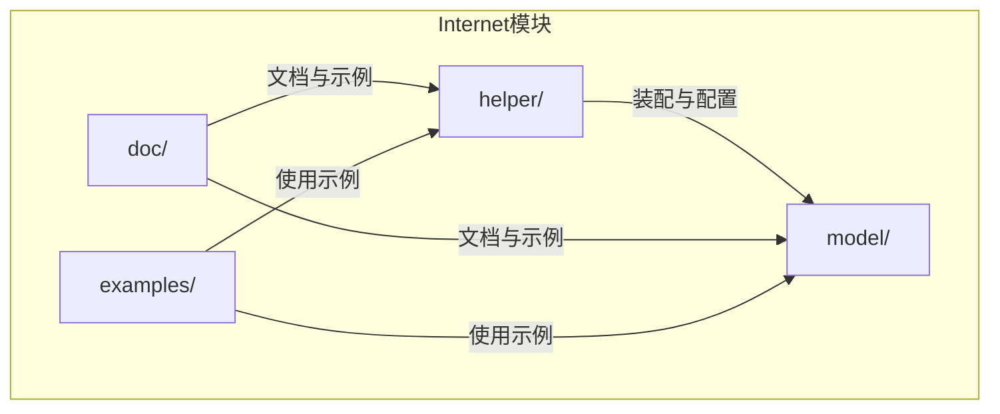
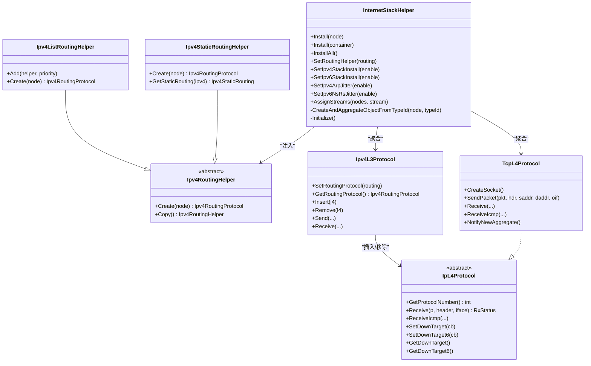
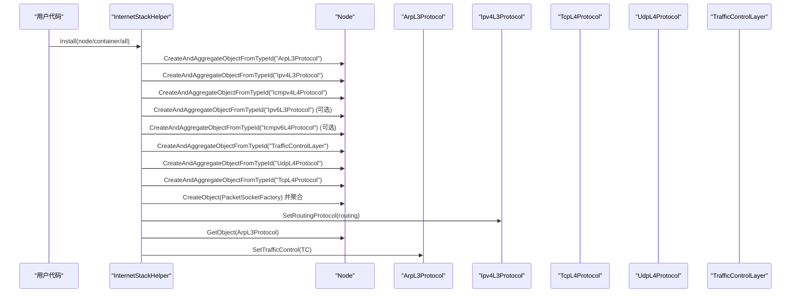
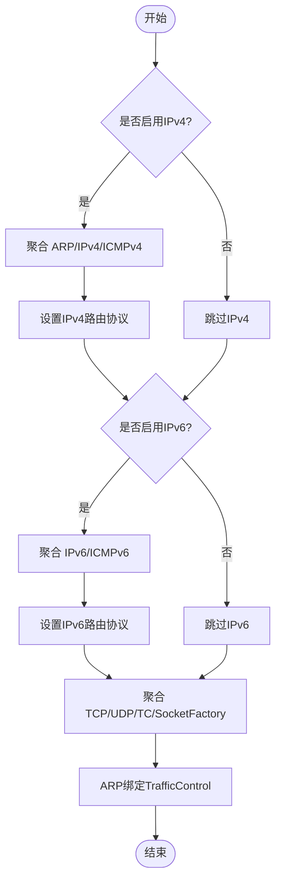
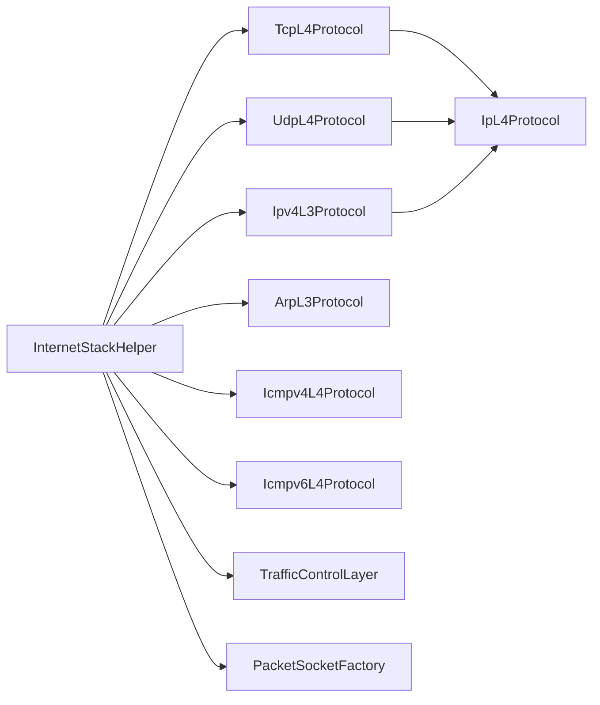

# 核心网络层（Core）

<cite>
**本文引用的文件列表**
- [internet-stack-helper.h](file://simulator/ns-3.39/src/internet/helper/internet-stack-helper.h)
- [internet-stack-helper.cc](file://simulator/ns-3.39/src/internet/helper/internet-stack-helper.cc)
- [ipv4-l3-protocol.h](file://simulator/ns-3.39/src/internet/model/ipv4-l3-protocol.h)
- [tcp-l4-protocol.h](file://simulator/ns-3.39/src/internet/model/tcp-l4-protocol.h)
- [ip-l4-protocol.h](file://simulator/ns-3.39/src/internet/model/ip-l4-protocol.h)
- [ipv4-list-routing-helper.h](file://simulator/ns-3.39/src/internet/helper/ipv4-list-routing-helper.h)
- [ipv4-static-routing-helper.h](file://simulator/ns-3.39/src/internet/helper/ipv4-static-routing-helper.h)
- [internet-stack.rst](file://simulator/ns-3.39/src/internet/doc/internet-stack.rst)
- [first.cc](file://simulator/ns-3.39/examples/tutorial/first.cc)
</cite>

## 目录
1. [引言](#引言)
2. [项目结构](#项目结构)
3. [核心组件](#核心组件)
4. [架构总览](#架构总览)
5. [详细组件分析](#详细组件分析)
6. [依赖关系分析](#依赖关系分析)
7. [性能考量](#性能考量)
8. [故障排查指南](#故障排查指南)
9. [结论](#结论)
10. [附录：使用示例与最佳实践](#附录使用示例与最佳实践)

## 引言
本文件聚焦于NS-3互联网协议模块的核心网络层，系统性解析InternetStackHelper类的设计与实现，覆盖网络栈初始化、协议层绑定、全局配置管理、对象工厂模式应用、协议间接口规范、配置参数传递机制、与其他模块的集成与扩展方式，并给出性能优化策略与最佳实践。目标是帮助读者在不深入源码细节的前提下，也能高效地使用与扩展该核心网络层。

## 项目结构
NS-3的互联网模块位于“src/internet”，包含：
- helper：高层辅助类，负责协议栈装配与配置（如InternetStackHelper、路由助手等）
- model：协议实现（如IPv4/IPv6、ICMP、TCP/UDP、端点复用等）
- doc：文档与示意图
- examples：使用示例脚本

图示来源
- [internet-stack.rst:1-318](file://simulator/ns-3.39/src/internet/doc/internet-stack.rst#L1-L318)

章节来源
- [internet-stack.rst:1-318](file://simulator/ns-3.39/src/internet/doc/internet-stack.rst#L1-L318)

## 核心组件
- InternetStackHelper：负责为节点聚合IP/TCP/UDP/ICMP/ARP/流量控制等协议栈，并支持路由协议选择、跟踪（pcap/ascii）与随机流分配。
- 路由助手体系：通过Ipv4RoutingHelper/Ipv6RoutingHelper抽象，允许用户以工厂方式注入静态或动态路由策略。
- 协议层抽象：IpL4Protocol定义传输层协议通用接口；TcpL4Protocol、UdpL4Protocol分别实现具体传输层逻辑。
- 关键模型：Ipv4L3Protocol承载IPv4三层功能（转发、分片、本地交付、路由回调等）。

章节来源
- [internet-stack-helper.h:88-344](file://simulator/ns-3.39/src/internet/helper/internet-stack-helper.h#L88-L344)
- [internet-stack-helper.cc:116-182](file://simulator/ns-3.39/src/internet/helper/internet-stack-helper.cc#L116-L182)
- [ip-l4-protocol.h:51-191](file://simulator/ns-3.39/src/internet/model/ip-l4-protocol.h#L51-L191)
- [tcp-l4-protocol.h:80-384](file://simulator/ns-3.39/src/internet/model/tcp-l4-protocol.h#L80-L384)
- [ipv4-l3-protocol.h:81-638](file://simulator/ns-3.39/src/internet/model/ipv4-l3-protocol.h#L81-L638)

## 架构总览
InternetStackHelper采用“对象工厂+协议层绑定”的架构：
- 对象工厂：CreateAndAggregateObjectFromTypeId基于类型名创建并聚合协议对象到节点。
- 协议层绑定：将L4协议（TCP/UDP）与L3协议（IPv4/IPv6/ARP/ICMP）绑定，建立上下行回调链路。
- 全局配置：通过SetRoutingHelper注入路由策略；通过SetIpv4/Ipv6开关、SetIpv4ArpJitter/Ipv6NsRsJitter等控制行为。
- 追踪与统计：封装pcap/ascii跟踪能力，按接口对事件进行过滤与输出。

图示来源
- [internet-stack-helper.h:88-344](file://simulator/ns-3.39/src/internet/helper/internet-stack-helper.h#L88-L344)
- [ipv4-list-routing-helper.h:38-94](file://simulator/ns-3.39/src/internet/helper/ipv4-list-routing-helper.h#L38-L94)
- [ipv4-static-routing-helper.h:42-200](file://simulator/ns-3.39/src/internet/helper/ipv4-static-routing-helper.h#L42-L200)
- [ip-l4-protocol.h:51-191](file://simulator/ns-3.39/src/internet/model/ip-l4-protocol.h#L51-L191)
- [tcp-l4-protocol.h:80-384](file://simulator/ns-3.39/src/internet/model/tcp-l4-protocol.h#L80-L384)
- [ipv4-l3-protocol.h:81-638](file://simulator/ns-3.39/src/internet/model/ipv4-l3-protocol.h#L81-L638)

## 详细组件分析

### InternetStackHelper 设计与实现
- 初始化与默认配置
  - 默认启用IPv4/IPv6，设置静态+全局路由组合（优先级），并支持重置。
- 安装流程
  - 条件安装IPv4/IPv6栈：ARP/IPv4/ICMPv4（IPv6：IPv6/ICMPv6）。
  - 注入路由协议（若未设置则从m_routing/m_routingv6创建）。
  - 安装L4：TrafficControlLayer、UdpL4Protocol、TcpL4Protocol；确保PacketSocketFactory存在。
  - 绑定ARP与TrafficControl：将ARP的TC指针设置为节点的TrafficControlLayer。
- 配置与开关
  - SetRoutingHelper：替换路由助手（支持复制）。
  - SetIpv4/Ipv6开关：控制是否安装对应栈。
  - SetIpv4ArpJitter/Ipv6NsRsJitter：关闭ARP/ND抖动（用于确定性仿真）。
- 追踪与统计
  - 封装pcap/ascii跟踪：内部维护接口到文件/流的映射，避免重复连接trace源。
  - 支持按接口过滤事件，兼容无上下文/带上下文两种sink。
- 随机流分配
  - AssignStreams遍历节点，为全局路由、IPv6扩展、ARP/ICMPv6等分配固定随机流索引。

图示来源
- [internet-stack-helper.cc:298-367](file://simulator/ns-3.39/src/internet/helper/internet-stack-helper.cc#L298-L367)

章节来源
- [internet-stack-helper.h:103-182](file://simulator/ns-3.39/src/internet/helper/internet-stack-helper.h#L103-L182)
- [internet-stack-helper.cc:129-182](file://simulator/ns-3.39/src/internet/helper/internet-stack-helper.cc#L129-L182)
- [internet-stack-helper.cc:298-367](file://simulator/ns-3.39/src/internet/helper/internet-stack-helper.cc#L298-L367)
- [internet-stack.rst:22-74](file://simulator/ns-3.39/src/internet/doc/internet-stack.rst#L22-L74)

### 路由助手与协议层绑定
- 路由助手接口
  - Ipv4RoutingHelper/Ipv6RoutingHelper提供Create(node)与Copy()，便于InternetStackHelper按需创建路由协议实例。
- 列表路由
  - Ipv4ListRoutingHelper支持多路由协议组合与优先级排序，适合复杂拓扑场景。
- 静态路由
  - Ipv4StaticRoutingHelper提供静态路由创建与多播路由添加能力，适合小型或教学场景。
- 协议层绑定
  - InternetStackHelper在安装时调用Ipv4::SetRoutingProtocol，将路由协议接入IPv4栈。
  - TcpL4Protocol通过NotifyNewAggregate完成与IPv4/IPv6栈的连接，设置DownTarget回调。

图示来源
- [internet-stack-helper.cc:298-367](file://simulator/ns-3.39/src/internet/helper/internet-stack-helper.cc#L298-L367)
- [ipv4-list-routing-helper.h:38-94](file://simulator/ns-3.39/src/internet/helper/ipv4-list-routing-helper.h#L38-L94)
- [ipv4-static-routing-helper.h:42-200](file://simulator/ns-3.39/src/internet/helper/ipv4-static-routing-helper.h#L42-L200)
- [tcp-l4-protocol.h:291-303](file://simulator/ns-3.39/src/internet/model/tcp-l4-protocol.h#L291-L303)

章节来源
- [ipv4-list-routing-helper.h:38-94](file://simulator/ns-3.39/src/internet/helper/ipv4-list-routing-helper.h#L38-L94)
- [ipv4-static-routing-helper.h:42-200](file://simulator/ns-3.39/src/internet/helper/ipv4-static-routing-helper.h#L42-L200)
- [tcp-l4-protocol.h:291-303](file://simulator/ns-3.39/src/internet/model/tcp-l4-protocol.h#L291-L303)

### 协议层接口规范（IpL4Protocol）
- 抽象接口
  - GetProtocolNumber：返回协议号（如TCP=6）。
  - Receive：接收来自IPv4/IPv6的数据包，返回状态码（RX_OK、RX_CSUM_FAILED等）。
  - ReceiveIcmp：处理ICMP/ICMPv6消息。
  - DownTarget回调：设置向下发送数据包的目标函数（IPv4/IPv6）。
- 实现要点
  - TcpL4Protocol实现Receive、ReceiveIcmp、SendPacket等，负责端点管理、校验与向下投递。
  - Ipv4L3Protocol通过Insert/Remove将L4协议注册到特定接口，建立上行回调链路。

章节来源
- [ip-l4-protocol.h:51-191](file://simulator/ns-3.39/src/internet/model/ip-l4-protocol.h#L51-L191)
- [tcp-l4-protocol.h:260-290](file://simulator/ns-3.39/src/internet/model/tcp-l4-protocol.h#L260-L290)

### 模型组件：Ipv4L3Protocol
- 功能职责
  - 接收来自下层的帧，执行路由查找、分片/重组、本地交付、转发与丢弃。
  - 提供接口管理（AddInterface/GetInterface）、地址管理、MTU/Forwarding控制。
  - 通过SetRoutingProtocol注入路由协议，建立Unicast/Multicast/LocalDeliver回调。
- 关键特性
  - 支持Trace回调（Tx/Rx/Drop/SendOutgoing/UnicastForward/LocalDeliver）。
  - 处理重复检测、分片超时、弱ES模型等高级行为。

章节来源
- [ipv4-l3-protocol.h:81-638](file://simulator/ns-3.39/src/internet/model/ipv4-l3-protocol.h#L81-L638)

## 依赖关系分析
- InternetStackHelper依赖
  - 路由助手：Ipv4ListRoutingHelper/Ipv4StaticRoutingHelper/Ipv6StaticRoutingHelper。
  - 协议模型：ArpL3Protocol、Ipv4L3Protocol、Icmpv4L4Protocol、Ipv6L3Protocol、Icmpv6L4Protocol、UdpL4Protocol、TcpL4Protocol、TrafficControlLayer、PacketSocketFactory。
- 协议层依赖
  - TcpL4Protocol依赖IpL4Protocol接口，向上通过端点复用器分发，向下通过DownTarget回调发送至IPv4/IPv6。
  - Ipv4L3Protocol依赖路由协议与L4协议容器，实现统一的三层转发与控制面交互。

图示来源
- [internet-stack-helper.cc:298-367](file://simulator/ns-3.39/src/internet/helper/internet-stack-helper.cc#L298-L367)
- [ip-l4-protocol.h:51-191](file://simulator/ns-3.39/src/internet/model/ip-l4-protocol.h#L51-L191)
- [tcp-l4-protocol.h:80-384](file://simulator/ns-3.39/src/internet/model/tcp-l4-protocol.h#L80-L384)

章节来源
- [internet-stack-helper.cc:298-367](file://simulator/ns-3.39/src/internet/helper/internet-stack-helper.cc#L298-L367)
- [ip-l4-protocol.h:51-191](file://simulator/ns-3.39/src/internet/model/ip-l4-protocol.h#L51-L191)

## 性能考量
- 确定性仿真
  - 关闭ARP/ND抖动（SetIpv4ArpJitter/SetIpv6NsRsJitter）可减少随机性带来的方差。
- 流量控制与队列
  - TrafficControlLayer参与ARP路径绑定，有助于队列行为的一致性。
- 路由策略
  - 列表路由中合理设置优先级，避免过多回退与查询开销。
- 追踪成本
  - pcap/ascii跟踪会引入额外开销，仅在调试阶段开启；必要时按接口过滤以降低写盘压力。
- 批量安装
  - 使用InstallAll或批量容器安装，减少重复初始化成本。

[本节为通用指导，无需特定文件引用]

## 故障排查指南
- 常见问题
  - 在已存在IPv4/IPv6对象的节点上再次安装InternetStackHelper会触发致命错误。
  - ARP缓存队列过小导致突发/巨包丢弃，可通过增大PendingQueueSize缓解。
  - 未正确设置路由导致报文无法转发。
- 排查建议
  - 启用相关组件日志（如UdpEchoClient/Server）定位应用层问题。
  - 使用pcap/ascii跟踪观察Tx/Rx/Drop事件，结合路由表与接口状态判断。
  - 检查ARP/ND抖动与队列长度配置，必要时关闭抖动并调整队列参数。

章节来源
- [internet-stack.rst:166-174](file://simulator/ns-3.39/src/internet/doc/internet-stack.rst#L166-L174)

## 结论
InternetStackHelper通过对象工厂与协议层绑定，实现了对节点的网络栈装配与配置管理。借助路由助手体系，用户可以灵活选择静态或动态路由策略；通过统一的IpL4Protocol接口，TCP/UDP等传输层协议得以与IPv4/IPv6栈无缝对接。配合追踪与随机流分配机制，该核心网络层既满足教学演示，也适用于复杂仿真实验。

[本节为总结，无需特定文件引用]

## 附录：使用示例与最佳实践

### 示例：创建网络栈与基本应用
- 步骤概览
  - 创建节点与设备，安装InternetStackHelper，分配IPv4地址，部署应用。
- 参考路径
  - [first.cc:53-74](file://simulator/ns-3.39/examples/tutorial/first.cc#L53-L74)

章节来源
- [first.cc:53-74](file://simulator/ns-3.39/examples/tutorial/first.cc#L53-L74)

### 最佳实践
- 网络栈创建
  - 使用InstallAll集中安装，或针对特定节点容器批量安装。
  - 在Install前设置路由助手与开关（IPv4/IPv6、抖动）。
- 协议注册
  - 明确L4协议（TCP/UDP）与SocketFactory的存在，确保应用层可用。
- 全局设置
  - 通过AssignStreams为路由与协议组件分配固定随机流，提升可重复性。
- 扩展机制
  - 自定义路由助手：继承Ipv4RoutingHelper/Ipv6RoutingHelper，实现Create/Copy。
  - 自定义传输层：实现IpL4Protocol接口，通过Insert注册到Ipv4L3Protocol。
- 集成方式
  - 与applications模块协作：通过PacketSocketFactory创建Socket，绑定地址与设备后启动应用。
  - 与traffic-control模块协作：利用TrafficControlLayer统一队列与调度策略。

章节来源
- [internet-stack-helper.h:185-213](file://simulator/ns-3.39/src/internet/helper/internet-stack-helper.h#L185-L213)
- [internet-stack-helper.cc:222-265](file://simulator/ns-3.39/src/internet/helper/internet-stack-helper.cc#L222-L265)
- [ipv4-list-routing-helper.h:80-87](file://simulator/ns-3.39/src/internet/helper/ipv4-list-routing-helper.h#L80-L87)
- [ip-l4-protocol.h:160-190](file://simulator/ns-3.39/src/internet/model/ip-l4-protocol.h#L160-L190)