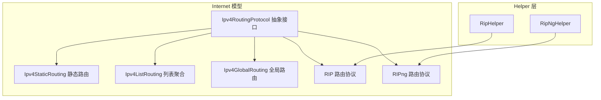
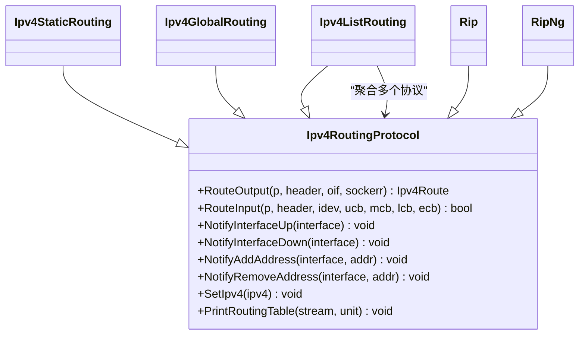
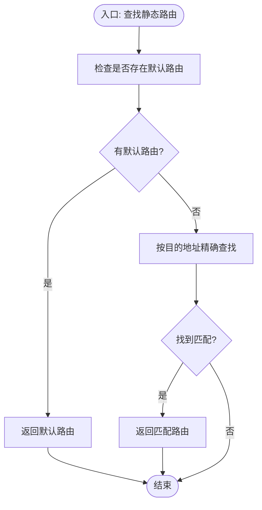
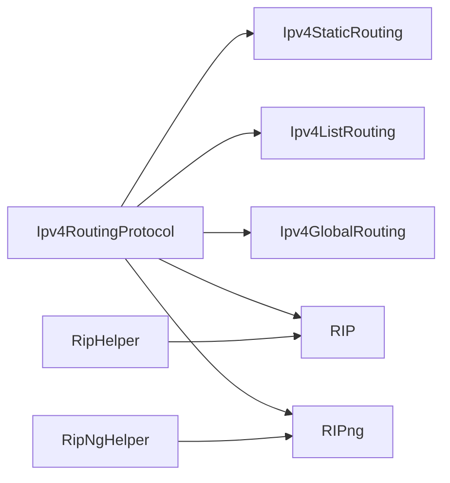

# 路由协议

<cite>
**本文引用的文件**
- [ipv4-routing-protocol.h](file://simulator/ns-3.39/src/internet/model/ipv4-routing-protocol.h)
- [ipv4-static-routing.h](file://simulator/ns-3.39/src/internet/model/ipv4-static-routing.h)
- [ipv4-list-routing.h](file://simulator/ns-3.39/src/internet/model/ipv4-list-routing.h)
- [ipv4-global-routing.h](file://simulator/ns-3.39/src/internet/model/ipv4-global-routing.h)
- [rip.h](file://simulator/ns-3.39/src/internet/model/rip.h)
- [rip-header.h](file://simulator/ns-3.39/src/internet/model/rip-header.h)
- [rip-helper.h](file://simulator/ns-3.39/src/internet/helper/rip-helper.h)
- [ripng.h](file://simulator/ns-3.39/src/internet/model/ripng.h)
- [ripng-header.h](file://simulator/ns-3.39/src/internet/model/ripng-header.h)
- [ripng-helper.h](file://simulator/ns-3.39/src/internet/helper/ripng-helper.h)
- [simple-routing-ping6.cc](file://simulator/ns-3.39/examples/routing/simple-routing-ping6.cc)
- [dynamic-global-routing.cc](file://simulator/ns-3.39/examples/routing/dynamic-global-routing.cc)
- [mixed-global-routing.cc](file://simulator/ns-3.39/examples/routing/mixed-global-routing.cc)
- [static-routing-slash32.cc](file://simulator/ns-3.39/examples/routing/static-routing-slash32.cc)
- [rip-simple-network.cc](file://simulator/ns-3.39/examples/routing/rip-simple-network.cc)
- [ripng-simple-network.cc](file://simulator/ns-3.39/examples/routing/ripng-simple-network.cc)
</cite>

## 目录
1. [引言](#引言)
2. [项目结构](#项目结构)
3. [核心组件](#核心组件)
4. [架构总览](#架构总览)
5. [详细组件分析](#详细组件分析)
6. [依赖关系分析](#依赖关系分析)
7. [性能考虑](#性能考虑)
8. [故障排除指南](#故障排除指南)
9. [结论](#结论)
10. [附录](#附录)

## 引言
本文件面向NS-3网络仿真平台中的路由协议模块，系统性梳理IPv4路由协议抽象接口与典型实现（静态路由、全局路由、RIP与RIPng），并给出API级说明、数据流与处理逻辑、配置与管理策略、性能优化建议以及常见问题排查方法。读者可据此在NS-3中进行路由协议的配置、路由表查询、路由更新监听与组合使用。

## 项目结构
NS-3的路由子系统主要位于internet模型与helper层：
- 模型层：定义路由协议抽象接口与具体实现（如静态、全局、RIP/RIPng）
- Helper层：提供高层封装与示例脚本，便于快速部署

图表来源
- [ipv4-routing-protocol.h:57-184](file://simulator/ns-3.39/src/internet/model/ipv4-routing-protocol.h#L57-L184)
- [ipv4-static-routing.h:66-422](file://simulator/ns-3.39/src/internet/model/ipv4-static-routing.h#L66-L422)
- [ipv4-list-routing.h:45-126](file://simulator/ns-3.39/src/internet/model/ipv4-list-routing.h#L45-L126)
- [ipv4-global-routing.h:71-286](file://simulator/ns-3.39/src/internet/model/ipv4-global-routing.h#L71-L286)
- [rip.h](file://simulator/ns-3.39/src/internet/model/rip.h)
- [ripng.h](file://simulator/ns-3.39/src/internet/model/ripng.h)
- [rip-helper.h](file://simulator/ns-3.39/src/internet/helper/rip-helper.h)
- [ripng-helper.h](file://simulator/ns-3.39/src/internet/helper/ripng-helper.h)

章节来源
- [ipv4-routing-protocol.h:1-189](file://simulator/ns-3.39/src/internet/model/ipv4-routing-protocol.h#L1-L189)
- [ipv4-static-routing.h:1-427](file://simulator/ns-3.39/src/internet/model/ipv4-static-routing.h#L1-L427)
- [ipv4-list-routing.h:1-131](file://simulator/ns-3.39/src/internet/model/ipv4-list-routing.h#L1-L131)
- [ipv4-global-routing.h:1-291](file://simulator/ns-3.39/src/internet/model/ipv4-global-routing.h#L1-L291)

## 核心组件
本节聚焦IPv4RoutingProtocol抽象接口及其关键职责：
- 路由输出与输入：RouteOutput用于本地发包查询路由；RouteInput用于接收包的转发或本地投递
- 回调机制：UnicastForwardCallback、MulticastForwardCallback、LocalDeliverCallback、ErrorCallback
- 接口事件通知：接口UP/DOWN、地址增删
- 路由表打印：PrintRoutingTable
- 关联IPv4实例：SetIpv4

这些能力为所有具体路由协议（静态、全局、RIP、RIPng）提供统一契约。

章节来源
- [ipv4-routing-protocol.h:57-184](file://simulator/ns-3.39/src/internet/model/ipv4-routing-protocol.h#L57-L184)

## 架构总览
NS-3通过“列表聚合”机制将多个路由协议组合使用，优先级高的先被尝试。静态路由通常作为基础路由存在，全局路由提供全网最短路构建，RIP/RIPng实现动态距离矢量路由。

图表来源
- [ipv4-routing-protocol.h:57-184](file://simulator/ns-3.39/src/internet/model/ipv4-routing-protocol.h#L57-L184)
- [ipv4-static-routing.h:66-422](file://simulator/ns-3.39/src/internet/model/ipv4-static-routing.h#L66-L422)
- [ipv4-list-routing.h:45-126](file://simulator/ns-3.39/src/internet/model/ipv4-list-routing.h#L45-L126)
- [ipv4-global-routing.h:71-286](file://simulator/ns-3.39/src/internet/model/ipv4-global-routing.h#L71-L286)
- [rip.h](file://simulator/ns-3.39/src/internet/model/rip.h)
- [ripng.h](file://simulator/ns-3.39/src/internet/model/ripng.h)

## 详细组件分析

### IPv4RoutingProtocol 抽象接口
- 职责边界清晰：仅定义路由协议必须实现的方法签名与回调约定
- 支持单播/组播转发与本地交付的解耦处理
- 提供接口状态与地址变更通知，便于协议自适应

章节来源
- [ipv4-routing-protocol.h:57-184](file://simulator/ns-3.39/src/internet/model/ipv4-routing-protocol.h#L57-L184)

### Ipv4StaticRouting 静态路由
- 功能要点
  - 单播：支持主机路由、网络路由、默认路由
  - 组播：支持输入接口+输出接口集合的精确匹配
  - 查询与删除：按索引访问、按条件删除
  - 接口事件：接口UP/DOWN、地址增删触发网络路由维护
- 数据结构
  - 网络路由表：链表存储路由条目与度量
  - 组播路由表：链表存储多播条目
- 复杂度
  - 查找与删除为线性遍历，适合小规模静态拓扑

图表来源
- [ipv4-static-routing.h:397-406](file://simulator/ns-3.39/src/internet/model/ipv4-static-routing.h#L397-L406)

章节来源
- [ipv4-static-routing.h:66-422](file://simulator/ns-3.39/src/internet/model/ipv4-static-routing.h#L66-L422)

### Ipv4ListRouting 列表聚合
- 机制
  - 将多个路由协议按优先级排序，依次尝试，直到某协议接管转发或交付
  - 同优先级顺序未定义，体现“先到先得”的特性
- 用途
  - 将静态路由与动态路由组合，静态优先，动态兜底
  - 便于引入第三方路由协议

章节来源
- [ipv4-list-routing.h:45-126](file://simulator/ns-3.39/src/internet/model/ipv4-list-routing.h#L45-L126)

### Ipv4GlobalRouting 全局路由
- 定位
  - 基于“路由oracle”的全网最短路构建，适合离线计算后注入
- 特性
  - 支持主机/网络/外部AS路由注入
  - 可配置ECMP随机选择或固定选择
  - 可响应接口事件重新计算（可选）
- 适用场景
  - 离线生成全网最优路径
  - 与动态协议对比评估

章节来源
- [ipv4-global-routing.h:71-286](file://simulator/ns-3.39/src/internet/model/ipv4-global-routing.h#L71-L286)

### RIP 与 RIPng 实现概览
- RIP（IPv4）
  - 距离矢量算法：周期性交换路由更新，跳数作为度量
  - 跳数限制：最大30跳，超过视为不可达
  - 路由毒化：抑制更新、毒性逆转、水平分割等缓解环路
  - 报文格式：包含目的网络、掩码、下一跳、跳数等字段
- RIPng（IPv6）
  - 针对IPv6的扩展版本，采用相同距离矢量思想
  - 报文格式与字段适配IPv6地址族

章节来源
- [rip.h](file://simulator/ns-3.39/src/internet/model/rip.h)
- [rip-header.h](file://simulator/ns-3.39/src/internet/model/rip-header.h)
- [ripng.h](file://simulator/ns-3.39/src/internet/model/ripng.h)
- [ripng-header.h](file://simulator/ns-3.39/src/internet/model/ripng-header.h)

## 依赖关系分析
- 继承关系
  - 所有具体路由协议均继承自Ipv4RoutingProtocol
- 组合关系
  - Ipv4ListRouting聚合多个协议实例
- 辅助关系
  - Helper类用于简化协议安装与参数配置

图表来源
- [ipv4-routing-protocol.h:57-184](file://simulator/ns-3.39/src/internet/model/ipv4-routing-protocol.h#L57-L184)
- [ipv4-static-routing.h:66-422](file://simulator/ns-3.39/src/internet/model/ipv4-static-routing.h#L66-L422)
- [ipv4-list-routing.h:45-126](file://simulator/ns-3.39/src/internet/model/ipv4-list-routing.h#L45-L126)
- [ipv4-global-routing.h:71-286](file://simulator/ns-3.39/src/internet/model/ipv4-global-routing.h#L71-L286)
- [rip-helper.h](file://simulator/ns-3.39/src/internet/helper/rip-helper.h)
- [ripng-helper.h](file://simulator/ns-3.39/src/internet/helper/ripng-helper.h)

章节来源
- [rip-helper.h](file://simulator/ns-3.39/src/internet/helper/rip-helper.h)
- [ripng-helper.h](file://simulator/ns-3.39/src/internet/helper/ripng-helper.h)

## 性能考虑
- 静态路由
  - 无动态收敛开销，适合小规模或稳定拓扑
  - 注意避免冗余路由导致查找分支增多
- 全局路由
  - 离线计算，运行时无收敛延迟
  - ECMP随机可能引入抖动，可根据需求关闭随机选择
- RIP/RIPng
  - 周期性更新带来CPU与带宽开销，合理设置更新间隔
  - 跳数限制与毒化策略影响收敛速度与稳定性
  - 在大规模网络中建议结合静态默认路由减少泛洪

## 故障排除指南
- 路由表为空或未生效
  - 检查是否正确安装路由协议（静态/全局/RIP/RIPng）
  - 对比PrintRoutingTable输出确认注入成功
- 包无法转发
  - 使用RouteOutput/RouteInput的回调参数定位失败点
  - 核对接口UP状态与地址绑定
- 收敛异常或环路
  - 检查RIP/RIPng的抑制与分割策略是否启用
  - 调整跳数上限与更新间隔
- 多协议冲突
  - 通过Ipv4ListRouting设置优先级，确保期望协议优先

## 结论
NS-3的路由体系以Ipv4RoutingProtocol为核心抽象，配合静态、全局与动态协议（RIP/RIPng），既满足教学演示也适用于研究验证。通过列表聚合与Helper封装，用户可以灵活组合不同协议，并基于示例脚本快速上手。

## 附录

### API参考与使用示例（路径指引）
- 配置静态路由
  - 添加主机/网络/默认路由与组播路由
  - 示例脚本：[static-routing-slash32.cc](file://simulator/ns-3.39/examples/routing/static-routing-slash32.cc)
- 配置全局路由
  - 注入主机/网络/外部AS路由
  - 示例脚本：[dynamic-global-routing.cc](file://simulator/ns-3.39/examples/routing/dynamic-global-routing.cc)，[mixed-global-routing.cc](file://simulator/ns-3.39/examples/routing/mixed-global-routing.cc)
- 配置RIP
  - 安装RIP协议并启动
  - 示例脚本：[rip-simple-network.cc](file://simulator/ns-3.39/examples/routing/rip-simple-network.cc)
- 配置RIPng
  - 安装RIPng协议并启动
  - 示例脚本：[ripng-simple-network.cc](file://simulator/ns-3.39/examples/routing/ripng-simple-network.cc)
- IPv6路由示例
  - 示例脚本：[simple-routing-ping6.cc](file://simulator/ns-3.39/examples/routing/simple-routing-ping6.cc)

章节来源
- [static-routing-slash32.cc](file://simulator/ns-3.39/examples/routing/static-routing-slash32.cc)
- [dynamic-global-routing.cc](file://simulator/ns-3.39/examples/routing/dynamic-global-routing.cc)
- [mixed-global-routing.cc](file://simulator/ns-3.39/examples/routing/mixed-global-routing.cc)
- [rip-simple-network.cc](file://simulator/ns-3.39/examples/routing/rip-simple-network.cc)
- [ripng-simple-network.cc](file://simulator/ns-3.39/examples/routing/ripng-simple-network.cc)
- [simple-routing-ping6.cc](file://simulator/ns-3.39/examples/routing/simple-routing-ping6.cc)