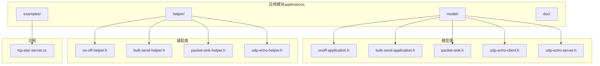
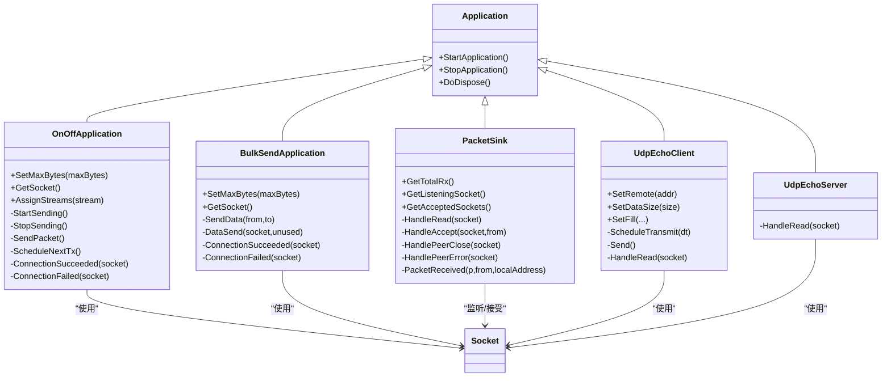
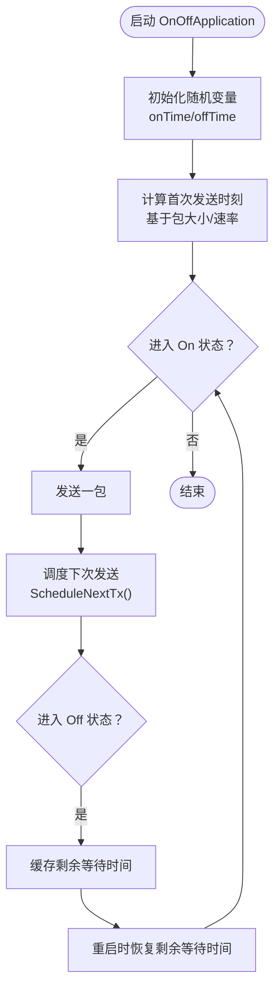
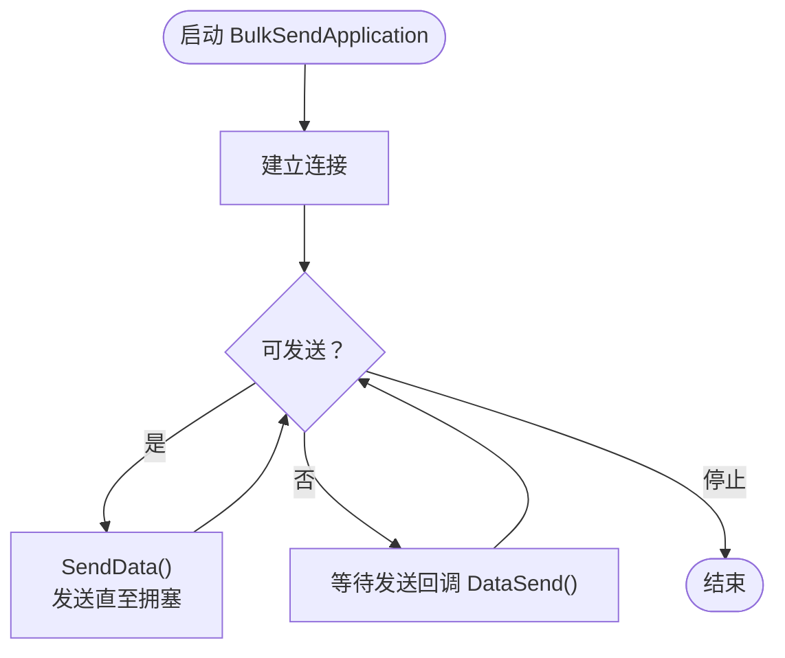
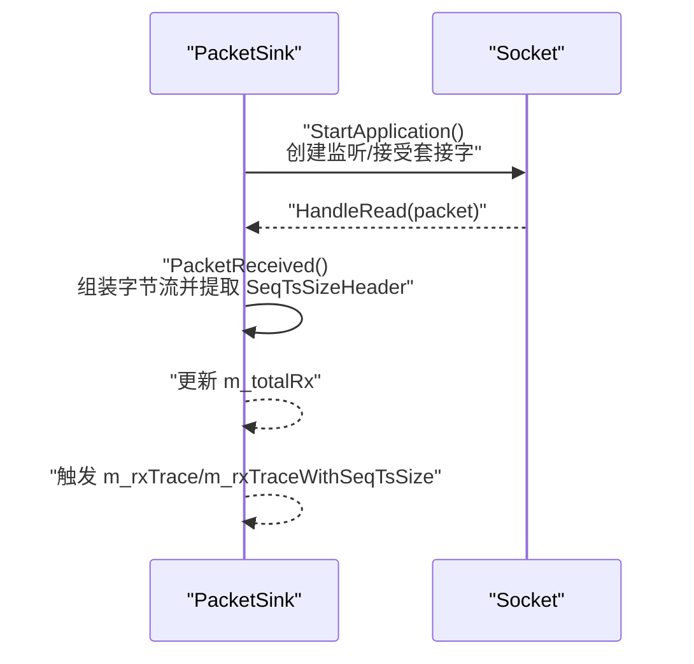
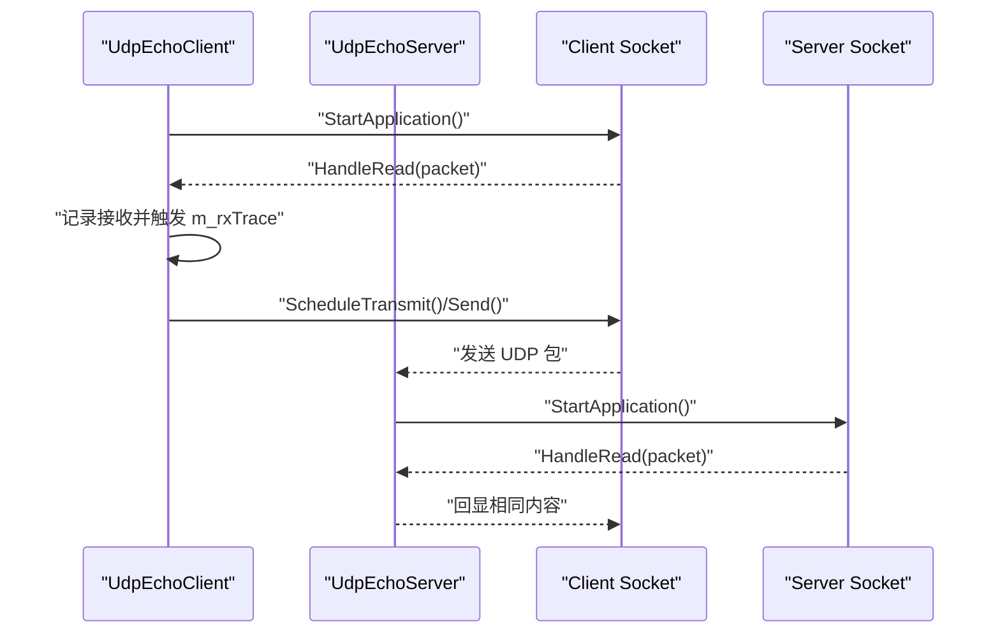
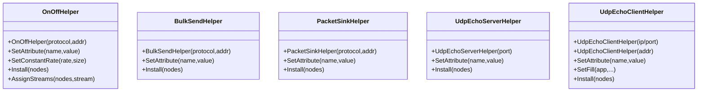
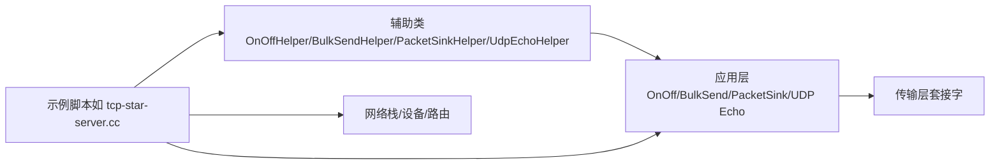

# 应用模块（Applications）

<cite>
**本文引用的文件**   
- [applications.h](file://simulator/ns-3.39/src/applications/doc/applications.h)
- [bulk-send-application.h](file://simulator/ns-3.39/src/applications/model/bulk-send-application.h)
- [onoff-application.h](file://simulator/ns-3.39/src/applications/model/onoff-application.h)
- [packet-sink.h](file://simulator/ns-3.39/src/applications/model/packet-sink.h)
- [udp-echo-client.h](file://simulator/ns-3.39/src/applications/model/udp-echo-client.h)
- [udp-echo-server.h](file://simulator/ns-3.39/src/applications/model/udp-echo-server.h)
- [on-off-helper.h](file://simulator/ns-3.39/src/applications/helper/on-off-helper.h)
- [bulk-send-helper.h](file://simulator/ns-3.39/src/applications/helper/bulk-send-helper.h)
- [packet-sink-helper.h](file://simulator/ns-3.39/src/applications/helper/packet-sink-helper.h)
- [udp-echo-helper.h](file://simulator/ns-3.39/src/applications/helper/udp-echo-helper.h)
- [tcp-star-server.cc](file://simulator/ns-3.39/examples/tcp/tcp-star-server.cc)
</cite>

## 目录
1. [简介](#简介)
2. [项目结构](#项目结构)
3. [核心组件](#核心组件)
4. [架构总览](#架构总览)
5. [组件详解](#组件详解)
6. [依赖关系分析](#依赖关系分析)
7. [性能考量](#性能考量)
8. [故障排查指南](#故障排查指南)
9. [结论](#结论)
10. [附录：常用配置与示例路径](#附录常用配置与示例路径)

## 简介
本文件为 NS-3 应用模块的完整 API 文档，覆盖应用层常见协议与工具的仿真实现，包括：
- 流量发生器：OnOffApplication、BulkSendApplication
- 数据接收器：PacketSink
- UDP 回显客户端/服务器：UdpEchoClient、UdpEchoServer
- 协议辅助类：OnOffHelper、BulkSendHelper、PacketSinkHelper、UdpEchoHelper
- 与传输层接口与数据流处理
- 大规模应用仿真、性能基准测试与优化策略

目标是帮助读者快速理解各组件职责、属性与事件回调，并给出可直接定位到源码的参考路径，便于在实际仿真中进行配置与扩展。

## 项目结构
应用模块位于 ns-3 源码树的 applications 子目录，主要分为三部分：
- model：应用层实体类（如 OnOffApplication、PacketSink、UdpEchoClient/Server）
- helper：面向用户的安装与配置辅助类（如 OnOffHelper、PacketSinkHelper、UdpEchoHelper）
- examples：示例脚本（如 TCP 星型拓扑示例）

**图表来源**
- [applications.h:20-27](file://simulator/ns-3.39/src/applications/doc/applications.h#L20-L27)
- [onoff-application.h:95-215](file://simulator/ns-3.39/src/applications/model/onoff-application.h#L95-L215)
- [bulk-send-application.h:75-175](file://simulator/ns-3.39/src/applications/model/bulk-send-application.h#L75-L175)
- [packet-sink.h:71-204](file://simulator/ns-3.39/src/applications/model/packet-sink.h#L71-L204)
- [udp-echo-client.h:39-183](file://simulator/ns-3.39/src/applications/model/udp-echo-client.h#L39-L183)
- [udp-echo-server.h:44-81](file://simulator/ns-3.39/src/applications/model/udp-echo-server.h#L44-L81)
- [on-off-helper.h:43-128](file://simulator/ns-3.39/src/applications/helper/on-off-helper.h#L43-L128)
- [bulk-send-helper.h:43-105](file://simulator/ns-3.39/src/applications/helper/bulk-send-helper.h#L43-L105)
- [packet-sink-helper.h:35-96](file://simulator/ns-3.39/src/applications/helper/packet-sink-helper.h#L35-L96)
- [udp-echo-helper.h:38-101](file://simulator/ns-3.39/src/applications/helper/udp-echo-helper.h#L38-L101)
- [tcp-star-server.cc:41-161](file://simulator/ns-3.39/examples/tcp/tcp-star-server.cc#L41-L161)

**章节来源**
- [applications.h:20-27](file://simulator/ns-3.39/src/applications/doc/applications.h#L20-L27)

## 核心组件
- OnOffApplication：按“开/关”模式周期性发送恒定比特率（CBR）流量，支持随机变量控制开停时长，支持启用 SeqTsSizeHeader 进行统计追踪。
- BulkSendApplication：以尽可能高的速率持续发送数据，直到达到上限或被停止；支持启用 SeqTsSizeHeader 并提供更丰富的发送事件回调。
- PacketSink：通用数据接收端，可绑定监听套接字，聚合接收字节流并导出 SeqTsSizeHeader 统计；支持多连接场景。
- UdpEchoClient/UdpEchoServer：UDP 回显客户端/服务器，用于双向往返验证与简单吞吐测试。
- 辅助类：OnOffHelper、BulkSendHelper、PacketSinkHelper、UdpEchoHelper 提供统一的安装与属性设置接口，简化节点批量部署。

**章节来源**
- [onoff-application.h:55-94](file://simulator/ns-3.39/src/applications/model/onoff-application.h#L55-L94)
- [bulk-send-application.h:55-74](file://simulator/ns-3.39/src/applications/model/bulk-send-application.h#L55-L74)
- [packet-sink.h:55-70](file://simulator/ns-3.39/src/applications/model/packet-sink.h#L55-L70)
- [udp-echo-client.h:35-38](file://simulator/ns-3.39/src/applications/model/udp-echo-client.h#L35-L38)
- [udp-echo-server.h:35-43](file://simulator/ns-3.39/src/applications/model/udp-echo-server.h#L35-L43)
- [on-off-helper.h:43-84](file://simulator/ns-3.39/src/applications/helper/on-off-helper.h#L43-L84)
- [bulk-send-helper.h:43-75](file://simulator/ns-3.39/src/applications/helper/bulk-send-helper.h#L43-L75)
- [packet-sink-helper.h:35-66](file://simulator/ns-3.39/src/applications/helper/packet-sink-helper.h#L35-L66)
- [udp-echo-helper.h:38-88](file://simulator/ns-3.39/src/applications/helper/udp-echo-helper.h#L38-L88)

## 架构总览
应用层通过 SocketFactory 与传输层交互，借助 Application 基类生命周期管理（Start/Stop），在事件驱动框架下完成数据收发与统计导出。

**图表来源**
- [onoff-application.h:95-215](file://simulator/ns-3.39/src/applications/model/onoff-application.h#L95-L215)
- [bulk-send-application.h:75-175](file://simulator/ns-3.39/src/applications/model/bulk-send-application.h#L75-L175)
- [packet-sink.h:71-204](file://simulator/ns-3.39/src/applications/model/packet-sink.h#L71-L204)
- [udp-echo-client.h:39-183](file://simulator/ns-3.39/src/applications/model/udp-echo-client.h#L39-L183)
- [udp-echo-server.h:44-81](file://simulator/ns-3.39/src/applications/model/udp-echo-server.h#L44-L81)

## 组件详解

### OnOffApplication（恒定比特率流量发生器）
- 功能要点
  - 按 on/off 随机变量交替发送 CBR 流量
  - 支持最大发送字节数限制
  - 可启用 SeqTsSizeHeader，导出含序号、时间戳、包大小的头部信息
  - 支持固定随机数种子分配（AssignStreams）
- 关键属性（通过 SetAttribute 或命令行）
  - OnTime/OffTime：随机变量类型与参数
  - DataRate/PacketSize：发送速率与包大小
  - EnableSeqTsSizeHeader：是否启用 SeqTsSizeHeader
- 关键回调
  - m_txTrace：发送事件
  - m_txTraceWithAddresses：带源/目的地址的发送事件
  - m_txTraceWithSeqTsSize：带 SeqTsSizeHeader 的发送事件

**图表来源**
- [onoff-application.h:141-204](file://simulator/ns-3.39/src/applications/model/onoff-application.h#L141-L204)

**章节来源**
- [onoff-application.h:55-94](file://simulator/ns-3.39/src/applications/model/onoff-application.h#L55-L94)
- [onoff-application.h:108-131](file://simulator/ns-3.39/src/applications/model/onoff-application.h#L108-L131)
- [onoff-application.h:181-190](file://simulator/ns-3.39/src/applications/model/onoff-application.h#L181-L190)

### BulkSendApplication（持续高负载流量发生器）
- 功能要点
  - 尽可能快地发送数据，填满传输层发送缓冲区后等待
  - 支持最大发送字节数限制
  - 支持启用 SeqTsSizeHeader，导出发送事件与头部信息
- 关键属性
  - MaxBytes：总发送上限
  - EnableSeqTsSizeHeader：是否启用 SeqTsSizeHeader
- 关键回调
  - m_txTrace：发送事件
  - m_txTraceWithSeqTsSize：带 SeqTsSizeHeader 的发送事件

**图表来源**
- [bulk-send-application.h:120-174](file://simulator/ns-3.39/src/applications/model/bulk-send-application.h#L120-L174)

**章节来源**
- [bulk-send-application.h:55-74](file://simulator/ns-3.39/src/applications/model/bulk-send-application.h#L55-L74)
- [bulk-send-application.h:101-101](file://simulator/ns-3.39/src/applications/model/bulk-send-application.h#L101-L101)
- [bulk-send-application.h:149-153](file://simulator/ns-3.39/src/applications/model/bulk-send-application.h#L149-L153)

### PacketSink（数据接收器）
- 功能要点
  - 接收来自远端的数据，累计接收字节
  - 支持 TCP 多连接场景（监听套接字与已接受套接字列表）
  - 可启用 SeqTsSizeHeader 导出统计
- 关键属性
  - EnableSeqTsSizeHeader：是否启用 SeqTsSizeHeader
- 关键回调
  - m_rxTrace：接收事件
  - m_rxTraceWithAddresses：带源/目的地址的接收事件
  - m_rxTraceWithSeqTsSize：带 SeqTsSizeHeader 的接收事件

**图表来源**
- [packet-sink.h:113-147](file://simulator/ns-3.39/src/applications/model/packet-sink.h#L113-L147)

**章节来源**
- [packet-sink.h:55-70](file://simulator/ns-3.39/src/applications/model/packet-sink.h#L55-L70)
- [packet-sink.h:194-199](file://simulator/ns-3.39/src/applications/model/packet-sink.h#L194-L199)

### UDP 回显（UdpEchoClient/Server）
- UdpEchoServer：收到任意 UDP 包即回显原包
- UdpEchoClient：周期性发送指定填充的 UDP 包，并接收回显
- 关键属性
  - SetDataSize/SetFill：控制发送数据大小与填充内容
  - SetRemote：设置远端地址与端口

**图表来源**
- [udp-echo-client.h:137-157](file://simulator/ns-3.39/src/applications/model/udp-echo-client.h#L137-L157)
- [udp-echo-server.h:59-69](file://simulator/ns-3.39/src/applications/model/udp-echo-server.h#L59-L69)

**章节来源**
- [udp-echo-client.h:52-87](file://simulator/ns-3.39/src/applications/model/udp-echo-client.h#L52-L87)
- [udp-echo-client.h:99-131](file://simulator/ns-3.39/src/applications/model/udp-echo-client.h#L99-L131)
- [udp-echo-server.h:62-69](file://simulator/ns-3.39/src/applications/model/udp-echo-server.h#L62-L69)

### 辅助类（Helpers）
- OnOffHelper：统一设置协议、远端地址、On/Off 随机变量、DataRate/PacketSize，并批量安装到节点
- BulkSendHelper：设置协议与远端地址，批量安装
- PacketSinkHelper：设置协议与本地地址，批量安装
- UdpEchoHelper：分别提供 UdpEchoServerHelper 与 UdpEchoClientHelper，支持批量安装与属性设置

**图表来源**
- [on-off-helper.h:43-128](file://simulator/ns-3.39/src/applications/helper/on-off-helper.h#L43-L128)
- [bulk-send-helper.h:43-105](file://simulator/ns-3.39/src/applications/helper/bulk-send-helper.h#L43-L105)
- [packet-sink-helper.h:35-96](file://simulator/ns-3.39/src/applications/helper/packet-sink-helper.h#L35-L96)
- [udp-echo-helper.h:38-229](file://simulator/ns-3.39/src/applications/helper/udp-echo-helper.h#L38-L229)

**章节来源**
- [on-off-helper.h:43-84](file://simulator/ns-3.39/src/applications/helper/on-off-helper.h#L43-L84)
- [bulk-send-helper.h:43-75](file://simulator/ns-3.39/src/applications/helper/bulk-send-helper.h#L43-L75)
- [packet-sink-helper.h:35-66](file://simulator/ns-3.39/src/applications/helper/packet-sink-helper.h#L35-L66)
- [udp-echo-helper.h:38-88](file://simulator/ns-3.39/src/applications/helper/udp-echo-helper.h#L38-L88)

## 依赖关系分析
- 应用层依赖传输层 SocketFactory（如 TcpSocketFactory、UdpSocketFactory）创建套接字
- 应用层通过 Application 生命周期管理（Start/Stop）与事件调度（EventId）协调数据收发
- 辅助类通过 ObjectFactory 创建具体应用实例，并统一设置属性
- 示例脚本演示如何组合应用层与网络栈、设备与路由，完成端到端链路配置

**图表来源**
- [tcp-star-server.cc:124-148](file://simulator/ns-3.39/examples/tcp/tcp-star-server.cc#L124-L148)
- [on-off-helper.h:43-84](file://simulator/ns-3.39/src/applications/helper/on-off-helper.h#L43-L84)
- [packet-sink-helper.h:35-66](file://simulator/ns-3.39/src/applications/helper/packet-sink-helper.h#L35-L66)

**章节来源**
- [tcp-star-server.cc:124-148](file://simulator/ns-3.39/examples/tcp/tcp-star-server.cc#L124-L148)

## 性能考量
- 吞吐与延迟权衡
  - OnOffApplication 的包大小与速率直接影响链路利用率与排队延迟
  - BulkSendApplication 在高带宽链路上可快速填满发送缓冲，需关注拥塞控制与队列行为
- Header 开销
  - 启用 SeqTsSizeHeader 会增加每包有效载荷，对小包场景影响更明显
- 多连接与多流
  - PacketSink 支持多连接，注意区分不同流的统计与优先级
- 路由与拓扑
  - 示例脚本展示了星型拓扑下的 CBR 流量与跟踪输出，适合评估瓶颈与队列特性

[本节为通用指导，不直接分析具体文件]

## 故障排查指南
- 无法接收数据
  - 确认 PacketSink 已正确绑定本地地址与端口
  - 检查路由表是否已全局填充（示例脚本中使用了全局静态路由）
- 发送速率异常
  - 检查 OnOffApplication 的 DataRate 与 PacketSize 设置
  - 对 BulkSendApplication，确认传输层拥塞窗口与链路带宽匹配
- 回显失败
  - 确认 UdpEchoClient 的远端地址与端口与服务器一致
  - 检查防火墙或 ACL 是否阻断 UDP 回显端口
- 统计缺失
  - 若启用 SeqTsSizeHeader，请确保接收端（PacketSink）也启用对应属性，并检查回调是否连接

**章节来源**
- [tcp-star-server.cc:124-130](file://simulator/ns-3.39/examples/tcp/tcp-star-server.cc#L124-L130)
- [packet-sink.h:184-184](file://simulator/ns-3.39/src/applications/model/packet-sink.h#L184-L184)

## 结论
应用模块提供了从流量发生、接收、到 UDP 回显的完整工具集，配合辅助类可快速构建大规模网络仿真场景。通过合理配置属性与利用事件回调，可高效开展性能评测与优化工作。

[本节为总结性内容，不直接分析具体文件]

## 附录：常用配置与示例路径
- OnOffApplication
  - 属性设置：OnTime/OffTime、DataRate、PacketSize、EnableSeqTsSizeHeader
  - 安装方式：OnOffHelper.Install(...)
  - 参考路径：[onoff-application.h:108-131](file://simulator/ns-3.39/src/applications/model/onoff-application.h#L108-L131)，[on-off-helper.h:64-84](file://simulator/ns-3.39/src/applications/helper/on-off-helper.h#L64-L84)
- BulkSendApplication
  - 属性设置：MaxBytes、EnableSeqTsSizeHeader
  - 安装方式：BulkSendHelper.Install(...)
  - 参考路径：[bulk-send-application.h:101-101](file://simulator/ns-3.39/src/applications/model/bulk-send-application.h#L101-L101)，[bulk-send-helper.h:65-75](file://simulator/ns-3.39/src/applications/helper/bulk-send-helper.h#L65-L75)
- PacketSink
  - 属性设置：EnableSeqTsSizeHeader
  - 安装方式：PacketSinkHelper.Install(...)
  - 参考路径：[packet-sink.h:184-184](file://simulator/ns-3.39/src/applications/model/packet-sink.h#L184-L184)，[packet-sink-helper.h:56-66](file://simulator/ns-3.39/src/applications/helper/packet-sink-helper.h#L56-L66)
- UDP Echo
  - 客户端：SetDataSize/SetFill/SetRemote
  - 服务器：UdpEchoServerHelper.Install(...)
  - 参考路径：[udp-echo-client.h:52-62](file://simulator/ns-3.39/src/applications/model/udp-echo-client.h#L52-L62)，[udp-echo-helper.h:107-118](file://simulator/ns-3.39/src/applications/helper/udp-echo-helper.h#L107-L118)
- 示例脚本
  - TCP 星型拓扑与 OnOff 流量：[tcp-star-server.cc:124-148](file://simulator/ns-3.39/examples/tcp/tcp-star-server.cc#L124-L148)

**章节来源**
- [onoff-application.h:108-131](file://simulator/ns-3.39/src/applications/model/onoff-application.h#L108-L131)
- [bulk-send-application.h:101-101](file://simulator/ns-3.39/src/applications/model/bulk-send-application.h#L101-L101)
- [packet-sink.h:184-184](file://simulator/ns-3.39/src/applications/model/packet-sink.h#L184-L184)
- [udp-echo-client.h:52-62](file://simulator/ns-3.39/src/applications/model/udp-echo-client.h#L52-L62)
- [udp-echo-helper.h:107-118](file://simulator/ns-3.39/src/applications/helper/udp-echo-helper.h#L107-L118)
- [tcp-star-server.cc:124-148](file://simulator/ns-3.39/examples/tcp/tcp-star-server.cc#L124-L148)