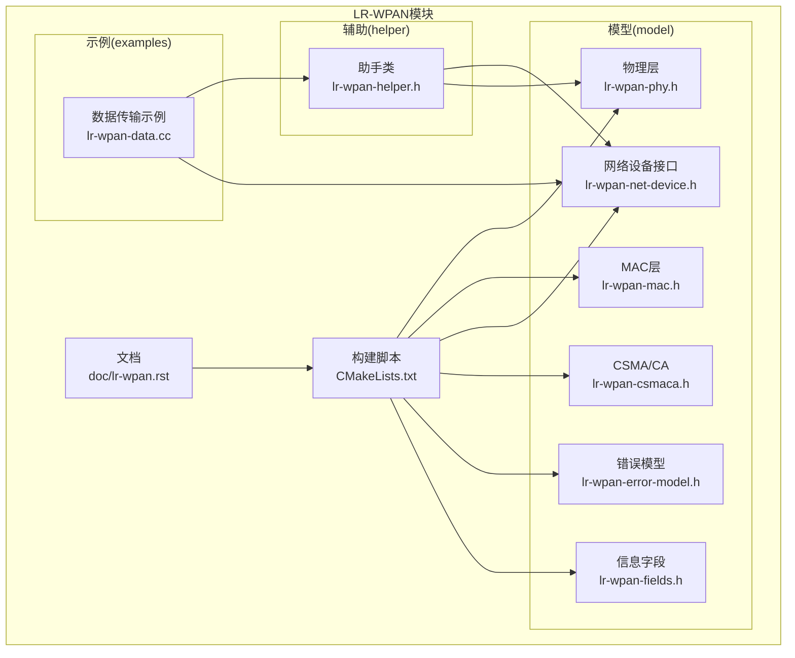
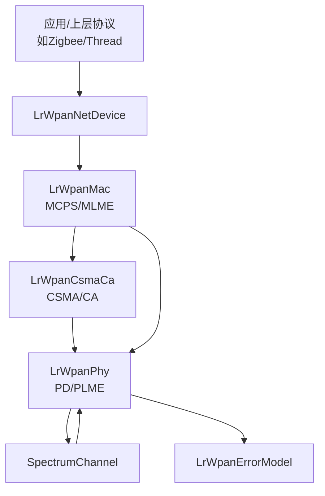
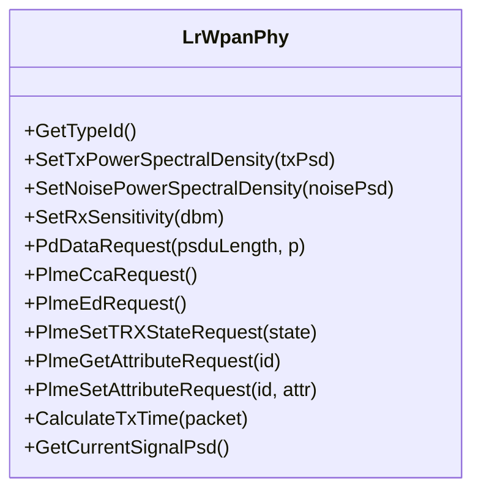
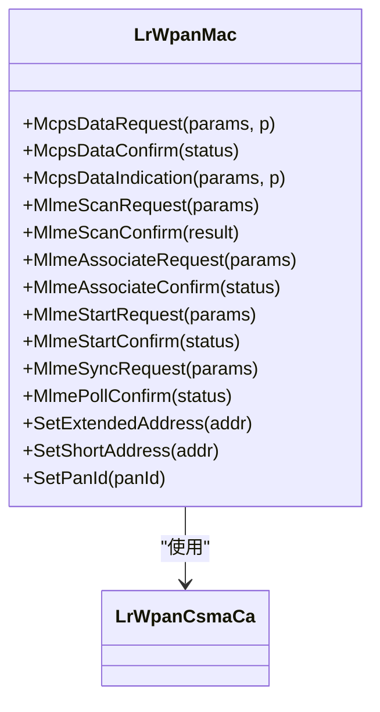
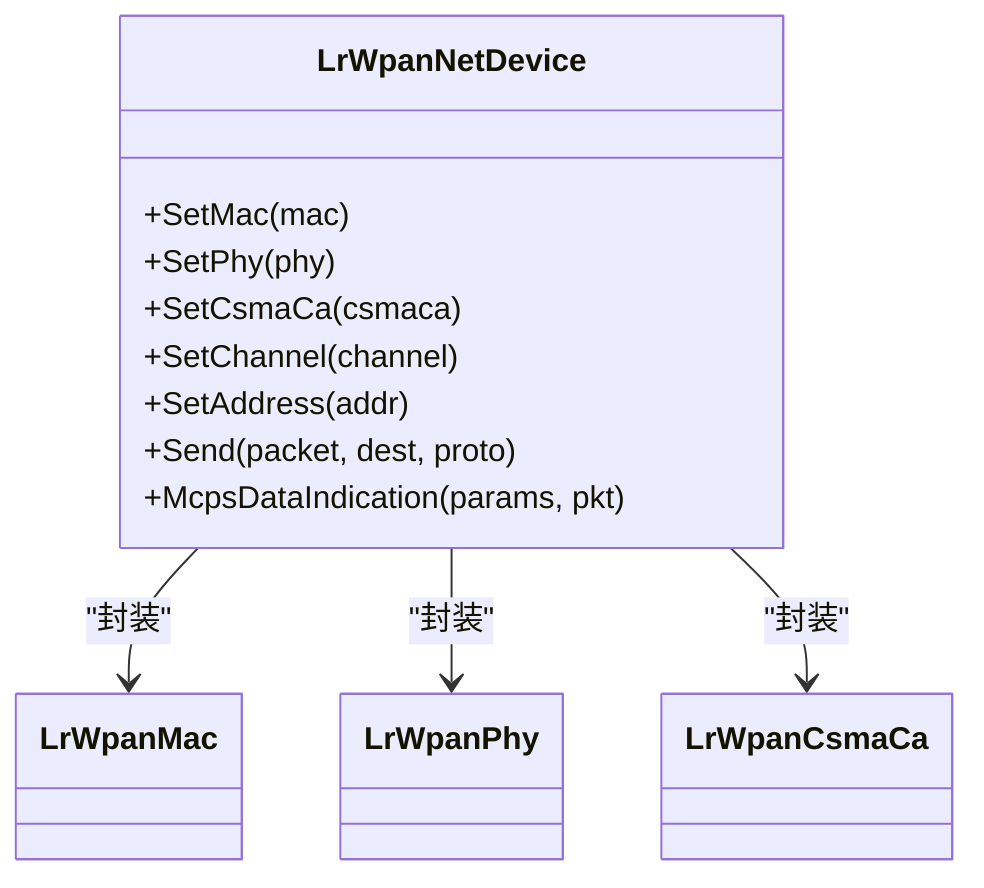
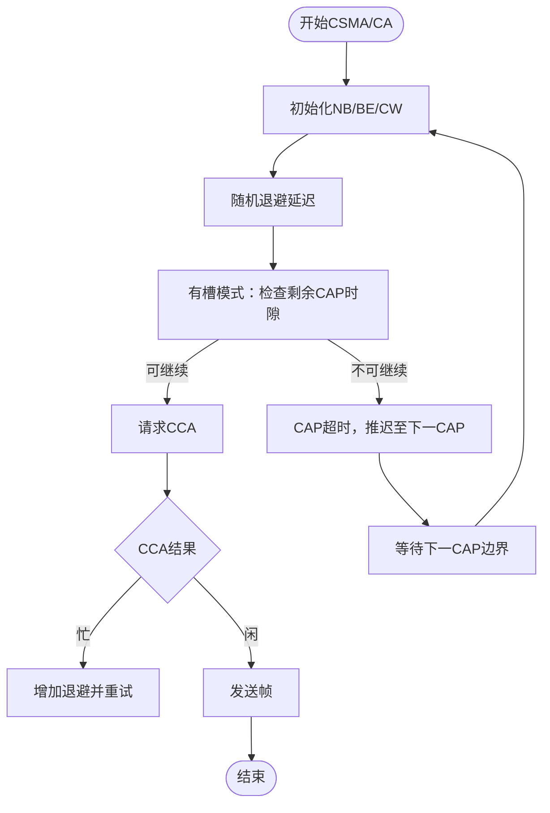
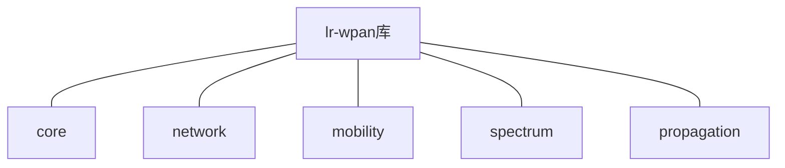

# LR-WPAN模块

<cite>
**本文引用的文件**
- [lr-wpan.rst](file://src/lr-wpan/doc/lr-wpan.rst)
- [CMakeLists.txt](file://src/lr-wpan/CMakeLists.txt)
- [lr-wpan-phy.h](file://src/lr-wpan/model/lr-wpan-phy.h)
- [lr-wpan-mac.h](file://src/lr-wpan/model/lr-wpan-mac.h)
- [lr-wpan-net-device.h](file://src/lr-wpan/model/lr-wpan-net-device.h)
- [lr-wpan-helper.h](file://src/lr-wpan/helper/lr-wpan-helper.h)
- [lr-wpan-csmaca.h](file://src/lr-wpan/model/lr-wpan-csmaca.h)
- [lr-wpan-error-model.h](file://src/lr-wpan/model/lr-wpan-error-model.h)
- [lr-wpan-fields.h](file://src/lr-wpan/model/lr-wpan-fields.h)
- [lr-wpan-data.cc](file://src/lr-wpan/examples/lr-wpan-data.cc)
</cite>

## 目录
1. [简介](#简介)
2. [项目结构](#项目结构)
3. [核心组件](#核心组件)
4. [架构总览](#架构总览)
5. [详细组件分析](#详细组件分析)
6. [依赖关系分析](#依赖关系分析)
7. [性能考量](#性能考量)
8. [故障排查指南](#故障排查指南)
9. [结论](#结论)
10. [附录](#附录)

## 简介
本文件为NS-3中LR-WPAN（低速率无线个人区域网）模块的权威API与实现文档，聚焦于IEEE 802.15.4标准（2003/2006/2011）在ns-3中的仿真实现，覆盖物理层（PHY）、媒体接入控制（MAC）、网络层接口（NetDevice）以及CSMA/CA机制。文档同时说明模块对Zigbee与Thread等基于IEEE 802.15.4的上层协议栈的支持现状与限制，并提供网络配置、设备加入、网络发现、数据传输的示例路径与最佳实践。

## 项目结构
LR-WPAN模块位于ns-3源码树的src/lr-wpan目录下，采用按功能域分层组织：model（模型实现）、helper（高层封装）、examples（示例）、test（测试）、doc（文档）。CMake构建脚本统一编译所有源文件并链接所需子系统库。

图示来源
- [CMakeLists.txt:1-53](file://src/lr-wpan/CMakeLists.txt#L1-L53)
- [lr-wpan.rst:1-431](file://src/lr-wpan/doc/lr-wpan.rst#L1-L431)

章节来源
- [CMakeLists.txt:1-53](file://src/lr-wpan/CMakeLists.txt#L1-L53)
- [lr-wpan.rst:1-431](file://src/lr-wpan/doc/lr-wpan.rst#L1-L431)

## 核心组件
- 物理层（LrWpanPhy）
  - 提供PD/PLME服务原语，支持CCA、ED、TRX状态切换、属性查询与设置、接收噪声功率谱密度建模、发射功率谱密度建模、链路预算与传播损耗集成。
  - 支持多种PHY选项（如868/915/2.4GHz O-QPSK/BPSK），并提供接收灵敏度配置与错误模型挂接能力。
- 媒体接入控制（LrWpanMac）
  - 实现MCPS/MLME服务原语，支持扫描（ED/Active/Passive/Orphan）、关联、同步、启动、轮询、通信状态指示等。
  - 支持超帧规范（Beacon/CFP/CAP/Inactive）与电池寿命扩展（BLE）标志，提供事务持久化时间、最大重试次数等参数。
  - 提供短地址与长地址（EUI-64）支持，以及伪MAC地址生成以适配IPv6 SLAAC。
- 网络设备接口（LrWpanNetDevice）
  - 封装MAC、PHY与CSMA/CA，向上提供类似NetDevice的API，向下连接SpectrumChannel。
  - 支持手动配置协调器与短地址分配，支持ACK请求、MTU设置、广播/组播处理。
- CSMA/CA（LrWpanCsmaCa）
  - 支持有槽与无槽CSMA/CA，可配置最小/最大退避指数、最大退避次数；在有槽模式下计算事务成本并检查CAP剩余时隙。
- 助手类（LrWpanHelper）
  - 统一安装流程、通道配置、移动性附加、日志与跟踪启用、流数分配等。
- 错误模型（LrWpanErrorModel）
  - 基于AWGN信道的OQPSK调制的块成功概率模型，用于验证与性能评估。
- 信息字段（SuperframeField/GtsFields/PendingAddrFields/CapabilityField）
  - 对齐标准信息元素，支撑Beacon帧、GTS描述、待发地址列表与设备能力等字段序列化/反序列化。

章节来源
- [lr-wpan-phy.h:253-540](file://src/lr-wpan/model/lr-wpan-phy.h#L253-L540)
- [lr-wpan-mac.h:41-800](file://src/lr-wpan/model/lr-wpan-mac.h#L41-L800)
- [lr-wpan-net-device.h:49-321](file://src/lr-wpan/model/lr-wpan-net-device.h#L49-L321)
- [lr-wpan-csmaca.h:57-338](file://src/lr-wpan/model/lr-wpan-csmaca.h#L57-L338)
- [lr-wpan-helper.h:49-202](file://src/lr-wpan/helper/lr-wpan-helper.h#L49-L202)
- [lr-wpan-error-model.h:34-65](file://src/lr-wpan/model/lr-wpan-error-model.h#L34-L65)
- [lr-wpan-fields.h:53-449](file://src/lr-wpan/model/lr-wpan-fields.h#L53-L449)

## 架构总览
LR-WPAN模块遵循IEEE 802.15.4服务原语划分，自下而上为PHY（PD/PLME）、MAC（MCPS/MLME）、NetDevice（网络层接口），并通过CSMA/CA完成介质访问控制。

图示来源
- [lr-wpan.rst:18-60](file://src/lr-wpan/doc/lr-wpan.rst#L18-L60)
- [lr-wpan-mac.h:41-120](file://src/lr-wpan/model/lr-wpan-mac.h#L41-L120)
- [lr-wpan-phy.h:253-320](file://src/lr-wpan/model/lr-wpan-phy.h#L253-L320)

## 详细组件分析

### 物理层（LrWpanPhy）
- 关键职责
  - PD-DATA请求/确认、PLME-CCA/ED/SET-TRX-STATE/GET/SET等原语。
  - 接收/发送过程的开始/结束事件、状态变更追踪（TrxState）、信号功率谱密度建模。
  - 通道选择（页/频道）、符号率/比特率映射、SHR/PHR符号数、接收灵敏度配置。
- 能力与限制
  - 支持多PHY选项（868/915/2.4GHz O-QPSK/BPSK），默认2.4GHz O-QPSK。
  - 接收灵敏度默认较高（理论值），可通过函数调整以模拟不同收发器能力。
  - 未实现前导/同步头检测，按包级建模。
- 典型用法
  - 设置发射功率谱密度、噪声功率谱密度、接收灵敏度。
  - 注册PD/PLME回调，执行CCA/ED/TRX状态切换。
  - 计算传输时延、查询当前信号PSD。

图示来源
- [lr-wpan-phy.h:253-540](file://src/lr-wpan/model/lr-wpan-phy.h#L253-L540)

章节来源
- [lr-wpan-phy.h:253-540](file://src/lr-wpan/model/lr-wpan-phy.h#L253-L540)
- [lr-wpan.rst:185-244](file://src/lr-wpan/doc/lr-wpan.rst#L185-L244)

### 媒体接入控制（LrWpanMac）
- 关键职责
  - MCPS-DATA请求/确认/指示、MLME-SCAN/ASSOCIATE/START/SYNC/POLL/BEACON-NOTIFY/COMM-STATUS等。
  - 超帧状态机（Beacon/CAP/CFP/Inactive）、电池寿命扩展（BLE）标志、待发事务队列（间接传输队列）。
  - 地址模式（短/长/EUI-64）、PAN标识、能力字段（CapabilityField）。
- 能力与限制
  - 支持有槽/无槽CSMA/CA；不支持GTS与间接传输（计划中）。
  - 扫描类型：ED/Active/Passive/Orphan；不支持Disassociation与安全。
- 典型用法
  - 配置短地址/长地址、PAN ID、能力信息。
  - 发起扫描（ED/Active/Passive/Orphan）并解析结果（能量列表/PAN描述）。
  - 启动网络（MLME-START）、关联（MLME-ASSOCIATE）、轮询（MLME-POLL）。
  - 处理Beacon通知与同步丢失指示。

图示来源
- [lr-wpan-mac.h:41-800](file://src/lr-wpan/model/lr-wpan-mac.h#L41-L800)
- [lr-wpan-csmaca.h:57-230](file://src/lr-wpan/model/lr-wpan-csmaca.h#L57-L230)

章节来源
- [lr-wpan-mac.h:41-800](file://src/lr-wpan/model/lr-wpan-mac.h#L41-L800)
- [lr-wpan.rst:129-176](file://src/lr-wpan/doc/lr-wpan.rst#L129-L176)

### 网络设备接口（LrWpanNetDevice）
- 关键职责
  - 将MAC、PHY、CSMA/CA组合为统一的NetDevice对象，向上提供Send/SendFrom等接口。
  - 支持伪MAC地址（RFC 4944/6282）生成，适配IPv6 SLAAC。
  - 手动配置协调器与短地址分配，支持ACK请求。
- 典型用法
  - 通过助手类安装到节点，设置通道与移动模型。
  - 注册MCPS指示回调，处理上层交付的数据包。

图示来源
- [lr-wpan-net-device.h:49-321](file://src/lr-wpan/model/lr-wpan-net-device.h#L49-L321)

章节来源
- [lr-wpan-net-device.h:49-321](file://src/lr-wpan/model/lr-wpan-net-device.h#L49-L321)
- [lr-wpan.rst:245-304](file://src/lr-wpan/doc/lr-wpan.rst#L245-L304)

### CSMA/CA（LrWpanCsmaCa）
- 关键职责
  - 实现IEEE 802.15.4退避算法，支持有槽/无槽版本。
  - 在有槽模式下计算事务成本（2次CCA+传输+Turnaround+IFS），并检查CAP剩余时隙。
  - 回调通知MAC通道空闲/忙碌、事务成本、BLE开关。
- 典型用法
  - 配置最小/最大退避指数、最大退避次数。
  - 启动CSMA/CA，等待CCA结果，根据状态推进传输或失败。

图示来源
- [lr-wpan-csmaca.h:160-230](file://src/lr-wpan/model/lr-wpan-csmaca.h#L160-L230)

章节来源
- [lr-wpan-csmaca.h:57-338](file://src/lr-wpan/model/lr-wpan-csmaca.h#L57-L338)

### 助手类（LrWpanHelper）
- 关键职责
  - 创建并配置SpectrumChannel（默认单模型），添加传播损耗与传播时延模型。
  - 安装设备到节点容器，设置扩展地址、启用日志与跟踪（pcap/ascii）。
  - 提供便捷的打印器（PHY/MAC状态枚举字符串化）与流数分配。
- 典型用法
  - 使用Install批量安装设备。
  - 使用CreateAssociatedPan快速建立PAN并分配地址。
  - 启用pcap/ascii跟踪进行调试与可视化。

章节来源
- [lr-wpan-helper.h:49-202](file://src/lr-wpan/helper/lr-wpan-helper.h#L49-L202)

### 错误模型（LrWpanErrorModel）
- 关键职责
  - 基于AWGN与OQPSK的块成功概率模型，用于验证与性能评估。
- 典型用法
  - 在PHY层挂接，结合SNR与比特数计算块成功概率。

章节来源
- [lr-wpan-error-model.h:34-65](file://src/lr-wpan/model/lr-wpan-error-model.h#L34-L65)

### 信息字段（SuperframeField/GtsFields/PendingAddrFields/CapabilityField）
- 关键职责
  - 序列化/反序列化Beacon帧中的超帧规范、GTS描述、待发地址列表与设备能力字段。
- 典型用法
  - 生成Beacon载荷、解析Beacon并提取超帧参数与能力信息。

章节来源
- [lr-wpan-fields.h:53-449](file://src/lr-wpan/model/lr-wpan-fields.h#L53-L449)

## 依赖关系分析
LR-WPAN模块依赖ns-3核心网络、移动性、频谱与传播子系统，构建脚本明确列出链接库。

图示来源
- [CMakeLists.txt:34-40](file://src/lr-wpan/CMakeLists.txt#L34-L40)

章节来源
- [CMakeLists.txt:1-53](file://src/lr-wpan/CMakeLists.txt#L1-L53)

## 性能考量
- 传输时延估算
  - 通过PHY层的传输时间计算函数考虑前导/同步头与每字节符号数，确保与标准一致。
- 接收灵敏度与链路预算
  - 默认高灵敏度（理论值），可根据场景调整以平衡覆盖与干扰容忍。
- CSMA/CA退避与CAP利用
  - 合理配置最小/最大退避指数与最大退避次数，避免拥塞与超时。
- 干扰与碰撞
  - 利用SpectrumChannel叠加多径与多用户干扰，结合错误模型评估误码率。

## 故障排查指南
- 数据传输无回调
  - 检查MAC地址配置（短地址/长地址）、PAN ID一致性与通道匹配。
  - 确认已注册MCPS确认/指示回调，并检查CSMA/CA是否因CAP不足而推迟。
- 同步丢失/Beacon异常
  - 检查Beacon顺序、超帧参数与BLE标志，确认协调器与成员设备配置一致。
- 扫描结果异常
  - 确认扫描类型与通道页设置正确，检查能量列表与PAN描述解析逻辑。
- 日志与跟踪
  - 使用助手类启用日志组件与pcap/ascii跟踪，定位状态变化与丢包原因。

章节来源
- [lr-wpan-data.cc:46-78](file://src/lr-wpan/examples/lr-wpan-data.cc#L46-L78)
- [lr-wpan.rst:402-431](file://src/lr-wpan/doc/lr-wpan.rst#L402-L431)

## 结论
LR-WPAN模块在ns-3中实现了IEEE 802.15.4的关键服务原语与协议栈组件，覆盖PHY、MAC、NetDevice与CSMA/CA，并提供错误模型与信息字段支持。尽管当前不支持间接传输、GTS、安全与多协调器等特性，但已足以支撑Zigbee/Thread等上层协议的仿真与验证。通过合理的网络配置、扫描与关联流程，以及完善的跟踪与测试，可高效开展WSN与低功耗场景下的性能评估与优化。

## 附录

### API使用示例（路径）
- 端到端数据传输示例
  - [lr-wpan-data.cc:1-228](file://src/lr-wpan/examples/lr-wpan-data.cc#L1-L228)
- 扫描示例
  - [lr-wpan-ed-scan.cc](file://src/lr-wpan/examples/lr-wpan-ed-scan.cc)
  - [lr-wpan-active-scan.cc](file://src/lr-wpan/examples/lr-wpan-active-scan.cc)
  - [lr-wpan-orphan-scan.cc](file://src/lr-wpan/examples/lr-wpan-orphan-scan.cc)
- 引导（网络初始化）示例
  - [lr-wpan-bootstrap.cc](file://src/lr-wpan/examples/lr-wpan-bootstrap.cc)
- 物理层与错误模型测试
  - [lr-wpan-phy-test.cc](file://src/lr-wpan/examples/lr-wpan-phy-test.cc)
  - [lr-wpan-error-model-plot.cc](file://src/lr-wpan/examples/lr-wpan-error-model-plot.cc)
  - [lr-wpan-per-plot.cc](file://src/lr-wpan/examples/lr-wpan-per-plot.cc)
  - [lr-wpan-error-distance-plot.cc](file://src/lr-wpan/examples/lr-wpan-error-distance-plot.cc)
- 包打印与MLME演示
  - [lr-wpan-packet-print.cc](file://src/lr-wpan/examples/lr-wpan-packet-print.cc)
  - [lr-wpan-mlme.cc](file://src/lr-wpan/examples/lr-wpan-mlme.cc)

章节来源
- [lr-wpan.rst:352-401](file://src/lr-wpan/doc/lr-wpan.rst#L352-L401)

### 协议栈与服务原语概览
- MAC数据服务（MCPS）
  - 请求/确认/指示：McpsDataRequest/Confirm/Indication
- MAC管理服务（MLME）
  - 扫描、关联、启动、同步、轮询、Beacon通知、通信状态、同步丢失等
- 物理数据服务（PD）
  - 数据请求/确认/指示：PdDataRequest/Confirm/Indication
- 物理管理服务（PLME）
  - CCA/ED/TRX状态设置/属性获取/设置：PlmeCcaRequest/EdRequest/SetTRXStateRequest/Get/SetAttributeRequest

章节来源
- [lr-wpan.rst:37-128](file://src/lr-wpan/doc/lr-wpan.rst#L37-L128)