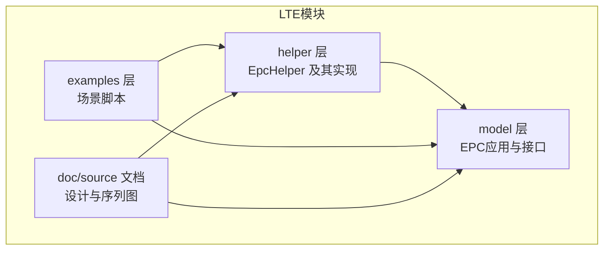
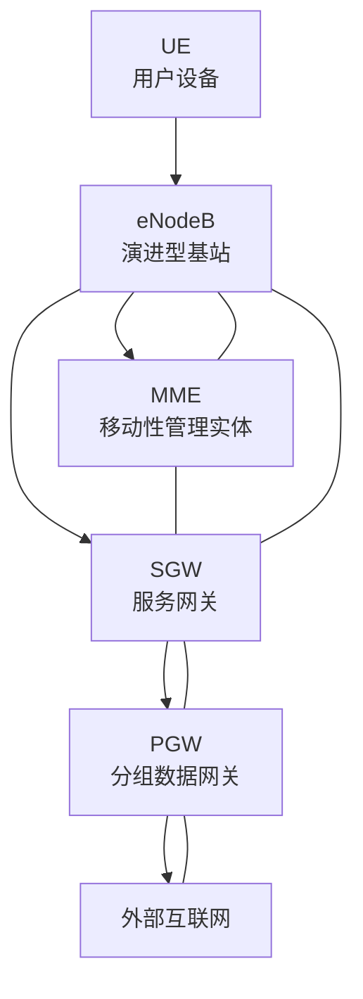
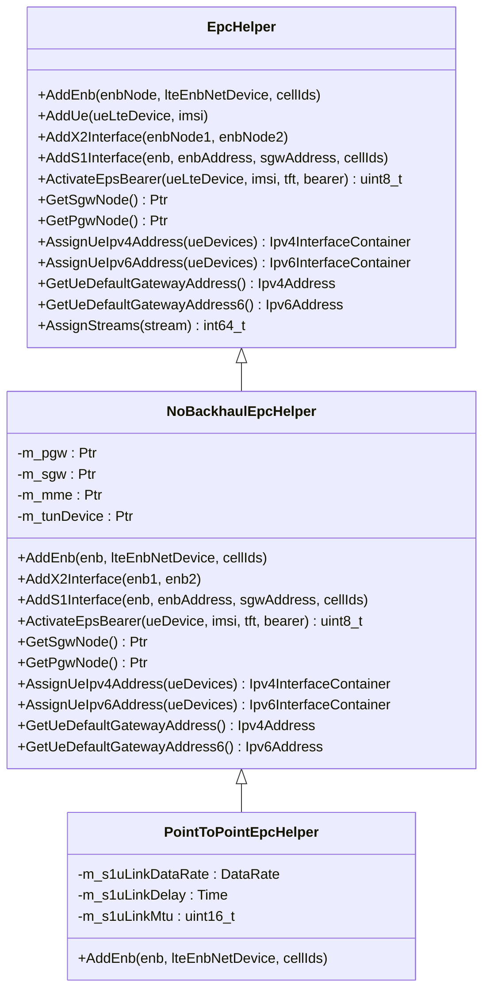
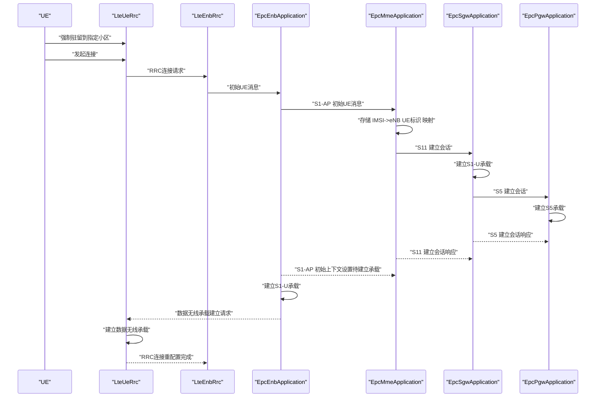
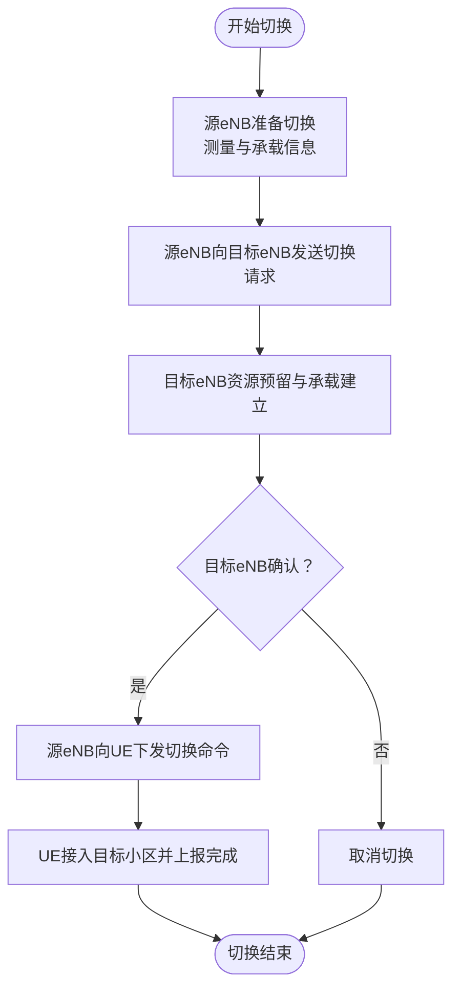
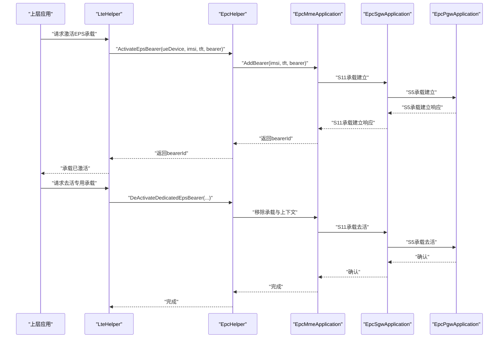
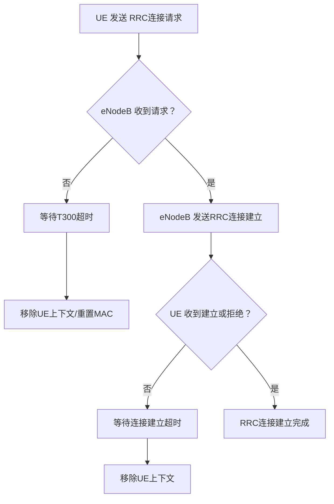
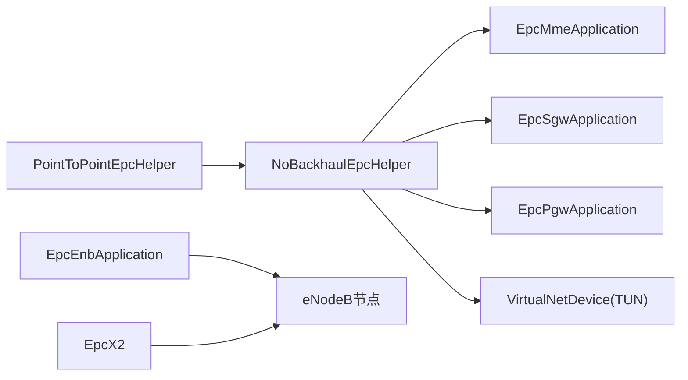

# LTE核心架构

<cite>
**本文引用的文件**
- [epc-helper.h](file://simulator/ns-3.39/src/lte/helper/epc-helper.h)
- [epc-helper.cc](file://simulator/ns-3.39/src/lte/helper/epc-helper.cc)
- [no-backhaul-epc-helper.h](file://simulator/ns-3.39/src/lte/helper/no-backhaul-epc-helper.h)
- [no-backhaul-epc-helper.cc](file://simulator/ns-3.39/src/lte/helper/no-backhaul-epc-helper.cc)
- [point-to-point-epc-helper.h](file://simulator/ns-3.39/src/lte/helper/point-to-point-epc-helper.h)
- [point-to-point-epc-helper.cc](file://simulator/ns-3.39/src/lte/helper/point-to-point-epc-helper.cc)
- [lena-simple-epc.cc](file://simulator/ns-3.39/src/lte/examples/lena-simple-epc.cc)
- [lena-simple-epc-backhaul.cc](file://simulator/ns-3.39/src/lte/examples/lena-simple-epc-backhaul.cc)
- [lena-deactivate-bearer.cc](file://simulator/ns-3.39/src/lte/examples/lena-deactivate-bearer.cc)
- [lte-design.rst](file://simulator/ns-3.39/src/lte/doc/source/lte-design.rst)
</cite>

## 目录
1. [简介](#简介)
2. [项目结构](#项目结构)
3. [核心组件](#核心组件)
4. [架构总览](#架构总览)
5. [详细组件分析](#详细组件分析)
6. [依赖关系分析](#依赖关系分析)
7. [性能考虑](#性能考虑)
8. [故障排查指南](#故障排查指南)
9. [结论](#结论)
10. [附录：在NS-3中构建LTE核心网络示例](#附录在ns-3中构建lte核心网络示例)

## 简介
本文件面向希望在NS-3中构建与仿真实验LTE/EPC网络的工程师与研究者，系统阐述EPC（演进分组核心网）的组件与交互机制，覆盖MME、SGW、PGW的功能职责、eNodeB与UE之间的RRC连接建立流程、移动性管理与切换流程、EPS承载的建立与释放过程，以及EPC网络的配置方式、用户面与控制面建模方法。文末提供可直接参考的代码示例路径，帮助快速搭建端到端仿真场景。

## 项目结构
NS-3的LTE模块位于simulator/ns-3.39/src/lte目录下，主要由以下层次构成：
- helper层：封装EPC节点与接口的创建与配置，如EpcHelper基类、NoBackhaulEpcHelper与PointToPointEpcHelper等具体实现。
- model层：包含EPC应用实体（MME、SGW、PGW）、X2、S1接口、TUN设备、GTP隧道等核心模型。
- examples层：提供多种典型场景脚本，演示如何安装eNodeB/UE、配置EPC、激活默认承载、进行切换与承载去活等。
- doc/source：包含设计文档与序列图，描述RRC连接建立、NAS附着、S1/X2接口交互等流程。

**章节来源**
- [epc-helper.h:1-186](file://simulator/ns-3.39/src/lte/helper/epc-helper.h#L1-L186)
- [no-backhaul-epc-helper.h:1-257](file://simulator/ns-3.39/src/lte/helper/no-backhaul-epc-helper.h#L1-L257)
- [point-to-point-epc-helper.h:1-112](file://simulator/ns-3.39/src/lte/helper/point-to-point-epc-helper.h#L1-L112)

## 核心组件
- EpcHelper（抽象基类）：定义EPC实体创建与接口配置的统一API，包括添加eNB、UE、X2/S1接口、激活EPS承载、分配UE地址、查询PGW/SGW节点等。
- NoBackhaulEpcHelper：在无回传网络的前提下，创建MME、SGW、PGW三节点拓扑，内部通过点对点链路实现S5、S11、X2等接口；S1接口不自动创建，需由上层自定义。
- PointToPointEpcHelper：在NoBackhaul基础上，为S1-U与S1-MME接口创建点对点链路，提供S1接口回传网络。
- EPC应用实体：
  - EpcMmeApplication：处理S11接口（MME-SGW），维护IMSI与eNB上下文映射，发起/响应会话建立。
  - EpcSgwApplication：处理S1-U（SGW-ENB）、S5-C/S5-U（SGW-PGW），负责用户面转发与承载管理。
  - EpcPgwApplication：处理S5-C/S5-U，作为用户面出口（TUN设备），实现GTP隧道与IP路由。
  - EpcEnbApplication：处理S1-AP（ENB-MME），协调RRC与核心网上下文建立。
  - EpcX2：实现eNodeB间的X2接口，支持切换准备与数据转发。
- TUN设备与GTP隧道：在PGW侧创建虚拟网卡，用于承载用户面数据的GTP-U封装与转发。

**章节来源**
- [epc-helper.h:49-181](file://simulator/ns-3.39/src/lte/helper/epc-helper.h#L49-L181)
- [no-backhaul-epc-helper.cc:48-227](file://simulator/ns-3.39/src/lte/helper/no-backhaul-epc-helper.cc#L48-L227)
- [point-to-point-epc-helper.cc:37-143](file://simulator/ns-3.39/src/lte/helper/point-to-point-epc-helper.cc#L37-L143)

## 架构总览
下图展示了EPC核心网的控制面与用户面交互，以及与eNodeB/UE的关系。控制面通过S1-MME（S11）、S1-U（GTP-U）、S5（S5-C/S5-U）、X2接口连接；用户面通过SGW/PGW的TUN设备与外部互联网互通。

**图表来源**
- [no-backhaul-epc-helper.cc:121-226](file://simulator/ns-3.39/src/lte/helper/no-backhaul-epc-helper.cc#L121-L226)
- [point-to-point-epc-helper.cc:117-142](file://simulator/ns-3.39/src/lte/helper/point-to-point-epc-helper.cc#L117-L142)

## 详细组件分析

### EPC帮助器与接口配置
- EpcHelper接口族：统一的添加eNB/UE、建立X2/S1接口、激活EPS承载、分配UE地址、查询PGW/SGW节点等能力。
- NoBackhaulEpcHelper实现：
  - 创建MME、SGW、PGW节点与IP栈。
  - 在SGW与PGW之间建立S5链路；在MME与SGW之间建立S11链路；在eNodeB之间建立X2链路（可选）。
  - 在PGW侧创建TUN设备，绑定GTP-U/UDP端口，实现用户面隧道。
  - 暴露AddS1Interface供上层在自定义回传网络中注册S1接口。
- PointToPointEpcHelper扩展：
  - 在AddEnb时自动为每个eNB与SGW之间创建S1-U点对点链路，并分配S1-U地址。
  - 提供S1-u链路的数据率、延迟、MTU与PCAP属性。

**图表来源**
- [epc-helper.h:49-181](file://simulator/ns-3.39/src/lte/helper/epc-helper.h#L49-L181)
- [no-backhaul-epc-helper.h:46-252](file://simulator/ns-3.39/src/lte/helper/no-backhaul-epc-helper.h#L46-L252)
- [point-to-point-epc-helper.h:38-107](file://simulator/ns-3.39/src/lte/helper/point-to-point-epc-helper.h#L38-L107)

**章节来源**
- [epc-helper.h:70-181](file://simulator/ns-3.39/src/lte/helper/epc-helper.h#L70-L181)
- [no-backhaul-epc-helper.cc:323-597](file://simulator/ns-3.39/src/lte/helper/no-backhaul-epc-helper.cc#L323-L597)
- [point-to-point-epc-helper.cc:108-143](file://simulator/ns-3.39/src/lte/helper/point-to-point-epc-helper.cc#L108-L143)

### 控制面信令流程：附着与承载建立
下图基于文档中的序列图，展示从UE发起附着到EPS承载建立完成的关键步骤，包括RRC连接请求、初始UE消息、S11会话建立、S5会话建立、S1-AP上下文设置、数据无线承载建立与RRC重配置确认。

**图表来源**
- [lte-design.rst:2-25](file://simulator/ns-3.39/src/lte/doc/source/lte-design.rst#L2-L25)

**章节来源**
- [lte-design.rst:2-25](file://simulator/ns-3.39/src/lte/doc/source/lte-design.rst#L2-L25)

### 移动性管理与切换流程
- X2接口：eNodeB间通过X2实体互联，支持切换准备、测量报告与数据转发。
- 切换流程要点：
  - 源eNB向目标eNB发送切换请求（含测量与承载信息）。
  - 目标eNB完成资源预留与承载建立，通知源eNB。
  - 源eNB向UE下发切换命令，UE完成接入目标小区后上报完成。
- 在NS-3中，可通过NoBackhaulEpcHelper::AddX2Interface在eNodeB之间建立X2链路并注册X2接口。

**章节来源**
- [no-backhaul-epc-helper.cc:383-455](file://simulator/ns-3.39/src/lte/helper/no-backhaul-epc-helper.cc#L383-L455)

### 承载建立与释放流程
- 默认EPS承载：Attach过程中默认激活，用于NAS信令与基本数据传输。
- 专用承载：通过ActivateEpsBearer触发，MME/S11与SGW/S5协同建立S1-U/S5承载，PGW侧TUN设备参与用户面转发。
- 承载释放：通过LteHelper的去活接口（如DeActivateDedicatedEpsBearer）调度执行，清理上下文与承载资源。

**图表来源**
- [lena-deactivate-bearer.cc:228-234](file://simulator/ns-3.39/src/lte/examples/lena-deactivate-bearer.cc#L228-L234)
- [no-backhaul-epc-helper.cc:466-526](file://simulator/ns-3.39/src/lte/helper/no-backhaul-epc-helper.cc#L466-L526)

**章节来源**
- [lena-deactivate-bearer.cc:71-245](file://simulator/ns-3.39/src/lte/examples/lena-deactivate-bearer.cc#L71-L245)
- [no-backhaul-epc-helper.cc:466-526](file://simulator/ns-3.39/src/lte/helper/no-backhaul-epc-helper.cc#L466-L526)

### RRC连接建立与定时器
- 连接请求超时（T300）：UE等待RRC连接建立或拒绝的最大时间窗口。
- 连接建立超时：eNodeB侧对新UE上下文的处理时限。
- 超时处理：若超时未收到期望消息，移除UE上下文或重置MAC状态，确保资源回收与状态收敛。

**章节来源**
- [lte-design.rst:2877-2894](file://simulator/ns-3.39/src/lte/doc/source/lte-design.rst#L2877-L2894)

## 依赖关系分析
- 组件耦合：
  - NoBackhaulEpcHelper聚合MME/SGW/PGW应用对象，负责控制面接口与用户面TUN设备的初始化。
  - PointToPointEpcHelper继承NoBackhaulEpcHelper，扩展S1接口回传网络的创建。
  - EpcEnbApplication与EpcX2分别挂载于eNodeB节点，负责S1-AP与X2接口。
- 外部依赖：
  - InternetStackHelper用于为MME/SGW/PGW与eNodeB安装IP栈。
  - PointToPointHelper用于创建S1/S5/X2链路。
  - Socket工厂用于GTP-U/UDP与S11/GTP-C通信。

**图表来源**
- [no-backhaul-epc-helper.cc:77-226](file://simulator/ns-3.39/src/lte/helper/no-backhaul-epc-helper.cc#L77-L226)
- [point-to-point-epc-helper.cc:117-142](file://simulator/ns-3.39/src/lte/helper/point-to-point-epc-helper.cc#L117-L142)

**章节来源**
- [no-backhaul-epc-helper.cc:77-226](file://simulator/ns-3.39/src/lte/helper/no-backhaul-epc-helper.cc#L77-L226)
- [point-to-point-epc-helper.cc:117-142](file://simulator/ns-3.39/src/lte/helper/point-to-point-epc-helper.cc#L117-L142)

## 性能考虑
- 链路参数调优：
  - S1-U/S5链路MTU需考虑GTP/UDP/IP封装开销，建议大于端到端MTU。
  - S11/S5链路数据率与延迟影响会话建立与切换时延。
- 用户面吞吐：
  - TUN设备支持巨帧以提升吞吐，但需确保路径MTU一致。
- 并发与调度：
  - 承载激活/去活使用Simulator::Schedule进行异步处理，避免阻塞主循环。
- 日志与追踪：
  - 示例脚本启用各组件日志与Traces，便于性能分析与问题定位。

[本节为通用指导，无需特定文件引用]

## 故障排查指南
- 无法找到LteUeNetDevice：
  - 当使用CSMA等非标准设备模拟UE时，激活EPS承载可能无法解析UE设备类型。此时会输出警告，不影响整体流程但需检查设备类型。
- 地址分配时机：
  - EPS承载激活需要在UE安装IPv4/IPv6栈并完成地址分配之后，否则会断言失败。
- 回传网络缺失：
  - 使用NoBackhaulEpcHelper时，S1接口不会自动创建，必须由上层脚本显式调用AddS1Interface注册S1接口地址。
- 切换失败：
  - 检查X2链路是否正确建立，以及目标eNB的邻区列表是否包含源eNB的小区ID。

**章节来源**
- [no-backhaul-epc-helper.cc:514-526](file://simulator/ns-3.39/src/lte/helper/no-backhaul-epc-helper.cc#L514-L526)
- [no-backhaul-epc-helper.cc:474-502](file://simulator/ns-3.39/src/lte/helper/no-backhaul-epc-helper.cc#L474-L502)
- [no-backhaul-epc-helper.cc:571-597](file://simulator/ns-3.39/src/lte/helper/no-backhaul-epc-helper.cc#L571-L597)

## 结论
NS-3的LTE/EPC模块通过EpcHelper抽象与NoBackhaul/PointToPoint实现，提供了灵活可控的EPC拓扑与接口配置能力。借助该框架，研究者可以精确建模控制面信令、用户面承载、移动性管理与切换，并结合丰富的示例脚本快速搭建端到端仿真场景。

[本节为总结性内容，无需特定文件引用]

## 附录：在NS-3中构建LTE核心网络示例
以下示例脚本展示了如何在NS-3中构建LTE+EPC场景，包括安装eNodeB/UE、配置EPC、分配UE地址、Attach与应用流量、以及S1回传网络的两种模式（内置回传与自定义回传）。

- 最简EPC场景（内置点对点回传）
  - 关键步骤：创建LteHelper与PointToPointEpcHelper，安装eNodeB/UE与Internet，分配UE IPv4地址，Attach，启动收发应用。
  - 示例路径：[lena-simple-epc.cc:78-204](file://simulator/ns-3.39/src/lte/examples/lena-simple-epc.cc#L78-L204)

- 自定义S1回传网络（无内置回传）
  - 关键步骤：创建NoBackhaulEpcHelper，手动为每个eNB与SGW之间建立点对点链路，分配S1-U地址并调用AddS1Interface注册。
  - 示例路径：[lena-simple-epc-backhaul.cc:81-183](file://simulator/ns-3.39/src/lte/examples/lena-simple-epc-backhaul.cc#L81-L183)

- 承载去活示例
  - 关键步骤：在仿真运行中途通过Simulator::Schedule调度LteHelper的去活接口，验证专用承载释放流程。
  - 示例路径：[lena-deactivate-bearer.cc:228-234](file://simulator/ns-3.39/src/lte/examples/lena-deactivate-bearer.cc#L228-L234)

**章节来源**
- [lena-simple-epc.cc:78-204](file://simulator/ns-3.39/src/lte/examples/lena-simple-epc.cc#L78-L204)
- [lena-simple-epc-backhaul.cc:81-183](file://simulator/ns-3.39/src/lte/examples/lena-simple-epc-backhaul.cc#L81-L183)
- [lena-deactivate-bearer.cc:228-234](file://simulator/ns-3.39/src/lte/examples/lena-deactivate-bearer.cc#L228-L234)