# LTE模块

<cite>
**本文引用的文件**
- [lte-enb-rrc.h](file://src/lte/model/lte-enb-rrc.h)
- [lte-enb-phy.h](file://src/lte/model/lte-enb-phy.h)
- [lte-helper.h](file://src/lte/helper/lte-helper.h)
- [lenna-simple.cc](file://src/lte/examples/lena-simple.cc)
- [phy-stats-calculator.h](file://src/lte/helper/phy-stats-calculator.h)
- [lte-rlc.h](file://src/lte/model/lte-rlc.h)
- [ff-mac-common.h](file://src/lte/model/ff-mac-common.h)
- [epc-enb-application.h](file://src/lte/model/epc-enb-application.h)
- [a3-rsrp-handover-algorithm.h](file://src/lte/model/a3-rsrp-handover-algorithm.h)
- [pf-ff-mac-scheduler.h](file://src/lte/model/pf-ff-mac-scheduler.h)
- [lte-pdcp.h](file://src/lte/model/lte-pdcp.h)
- [lte-interference.h](file://src/lte/model/lte-interference.h)
- [lte-ffr-algorithm.h](file://src/lte/model/lte-ffr-algorithm.h)
</cite>

## 目录
1. [引言](#引言)
2. [项目结构](#项目结构)
3. [核心组件](#核心组件)
4. [架构总览](#架构总览)
5. [详细组件分析](#详细组件分析)
6. [依赖关系分析](#依赖关系分析)
7. [性能考虑](#性能考虑)
8. [故障排查指南](#故障排查指南)
9. [结论](#结论)
10. [附录](#附录)

## 引言
本文件面向NS-3 LTE模块的使用者与开发者，系统化梳理4G LTE网络在NS-3中的仿真实现，覆盖EPC核心网、eNodeB、UE等组件；深入解析物理层（PHY）、MAC层、RLC层、PDCP层协议栈；并结合切换、频率复用（FFR）、QoS承载、统计与性能分析等主题，提供可操作的配置与调优建议。文档以“从宏观到细节”的方式组织，既适合初学者快速上手，也为高级用户提供深入参考。

## 项目结构
LTE模块位于ns-3源码树的src/lte目录下，按功能划分为三层：
- model：协议栈与网络实体实现（eNodeB/UE、EPC应用、调度器、算法等）
- helper：高层封装与配置工具（LteHelper、EPC Helper、统计计算器等）
- examples：典型场景脚本（如lena-simple）

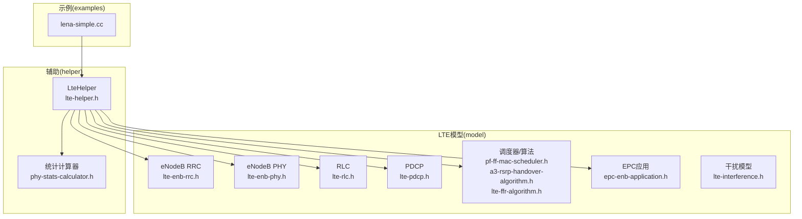

**图表来源**
- [lte-enb-rrc.h](file://src/lte/model/lte-enb-rrc.h)
- [lte-enb-phy.h](file://src/lte/model/lte-enb-phy.h)
- [lte-rlc.h](file://src/lte/model/lte-rlc.h)
- [lte-pdcp.h](file://src/lte/model/lte-pdcp.h)
- [pf-ff-mac-scheduler.h](file://src/lte/model/pf-ff-mac-scheduler.h)
- [a3-rsrp-handover-algorithm.h](file://src/lte/model/a3-rsrp-handover-algorithm.h)
- [lte-ffr-algorithm.h](file://src/lte/model/lte-ffr-algorithm.h)
- [epc-enb-application.h](file://src/lte/model/epc-enb-application.h)
- [lte-interference.h](file://src/lte/model/lte-interference.h)
- [lte-helper.h](file://src/lte/helper/lte-helper.h)
- [phy-stats-calculator.h](file://src/lte/helper/phy-stats-calculator.h)
- [lenna-simple.cc](file://src/lte/examples/lena-simple.cc)

**章节来源**
- [lte-helper.h:56-101](file://src/lte/helper/lte-helper.h#L56-L101)
- [lenna-simple.cc:30-112](file://src/lte/examples/lena-simple.cc#L30-L112)

## 核心组件
- LteHelper：统一创建与装配LTE网络（eNodeB/UE设备、传播模型、调度器、FFR算法、EPC、统计器），并提供便捷接口设置路径损耗、调度类型、FFR算法等。
- eNodeB RRC：维护每个UE的上下文、状态机、承载建立/释放、切换准备/执行、X2消息交互等。
- eNodeB PHY：下行/上行SpectrumPhy、发射功率、噪声系数、子载波掩码与功率分配、SINR/RSRP计算。
- RLC/PDCP：RLC支持透明/确认/非确认模式，PDCP负责序列号、完整性保护与重复丢弃等。
- 调度器（PF等）：基于比例公平的调度策略，输出DL/UL DCI与资源分配。
- 切换算法（A3 RSRP）：基于事件A3的最强邻区切换决策。
- FFR算法：通过RBG可用性与CQI上报，实现带内同频干扰管理。
- EPC应用：S1-U桥接、S1-AP控制面交互、X2接口数据转发。
- 统计与干扰：PHY层RSRP/SINR、干扰、吞吐量等指标采集与回调。

**章节来源**
- [lte-helper.h:102-128](file://src/lte/helper/lte-helper.h#L102-L128)
- [lte-enb-rrc.h:654-800](file://src/lte/model/lte-enb-rrc.h#L654-L800)
- [lte-enb-phy.h:44-120](file://src/lte/model/lte-enb-phy.h#L44-L120)
- [lte-rlc.h:48-110](file://src/lte/model/lte-rlc.h#L48-L110)
- [lte-pdcp.h:36-94](file://src/lte/model/lte-pdcp.h#L36-L94)
- [pf-ff-mac-scheduler.h:54-98](file://src/lte/model/pf-ff-mac-scheduler.h#L54-L98)
- [a3-rsrp-handover-algorithm.h:65-123](file://src/lte/model/a3-rsrp-handover-algorithm.h#L65-L123)
- [lte-ffr-algorithm.h:59-139](file://src/lte/model/lte-ffr-algorithm.h#L59-L139)
- [epc-enb-application.h:49-121](file://src/lte/model/epc-enb-application.h#L49-L121)
- [phy-stats-calculator.h:59-154](file://src/lte/helper/phy-stats-calculator.h#L59-L154)
- [lte-interference.h:40-110](file://src/lte/model/lte-interference.h#L40-L110)

## 架构总览
下图展示LTE仿真端到端的关键交互：LteHelper装配eNodeB/UE、EPC与统计器；eNodeB侧包含PHY/MAC/RLC/PDCP/RRC与调度器/算法；UE侧对应对等实体；EPC应用负责S1-U与S1-AP/X2接口。

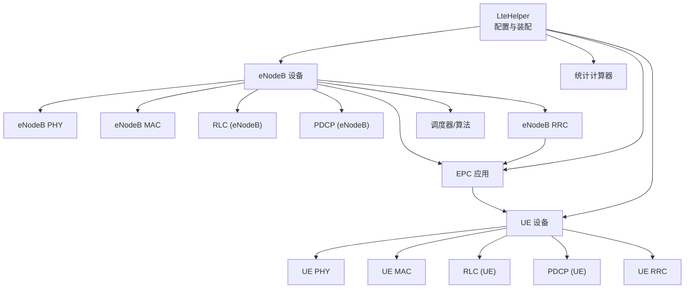

**图表来源**
- [lte-helper.h:56-101](file://src/lte/helper/lte-helper.h#L56-L101)
- [lte-enb-rrc.h:654-708](file://src/lte/model/lte-enb-rrc.h#L654-L708)
- [epc-enb-application.h:49-121](file://src/lte/model/epc-enb-application.h#L49-L121)

## 详细组件分析

### eNodeB RRC（连接建立、承载与切换）
- 关键职责：随机接入响应、RRC连接建立/重配、测量报告处理、承载建立/启动/释放、X2切换准备/完成/取消/失败处理、状态机与超时事件。
- 数据结构：UeManager维护单UE的RRC状态、SRB/DRB映射、定时器、缓冲队列；LteEnbRrc聚合多CC与SAP接口。
- 信令流程：初始上下文请求触发RRC重配；X2消息用于目标/源eNodeB间协调。

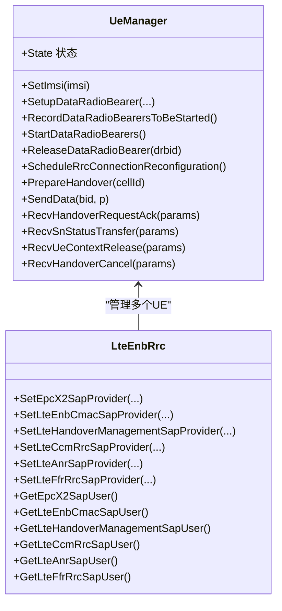

**图表来源**
- [lte-enb-rrc.h:66-110](file://src/lte/model/lte-enb-rrc.h#L66-L110)
- [lte-enb-rrc.h:654-800](file://src/lte/model/lte-enb-rrc.h#L654-L800)

**章节来源**
- [lte-enb-rrc.h:66-110](file://src/lte/model/lte-enb-rrc.h#L66-L110)
- [lte-enb-rrc.h:138-270](file://src/lte/model/lte-enb-rrc.h#L138-L270)

### eNodeB PHY（功率谱密度、子载波与SINR）
- 关键职责：下行/上行SpectrumPhy实例、发射功率/噪声系数、MAC-TTI延迟、子载波掩码与功率分配、为RLC/MAC提供SINR/RSRP。
- 接口：提供PHY SAP与CPHY SAP，供RRC/MAC调用。

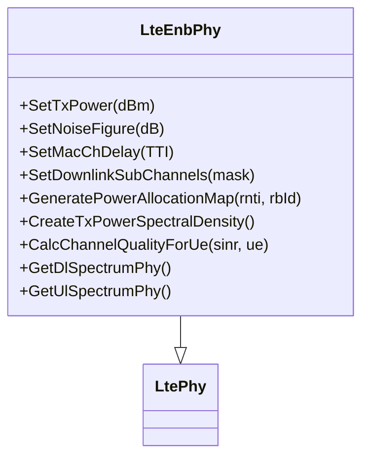

**图表来源**
- [lte-enb-phy.h:44-120](file://src/lte/model/lte-enb-phy.h#L44-L120)
- [lte-enb-phy.h:120-200](file://src/lte/model/lte-enb-phy.h#L120-L200)

**章节来源**
- [lte-enb-phy.h:100-187](file://src/lte/model/lte-enb-phy.h#L100-L187)

### RLC与PDCP（协议栈数据面）
- RLC：提供SM/AM/TM三种模式接口，向上向下发包、TX机会通知、HARQ失败上报；跟踪发送/接收事件。
- PDCP：序列号管理、状态查询、向上/向下接口；记录PDU收发与延迟。

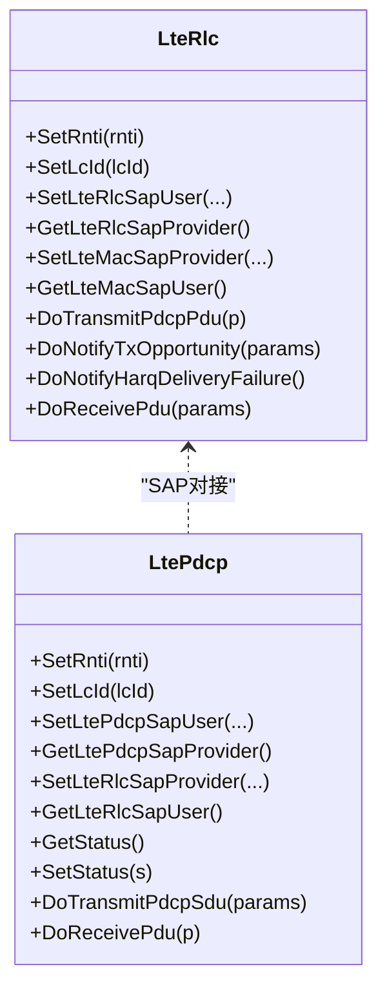

**图表来源**
- [lte-rlc.h:48-110](file://src/lte/model/lte-rlc.h#L48-L110)
- [lte-rlc.h:139-190](file://src/lte/model/lte-rlc.h#L139-L190)
- [lte-pdcp.h:36-94](file://src/lte/model/lte-pdcp.h#L36-L94)
- [lte-pdcp.h:144-193](file://src/lte/model/lte-pdcp.h#L144-L193)

**章节来源**
- [lte-rlc.h:48-110](file://src/lte/model/lte-rlc.h#L48-L110)
- [lte-pdcp.h:36-94](file://src/lte/model/lte-pdcp.h#L36-L94)

### 调度器与资源分配（PF调度）
- PF调度器实现CSCHED/SCHED SAP，处理小区/UE/LC配置、RLC缓冲、RACH/PAGING、CQI上报、DL/UL调度触发与DCI生成。
- 公平性：依据历史吞吐量动态调整分配权重。

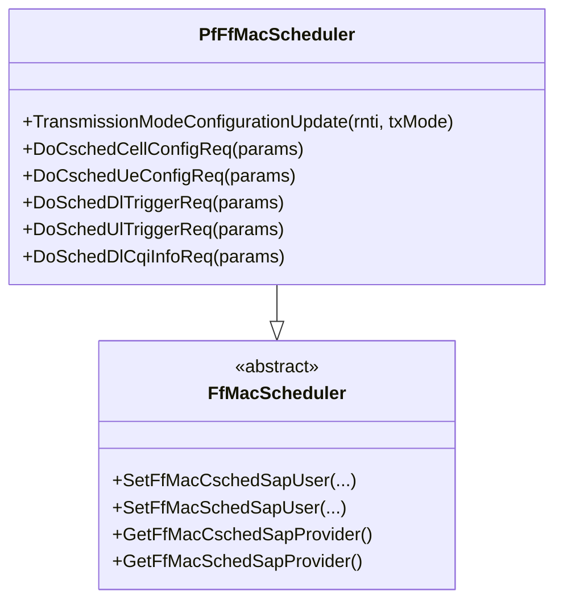

**图表来源**
- [pf-ff-mac-scheduler.h:54-98](file://src/lte/model/pf-ff-mac-scheduler.h#L54-L98)
- [pf-ff-mac-scheduler.h:105-200](file://src/lte/model/pf-ff-mac-scheduler.h#L105-L200)

**章节来源**
- [pf-ff-mac-scheduler.h:54-98](file://src/lte/model/pf-ff-mac-scheduler.h#L54-L98)
- [ff-mac-common.h:92-174](file://src/lte/model/ff-mac-common.h#L92-L174)

### 切换与移动性（A3 RSRP）
- 基于事件A3（邻区RSRP持续优于服务小区一定滞后与触发时间）触发切换；支持全局参数（迟滞、TTT）配置。
- 与RRC/ANR/FFR协同，确保切换前后资源与功率参数一致。

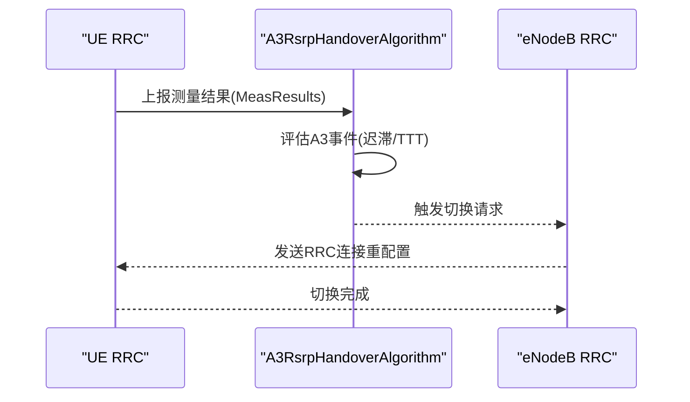

**图表来源**
- [a3-rsrp-handover-algorithm.h:65-123](file://src/lte/model/a3-rsrp-handover-algorithm.h#L65-L123)
- [lte-enb-rrc.h:184-216](file://src/lte/model/lte-enb-rrc.h#L184-L216)

**章节来源**
- [a3-rsrp-handover-algorithm.h:34-64](file://src/lte/model/a3-rsrp-handover-algorithm.h#L34-L64)

### 频率复用与干扰管理（FFR）
- FFR算法通过RBG可用性与CQI上报，决定哪些RB可在DL/UL分配给特定UE，降低小区间干扰。
- 支持与RRC/调度器双向SAP交互，自动/手动配置。

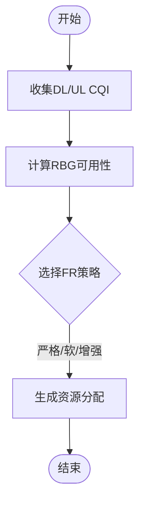

**图表来源**
- [lte-ffr-algorithm.h:59-139](file://src/lte/model/lte-ffr-algorithm.h#L59-L139)

**章节来源**
- [lte-ffr-algorithm.h:59-139](file://src/lte/model/lte-ffr-algorithm.h#L59-L139)

### EPC与用户面/控制面建模
- EPC应用作为S1-U桥接，将LTE无线侧与SGW连接；同时提供S1-AP控制面与X2接口能力。
- 控制面：S1-AP MME交互、初始UE消息、路径切换请求、UE上下文释放。
- 用户面：S1-U套接字收发、EPS流标识（RNTI+EPS Bearer ID）。

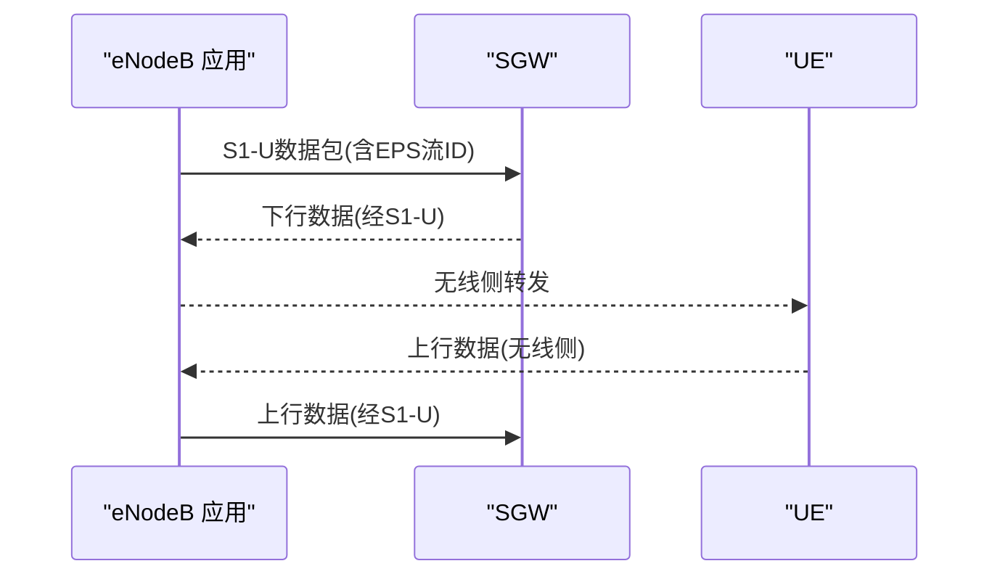

**图表来源**
- [epc-enb-application.h:49-121](file://src/lte/model/epc-enb-application.h#L49-L121)

**章节来源**
- [epc-enb-application.h:49-121](file://src/lte/model/epc-enb-application.h#L49-L121)

### 性能分析与统计
- 物理层统计：当前小区RSRP/SINR、UE SINR、干扰功率谱密度；支持文件落盘与回调。
- 可扩展：通过统计计算器注册回调，导出任意粒度的性能指标。

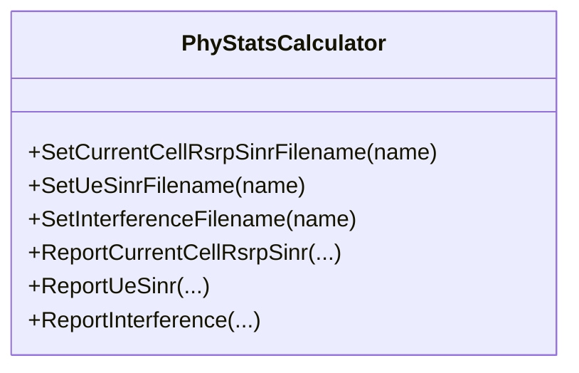

**图表来源**
- [phy-stats-calculator.h:59-154](file://src/lte/helper/phy-stats-calculator.h#L59-L154)

**章节来源**
- [phy-stats-calculator.h:59-154](file://src/lte/helper/phy-stats-calculator.h#L59-L154)

## 依赖关系分析
- LteHelper是装配入口，贯穿EPC、PHY、MAC、RLC、PDCP、RRC、调度器与算法。
- eNodeB侧：RRC依赖X2/S1/ANR/FFR/CMAC/CPHY等SAP；PHY依赖SpectrumPhy与干扰模型；MAC依赖调度器与FFR。
- UE侧：对等实体与eNodeB侧一一对应。
- 干扰模型：LteInterference为SINR/干扰块处理器提供总功率谱密度与噪声。

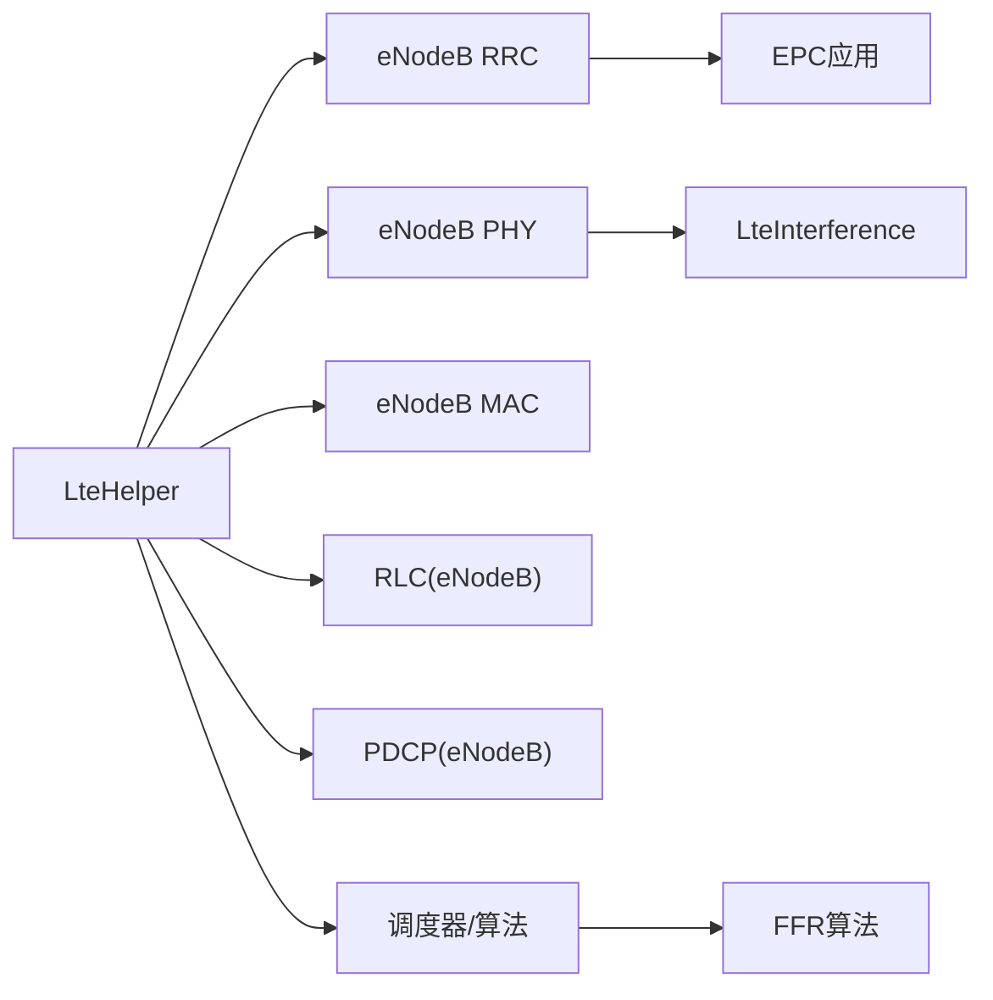

**图表来源**
- [lte-helper.h:56-101](file://src/lte/helper/lte-helper.h#L56-L101)
- [lte-enb-rrc.h:654-708](file://src/lte/model/lte-enb-rrc.h#L654-L708)
- [lte-interference.h:40-110](file://src/lte/model/lte-interference.h#L40-L110)
- [lte-ffr-algorithm.h:59-139](file://src/lte/model/lte-ffr-algorithm.h#L59-L139)

**章节来源**
- [lte-helper.h:56-101](file://src/lte/helper/lte-helper.h#L56-L101)
- [lte-interference.h:40-110](file://src/lte/model/lte-interference.h#L40-L110)

## 性能考虑
- 路径损耗与衰落：合理设置路径损耗模型与属性，避免过低/过高导致覆盖或干扰异常。
- 调度公平性：PF调度在高负载下偏向历史低吞吐UE；若需更公平，可结合其他调度器或参数调优。
- FFR策略：根据场景选择严格/软/增强策略，平衡边缘/中心用户性能。
- 功率与RB分配：通过eNodeB PHY的功率谱密度与RB掩码，控制发射功率与干扰。
- 统计粒度：按需开启回调与文件输出，避免过多IO影响仿真速度。

## 故障排查指南
- 连接建立失败：检查RRC状态机与超时事件（连接请求/建立/拒绝/重配），确认测量报告与承载配置。
- 切换失败/频繁切换：核查A3迟滞与TTT参数，邻区配置是否正确，X2接口是否可达。
- 吞吐偏低：检查CQI上报、调度器配置、RB分配策略与干扰水平；必要时启用FFR。
- 统计缺失：确认统计计算器已启用并正确绑定回调；检查文件路径与权限。

**章节来源**
- [lte-enb-rrc.h:596-646](file://src/lte/model/lte-enb-rrc.h#L596-L646)
- [a3-rsrp-handover-algorithm.h:104-123](file://src/lte/model/a3-rsrp-handover-algorithm.h#L104-L123)
- [phy-stats-calculator.h:156-200](file://src/lte/helper/phy-stats-calculator.h#L156-L200)

## 结论
NS-3 LTE模块提供了完整的4G LTE协议栈与EPC仿真框架，具备灵活的配置与丰富的统计接口。通过LteHelper统一装配，结合调度器、切换与FFR算法，可实现从基础覆盖到复杂干扰管理的多种场景。建议在实际部署中，先以简单场景验证链路，再逐步引入切换、负载均衡与QoS策略，并配合统计分析进行容量与性能优化。

## 附录
- 示例脚本：使用LteHelper创建eNodeB/UE节点、安装设备、附着与激活承载、启用追踪与运行仿真。
- 配置要点：路径损耗模型、调度器类型、FFR算法、切换算法、统计开关等均可通过LteHelper设置。

**章节来源**
- [lenna-simple.cc:65-101](file://src/lte/examples/lena-simple.cc#L65-L101)