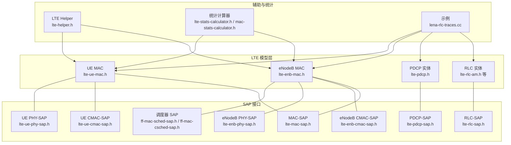
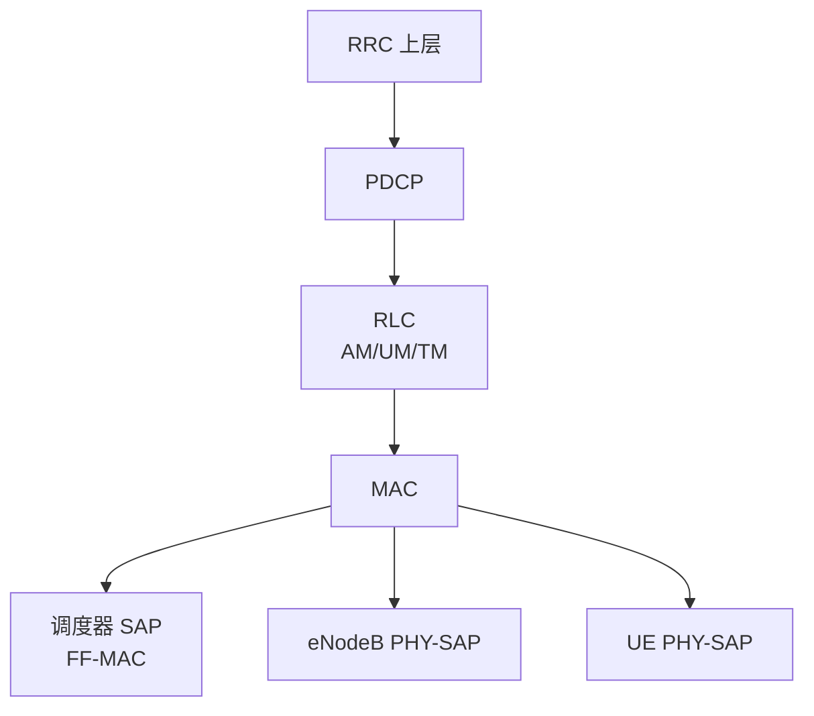
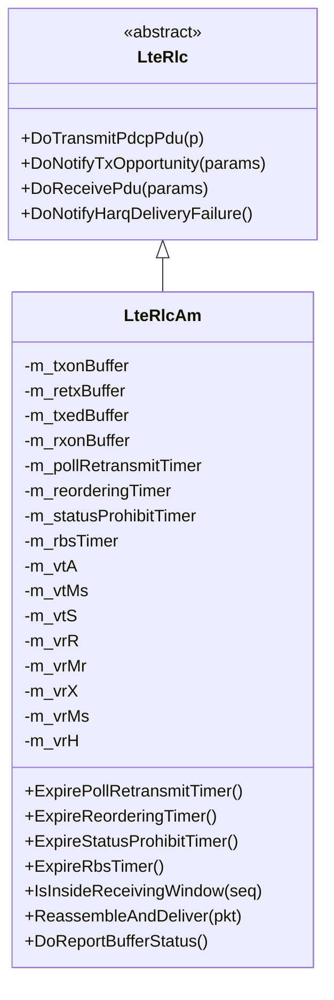
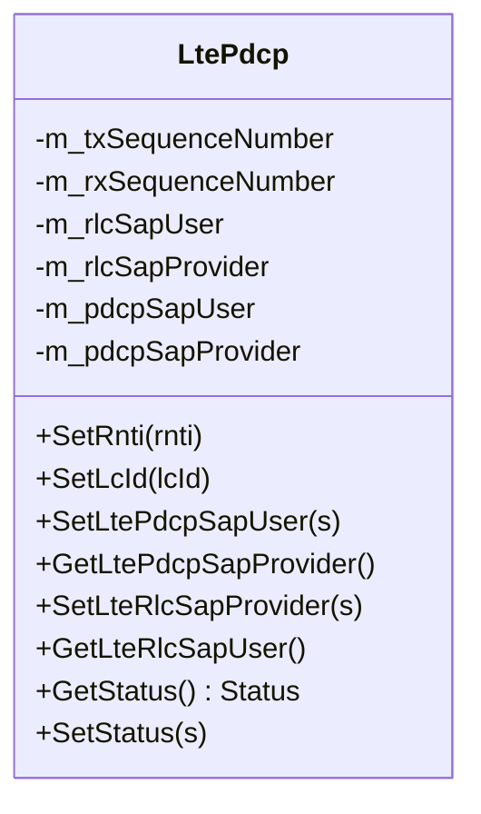
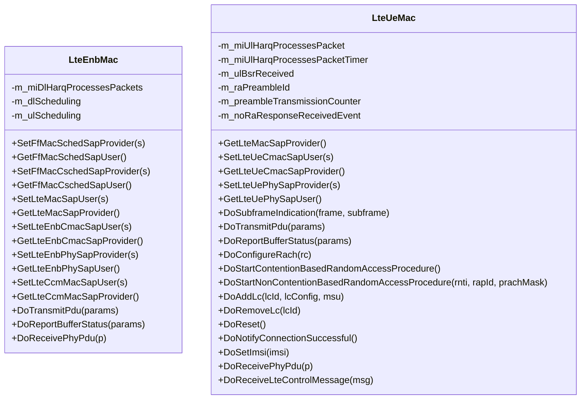
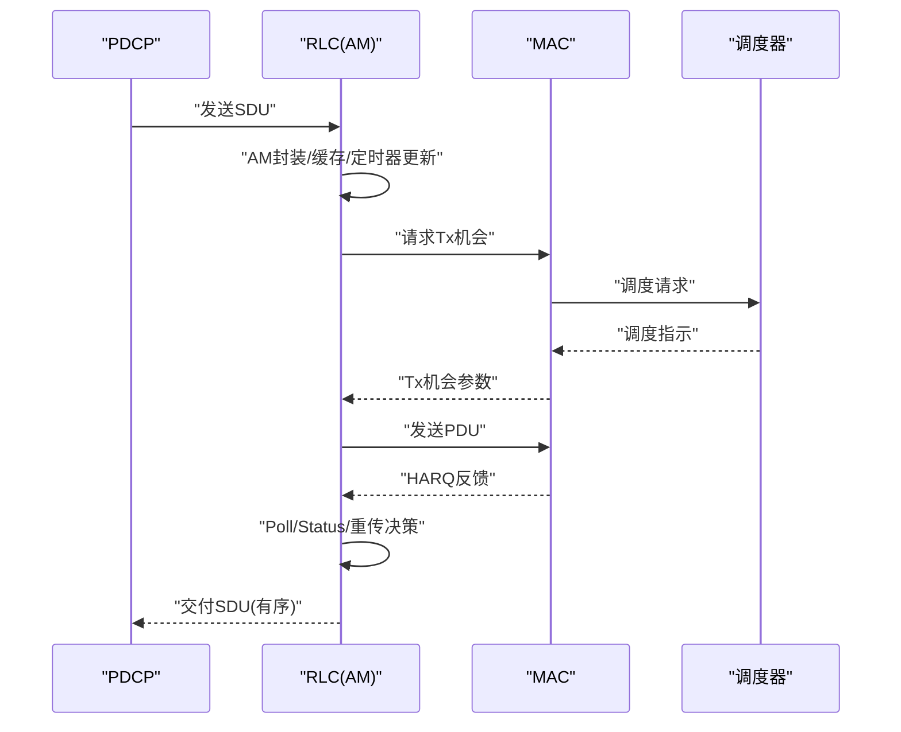
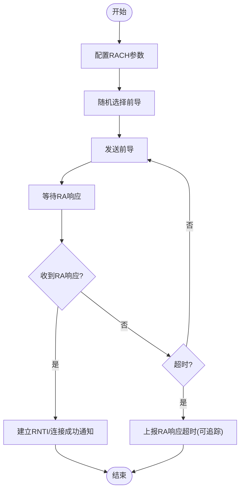
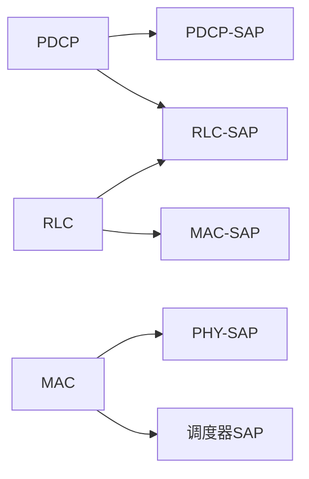

# 协议层实现

<cite>
**本文引用的文件**
- [lte-enb-mac.h](file://simulator/ns-3.39/src/lte/model/lte-enb-mac.h)
- [lte-ue-mac.h](file://simulator/ns-3.39/src/lte/model/lte-ue-mac.h)
- [lte-rlc-am.h](file://simulator/ns-3.39/src/lte/model/lte-rlc-am.h)
- [lte-pdcp.h](file://simulator/ns-3.39/src/lte/model/lte-pdcp.h)
- [lte-rlc-sap.h](file://simulator/ns-3.39/build/include/ns3/lte-rlc-sap.h)
- [lte-pdcp-sap.h](file://simulator/ns-3.39/build/include/ns3/lte-pdcp-sap.h)
- [lte-mac-sap.h](file://simulator/ns-3.39/build/include/ns3/lte-mac-sap.h)
- [lte-enb-cmac-sap.h](file://simulator/ns-3.39/build/include/ns3/lte-enb-cmac-sap.h)
- [lte-ue-cmac-sap.h](file://simulator/ns-3.39/build/include/ns3/lte-ue-cmac-sap.h)
- [lte-enb-phy-sap.h](file://simulator/ns-3.39/build/include/ns3/lte-enb-phy-sap.h)
- [lte-ue-phy-sap.h](file://simulator/ns-3.39/build/include/ns3/lte-ue-phy-sap.h)
- [ff-mac-sched-sap.h](file://simulator/ns-3.39/build/include/ns3/ff-mac-sched-sap.h)
- [ff-mac-csched-sap.h](file://simulator/ns-3.39/build/include/ns3/ff-mac-csched-sap.h)
- [lte-common.h](file://simulator/ns-3.39/build/include/ns3/lte-common.h)
- [lte-helper.h](file://simulator/ns-3.39/src/lte/helper/lte-helper.h)
- [lte-stats-calculator.h](file://simulator/ns-3.39/src/lte/helper/lte-stats-calculator.h)
- [mac-stats-calculator.h](file://simulator/ns-3.39/src/lte/helper/mac-stats-calculator.h)
- [lena-rlc-traces.cc](file://simulator/ns-3.39/src/lte/examples/lena-rlc-traces.cc)
</cite>

## 目录
1. [引言](#引言)
2. [项目结构](#项目结构)
3. [核心组件](#核心组件)
4. [架构总览](#架构总览)
5. [详细组件分析](#详细组件分析)
6. [依赖关系分析](#依赖关系分析)
7. [性能考虑](#性能考虑)
8. [故障排查指南](#故障排查指南)
9. [结论](#结论)
10. [附录](#附录)

## 引言
本文件面向LTE系统中RLC（无线链路控制）、PDCP（分组数据汇聚协议）、MAC（媒体访问控制）三层的实现与使用，结合NS-3 LTE模块源码进行系统化梳理。内容覆盖各层功能职责、数据处理流程、重传与排序机制、完整性与加密保护、层间接口与数据单元格式、状态机管理、参数配置、性能统计与调试方法，并给出优化策略与典型应用场景建议。

## 项目结构
LTE相关实现主要位于以下路径：
- 模型层：src/lte/model 下包含RLC、PDCP、MAC等实体及SAP接口定义
- 辅助工具与统计：src/lte/helper 下包含统计计算器与辅助类
- 示例：src/lte/examples 下包含典型场景脚本，如RLC跟踪示例
- 构建产物头文件：build/include/ns3 下提供对外可见的SAP与公共类型声明

**图表来源**
- [lte-enb-mac.h:27-33](file://simulator/ns-3.39/src/lte/model/lte-enb-mac.h#L27-L33)
- [lte-ue-mac.h:24-28](file://simulator/ns-3.39/src/lte/model/lte-ue-mac.h#L24-L28)
- [lte-rlc-am.h:23-25](file://simulator/ns-3.39/src/lte/model/lte-rlc-am.h#L23-L25)
- [lte-pdcp.h:23-25](file://simulator/ns-3.39/src/lte/model/lte-pdcp.h#L23-L25)
- [lte-helper.h](file://simulator/ns-3.39/src/lte/helper/lte-helper.h)
- [lte-stats-calculator.h](file://simulator/ns-3.39/src/lte/helper/lte-stats-calculator.h)
- [mac-stats-calculator.h](file://simulator/ns-3.39/src/lte/helper/mac-stats-calculator.h)
- [lena-rlc-traces.cc](file://simulator/ns-3.39/src/lte/examples/lena-rlc-traces.cc)

**章节来源**
- [lte-enb-mac.h:27-33](file://simulator/ns-3.39/src/lte/model/lte-enb-mac.h#L27-L33)
- [lte-ue-mac.h:24-28](file://simulator/ns-3.39/src/lte/model/lte-ue-mac.h#L24-L28)
- [lte-rlc-am.h:23-25](file://simulator/ns-3.39/src/lte/model/lte-rlc-am.h#L23-L25)
- [lte-pdcp.h:23-25](file://simulator/ns-3.39/src/lte/model/lte-pdcp.h#L23-L25)

## 核心组件
- RLC（无线链路控制）
  - AM模式：提供可靠传输、有序交付、重传、ARQ确认、窗口管理、Poll重传、Status报告、Reordering与Status Prohibit定时器等
  - 关键状态变量：发送端VT(A/M/S)、接收端VR(R/MR/X/MS/H)
  - 关键缓冲区：txon/retx/txed缓冲与接收侧按SN重组缓冲
  - 关键定时器：PollRetransmit、Reordering、StatusProhibit、RBS
- PDCP（分组数据汇聚协议）
  - 提供序列号管理（TX/RX SN）、上解/下装接口、延迟测量与统计回调
  - 支持设置RNTI与LCID，用于统计与追踪
- MAC（媒体访问控制）
  - eNodeB MAC：负责下行/上行调度指示转发、BSR/CE处理、HARQ反馈、随机接入过程、PHY交互、组件载波管理
  - UE MAC：负责随机接入（含竞争与非竞争）、BSR周期性上报、HARQ进程刷新、PHY交互、逻辑信道管理

**章节来源**
- [lte-rlc-am.h:37-245](file://simulator/ns-3.39/src/lte/model/lte-rlc-am.h#L37-L245)
- [lte-pdcp.h:36-198](file://simulator/ns-3.39/src/lte/model/lte-pdcp.h#L36-L198)
- [lte-enb-mac.h:57-471](file://simulator/ns-3.39/src/lte/model/lte-enb-mac.h#L57-L471)
- [lte-ue-mac.h:43-307](file://simulator/ns-3.39/src/lte/model/lte-ue-mac.h#L43-L307)

## 架构总览
下图展示RLC/PDCP/MAC在LTE协议栈中的位置与交互关系，以及与调度器、PHY、SAP接口的耦合。

**图表来源**
- [lte-rlc-am.h:54-66](file://simulator/ns-3.39/src/lte/model/lte-rlc-am.h#L54-L66)
- [lte-pdcp.h:72-93](file://simulator/ns-3.39/src/lte/model/lte-pdcp.h#L72-L93)
- [lte-enb-mac.h:92-107](file://simulator/ns-3.39/src/lte/model/lte-enb-mac.h#L92-L107)
- [lte-ue-mac.h:82-110](file://simulator/ns-3.39/src/lte/model/lte-ue-mac.h#L82-L110)
- [ff-mac-sched-sap.h](file://simulator/ns-3.39/build/include/ns3/ff-mac-sched-sap.h)
- [ff-mac-csched-sap.h](file://simulator/ns-3.39/build/include/ns3/ff-mac-csched-sap.h)
- [lte-enb-phy-sap.h](file://simulator/ns-3.39/build/include/ns3/lte-enb-phy-sap.h)
- [lte-ue-phy-sap.h](file://simulator/ns-3.39/build/include/ns3/lte-ue-phy-sap.h)

## 详细组件分析

### RLC（无线链路控制）- AM模式
- 功能要点
  - 可靠传输：基于ARQ的重传与确认；通过Poll阈值触发Status报告
  - 排序与重组：接收端按序列号窗口判断与重组，确保上交SDU有序
  - 缓冲管理：txonBuffer（待发）、retxBuffer（重传候选）、txedBuffer（已发未确认）
  - 定时器驱动：PollRetransmit（超时重传）、Reordering（等待乱序对齐）、StatusProhibit（抑制频繁Status）、RBS（BSR触发）
- 数据处理流程
  - 上行：RLC从PDCP接收SDU，按AM规则封装为PDU，依据Tx Opportunity与Poll阈值决定是否发送或重传
  - 下行：RLC从MAC接收PDU，按序列号窗口判断，重组后交付PDCP
- 重传机制
  - 基于Poll计数与定时器；超过最大重传阈值触发Harq Delivery Failure通知
- 接口与状态
  - SAP：DoTransmitPdcpPdu、DoNotifyTxOpportunity、DoReceivePdu、DoNotifyHarqDeliveryFailure
  - 状态变量：VT(A/M/S)、VR(R/MR/X/MS/H)，窗口大小与计数器

**图表来源**
- [lte-rlc-am.h:37-245](file://simulator/ns-3.39/src/lte/model/lte-rlc-am.h#L37-L245)

**章节来源**
- [lte-rlc-am.h:68-245](file://simulator/ns-3.39/src/lte/model/lte-rlc-am.h#L68-L245)

### PDCP（分组数据汇聚协议）
- 功能要点
  - 序列号管理：维护TX/RX SN，支持状态查询与设置
  - 上解/下装：向上提交SDU，向下发送PDU；提供PDU收发统计与延迟回调
  - 身份绑定：通过RNTI与LCID标识承载上下文
- 数据处理流程
  - 上行：从RLC接收PDU，去封装后交付上层
  - 下行：从上层接收SDU，封装为PDU后交给RLC
- 接口与状态
  - SAP：SetLtePdcpSapUser/Provider、SetLteRlcSapProvider/User
  - 状态：Status结构包含txSn与rxSn

**图表来源**
- [lte-pdcp.h:36-198](file://simulator/ns-3.39/src/lte/model/lte-pdcp.h#L36-L198)

**章节来源**
- [lte-pdcp.h:44-198](file://simulator/ns-3.39/src/lte/model/lte-pdcp.h#L44-L198)

### MAC（媒体访问控制）
- eNodeB MAC
  - 职责：配置MAC、添加/移除UE与逻辑信道、处理BSR/CE、转发调度指示、HARQ反馈、随机接入前导接收、PHY交互、组件载波管理
  - 关键接口：FfMacSched/Csche SAP用户/提供者、LteMac/EnbCmac SAP、LteEnbPhy SAP、CCM MAC SAP
  - 统计：DL/UL调度事件追踪回调
- UE MAC
  - 职责：配置RACH、启动竞争/非竞争随机接入、周期性上报BSR、刷新HARQ缓冲、接收PHY PDU与控制消息、逻辑信道管理
  - 关键接口：LteMac SAP、LteUeCmac SAP、LteUePhy SAP
  - 随机接入：前导选择、等待RA响应、超时处理

**图表来源**
- [lte-enb-mac.h:57-471](file://simulator/ns-3.39/src/lte/model/lte-enb-mac.h#L57-L471)
- [lte-ue-mac.h:43-307](file://simulator/ns-3.39/src/lte/model/lte-ue-mac.h#L43-L307)

**章节来源**
- [lte-enb-mac.h:72-471](file://simulator/ns-3.39/src/lte/model/lte-enb-mac.h#L72-L471)
- [lte-ue-mac.h:52-307](file://simulator/ns-3.39/src/lte/model/lte-ue-mac.h#L52-L307)

### RLC到PDCP的交互时序（AM模式）

**图表来源**
- [lte-rlc-am.h:54-66](file://simulator/ns-3.39/src/lte/model/lte-rlc-am.h#L54-L66)
- [ff-mac-sched-sap.h](file://simulator/ns-3.39/build/include/ns3/ff-mac-sched-sap.h)
- [lte-mac-sap.h](file://simulator/ns-3.39/build/include/ns3/lte-mac-sap.h)

### UE随机接入流程（UE MAC）

**图表来源**
- [lte-ue-mac.h:151-240](file://simulator/ns-3.39/src/lte/model/lte-ue-mac.h#L151-L240)

## 依赖关系分析
- 层间依赖
  - PDCP依赖RLC-SAP与PDCP-SAP接口进行上下行数据通路
  - RLC依赖MAC-SAP与RLC-SAP进行数据与控制交互
  - MAC依赖调度器SAP、PHY-SAP与CMAC-SAP完成资源分配与物理层交互
- 外部依赖
  - 公共类型与常量由lte-common.h提供
  - 示例与统计通过helper与stats-calculator进行观测与验证

**图表来源**
- [lte-rlc-sap.h](file://simulator/ns-3.39/build/include/ns3/lte-rlc-sap.h)
- [lte-pdcp-sap.h](file://simulator/ns-3.39/build/include/ns3/lte-pdcp-sap.h)
- [lte-mac-sap.h](file://simulator/ns-3.39/build/include/ns3/lte-mac-sap.h)
- [ff-mac-sched-sap.h](file://simulator/ns-3.39/build/include/ns3/ff-mac-sched-sap.h)
- [lte-enb-phy-sap.h](file://simulator/ns-3.39/build/include/ns3/lte-enb-phy-sap.h)
- [lte-ue-phy-sap.h](file://simulator/ns-3.39/build/include/ns3/lte-ue-phy-sap.h)

**章节来源**
- [lte-common.h](file://simulator/ns-3.39/build/include/ns3/lte-common.h)

## 性能考虑
- RLC AM重传与Poll策略
  - 合理设置Poll阈值与定时器，避免频繁Status报告与不必要的重传
  - 控制最大重传阈值，防止拥塞放大
- MAC调度与BSR
  - BSR周期性与突发场景平衡，避免过长导致调度延迟，过短导致控制开销增大
  - 调度器SAP参数与带宽配置需匹配链路条件
- PDCP统计与追踪
  - 利用PDU收发回调统计吞吐与时延，辅助参数调优
- 端到端优化
  - 结合示例脚本与统计计算器，定位瓶颈（RLC重传、MAC调度、PHY链路质量）

[本节为通用指导，无需特定文件引用]

## 故障排查指南
- RLC AM重传风暴
  - 现象：频繁Poll触发与Status报告，吞吐下降
  - 排查：检查Poll阈值、定时器配置与链路质量；观察重传缓冲与定时器事件
  - 参考路径：[lte-rlc-am.h:204-211](file://simulator/ns-3.39/src/lte/model/lte-rlc-am.h#L204-L211)
- UE随机接入失败
  - 现象：RA响应超时、无法建立连接
  - 排查：检查前导选择、竞争参数、PRACH配置与超时事件；查看RA响应追踪回调
  - 参考路径：[lte-ue-mac.h:226-240](file://simulator/ns-3.39/src/lte/model/lte-ue-mac.h#L226-L240)
- MAC调度异常
  - 现象：DL/UL调度不均衡或无调度
  - 排查：检查调度器SAP配置、BSR/CE上报、HARQ反馈；利用调度追踪回调定位帧/子帧问题
  - 参考路径：[lte-enb-mac.h:166-188](file://simulator/ns-3.39/src/lte/model/lte-enb-mac.h#L166-L188)
- 性能统计与调试
  - 使用统计计算器与示例脚本进行端到端验证
  - 参考路径：[lte-stats-calculator.h](file://simulator/ns-3.39/src/lte/helper/lte-stats-calculator.h)、[mac-stats-calculator.h](file://simulator/ns-3.39/src/lte/helper/mac-stats-calculator.h)、[lena-rlc-traces.cc](file://simulator/ns-3.39/src/lte/examples/lena-rlc-traces.cc)

**章节来源**
- [lte-rlc-am.h:204-211](file://simulator/ns-3.39/src/lte/model/lte-rlc-am.h#L204-L211)
- [lte-ue-mac.h:226-240](file://simulator/ns-3.39/src/lte/model/lte-ue-mac.h#L226-L240)
- [lte-enb-mac.h:166-188](file://simulator/ns-3.39/src/lte/model/lte-enb-mac.h#L166-L188)
- [lte-stats-calculator.h](file://simulator/ns-3.39/src/lte/helper/lte-stats-calculator.h)
- [mac-stats-calculator.h](file://simulator/ns-3.39/src/lte/helper/mac-stats-calculator.h)
- [lena-rlc-traces.cc](file://simulator/ns-3.39/src/lte/examples/lena-rlc-traces.cc)

## 结论
本文基于NS-3 LTE模块源码，系统梳理了RLC（AM模式）、PDCP、MAC（eNodeB与UE）的实现与交互。RLC通过AM模式提供可靠、有序的数据传输与重传保障；PDCP负责序列号管理与统计追踪；MAC承担调度、随机接入与HARQ反馈的关键职责。结合SAP接口、统计数据与示例脚本，可在仿真环境中高效验证与优化参数配置，满足不同业务场景需求。

[本节为总结性内容，无需特定文件引用]

## 附录
- 参数配置与接口参考
  - RLC AM：Poll阈值、定时器、窗口大小、最大重传阈值
  - PDCP：RNTI/LCID设置、状态查询与设置
  - MAC：调度器SAP、PHY-SAP、CMAC-SAP、BSR/CE处理
- 示例与统计
  - RLC跟踪示例：[lena-rlc-traces.cc](file://simulator/ns-3.39/src/lte/examples/lena-rlc-traces.cc)
  - 统计计算器：[lte-stats-calculator.h](file://simulator/ns-3.39/src/lte/helper/lte-stats-calculator.h)、[mac-stats-calculator.h](file://simulator/ns-3.39/src/lte/helper/mac-stats-calculator.h)

**章节来源**
- [lte-rlc-am.h:216-219](file://simulator/ns-3.39/src/lte/model/lte-rlc-am.h#L216-L219)
- [lte-pdcp.h:58-93](file://simulator/ns-3.39/src/lte/model/lte-pdcp.h#L58-L93)
- [lte-enb-mac.h:92-107](file://simulator/ns-3.39/src/lte/model/lte-enb-mac.h#L92-L107)
- [lte-ue-mac.h:82-110](file://simulator/ns-3.39/src/lte/model/lte-ue-mac.h#L82-L110)
- [lena-rlc-traces.cc](file://simulator/ns-3.39/src/lte/examples/lena-rlc-traces.cc)
- [lte-stats-calculator.h](file://simulator/ns-3.39/src/lte/helper/lte-stats-calculator.h)
- [mac-stats-calculator.h](file://simulator/ns-3.39/src/lte/helper/mac-stats-calculator.h)