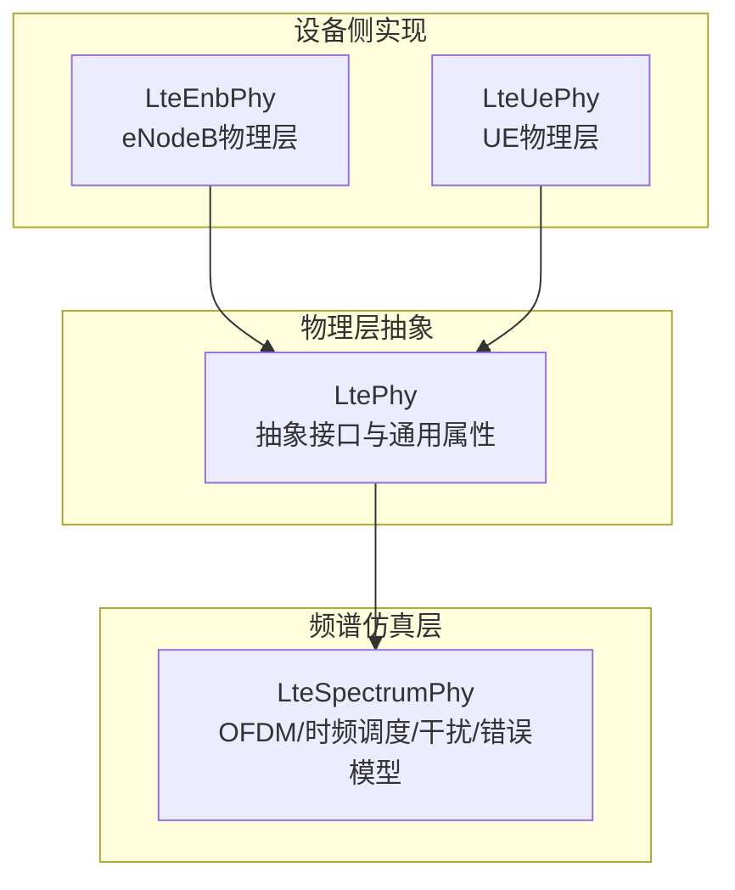
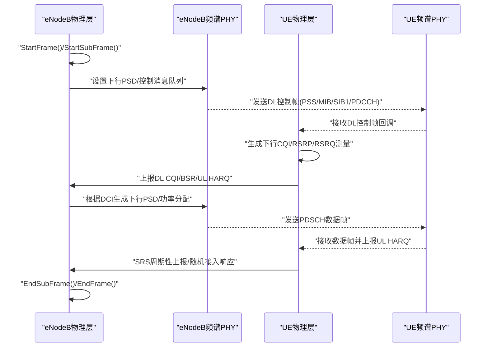
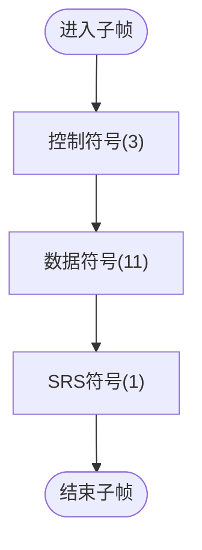
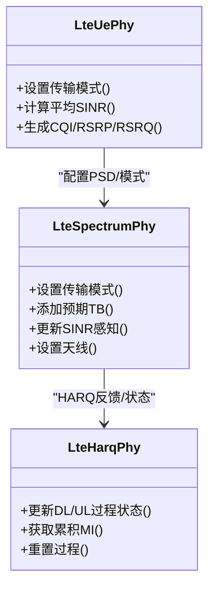
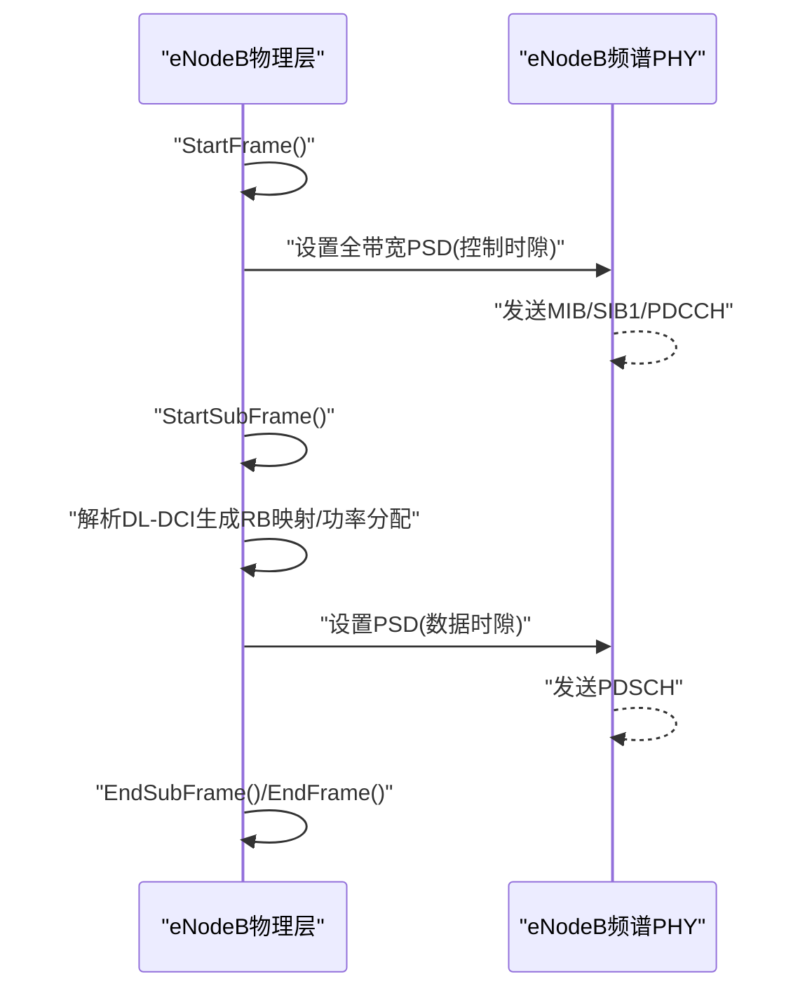
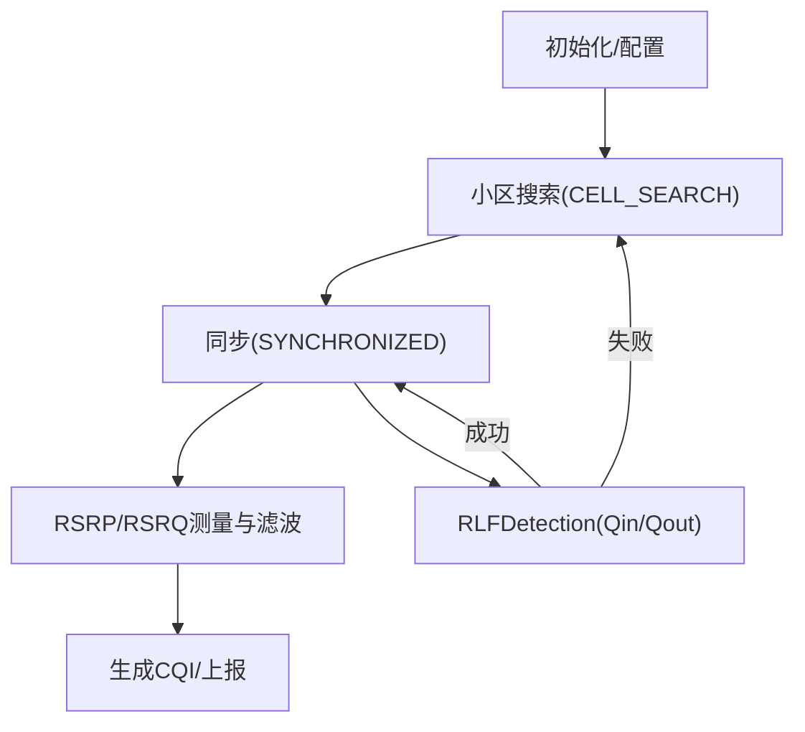
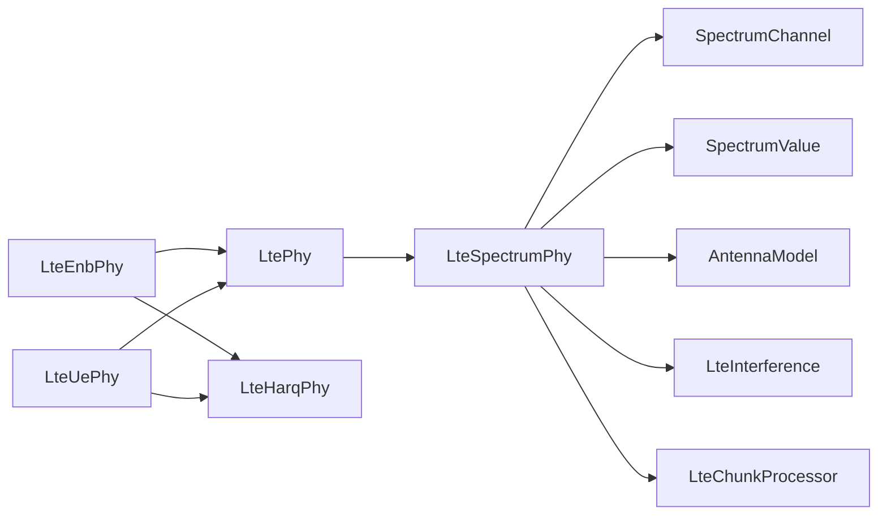

# 物理层实现

<cite>
**本文引用的文件**
- [lte-enb-phy.h](file://simulator/ns-3.39/src/lte/model/lte-enb-phy.h)
- [lte-enb-phy.cc](file://simulator/ns-3.39/src/lte/model/lte-enb-phy.cc)
- [lte-ue-phy.h](file://simulator/ns-3.39/src/lte/model/lte-ue-phy.h)
- [lte-ue-phy.cc](file://simulator/ns-3.39/src/lte/model/lte-ue-phy.cc)
- [lte-phy.h](file://simulator/ns-3.39/src/lte/model/lte-phy.h)
- [lte-spectrum-phy.h](file://simulator/ns-3.39/src/lte/model/lte-spectrum-phy.h)
- [lte-spectrum-phy.cc](file://simulator/ns-3.39/src/lte/model/lte-spectrum-phy.cc)
- [lte-harq-phy.h](file://simulator/ns-3.39/src/lte/model/lte-harq-phy.h)
- [lte-amc.h](file://simulator/ns-3.39/src/lte/model/lte-amc.h)
- [lte-ue-power-control.h](file://simulator/ns-3.39/src/lte/model/lte-ue-power-control.h)
- [lte-spectrum-value-helper.h](file://simulator/ns-3.39/src/lte/model/lte-spectrum-value-helper.h)
- [lena-uplink-power-control.cc](file://simulator/ns-3.39/src/lte/examples/lena-uplink-power-control.cc)
- [lena-fading.cc](file://simulator/ns-3.39/src/lte/examples/lena-fading.cc)
- [lena-simple.cc](file://simulator/ns-3.39/src/lte/examples/lena-simple.cc)
</cite>

## 目录
1. [引言](#引言)
2. [项目结构](#项目结构)
3. [核心组件](#核心组件)
4. [架构总览](#架构总览)
5. [详细组件分析](#详细组件分析)
6. [依赖关系分析](#依赖关系分析)
7. [性能考虑](#性能考虑)
8. [故障排查指南](#故障排查指南)
9. [结论](#结论)
10. [附录](#附录)

## 引言
本文件面向LTE物理层（PHY）在ns-3中的实现，系统化梳理OFDM调制解调、MIMO与天线阵列处理、eNodeB与UE的物理层组件、发射功率控制、接收信号强度测量与信道质量指示（CQI）、频谱资源分配与时频映射、循环前缀处理、参数配置、传播模型集成与干扰分析等主题。文档以代码级分析为基础，辅以图示帮助理解，同时提供可操作的配置与使用建议。

## 项目结构
LTE物理层位于ns-3源码树的lte模块中，核心由三层组成：
- LtePhy：抽象物理层接口，封装上下行LteSpectrumPhy实例，统一管理TDD时隙、带宽、EARFCN、帧号/子帧号等。
- LteSpectrumPhy：基于Spectrum模型的无线链路仿真，负责OFDM符号生成/接收、控制/数据时隙调度、干扰聚合、SRS发送、HARQ反馈回调。
- LteEnbPhy/LteUePhy：具体设备侧PHY实现，分别面向eNodeB与UE，提供CQI/SINR上报、功率谱密度设置、控制消息下发、帧/子帧事件驱动。

**图表来源**
- [lte-phy.h:50-305](file://simulator/ns-3.39/src/lte/model/lte-phy.h#L50-L305)
- [lte-spectrum-phy.h:149-565](file://simulator/ns-3.39/src/lte/model/lte-spectrum-phy.h#L149-L565)
- [lte-enb-phy.h:44-516](file://simulator/ns-3.39/src/lte/model/lte-enb-phy.h#L44-L516)
- [lte-ue-phy.h:51-800](file://simulator/ns-3.39/src/lte/model/lte-ue-phy.h#L51-L800)

**章节来源**
- [lte-phy.h:50-305](file://simulator/ns-3.39/src/lte/model/lte-phy.h#L50-L305)
- [lte-spectrum-phy.h:149-565](file://simulator/ns-3.39/src/lte/model/lte-spectrum-phy.h#L149-L565)
- [lte-enb-phy.h:44-516](file://simulator/ns-3.39/src/lte/model/lte-enb-phy.h#L44-L516)
- [lte-ue-phy.h:51-800](file://simulator/ns-3.39/src/lte/model/lte-ue-phy.h#L51-L800)

## 核心组件
- LtePhy：定义PHY通用能力，如TDD时隙、带宽、EARFCN、RB组大小、SRS周期/偏移、MAC到PHY延迟、组件载波标识等；提供CQI/SINR上报与干扰/RS功率报告接口。
- LteSpectrumPhy：实现OFDM符号生成与接收、控制/数据时隙划分、SRS发送窗口、预期TB登记与HARQ反馈、状态机切换、错误模型启用/禁用、功率谱密度设置与噪声谱密度注入。
- LteEnbPhy：面向eNodeB，负责下行功率谱密度生成（含RB功率分配）、控制消息（MIB/SIB1/PDCCH/PDSCH）调度、上行CQI生成（PUSCH/SRS）、帧/子帧事件驱动、干扰与SINR跟踪。
- LteUePhy：面向UE，负责上行功率谱密度生成（含功率控制）、下行CQI/SINR/RSPR/RSRQ测量与上报、PSS检测与RSRQ评估、帧/子帧事件驱动、RLFDetection与测量过滤。

**章节来源**
- [lte-phy.h:119-305](file://simulator/ns-3.39/src/lte/model/lte-phy.h#L119-L305)
- [lte-spectrum-phy.h:149-565](file://simulator/ns-3.39/src/lte/model/lte-spectrum-phy.h#L149-L565)
- [lte-enb-phy.h:44-516](file://simulator/ns-3.39/src/lte/model/lte-enb-phy.h#L44-L516)
- [lte-ue-phy.h:51-800](file://simulator/ns-3.39/src/lte/model/lte-ue-phy.h#L51-L800)

## 架构总览
下图展示eNodeB与UE的物理层交互流程，包括帧/子帧推进、控制消息下发、数据传输、CQI/SINR上报、功率控制与HARQ反馈。

**图表来源**
- [lte-enb-phy.cc:577-775](file://simulator/ns-3.39/src/lte/model/lte-enb-phy.cc#L577-L775)
- [lte-ue-phy.cc:349-365](file://simulator/ns-3.39/src/lte/model/lte-ue-phy.cc#L349-L365)
- [lte-spectrum-phy.h:235-267](file://simulator/ns-3.39/src/lte/model/lte-spectrum-phy.h#L235-L267)

**章节来源**
- [lte-enb-phy.cc:577-775](file://simulator/ns-3.39/src/lte/model/lte-enb-phy.cc#L577-L775)
- [lte-ue-phy.cc:349-365](file://simulator/ns-3.39/src/lte/model/lte-ue-phy.cc#L349-L365)
- [lte-spectrum-phy.h:235-267](file://simulator/ns-3.39/src/lte/model/lte-spectrum-phy.h#L235-L267)

## 详细组件分析

### OFDM调制解调与时频资源映射
- 控制/数据时隙划分：DL控制时隙固定为3个OFDM符号，数据时隙占11个符号；UL SRS位于最后一个符号，其余为数据时隙。
- 功率谱密度（PSD）生成：通过LteSpectrumValueHelper按RB或RBG粒度设置发射功率，支持带宽自适应与RB功率分配。
- 循环前缀（CP）：在Spectrum模型中隐式建模，通过符号持续时间与TTI长度确定CP占比，避免符号间干扰。

**图表来源**
- [lte-enb-phy.cc:56-64](file://simulator/ns-3.39/src/lte/model/lte-enb-phy.cc#L56-L64)
- [lte-ue-phy.cc:57-65](file://simulator/ns-3.39/src/lte/model/lte-ue-phy.cc#L57-L65)
- [lte-spectrum-phy.cc:46-53](file://simulator/ns-3.39/src/lte/model/lte-spectrum-phy.cc#L46-L53)

**章节来源**
- [lte-enb-phy.cc:56-64](file://simulator/ns-3.39/src/lte/model/lte-enb-phy.cc#L56-L64)
- [lte-ue-phy.cc:57-65](file://simulator/ns-3.39/src/lte/model/lte-ue-phy.cc#L57-L65)
- [lte-spectrum-phy.cc:46-53](file://simulator/ns-3.39/src/lte/model/lte-spectrum-phy.cc#L46-L53)

### MIMO与天线阵列处理
- 传输模式（TxMode）：支持SISO、传输分集、开环/闭环空间复用等模式，通过LteUePhy维护各模式增益向量并在LteSpectrumPhy中应用。
- 层数与HARQ：LteHarqPhy维护DL/UL HARQ过程的累积互信息（MI）、冗余版本（RV）与编码比特统计，支持异步（DL）与同步（UL）场景。
- 天线模型：LteSpectrumPhy持有AntennaModel指针，用于波束赋形与多径传播建模。

**图表来源**
- [lte-ue-phy.h:353-402](file://simulator/ns-3.39/src/lte/model/lte-ue-phy.h#L353-L402)
- [lte-spectrum-phy.h:437-447](file://simulator/ns-3.39/src/lte/model/lte-spectrum-phy.h#L437-L447)
- [lte-harq-phy.h:52-155](file://simulator/ns-3.39/src/lte/model/lte-harq-phy.h#L52-L155)

**章节来源**
- [lte-ue-phy.h:353-402](file://simulator/ns-3.39/src/lte/model/lte-ue-phy.h#L353-L402)
- [lte-spectrum-phy.h:437-447](file://simulator/ns-3.39/src/lte/model/lte-spectrum-phy.h#L437-L447)
- [lte-harq-phy.h:52-155](file://simulator/ns-3.39/src/lte/model/lte-harq-phy.h#L52-L155)

### eNodeB物理层（LteEnbPhy）
- 帧/子帧管理：StartFrame/StartSubFrame/EndSubFrame/EndFrame驱动，广播MIB/SIB1，调度PDCCH/PDSCH。
- 下行功率控制：CreateTxPowerSpectralDensity/CreateTxPowerSpectralDensityWithPowerAllocation按RB/RBG设置功率，支持PA映射。
- 上行CQI生成：基于PUSCH与SRS的SINR生成UL CQI报告，供MAC调度器使用。
- 干扰与SINR跟踪：记录每RB干扰功率与SRS平均SINR，支持采样周期配置。

**图表来源**
- [lte-enb-phy.cc:577-775](file://simulator/ns-3.39/src/lte/model/lte-enb-phy.cc#L577-L775)
- [lte-enb-phy.h:187-193](file://simulator/ns-3.39/src/lte/model/lte-enb-phy.h#L187-L193)

**章节来源**
- [lte-enb-phy.cc:577-775](file://simulator/ns-3.39/src/lte/model/lte-enb-phy.cc#L577-L775)
- [lte-enb-phy.h:187-193](file://simulator/ns-3.39/src/lte/model/lte-enb-phy.h#L187-L193)

### UE物理层（LteUePhy）
- 上行功率谱密度：CreateTxPowerSpectralDensity按RB设置UL发射功率，支持功率控制实体。
- 测量与上报：周期性/非周期性CQI上报，RSRP/RSRQ层1滤波，PSS接收触发RSRQ评估。
- RLF检测：基于Qin/Qout阈值与评估窗口（NumQinEvalSf/NumQoutEvalSf），在连接态监控下行链路质量。
- 状态机：CELL_SEARCH与SYNCHRONIZED两个状态，支持状态转换追踪。

**图表来源**
- [lte-ue-phy.cc:124-138](file://simulator/ns-3.39/src/lte/model/lte-ue-phy.cc#L124-L138)
- [lte-ue-phy.h:436-437](file://simulator/ns-3.39/src/lte/model/lte-ue-phy.h#L436-L437)

**章节来源**
- [lte-ue-phy.cc:124-138](file://simulator/ns-3.39/src/lte/model/lte-ue-phy.cc#L124-L138)
- [lte-ue-phy.h:436-437](file://simulator/ns-3.39/src/lte/model/lte-ue-phy.h#L436-L437)

### 发射功率控制与接收信号强度测量
- 发射功率：LteEnbPhy/LteUePhy均提供SetTxPower/GetTxPower接口；UE侧通过LteUePowerControl参与上行功率控制。
- 接收功率：UE侧通过ReportRsReceivedPower上报RS功率，LteSpectrumPhy聚合干扰与噪声，形成SINR。
- CQI生成：基于RS的SINR生成下行CQI；混合CQI结合数据时隙干扰估计。

**章节来源**
- [lte-ue-phy.cc:544-562](file://simulator/ns-3.39/src/lte/model/lte-ue-phy.cc#L544-L562)
- [lte-ue-phy.cc:723-792](file://simulator/ns-3.39/src/lte/model/lte-ue-phy.cc#L723-L792)
- [lte-ue-power-control.h](file://simulator/ns-3.39/src/lte/model/lte-ue-power-control.h)

### 频谱资源分配与时频映射
- RB/RBG：LtePhy提供GetRbgSize()，LteEnbPhy根据DCI位图生成DL数据RB映射与功率分配。
- 子帧映射：DL控制时隙固定3符号，数据时隙11符号；UL SRS在最后一符号。
- SRS周期/偏移：依据SRS配置索引（SRCI）计算周期与子帧偏移，LteEnbPhy与LteUePhy共同维护。

**章节来源**
- [lte-phy.h:139-153](file://simulator/ns-3.39/src/lte/model/lte-phy.h#L139-L153)
- [lte-enb-phy.cc:616-623](file://simulator/ns-3.39/src/lte/model/lte-enb-phy.cc#L616-L623)
- [lte-ue-phy.cc:59-65](file://simulator/ns-3.39/src/lte/model/lte-ue-phy.cc#L59-L65)

### 信道质量指示（CQI）与干扰分析
- CQI生成：LteUePhy周期性/非周期性上报P10/A30 CQI；LteEnbPhy生成UL CQI（PUSCH/SRS）。
- 干扰建模：LteSpectrumPhy维护LteInterference对象，分别对控制/数据符号聚合干扰与噪声。
- 误码/误块：LteSpectrumPhy支持物理层错误模型（启用/禁用），影响接收端正确性。

**章节来源**
- [lte-ue-phy.cc:574-602](file://simulator/ns-3.39/src/lte/model/lte-ue-phy.cc#L574-L602)
- [lte-spectrum-phy.h:524-537](file://simulator/ns-3.39/src/lte/model/lte-spectrum-phy.h#L524-L537)

### 参数配置与传播模型集成
- 关键属性：TxPower、NoiseFigure、MacToChannelDelay、SRS采样周期、测量滤波周期、EnableUplinkPowerControl、Qin/Qout与评估窗口等。
- 传播模型：LteSpectrumPhy通过SpectrumChannel与SpectrumPropagationLossModel进行路径损耗与阴影/多径建模；LteSpectrumValueHelper提供PSD生成工具。

**章节来源**
- [lte-enb-phy.h:173-235](file://simulator/ns-3.39/src/lte/model/lte-enb-phy.h#L173-L235)
- [lte-ue-phy.h:198-345](file://simulator/ns-3.39/src/lte/model/lte-ue-phy.h#L198-L345)
- [lte-spectrum-phy.h:177-183](file://simulator/ns-3.39/src/lte/model/lte-spectrum-phy.h#L177-L183)
- [lte-spectrum-value-helper.h](file://simulator/ns-3.39/src/lte/model/lte-spectrum-value-helper.h)

### 实际应用场景与示例
- 上行功率控制：参考示例脚本演示UE上行功率控制参数与行为。
- 衰落场景：示例脚本展示多普勒/瑞利衰落对SINR与吞吐的影响。
- 简单场景：基础lena-simple示例展示eNodeB/UE配置与基本业务流。

**章节来源**
- [lena-uplink-power-control.cc](file://simulator/ns-3.39/src/lte/examples/lena-uplink-power-control.cc)
- [lena-fading.cc](file://simulator/ns-3.39/src/lte/examples/lena-fading.cc)
- [lena-simple.cc](file://simulator/ns-3.39/src/lte/examples/lena-simple.cc)

## 依赖关系分析
- 组件耦合：LtePhy作为抽象基类，LteEnbPhy/LteUePhy继承扩展；二者均组合LteSpectrumPhy实现上下行链路。
- 外部依赖：SpectrumChannel、SpectrumValue、AntennaModel、LteInterference、LteChunkProcessor等。
- 错误模型：LteSpectrumPhy可启用物理层错误模型，影响接收端BER/BLOCK ERROR RATE。

**图表来源**
- [lte-phy.h:25-36](file://simulator/ns-3.39/src/lte/model/lte-phy.h#L25-L36)
- [lte-spectrum-phy.h:25-43](file://simulator/ns-3.39/src/lte/model/lte-spectrum-phy.h#L25-L43)
- [lte-enb-phy.h:24-28](file://simulator/ns-3.39/src/lte/model/lte-enb-phy.h#L24-L28)
- [lte-ue-phy.h:27-33](file://simulator/ns-3.39/src/lte/model/lte-ue-phy.h#L27-L33)

**章节来源**
- [lte-phy.h:25-36](file://simulator/ns-3.39/src/lte/model/lte-phy.h#L25-L36)
- [lte-spectrum-phy.h:25-43](file://simulator/ns-3.39/src/lte/model/lte-spectrum-phy.h#L25-L43)
- [lte-enb-phy.h:24-28](file://simulator/ns-3.39/src/lte/model/lte-enb-phy.h#L24-L28)
- [lte-ue-phy.h:27-33](file://simulator/ns-3.39/src/lte/model/lte-ue-phy.h#L27-L33)

## 性能考虑
- 时隙边界与事件调度：控制/数据时隙严格按TTI划分，避免事件重叠导致的仿真偏差。
- 干扰聚合策略：区分控制与数据符号的干扰聚合，提升SINR估算精度。
- 功率控制与SRS周期：合理设置SRS周期与采样周期，平衡信令开销与CQI时效性。
- HARQ增量冗余：利用LteHarqPhy累积MI，降低重传概率，提高峰值速率稳定性。

[本节为通用指导，无需列出具体文件来源]

## 故障排查指南
- 同步问题：若UE长时间处于CELL_SEARCH，检查PSS接收与RSRP阈值配置。
- RLF频繁触发：核查Qin/Qout阈值与评估窗口是否符合场景需求，确认EnableRlfDetection开关。
- CQI上报异常：确认下行/上行CQI周期配置与测量滤波周期，检查SRS是否按时发送。
- 干扰过高：检查LteInterference聚合逻辑与噪声PSD设置，验证SpectrumChannel路径损耗模型。

**章节来源**
- [lte-ue-phy.cc:604-636](file://simulator/ns-3.39/src/lte/model/lte-ue-phy.cc#L604-L636)
- [lte-ue-phy.h:313-340](file://simulator/ns-3.39/src/lte/model/lte-ue-phy.h#L313-L340)
- [lte-spectrum-phy.h:524-537](file://simulator/ns-3.39/src/lte/model/lte-spectrum-phy.h#L524-L537)

## 结论
ns-3中的LTE物理层通过LtePhy抽象、LteSpectrumPhy频谱仿真与LteEnbPhy/LteUePhy设备侧实现，完整覆盖了OFDM时频资源映射、MIMO与天线阵列处理、功率控制、CQI/RSRP/RSRQ测量、帧/子帧事件驱动以及干扰与错误模型。借助丰富的属性与跟踪源，用户可在仿真中灵活配置参数并进行性能优化与场景分析。

[本节为总结性内容，无需列出具体文件来源]

## 附录
- 示例脚本路径参考：
  - [lena-uplink-power-control.cc](file://simulator/ns-3.39/src/lte/examples/lena-uplink-power-control.cc)
  - [lena-fading.cc](file://simulator/ns-3.39/src/lte/examples/lena-fading.cc)
  - [lena-simple.cc](file://simulator/ns-3.39/src/lte/examples/lena-simple.cc)

[本节为补充信息，无需列出具体文件来源]