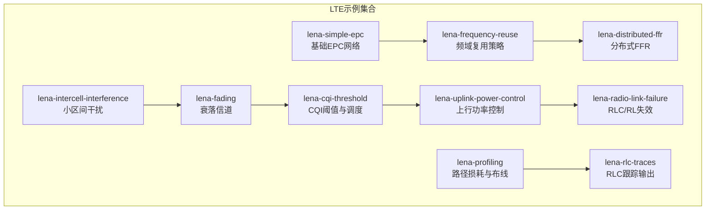
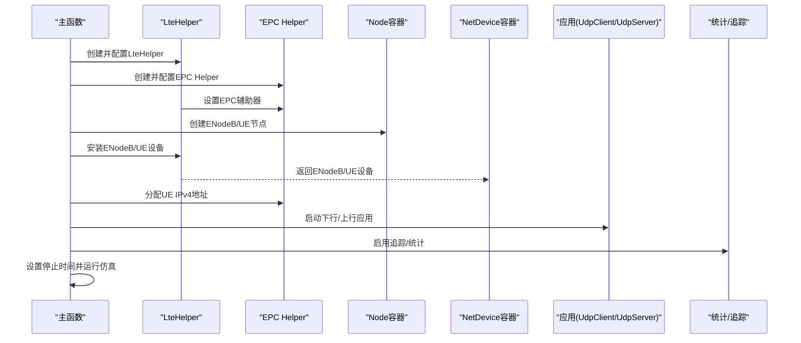
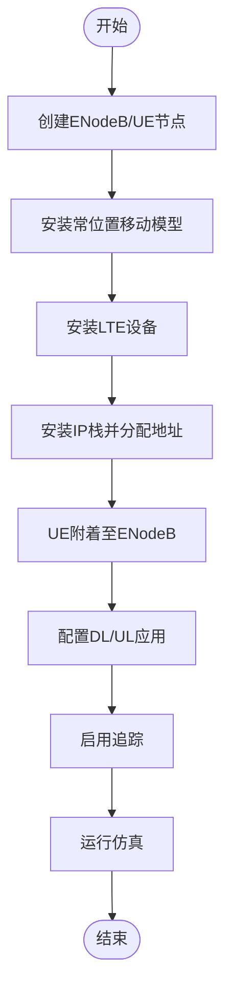
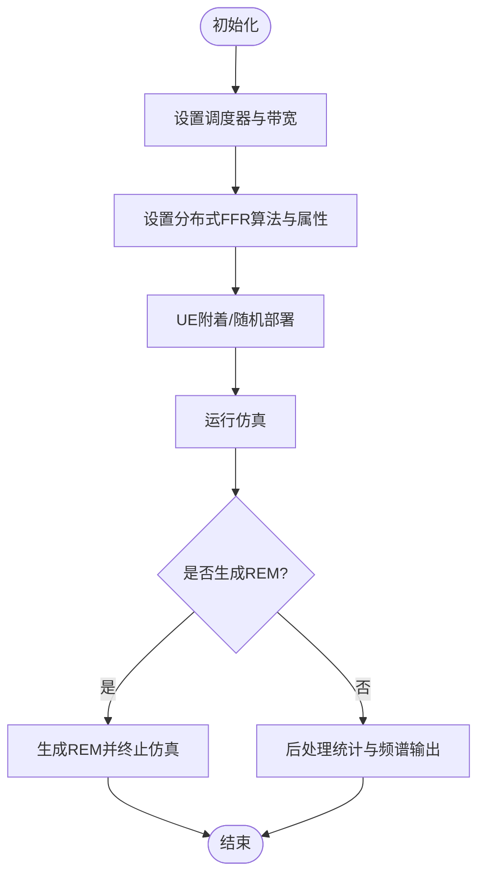
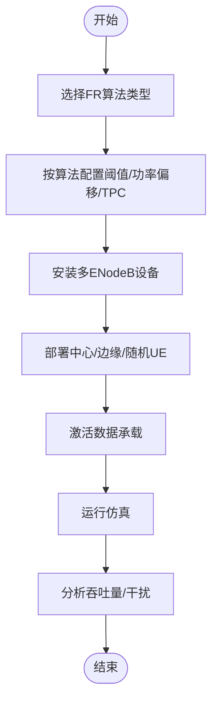
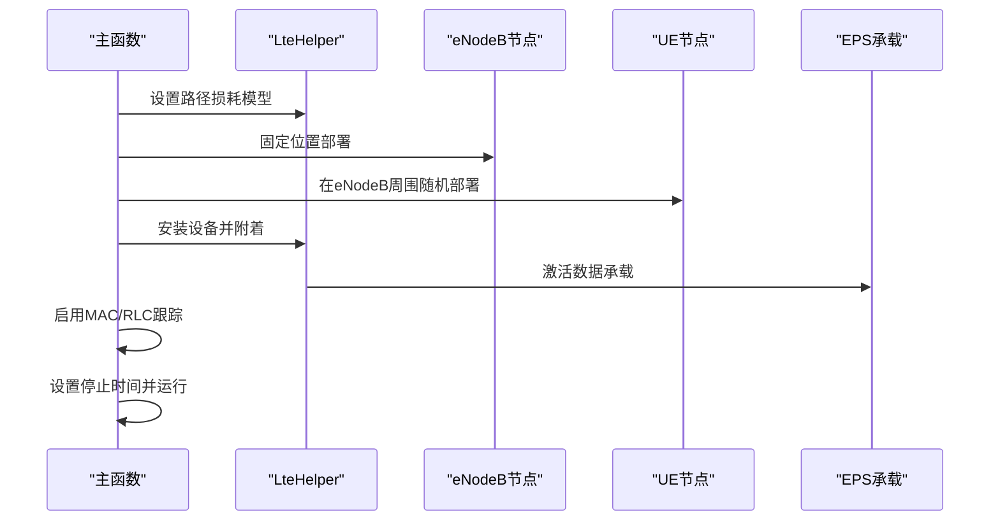
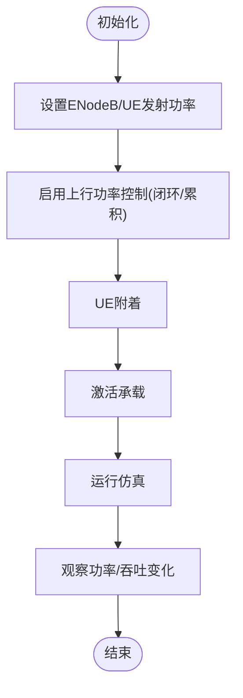
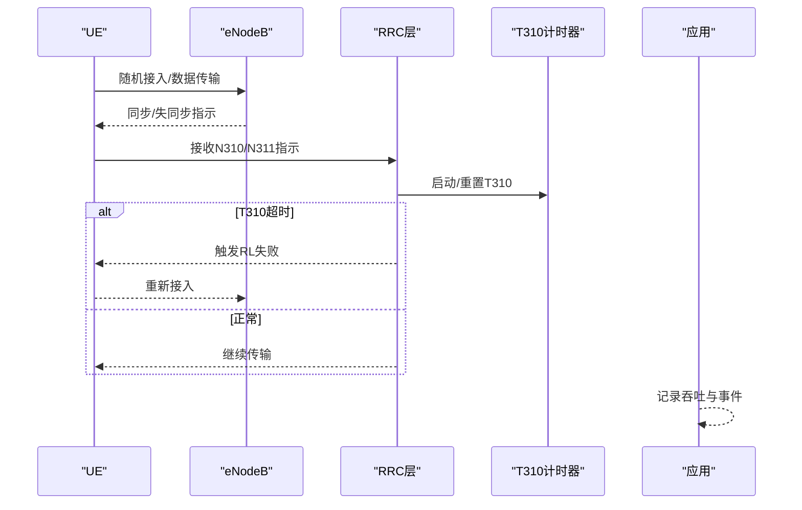
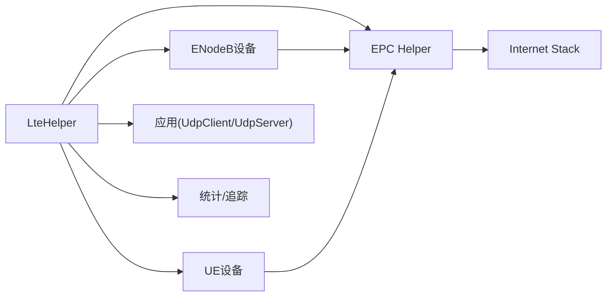

# 示例与教程

<cite>
**本文引用的文件**   
- [lena-simple-epc.cc](file://simulator/ns-3.39/src/lte/examples/lena-simple-epc.cc)
- [lena-distributed-ffr.cc](file://simulator/ns-3.39/src/lte/examples/lena-distributed-ffr.cc)
- [lena-frequency-reuse.cc](file://simulator/ns-3.39/src/lte/examples/lena-frequency-reuse.cc)
- [lena-intercell-interference.cc](file://simulator/ns-3.39/src/lte/examples/lena-intercell-interference.cc)
- [lena-uplink-power-control.cc](file://simulator/ns-3.39/src/lte/examples/lena-uplink-power-control.cc)
- [lena-cqi-threshold.cc](file://simulator/ns-3.39/src/lte/examples/lena-cqi-threshold.cc)
- [lena-fading.cc](file://simulator/ns-3.39/src/lte/examples/lena-fading.cc)
- [lena-profiling.cc](file://simulator/ns-3.39/src/lte/examples/lena-profiling.cc)
- [lena-radio-link-failure.cc](file://simulator/ns-3.39/src/lte/examples/lena-radio-link-failure.cc)
- [lena-rlc-traces.cc](file://simulator/ns-3.39/src/lte/examples/lena-rlc-traces.cc)
</cite>

## 目录
1. [简介](#简介)
2. [项目结构](#项目结构)
3. [核心组件](#核心组件)
4. [架构总览](#架构总览)
5. [详细组件分析](#详细组件分析)
6. [依赖关系分析](#依赖关系分析)
7. [性能考量](#性能考量)
8. [故障排查指南](#故障排查指南)
9. [结论](#结论)
10. [附录](#附录)

## 简介
本教程面向希望系统掌握NS-3 LTE模块示例与仿真实践的读者，围绕基础Lena简单网络、分布式频率复用（FFR）、干扰管理、功率控制等典型场景，提供从入门到进阶的学习路径。内容覆盖网络拓扑设计、参数配置、仿真设置、结果分析方法，并给出可直接运行的命令与建议，帮助完成LTE网络性能测试、容量规划与干扰分析的实际应用。

## 项目结构
LTE示例位于NS-3源码树的lte/examples目录下，每个示例独立成章，聚焦特定功能或算法验证。主要示例包括：
- 基础网络：lena-simple-epc
- 频率复用策略：lena-frequency-reuse、lena-distributed-ffr
- 干扰与传播：lena-intercell-interference、lena-fading、lena-cqi-threshold
- 功率控制：lena-uplink-power-control
- 可靠性与链路失败：lena-radio-link-failure
- 路径损耗与性能剖析：lena-profiling、lena-rlc-traces

图表来源
- [lena-simple-epc.cc:32-212](file://simulator/ns-3.39/src/lte/examples/lena-simple-epc.cc#L32-L212)
- [lena-frequency-reuse.cc:94-403](file://simulator/ns-3.39/src/lte/examples/lena-frequency-reuse.cc#L94-L403)
- [lena-distributed-ffr.cc:98-405](file://simulator/ns-3.39/src/lte/examples/lena-distributed-ffr.cc#L98-L405)
- [lena-intercell-interference.cc:38-149](file://simulator/ns-3.39/src/lte/examples/lena-intercell-interference.cc#L38-L149)
- [lena-fading.cc:33-129](file://simulator/ns-3.39/src/lte/examples/lena-fading.cc#L33-L129)
- [lena-cqi-threshold.cc:55-130](file://simulator/ns-3.39/src/lte/examples/lena-cqi-threshold.cc#L55-L130)
- [lena-uplink-power-control.cc:34-104](file://simulator/ns-3.39/src/lte/examples/lena-uplink-power-control.cc#L34-L104)
- [lena-radio-link-failure.cc:354-656](file://simulator/ns-3.39/src/lte/examples/lena-radio-link-failure.cc#L354-L656)
- [lena-profiling.cc:34-203](file://simulator/ns-3.39/src/lte/examples/lena-profiling.cc#L34-L203)
- [lena-rlc-traces.cc:28-100](file://simulator/ns-3.39/src/lte/examples/lena-rlc-traces.cc#L28-L100)

章节来源
- [lena-simple-epc.cc:32-212](file://simulator/ns-3.39/src/lte/examples/lena-simple-epc.cc#L32-L212)
- [lena-distributed-ffr.cc:98-405](file://simulator/ns-3.39/src/lte/examples/lena-distributed-ffr.cc#L98-L405)
- [lena-frequency-reuse.cc:94-403](file://simulator/ns-3.39/src/lte/examples/lena-frequency-reuse.cc#L94-L403)
- [lena-intercell-interference.cc:38-149](file://simulator/ns-3.39/src/lte/examples/lena-intercell-interference.cc#L38-L149)
- [lena-uplink-power-control.cc:34-104](file://simulator/ns-3.39/src/lte/examples/lena-uplink-power-control.cc#L34-L104)
- [lena-cqi-threshold.cc:55-130](file://simulator/ns-3.39/src/lte/examples/lena-cqi-threshold.cc#L55-L130)
- [lena-fading.cc:33-129](file://simulator/ns-3.39/src/lte/examples/lena-fading.cc#L33-L129)
- [lena-radio-link-failure.cc:354-656](file://simulator/ns-3.39/src/lte/examples/lena-radio-link-failure.cc#L354-L656)
- [lena-profiling.cc:34-203](file://simulator/ns-3.39/src/lte/examples/lena-profiling.cc#L34-L203)
- [lena-rlc-traces.cc:28-100](file://simulator/ns-3.39/src/lte/examples/lena-rlc-traces.cc#L28-L100)

## 核心组件
- LteHelper：统一安装eNodeB/UE设备、配置EPC、调度器、频段、错误模型、功率控制等。
- EPC Helper：PointToPointEpcHelper用于构建PGW/SGW与外部主机的IP回传。
- Mobility模型：ConstantPositionMobilityModel/ConstantVelocityMobilityModel用于固定或移动场景。
- 应用层：UdpClient/UdpServer配合EPC TFT与EPS承载，生成下行/上行流量。
- 统计与跟踪：EnableTraces/EnableRlcTraces/EnableMacTraces等输出统计文件，便于后续分析。

章节来源
- [lena-simple-epc.cc:78-200](file://simulator/ns-3.39/src/lte/examples/lena-simple-epc.cc#L78-L200)
- [lena-uplink-power-control.cc:51-96](file://simulator/ns-3.39/src/lte/examples/lena-uplink-power-control.cc#L51-L96)
- [lena-rlc-traces.cc:41-98](file://simulator/ns-3.39/src/lte/examples/lena-rlc-traces.cc#L41-L98)

## 架构总览
下图展示典型Lena示例的端到端流程：节点创建与移动性布置 → 设备安装与EPC连接 → 承载激活与应用启动 → 追踪与统计输出。

图表来源
- [lena-simple-epc.cc:78-200](file://simulator/ns-3.39/src/lte/examples/lena-simple-epc.cc#L78-L200)
- [lena-radio-link-failure.cc:504-638](file://simulator/ns-3.39/src/lte/examples/lena-radio-link-failure.cc#L504-L638)

## 详细组件分析

### 基础Lena简单网络（EPC）
- 网络拓扑：单PGW/远程主机 + 多对一eNodeB-UE（可配置数量）。
- 关键步骤：创建节点与移动性；安装LTE设备；安装IP栈并分配UE地址；建立默认路由；逐对UE发起DL/UL流量；启用追踪。
- 参数要点：numNodePairs、simTime、distance、interPacketInterval、useCa（载波聚合）、禁用DL/UL/对等流量开关。
- 结果分析：通过统计文件评估吞吐量、时延、丢包；结合可视化工具观察队列与链路状态。

图表来源
- [lena-simple-epc.cc:108-200](file://simulator/ns-3.39/src/lte/examples/lena-simple-epc.cc#L108-L200)

章节来源
- [lena-simple-epc.cc:40-212](file://simulator/ns-3.39/src/lte/examples/lena-simple-epc.cc#L40-L212)

### 分布式频率复用（FFR）
- 场景目标：在三小区拓扑中使用分布式FFR算法，动态划分中心/边缘RB并调整功率偏移，降低小区间干扰。
- 关键配置：scheduler类型、带宽、FFR算法类型与属性（计算周期、阈值、边缘RB数、功率偏移、TPC）。
- 可视化：支持生成REM（射线环境地图）与频谱分析仪输出，辅助理解覆盖与干扰分布。
- 结果分析：对比不同算法下的吞吐量与干扰抑制效果，评估边缘用户性能提升。

图表来源
- [lena-distributed-ffr.cc:225-248](file://simulator/ns-3.39/src/lte/examples/lena-distributed-ffr.cc#L225-L248)
- [lena-distributed-ffr.cc:362-395](file://simulator/ns-3.39/src/lte/examples/lena-distributed-ffr.cc#L362-L395)

章节来源
- [lena-distributed-ffr.cc:98-405](file://simulator/ns-3.39/src/lte/examples/lena-distributed-ffr.cc#L98-L405)

### 频率复用策略（硬/软/增强型FFR）
- 场景目标：对比多种FR算法（硬/严格/软/软增强/无操作），评估不同区域功率偏移与TPC策略对吞吐量的影响。
- 关键配置：根据算法类型设置RSRQ阈值、功率偏移、允许中心UE使用边缘子带等；为某些算法强制绝对模式功率控制。
- 结果分析：比较中心/边缘UE速率差异，评估算法对系统容量与公平性的权衡。

图表来源
- [lena-frequency-reuse.cc:216-291](file://simulator/ns-3.39/src/lte/examples/lena-frequency-reuse.cc#L216-L291)
- [lena-frequency-reuse.cc:302-333](file://simulator/ns-3.39/src/lte/examples/lena-frequency-reuse.cc#L302-L333)

章节来源
- [lena-frequency-reuse.cc:94-403](file://simulator/ns-3.39/src/lte/examples/lena-frequency-reuse.cc#L94-L403)

### 小区间干扰与传播建模
- 场景目标：两eNodeB与围绕各自的UE圆盘分布，评估距离与半径对干扰与吞吐量的影响。
- 关键配置：路径损耗模型（如Friis）、UE随机分布在eNodeB周围、激活数据承载。
- 结果分析：通过MAC/RLC跟踪文件分析调度公平性、重传与延迟变化。

图表来源
- [lena-intercell-interference.cc:71-134](file://simulator/ns-3.39/src/lte/examples/lena-intercell-interference.cc#L71-L134)

章节来源
- [lena-intercell-interference.cc:38-149](file://simulator/ns-3.39/src/lte/examples/lena-intercell-interference.cc#L38-L149)

### 上行功率控制
- 场景目标：演示上行功率控制的开启方式、闭环/开环、累积模式与Alpha系数的作用。
- 关键配置：ENodeB/UE发射功率、是否启用上行功率控制、闭环/累积模式、Alpha。
- 结果分析：观察不同距离下UE发射功率变化与调度增益，评估功率控制对系统稳定性与容量的影响。

图表来源
- [lena-uplink-power-control.cc:37-96](file://simulator/ns-3.39/src/lte/examples/lena-uplink-power-control.cc#L37-L96)

章节来源
- [lena-uplink-power-control.cc:34-104](file://simulator/ns-3.39/src/lte/examples/lena-uplink-power-control.cc#L34-L104)

### CQI阈值与调度
- 场景目标：通过动态改变UE位置触发CQI变化，观察调度器对CQI定时器阈值的响应。
- 关键配置：调度器CqiTimerThreshold；在仿真过程中调度位置变更以降低CQI。
- 结果分析：分析MAC/RLC跟踪文件，评估调度公平性与吞吐波动。

章节来源
- [lena-cqi-threshold.cc:55-130](file://simulator/ns-3.39/src/lte/examples/lena-cqi-threshold.cc#L55-L130)

### 衰落信道与路径损耗
- 场景目标：加载预定义衰落轨迹，模拟移动场景下的信道快衰落。
- 关键配置：设置衰落模型与轨迹文件、采样长度/窗口大小/RB数等参数。
- 结果分析：结合频谱分析与统计输出，评估不同移动速度/轨迹对吞吐量与BER的影响。

章节来源
- [lena-fading.cc:33-129](file://simulator/ns-3.39/src/lte/examples/lena-fading.cc#L33-L129)

### 可靠性与链路失败（RLC/RL）
- 场景目标：通过UE离站导致同步丢失，验证N310/N311与T310计时器触发的RL失败检测机制。
- 关键配置：理想/真实RRC、控制/数据误码模型、路径损耗模型、功率参数、调度器与AMC。
- 结果分析：通过自定义回调打印状态转换、同步指示与吞吐曲线，定位链路失败触发点与恢复过程。

图表来源
- [lena-radio-link-failure.cc:409-446](file://simulator/ns-3.39/src/lte/examples/lena-radio-link-failure.cc#L409-L446)
- [lena-radio-link-failure.cc:607-638](file://simulator/ns-3.39/src/lte/examples/lena-radio-link-failure.cc#L607-L638)

章节来源
- [lena-radio-link-failure.cc:354-656](file://simulator/ns-3.39/src/lte/examples/lena-radio-link-failure.cc#L354-L656)

### 路径损耗与布线（建筑物）
- 场景目标：在无建筑与有建筑场景下部署ENodeB/UE，评估路径损耗模型对容量与覆盖的影响。
- 关键配置：路径损耗模型（Friis/HybridBuildings）、楼层/房间布局、UE随机分布。
- 结果分析：对比不同模型下的吞吐量与覆盖率，评估室内穿透损耗对系统性能的影响。

章节来源
- [lena-profiling.cc:63-176](file://simulator/ns-3.39/src/lte/examples/lena-profiling.cc#L63-L176)

### RLC跟踪输出
- 场景目标：启用PHY/MAC/RLC跟踪，观察不同距离下RLC层行为与队列变化。
- 关键配置：EnablePhyTraces/EnableMacTraces/EnableRlcTraces；设置UE位置向量。
- 结果分析：结合跟踪文件分析RLC重传、缓冲区占用与调度效率。

章节来源
- [lena-rlc-traces.cc:28-98](file://simulator/ns-3.39/src/lte/examples/lena-rlc-traces.cc#L28-L98)

## 依赖关系分析
- 组件耦合：LteHelper集中管理设备安装、EPC连接、调度器与算法配置；EPC Helper负责回传网络；应用层通过Internet Stack与EPC交互。
- 外部依赖：频谱跟踪依赖Spectrum模块；建筑物穿透依赖Buildings模块；衰落轨迹依赖外部文件。
- 可能的循环依赖：示例为单向调用，未见循环依赖风险。

图表来源
- [lena-simple-epc.cc:78-200](file://simulator/ns-3.39/src/lte/examples/lena-simple-epc.cc#L78-L200)
- [lena-radio-link-failure.cc:504-638](file://simulator/ns-3.39/src/lte/examples/lena-radio-link-failure.cc#L504-L638)

章节来源
- [lena-simple-epc.cc:78-200](file://simulator/ns-3.39/src/lte/examples/lena-simple-epc.cc#L78-L200)
- [lena-radio-link-failure.cc:504-638](file://simulator/ns-3.39/src/lte/examples/lena-radio-link-failure.cc#L504-L638)

## 性能考量
- 带宽与调度：合理设置DL/UL带宽与调度器（如PF），可显著影响系统容量与公平性。
- 功率控制：开启上行功率控制并选择合适模式（闭环/累积/绝对），有助于抑制干扰与提升边缘性能。
- 频率复用：在密集组网场景优先考虑分布式/软/增强型FFR，平衡中心与边缘用户性能。
- 传播模型：在室内场景采用混合路径损耗模型，更贴近实测；室外场景可用Friis或更复杂模型。
- 负载与队列：通过RLC/MAC跟踪监控缓冲区占用与重传，避免拥塞引发的吞吐下降。

## 故障排查指南
- 无法附着/连接失败：检查路径损耗模型、功率参数、RRC是否理想化；确认默认路由与EPC地址分配正确。
- 吞吐偏低：核查带宽设置、调度器参数、是否存在过多干扰；评估功率控制与CQI阈值配置。
- 链路失败频繁：关注N310/N311与T310配置，结合位置移动速度与衰落轨迹进行调整。
- 统计缺失：确保已启用对应追踪接口（如EnableTraces/EnableRlcTraces），并检查输出文件命名与路径。

章节来源
- [lena-radio-link-failure.cc:409-446](file://simulator/ns-3.39/src/lte/examples/lena-radio-link-failure.cc#L409-L446)
- [lena-rlc-traces.cc:76-98](file://simulator/ns-3.39/src/lte/examples/lena-rlc-traces.cc#L76-L98)

## 结论
通过上述示例，读者可以系统掌握NS-3 LTE模块的核心能力：从基础EPC网络到高级的频率复用、干扰管理与功率控制。建议按照“基础网络 → 干扰与传播 → 功率控制 → 高级算法 → 可靠性与链路失败 → 性能剖析”的顺序逐步深入，结合跟踪输出与可视化工具完成性能优化与容量规划实践。

## 附录
- 运行命令示例（以基础网络为例）：
  - 基础运行：./ns3 run src/lte/examples/lena-simple-epc
  - 自定义参数：./ns3 run src/lte/examples/lena-simple-epc --numNodePairs=4 --simTime=2s
- 常用参数说明（节选）：
  - numNodePairs：eNodeB与UE对数
  - simTime：仿真总时长
  - distance：eNodeB间距（米）
  - interPacketInterval：应用报文间隔（毫秒）
  - useCa：是否启用载波聚合
  - disableDl/disableUl/disablePl：禁用下行/上行/UE对等流量
- 输出文件：
  - 追踪文件（如RLC/MAC/PDPC统计）与频谱分析输出，用于后续GNUPLOT/Python绘图分析。

章节来源
- [lena-simple-epc.cc:52-68](file://simulator/ns-3.39/src/lte/examples/lena-simple-epc.cc#L52-L68)
- [lena-distributed-ffr.cc:121-136](file://simulator/ns-3.39/src/lte/examples/lena-distributed-ffr.cc#L121-L136)
- [lena-frequency-reuse.cc:117-132](file://simulator/ns-3.39/src/lte/examples/lena-frequency-reuse.cc#L117-L132)