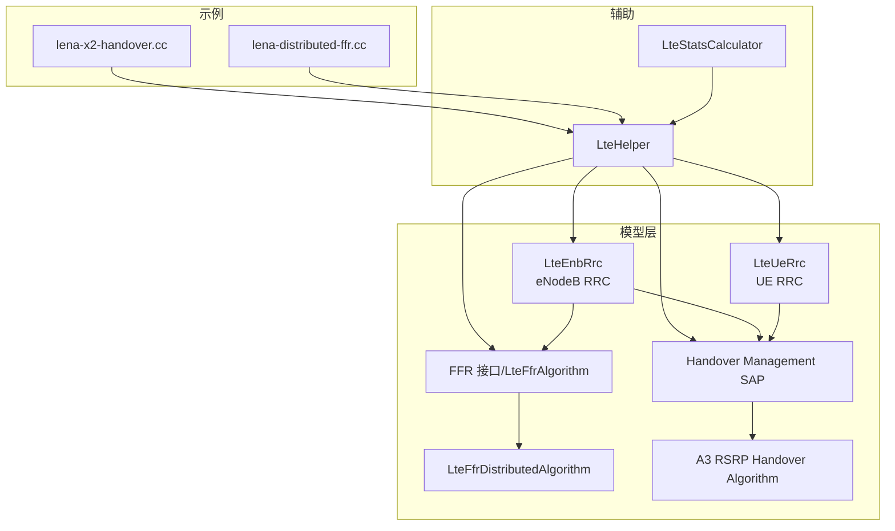
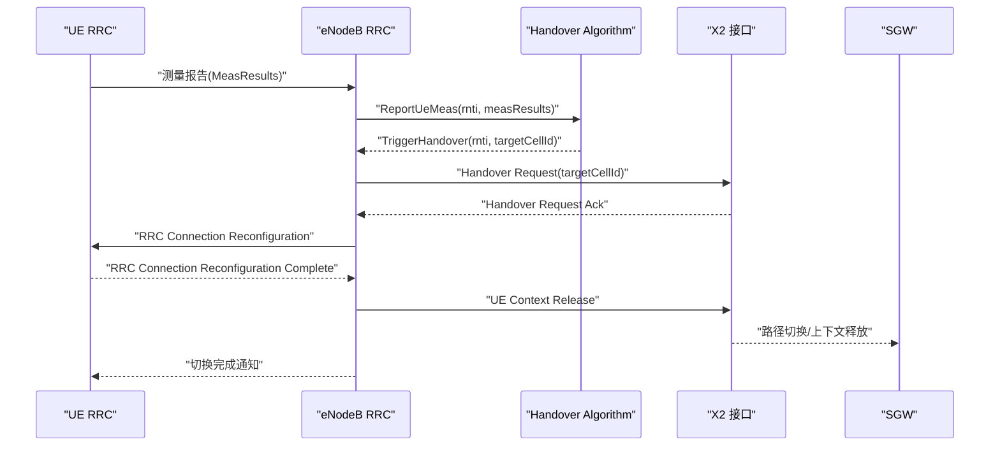
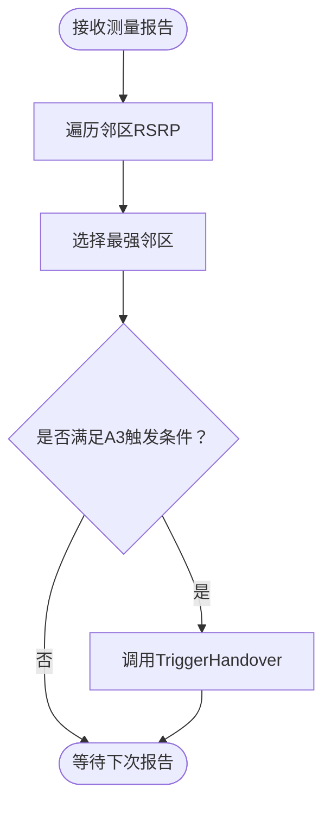
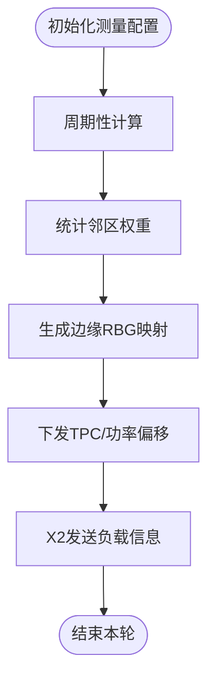
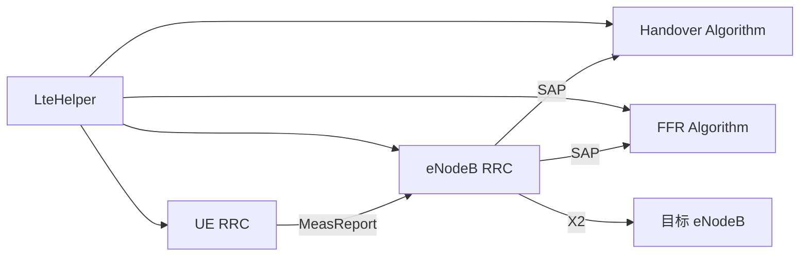

# 移动性管理

<cite>
**本文引用的文件**
- [lte-enb-rrc.h](file://simulator/ns-3.39/src/lte/model/lte-enb-rrc.h)
- [lte-ue-rrc.h](file://simulator/ns-3.39/src/lte/model/lte-ue-rrc.h)
- [lte-handover-management-sap.h](file://simulator/ns-3.39/src/lte/model/lte-handover-management-sap.h)
- [lte-ffr-algorithm.h](file://simulator/ns-3.39/src/lte/model/lte-ffr-algorithm.h)
- [lte-ffr-distributed-algorithm.cc](file://simulator/ns-3.39/src/lte/model/lte-ffr-distributed-algorithm.cc)
- [a3-rsrp-handover-algorithm.cc](file://simulator/ns-3.39/src/lte/model/a3-rsrp-handover-algorithm.cc)
- [lte-helper.h](file://simulator/ns-3.39/src/lte/helper/lte-helper.h)
- [lena-x2-handover.cc](file://simulator/ns-3.39/src/lte/examples/lena-x2-handover.cc)
- [lena-distributed-ffr.cc](file://simulator/ns-3.39/src/lte/examples/lena-distributed-ffr.cc)
- [lte-stats-calculator.h](file://simulator/ns-3.39/src/lte/helper/lte-stats-calculator.h)
</cite>

## 目录
1. [简介](#简介)
2. [项目结构](#项目结构)
3. [核心组件](#核心组件)
4. [架构总览](#架构总览)
5. [详细组件分析](#详细组件分析)
6. [依赖关系分析](#依赖关系分析)
7. [性能考量](#性能考量)
8. [故障排查指南](#故障排查指南)
9. [结论](#结论)
10. [附录](#附录)

## 简介
本文件系统化梳理NS-3 LTE模块中的移动性管理能力，覆盖切换算法（含事件触发、决策与执行）、频率复用（FFR）策略、小区选择与重选、负载均衡、统计与性能评估、切换失败分析、参数配置与调优以及实际场景应用示例。目标是帮助读者在仿真环境中快速理解并高效使用NS-3的LTE移动性子系统。

## 项目结构
LTE移动性相关代码主要分布在以下目录与文件中：
- 模型层：eNodeB/UE RRC、切换管理SAP、FFR算法接口与实现、示例脚本等
- 辅助工具：LteHelper用于统一创建与配置、统计计算器用于性能输出
- 示例：X2切换演示、分布式FFR演示

图表来源
- [lte-enb-rrc.h:654-800](file://simulator/ns-3.39/src/lte/model/lte-enb-rrc.h#L654-L800)
- [lte-ue-rrc.h:76-114](file://simulator/ns-3.39/src/lte/model/lte-ue-rrc.h#L76-L114)
- [lte-handover-management-sap.h:37-103](file://simulator/ns-3.39/src/lte/model/lte-handover-management-sap.h#L37-L103)
- [lte-ffr-algorithm.h:59-139](file://simulator/ns-3.39/src/lte/model/lte-ffr-algorithm.h#L59-L139)
- [lte-ffr-distributed-algorithm.cc:32-115](file://simulator/ns-3.39/src/lte/model/lte-ffr-distributed-algorithm.cc#L32-L115)
- [a3-rsrp-handover-algorithm.cc:38-76](file://simulator/ns-3.39/src/lte/model/a3-rsrp-handover-algorithm.cc#L38-L76)
- [lte-helper.h:102-139](file://simulator/ns-3.39/src/lte/helper/lte-helper.h#L102-L139)
- [lena-x2-handover.cc:156-202](file://simulator/ns-3.39/src/lte/examples/lena-x2-handover.cc#L156-L202)
- [lena-distributed-ffr.cc:98-144](file://simulator/ns-3.39/src/lte/examples/lena-distributed-ffr.cc#L98-L144)
- [lte-stats-calculator.h:39-82](file://simulator/ns-3.39/src/lte/helper/lte-stats-calculator.h#L39-L82)

章节来源
- [lte-enb-rrc.h:654-800](file://simulator/ns-3.39/src/lte/model/lte-enb-rrc.h#L654-L800)
- [lte-ue-rrc.h:76-114](file://simulator/ns-3.39/src/lte/model/lte-ue-rrc.h#L76-L114)
- [lte-handover-management-sap.h:37-103](file://simulator/ns-3.39/src/lte/model/lte-handover-management-sap.h#L37-L103)
- [lte-ffr-algorithm.h:59-139](file://simulator/ns-3.39/src/lte/model/lte-ffr-algorithm.h#L59-L139)
- [lte-ffr-distributed-algorithm.cc:32-115](file://simulator/ns-3.39/src/lte/model/lte-ffr-distributed-algorithm.cc#L32-L115)
- [a3-rsrp-handover-algorithm.cc:38-76](file://simulator/ns-3.39/src/lte/model/a3-rsrp-handover-algorithm.cc#L38-L76)
- [lte-helper.h:102-139](file://simulator/ns-3.39/src/lte/helper/lte-helper.h#L102-L139)
- [lena-x2-handover.cc:156-202](file://simulator/ns-3.39/src/lte/examples/lena-x2-handover.cc#L156-L202)
- [lena-distributed-ffr.cc:98-144](file://simulator/ns-3.39/src/lte/examples/lena-distributed-ffr.cc#L98-L144)
- [lte-stats-calculator.h:39-82](file://simulator/ns-3.39/src/lte/helper/lte-stats-calculator.h#L39-L82)

## 核心组件
- eNodeB RRC（LteEnbRrc）
  - 负责UE上下文管理、测量报告处理、RRC连接建立/重配置、X2接口交互、与调度器/FFR/ANR/手算的SAP对接
- UE RRC（LteUeRrc）
  - 负责初始小区选择、测量配置与上报、连接建立/重配置、状态机转换
- 切换管理SAP
  - 定义eNodeB RRC与手算之间的接口：测量上报接收、触发切换请求
- 手算实现（A3 RSRP）
  - 基于邻区RSRP比较与迟滞、TTT触发条件进行切换决策
- FFR算法接口与实现（分布式FFR）
  - 提供RBG可用性查询、TPC分配、边缘/中心区域划分与负载信息交换
- LteHelper
  - 统一创建eNodeB/UE设备、设置调度器/FFR/手算类型、添加X2接口、手动触发切换
- 示例脚本
  - X2切换演示、分布式FFR演示，展示参数配置与事件触发

章节来源
- [lte-enb-rrc.h:654-800](file://simulator/ns-3.39/src/lte/model/lte-enb-rrc.h#L654-L800)
- [lte-ue-rrc.h:76-114](file://simulator/ns-3.39/src/lte/model/lte-ue-rrc.h#L76-L114)
- [lte-handover-management-sap.h:37-103](file://simulator/ns-3.39/src/lte/model/lte-handover-management-sap.h#L37-L103)
- [a3-rsrp-handover-algorithm.cc:38-76](file://simulator/ns-3.39/src/lte/model/a3-rsrp-handover-algorithm.cc#L38-L76)
- [lte-ffr-algorithm.h:59-139](file://simulator/ns-3.39/src/lte/model/lte-ffr-algorithm.h#L59-L139)
- [lte-ffr-distributed-algorithm.cc:32-115](file://simulator/ns-3.39/src/lte/model/lte-ffr-distributed-algorithm.cc#L32-L115)
- [lte-helper.h:102-139](file://simulator/ns-3.39/src/lte/helper/lte-helper.h#L102-L139)

## 架构总览
下图展示了移动性相关的关键交互路径：UE侧测量与上报、eNodeB RRC接收与转发、手算决策、X2接口协调与执行。

图表来源
- [lte-handover-management-sap.h:37-103](file://simulator/ns-3.39/src/lte/model/lte-handover-management-sap.h#L37-L103)
- [lte-enb-rrc.h:184-242](file://simulator/ns-3.39/src/lte/model/lte-enb-rrc.h#L184-L242)
- [lena-x2-handover.cc:344-348](file://simulator/ns-3.39/src/lte/examples/lena-x2-handover.cc#L344-L348)

## 详细组件分析

### 切换算法：A3 RSRP
- 事件触发
  - 配置A3事件，包含迟滞（Hysteresis）与时间到达（TimeToTrigger），用于避免乒乓切换
- 决策过程
  - 手算从测量报告中选取最强邻区作为候选目标
- 执行流程
  - 通过Handover Management SAP向eNodeB RRC触发切换

图表来源
- [a3-rsrp-handover-algorithm.cc:123-173](file://simulator/ns-3.39/src/lte/model/a3-rsrp-handover-algorithm.cc#L123-L173)

章节来源
- [a3-rsrp-handover-algorithm.cc:38-76](file://simulator/ns-3.39/src/lte/model/a3-rsrp-handover-algorithm.cc#L38-L76)
- [a3-rsrp-handover-algorithm.cc:93-113](file://simulator/ns-3.39/src/lte/model/a3-rsrp-handover-algorithm.cc#L93-L113)
- [a3-rsrp-handover-algorithm.cc:123-173](file://simulator/ns-3.39/src/lte/model/a3-rsrp-handover-algorithm.cc#L123-L173)

### 频率复用：分布式FFR
- 功能概述
  - 基于RSRP差阈值与邻区权重计算，动态确定边缘RBG集合；为边缘/中心UE设置不同PDSCH功率偏移与TPC
- 关键流程
  - 初始化时注册A1/A4测量配置
  - 周期性计算邻区权重与RBG占用映射
  - 通过X2发送相对窄带发射带（RNTP）信息，实现跨小区负载均衡

图表来源
- [lte-ffr-distributed-algorithm.cc:146-180](file://simulator/ns-3.39/src/lte/model/lte-ffr-distributed-algorithm.cc#L146-L180)
- [lte-ffr-distributed-algorithm.cc:487-634](file://simulator/ns-3.39/src/lte/model/lte-ffr-distributed-algorithm.cc#L487-L634)
- [lte-ffr-distributed-algorithm.cc:665-688](file://simulator/ns-3.39/src/lte/model/lte-ffr-distributed-algorithm.cc#L665-L688)

章节来源
- [lte-ffr-algorithm.h:59-139](file://simulator/ns-3.39/src/lte/model/lte-ffr-algorithm.h#L59-L139)
- [lte-ffr-distributed-algorithm.cc:32-115](file://simulator/ns-3.39/src/lte/model/lte-ffr-distributed-algorithm.cc#L32-L115)
- [lte-ffr-distributed-algorithm.cc:146-180](file://simulator/ns-3.39/src/lte/model/lte-ffr-distributed-algorithm.cc#L146-L180)
- [lte-ffr-distributed-algorithm.cc:487-634](file://simulator/ns-3.39/src/lte/model/lte-ffr-distributed-algorithm.cc#L487-L634)
- [lte-ffr-distributed-algorithm.cc:665-688](file://simulator/ns-3.39/src/lte/model/lte-ffr-distributed-algorithm.cc#L665-L688)

### 小区选择与重选
- UE侧流程要点
  - 初始搜索MIB/SIB1，基于RSRP/RSRQ评估候选小区，完成驻留
  - 支持测量配置、过滤与报告触发机制
- 参数与行为
  - 可配置测量对象、报告配置、量纲映射等

章节来源
- [lte-ue-rrc.h:548-755](file://simulator/ns-3.39/src/lte/model/lte-ue-rrc.h#L548-L755)

### 位置管理、漫游与QoS保障
- 位置管理
  - 通过X2接口在源/目标eNodeB之间传递上下文，支持路径切换与上下文迁移
- 漫游处理
  - 在EPC模式下，通过SGW/PGW与MME协作，维持EPS承载与路由不变
- QoS保障
  - E-RAB/DRB生命周期由RRC/MME控制，配合调度器与RLC/PDCP保证业务质量

章节来源
- [lte-enb-rrc.h:184-242](file://simulator/ns-3.39/src/lte/model/lte-enb-rrc.h#L184-L242)
- [lena-x2-handover.cc:344-348](file://simulator/ns-3.39/src/lte/examples/lena-x2-handover.cc#L344-L348)

### 移动性统计与性能评估
- 统计接口
  - LteStatsCalculator提供IMSId/CellId路径解析、输出文件名管理
- 使用方式
  - 通过LteHelper启用PHY/MAC/RLC/PDCP跟踪，并设置统计周期

章节来源
- [lte-stats-calculator.h:39-82](file://simulator/ns-3.39/src/lte/helper/lte-stats-calculator.h#L39-L82)
- [lte-helper.h:579-651](file://simulator/ns-3.39/src/lte/helper/lte-helper.h#L579-L651)

## 依赖关系分析
- 组件耦合
  - eNodeB RRC与手算通过Handover Management SAP解耦；与FFR通过LteFfrSap/LteFfrRrcSap解耦
  - UE RRC与eNodeB RRC通过RRC协议栈交互，测量配置与报告经由SAP传递
- 外部集成
  - LteHelper负责统一装配调度器、FFR、手算、X2与EPC组件

图表来源
- [lte-handover-management-sap.h:37-103](file://simulator/ns-3.39/src/lte/model/lte-handover-management-sap.h#L37-L103)
- [lte-ffr-algorithm.h:77-99](file://simulator/ns-3.39/src/lte/model/lte-ffr-algorithm.h#L77-L99)
- [lte-helper.h:102-139](file://simulator/ns-3.39/src/lte/helper/lte-helper.h#L102-L139)

章节来源
- [lte-handover-management-sap.h:37-103](file://simulator/ns-3.39/src/lte/model/lte-handover-management-sap.h#L37-L103)
- [lte-ffr-algorithm.h:77-99](file://simulator/ns-3.39/src/lte/model/lte-ffr-algorithm.h#L77-L99)
- [lte-helper.h:102-139](file://simulator/ns-3.39/src/lte/helper/lte-helper.h#L102-L139)

## 性能考量
- 切换鲁棒性
  - 合理设置迟滞与TTT，避免频繁切换；优先选择信号更强且稳定的邻区
- FFR效果
  - 通过边缘RBG与TPC差异化，降低小区间干扰；结合负载信息实现跨小区协同
- 统计粒度
  - 缩短统计周期以提升可观测性，但需平衡开销

## 故障排查指南
- 切换失败常见原因
  - 随机接入前导失败、接入竞争超时、源侧离开超时、目标侧加入超时
- 触发与定位
  - 通过示例脚本中的回调函数捕获HandoverFailure事件，结合PHY/MAC/RLC/PDCP跟踪定位问题

章节来源
- [lena-x2-handover.cc:136-149](file://simulator/ns-3.39/src/lte/examples/lena-x2-handover.cc#L136-L149)
- [lena-x2-handover.cc:376-384](file://simulator/ns-3.39/src/lte/examples/lena-x2-handover.cc#L376-L384)

## 结论
NS-3的LTE移动性子系统提供了完整的切换与频率复用框架：以SAP解耦的eNodeB RRC为核心，配合可插拔的手算与FFR算法，辅以LteHelper统一装配与示例脚本演示，能够有效支撑移动性相关的研究与工程验证。通过合理的参数配置与统计分析，可在仿真中准确评估移动性策略对系统性能的影响。

## 附录

### 参数配置与调优示例（路径引用）
- 设置调度器类型与属性
  - [lte-helper.h:148-170](file://simulator/ns-3.39/src/lte/helper/lte-helper.h#L148-L170)
- 设置FFR算法类型与属性
  - [lte-helper.h:172-195](file://simulator/ns-3.39/src/lte/helper/lte-helper.h#L172-L195)
  - 分布式FFR关键属性（示例脚本）
    - [lena-distributed-ffr.cc:231-245](file://simulator/ns-3.39/src/lte/examples/lena-distributed-ffr.cc#L231-L245)
- 设置手算类型与属性
  - [lte-helper.h:197-220](file://simulator/ns-3.39/src/lte/helper/lte-helper.h#L197-L220)
  - A3 RSRP迟滞与TTT
    - [a3-rsrp-handover-algorithm.cc:59-74](file://simulator/ns-3.39/src/lte/model/a3-rsrp-handover-algorithm.cc#L59-L74)
- 添加X2接口与手动触发切换
  - [lte-helper.h:485-515](file://simulator/ns-3.39/src/lte/helper/lte-helper.h#L485-L515)
  - 示例脚本
    - [lena-x2-handover.cc:341-348](file://simulator/ns-3.39/src/lte/examples/lena-x2-handover.cc#L341-L348)

### 实际场景应用示例（路径引用）
- X2切换演示
  - [lena-x2-handover.cc:156-202](file://simulator/ns-3.39/src/lte/examples/lena-x2-handover.cc#L156-L202)
- 分布式FFR演示
  - [lena-distributed-ffr.cc:98-144](file://simulator/ns-3.39/src/lte/examples/lena-distributed-ffr.cc#L98-L144)