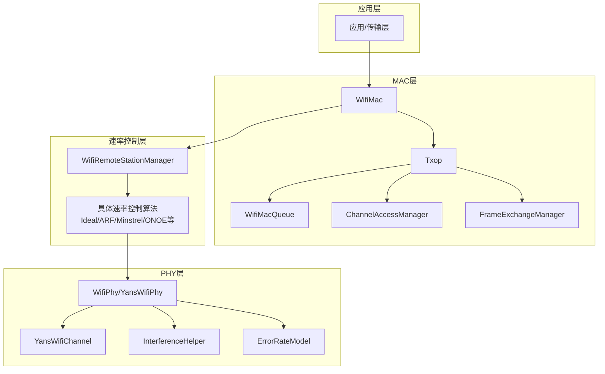
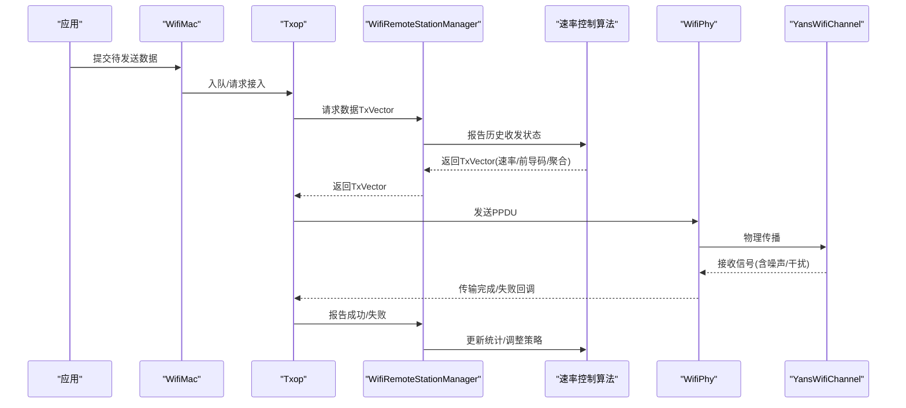
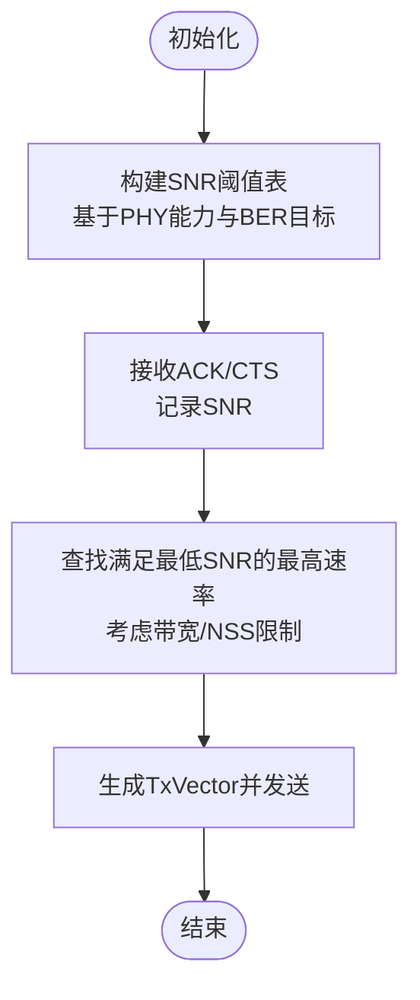
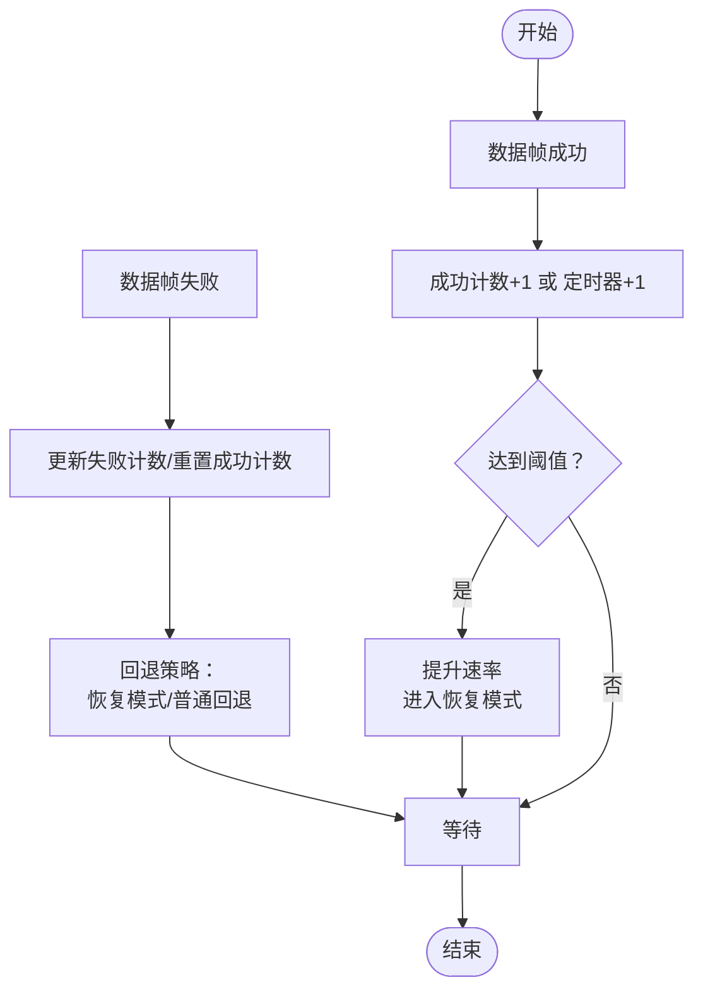
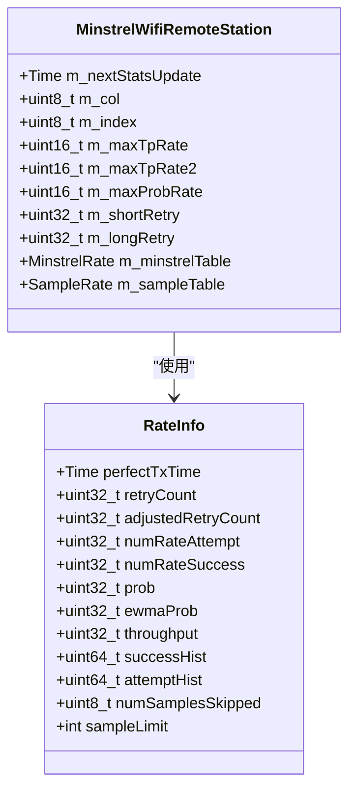
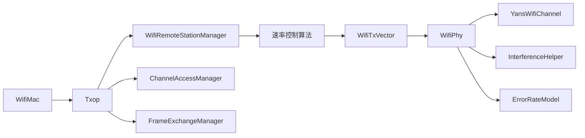

# WiFi介质访问协议

<cite>
**本文引用的文件**
- [ideal-wifi-manager.h](file://simulator/ns-3.39/src/wifi/model/rate-control/ideal-wifi-manager.h)
- [ideal-wifi-manager.cc](file://simulator/ns-3.39/src/wifi/model/rate-control/ideal-wifi-manager.cc)
- [arf-wifi-manager.h](file://simulator/ns-3.39/src/wifi/model/rate-control/arf-wifi-manager.h)
- [arf-wifi-manager.cc](file://simulator/ns-3.39/src/wifi/model/rate-control/arf-wifi-manager.cc)
- [minstrel-wifi-manager.h](file://simulator/ns-3.39/src/wifi/model/rate-control/minstrel-wifi-manager.h)
- [minstrel-wifi-manager.cc](file://simulator/ns-3.39/src/wifi/model/rate-control/minstrel-wifi-manager.cc)
- [onoe-wifi-manager.h](file://simulator/ns-3.39/src/wifi/model/rate-control/onoe-wifi-manager.h)
- [wifi-mac.h](file://simulator/ns-3.39/src/wifi/model/wifi-mac.h)
- [txop.h](file://simulator/ns-3.39/src/wifi/model/txop.h)
- [wifi-remote-station-manager.h](file://simulator/ns-3.39/src/wifi/model/wifi-remote-station-manager.h)
- [wifi-phy.h](file://simulator/ns-3.39/src/wifi/model/wifi-phy.h)
- [yans-wifi-phy.h](file://simulator/ns-3.39/src/wifi/model/yans-wifi-phy.h)
- [wifi-mode.h](file://simulator/ns-3.39/src/wifi/model/wifi-mode.h)
- [wifi-tx-vector.h](file://simulator/ns-3.39/src/wifi/model/wifi-tx-vector.h)
- [wifi-tx-timer.h](file://simulator/ns-3.39/src/wifi/model/wifi-tx-timer.h)
- [wifi-tx-current-model.h](file://simulator/ns-3.39/src/wifi/model/wifi-tx-current-model.h)
- [wifi-spectrum-phy-interface.h](file://simulator/ns-3.39/src/wifi/model/wifi-spectrum-phy-interface.h)
- [wifi-spectrum-signal-parameters.h](file://simulator/ns-3.39/src/wifi/model/wifi-spectrum-signal-parameters.h)
- [interference-helper.h](file://simulator/ns-3.39/src/wifi/model/interference-helper.h)
- [error-rate-model.h](file://simulator/ns-3.39/src/wifi/model/error-rate-model.h)
- [nist-error-rate-model.h](file://simulator/ns-3.39/src/wifi/model/nist-error-rate-model.h)
- [table-based-error-rate-model.h](file://simulator/ns-3.39/src/wifi/model/table-based-error-rate-model.h)
- [yans-error-rate-model.h](file://simulator/ns-3.39/src/wifi/model/yans-error-rate-model.h)
- [wifi-ack-manager.h](file://simulator/ns-3.39/src/wifi/model/wifi-ack-manager.h)
- [wifi-default-ack-manager.h](file://simulator/ns-3.39/src/wifi/model/wifi-default-ack-manager.h)
- [block-ack-manager.h](file://simulator/ns-3.39/src/wifi/model/block-ack-manager.h)
- [block-ack-window.h](file://simulator/ns-3.39/src/wifi/model/block-ack-window.h)
- [channel-access-manager.h](file://simulator/ns-3.39/src/wifi/model/channel-access-manager.h)
- [frame-exchange-manager.h](file://simulator/ns-3.39/src/wifi/model/frame-exchange-manager.h)
- [wifi-ppdu.h](file://simulator/ns-3.39/src/wifi/model/wifi-ppdu.h)
- [wifi-psdu.h](file://simulator/ns-3.39/src/wifi/model/wifi-psdu.h)
- [wifi-mpdu.h](file://simulator/ns-3.39/src/wifi/model/wifi-mpdu.h)
- [wifi-mac-queue.h](file://simulator/ns-3.39/src/wifi/model/wifi-mac-queue.h)
- [wifi-mac-queue-scheduler.h](file://simulator/ns-3.39/src/wifi/model/wifi-mac-queue-scheduler.h)
- [wifi-mac-queue-elem.h](file://simulator/ns-3.39/src/wifi/model/wifi-mac-queue-elem.h)
- [wifi-mac-queue-container.h](file://simulator/ns-3.39/src/wifi/model/wifi-mac-queue-container.h)
- [wifi-mac-header.h](file://simulator/ns-3.39/src/wifi/model/wifi-mac-header.h)
- [wifi-mac-trailer.h](file://simulator/ns-3.39/src/wifi/model/wifi-mac-trailer.h)
- [ctrl-headers.h](file://simulator/ns-3.39/src/wifi/model/ctrl-headers.h)
- [mgt-headers.h](file://simulator/ns-3.39/src/wifi/model/mgt-headers.h)
- [supported-rates.h](file://simulator/ns-3.39/src/wifi/model/supported-rates.h)
- [ssid.h](file://simulator/ns-3.39/src/wifi/model/ssid.h)
- [wifi-standards.h](file://simulator/ns-3.39/src/wifi/model/wifi-standards.h)
- [wifi-phy-common.h](file://simulator/ns-3.39/src/wifi/model/wifi-phy-common.h)
- [wifi-phy-state.h](file://simulator/ns-3.39/src/wifi/model/wifi-phy-state.h)
- [wifi-phy-state-helper.h](file://simulator/ns-3.39/src/wifi/model/wifi-phy-state-helper.h)
- [wifi-protection-manager.h](file://simulator/ns-3.39/src/wifi/model/wifi-protection-manager.h)
- [wifi-default-protection-manager.h](file://simulator/ns-3.39/src/wifi/model/wifi-default-protection-manager.h)
- [wifi-assoc-manager.h](file://simulator/ns-3.39/src/wifi/model/wifi-assoc-manager.h)
- [wifi-default-assoc-manager.h](file://simulator/ns-3.39/src/wifi/model/wifi-default-assoc-manager.h)
- [wifi-remote-station-info.h](file://simulator/ns-3.39/src/wifi/model/wifi-remote-station-info.h)
- [wifi-tx-parameters.h](file://simulator/ns-3.39/src/wifi/model/wifi-tx-parameters.h)
- [wifi-bandwidth-filter.h](file://simulator/ns-3.39/src/wifi/model/wifi-bandwidth-filter.h)
- [wifi-snr-tag.h](file://simulator/ns-3.39/src/wifi/model/snr-tag.h)
- [wifi-utils.h](file://simulator/ns-3.39/src/wifi/model/wifi-utils.h)
- [wifi-net-device.h](file://simulator/ns-3.39/src/wifi/model/wifi-net-device.h)
- [wifi-mac.cc](file://simulator/ns-3.39/src/wifi/model/wifi-mac.cc)
- [txop.cc](file://simulator/ns-3.39/src/wifi/model/txop.cc)
- [wifi-remote-station-manager.cc](file://simulator/ns-3.39/src/wifi/model/wifi-remote-station-manager.cc)
- [wifi-phy.cc](file://simulator/ns-3.39/src/wifi/model/wifi-phy.cc)
- [yans-wifi-phy.cc](file://simulator/ns-3.39/src/wifi/model/yans-wifi-phy.cc)
- [wifi-mode.cc](file://simulator/ns-3.39/src/wifi/model/wifi-mode.cc)
- [wifi-tx-vector.cc](file://simulator/ns-3.39/src/wifi/model/wifi-tx-vector.cc)
- [wifi-tx-timer.cc](file://simulator/ns-3.39/src/wifi/model/wifi-tx-timer.cc)
- [wifi-tx-current-model.cc](file://simulator/ns-3.39/src/wifi/model/wifi-tx-current-model.cc)
- [wifi-spectrum-phy-interface.cc](file://simulator/ns-3.39/src/wifi/model/wifi-spectrum-phy-interface.cc)
- [wifi-spectrum-signal-parameters.cc](file://simulator/ns-3.39/src/wifi/model/wifi-spectrum-signal-parameters.cc)
- [interference-helper.cc](file://simulator/ns-3.39/src/wifi/model/interference-helper.cc)
- [error-rate-model.cc](file://simulator/ns-3.39/src/wifi/model/error-rate-model.cc)
- [nist-error-rate-model.cc](file://simulator/ns-3.39/src/wifi/model/nist-error-rate-model.cc)
- [table-based-error-rate-model.cc](file://simulator/ns-3.39/src/wifi/model/table-based-error-rate-model.cc)
- [yans-error-rate-model.cc](file://simulator/ns-3.39/src/wifi/model/yans-error-rate-model.cc)
- [wifi-ack-manager.cc](file://simulator/ns-3.39/src/wifi/model/wifi-ack-manager.cc)
- [wifi-default-ack-manager.cc](file://simulator/ns-3.39/src/wifi/model/wifi-default-ack-manager.cc)
- [block-ack-manager.cc](file://simulator/ns-3.39/src/wifi/model/block-ack-manager.cc)
- [block-ack-window.cc](file://simulator/ns-3.39/src/wifi/model/block-ack-window.cc)
- [channel-access-manager.cc](file://simulator/ns-3.39/src/wifi/model/channel-access-manager.cc)
- [frame-exchange-manager.cc](file://simulator/ns-3.39/src/wifi/model/frame-exchange-manager.cc)
- [wifi-ppdu.cc](file://simulator/ns-3.39/src/wifi/model/wifi-ppdu.cc)
- [wifi-psdu.cc](file://simulator/ns-3.39/src/wifi/model/wifi-psdu.cc)
- [wifi-mpdu.cc](file://simulator/ns-3.39/src/wifi/model/wifi-mpdu.cc)
- [wifi-mac-queue.cc](file://simulator/ns-3.39/src/wifi/model/wifi-mac-queue.cc)
- [wifi-mac-queue-scheduler.cc](file://simulator/ns-3.39/src/wifi/model/wifi-mac-queue-scheduler.cc)
- [wifi-mac-queue-elem.cc](file://simulator/ns-3.39/src/wifi/model/wifi-mac-queue-elem.cc)
- [wifi-mac-queue-container.cc](file://simulator/ns-3.39/src/wifi/model/wifi-mac-queue-container.cc)
- [wifi-mac-header.cc](file://simulator/ns-3.39/src/wifi/model/wifi-mac-header.cc)
- [wifi-mac-trailer.cc](file://simulator/ns-3.39/src/wifi/model/wifi-mac-trailer.cc)
- [ctrl-headers.cc](file://simulator/ns-3.39/src/wifi/model/ctrl-headers.cc)
- [mgt-headers.cc](file://simulator/ns-3.39/src/wifi/model/mgt-headers.cc)
- [supported-rates.cc](file://simulator/ns-3.39/src/wifi/model/supported-rates.cc)
- [ssid.cc](file://simulator/ns-3.39/src/wifi/model/ssid.cc)
- [wifi-standards.cc](file://simulator/ns-3.39/src/wifi/model/wifi-standards.cc)
- [wifi-phy-common.cc](file://simulator/ns-3.39/src/wifi/model/wifi-phy-common.cc)
- [wifi-phy-state.cc](file://simulator/ns-3.39/src/wifi/model/wifi-phy-state.cc)
- [wifi-phy-state-helper.cc](file://simulator/ns-3.39/src/wifi/model/wifi-phy-state-helper.cc)
- [wifi-protection-manager.cc](file://simulator/ns-3.39/src/wifi/model/wifi-protection-manager.cc)
- [wifi-default-protection-manager.cc](file://simulator/ns-3.39/src/wifi/model/wifi-default-protection-manager.cc)
- [wifi-assoc-manager.cc](file://simulator/ns-3.39/src/wifi/model/wifi-assoc-manager.cc)
- [wifi-default-assoc-manager.cc](file://simulator/ns-3.39/src/wifi/model/wifi-default-assoc-manager.cc)
- [wifi-remote-station-info.cc](file://simulator/ns-3.39/src/wifi/model/wifi-remote-station-info.cc)
- [wifi-tx-parameters.cc](file://simulator/ns-3.39/src/wifi/model/wifi-tx-parameters.cc)
- [wifi-bandwidth-filter.cc](file://simulator/ns-3.39/src/wifi/model/wifi-bandwidth-filter.cc)
- [wifi-snr-tag.cc](file://simulator/ns-3.39/src/wifi/model/snr-tag.cc)
- [wifi-utils.cc](file://simulator/ns-3.39/src/wifi/model/wifi-utils.cc)
- [wifi-net-device.cc](file://simulator/ns-3.39/src/wifi/model/wifi-net-device.cc)
</cite>

## 目录
1. [引言](#引言)
2. [项目结构](#项目结构)
3. [核心组件](#核心组件)
4. [架构总览](#架构总览)
5. [详细组件分析](#详细组件分析)
6. [依赖关系分析](#依赖关系分析)
7. [性能考虑](#性能考虑)
8. [故障排查指南](#故障排查指南)
9. [结论](#结论)
10. [附录](#附录)

## 引言
本技术文档围绕NS-3仿真器中WiFi介质访问协议的速率控制与MAC/PHY交互进行系统化梳理，重点覆盖以下主题：
- 理想速率控制（基于外带SNR反馈）
- ARF（增益-减半-反馈）算法
- Minstrel（基于采样与EWMA的成功概率估计）
- 传输成功率估计、重传机制、退避算法、竞争窗口调整
- 不同网络环境下的速率选择策略、拥塞控制与公平性保障
- 速率控制配置、性能调优与吞吐量优化的最佳实践

文档以代码级分析为基础，辅以架构图、时序图与流程图，帮助读者从整体到细节全面理解NS-3 WiFi速率控制的实现。

## 项目结构
NS-3的WiFi模块采用分层设计：MAC层负责帧调度、退避与竞争；PHY层负责物理传播与接收；速率控制位于MAC与PHY之间，通过远程站管理器抽象与PHY/MAC交互。速率控制算法通过统一接口报告收发状态并选择传输参数（速率、前导码、聚合等）。

图表来源
- [wifi-mac.h:93-200](file://simulator/ns-3.39/src/wifi/model/wifi-mac.h#L93-L200)
- [txop.h:70-120](file://simulator/ns-3.39/src/wifi/model/txop.h#L70-L120)
- [wifi-remote-station-manager.h](file://simulator/ns-3.39/src/wifi/model/wifi-remote-station-manager.h)
- [wifi-phy.h](file://simulator/ns-3.39/src/wifi/model/wifi-phy.h)
- [yans-wifi-phy.h:47-86](file://simulator/ns-3.39/src/wifi/model/yans-wifi-phy.h#L47-L86)
- [interference-helper.h](file://simulator/ns-3.39/src/wifi/model/interference-helper.h)
- [error-rate-model.h](file://simulator/ns-3.39/src/wifi/model/error-rate-model.h)

章节来源
- [wifi-mac.h:93-200](file://simulator/ns-3.39/src/wifi/model/wifi-mac.h#L93-L200)
- [txop.h:70-120](file://simulator/ns-3.39/src/wifi/model/txop.h#L70-L120)
- [wifi-remote-station-manager.h](file://simulator/ns-3.39/src/wifi/model/wifi-remote-station-manager.h)
- [wifi-phy.h](file://simulator/ns-3.39/src/wifi/model/wifi-phy.h)
- [yans-wifi-phy.h:47-86](file://simulator/ns-3.39/src/wifi/model/yans-wifi-phy.h#L47-L86)
- [interference-helper.h](file://simulator/ns-3.39/src/wifi/model/interference-helper.h)
- [error-rate-model.h](file://simulator/ns-3.39/src/wifi/model/error-rate-model.h)

## 核心组件
- 远程站管理器基类：定义速率控制算法的统一接口，处理收发事件回调与TxVector生成。
- 具体速率控制算法：
  - 理想速率控制：基于外带SNR阈值表选择模式，适合理论评估。
  - ARF：基于计数器的增益/回退策略，支持非HT速率。
  - Minstrel：基于采样与EWMA的成功概率估计，动态选择最高可成功速率。
  - ONOE：基于信用与阈值的速率提升/降低策略。
- MAC层组件：Txop负责退避、竞争窗口更新、重传与队列调度；ChannelAccessManager/FramExchangeManager协调接入与帧交换。
- PHY层组件：YansWifiPhy提供物理层模型；InterferenceHelper与ErrorRateModel用于信道干扰与误码率建模。

章节来源
- [wifi-remote-station-manager.h](file://simulator/ns-3.39/src/wifi/model/wifi-remote-station-manager.h)
- [ideal-wifi-manager.h:46-151](file://simulator/ns-3.39/src/wifi/model/rate-control/ideal-wifi-manager.h#L46-L151)
- [arf-wifi-manager.h:48-89](file://simulator/ns-3.39/src/wifi/model/rate-control/arf-wifi-manager.h#L48-L89)
- [minstrel-wifi-manager.h:157-365](file://simulator/ns-3.39/src/wifi/model/rate-control/minstrel-wifi-manager.h#L157-L365)
- [onoe-wifi-manager.h:46-101](file://simulator/ns-3.39/src/wifi/model/rate-control/onoe-wifi-manager.h#L46-L101)
- [wifi-mac.h:93-200](file://simulator/ns-3.39/src/wifi/model/wifi-mac.h#L93-L200)
- [txop.h:70-120](file://simulator/ns-3.39/src/wifi/model/txop.h#L70-L120)
- [wifi-phy.h](file://simulator/ns-3.39/src/wifi/model/wifi-phy.h)
- [yans-wifi-phy.h:47-86](file://simulator/ns-3.39/src/wifi/model/yans-wifi-phy.h#L47-L86)
- [interference-helper.h](file://simulator/ns-3.39/src/wifi/model/interference-helper.h)
- [error-rate-model.h](file://simulator/ns-3.39/src/wifi/model/error-rate-model.h)

## 架构总览
下图展示速率控制在MAC/PHY之间的交互路径，以及典型事件流（数据帧发送、RTS/CTS、ACK确认、失败回退）。

图表来源
- [wifi-mac.h:93-200](file://simulator/ns-3.39/src/wifi/model/wifi-mac.h#L93-L200)
- [txop.h:70-120](file://simulator/ns-3.39/src/wifi/model/txop.h#L70-L120)
- [wifi-remote-station-manager.h](file://simulator/ns-3.39/src/wifi/model/wifi-remote-station-manager.h)
- [wifi-phy.h](file://simulator/ns-3.39/src/wifi/model/wifi-phy.h)
- [yans-wifi-phy.h:47-86](file://simulator/ns-3.39/src/wifi/model/yans-wifi-phy.h#L47-L86)

## 详细组件分析

### 理想速率控制（Ideal）
- 设计思想：假设存在外带反馈，接收方将最近SNR上报给发送方；发送方根据目标BER与各模式的SNR/BER曲线选择最低所需SNR对应的最高速率。
- 关键点：
  - 初始化构建SNR阈值表（按模式、带宽、NSS组合）。
  - 收到ACK/CTS后记录对应SNR，作为后续决策依据。
  - 选择TxVector时优先满足最低SNR要求，兼顾允许带宽与NSS。
- 适用场景：理论评估、公平性对比、无外带反馈的理想情形。

图表来源
- [ideal-wifi-manager.h:46-151](file://simulator/ns-3.39/src/wifi/model/rate-control/ideal-wifi-manager.h#L46-L151)
- [ideal-wifi-manager.cc](file://simulator/ns-3.39/src/wifi/model/rate-control/ideal-wifi-manager.cc)

章节来源
- [ideal-wifi-manager.h:46-151](file://simulator/ns-3.39/src/wifi/model/rate-control/ideal-wifi-manager.h#L46-L151)
- [ideal-wifi-manager.cc](file://simulator/ns-3.39/src/wifi/model/rate-control/ideal-wifi-manager.cc)

### ARF（增益-减半-反馈）
- 设计思想：基于“包计数”而非时间计数的窗口机制。成功达到阈值则提升速率；失败触发回退（恢复模式或普通回退），并按规则减半竞争窗口。
- 关键点：
  - 计数器：success/failure/timer；阈值：SuccessThreshold/TimerThreshold。
  - 回退策略：首次失败进入恢复模式，随后成功退出；普通失败按奇偶回退。
  - 仅支持非HT速率（若检测到更高标准则致命错误）。
- 适用场景：简单快速的速率自适应，适合静态或变化缓慢的信道。

图表来源
- [arf-wifi-manager.h:48-89](file://simulator/ns-3.39/src/wifi/model/rate-control/arf-wifi-manager.h#L48-L89)
- [arf-wifi-manager.cc:140-221](file://simulator/ns-3.39/src/wifi/model/rate-control/arf-wifi-manager.cc#L140-L221)

章节来源
- [arf-wifi-manager.h:48-89](file://simulator/ns-3.39/src/wifi/model/rate-control/arf-wifi-manager.h#L48-L89)
- [arf-wifi-manager.cc:140-221](file://simulator/ns-3.39/src/wifi/model/rate-control/arf-wifi-manager.cc#L140-L221)

### Minstrel（基于采样的速率控制）
- 设计思想：为每个速率维护成功概率EWMA，周期性采样其他速率，优先选择最高可成功速率，并保留一定比例“环顾”采样以保持对环境变化的敏感度。
- 关键点：
  - RateInfo：记录尝试次数、成功次数、EWMA概率、吞吐量等。
  - MinstrelRate/SampleRate：速率表与采样表，支持多列采样与延迟采样。
  - 多次重传：短重传（控制帧）与长重传（数据帧）分别统计。
  - 计算单包传输时间：考虑DIFS、ACK超时、数据传输与退避槽位。
- 适用场景：动态信道环境，需平衡探索与利用。

图表来源
- [minstrel-wifi-manager.h:84-114](file://simulator/ns-3.39/src/wifi/model/rate-control/minstrel-wifi-manager.h#L84-L114)
- [minstrel-wifi-manager.h:38-65](file://simulator/ns-3.39/src/wifi/model/rate-control/minstrel-wifi-manager.h#L38-L65)

章节来源
- [minstrel-wifi-manager.h:157-365](file://simulator/ns-3.39/src/wifi/model/rate-control/minstrel-wifi-manager.h#L157-L365)
- [minstrel-wifi-manager.cc:114-200](file://simulator/ns-3.39/src/wifi/model/rate-control/minstrel-wifi-manager.cc#L114-L200)

### ONOE
- 设计思想：基于信用与阈值的速率调整策略，通过“加信用”与“提速率阈值”实现稳定增长与安全回退。
- 关键点：
  - 更新周期、加信用阈值、提升阈值等参数可配置。
  - 模式与重试次数的联合更新。
- 适用场景：追求稳健性的实际部署。

章节来源
- [onoe-wifi-manager.h:46-101](file://simulator/ns-3.39/src/wifi/model/rate-control/onoe-wifi-manager.h#L46-L101)

### 传输成功率估计与重传机制
- 成功/失败回调：速率控制算法通过DoReportDataOk/DoReportDataFailed等接口获取收发结果与SNR。
- 重传策略：MAC层Txop根据SSRC/SLRC阈值进行重传；速率控制算法据此更新统计并调整策略。
- Block Ack：在支持区块确认的场景下，批量确认可显著减少ACK开销并改善吞吐。

章节来源
- [wifi-remote-station-manager.h](file://simulator/ns-3.39/src/wifi/model/wifi-remote-station-manager.h)
- [txop.h:70-120](file://simulator/ns-3.39/src/wifi/model/txop.h#L70-L120)
- [block-ack-manager.h](file://simulator/ns-3.39/src/wifi/model/block-ack-manager.h)
- [block-ack-window.h](file://simulator/ns-3.39/src/wifi/model/block-ack-window.h)

### 退避算法与竞争窗口调整
- 退避过程：Txop在接入被授予后启动退避计数，随机选择退避槽位；每次失败按指数回退（上限maxCW），成功则重置至minCW。
- 参数设置：可通过SetMinCw/SetMaxCw/SetAifsn等接口配置各链路的CW与AIFS。
- 多链接设备：支持多链路竞争窗口独立配置。

章节来源
- [txop.h:306-321](file://simulator/ns-3.39/src/wifi/model/txop.h#L306-L321)
- [txop.h:143-225](file://simulator/ns-3.39/src/wifi/model/txop.h#L143-L225)

### 传输参数与PHY交互
- 传输向量（TxVector）：包含模式、前导码类型、TX功率等级、GI、NSS、编码率、带宽与聚合信息。
- PHY层：YansWifiPhy提供传播损耗/时延模型；InterferenceHelper与ErrorRateModel用于建模干扰与误码率。
- 能耗模型：Tx电流模型可用于评估能耗。

章节来源
- [wifi-tx-vector.h](file://simulator/ns-3.39/src/wifi/model/wifi-tx-vector.h)
- [wifi-tx-vector.cc](file://simulator/ns-3.39/src/wifi/model/wifi-tx-vector.cc)
- [wifi-phy.h](file://simulator/ns-3.39/src/wifi/model/wifi-phy.h)
- [yans-wifi-phy.h:47-86](file://simulator/ns-3.39/src/wifi/model/yans-wifi-phy.h#L47-L86)
- [interference-helper.h](file://simulator/ns-3.39/src/wifi/model/interference-helper.h)
- [error-rate-model.h](file://simulator/ns-3.39/src/wifi/model/error-rate-model.h)
- [wifi-tx-current-model.h](file://simulator/ns-3.39/src/wifi/model/wifi-tx-current-model.h)
- [wifi-tx-current-model.cc](file://simulator/ns-3.39/src/wifi/model/wifi-tx-current-model.cc)

## 依赖关系分析
- 速率控制算法依赖远程站管理器接口，向上报告收发状态，向下请求TxVector。
- MAC层通过ChannelAccessManager/FramExchangeManager协调接入与帧交换，Txop负责队列、退避与重传。
- PHY层提供物理传播与误码率建模，InterferenceHelper处理多用户干扰。

图表来源
- [wifi-remote-station-manager.h](file://simulator/ns-3.39/src/wifi/model/wifi-remote-station-manager.h)
- [wifi-tx-vector.h](file://simulator/ns-3.39/src/wifi/model/wifi-tx-vector.h)
- [wifi-phy.h](file://simulator/ns-3.39/src/wifi/model/wifi-phy.h)
- [yans-wifi-phy.h:47-86](file://simulator/ns-3.39/src/wifi/model/yans-wifi-phy.h#L47-L86)
- [wifi-mac.h:93-200](file://simulator/ns-3.39/src/wifi/model/wifi-mac.h#L93-L200)
- [txop.h:70-120](file://simulator/ns-3.39/src/wifi/model/txop.h#L70-L120)
- [interference-helper.h](file://simulator/ns-3.39/src/wifi/model/interference-helper.h)
- [error-rate-model.h](file://simulator/ns-3.39/src/wifi/model/error-rate-model.h)

章节来源
- [wifi-remote-station-manager.h](file://simulator/ns-3.39/src/wifi/model/wifi-remote-station-manager.h)
- [wifi-tx-vector.h](file://simulator/ns-3.39/src/wifi/model/wifi-tx-vector.h)
- [wifi-phy.h](file://simulator/ns-3.39/src/wifi/model/wifi-phy.h)
- [yans-wifi-phy.h:47-86](file://simulator/ns-3.39/src/wifi/model/yans-wifi-phy.h#L47-L86)
- [wifi-mac.h:93-200](file://simulator/ns-3.39/src/wifi/model/wifi-mac.h#L93-L200)
- [txop.h:70-120](file://simulator/ns-3.39/src/wifi/model/txop.h#L70-L120)
- [interference-helper.h](file://simulator/ns-3.39/src/wifi/model/interference-helper.h)
- [error-rate-model.h](file://simulator/ns-3.39/src/wifi/model/error-rate-model.h)

## 性能考虑
- 速率选择策略
  - 高动态环境：Minstrel的采样与EWMA更合适；ONOE更稳健。
  - 稳定环境：ARF简单高效；理想算法用于对比基准。
- 拥塞控制与公平性
  - 多STA竞争：合理设置min/max CW与AIFS，避免显式饥饿。
  - Block Ack：在高延迟/高丢包环境下显著提升效率。
- 吞吐量优化
  - 选择合适带宽/NSS与编码率；避免过度提高速率导致误码率上升。
  - 控制重传次数与退避上限，防止拥塞放大。

## 故障排查指南
- 常见问题
  - 速率控制算法不支持HT/VHT/HE：检查算法初始化时的致命错误提示。
  - 退避异常：检查min/max CW设置是否合理，是否存在频繁失败导致CW指数增长。
  - 吞吐偏低：核查是否启用Block Ack、采样频率与EWMA参数是否适配当前场景。
- 排查步骤
  - 启用速率/退避/CW跟踪，观察策略切换与参数变化。
  - 对比不同算法在相同场景下的表现，定位瓶颈（误码率/竞争/重传）。
  - 检查PHY模型与干扰设置，确保与实际网络一致。

章节来源
- [arf-wifi-manager.cc:88-104](file://simulator/ns-3.39/src/wifi/model/rate-control/arf-wifi-manager.cc#L88-L104)
- [minstrel-wifi-manager.cc:136-151](file://simulator/ns-3.39/src/wifi/model/rate-control/minstrel-wifi-manager.cc#L136-L151)
- [txop.h:306-321](file://simulator/ns-3.39/src/wifi/model/txop.h#L306-L321)

## 结论
NS-3的WiFi速率控制通过统一的远程站管理器接口，将MAC/PHY解耦，使多种速率控制策略得以灵活实现与比较。在不同网络环境下，应结合误码率特性、竞争压力与应用需求选择合适的算法与参数，配合合理的退避与Block Ack策略，实现吞吐与公平性的平衡。

## 附录
- 速率控制配置建议
  - Minstrel：适当提高LookAroundRate与EWMA，缩短统计更新间隔；启用打印统计便于调试。
  - ARF：合理设置SuccessThreshold与TimerThreshold；仅用于非HT场景。
  - ONOE：根据业务稳定性调整加信用阈值与提升阈值。
- 性能调优清单
  - 启用Block Ack，优化ACK超时与重传上限。
  - 调整CW与AIFS，避免拥塞与饥饿。
  - 使用合适PHY模型与干扰设置，确保仿真与实测一致性。