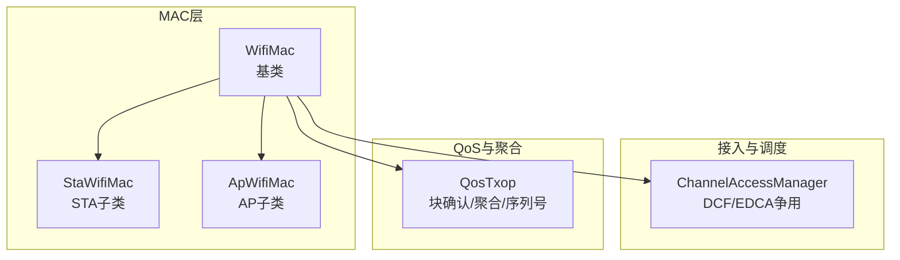
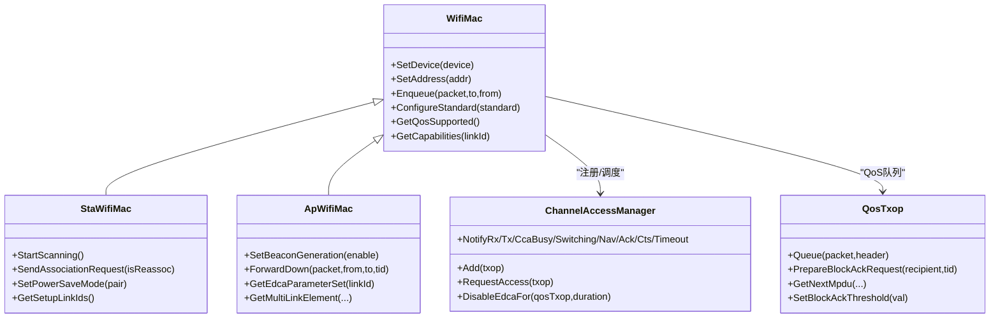
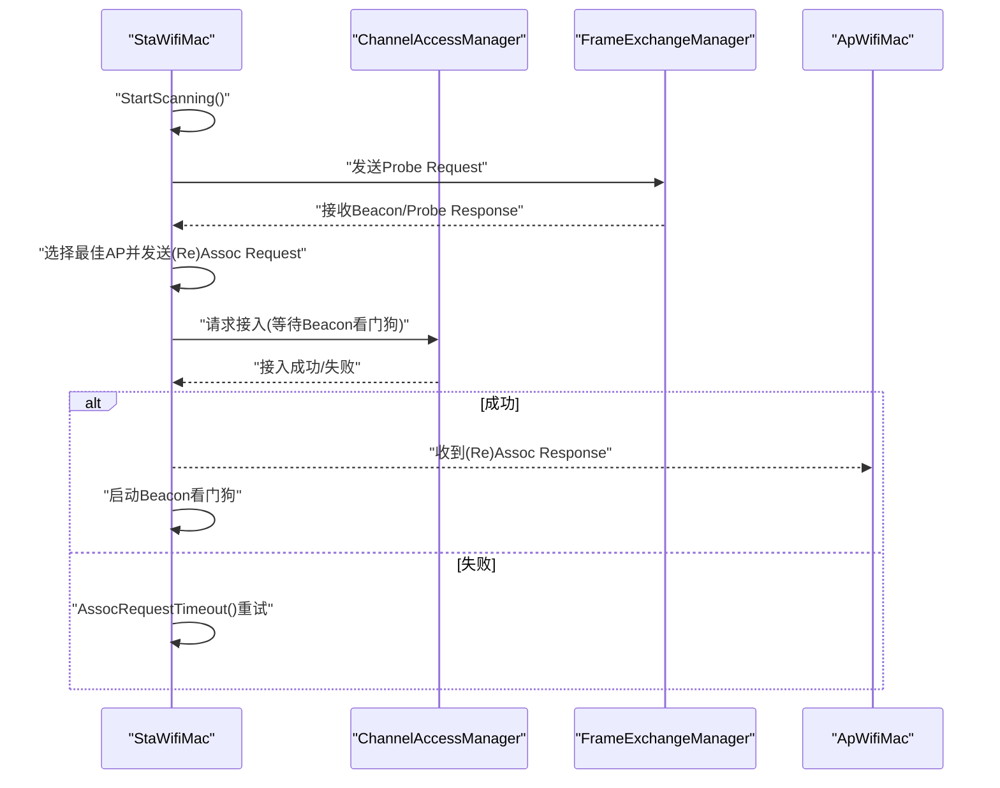
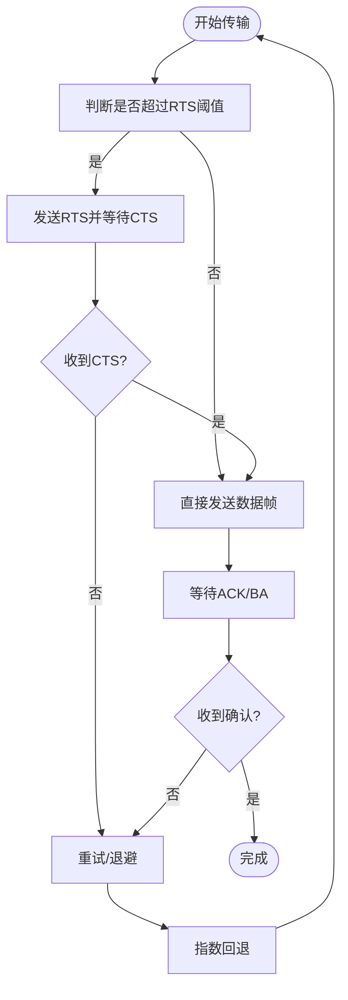
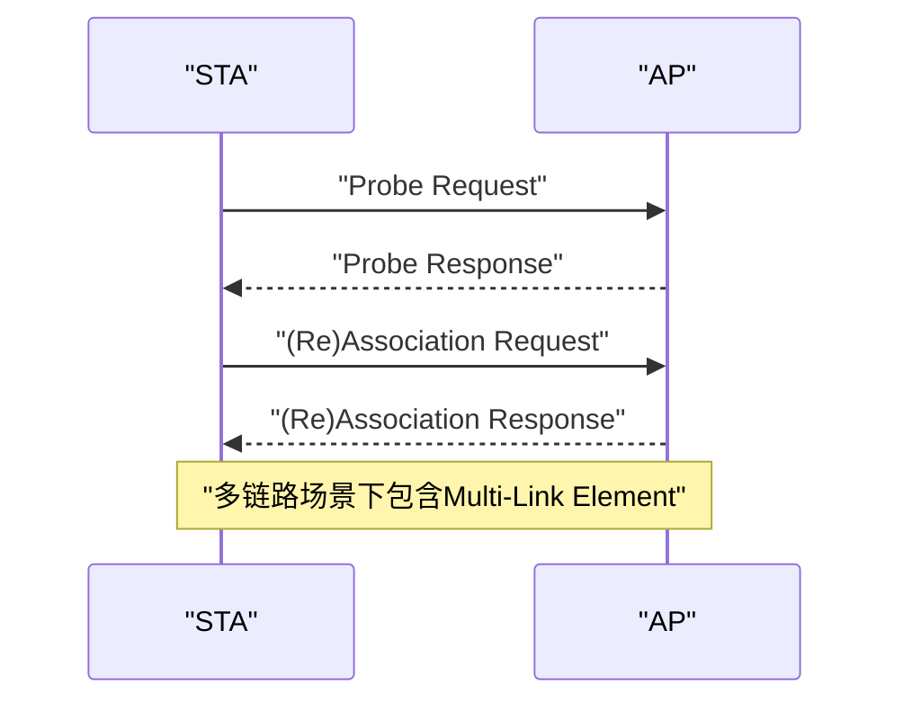
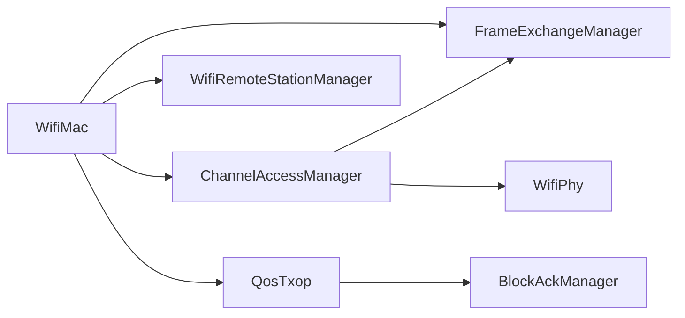

# WiFi媒体访问控制层

<cite>
**本文档引用的文件**
- [wifi-mac.cc](file://simulator/ns-3.39/src/wifi/model/wifi-mac.cc)
- [wifi-mac.h](file://simulator/ns-3.39/src/wifi/model/wifi-mac.h)
- [sta-wifi-mac.cc](file://simulator/ns-3.39/src/wifi/model/sta-wifi-mac.cc)
- [sta-wifi-mac.h](file://simulator/ns-3.39/src/wifi/model/sta-wifi-mac.h)
- [ap-wifi-mac.cc](file://simulator/ns-3.39/src/wifi/model/ap-wifi-mac.cc)
- [ap-wifi-mac.h](file://simulator/ns-3.39/src/wifi/model/ap-wifi-mac.h)
- [qos-txop.h](file://simulator/ns-3.39/src/wifi/model/qos-txop.h)
- [channel-access-manager.h](file://simulator/ns-3.39/src/wifi/model/channel-access-manager.h)
</cite>

## 目录
1. [引言](#引言)
2. [项目结构](#项目结构)
3. [核心组件](#核心组件)
4. [架构总览](#架构总览)
5. [详细组件分析](#详细组件分析)
6. [依赖关系分析](#依赖关系分析)
7. [性能考虑](#性能考虑)
8. [故障排查指南](#故障排查指南)
9. [结论](#结论)
10. [附录](#附录)

## 引言
本文件系统化梳理NS-3中WiFi媒体访问控制（MAC）层的设计与实现，重点覆盖以下主题：
- WifiMac基类及其STA/AP子类的职责边界与协作方式
- DCF/EDCA接入方法、RTS/CTS握手、ACK确认机制、帧优先级处理
- MAC地址管理、BSS配置、关联认证流程、多STA协调
- WMM（QoS）支持、负载均衡策略、多链路设备（MLD）场景
- 功率保存模式、漫游处理、冲突避免与性能优化

目标是为读者提供从高层到代码级别的完整视图，并给出可操作的最佳实践与排障建议。

## 项目结构
NS-3的WiFi MAC层位于src/wifi/model目录下，采用“按功能域分层”的组织方式：
- 基类与通用接口：wifi-mac.*（定义MAC抽象、队列调度、事件回调）
- 子类实现：sta-wifi-mac.*（STA行为：扫描、关联、保活、PS模式）、ap-wifi-mac.*（AP行为：Beacon、准入控制、多STA管理）
- 接入控制与调度：channel-access-manager.*（DCF/EDCA争用、NAV/CCA/睡眠状态感知）
- QoS与聚合：qos-txop.*（块确认、聚合阈值、序列号、MU EDCA）

**图表来源**
- [wifi-mac.h:93-108](file://simulator/ns-3.39/src/wifi/model/wifi-mac.h#L93-L108)
- [sta-wifi-mac.h:143-144](file://simulator/ns-3.39/src/wifi/model/sta-wifi-mac.h#L143-L144)
- [ap-wifi-mac.h:64-65](file://simulator/ns-3.39/src/wifi/model/ap-wifi-mac.h#L64-L65)
- [channel-access-manager.h:56-57](file://simulator/ns-3.39/src/wifi/model/channel-access-manager.h#L56-L57)
- [qos-txop.h:71-72](file://simulator/ns-3.39/src/wifi/model/qos-txop.h#L71-L72)

**章节来源**
- [wifi-mac.h:1-120](file://simulator/ns-3.39/src/wifi/model/wifi-mac.h#L1-L120)
- [sta-wifi-mac.h:1-60](file://simulator/ns-3.39/src/wifi/model/sta-wifi-mac.h#L1-L60)
- [ap-wifi-mac.h:1-40](file://simulator/ns-3.39/src/wifi/model/ap-wifi-mac.h#L1-L40)
- [channel-access-manager.h:1-40](file://simulator/ns-3.39/src/wifi/model/channel-access-manager.h#L1-L40)
- [qos-txop.h:1-40](file://simulator/ns-3.39/src/wifi/model/qos-txop.h#L1-L40)

## 核心组件
- WifiMac基类
  - 职责：统一的MAC接口、队列调度器、链路实体管理、上/下行数据路径、事件回调、能力查询（QoS/HT/VHT/HE/EHT）
  - 关键点：支持单链路与多链路（MLD），通过LinkEntity管理PHY、FEManager、CAM、RS管理器
- StaWifiMac
  - 职责：扫描（主动/被动）、关联/重关联、Beacon监控、PS模式切换、多链路设置跟踪
  - 关键点：状态机（未关联/扫描/等待响应/已关联/被拒绝），Beacon看门狗，EMLSR支持
- ApWifiMac
  - 职责：Beacon生成、STA准入控制、多STA列表维护、QoS参数下发、Buffer Status Report处理
  - 关键点：Beacon定时器、短slot/preamble动态启用、多链路响应元素
- ChannelAccessManager
  - 职责：DCF/EDCA争用、NAV/CCA/睡眠/切换状态通知、内部碰撞仲裁
  - 关键点：优先级队列、回退槽更新、SIFS/Slot/EIFS常量
- QosTxop
  - 职责：QoS帧分片/重传、A-MSDU/A-MPDU聚合、块确认（BA）、序列号分配、MU EDCA
  - 关键点：BA阈值/超时、ADDBA超时、BA窗口管理、队列内聚合约束

**章节来源**
- [wifi-mac.h:93-120](file://simulator/ns-3.39/src/wifi/model/wifi-mac.h#L93-L120)
- [sta-wifi-mac.h:143-170](file://simulator/ns-3.39/src/wifi/model/sta-wifi-mac.h#L143-L170)
- [ap-wifi-mac.h:64-90](file://simulator/ns-3.39/src/wifi/model/ap-wifi-mac.h#L64-L90)
- [channel-access-manager.h:56-86](file://simulator/ns-3.39/src/wifi/model/channel-access-manager.h#L56-L86)
- [qos-txop.h:71-115](file://simulator/ns-3.39/src/wifi/model/qos-txop.h#L71-L115)

## 架构总览
MAC层通过“基类+子类+接入管理+QoS”四层协同工作：
- 基类负责全局状态与能力，子类聚焦角色差异
- 接入管理器统一调度各Txop（DCF或EDCA），并感知PHY状态
- QosTxop在接入后完成聚合、BA、序列号等QoS细节
- 多链路场景下，每个LinkEntity独立管理其PHY/FE/CAM/RS

**图表来源**
- [wifi-mac.h:93-224](file://simulator/ns-3.39/src/wifi/model/wifi-mac.h#L93-L224)
- [sta-wifi-mac.h:143-170](file://simulator/ns-3.39/src/wifi/model/sta-wifi-mac.h#L143-L170)
- [ap-wifi-mac.h:64-90](file://simulator/ns-3.39/src/wifi/model/ap-wifi-mac.h#L64-L90)
- [channel-access-manager.h:56-117](file://simulator/ns-3.39/src/wifi/model/channel-access-manager.h#L56-L117)
- [qos-txop.h:71-115](file://simulator/ns-3.39/src/wifi/model/qos-txop.h#L71-L115)

## 详细组件分析

### WifiMac基类与子类
- 基类职责
  - 统一的属性与回调：SSID、QoS支持、短slot时间、Txop指针、各AC队列、Trace源
  - 链路管理：多LinkEntity、PHY/FE/CAM/RS绑定、通道切换通知
  - 能力查询：Extended/Ht/Vht/He/Eht能力、BA类型、BAR类型
- 子类差异
  - STA：扫描、关联、Beacon看门狗、PS模式、多链路设置事件
  - AP：Beacon生成、准入控制、多STA列表、QoS参数集、RNR/MLE、Buffer Status

**图表来源**
- [sta-wifi-mac.cc:562-663](file://simulator/ns-3.39/src/wifi/model/sta-wifi-mac.cc#L562-L663)
- [sta-wifi-mac.cc:666-671](file://simulator/ns-3.39/src/wifi/model/sta-wifi-mac.cc#L666-L671)
- [ap-wifi-mac.cc:307-351](file://simulator/ns-3.39/src/wifi/model/ap-wifi-mac.cc#L307-L351)

**章节来源**
- [wifi-mac.cc:418-444](file://simulator/ns-3.39/src/wifi/model/wifi-mac.cc#L418-L444)
- [wifi-mac.h:114-120](file://simulator/ns-3.39/src/wifi/model/wifi-mac.h#L114-L120)
- [sta-wifi-mac.cc:562-663](file://simulator/ns-3.39/src/wifi/model/sta-wifi-mac.cc#L562-L663)
- [ap-wifi-mac.cc:307-351](file://simulator/ns-3.39/src/wifi/model/ap-wifi-mac.cc#L307-L351)

### DCF/EDCA接入与RTS/CTS/ACK
- 接入控制
  - ChannelAccessManager统一管理Txop集合，按优先级进行DCF/EDCA争用
  - 支持DisableEdcaFor临时禁用某EDCA以避免内部碰撞
- RTS/CTS与ACK
  - 通过QosTxop的RTS阈值与CTS超时机制实现；CAM提供NotifyCtsTimeoutStartNow/Reset
  - ACK超时由CAM NotifyAckTimeoutStartNow/Reset驱动，配合Trace源记录MPDU响应超时
- 优先级与帧处理
  - 不同AC对应不同EDCA参数（CWmin/CWmax/AIFSN/TXOP Limit），由WifiMac::ConfigureDcf配置
  - QosTxop在Peek/GetNextMpdu时考虑聚合限制与PPDU时隙约束

**图表来源**
- [channel-access-manager.h:194-252](file://simulator/ns-3.39/src/wifi/model/channel-access-manager.h#L194-L252)
- [qos-txop.h:279-306](file://simulator/ns-3.39/src/wifi/model/qos-txop.h#L279-L306)
- [wifi-mac.cc:669-745](file://simulator/ns-3.39/src/wifi/model/wifi-mac.cc#L669-L745)

**章节来源**
- [channel-access-manager.h:116-137](file://simulator/ns-3.39/src/wifi/model/channel-access-manager.h#L116-L137)
- [channel-access-manager.h:234-252](file://simulator/ns-3.39/src/wifi/model/channel-access-manager.h#L234-L252)
- [qos-txop.h:279-306](file://simulator/ns-3.39/src/wifi/model/qos-txop.h#L279-L306)
- [wifi-mac.cc:669-745](file://simulator/ns-3.39/src/wifi/model/wifi-mac.cc#L669-L745)

### MAC地址管理与BSS配置
- 地址与BSSID
  - WifiMac::SetAddress/GetAddress用于本地MAC；SetBssid/GetBssid用于BSS标识
  - 多链路场景下，GetLocalAddress根据远端地址返回本地用于通信的地址（MLD或链路地址）
- BSS参数
  - AP侧通过GetCapabilities/GetEdcaParameterSet/GetMultiLinkElement等生成Beacon/Ignition帧
  - STA侧通过扫描收集Beacon/Probe Response，更新AP信息并决定关联

**章节来源**
- [wifi-mac.cc:442-479](file://simulator/ns-3.39/src/wifi/model/wifi-mac.cc#L442-L479)
- [ap-wifi-mac.cc:390-418](file://simulator/ns-3.39/src/wifi/model/ap-wifi-mac.cc#L390-L418)
- [sta-wifi-mac.cc:595-663](file://simulator/ns-3.39/src/wifi/model/sta-wifi-mac.cc#L595-L663)

### 关联认证与多STA协调
- 关联流程
  - 主动扫描：STA发送Probe Request；被动扫描：监听Beacon/Probe Response
  - 发送(Re)Assoc Request，等待(Re)Assoc Response；若被拒绝则尝试下一个候选AP
- 多STA协调
  - AP维护STA列表（AID映射），支持多链路（MLD）场景下的Per-STA Profile
  - Buffer Status Report用于指示STA缓冲区占用情况，辅助调度

**图表来源**
- [sta-wifi-mac.cc:286-336](file://simulator/ns-3.39/src/wifi/model/sta-wifi-mac.cc#L286-L336)
- [sta-wifi-mac.cc:447-522](file://simulator/ns-3.39/src/wifi/model/sta-wifi-mac.cc#L447-L522)
- [ap-wifi-mac.cc:307-351](file://simulator/ns-3.39/src/wifi/model/ap-wifi-mac.cc#L307-L351)
- [ap-wifi-mac.cc:660-725](file://simulator/ns-3.39/src/wifi/model/ap-wifi-mac.cc#L660-L725)

**章节来源**
- [sta-wifi-mac.cc:562-663](file://simulator/ns-3.39/src/wifi/model/sta-wifi-mac.cc#L562-L663)
- [ap-wifi-mac.cc:307-351](file://simulator/ns-3.39/src/wifi/model/ap-wifi-mac.cc#L307-L351)
- [ap-wifi-mac.cc:660-725](file://simulator/ns-3.39/src/wifi/model/ap-wifi-mac.cc#L660-L725)

### WMM（QoS）支持与块确认
- QoS参数
  - AC_VO/VI/BE/BK的CWmin/CWmax/AIFSN/TXOP Limit由ConfigureDcf配置
  - 各AC最大A-MSDU/A-MPDU大小、BA阈值与不活动超时可配置
- 块确认（BA）
  - QosTxop通过GotAddBaResponse/GotDelBaFrame建立/释放BA会话
  - 支持显式BAR（在错过BA后）与隐式BA窗口管理

**章节来源**
- [wifi-mac.cc:121-256](file://simulator/ns-3.39/src/wifi/model/wifi-mac.cc#L121-L256)
- [qos-txop.h:114-186](file://simulator/ns-3.39/src/wifi/model/qos-txop.h#L114-L186)

### 多STA协调与负载均衡
- AP侧
  - 维护每链路STA列表、短slot/preamble动态启用、EDCA参数集下发
  - 多链路场景下，基于Per-STA Profile进行链路协商与负载分担
- 负载均衡策略
  - 可结合Buffer Status Report与BA窗口状态，动态调整各链路的调度权重
  - 利用DisableEdcaFor对特定QosTxop进行短期抑制，避免内部碰撞

**章节来源**
- [ap-wifi-mac.h:180-202](file://simulator/ns-3.39/src/wifi/model/ap-wifi-mac.h#L180-L202)
- [ap-wifi-mac.cc:242-287](file://simulator/ns-3.39/src/wifi/model/ap-wifi-mac.cc#L242-L287)
- [channel-access-manager.h:137-137](file://simulator/ns-3.39/src/wifi/model/channel-access-manager.h#L137-L137)

### 漫游与功率保存模式
- 漫游
  - STA通过Beacon看门狗检测失联；失联后Disassociated并重启扫描/关联
  - 多链路场景下，取消/恢复链路需同步Trace事件
- PS模式
  - SetPowerSaveMode支持在关联后切换PS模式；STA切换至PS/Active由AP确认后生效
  - ApWifiMac在ProcessPowerManagementFlag中处理PS位变化

**章节来源**
- [sta-wifi-mac.cc:674-749](file://simulator/ns-3.39/src/wifi/model/sta-wifi-mac.cc#L674-L749)
- [ap-wifi-mac.cc:360-383](file://simulator/ns-3.39/src/wifi/model/ap-wifi-mac.cc#L360-L383)

## 依赖关系分析
- 组件耦合
  - WifiMac持有多个LinkEntity，分别绑定PHY/FE/CAM/RS，形成强内聚弱耦合
  - ChannelAccessManager与FrameExchangeManager通过回调交互，解耦接入与帧交换
- 外部依赖
  - 物理层（WifiPhy）状态变化通过Notify系列函数传递给接入管理器
  - QosTxop依赖BlockAckManager与聚合器，实现BA与A-MSDU/A-MPDU

**图表来源**
- [wifi-mac.h:761-782](file://simulator/ns-3.39/src/wifi/model/wifi-mac.h#L761-L782)
- [channel-access-manager.h:67-85](file://simulator/ns-3.39/src/wifi/model/channel-access-manager.h#L67-L85)
- [qos-txop.h:427-449](file://simulator/ns-3.39/src/wifi/model/qos-txop.h#L427-L449)

**章节来源**
- [wifi-mac.h:761-782](file://simulator/ns-3.39/src/wifi/model/wifi-mac.h#L761-L782)
- [channel-access-manager.h:67-85](file://simulator/ns-3.39/src/wifi/model/channel-access-manager.h#L67-L85)
- [qos-txop.h:427-449](file://simulator/ns-3.39/src/wifi/model/qos-txop.h#L427-L449)

## 性能考虑
- 参数调优
  - AC参数：根据业务（VO/VI/BE/BK）合理设置CWmin/CWmax/AIFSN/TXOP Limit
  - BA阈值与超时：高吞吐场景提高BA阈值，降低超时以减少延迟
  - A-MSDU/A-MPDU上限：结合PHY标准（HT/VHT/HE/EHT）上限配置
- 冲突避免
  - 使用DisableEdcaFor在关键时段抑制内部EDCA争用
  - 合理设置RTS阈值，平衡RTS/CTS开销与隐藏终端影响
- 多链路优化
  - 基于Buffer Status Report与链路空闲度进行流量分摊
  - 利用MU EDCA参数在高密度场景提升公平性

[本节提供一般性指导，无需具体文件引用]

## 故障排查指南
- 关联失败
  - 检查(Re)Assoc Request的速率兼容性与Basic Rate Set匹配
  - 确认(Re)Assoc Response是否携带Multi-Link Element及Per-STA Profile
- 无ACK/BA
  - 查看Mpdu/Psdu响应超时Trace，定位RTS/CTS或ACK缺失
  - 检查BA阈值与不活动超时配置
- 多链路异常
  - 核对MLD地址与链路ID映射，关注LinkSetupCompleted/LinkSetupCanceled事件
- PS模式问题
  - 确认Power Management位在(Re)Assoc Response中正确设置
  - 检查Beacon看门狗与PS模式切换超时

**章节来源**
- [sta-wifi-mac.cc:674-749](file://simulator/ns-3.39/src/wifi/model/sta-wifi-mac.cc#L674-L749)
- [ap-wifi-mac.cc:360-383](file://simulator/ns-3.39/src/wifi/model/ap-wifi-mac.cc#L360-L383)
- [wifi-mac.cc:318-347](file://simulator/ns-3.39/src/wifi/model/wifi-mac.cc#L318-L347)

## 结论
NS-3的WiFi MAC层以WifiMac为核心，通过STA/AP子类实现角色差异化，借助ChannelAccessManager完成DCF/EDCA争用，配合QosTxop实现QoS细节（聚合、BA、序列号）。该设计在多链路、多STA、多标准（HT/VHT/HE/EHT）场景下保持清晰的职责边界与良好的扩展性。实际部署中应结合业务特征调优AC参数、BA策略与多链路分摊策略，以获得更优的吞吐与延迟表现。

## 附录
- 实际代码示例与最佳实践
  - 关联流程参考：[sta-wifi-mac.cc:562-663](file://simulator/ns-3.39/src/wifi/model/sta-wifi-mac.cc#L562-L663)、[ap-wifi-mac.cc:307-351](file://simulator/ns-3.39/src/wifi/model/ap-wifi-mac.cc#L307-L351)
  - QoS参数配置参考：[wifi-mac.cc:669-745](file://simulator/ns-3.39/src/wifi/model/wifi-mac.cc#L669-L745)
  - BA阈值与超时配置参考：[wifi-mac.cc:186-256](file://simulator/ns-3.39/src/wifi/model/wifi-mac.cc#L186-L256)、[qos-txop.h:186-244](file://simulator/ns-3.39/src/wifi/model/qos-txop.h#L186-L244)
  - 多链路元素参考：[ap-wifi-mac.cc:660-725](file://simulator/ns-3.39/src/wifi/model/ap-wifi-mac.cc#L660-L725)、[sta-wifi-mac.cc:387-444](file://simulator/ns-3.39/src/wifi/model/sta-wifi-mac.cc#L387-L444)