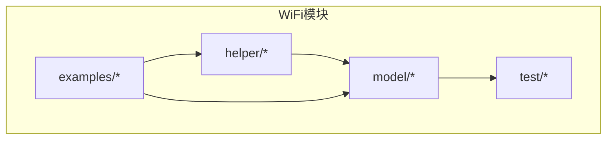
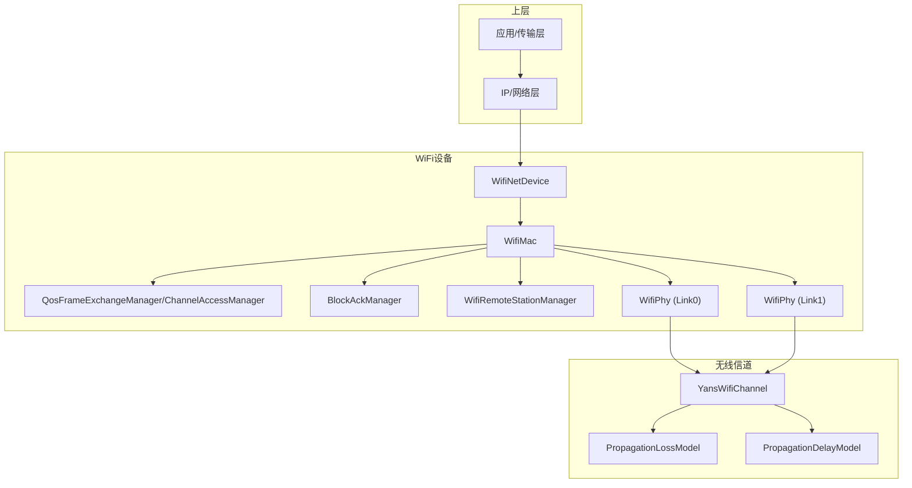
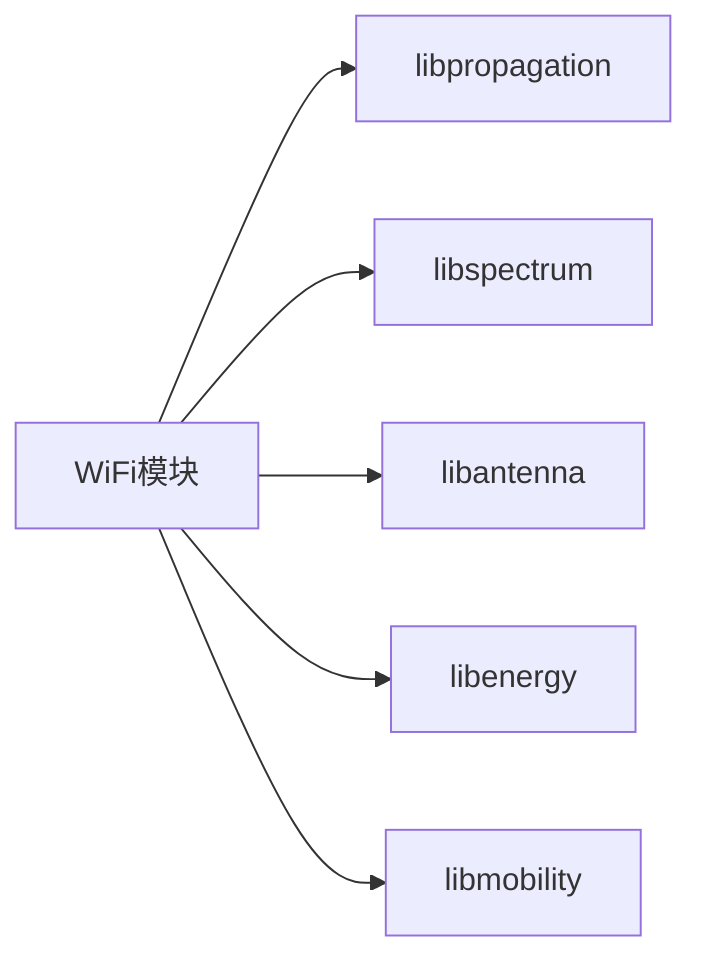
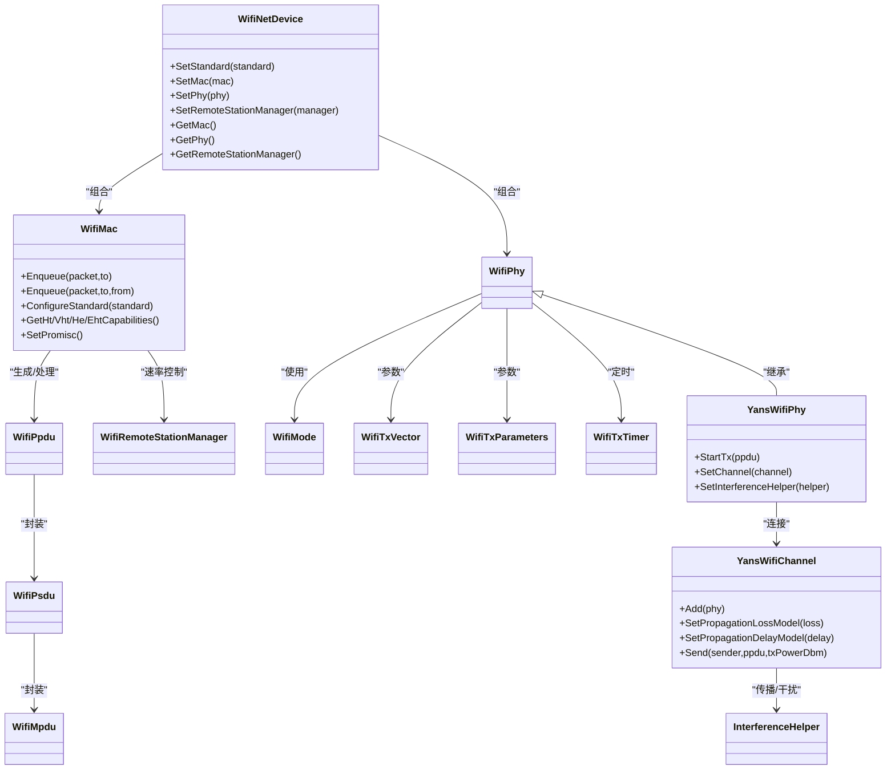

# WiFi模块

<cite>
**本文引用的文件**
- [src/wifi/CMakeLists.txt](file://src/wifi/CMakeLists.txt)
- [src/wifi/model/yans-wifi-phy.h](file://src/wifi/model/yans-wifi-phy.h)
- [src/wifi/model/yans-wifi-channel.h](file://src/wifi/model/yans-wifi-channel.h)
- [src/wifi/model/wifi-mac.h](file://src/wifi/model/wifi-mac.h)
- [src/wifi/model/wifi-net-device.h](file://src/wifi/model/wifi-net-device.h)
- [src/wifi/model/wifi-standards.h](file://src/wifi/model/wifi-standards.h)
- [src/wifi/helper/yans-wifi-helper.h](file://src/wifi/helper/yans-wifi-helper.h)
- [src/wifi/model/interference-helper.h](file://src/wifi/model/interference-helper.h)
- [src/wifi/model/spectrum-wifi-phy.h](file://src/wifi/model/spectrum-wifi-phy.h)
- [src/wifi/model/wifi-spectrum-phy-interface.h](file://src/wifi/model/wifi-spectrum-phy-interface.h)
- [src/wifi/model/wifi-spectrum-signal-parameters.h](file://src/wifi/model/wifi-spectrum-signal-parameters.h)
- [src/wifi/model/ht/ht-phy.h](file://src/wifi/model/ht/ht-phy.h)
- [src/wifi/model/vht/vht-phy.h](file://src/wifi/model/vht/vht-phy.h)
- [src/wifi/model/he/he-phy.h](file://src/wifi/model/he/he-phy.h)
- [src/wifi/model/eht/eht-phy.h](file://src/wifi/model/eht/eht-phy.h)
- [src/wifi/model/non-ht/ofdm-phy.h](file://src/wifi/model/non-ht/ofdm-phy.h)
- [src/wifi/model/non-ht/dsss-phy.h](file://src/wifi/model/non-ht/dsss-phy.h)
- [src/wifi/model/wifi-protection-manager.h](file://src/wifi/model/wifi-protection-manager.h)
- [src/wifi/model/wifi-ack-manager.h](file://src/wifi/model/wifi-ack-manager.h)
- [src/wifi/model/block-ack-manager.h](file://src/wifi/model/block-ack-manager.h)
- [src/wifi/model/qos-frame-exchange-manager.h](file://src/wifi/model/qos-frame-exchange-manager.h)
- [src/wifi/model/frame-exchange-manager.h](file://src/wifi/model/frame-exchange-manager.h)
- [src/wifi/model/channel-access-manager.h](file://src/wifi/model/channel-access-manager.h)
- [src/wifi/model/wifi-remote-station-manager.h](file://src/wifi/model/wifi-remote-station-manager.h)
- [src/wifi/model/wifi-tx-vector.h](file://src/wifi/model/wifi-tx-vector.h)
- [src/wifi/model/wifi-tx-parameters.h](file://src/wifi/model/wifi-tx-parameters.h)
- [src/wifi/model/wifi-tx-timer.h](file://src/wifi/model/wifi-tx-timer.h)
- [src/wifi/model/wifi-ppdu.h](file://src/wifi/model/wifi-ppdu.h)
- [src/wifi/model/wifi-psdu.h](file://src/wifi/model/wifi-psdu.h)
- [src/wifi/model/wifi-mpdu.h](file://src/wifi/model/wifi-mpdu.h)
- [src/wifi/model/wifi-mac-header.h](file://src/wifi/model/wifi-mac-header.h)
- [src/wifi/model/wifi-mac-queue.h](file://src/wifi/model/wifi-mac-queue.h)
- [src/wifi/model/wifi-mac-queue-scheduler.h](file://src/wifi/model/wifi-mac-queue-scheduler.h)
- [src/wifi/model/wifi-mac-queue-container.h](file://src/wifi/model/wifi-mac-queue-container.h)
- [src/wifi/model/wifi-mac-queue-elem.h](file://src/wifi/model/wifi-mac-queue-elem.h)
- [src/wifi/model/wifi-mode.h](file://src/wifi/model/wifi-mode.h)
- [src/wifi/model/wifi-utils.h](file://src/wifi/model/wifi-utils.h)
- [src/wifi/model/wifi-phy-common.h](file://src/wifi/model/wifi-phy-common.h)
- [src/wifi/model/wifi-phy-state-helper.h](file://src/wifi/model/wifi-phy-state-helper.h)
- [src/wifi/model/wifi-phy-state.h](file://src/wifi/model/wifi-phy-state.h)
- [src/wifi/model/wifi-phy.h](file://src/wifi/model/wifi-phy.h)
- [src/wifi/model/wifi-phy-band.h](file://src/wifi/model/wifi-phy-band.h)
- [src/wifi/model/wifi-phy-operating-channel.h](file://src/wifi/model/wifi-phy-operating-channel.h)
- [src/wifi/model/wifi-phy-listener.h](file://src/wifi/model/wifi-phy-listener.h)
- [src/wifi/model/wifi-bandwidth-filter.h](file://src/wifi/model/wifi-bandwidth-filter.h)
- [src/wifi/model/wifi-tx-current-model.h](file://src/wifi/model/wifi-tx-current-model.h)
- [src/wifi/model/wifi-radio-energy-model.h](file://src/wifi/model/wifi-radio-energy-model.h)
- [src/wifi/model/wifi-radio-energy-model-helper.h](file://src/wifi/model/wifi-radio-energy-model-helper.h)
- [src/wifi/model/wifi-snr-tag.h](file://src/wifi/model/wifi-snr-tag.h)
- [src/wifi/model/snr-tag.h](file://src/wifi/model/snr-tag.h)
- [src/wifi/model/txop.h](file://src/wifi/model/txop.h)
- [src/wifi/model/qos-txop.h](file://src/wifi/model/qos-txop.h)
- [src/wifi/model/wifi-default-protection-manager.h](file://src/wifi/model/wifi-default-protection-manager.h)
- [src/wifi/model/wifi-default-ack-manager.h](file://src/wifi/model/wifi-default-ack-manager.h)
- [src/wifi/model/wifi-default-assoc-manager.h](file://src/wifi/model/wifi-default-assoc-manager.h)
- [src/wifi/model/wifi-assoc-manager.h](file://src/wifi/model/wifi-assoc-manager.h)
- [src/wifi/model/wifi-mac-trailer.h](file://src/wifi/model/wifi-mac-trailer.h)
- [src/wifi/model/wifi-mgt-header.h](file://src/wifi/model/wifi-mgt-header.h)
- [src/wifi/model/wifi-mac-queue-scheduler-impl.h](file://src/wifi/model/wifi-mac-queue-scheduler-impl.h)
- [src/wifi/model/wifi-remote-station-info.h](file://src/wifi/model/wifi-remote-station-info.h)
- [src/wifi/model/wifi-information-element.h](file://src/wifi/model/wifi-information-element.h)
- [src/wifi/model/ssid.h](file://src/wifi/model/ssid.h)
- [src/wifi/model/status-code.h](file://src/wifi/model/status-code.h)
- [src/wifi/model/supported-rates.h](file://src/wifi/model/supported-rates.h)
- [src/wifi/model/capability-information.h](file://src/wifi/model/capability-information.h)
- [src/wifi/model/extended-capabilities.h](file://src/wifi/model/extended-capabilities.h)
- [src/wifi/model/edca-parameter-set.h](file://src/wifi/model/edca-parameter-set.h)
- [src/wifi/model/mu-edca-parameter-set.h](file://src/wifi/model/mu-edca-parameter-set.h)
- [src/wifi/model/ctrl-headers.h](file://src/wifi/model/ctrl-headers.h)
- [src/wifi/model/mgt-headers.h](file://src/wifi/model/mgt-headers.h)
- [src/wifi/model/ampdu-subframe-header.h](file://src/wifi/model/ampdu-subframe-header.h)
- [src/wifi/model/amsdu-subframe-header.h](file://src/wifi/model/amsdu-subframe-header.h)
- [src/wifi/model/ampdu-tag.h](file://src/wifi/model/ampdu-tag.h)
- [src/wifi/model/mpdu-aggregator.h](file://src/wifi/model/mpdu-aggregator.h)
- [src/wifi/model/msdu-aggregator.h](file://src/wifi/model/msdu-aggregator.h)
- [src/wifi/model/wifi-utils.cc](file://src/wifi/model/wifi-utils.cc)
- [src/wifi/model/wifi-phy-common.cc](file://src/wifi/model/wifi-phy-common.cc)
- [src/wifi/model/wifi-phy-state-helper.cc](file://src/wifi/model/wifi-phy-state-helper.cc)
- [src/wifi/model/wifi-remote-station-manager.cc](file://src/wifi/model/wifi-remote-station-manager.cc)
- [src/wifi/model/wifi-tx-vector.cc](file://src/wifi/model/wifi-tx-vector.cc)
- [src/wifi/model/wifi-tx-parameters.cc](file://src/wifi/model/wifi-tx-parameters.cc)
- [src/wifi/model/wifi-tx-timer.cc](file://src/wifi/model/wifi-tx-timer.cc)
- [src/wifi/model/wifi-ppdu.cc](file://src/wifi/model/wifi-ppdu.cc)
- [src/wifi/model/wifi-psdu.cc](file://src/wifi/model/wifi-psdu.cc)
- [src/wifi/model/wifi-mpdu.cc](file://src/wifi/model/wifi-mpdu.cc)
- [src/wifi/model/wifi-mac-header.cc](file://src/wifi/model/wifi-mac-header.cc)
- [src/wifi/model/wifi-mac-queue.cc](file://src/wifi/model/wifi-mac-queue.cc)
- [src/wifi/model/wifi-mac-queue-scheduler.cc](file://src/wifi/model/wifi-mac-queue-scheduler.cc)
- [src/wifi/model/wifi-mac-queue-container.cc](file://src/wifi/model/wifi-mac-queue-container.cc)
- [src/wifi/model/wifi-mac-queue-elem.cc](file://src/wifi/model/wifi-mac-queue-elem.cc)
- [src/wifi/model/wifi-mode.cc](file://src/wifi/model/wifi-mode.cc)
- [src/wifi/model/wifi-phy.cc](file://src/wifi/model/wifi-phy.cc)
- [src/wifi/model/wifi-phy-state.cc](file://src/wifi/model/wifi-phy-state.cc)
- [src/wifi/model/wifi-phy-band.cc](file://src/wifi/model/wifi-phy-band.cc)
- [src/wifi/model/wifi-phy-operating-channel.cc](file://src/wifi/model/wifi-phy-operating-channel.cc)
- [src/wifi/model/wifi-phy-listener.cc](file://src/wifi/model/wifi-phy-listener.cc)
- [src/wifi/model/wifi-bandwidth-filter.cc](file://src/wifi/model/wifi-bandwidth-filter.cc)
- [src/wifi/model/wifi-tx-current-model.cc](file://src/wifi/model/wifi-tx-current-model.cc)
- [src/wifi/model/wifi-radio-energy-model.cc](file://src/wifi/model/wifi-radio-energy-model.cc)
- [src/wifi/model/wifi-radio-energy-model-helper.cc](file://src/wifi/model/wifi-radio-energy-model-helper.cc)
- [src/wifi/model/wifi-snr-tag.cc](file://src/wifi/model/wifi-snr-tag.cc)
- [src/wifi/model/snr-tag.cc](file://src/wifi/model/snr-tag.cc)
- [src/wifi/model/txop.cc](file://src/wifi/model/txop.cc)
- [src/wifi/model/qos-txop.cc](file://src/wifi/model/qos-txop.cc)
- [src/wifi/model/wifi-default-protection-manager.cc](file://src/wifi/model/wifi-default-protection-manager.cc)
- [src/wifi/model/wifi-default-ack-manager.cc](file://src/wifi/model/wifi-default-ack-manager.cc)
- [src/wifi/model/wifi-default-assoc-manager.cc](file://src/wifi/model/wifi-default-assoc-manager.cc)
- [src/wifi/model/wifi-assoc-manager.cc](file://src/wifi/model/wifi-assoc-manager.cc)
- [src/wifi/model/wifi-mac-trailer.cc](file://src/wifi/model/wifi-mac-trailer.cc)
- [src/wifi/model/wifi-mgt-header.cc](file://src/wifi/model/wifi-mgt-header.cc)
- [src/wifi/model/wifi-mac-queue-scheduler-impl.cc](file://src/wifi/model/wifi-mac-queue-scheduler-impl.cc)
- [src/wifi/model/wifi-remote-station-info.cc](file://src/wifi/model/wifi-remote-station-info.cc)
- [src/wifi/model/wifi-information-element.cc](file://src/wifi/model/wifi-information-element.cc)
- [src/wifi/model/ssid.cc](file://src/wifi/model/ssid.cc)
- [src/wifi/model/status-code.cc](file://src/wifi/model/status-code.cc)
- [src/wifi/model/supported-rates.cc](file://src/wifi/model/supported-rates.cc)
- [src/wifi/model/capability-information.cc](file://src/wifi/model/capability-information.cc)
- [src/wifi/model/extended-capabilities.cc](file://src/wifi/model/extended-capabilities.cc)
- [src/wifi/model/edca-parameter-set.cc](file://src/wifi/model/edca-parameter-set.cc)
- [src/wifi/model/mu-edca-parameter-set.cc](file://src/wifi/model/mu-edca-parameter-set.cc)
- [src/wifi/model/ctrl-headers.cc](file://src/wifi/model/ctrl-headers.cc)
- [src/wifi/model/mgt-headers.cc](file://src/wifi/model/mgt-headers.cc)
- [src/wifi/model/ampdu-subframe-header.cc](file://src/wifi/model/ampdu-subframe-header.cc)
- [src/wifi/model/amsdu-subframe-header.cc](file://src/wifi/model/amsdu-subframe-header.cc)
- [src/wifi/model/ampdu-tag.cc](file://src/wifi/model/ampdu-tag.cc)
- [src/wifi/model/mpdu-aggregator.cc](file://src/wifi/model/mpdu-aggregator.cc)
- [src/wifi/model/msdu-aggregator.cc](file://src/wifi/model/msdu-aggregator.cc)
</cite>

## 目录
1. [简介](#简介)
2. [项目结构](#项目结构)
3. [核心组件](#核心组件)
4. [架构总览](#架构总览)
5. [详细组件分析](#详细组件分析)
6. [依赖关系分析](#依赖关系分析)
7. [性能考虑](#性能考虑)
8. [故障排除指南](#故障排除指南)
9. [结论](#结论)
10. [附录](#附录)

## 简介
本文件为NS-3 WiFi模块的详细API文档，聚焦于WiFi物理层（PHY）与媒体访问控制（MAC）协议实现，覆盖802.11a/b/g/n/ac/ax/be标准支持，以及Yans无线信道、YansWifiPhy、WifiMac等核心类的使用方法。文档同时涵盖传播模型、天线模型、信道建模、干扰分析、STA/AP连接、QoS设置、功率控制、多用户MIMO与波束成形等高级特性，并提供仿真最佳实践与故障排除建议。

## 项目结构
NS-3的WiFi模块位于src/wifi目录下，采用按功能分层的组织方式：helper用于高层装配（如YansWifiHelper），model存放具体实现（PHY、MAC、帧交换管理器、保护机制、聚合与队列调度等）。CMakeLists集中声明了所有源文件与头文件，明确依赖关系（如libpropagation、libspectrum、libantenna等外部库）。

图示来源
- [src/wifi/CMakeLists.txt:8-316](file://src/wifi/CMakeLists.txt#L8-L316)

章节来源
- [src/wifi/CMakeLists.txt:1-358](file://src/wifi/CMakeLists.txt#L1-L358)

## 核心组件
- WiFi标准与带宽
  - 支持标准：802.11a/b/g/p/n/ac/ad/ax/be，通过枚举与映射函数定义默认带宽与频段。
- 网络设备与接口
  - WifiNetDevice作为统一容器，组合Channel、WifiPhy、WifiMac、WifiRemoteStationManager等子系统。
- 物理层（PHY）
  - YansWifiPhy提供基于Yans模型的PHY层；另有非HT OFDM/DSSS、HT/VHT/HE/EHT等PHY变体以适配不同标准。
- 媒体访问控制（MAC）
  - WifiMac基类封装EDCA、帧交换管理、块确认（BA）、保护机制、速率控制等。
- 信道与传播
  - YansWifiChannel承载多个YansWifiPhy，结合传播损耗与延迟模型进行PPDU转发。
- 干扰与谱域
  - InterferenceHelper处理接收端干扰；SpectrumWifiPhy与相关接口支持谱域仿真。
- 高级特性
  - 多用户调度（MU-SNR标签、MU-EDCA参数集）、OFDMA资源单元（RU）分配、Multi-Link（MLO）能力等。

章节来源
- [src/wifi/model/wifi-standards.h:37-182](file://src/wifi/model/wifi-standards.h#L37-L182)
- [src/wifi/model/wifi-net-device.h:58-262](file://src/wifi/model/wifi-net-device.h#L58-L262)
- [src/wifi/model/yans-wifi-phy.h:47-81](file://src/wifi/model/yans-wifi-phy.h#L47-L81)
- [src/wifi/model/yans-wifi-channel.h:45-119](file://src/wifi/model/yans-wifi-channel.h#L45-L119)
- [src/wifi/model/wifi-mac.h:93-800](file://src/wifi/model/wifi-mac.h#L93-L800)
- [src/wifi/model/interference-helper.h](file://src/wifi/model/interference-helper.h)
- [src/wifi/model/spectrum-wifi-phy.h](file://src/wifi/model/spectrum-wifi-phy.h)
- [src/wifi/model/wifi-spectrum-phy-interface.h](file://src/wifi/model/wifi-spectrum-phy-interface.h)
- [src/wifi/model/wifi-spectrum-signal-parameters.h](file://src/wifi/model/wifi-spectrum-signal-parameters.h)

## 架构总览
WiFi模块在NS-3中遵循“设备-链路-物理-媒体访问-应用”的分层设计。WifiNetDevice作为上层网络栈与底层无线链路之间的桥梁，内部组合多个PHY对象（支持多链路设备）与一个MAC对象，后者进一步协调帧交换管理器、通道接入管理器、块确认管理器、速率控制等子系统。传播模型与信道对象负责跨节点的信号传播与时延计算。

图示来源
- [src/wifi/model/wifi-net-device.h:58-262](file://src/wifi/model/wifi-net-device.h#L58-L262)
- [src/wifi/model/wifi-mac.h:93-800](file://src/wifi/model/wifi-mac.h#L93-L800)
- [src/wifi/model/yans-wifi-channel.h:45-119](file://src/wifi/model/yans-wifi-channel.h#L45-L119)
- [src/wifi/model/yans-wifi-phy.h:47-81](file://src/wifi/model/yans-wifi-phy.h#L47-L81)

## 详细组件分析

### WiFi标准与频段映射
- 标准枚举与默认带宽/频段映射：802.11a/g/b/p/n/ac/ad/ax/be分别对应不同频段与默认带宽策略。
- 频道类型：DSSS（802.11b）、OFDM（通用）、802.11p专用频道类型。

章节来源
- [src/wifi/model/wifi-standards.h:37-182](file://src/wifi/model/wifi-standards.h#L37-L182)

### WifiNetDevice：设备容器与生命周期
- 组合关系：持有Node、多个WifiPhy、WifiMac、多个RemoteStationManager、各标准配置对象（Ht/Vht/He/Eht）。
- 接口职责：完成配置、链路状态维护、上行/下行回调、MTU设置、Promisc模式等。
- 关键行为：CompleteConfig连接子组件；LinkUp/LinkDown驱动上层链路状态；ForwardUp向上转发数据包。

章节来源
- [src/wifi/model/wifi-net-device.h:58-262](file://src/wifi/model/wifi-net-device.h#L58-L262)

### WifiMac：MAC层核心
- 职责：EDCA/OFDMA接入、帧交换管理、块确认、聚合/去聚合、队列调度、速率控制、QoS参数、多链路地址解析。
- 关键接口：Enqueue、Enqueue（含from）、ForwardUp回调、ConfigureStandard、Get/SetCapabilities、Block/UnblockTxOnLinks等。
- 多链路支持：LinkEntity结构体管理每个链路的PHY、通道接入管理器、帧交换管理器、速率控制等。

章节来源
- [src/wifi/model/wifi-mac.h:93-800](file://src/wifi/model/wifi-mac.h#L93-L800)

### YansWifiPhy：Yans物理层
- 功能：基于Yans模型的PHY实现，依赖YansWifiChannel提供的传播损耗与延迟模型；提供StartTx、SetInterferenceHelper、频带查询、发射掩码参数等接口。
- 与信道交互：通过SetChannel绑定到YansWifiChannel，由信道在发送时调度接收。

章节来源
- [src/wifi/model/yans-wifi-phy.h:47-81](file://src/wifi/model/yans-wifi-phy.h#L47-L81)

### YansWifiChannel：无线信道
- 功能：维护PHY列表、传播损耗与延迟模型、向其他PHY广播PPDU、随机流分配。
- 关键流程：Add加入PHY；Send触发跨节点传播；AssignStreams为传播模型分配固定随机流。

章节来源
- [src/wifi/model/yans-wifi-channel.h:45-119](file://src/wifi/model/yans-wifi-channel.h#L45-L119)

### 传播模型与干扰分析
- 传播模型：YansWifiChannel可配置多个传播损耗模型与传播延迟模型，顺序叠加影响最终接收功率。
- 干扰分析：InterferenceHelper用于接收端累积与评估来自多个PPDU的干扰，决定解调成功与否。

章节来源
- [src/wifi/model/yans-wifi-channel.h:67-86](file://src/wifi/model/yans-wifi-channel.h#L67-L86)
- [src/wifi/model/interference-helper.h](file://src/wifi/model/interference-helper.h)

### 谱域仿真与接口
- SpectrumWifiPhy：支持谱域仿真，便于与Spectrum模型协同。
- 接口与信号参数：WifiSpectrumPhyInterface、WifiSpectrumSignalParameters用于跨层传递谱域信息。

章节来源
- [src/wifi/model/spectrum-wifi-phy.h](file://src/wifi/model/spectrum-wifi-phy.h)
- [src/wifi/model/wifi-spectrum-phy-interface.h](file://src/wifi/model/wifi-spectrum-phy-interface.h)
- [src/wifi/model/wifi-spectrum-signal-parameters.h](file://src/wifi/model/wifi-spectrum-signal-parameters.h)

### 各标准PHY变体
- 非HT：OFDM-Phy、Dsss-Phy分别对应802.11a/g与802.11b。
- HT/VHT/HE/EHT：各自独立的PHY、PPDU、RU/资源分配、MU调度与能力配置，满足高阶调制与编码、大带宽与多链路需求。

章节来源
- [src/wifi/model/non-ht/ofdm-phy.h](file://src/wifi/model/non-ht/ofdm-phy.h)
- [src/wifi/model/non-ht/dsss-phy.h](file://src/wifi/model/non-ht/dsss-phy.h)
- [src/wifi/model/ht/ht-phy.h](file://src/wifi/model/ht/ht-phy.h)
- [src/wifi/model/vht/vht-phy.h](file://src/wifi/model/vht/vht-phy.h)
- [src/wifi/model/he/he-phy.h](file://src/wifi/model/he/he-phy.h)
- [src/wifi/model/eht/eht-phy.h](file://src/wifi/model/eht/eht-phy.h)

### 帧结构与聚合
- PPDU/PSDU/MPDU层次：PPDU承载物理层帧，PSDU由多个MPDU组成，MPDU承载MAC帧。
- 聚合：AMPDU（A-MPDU）与A-MSDU聚合器；块确认（BlockAck）提升吞吐与可靠性。

章节来源
- [src/wifi/model/wifi-ppdu.h](file://src/wifi/model/wifi-ppdu.h)
- [src/wifi/model/wifi-psdu.h](file://src/wifi/model/wifi-psdu.h)
- [src/wifi/model/wifi-mpdu.h](file://src/wifi/model/wifi-mpdu.h)
- [src/wifi/model/ampdu-subframe-header.h](file://src/wifi/model/ampdu-subframe-header.h)
- [src/wifi/model/amsdu-subframe-header.h](file://src/wifi/model/amsdu-subframe-header.h)
- [src/wifi/model/mpdu-aggregator.h](file://src/wifi/model/mpdu-aggregator.h)
- [src/wifi/model/msdu-aggregator.h](file://src/wifi/model/msdu-aggregator.h)
- [src/wifi/model/block-ack-manager.h](file://src/wifi/model/block-ack-manager.h)

### MAC队列与调度
- 队列容器与元素：WifiMacQueue、QueueContainer、QueueElem。
- 调度器：WifiMacQueueScheduler及其派生实现，支持优先级与QoS调度。
- EDCA/QoS：Txop、QosTxop、QosFrameExchangeManager、MU-EDCA参数集。

章节来源
- [src/wifi/model/wifi-mac-queue.h](file://src/wifi/model/wifi-mac-queue.h)
- [src/wifi/model/wifi-mac-queue-container.h](file://src/wifi/model/wifi-mac-queue-container.h)
- [src/wifi/model/wifi-mac-queue-elem.h](file://src/wifi/model/wifi-mac-queue-elem.h)
- [src/wifi/model/wifi-mac-queue-scheduler.h](file://src/wifi/model/wifi-mac-queue-scheduler.h)
- [src/wifi/model/wifi-mac-queue-scheduler-impl.h](file://src/wifi/model/wifi-mac-queue-scheduler-impl.h)
- [src/wifi/model/txop.h](file://src/wifi/model/txop.h)
- [src/wifi/model/qos-txop.h](file://src/wifi/model/qos-txop.h)
- [src/wifi/model/qos-frame-exchange-manager.h](file://src/wifi/model/qos-frame-exchange-manager.h)
- [src/wifi/model/mu-edca-parameter-set.h](file://src/wifi/model/mu-edca-parameter-set.h)

### 速率控制与保护机制
- 速率控制：多种RateControl算法（AARF、AA-RFCD、AMRR、APARF、ARF、CARA、ConstantRate、Ideal、Minstrel-HT、OOO、PARF、RRAA、RRPAA、ThompsonSampling）。
- 保护机制：DefaultProtectionManager、ACK管理、关联管理、帧交换管理器等。

章节来源
- [src/wifi/model/wifi-remote-station-manager.h](file://src/wifi/model/wifi-remote-station-manager.h)
- [src/wifi/model/wifi-default-protection-manager.h](file://src/wifi/model/wifi-default-protection-manager.h)
- [src/wifi/model/wifi-default-ack-manager.h](file://src/wifi/model/wifi-default-ack-manager.h)
- [src/wifi/model/wifi-default-assoc-manager.h](file://src/wifi/model/wifi-default-assoc-manager.h)
- [src/wifi/model/frame-exchange-manager.h](file://src/wifi/model/frame-exchange-manager.h)

### 发射参数与状态机
- 发射向量与参数：WifiTxVector、WifiTxParameters、WifiTxTimer。
- 物理层状态：WifiPhyState、StateHelper、Listener接口。
- 公共参数：WifiPhyCommon、频段与工作信道、带宽滤波器、电流模型、能量模型。

章节来源
- [src/wifi/model/wifi-tx-vector.h](file://src/wifi/model/wifi-tx-vector.h)
- [src/wifi/model/wifi-tx-parameters.h](file://src/wifi/model/wifi-tx-parameters.h)
- [src/wifi/model/wifi-tx-timer.h](file://src/wifi/model/wifi-tx-timer.h)
- [src/wifi/model/wifi-phy-state.h](file://src/wifi/model/wifi-phy-state.h)
- [src/wifi/model/wifi-phy-state-helper.h](file://src/wifi/model/wifi-phy-state-helper.h)
- [src/wifi/model/wifi-phy-listener.h](file://src/wifi/model/wifi-phy-listener.h)
- [src/wifi/model/wifi-phy-common.h](file://src/wifi/model/wifi-phy-common.h)
- [src/wifi/model/wifi-phy-band.h](file://src/wifi/model/wifi-phy-band.h)
- [src/wifi/model/wifi-phy-operating-channel.h](file://src/wifi/model/wifi-phy-operating-channel.h)
- [src/wifi/model/wifi-bandwidth-filter.h](file://src/wifi/model/wifi-bandwidth-filter.h)
- [src/wifi/model/wifi-tx-current-model.h](file://src/wifi/model/wifi-tx-current-model.h)
- [src/wifi/model/wifi-radio-energy-model.h](file://src/wifi/model/wifi-radio-energy-model.h)

### 辅助工具与标签
- SNR标签：用于记录与传播SNR信息。
- 工具函数：模式与速率表示、通用工具函数等。

章节来源
- [src/wifi/model/wifi-snr-tag.h](file://src/wifi/model/wifi-snr-tag.h)
- [src/wifi/model/snr-tag.h](file://src/wifi/model/snr-tag.h)
- [src/wifi/model/wifi-mode.h](file://src/wifi/model/wifi-mode.h)
- [src/wifi/model/wifi-utils.h](file://src/wifi/model/wifi-utils.h)

### 配置与使用示例（路径指引）
以下为常见场景的代码示例路径（请参考相应文件以获取完整实现细节）：
- 基础STA/AP连接与QoS设置：[examples/wireless/ns3.39-wifi-ap-default](file://examples/wireless/ns3.39-wifi-ap-default)
- 802.11n MIMO与多用户：[examples/wireless/ns3.39-wifi-80211n-mimo-default](file://examples/wireless/ns3.39-wifi-80211n-mimo-default)
- 802.11ax HE网络：[examples/wireless/ns3.39-wifi-he-network-default](file://examples/wireless/ns3.39-wifi-he-network-default)
- 802.11be EHT网络：[examples/wireless/ns3.39-wifi-eht-network-default](file://examples/wireless/ns3.39-wifi-eht-network-default)
- 多速率与混合网络：[examples/wireless/ns3.39-wifi-multirate-default](file://examples/wireless/ns3.39-wifi-multirate-default)
- 隐藏终端与清除信道：[examples/wireless/ns3.39-wifi-hidden-terminal-default](file://examples/wireless/ns3.39-wifi-hidden-terminal-default)
- 传播模型比较：[examples/wireless/ns3.39-wifi-error-models-comparison-default](file://examples/wireless/ns3.39-wifi-error-models-comparison-default)
- Ad hoc网络：[examples/wireless/ns3.39-wifi-adhoc-default](file://examples/wireless/ns3.39-wifi-adhoc-default)
- 802.11e TXOP与QoS：[examples/wireless/ns3.39-wifi-80211e-txop-default](file://examples/wireless/ns3.39-wifi-80211e-txop-default)
- 多链路（MLO）：[examples/wireless/ns3.39-wifi-mixed-network-default](file://examples/wireless/ns3.39-wifi-mixed-network-default)

章节来源
- [src/wifi/helper/yans-wifi-helper.h:38-173](file://src/wifi/helper/yans-wifi-helper.h#L38-L173)

## 依赖关系分析
WiFi模块通过CMakeLists集中声明源文件与头文件，并显式链接外部库：libpropagation（传播模型）、libspectrum（谱域）、libantenna（天线模型）、libenergy（能耗）、libmobility（移动性）等。该依赖关系确保PHY与MAC能够与传播、天线、能效、移动性子系统无缝协作。

图示来源
- [src/wifi/CMakeLists.txt:322-329](file://src/wifi/CMakeLists.txt#L322-L329)

章节来源
- [src/wifi/CMakeLists.txt:318-358](file://src/wifi/CMakeLists.txt#L318-L358)

## 性能考虑
- 传播模型选择：对LOS/NLOS、多径、阴影衰落等场景应选用合适的损耗与延迟模型组合，避免过度或不足的路径损耗导致吞吐与时延偏差。
- 干扰抑制：合理设置传播损耗与噪声底限，避免过低噪声导致误判；利用InterferenceHelper正确统计多用户干扰。
- 带宽与MU调度：在高密度场景启用更高带宽与MU调度（HE/VHT/BE），但需平衡RU分配与保护开销。
- QoS与队列：根据业务类型配置AC参数与队列调度策略，减少高优先级流量的排队时延。
- 天线与波束成形：结合Antenna模型与Spectrum仿真，评估空间复用增益；注意多径环境下的波束指向性与互易性假设。
- 速率控制：根据链路质量动态调整速率控制算法，避免频繁切换导致抖动。

## 故障排除指南
- 无法建立STA与AP连接
  - 检查SSID与认证配置是否一致；确认关联管理器状态与回调链路正常。
  - 参考：[src/wifi/model/wifi-assoc-manager.h](file://src/wifi/model/wifi-assoc-manager.h)
- 数据包丢失严重
  - 核查传播损耗模型与路径损耗指数；检查噪声底限与干扰统计。
  - 参考：[src/wifi/model/interference-helper.h](file://src/wifi/model/interference-helper.h)
- 吞吐偏低
  - 检查是否启用聚合（AMPDU/A-MSDU）与块确认；确认MU调度与RU分配策略。
  - 参考：[src/wifi/model/mpdu-aggregator.h](file://src/wifi/model/mpdu-aggregator.h)，[src/wifi/model/block-ack-manager.h](file://src/wifi/model/block-ack-manager.h)
- QoS效果不明显
  - 确认EDCA参数与MU-EDCA参数集配置；检查队列调度器是否按优先级执行。
  - 参考：[src/wifi/model/edca-parameter-set.h](file://src/wifi/model/edca-parameter-set.h)，[src/wifi/model/mu-edca-parameter-set.h](file://src/wifi/model/mu-edca-parameter-set.h)
- 多链路（MLO）异常
  - 校验LinkEntity配置与本地地址解析逻辑；确认各链路的PHY与速率控制独立配置。
  - 参考：[src/wifi/model/wifi-mac.h:761-782](file://src/wifi/model/wifi-mac.h#L761-L782)

章节来源
- [src/wifi/model/wifi-assoc-manager.h](file://src/wifi/model/wifi-assoc-manager.h)
- [src/wifi/model/interference-helper.h](file://src/wifi/model/interference-helper.h)
- [src/wifi/model/mpdu-aggregator.h](file://src/wifi/model/mpdu-aggregator.h)
- [src/wifi/model/block-ack-manager.h](file://src/wifi/model/block-ack-manager.h)
- [src/wifi/model/edca-parameter-set.h](file://src/wifi/model/edca-parameter-set.h)
- [src/wifi/model/mu-edca-parameter-set.h](file://src/wifi/model/mu-edca-parameter-set.h)
- [src/wifi/model/wifi-mac.h:761-782](file://src/wifi/model/wifi-mac.h#L761-L782)

## 结论
NS-3 WiFi模块提供了从基础802.11a/b/g到最新802.11be的全系列标准支持，结合Yans信道与谱域仿真能力，能够覆盖从单用户到多用户MIMO、从基本QoS到高级MU调度与多链路（MLO）的广泛场景。通过合理的传播模型、干扰分析、速率控制与队列调度配置，可在仿真中准确反映真实无线网络的行为特征。

## 附录
- 常用类关系概览（类图）

图示来源
- [src/wifi/model/wifi-net-device.h:58-262](file://src/wifi/model/wifi-net-device.h#L58-L262)
- [src/wifi/model/wifi-mac.h:93-800](file://src/wifi/model/wifi-mac.h#L93-L800)
- [src/wifi/model/yans-wifi-phy.h:47-81](file://src/wifi/model/yans-wifi-phy.h#L47-L81)
- [src/wifi/model/yans-wifi-channel.h:45-119](file://src/wifi/model/yans-wifi-channel.h#L45-L119)
- [src/wifi/model/interference-helper.h](file://src/wifi/model/interference-helper.h)
- [src/wifi/model/wifi-remote-station-manager.h](file://src/wifi/model/wifi-remote-station-manager.h)
- [src/wifi/model/wifi-ppdu.h](file://src/wifi/model/wifi-ppdu.h)
- [src/wifi/model/wifi-psdu.h](file://src/wifi/model/wifi-psdu.h)
- [src/wifi/model/wifi-mpdu.h](file://src/wifi/model/wifi-mpdu.h)
- [src/wifi/model/wifi-mode.h](file://src/wifi/model/wifi-mode.h)
- [src/wifi/model/wifi-tx-vector.h](file://src/wifi/model/wifi-tx-vector.h)
- [src/wifi/model/wifi-tx-parameters.h](file://src/wifi/model/wifi-tx-parameters.h)
- [src/wifi/model/wifi-tx-timer.h](file://src/wifi/model/wifi-tx-timer.h)