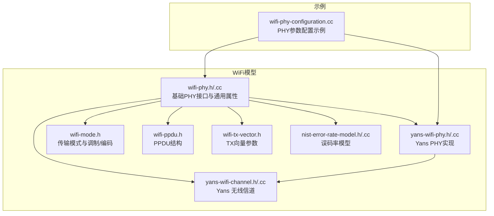
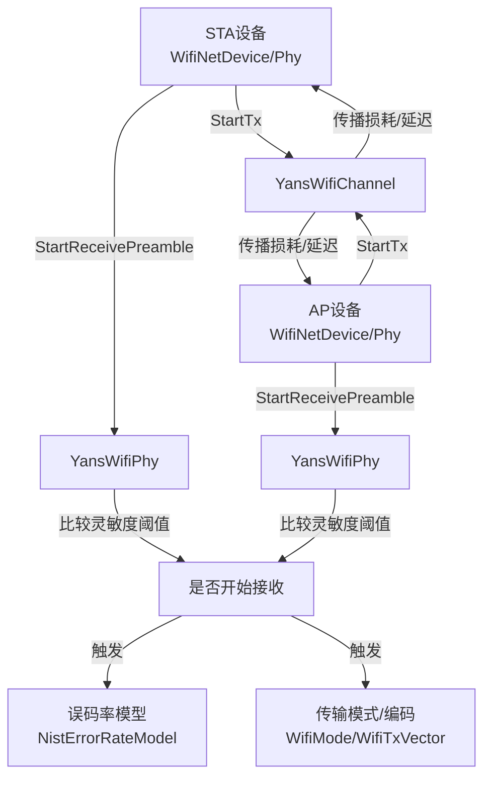
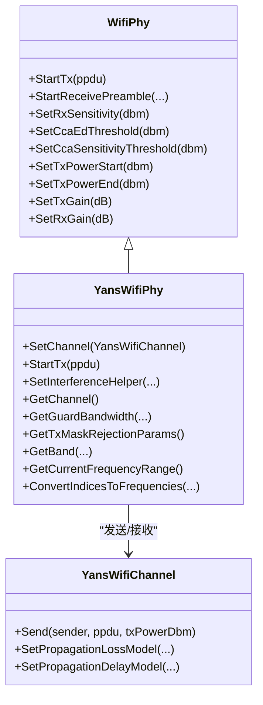
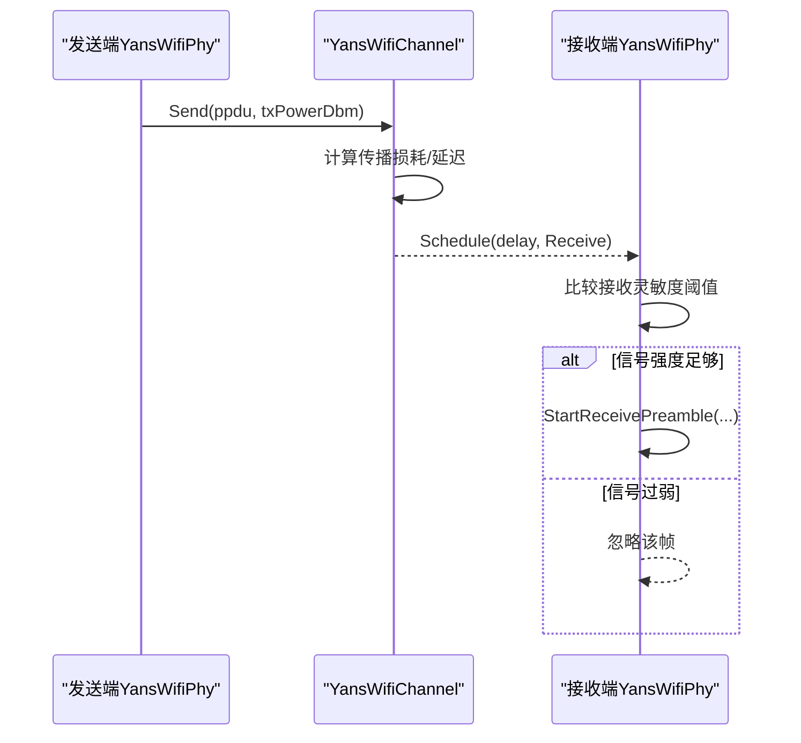
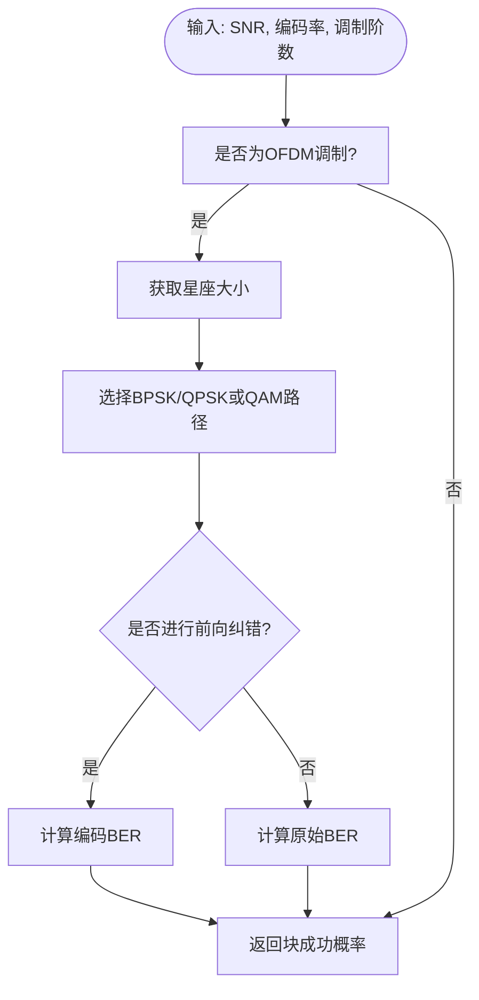
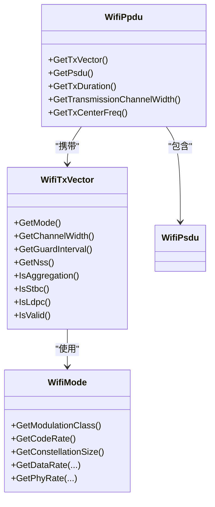
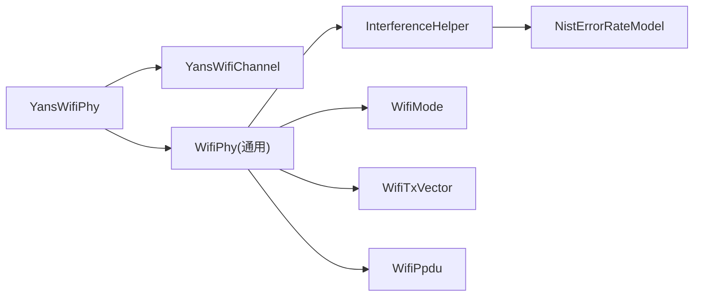

# WiFi物理层

<cite>
**本文档引用的文件**
- [yans-wifi-phy.h](file://simulator/ns-3.39/src/wifi/model/yans-wifi-phy.h)
- [yans-wifi-phy.cc](file://simulator/ns-3.39/src/wifi/model/yans-wifi-phy.cc)
- [yans-wifi-channel.h](file://simulator/ns-3.39/src/wifi/model/yans-wifi-channel.h)
- [yans-wifi-channel.cc](file://simulator/ns-3.39/src/wifi/model/yans-wifi-channel.cc)
- [wifi-phy.h](file://simulator/ns-3.39/src/wifi/model/wifi-phy.h)
- [wifi-phy.cc](file://simulator/ns-3.39/src/wifi/model/wifi-phy.cc)
- [wifi-mode.h](file://simulator/ns-3.39/src/wifi/model/wifi-mode.h)
- [wifi-ppdu.h](file://simulator/ns-3.39/src/wifi/model/wifi-ppdu.h)
- [wifi-tx-vector.h](file://simulator/ns-3.39/src/wifi/model/wifi-tx-vector.h)
- [nist-error-rate-model.h](file://simulator/ns-3.39/src/wifi/model/nist-error-rate-model.h)
- [nist-error-rate-model.cc](file://simulator/ns-3.39/src/wifi/model/nist-error-rate-model.cc)
- [wifi-phy-configuration.cc](file://simulator/ns-3.39/src/wifi/examples/wifi-phy-configuration.cc)
</cite>

## 目录
1. [引言](#引言)
2. [项目结构](#项目结构)
3. [核心组件](#核心组件)
4. [架构总览](#架构总览)
5. [详细组件分析](#详细组件分析)
6. [依赖关系分析](#依赖关系分析)
7. [性能考虑](#性能考虑)
8. [故障排查指南](#故障排查指南)
9. [结论](#结论)
10. [附录](#附录)

## 引言
本文件面向希望深入理解NS-3中WiFi物理层（PHY）实现的读者，重点解析YansWifiPhy与NistWifiPhy两类PHY模型的设计与实现，并结合802.11a/b/g/n/ac标准差异，系统阐述以下主题：
- 物理层帧结构（PPDU/PSDU/Preamble）
- 调制与解调（BPSK/QPSK/高阶QAM）、编码（卷积码/LDPC/BCC）
- 噪声建模与误码率模型（BER/SNR关系）
- 接收灵敏度阈值与CCA检测机制
- PHY状态机与传输时序
- 发送功率控制与天线增益
- 频带宽度配置与保护间隔设置
- 干扰与信道建模（Yans通道）
- 实际参数配置与性能测试示例

## 项目结构
NS-3的WiFi子模块位于src/wifi目录下，其中model子目录包含PHY、MAC、速率控制、干扰处理等核心组件；examples子目录提供典型用法示例。

图示来源
- [wifi-phy.h:52-342](file://simulator/ns-3.39/src/wifi/model/wifi-phy.h#L52-L342)
- [yans-wifi-phy.h:47-81](file://simulator/ns-3.39/src/wifi/model/yans-wifi-phy.h#L47-L81)
- [yans-wifi-channel.h:45-124](file://simulator/ns-3.39/src/wifi/model/yans-wifi-channel.h#L45-L124)
- [wifi-mode.h:50-200](file://simulator/ns-3.39/src/wifi/model/wifi-mode.h#L50-L200)
- [wifi-ppdu.h:56-225](file://simulator/ns-3.39/src/wifi/model/wifi-ppdu.h#L56-L225)
- [wifi-tx-vector.h:108-170](file://simulator/ns-3.39/src/wifi/model/wifi-tx-vector.h#L108-L170)
- [nist-error-rate-model.h:37-136](file://simulator/ns-3.39/src/wifi/model/nist-error-rate-model.h#L37-L136)
- [wifi-phy-configuration.cc:70-483](file://simulator/ns-3.39/src/wifi/examples/wifi-phy-configuration.cc#L70-L483)

章节来源
- [wifi-phy.h:52-342](file://simulator/ns-3.39/src/wifi/model/wifi-phy.h#L52-L342)
- [yans-wifi-phy.h:47-81](file://simulator/ns-3.39/src/wifi/model/yans-wifi-phy.h#L47-L81)
- [yans-wifi-channel.h:45-124](file://simulator/ns-3.39/src/wifi/model/yans-wifi-channel.h#L45-L124)
- [wifi-mode.h:50-200](file://simulator/ns-3.39/src/wifi/model/wifi-mode.h#L50-L200)
- [wifi-ppdu.h:56-225](file://simulator/ns-3.39/src/wifi/model/wifi-ppdu.h#L56-L225)
- [wifi-tx-vector.h:108-170](file://simulator/ns-3.39/src/wifi/model/wifi-tx-vector.h#L108-L170)
- [nist-error-rate-model.h:37-136](file://simulator/ns-3.39/src/wifi/model/nist-error-rate-model.h#L37-L136)
- [wifi-phy-configuration.cc:70-483](file://simulator/ns-3.39/src/wifi/examples/wifi-phy-configuration.cc#L70-L483)

## 核心组件
- 基础PHY接口：定义了PHY的通用能力、状态管理、事件回调、属性配置与跟踪源等。
- Yans PHY：基于“Yet Another Network Simulator”模型，通过YansWifiChannel进行传播损耗与延迟建模，适合快速网络仿真。
- 误码率模型：提供不同调制/编码下的BER计算，支持SNR到误码率的映射。
- 传输模式与TX向量：描述调制类型、编码率、空间流数、保护间隔、带宽等参数。
- PPDU结构：封装前导码、调制类别、PHY头与PSDU载荷。

章节来源
- [wifi-phy.h:52-342](file://simulator/ns-3.39/src/wifi/model/wifi-phy.h#L52-L342)
- [yans-wifi-phy.h:47-81](file://simulator/ns-3.39/src/wifi/model/yans-wifi-phy.h#L47-L81)
- [nist-error-rate-model.h:37-136](file://simulator/ns-3.39/src/wifi/model/nist-error-rate-model.h#L37-L136)
- [wifi-mode.h:50-200](file://simulator/ns-3.39/src/wifi/model/wifi-mode.h#L50-L200)
- [wifi-ppdu.h:56-225](file://simulator/ns-3.39/src/wifi/model/wifi-ppdu.h#L56-L225)
- [wifi-tx-vector.h:108-170](file://simulator/ns-3.39/src/wifi/model/wifi-tx-vector.h#L108-L170)

## 架构总览
Yans PHY通过YansWifiChannel在节点间传播PPDU，利用传播损耗与延迟模型计算接收功率，再根据接收灵敏度阈值决定是否启动接收流程。误码率模型用于评估不同SNR下的成功传输概率。

图示来源
- [yans-wifi-phy.cc:86-93](file://simulator/ns-3.39/src/wifi/model/yans-wifi-phy.cc#L86-L93)
- [yans-wifi-channel.cc:90-150](file://simulator/ns-3.39/src/wifi/model/yans-wifi-channel.cc#L90-L150)
- [wifi-phy.h:110-112](file://simulator/ns-3.39/src/wifi/model/wifi-phy.h#L110-L112)
- [nist-error-rate-model.h:37-136](file://simulator/ns-3.39/src/wifi/model/nist-error-rate-model.h#L37-L136)
- [wifi-mode.h:50-200](file://simulator/ns-3.39/src/wifi/model/wifi-mode.h#L50-L200)
- [wifi-tx-vector.h:108-170](file://simulator/ns-3.39/src/wifi/model/wifi-tx-vector.h#L108-L170)

## 详细组件分析

### YansWifiPhy：基于传播模型的PHY实现
- 继承自通用WifiPhy，重写发送流程，直接将PPDU经由YansWifiChannel广播至其他节点。
- 通过YansWifiChannel的传播损耗与延迟模型计算接收功率，再按接收灵敏度阈值判断是否启动接收。
- 提供对特定PHY能力的查询（如频段、频率范围、带宽索引转换等），并为Yans模型保留默认实现。

图示来源
- [wifi-phy.h:52-342](file://simulator/ns-3.39/src/wifi/model/wifi-phy.h#L52-L342)
- [yans-wifi-phy.h:47-81](file://simulator/ns-3.39/src/wifi/model/yans-wifi-phy.h#L47-L81)
- [yans-wifi-channel.h:45-124](file://simulator/ns-3.39/src/wifi/model/yans-wifi-channel.h#L45-L124)

章节来源
- [yans-wifi-phy.h:47-81](file://simulator/ns-3.39/src/wifi/model/yans-wifi-phy.h#L47-L81)
- [yans-wifi-phy.cc:86-93](file://simulator/ns-3.39/src/wifi/model/yans-wifi-phy.cc#L86-L93)
- [yans-wifi-channel.cc:90-150](file://simulator/ns-3.39/src/wifi/model/yans-wifi-channel.cc#L90-L150)

### YansWifiChannel：传播损耗与延迟驱动的信道
- 维护PHY列表，按传播损耗与延迟模型计算接收功率与到达时间，调度接收事件。
- 仅在同一频道号的节点之间转发，忽略跨频道干扰（简化建模）。
- 对弱信号直接丢弃，避免无效计算。

图示来源
- [yans-wifi-channel.cc:90-150](file://simulator/ns-3.39/src/wifi/model/yans-wifi-channel.cc#L90-L150)
- [wifi-phy.h:110-112](file://simulator/ns-3.39/src/wifi/model/wifi-phy.h#L110-L112)

章节来源
- [yans-wifi-channel.h:45-124](file://simulator/ns-3.39/src/wifi/model/yans-wifi-channel.h#L45-L124)
- [yans-wifi-channel.cc:90-150](file://simulator/ns-3.39/src/wifi/model/yans-wifi-channel.cc#L90-L150)

### 误码率模型（NistErrorRateModel）：SNR到BER的映射
- 支持BPSK/QPSK/QAM调制与卷积码（1/2、2/3、3/4、5/6）组合。
- 提供未编码与编码后的BER计算函数族，以及针对不同调制/编码的错误率评估。
- 与通用PHY接口配合，用于计算给定SNR下的块成功概率。

图示来源
- [nist-error-rate-model.cc:204-233](file://simulator/ns-3.39/src/wifi/model/nist-error-rate-model.cc#L204-L233)
- [nist-error-rate-model.h:37-136](file://simulator/ns-3.39/src/wifi/model/nist-error-rate-model.h#L37-L136)

章节来源
- [nist-error-rate-model.h:37-136](file://simulator/ns-3.39/src/wifi/model/nist-error-rate-model.h#L37-L136)
- [nist-error-rate-model.cc:204-233](file://simulator/ns-3.39/src/wifi/model/nist-error-rate-model.cc#L204-L233)

### 传输模式与TX向量：调制/编码/空间流/带宽/GI
- WifiMode描述调制类别、编码率、星座大小、数据/物理速率等。
- WifiTxVector承载一次传输的具体参数（模式、功率等级、前导码、GI、NSS、带宽、聚合、STBC/LDPC等）。
- PPDU封装TXVECTOR与PSDU，携带传输时长、中心频率、调制类别等信息。

图示来源
- [wifi-mode.h:50-200](file://simulator/ns-3.39/src/wifi/model/wifi-mode.h#L50-L200)
- [wifi-tx-vector.h:108-170](file://simulator/ns-3.39/src/wifi/model/wifi-tx-vector.h#L108-L170)
- [wifi-ppdu.h:56-225](file://simulator/ns-3.39/src/wifi/model/wifi-ppdu.h#L56-L225)

章节来源
- [wifi-mode.h:50-200](file://simulator/ns-3.39/src/wifi/model/wifi-mode.h#L50-L200)
- [wifi-tx-vector.h:108-170](file://simulator/ns-3.39/src/wifi/model/wifi-tx-vector.h#L108-L170)
- [wifi-ppdu.h:56-225](file://simulator/ns-3.39/src/wifi/model/wifi-ppdu.h#L56-L225)

### 802.11标准差异与调制方式
- 802.11a：OFDM调制，适用于5GHz；支持BPSK/QPSK/QAM。
- 802.11b：DSSS调制，适用于2.4GHz；支持1Mbps/2Mbps等。
- 802.11g：ERP-OFDM，兼容b速率；支持更高数据率。
- 802.11n/ac/ax：MIMO、LDPC、MU-MIMO、OFDMA、更宽信道与更短GI。
- 误码率模型对OFDM与DSSS分别提供验证与建模依据。

章节来源
- [nist-error-rate-model.h:29-36](file://simulator/ns-3.39/src/wifi/model/nist-error-rate-model.h#L29-L36)
- [wifi-mode.h:50-200](file://simulator/ns-3.39/src/wifi/model/wifi-mode.h#L50-L200)

### PHY状态机与接收流程
- 状态机包括空闲（IDLE）、CCA忙（CCA_BUSY）、接收（RX）、发送（TX）、切换（SWITCHING）、睡眠（SLEEP）、关闭（OFF）等。
- StartReceivePreamble根据接收功率与持续时间触发，随后进入误码率评估与上层回调通知。

章节来源
- [wifi-phy.h:110-112](file://simulator/ns-3.39/src/wifi/model/wifi-phy.h#L110-L112)
- [wifi-phy.h:19-33](file://simulator/ns-3.39/src/wifi/model/wifi-phy.h#L19-L33)

### 发送功率控制与天线增益
- 通过SetTxPowerStart/SetTxPowerEnd/SetNTxPower设置功率等级范围与离散级数。
- 通过GetPowerDbm将功率等级映射为实际dBm。
- 通过SetTxGain/SetRxGain设置发射/接收附加增益。

章节来源
- [wifi-phy.cc:672-689](file://simulator/ns-3.39/src/wifi/model/wifi-phy.cc#L672-L689)
- [wifi-phy.h:776-793](file://simulator/ns-3.39/src/wifi/model/wifi-phy.h#L776-L793)
- [wifi-phy.h:570-593](file://simulator/ns-3.39/src/wifi/model/wifi-phy.h#L570-L593)

### 频带宽度配置与保护间隔
- 通过WifiTxVector设置带宽（MHz）与保护间隔（纳秒）。
- 通道宽度可选5/10/20/22/40/80/160MHz，具体可用性受标准与频段限制。
- 保护间隔影响符号长度与多径鲁棒性。

章节来源
- [wifi-tx-vector.h:213-229](file://simulator/ns-3.39/src/wifi/model/wifi-tx-vector.h#L213-L229)
- [wifi-phy.h:118-131](file://simulator/ns-3.39/src/wifi/model/wifi-phy.h#L118-L131)

### 接收灵敏度阈值与CCA检测
- 接收灵敏度阈值（RxSensitivity）与CCA能量阈值（CcaEdThreshold/CcaSensitivity）共同决定能否正确检测信号与判定信道占用。
- Yans通道在接收端按每MHz功率与灵敏度阈值比较，过滤弱信号。

章节来源
- [wifi-phy.h:732-764](file://simulator/ns-3.39/src/wifi/model/wifi-phy.h#L732-L764)
- [yans-wifi-channel.cc:140-149](file://simulator/ns-3.39/src/wifi/model/yans-wifi-channel.cc#L140-L149)

### 参数配置与性能测试示例
- 使用wifi-phy-configuration.cc展示如何通过WifiHelper.SetStandard与ChannelSettings配置不同标准与频道参数。
- 示例覆盖802.11a/b/g/n/ac/ax/p等标准，验证频道号、带宽、中心频率一致性与异常处理。

章节来源
- [wifi-phy-configuration.cc:70-483](file://simulator/ns-3.39/src/wifi/examples/wifi-phy-configuration.cc#L70-L483)

## 依赖关系分析
- YansWifiPhy依赖YansWifiChannel完成跨节点传播。
- 通用WifiPhy提供统一接口与属性（噪声系数、灵敏度、功率、天线数等）。
- 误码率模型作为插件接入InterferenceHelper，参与SNR到BER的映射。
- 传输模式与TX向量为PHY层决策提供参数来源。

图示来源
- [yans-wifi-phy.h:47-81](file://simulator/ns-3.39/src/wifi/model/yans-wifi-phy.h#L47-L81)
- [yans-wifi-channel.h:45-124](file://simulator/ns-3.39/src/wifi/model/yans-wifi-channel.h#L45-L124)
- [wifi-phy.h:52-342](file://simulator/ns-3.39/src/wifi/model/wifi-phy.h#L52-L342)
- [nist-error-rate-model.h:37-136](file://simulator/ns-3.39/src/wifi/model/nist-error-rate-model.h#L37-L136)
- [wifi-mode.h:50-200](file://simulator/ns-3.39/src/wifi/model/wifi-mode.h#L50-L200)
- [wifi-tx-vector.h:108-170](file://simulator/ns-3.39/src/wifi/model/wifi-tx-vector.h#L108-L170)
- [wifi-ppdu.h:56-225](file://simulator/ns-3.39/src/wifi/model/wifi-ppdu.h#L56-L225)

章节来源
- [yans-wifi-phy.h:47-81](file://simulator/ns-3.39/src/wifi/model/yans-wifi-phy.h#L47-L81)
- [yans-wifi-channel.h:45-124](file://simulator/ns-3.39/src/wifi/model/yans-wifi-channel.h#L45-L124)
- [wifi-phy.h:52-342](file://simulator/ns-3.39/src/wifi/model/wifi-phy.h#L52-L342)
- [nist-error-rate-model.h:37-136](file://simulator/ns-3.39/src/wifi/model/nist-error-rate-model.h#L37-L136)
- [wifi-mode.h:50-200](file://simulator/ns-3.39/src/wifi/model/wifi-mode.h#L50-L200)
- [wifi-tx-vector.h:108-170](file://simulator/ns-3.39/src/wifi/model/wifi-tx-vector.h#L108-L170)
- [wifi-ppdu.h:56-225](file://simulator/ns-3.39/src/wifi/model/wifi-ppdu.h#L56-L225)

## 性能考虑
- 传播模型精度与仿真速度权衡：Yans模型通过简单传播损耗/延迟实现快速仿真，适合大规模网络拓扑与参数扫描。
- 功率控制粒度：较小的功率等级步长可提升功率控制精度，但会增加状态空间复杂度。
- 带宽与GI：更宽带宽与更短GI可提升吞吐，但对多径与相位噪声更敏感。
- 误码率模型：在高SNR区域，编码增益显著；低SNR区域，需提高发射功率或降低调制阶数。

## 故障排查指南
- 无法接收弱信号：检查接收灵敏度阈值与噪声系数设置，确认传播损耗与距离匹配。
- 误码率异常：核对调制/编码参数与TXVECTOR一致性，确保编码率与星座大小匹配。
- 频道配置错误：使用wifi-phy-configuration示例验证频道号、带宽与中心频率一致性，注意标准约束。
- 交叉频道干扰：Yans通道默认不模拟跨频道干扰，若需真实场景应采用更复杂的Spectrum模型。

章节来源
- [yans-wifi-channel.cc:140-149](file://simulator/ns-3.39/src/wifi/model/yans-wifi-channel.cc#L140-L149)
- [wifi-phy.h:732-764](file://simulator/ns-3.39/src/wifi/model/wifi-phy.h#L732-L764)
- [wifi-phy-configuration.cc:70-483](file://simulator/ns-3.39/src/wifi/examples/wifi-phy-configuration.cc#L70-L483)

## 结论
YansWifiPhy以简洁的传播模型实现了高效的WiFi仿真，适合大规模网络与参数探索；NistErrorRateModel提供了可靠的误码率评估能力。通过WifiTxVector与WifiMode，用户可以灵活配置调制/编码、空间流、带宽与GI等关键参数。结合wifi-phy-configuration示例，可快速完成PHY层参数配置与性能测试。

## 附录
- 关键实现位置参考
  - Yans PHY发送流程：[yans-wifi-phy.cc:86-93](file://simulator/ns-3.39/src/wifi/model/yans-wifi-phy.cc#L86-L93)
  - Yans 通道传播与接收：[yans-wifi-channel.cc:90-150](file://simulator/ns-3.39/src/wifi/model/yans-wifi-channel.cc#L90-L150)
  - 通用PHY属性与阈值：[wifi-phy.h:137-161](file://simulator/ns-3.39/src/wifi/model/wifi-phy.h#L137-L161)
  - 误码率模型入口：[nist-error-rate-model.cc:204-233](file://simulator/ns-3.39/src/wifi/model/nist-error-rate-model.cc#L204-L233)
  - 传输参数配置示例：[wifi-phy-configuration.cc:70-483](file://simulator/ns-3.39/src/wifi/examples/wifi-phy-configuration.cc#L70-L483)