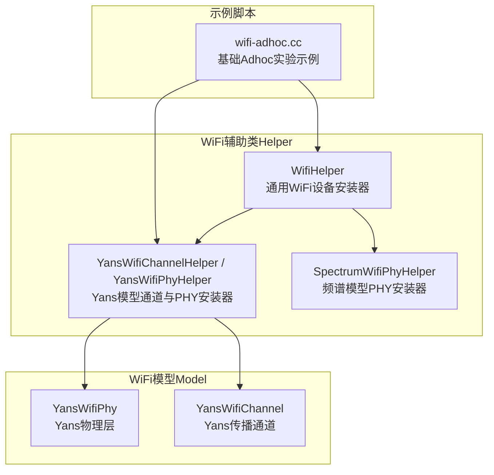
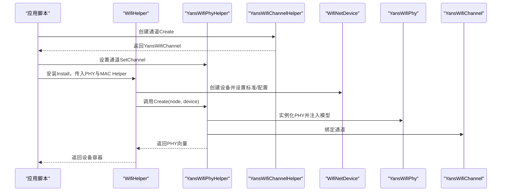
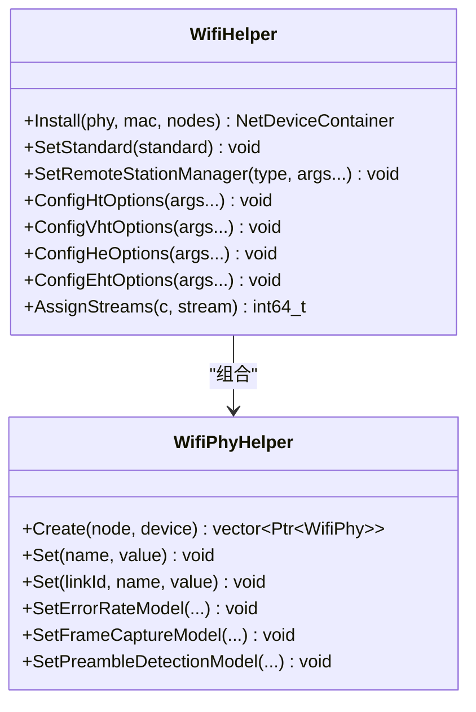
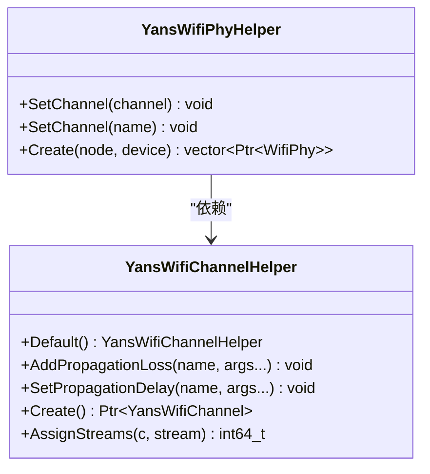
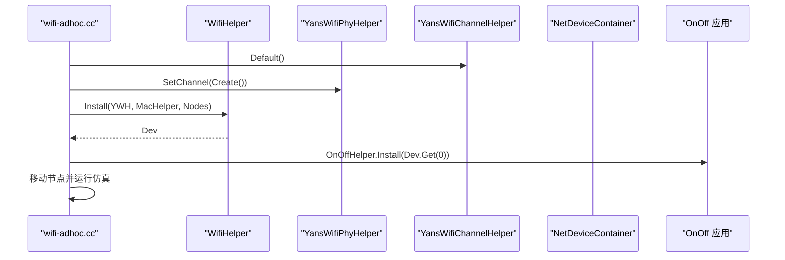
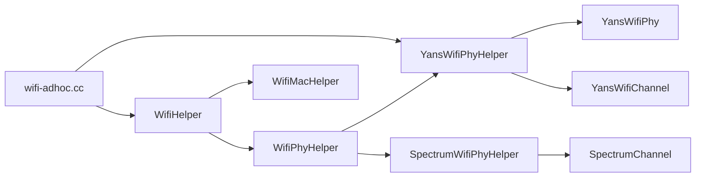

# WiFi辅助工具

<cite>
**本文引用的文件**
- [wifi-helper.h](file://simulator/ns-3.39/src/wifi/helper/wifi-helper.h)
- [wifi-helper.cc](file://simulator/ns-3.39/src/wifi/helper/wifi-helper.cc)
- [yans-wifi-helper.h](file://simulator/ns-3.39/src/wifi/helper/yans-wifi-helper.h)
- [yans-wifi-helper.cc](file://simulator/ns-3.39/src/wifi/helper/yans-wifi-helper.cc)
- [spectrum-wifi-helper.h](file://simulator/ns-3.39/src/wifi/helper/spectrum-wifi-helper.h)
- [spectrum-wifi-helper.cc](file://simulator/ns-3.39/src/wifi/helper/spectrum-wifi-helper.cc)
- [wifi-adhoc.cc](file://simulator/ns-3.39/examples/wireless/wifi-adhoc.cc)
- [yans-wifi-phy.h](file://simulator/ns-3.39/src/wifi/model/yans-wifi-phy.h)
- [yans-wifi-phy.cc](file://simulator/ns-3.39/src/wifi/model/yans-wifi-phy.cc)
</cite>

## 目录
1. [简介](#简介)
2. [项目结构](#项目结构)
3. [核心组件](#核心组件)
4. [架构总览](#架构总览)
5. [详细组件分析](#详细组件分析)
6. [依赖关系分析](#依赖关系分析)
7. [性能考虑](#性能考虑)
8. [故障排查指南](#故障排查指南)
9. [结论](#结论)
10. [附录](#附录)

## 简介
本文件面向使用NS-3进行WiFi仿真的工程师与研究者，系统化讲解WiFi辅助工具的实用技术，重点覆盖以下方面：
- WifiHelper、YansWifiHelper、SpectrumWifiPhyHelper等辅助类的职责与用法
- 网络设备创建、STA/AP配置、MAC层设置、PHY层参数配置
- 网络拓扑构建、节点部署、链路连接、参数批量设置
- WiFi网络快速搭建、配置模板、自动化部署技巧
- 典型网络场景配置示例、批量测试脚本思路、性能基准测试实践

目标是帮助读者在最短时间内掌握从“零”到“可用”的WiFi仿真流程，并具备扩展与优化能力。

## 项目结构
围绕WiFi仿真，本仓库中与“辅助工具”直接相关的核心目录与文件如下：
- 辅助类（Helper）：位于src/wifi/helper，包含通用WifiHelper、Yans模型专用YansWifiHelper、频谱模型专用SpectrumWifiHelper等
- 模型实现（Model）：位于src/wifi/model，包含YansWifiPhy等PHY模型
- 示例脚本：位于examples/wireless，包含wifi-adhoc.cc等可直接参考的完整脚本
- 关键头文件：helper与model的对外接口定义

图示来源
- [wifi-helper.h:323-529](file://simulator/ns-3.39/src/wifi/helper/wifi-helper.h#L323-L529)
- [yans-wifi-helper.h:38-151](file://simulator/ns-3.39/src/wifi/helper/yans-wifi-helper.h#L38-L151)
- [spectrum-wifi-helper.h:40-102](file://simulator/ns-3.39/src/wifi/helper/spectrum-wifi-helper.h#L40-L102)
- [wifi-adhoc.cc:162-210](file://simulator/ns-3.39/examples/wireless/wifi-adhoc.cc#L162-L210)

章节来源
- [wifi-helper.h:1-662](file://simulator/ns-3.39/src/wifi/helper/wifi-helper.h#L1-L662)
- [yans-wifi-helper.h:1-174](file://simulator/ns-3.39/src/wifi/helper/yans-wifi-helper.h#L1-L174)
- [spectrum-wifi-helper.h:1-107](file://simulator/ns-3.39/src/wifi/helper/spectrum-wifi-helper.h#L1-L107)
- [wifi-adhoc.cc:1-338](file://simulator/ns-3.39/examples/wireless/wifi-adhoc.cc#L1-L338)

## 核心组件
本节聚焦于三大核心辅助类及其职责边界与协作方式。

- WifiHelper
  - 职责：统一管理MAC与PHY对象的创建与安装；支持标准配置（如802.11a）、速率控制、HT/VHT/HE/EHT选项配置、流分配等
  - 关键点：Install接口接受WifiPhyHelper与WifiMacHelper，返回NetDeviceContainer；支持批量设置PHY属性、错误率模型、帧捕获模型、前导检测模型等
- YansWifiChannelHelper
  - 职责：构建Yans传播通道，支持传播损耗模型叠加与传播延迟模型配置
  - 关键点：默认构造与Default工厂方法；支持AddPropagationLoss、SetPropagationDelay、Create、AssignStreams
- YansWifiPhyHelper
  - 职责：为Yans模型创建PHY对象，绑定通道、干扰助手、错误率模型、帧捕获与前导检测模型
  - 关键点：SetChannel支持对象或名称；Create实现纯虚函数；默认使用InterferenceHelper与TableBasedErrorRateModel

章节来源
- [wifi-helper.h:323-529](file://simulator/ns-3.39/src/wifi/helper/wifi-helper.h#L323-L529)
- [wifi-helper.cc:755-800](file://simulator/ns-3.39/src/wifi/helper/wifi-helper.cc#L755-L800)
- [yans-wifi-helper.h:38-151](file://simulator/ns-3.39/src/wifi/helper/yans-wifi-helper.h#L38-L151)
- [yans-wifi-helper.cc:52-126](file://simulator/ns-3.39/src/wifi/helper/yans-wifi-helper.cc#L52-L126)

## 架构总览
下图展示从高层到底层的关键交互：应用通过WifiHelper安装设备，选择Yans或Spectrum模型，再由对应的Helper完成PHY与通道的装配。

图示来源
- [wifi-adhoc.cc:162-210](file://simulator/ns-3.39/examples/wireless/wifi-adhoc.cc#L162-L210)
- [wifi-helper.cc:755-800](file://simulator/ns-3.39/src/wifi/helper/wifi-helper.cc#L755-L800)
- [yans-wifi-helper.cc:105-126](file://simulator/ns-3.39/src/wifi/helper/yans-wifi-helper.cc#L105-L126)

## 详细组件分析

### WifiHelper：设备安装与批量配置
- 设备安装
  - 支持按节点容器、单个节点、节点名安装
  - 安装时根据标准设置HT/VHT/HE/EHT配置对象
- 批量属性设置
  - 通过Set系列方法对所有PHY或指定linkId的PHY设置属性
  - 支持错误率模型、帧捕获模型、前导检测模型的批量配置
- 远程站管理与OBSS-PD
  - 可配置速率控制算法（如ARF、AARF、Cara等）
  - 支持OBSS-PD算法配置与队列选择回调
- 随机流分配
  - AssignStreams用于固定随机变量流，便于复现实验

图示来源
- [wifi-helper.h:323-529](file://simulator/ns-3.39/src/wifi/helper/wifi-helper.h#L323-L529)
- [wifi-helper.cc:755-800](file://simulator/ns-3.39/src/wifi/helper/wifi-helper.cc#L755-L800)

章节来源
- [wifi-helper.h:323-529](file://simulator/ns-3.39/src/wifi/helper/wifi-helper.h#L323-L529)
- [wifi-helper.cc:725-747](file://simulator/ns-3.39/src/wifi/helper/wifi-helper.cc#L725-L747)

### YansWifiHelper：Yans模型的通道与PHY装配
- 通道构建
  - 默认传播延迟为光速常数模型
  - 默认传播损耗为对数距离模型
  - 支持叠加多个传播损耗模型与自定义传播延迟模型
- PHY装配
  - 默认使用InterferenceHelper与TableBasedErrorRateModel
  - 可选启用帧捕获与前导检测模型
  - 将通道绑定至PHY后返回

图示来源
- [yans-wifi-helper.h:38-151](file://simulator/ns-3.39/src/wifi/helper/yans-wifi-helper.h#L38-L151)
- [yans-wifi-helper.cc:52-126](file://simulator/ns-3.39/src/wifi/helper/yans-wifi-helper.cc#L52-L126)

章节来源
- [yans-wifi-helper.h:38-106](file://simulator/ns-3.39/src/wifi/helper/yans-wifi-helper.h#L38-L106)
- [yans-wifi-helper.cc:43-81](file://simulator/ns-3.39/src/wifi/helper/yans-wifi-helper.cc#L43-L81)

### SpectrumWifiHelper：频谱模型PHY装配
- 多通道支持
  - 支持为不同频率范围绑定不同SpectrumChannel
  - 自动为未带带宽过滤器的通道添加WifiBandwidthFilter
- 多链路支持
  - 构造时可指定nLinks，适配11be多链路场景
- 模型装配
  - 默认使用InterferenceHelper与TableBasedErrorRateModel
  - 注入MobilityModel与设备对象

章节来源
- [spectrum-wifi-helper.h:40-102](file://simulator/ns-3.39/src/wifi/helper/spectrum-wifi-helper.h#L40-L102)
- [spectrum-wifi-helper.cc:54-144](file://simulator/ns-3.39/src/wifi/helper/spectrum-wifi-helper.cc#L54-L144)

### 示例脚本：wifi-adhoc.cc 的关键流程
该脚本展示了从创建节点、安装PHY/通道、配置MAC、部署移动性、启动应用到输出结果的完整流程，是理解辅助类协同工作的最佳范例。

图示来源
- [wifi-adhoc.cc:162-210](file://simulator/ns-3.39/examples/wireless/wifi-adhoc.cc#L162-L210)

章节来源
- [wifi-adhoc.cc:212-337](file://simulator/ns-3.39/examples/wireless/wifi-adhoc.cc#L212-L337)

## 依赖关系分析
- WifiHelper依赖WifiPhyHelper与WifiMacHelper完成设备安装
- YansWifiPhyHelper依赖YansWifiChannel与多种模型（InterferenceHelper、ErrorRateModel、FrameCaptureModel、PreambleDetectionModel）
- SpectrumWifiPhyHelper依赖SpectrumChannel与WifiBandwidthFilter
- 示例脚本wifi-adhoc.cc串联了上述组件，形成端到端工作流

图示来源
- [wifi-helper.h:323-529](file://simulator/ns-3.39/src/wifi/helper/wifi-helper.h#L323-L529)
- [yans-wifi-helper.h:38-151](file://simulator/ns-3.39/src/wifi/helper/yans-wifi-helper.h#L38-L151)
- [spectrum-wifi-helper.h:40-102](file://simulator/ns-3.39/src/wifi/helper/spectrum-wifi-helper.h#L40-L102)
- [wifi-adhoc.cc:162-210](file://simulator/ns-3.39/examples/wireless/wifi-adhoc.cc#L162-L210)

章节来源
- [wifi-helper.h:323-529](file://simulator/ns-3.39/src/wifi/helper/wifi-helper.h#L323-L529)
- [yans-wifi-helper.h:38-151](file://simulator/ns-3.39/src/wifi/helper/yans-wifi-helper.h#L38-L151)
- [spectrum-wifi-helper.h:40-102](file://simulator/ns-3.39/src/wifi/helper/spectrum-wifi-helper.h#L40-L102)
- [wifi-adhoc.cc:162-210](file://simulator/ns-3.39/examples/wireless/wifi-adhoc.cc#L162-L210)

## 性能考虑
- 传播模型选择
  - Yans默认采用常速传播延迟与对数距离传播损耗，适合快速原型与教学演示
  - 复杂场景建议叠加更贴近实测的损耗模型（如TwoRayGround、Nakagami等），并注意模型叠加顺序
- 干扰与错误率
  - InterferenceHelper与TableBasedErrorRateModel组合简单高效，适合大规模仿真
  - 若需更高精度，可替换为基于S4TA或更精细的模型，但会增加计算开销
- 多链路与多通道
  - Spectrum模型支持多链路与多频段，合理划分频段可降低同频干扰
  - 建议在通道间设置合理的隔离度，避免带宽过滤器失效导致串扰
- 流分配与可重复性
  - 使用AssignStreams固定随机流，确保多次实验结果一致
- Trace输出
  - Pcap与ASCII Trace在高并发下会产生大量IO，建议按需开启或分设备输出

## 故障排查指南
- 安装阶段报错“未设置标准”
  - 症状：Install时报错提示未指定标准
  - 处理：调用SetStandard设置802.11a/…/802.11be之一
- 未设置PHY属性导致行为异常
  - 症状：速率控制、帧聚合、MU-MIMO等未生效
  - 处理：通过WifiHelper的ConfigHt/Vht/He/EhtOptions与WifiPhyHelper的Set系列方法批量配置
- 通道未正确绑定
  - 症状：PHY无法接收信号或传播损耗不正确
  - 处理：确认YansWifiPhyHelper::SetChannel已调用且通道对象有效
- Trace文件缺失或格式不符
  - 症状：Wireshark无法打开或缺少radiotap字段
  - 处理：检查SetPcapDataLinkType与DLT配置，必要时切换为IEEE802_11_RADIO

章节来源
- [wifi-helper.cc:768-772](file://simulator/ns-3.39/src/wifi/helper/wifi-helper.cc#L768-L772)
- [yans-wifi-helper.cc:92-103](file://simulator/ns-3.39/src/wifi/helper/yans-wifi-helper.cc#L92-L103)
- [wifi-helper.cc:543-565](file://simulator/ns-3.39/src/wifi/helper/wifi-helper.cc#L543-L565)

## 结论
通过WifiHelper、YansWifiHelper与SpectrumWifiHelper的协同，NS-3提供了从“设备安装”到“传播建模”的完整WiFi仿真路径。结合示例脚本与本文提供的配置模板与自动化思路，用户可以快速搭建典型场景并开展批量测试与性能评估。对于复杂场景，建议在传播模型、干扰与错误率模型上做精细化配置，并配合流分配与Trace策略提升仿真效率与可重复性。

## 附录

### 快速搭建清单（以Adhoc为例）
- 选择标准与MAC类型
  - 通过WifiHelper::SetStandard与WifiMacHelper设置Adhoc或STA/AP
- 配置PHY与通道
  - Yans模型：YansWifiChannelHelper::Default并Create，YansWifiPhyHelper::SetChannel绑定
  - 频谱模型：SpectrumWifiPhyHelper::SetChannel/AddChannel绑定SpectrumChannel
- 安装设备与应用
  - WifiHelper::Install返回设备容器，再通过OnOffHelper等安装应用
- 部署移动性与运行仿真
  - 使用MobilityHelper设置节点位置与运动轨迹，Simulator::Run执行

章节来源
- [wifi-adhoc.cc:221-228](file://simulator/ns-3.39/examples/wireless/wifi-adhoc.cc#L221-L228)
- [wifi-adhoc.cc:175-178](file://simulator/ns-3.39/examples/wireless/wifi-adhoc.cc#L175-L178)

### 典型场景配置要点
- 基础Adhoc
  - 标准：802.11a；MAC：Adhoc；PHY：Yans；通道：Default
- STA/AP基础
  - MAC：ApWifiMac/ StaWifiMac；SSID与关联参数通过WifiMacHelper设置
- 多速率对比
  - 通过SetRemoteStationManager设置不同速率控制算法或固定速率模式
- 多链路（11be）
  - Spectrum模型，设置nLinks并为不同频段绑定独立SpectrumChannel

章节来源
- [wifi-adhoc.cc:228-228](file://simulator/ns-3.39/examples/wireless/wifi-adhoc.cc#L228-L228)
- [wifi-helper.h:459-496](file://simulator/ns-3.39/src/wifi/helper/wifi-helper.h#L459-L496)

### 批量测试与自动化建议
- 参数扫描
  - 以数据速率、发射功率、节点密度、传播损耗为变量，循环调用示例脚本逻辑
- 输出汇总
  - 将吞吐量、丢包率、时延等指标写入文件，便于绘图与统计
- 并行执行
  - 使用外部调度器并行运行多个脚本实例，注意固定随机流避免冲突

### 性能基准测试实践
- 基线测试
  - 固定拓扑与参数，记录吞吐与时延，作为后续改动的对照
- 变量对比
  - 单变量变化（如信道宽度、空间流数），保持其他条件一致
- Trace与可视化
  - 启用Pcap/ASCII Trace，结合Wireshark/Gnuplot进行分析