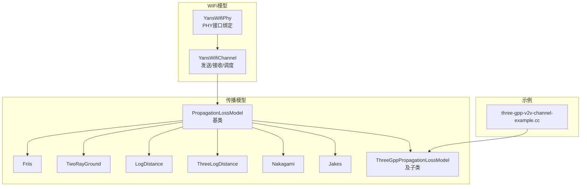
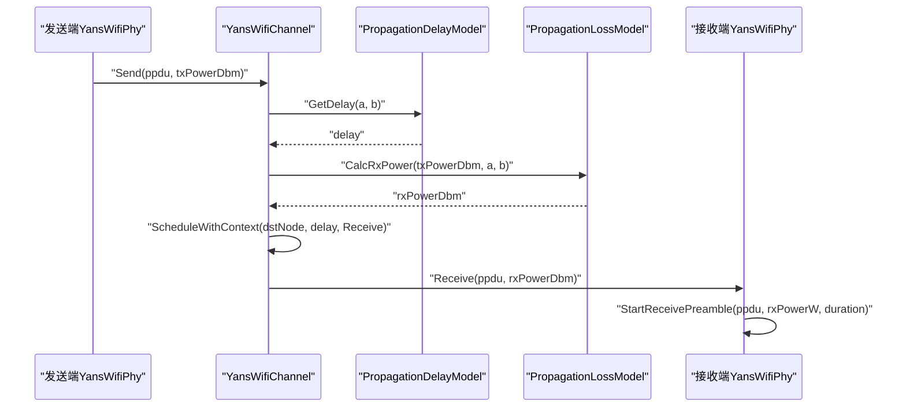
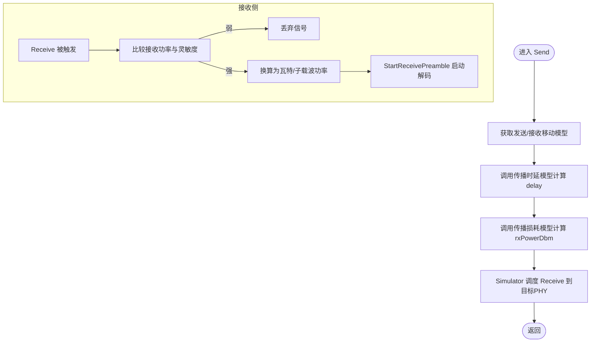
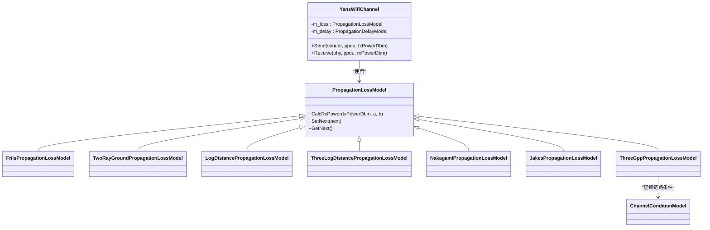

# 信道与传播模型

<cite>
**本文引用的文件**
- [yans-wifi-channel.cc](file://simulator/ns-3.39/src/wifi/model/yans-wifi-channel.cc)
- [yans-wifi-channel.h](file://simulator/ns-3.39/src/wifi/model/yans-wifi-channel.h)
- [yans-wifi-phy.h](file://simulator/ns-3.39/src/wifi/model/yans-wifi-phy.h)
- [propagation-loss-model.cc](file://simulator/ns-3.39/src/propagation/model/propagation-loss-model.cc)
- [jakes-propagation-loss-model.cc](file://simulator/ns-3.39/src/propagation/model/jakes-propagation-loss-model.cc)
- [three-gpp-propagation-loss-model.cc](file://simulator/ns-3.39/src/propagation/model/three-gpp-propagation-loss-model.cc)
- [three-gpp-v2v-channel-example.cc](file://simulator/ns-3.39/examples/channel-models/three-gpp-v2v-channel-example.cc)
</cite>

## 目录
1. [引言](#引言)
2. [项目结构](#项目结构)
3. [核心组件](#核心组件)
4. [架构总览](#架构总览)
5. [详细组件分析](#详细组件分析)
6. [依赖关系分析](#依赖关系分析)
7. [性能考量](#性能考量)
8. [故障排查指南](#故障排查指南)
9. [结论](#结论)
10. [附录：配置与仿真建议](#附录配置与仿真建议)

## 引言
本文件面向需要在NS-3中进行WiFi信道与传播建模的研究者与工程师，系统梳理YansWifiChannel的实现机制，并结合多种传播模型（自由空间、对射线、日志距离、三段日志距离、Nakagami、Jakes快衰落、3GPP宏/微/室分场景）给出建模方法、参数配置、干扰与覆盖分析的实践建议。文档同时覆盖MIMO与空间相关性、波束赋形等高级特性在当前Yans模型下的适用范围与扩展思路。

## 项目结构
围绕WiFi传播与信道的关键目录与文件如下：
- WiFi物理层与信道：src/wifi/model 下的 yans-wifi-channel.*、yans-wifi-phy.*
- 传播模型基类与具体实现：src/propagation/model 下的 propagation-loss-model.cc、jakes-propagation-loss-model.cc、three-gpp-propagation-loss-model.cc 等
- 示例：examples/channel-models 下的 three-gpp-v2v-channel-example.cc

图示来源
- [yans-wifi-channel.cc:90-150](file://simulator/ns-3.39/src/wifi/model/yans-wifi-channel.cc#L90-L150)
- [yans-wifi-phy.h:47-81](file://simulator/ns-3.39/src/wifi/model/yans-wifi-phy.h#L47-L81)
- [propagation-loss-model.cc:72-95](file://simulator/ns-3.39/src/propagation/model/propagation-loss-model.cc#L72-L95)
- [jakes-propagation-loss-model.cc:60-80](file://simulator/ns-3.39/src/propagation/model/jakes-propagation-loss-model.cc#L60-L80)
- [three-gpp-propagation-loss-model.cc:154-212](file://simulator/ns-3.39/src/propagation/model/three-gpp-propagation-loss-model.cc#L154-L212)
- [three-gpp-v2v-channel-example.cc](file://simulator/ns-3.39/examples/channel-models/three-gpp-v2v-channel-example.cc)

章节来源
- [yans-wifi-channel.cc:1-181](file://simulator/ns-3.39/src/wifi/model/yans-wifi-channel.cc#L1-L181)
- [yans-wifi-channel.h:1-124](file://simulator/ns-3.39/src/wifi/model/yans-wifi-channel.h#L1-L124)
- [yans-wifi-phy.h:1-86](file://simulator/ns-3.39/src/wifi/model/yans-wifi-phy.h#L1-L86)
- [propagation-loss-model.cc:1-960](file://simulator/ns-3.39/src/propagation/model/propagation-loss-model.cc#L1-L960)
- [jakes-propagation-loss-model.cc:1-96](file://simulator/ns-3.39/src/propagation/model/jakes-propagation-loss-model.cc#L1-L96)
- [three-gpp-propagation-loss-model.cc:1-1396](file://simulator/ns-3.39/src/propagation/model/three-gpp-propagation-loss-model.cc#L1-L1396)
- [three-gpp-v2v-channel-example.cc](file://simulator/ns-3.39/examples/channel-models/three-gpp-v2v-channel-example.cc)

## 核心组件
- YansWifiChannel：负责在多个YansWifiPhy之间广播PPDU，基于传播延迟模型计算时延并调度接收；基于传播损耗模型计算接收功率，再调用对应PHY开始解码。
- 传播损耗模型：提供统一接口 CalcRxPower(txPower, a, b)，支持链式组合（SetNext），内置多种典型模型（Friis、Two-Ray Ground、Log-Distance、Three-Log-Distance、Nakagami、固定RSS等）。
- Jakes传播模型：引入随机过程缓存，为每条链路生成快衰落增益，适合移动场景的瑞利/莱斯衰落建模。
- 3GPP传播模型：按LOS/NLOS/不确定条件分别计算路径损耗，支持阴影衰落、室内穿透损耗、频段与场景参数化（如UMa/RMa等）。

章节来源
- [yans-wifi-channel.cc:90-150](file://simulator/ns-3.39/src/wifi/model/yans-wifi-channel.cc#L90-L150)
- [yans-wifi-channel.h:45-124](file://simulator/ns-3.39/src/wifi/model/yans-wifi-channel.h#L45-L124)
- [propagation-loss-model.cc:72-95](file://simulator/ns-3.39/src/propagation/model/propagation-loss-model.cc#L72-L95)
- [jakes-propagation-loss-model.cc:60-80](file://simulator/ns-3.39/src/propagation/model/jakes-propagation-loss-model.cc#L60-L80)
- [three-gpp-propagation-loss-model.cc:154-212](file://simulator/ns-3.39/src/propagation/model/three-gpp-propagation-loss-model.cc#L154-L212)

## 架构总览
YansWifiChannel作为中心枢纽，连接多个YansWifiPhy节点，通过PropagationDelayModel获取传播时延，通过PropagationLossModel计算接收功率，最终以Simulator::ScheduleWithContext调度到目标PHY的StartReceivePreamble。

图示来源
- [yans-wifi-channel.cc:90-150](file://simulator/ns-3.39/src/wifi/model/yans-wifi-channel.cc#L90-L150)
- [yans-wifi-phy.h:60-74](file://simulator/ns-3.39/src/wifi/model/yans-wifi-phy.h#L60-L74)

## 详细组件分析

### YansWifiChannel 实现要点
- 发送流程：遍历同信道PHY列表，排除自身与不同频道，计算传播时延与接收功率后调度接收。
- 接收流程：若接收功率低于灵敏度阈值则丢弃；否则转换为瓦特/子载波功率谱密度，启动PHY解码。
- 流程控制：使用Simulator::ScheduleWithContext将接收事件绑定到目标节点上下文，便于统计与追踪。

图示来源
- [yans-wifi-channel.cc:90-150](file://simulator/ns-3.39/src/wifi/model/yans-wifi-channel.cc#L90-L150)

章节来源
- [yans-wifi-channel.cc:90-150](file://simulator/ns-3.39/src/wifi/model/yans-wifi-channel.cc#L90-L150)
- [yans-wifi-channel.h:64-118](file://simulator/ns-3.39/src/wifi/model/yans-wifi-channel.h#L64-L118)

### 传播损耗模型族
- 基类接口：PropagationLossModel 提供 CalcRxPower 链式组合能力，支持通过 SetNext 连接多个模型。
- 经典模型：
  - Friis：自由空间路径损耗，适用于开阔场景。
  - Two-Ray Ground：考虑地面反射的对射线模型，适合近距与天线高度已知场景。
  - Log-Distance/Three-Log-Distance：经验指数路径损耗，适合市区/郊区等复杂环境。
  - Nakagami：多径散射下的衰落分布，适合非视距或城市峡谷。
  - 固定RSS/矩阵/范围模型：用于简化或特定拓扑场景。
- 快衰落（Jakes）：为每条链路维护随机过程缓存，周期性更新快衰落增益，适合移动UE场景。
- 3GPP模型：按场景（UMa/RMa/UMi等）与LOS/NLOS条件计算路径损耗，叠加阴影与室内穿透损耗，支持参数范围校验与可选强制约束。

章节来源
- [propagation-loss-model.cc:72-95](file://simulator/ns-3.39/src/propagation/model/propagation-loss-model.cc#L72-L95)
- [propagation-loss-model.cc:146-288](file://simulator/ns-3.39/src/propagation/model/propagation-loss-model.cc#L146-L288)
- [propagation-loss-model.cc:291-469](file://simulator/ns-3.39/src/propagation/model/propagation-loss-model.cc#L291-L469)
- [propagation-loss-model.cc:473-561](file://simulator/ns-3.39/src/propagation/model/propagation-loss-model.cc#L473-L561)
- [propagation-loss-model.cc:565-660](file://simulator/ns-3.39/src/propagation/model/propagation-loss-model.cc#L565-L660)
- [propagation-loss-model.cc:664-777](file://simulator/ns-3.39/src/propagation/model/propagation-loss-model.cc#L664-L777)
- [propagation-loss-model.cc:781-825](file://simulator/ns-3.39/src/propagation/model/propagation-loss-model.cc#L781-L825)
- [propagation-loss-model.cc:829-910](file://simulator/ns-3.39/src/propagation/model/propagation-loss-model.cc#L829-L910)
- [propagation-loss-model.cc:914-955](file://simulator/ns-3.39/src/propagation/model/propagation-loss-model.cc#L914-L955)
- [jakes-propagation-loss-model.cc:60-80](file://simulator/ns-3.39/src/propagation/model/jakes-propagation-loss-model.cc#L60-L80)
- [three-gpp-propagation-loss-model.cc:154-212](file://simulator/ns-3.39/src/propagation/model/three-gpp-propagation-loss-model.cc#L154-L212)

### 3GPP V2V 场景示例
- 示例脚本展示了如何配置3GPP V2V传播模型、通道条件模型与随机变量流，适合车对车通信的阴影与穿透损耗评估。
- 建议：根据场景选择合适频率与街道宽度/建筑高度参数，启用/禁用阴影与室内穿透，合理设置参数范围强制策略。

章节来源
- [three-gpp-v2v-channel-example.cc](file://simulator/ns-3.39/examples/channel-models/three-gpp-v2v-channel-example.cc)

## 依赖关系分析
- YansWifiChannel 依赖 PropagationDelayModel 与 PropagationLossModel 的组合，二者均继承自 Object 并可被外部注入。
- 传播模型内部可链式组合（SetNext），形成“先做快衰落，再做路径损耗”的处理序列。
- 3GPP模型依赖 ChannelConditionModel 提供LOS/NLOS/O2I等状态，并据此查表/查公式计算路径损耗与阴影。

图示来源
- [yans-wifi-channel.h:45-118](file://simulator/ns-3.39/src/wifi/model/yans-wifi-channel.h#L45-L118)
- [propagation-loss-model.cc:43-95](file://simulator/ns-3.39/src/propagation/model/propagation-loss-model.cc#L43-L95)
- [three-gpp-propagation-loss-model.cc:118-129](file://simulator/ns-3.39/src/propagation/model/three-gpp-propagation-loss-model.cc#L118-L129)

章节来源
- [yans-wifi-channel.h:45-118](file://simulator/ns-3.39/src/wifi/model/yans-wifi-channel.h#L45-L118)
- [propagation-loss-model.cc:43-95](file://simulator/ns-3.39/src/propagation/model/propagation-loss-model.cc#L43-L95)
- [three-gpp-propagation-loss-model.cc:118-129](file://simulator/ns-3.39/src/propagation/model/three-gpp-propagation-loss-model.cc#L118-L129)

## 性能考量
- 计算开销
  - 传播时延与损耗计算通常为常数级，瓶颈主要在链路数量与Simulator调度次数。
  - 3GPP模型包含阴影与穿透损耗的缓存与正态/均匀随机变量生成，需关注流分配与重复计算。
- 内存占用
  - 3GPP模型维护阴影/穿透损耗映射表，节点/链路增多时内存线性增长。
- 并发与流一致性
  - AssignStreams确保随机源可复现且不冲突；链式模型会累加分配的流数量。

章节来源
- [yans-wifi-channel.cc:171-178](file://simulator/ns-3.39/src/wifi/model/yans-wifi-channel.cc#L171-L178)
- [propagation-loss-model.cc:85-95](file://simulator/ns-3.39/src/propagation/model/propagation-loss-model.cc#L85-L95)
- [three-gpp-propagation-loss-model.cc:482-494](file://simulator/ns-3.39/src/propagation/model/three-gpp-propagation-loss-model.cc#L482-L494)

## 故障排查指南
- 信号过弱被丢弃
  - 现象：接收端日志提示“Received signal too weak to process”。
  - 排查：检查TX功率、路径损耗模型参数、天线增益与带宽扩展损耗（单位带宽灵敏度）。
- 传播模型未生效
  - 现象：路径损耗恒定或异常。
  - 排查：确认是否正确设置 PropagationLossModel 与 PropagationDelayModel；链式模型顺序是否合理。
- 3GPP模型报错/警告
  - 现象：高度/距离超出范围、频率越界、断点距离为零等。
  - 排查：核对场景参数（如RMa/UMa）、频率范围、节点高度与距离范围；必要时开启参数范围强制策略。
- 快衰落不变化
  - 现象：Jakes模型增益长期不变。
  - 排查：检查随机变量流分配与时间步长，确认缓存键与链路标识一致。

章节来源
- [yans-wifi-channel.cc:134-150](file://simulator/ns-3.39/src/wifi/model/yans-wifi-channel.cc#L134-L150)
- [propagation-loss-model.cc:72-95](file://simulator/ns-3.39/src/propagation/model/propagation-loss-model.cc#L72-L95)
- [three-gpp-propagation-loss-model.cc:598-627](file://simulator/ns-3.39/src/propagation/model/three-gpp-propagation-loss-model.cc#L598-L627)
- [three-gpp-propagation-loss-model.cc:132-145](file://simulator/ns-3.39/src/propagation/model/three-gpp-propagation-loss-model.cc#L132-L145)

## 结论
YansWifiChannel通过清晰的接口与灵活的传播模型组合，为WiFi仿真提供了从自由空间到复杂城市环境的全场景覆盖。对于需要更精细MIMO与空间相关性建模的应用，可在现有基础上扩展阵列天线模型与空间相关函数；对于V2X与高移动性场景，3GPP模型与Jakes快衰落提供了贴近标准的实现基础。

## 附录：配置与仿真建议

### 传播模型参数配置建议
- 自由空间（Friis）
  - 适用：开阔区域、远距、无遮挡。
  - 关键参数：频率、系统损耗、最小损失。
  - 参考实现位置：[propagation-loss-model.cc:146-288](file://simulator/ns-3.39/src/propagation/model/propagation-loss-model.cc#L146-L288)
- 对射线（Two-Ray Ground）
  - 适用：近距、地面反射显著、天线高度明确。
  - 关键参数：频率、系统损耗、最小距离、天线高度。
  - 参考实现位置：[propagation-loss-model.cc:291-469](file://simulator/ns-3.39/src/propagation/model/propagation-loss-model.cc#L291-L469)
- 日志距离（LogDistance/Three-Log-Distance）
  - 适用：市区/郊区等经验模型，支持多段指数。
  - 关键参数：指数、参考距离与参考损耗、分段边界与指数。
  - 参考实现位置：[propagation-loss-model.cc:473-561](file://simulator/ns-3.39/src/propagation/model/propagation-loss-model.cc#L473-L561), [propagation-loss-model.cc:565-660](file://simulator/ns-3.39/src/propagation/model/propagation-loss-model.cc#L565-L660)
- 衰落（Nakagami）
  - 适用：非视距或城市峡谷等多径散射。
  - 关键参数：分段m参数、距离边界。
  - 参考实现位置：[propagation-loss-model.cc:664-777](file://simulator/ns-3.39/src/propagation/model/propagation-loss-model.cc#L664-L777)
- 快衰落（Jakes）
  - 适用：移动UE、快速时变信道。
  - 关键参数：均匀随机变量、缓存键管理。
  - 参考实现位置：[jakes-propagation-loss-model.cc:60-80](file://simulator/ns-3.39/src/propagation/model/jakes-propagation-loss-model.cc#L60-L80)
- 3GPP（UMa/RMa/UMi）
  - 适用：蜂窝/车联网标准场景。
  - 关键参数：频率、阴影开关、室内穿透开关、场景参数（如RMa的街道宽/建筑高）。
  - 参考实现位置：[three-gpp-propagation-loss-model.cc:154-212](file://simulator/ns-3.39/src/propagation/model/three-gpp-propagation-loss-model.cc#L154-L212), [three-gpp-propagation-loss-model.cc:592-706](file://simulator/ns-3.39/src/propagation/model/three-gpp-propagation-loss-model.cc#L592-L706)

### MIMO与空间相关性
- 当前Yans模型以单流链路为主，未直接提供MIMO信道矩阵与空间相关性。
- 建议：结合阵列天线模型与空间相关函数（如Kronecker/几何相关模型）扩展，或在更高层（如Spectrum模型）实现MIMO矩阵通道。

### 波束赋形
- 可通过自定义天线模型（方向图）与指向性增益，在传播损耗中体现波束赋形增益。
- 注意：需与移动模型配合，确保角度随时间变化。

### 干扰分析与覆盖估算
- 干扰：利用链路集合与传播损耗计算各链路接收功率，叠加噪声与干扰功率，评估SINR。
- 覆盖：设定接收灵敏度阈值，反推最大传输距离；结合阴影与穿透损耗得到概率覆盖半径。

### 仿真示例与脚本
- 3GPP V2V 示例脚本展示了模型装配与流分配，可作为起点进行参数扫描与场景对比。
- 参考位置：[three-gpp-v2v-channel-example.cc](file://simulator/ns-3.39/examples/channel-models/three-gpp-v2v-channel-example.cc)