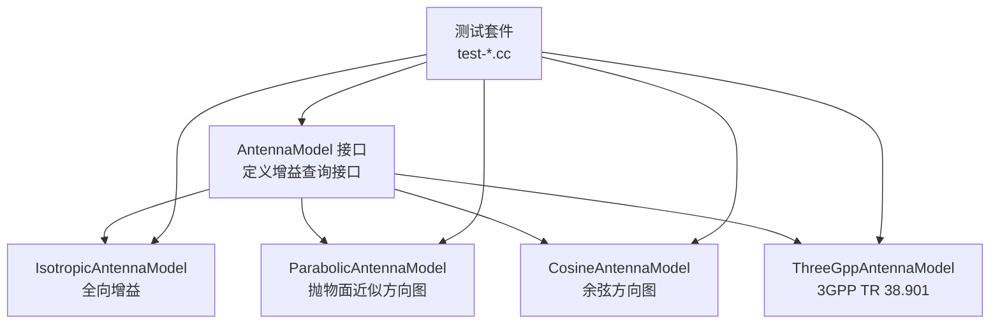
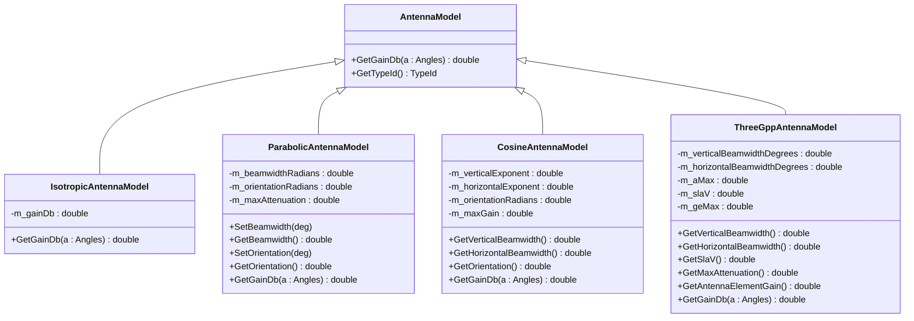
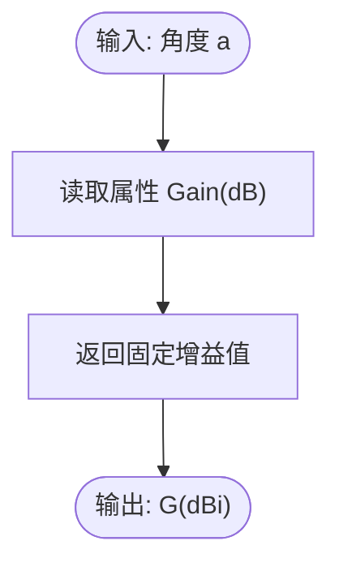
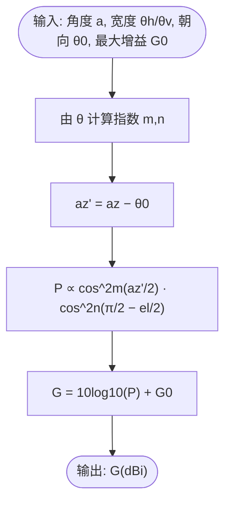
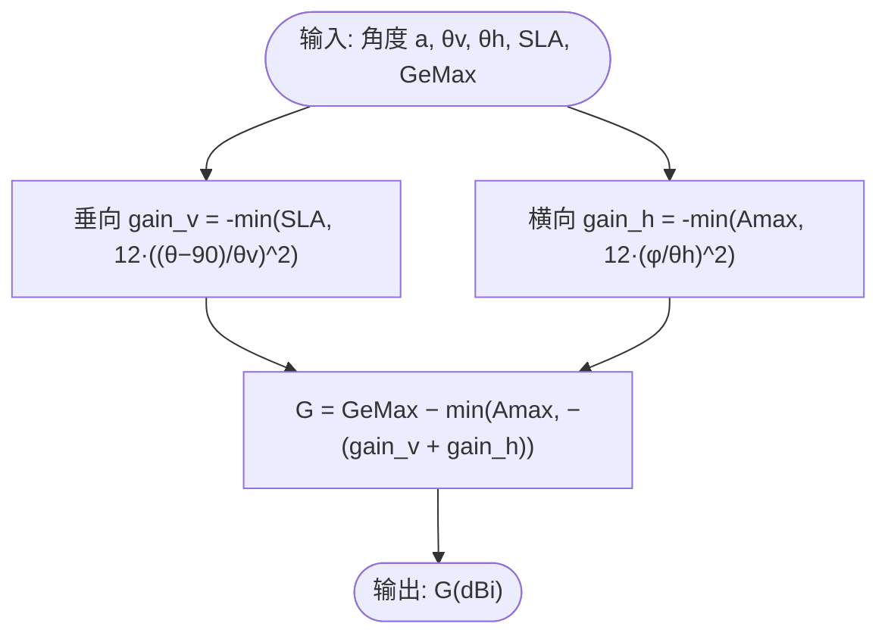
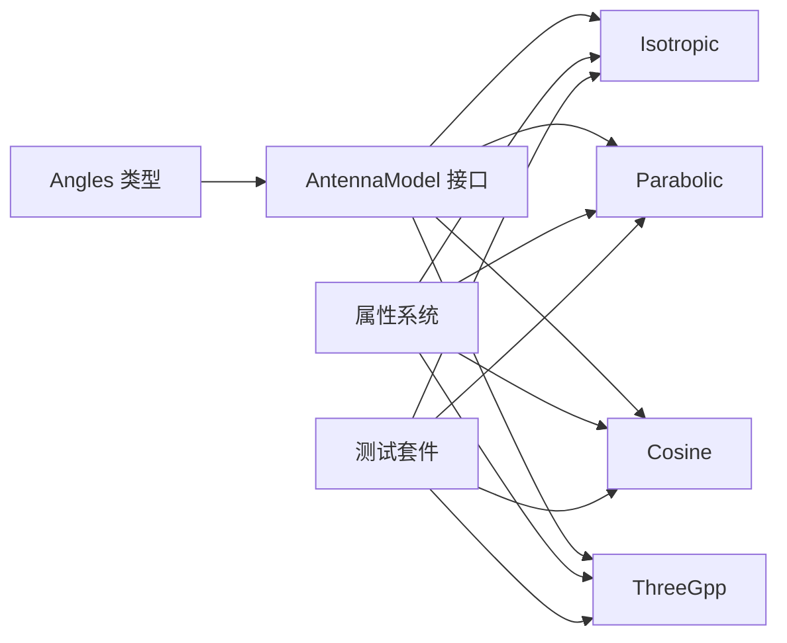

# 天线模型

<cite>
**本文引用的文件**
- [antenna-model.h](file://simulator/ns-3.39/src/antenna/model/antenna-model.h)
- [antenna-model.cc](file://simulator/ns-3.39/src/antenna/model/antenna-model.cc)
- [isotropic-antenna-model.h](file://simulator/ns-3.39/src/antenna/model/isotropic-antenna-model.h)
- [isotropic-antenna-model.cc](file://simulator/ns-3.39/src/antenna/model/isotropic-antenna-model.cc)
- [parabolic-antenna-model.h](file://simulator/ns-3.39/src/antenna/model/parabolic-antenna-model.h)
- [parabolic-antenna-model.cc](file://simulator/ns-3.39/src/antenna/model/parabolic-antenna-model.cc)
- [cosine-antenna-model.h](file://simulator/ns-3.39/src/antenna/model/cosine-antenna-model.h)
- [cosine-antenna-model.cc](file://simulator/ns-3.39/src/antenna/model/cosine-antenna-model.cc)
- [three-gpp-antenna-model.h](file://simulator/ns-3.39/src/antenna/model/three-gpp-antenna-model.h)
- [three-gpp-antenna-model.cc](file://simulator/ns-3.39/src/antenna/model/three-gpp-antenna-model.cc)
- [test-isotropic-antenna.cc](file://simulator/ns-3.39/src/antenna/test/test-isotropic-antenna.cc)
- [test-parabolic-antenna.cc](file://simulator/ns-3.39/src/antenna/test/test-parabolic-antenna.cc)
- [test-cosine-antenna.cc](file://simulator/ns-3.39/src/antenna/test/test-cosine-antenna.cc)
</cite>

## 目录
1. [简介](#简介)
2. [项目结构](#项目结构)
3. [核心组件](#核心组件)
4. [架构总览](#架构总览)
5. [详细组件分析](#详细组件分析)
6. [依赖关系分析](#依赖关系分析)
7. [性能与数值特性](#性能与数值特性)
8. [参数配置与使用示例](#参数配置与使用示例)
9. [故障排查指南](#故障排查指南)
10. [结论](#结论)

## 简介
本文件系统性梳理 NS-3 中的天线模块，围绕各类天线模型的数学原理、实现机制与仿真接口进行深入解析，覆盖如下主题：
- 各向同性天线、偶极（线）简化模型、抛物面近似模型、余弦模型、3GPP 规范模型的辐射特性与增益计算
- 方向图、增益、极化与波束指向控制的实现方式
- MIMO 天线配置、空间复用增益、波束成形与智能天线思路在该模块中的落地路径
- 参数配置、性能测试与角度估计的实践方法与优化建议

## 项目结构
天线模块位于 NS-3 源码树的 antenna 子目录中，采用“接口 + 多种具体模型”的分层设计：
- 接口层：AntennaModel 抽象类定义统一的增益查询接口
- 具体模型：各向同性、抛物面、余弦、3GPP 模型分别实现不同的方向图函数
- 测试套件：对各模型在典型角度与参数下的增益进行回归验证



图表来源
- [antenna-model.h:53-77](file://simulator/ns-3.39/src/antenna/model/antenna-model.h#L53-L77)
- [isotropic-antenna-model.h:36-56](file://simulator/ns-3.39/src/antenna/model/isotropic-antenna-model.h#L36-L56)
- [parabolic-antenna-model.h:45-83](file://simulator/ns-3.39/src/antenna/model/parabolic-antenna-model.h#L45-L83)
- [cosine-antenna-model.h:49-116](file://simulator/ns-3.39/src/antenna/model/cosine-antenna-model.h#L49-L116)
- [three-gpp-antenna-model.h:32-85](file://simulator/ns-3.39/src/antenna/model/three-gpp-antenna-model.h#L32-L85)
- [test-isotropic-antenna.cc:36-112](file://simulator/ns-3.39/src/antenna/test/test-isotropic-antenna.cc#L36-L112)
- [test-parabolic-antenna.cc:51-596](file://simulator/ns-3.39/src/antenna/test/test-parabolic-antenna.cc#L51-L596)
- [test-cosine-antenna.cc:51-728](file://simulator/ns-3.39/src/antenna/test/test-cosine-antenna.cc#L51-L728)

章节来源
- [antenna-model.h:29-77](file://simulator/ns-3.39/src/antenna/model/antenna-model.h#L29-L77)
- [antenna-model.cc:29-48](file://simulator/ns-3.39/src/antenna/model/antenna-model.cc#L29-L48)

## 核心组件
- AntennaModel 抽象接口：定义类型标识与纯虚函数 GetGainDb(Angles)，所有具体模型均实现该接口以返回 dBi 增益值
- 各向同性天线 IsotropicAntennaModel：固定增益，常用于无方向性假设或基线对比
- 抛物面天线 ParabolicAntennaModel：基于抛物面近似的二次函数方向图，支持 3 dB 波束宽度与方位朝向设置
- 余弦天线 CosineAntennaModel：水平与垂直方向分别使用余弦幂函数建模，支持双向 3 dB 波束宽度、方位朝向与最大增益
- 3GPP 天线 ThreeGppAntennaModel：依据 3GPP TR 38.901 的三维方向图公式，提供垂直/水平波束宽度、侧瓣衰减、最大增益等参数

章节来源
- [antenna-model.h:53-77](file://simulator/ns-3.39/src/antenna/model/antenna-model.h#L53-L77)
- [isotropic-antenna-model.h:36-56](file://simulator/ns-3.39/src/antenna/model/isotropic-antenna-model.h#L36-L56)
- [parabolic-antenna-model.h:45-83](file://simulator/ns-3.39/src/antenna/model/parabolic-antenna-model.h#L45-L83)
- [cosine-antenna-model.h:49-116](file://simulator/ns-3.39/src/antenna/model/cosine-antenna-model.h#L49-L116)
- [three-gpp-antenna-model.h:32-85](file://simulator/ns-3.39/src/antenna/model/three-gpp-antenna-model.h#L32-L85)

## 架构总览
下图展示天线模型的类层次与依赖关系，以及测试套件如何调用各模型进行验证。



图表来源
- [antenna-model.h:53-77](file://simulator/ns-3.39/src/antenna/model/antenna-model.h#L53-L77)
- [isotropic-antenna-model.h:36-56](file://simulator/ns-3.39/src/antenna/model/isotropic-antenna-model.h#L36-L56)
- [parabolic-antenna-model.h:45-83](file://simulator/ns-3.39/src/antenna/model/parabolic-antenna-model.h#L45-L83)
- [cosine-antenna-model.h:49-116](file://simulator/ns-3.39/src/antenna/model/cosine-antenna-model.h#L49-L116)
- [three-gpp-antenna-model.h:32-85](file://simulator/ns-3.39/src/antenna/model/three-gpp-antenna-model.h#L32-L85)

## 详细组件分析

### 各向同性天线模型
- 数学原理：全向辐射，增益恒定，不随方向变化
- 实现要点：
  - 属性 Gain（dB）通过属性系统暴露，可直接设置
  - GetGainDb 返回固定值，便于作为基线或无方向性场景
- 使用场景：链路预算对比、无方向性假设、简单验证



图表来源
- [isotropic-antenna-model.cc:54-59](file://simulator/ns-3.39/src/antenna/model/isotropic-antenna-model.cc#L54-L59)

章节来源
- [isotropic-antenna-model.h:36-56](file://simulator/ns-3.39/src/antenna/model/isotropic-antenna-model.h#L36-L56)
- [isotropic-antenna-model.cc:34-61](file://simulator/ns-3.39/src/antenna/model/isotropic-antenna-model.cc#L34-L61)

### 抛物面天线模型
- 数学原理：以二次函数近似主瓣方向图，增益随方位角偏离呈平方衰减；支持最大衰减上限
- 关键参数：
  - 3 dB 波束宽度（度）
  - 方位朝向（度）
  - 最大衰减（dB）
- 实现要点：
  - 将输入角度转换为相对天线坐标系的方位差，并归一到 (-π, π]
  - 计算衰减值 min(12*(φ/W)^2, A_max)，其中 W 为波束宽度
- 使用场景：扇区基站、定向覆盖、波束倾斜控制

```mermaid
flowchart TD
S(["输入: 角度 a, 波束宽度 W, 朝向 θ0, 最大衰减 Amax"]) --> Delta["φ = φ_a - θ0"]
Delta --> Wrap["归一到 (-π, π]")
Wrap --> Compute["gain = -min(12*(φ/W)^2, Amax)"]
Compute --> O(["输出: G(dBi)"])
```

图表来源
- [parabolic-antenna-model.cc:91-114](file://simulator/ns-3.39/src/antenna/model/parabolic-antenna-model.cc#L91-L114)

章节来源
- [parabolic-antenna-model.h:45-83](file://simulator/ns-3.39/src/antenna/model/parabolic-antenna-model.h#L45-L83)
- [parabolic-antenna-model.cc:36-117](file://simulator/ns-3.39/src/antenna/model/parabolic-antenna-model.cc#L36-L117)

### 余弦天线模型
- 数学原理：水平与垂直方向分别使用余弦幂函数建模，方向图为 P(az,el) ∝ cos^2m(az/2)·cos^2n((π/2−el)/2)
- 关键参数：
  - 水平/垂直 3 dB 波束宽度（度）
  - 方位朝向（度）
  - 最大增益（dB）
- 实现要点：
  - 通过波束宽度与 -3 dB 条件反推指数 m、n
  - 支持方位角偏移与最大增益叠加
- 使用场景：板状天线、平板阵列、工程化估算



图表来源
- [cosine-antenna-model.cc:147-167](file://simulator/ns-3.39/src/antenna/model/cosine-antenna-model.cc#L147-L167)

章节来源
- [cosine-antenna-model.h:49-116](file://simulator/ns-3.39/src/antenna/model/cosine-antenna-model.h#L49-L116)
- [cosine-antenna-model.cc:36-170](file://simulator/ns-3.39/src/antenna/model/cosine-antenna-model.cc#L36-L170)

### 3GPP 天线模型
- 数学原理：依据 3GPP TR 38.901 的表格 7.3-1，分别计算垂直与水平切片的衰减，再合成三维方向图
- 关键参数：
  - 垂直/水平 3 dB 波束宽度（度）
  - 侧瓣衰减（dB）
  - 最大方向增益（dB）
- 实现要点：
  - 对每个切片使用 -min(SLA 或 12·(Δ/θ)^2) 计算衰减
  - 三维合成时取两切片衰减之和的最小值，避免负号叠加错误
- 使用场景：Sub-6 GHz 与毫米波场景下的标准规范建模



图表来源
- [three-gpp-antenna-model.cc:87-112](file://simulator/ns-3.39/src/antenna/model/three-gpp-antenna-model.cc#L87-L112)

章节来源
- [three-gpp-antenna-model.h:32-85](file://simulator/ns-3.39/src/antenna/model/three-gpp-antenna-model.h#L32-L85)
- [three-gpp-antenna-model.cc:34-115](file://simulator/ns-3.39/src/antenna/model/three-gpp-antenna-model.cc#L34-L115)

### 接口与对象注册
- AntennaModel 提供统一类型标识与抽象接口
- 各子类通过 NS_OBJECT_ENSURE_REGISTERED 完成对象注册，配合属性系统暴露参数

章节来源
- [antenna-model.cc:29-48](file://simulator/ns-3.39/src/antenna/model/antenna-model.cc#L29-L48)
- [isotropic-antenna-model.cc:34-47](file://simulator/ns-3.39/src/antenna/model/isotropic-antenna-model.cc#L34-L47)
- [parabolic-antenna-model.cc:36-63](file://simulator/ns-3.39/src/antenna/model/parabolic-antenna-model.cc#L36-L63)
- [cosine-antenna-model.cc:36-71](file://simulator/ns-3.39/src/antenna/model/cosine-antenna-model.cc#L36-L71)
- [three-gpp-antenna-model.cc:34-42](file://simulator/ns-3.39/src/antenna/model/three-gpp-antenna-model.cc#L34-L42)

## 依赖关系分析
- 组件耦合：
  - 所有模型均继承自 AntennaModel，保持接口一致性
  - 模型内部仅依赖数学库与 NS-3 类型系统，内聚性高
- 外部依赖：
  - Angles 类型（方位/倾角）用于输入
  - 属性系统（AddAttribute/AddConstructor）用于参数配置
- 测试依赖：
  - 测试套件通过 CreateObject 创建实例并设置属性后调用 GetGainDb 进行断言



图表来源
- [antenna-model.h:23-24](file://simulator/ns-3.39/src/antenna/model/antenna-model.h#L23-L24)
- [isotropic-antenna-model.cc:37-46](file://simulator/ns-3.39/src/antenna/model/isotropic-antenna-model.cc#L37-L46)
- [parabolic-antenna-model.cc:39-62](file://simulator/ns-3.39/src/antenna/model/parabolic-antenna-model.cc#L39-L62)
- [cosine-antenna-model.cc:39-70](file://simulator/ns-3.39/src/antenna/model/cosine-antenna-model.cc#L39-L70)
- [three-gpp-antenna-model.cc:37-41](file://simulator/ns-3.3.39/src/antenna/model/three-gpp-antenna-model.cc#L37-L41)
- [test-parabolic-antenna.cc:122-126](file://simulator/ns-3.39/src/antenna/test/test-parabolic-antenna.cc#L122-L126)
- [test-cosine-antenna.cc:120-125](file://simulator/ns-3.39/src/antenna/test/test-cosine-antenna.cc#L120-L125)
- [test-isotropic-antenna.cc:77-79](file://simulator/ns-3.39/src/antenna/test/test-isotropic-antenna.cc#L77-L79)

章节来源
- [test-parabolic-antenna.cc:118-141](file://simulator/ns-3.39/src/antenna/test/test-parabolic-antenna.cc#L118-L141)
- [test-cosine-antenna.cc:115-140](file://simulator/ns-3.39/src/antenna/test/test-cosine-antenna.cc#L115-L140)
- [test-isotropic-antenna.cc:74-83](file://simulator/ns-3.39/src/antenna/test/test-isotropic-antenna.cc#L74-L83)

## 性能与数值特性
- 计算复杂度：均为 O(1) 单次函数评估，包含少量三角/幂运算与比较
- 数值稳定性：
  - 抛物面模型对角度归一化处理，避免跨边界误差
  - 余弦模型通过指数映射保证 -3 dB 条件一致
  - 3GPP 模型对合成项取最小值，避免符号叠加导致的非物理结果
- 精度验证：测试套件覆盖多组典型角度与参数组合，确保与预期误差在毫瓦级别内

章节来源
- [parabolic-antenna-model.cc:91-114](file://simulator/ns-3.39/src/antenna/model/parabolic-antenna-model.cc#L91-L114)
- [cosine-antenna-model.cc:74-106](file://simulator/ns-3.39/src/antenna/model/cosine-antenna-model.cc#L74-L106)
- [three-gpp-antenna-model.cc:87-112](file://simulator/ns-3.39/src/antenna/model/three-gpp-antenna-model.cc#L87-L112)
- [test-parabolic-antenna.cc:154-592](file://simulator/ns-3.39/src/antenna/test/test-parabolic-antenna.cc#L154-L592)
- [test-cosine-antenna.cc:153-724](file://simulator/ns-3.39/src/antenna/test/test-cosine-antenna.cc#L153-L724)
- [test-isotropic-antenna.cc:96-111](file://simulator/ns-3.39/src/antenna/test/test-isotropic-antenna.cc#L96-L111)

## 参数配置与使用示例
以下给出面向实际仿真的参数配置与调用流程，帮助快速上手与验证：

- 各向同性天线
  - 设置增益：通过属性 "Gain" 设置为期望的 dBi 值
  - 调用接口：传入任意 Angles，GetGainDb 返回固定增益
  - 参考路径：[isotropic-antenna-model.cc:41-46](file://simulator/ns-3.39/src/antenna/model/isotropic-antenna-model.cc#L41-L46)

- 抛物面天线
  - 设置波束宽度：属性 "Beamwidth"（度），范围建议 (0, 180]
  - 设置方位朝向：属性 "Orientation"（度），范围建议 (-360, 360]
  - 设置最大衰减：属性 "MaxAttenuation"（dB）
  - 参考路径：[parabolic-antenna-model.cc:44-62](file://simulator/ns-3.39/src/antenna/model/parabolic-antenna-model.cc#L44-L62)

- 余弦天线
  - 设置水平/垂直波束宽度：属性 "HorizontalBeamwidth"/"VerticalBeamwidth"（度），范围 (0, 360]
  - 设置方位朝向："Orientation"（度）
  - 设置最大增益："MaxGain"（dB）
  - 参考路径：[cosine-antenna-model.cc:44-70](file://simulator/ns-3.39/src/antenna/model/cosine-antenna-model.cc#L44-L70)

- 3GPP 天线
  - 默认参数已初始化为典型值（如 θv=65°、θh=65°、SLA=30 dB、Amax=30 dB、GeMax=8 dBi）
  - 可根据场景调整上述参数
  - 参考路径：[three-gpp-antenna-model.cc:44-50](file://simulator/ns-3.39/src/antenna/model/three-gpp-antenna-model.cc#L44-L50)

- 性能测试与断言
  - 测试套件通过 CreateObject 创建模型实例，设置属性后调用 GetGainDb 并断言误差在容限内
  - 参考路径：
    - [test-parabolic-antenna.cc:118-141](file://simulator/ns-3.39/src/antenna/test/test-parabolic-antenna.cc#L118-L141)
    - [test-cosine-antenna.cc:115-140](file://simulator/ns-3.39/src/antenna/test/test-cosine-antenna.cc#L115-L140)
    - [test-isotropic-antenna.cc:74-83](file://simulator/ns-3.39/src/antenna/test/test-isotropic-antenna.cc#L74-L83)

- 角度估计与波束指向控制
  - 通过设置 "Orientation" 控制主瓣朝向
  - 结合不同波束宽度与最大衰减，实现波束成形与干扰抑制
  - 参考路径：[parabolic-antenna-model.cc:78-89](file://simulator/ns-3.39/src/antenna/model/parabolic-antenna-model.cc#L78-L89), [cosine-antenna-model.cc:134-145](file://simulator/ns-3.39/src/antenna/model/cosine-antenna-model.cc#L134-L145)

- MIMO 与空间复用
  - 该模块提供单天线单元的方向图模型；MIMO 空间复用增益与波束成形通常结合信道模型与调度策略实现
  - 在仿真中可通过多个天线模型实例与相应移动/传播模块协同使用
  - 参考路径：[antenna-model.h:41-52](file://simulator/ns-3.39/src/antenna/model/antenna-model.h#L41-L52)

## 故障排查指南
- 常见问题与定位
  - 输入角度越界：3GPP 模型对角度范围有断言保护，若出现异常需检查 Angles 初始化
    - 参考路径：[three-gpp-antenna-model.cc:95-96](file://simulator/ns-3.39/src/antenna/model/three-gpp-antenna-model.cc#L95-L96)
  - 波束宽度非法：余弦模型对 360° 特例进行处理，其他模型需确保在有效范围内
    - 参考路径：[cosine-antenna-model.cc:84-94](file://simulator/ns-3.39/src/antenna/model/cosine-antenna-model.cc#L84-L94)
  - 增益断言失败：检查属性设置顺序与容差；测试套件使用容差断言，确保数值稳定
    - 参考路径：[test-parabolic-antenna.cc:129-140](file://simulator/ns-3.39/src/antenna/test/test-parabolic-antenna.cc#L129-L140), [test-cosine-antenna.cc:128-140](file://simulator/ns-3.39/src/antenna/test/test-cosine-antenna.cc#L128-L140)

章节来源
- [three-gpp-antenna-model.cc:95-96](file://simulator/ns-3.39/src/antenna/model/three-gpp-antenna-model.cc#L95-L96)
- [cosine-antenna-model.cc:84-94](file://simulator/ns-3.39/src/antenna/model/cosine-antenna-model.cc#L84-L94)
- [test-parabolic-antenna.cc:129-140](file://simulator/ns-3.39/src/antenna/test/test-parabolic-antenna.cc#L129-L140)
- [test-cosine-antenna.cc:128-140](file://simulator/ns-3.39/src/antenna/test/test-cosine-antenna.cc#L128-L140)

## 结论
NS-3 的天线模块以 AntennaModel 为核心接口，提供了从简到繁的多种方向图模型：
- 各向同性模型适合基线与对比
- 抛物面与余弦模型适用于工程化场景与扇区覆盖
- 3GPP 模型贴合标准规范，适合 Sub-6 GHz 与毫米波仿真
结合属性系统与测试套件，用户可以快速完成参数配置、功能验证与性能评估。对于更复杂的 MIMO 与智能天线应用，可在现有天线模型基础上扩展阵列布局与波束赋形算法，并与信道与时延多径模型协同使用。