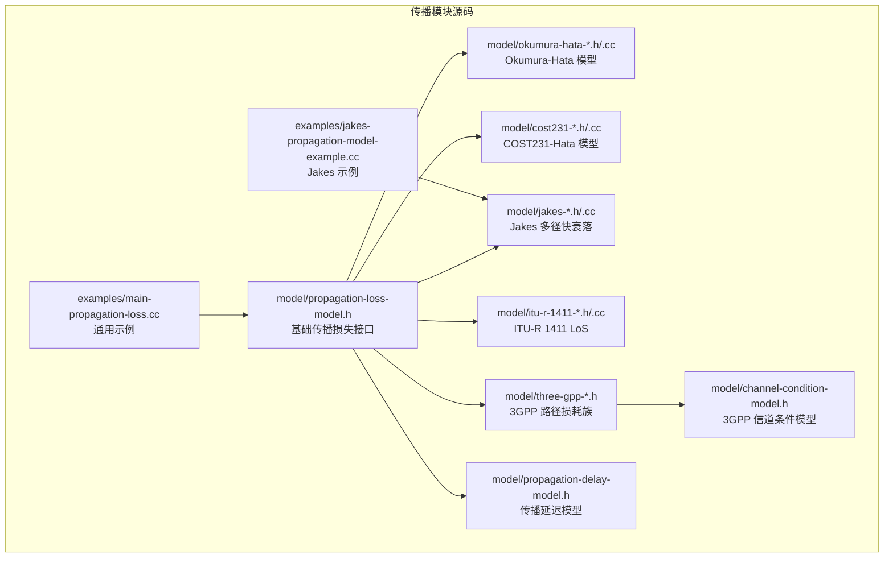
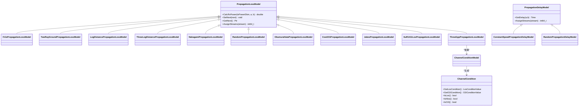
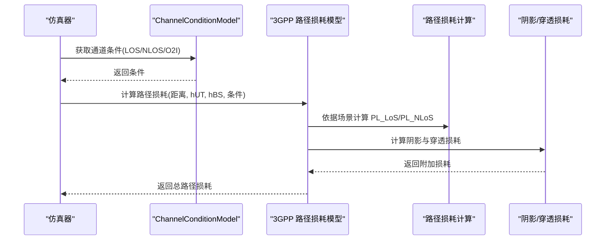
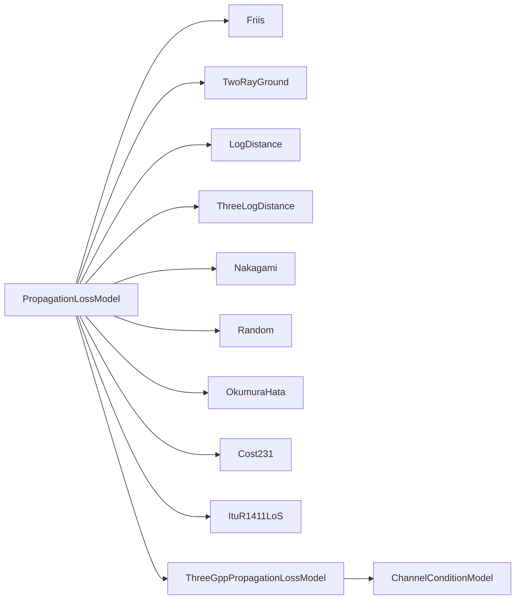

# 传播模型模块

<cite>
**本文档引用的文件**
- [propagation-loss-model.h](file://simulator/ns-3.39/src/propagation/model/propagation-loss-model.h)
- [propagation-loss-model.cc](file://simulator/ns-3.39/src/propagation/model/propagation-loss-model.cc)
- [okumura-hata-propagation-loss-model.h](file://simulator/ns-3.39/src/propagation/model/okumura-hata-propagation-loss-model.h)
- [okumura-hata-propagation-loss-model.cc](file://simulator/ns-3.39/src/propagation/model/okumura-hata-propagation-loss-model.cc)
- [cost231-propagation-loss-model.h](file://simulator/ns-3.39/src/propagation/model/cost231-propagation-loss-model.h)
- [cost231-propagation-loss-model.cc](file://simulator/ns-3.39/src/propagation/model/cost231-propagation-loss-model.cc)
- [jakes-propagation-loss-model.h](file://simulator/ns-3.39/src/propagation/model/jakes-propagation-loss-model.h)
- [jakes-propagation-loss-model.cc](file://simulator/ns-3.39/src/propagation/model/jakes-propagation-loss-model.cc)
- [itu-r-1411-los-propagation-loss-model.h](file://simulator/ns-3.39/src/propagation/model/itu-r-1411-los-propagation-loss-model.h)
- [itu-r-1411-los-propagation-loss-model.cc](file://simulator/ns-3.39/src/propagation/model/itu-r-1411-los-propagation-loss-model.cc)
- [three-gpp-propagation-loss-model.h](file://simulator/ns-3.39/src/propagation/model/three-gpp-propagation-loss-model.h)
- [channel-condition-model.h](file://simulator/ns-3.39/src/propagation/model/channel-condition-model.h)
- [propagation-delay-model.h](file://simulator/ns-3.39/src/propagation/model/propagation-delay-model.h)
- [main-propagation-loss.cc](file://simulator/ns-3.39/src/propagation/examples/main-propagation-loss.cc)
- [jakes-propagation-model-example.cc](file://simulator/ns-3.39/src/propagation/examples/jakes-propagation-model-example.cc)
- [CMakeLists.txt](file://simulator/ns-3.39/src/propagation/CMakeLists.txt)
</cite>

## 目录
1. [简介](#简介)
2. [项目结构](#项目结构)
3. [核心组件](#核心组件)
4. [架构总览](#架构总览)
5. [详细组件分析](#详细组件分析)
6. [依赖关系分析](#依赖关系分析)
7. [性能考虑](#性能考虑)
8. [故障排查指南](#故障排查指南)
9. [结论](#结论)
10. [附录](#附录)

## 简介
本文件为 NS-3 传播模型模块的综合 API 文档，系统性阐述无线信号传播的物理建模与仿真方法，覆盖自由空间传播、路径损耗、阴影衰落、多径效应等基础与高级传播现象。文档重点解析以下经典与现代传播模型的实现与使用方式：
- 经典模型：自由空间（Friis）、双射线（Two-Ray Ground）、对数距离（Log-Distance）、三段指数（Three-Log-Distance）、Okumura-Hata、COST231-Hata、ITU-R 1411 LoS 等
- 随机/快衰落：Nakagami、Jakes（基于振子合成的瑞利衰落）
- 现代无线：3GPP 规范路径损耗族（UMa、UMi、RMa、室内办公等场景），结合 3GPP 信道条件模型（LOS/NLOS/O2I）与阴影衰落、穿透损耗
- 延迟模型：常速传播延迟与随机延迟
- 使用示例：通过示例脚本展示如何配置与组合传播模型进行仿真

本指南兼顾工程实践与理论背景，帮助读者在无线网络规划与优化中正确选择与校准传播模型。

## 项目结构
传播模型模块位于 ns-3 源码树的 propagation 子模块，核心由“模型头文件/实现文件 + 示例 + 测试”构成，并通过 CMake 构建系统集成到 NS-3。

图示来源
- [CMakeLists.txt:1-36](file://simulator/ns-3.39/src/propagation/CMakeLists.txt#L1-L36)

章节来源
- [CMakeLists.txt:1-36](file://simulator/ns-3.39/src/propagation/CMakeLists.txt#L1-L36)

## 核心组件
传播模型模块以统一的传播损失接口为核心，所有具体模型均继承自该基类，支持链式组合与随机流分配。主要能力包括：
- 传播损失计算：根据发射功率与节点位置计算接收功率
- 链式模型：支持将多个传播模型串联（如路径损耗 + 快衰落）
- 随机流：为含噪声/随机性的模型分配独立随机流
- 延迟模型：提供传播时延计算（常速或随机）

章节来源
- [propagation-loss-model.h:55-143](file://simulator/ns-3.39/src/propagation/model/propagation-loss-model.h#L55-L143)
- [propagation-loss-model.cc:72-95](file://simulator/ns-3.39/src/propagation/model/propagation-loss-model.cc#L72-L95)

## 架构总览
传播模型采用“统一接口 + 具体实现 + 可选条件模型 + 延迟模型”的分层架构。3GPP 路径损耗族通过外部的信道条件模型决定 LOS/NLOS/O2I 条件，并结合阴影与穿透损耗实现更贴近实测的路径损耗。

图示来源
- [propagation-loss-model.h:55-788](file://simulator/ns-3.39/src/propagation/model/propagation-loss-model.h#L55-L788)
- [channel-condition-model.h:235-279](file://simulator/ns-3.39/src/propagation/model/channel-condition-model.h#L235-L279)
- [propagation-delay-model.h:37-141](file://simulator/ns-3.39/src/propagation/model/propagation-delay-model.h#L37-L141)

## 详细组件分析

### 基础传播损失接口与链式模型
- 接口职责：定义传播损失计算、链式连接、随机流分配
- 链式机制：通过 SetNext 将多个模型串联，按顺序叠加损耗；注意仅当模型对发射功率无关时链式才可交换
- 随机流：DoAssignStreams 返回分配的流数量，链式模型会递归分配

章节来源
- [propagation-loss-model.h:55-143](file://simulator/ns-3.39/src/propagation/model/propagation-loss-model.h#L55-L143)
- [propagation-loss-model.cc:60-95](file://simulator/ns-3.39/src/propagation/model/propagation-loss-model.cc#L60-L95)

### 自由空间传播（Friis）
- 物理意义：理想无散射、无吸收介质中的自由空间路径损耗
- 关键属性：频率、系统损耗、最小总损耗（避免近场不连续）
- 适用范围：远场区域（通常 d > 3λ），近场采用最小损耗策略避免数值异常

章节来源
- [propagation-loss-model.h:252-326](file://simulator/ns-3.39/src/propagation/model/propagation-loss-model.h#L252-L326)
- [propagation-loss-model.cc:146-288](file://simulator/ns-3.39/src/propagation/model/propagation-loss-model.cc#L146-L288)

### 双射线地面模型（Two-Ray Ground）
- 物理意义：考虑直射与地面反射的两射线模型，短距用 Friis 过渡
- 关键属性：频率、系统损耗、最小距离、天线高度（相对于节点 Z 坐标）
- 实现要点：跨界距离 dCross 决定是否切换到 Friis

章节来源
- [propagation-loss-model.h:356-437](file://simulator/ns-3.39/src/propagation/model/propagation-loss-model.h#L356-L437)
- [propagation-loss-model.cc:293-469](file://simulator/ns-3.39/src/propagation/model/propagation-loss-model.cc#L293-L469)

### 对数距离路径损耗（Log-Distance）
- 模型形式：L = L0 + 10n·log10(d/d0)
- 参数：指数 n、参考距离 d0、参考损耗 L0
- 适用：简化城市/郊区环境下的路径损耗建模

章节来源
- [propagation-loss-model.h:459-506](file://simulator/ns-3.39/src/propagation/model/propagation-loss-model.h#L459-L506)
- [propagation-loss-model.cc:473-561](file://simulator/ns-3.39/src/propagation/model/propagation-loss-model.cc#L473-L561)

### 三段指数路径损耗（Three-Log-Distance）
- 形式：在不同距离区间采用不同指数 n0/n1/n2，保证连续性
- 参数：三个分段起点距离与对应指数、参考损耗
- 适用：更精细地拟合不同场景的路径损耗曲线

章节来源
- [propagation-loss-model.h:549-582](file://simulator/ns-3.39/src/propagation/model/propagation-loss-model.h#L549-L582)
- [propagation-loss-model.cc:565-660](file://simulator/ns-3.39/src/propagation/model/propagation-loss-model.cc#L565-L660)

### 快衰落（Nakagami）
- 分布：Nakaigami 或 Rayleigh（m=1）衰落
- 用途：模拟多径引起的快速功率波动
- 参数：按距离分段的 m 参数与分段阈值

章节来源
- [propagation-loss-model.h:612-645](file://simulator/ns-3.39/src/propagation/model/propagation-loss-model.h#L612-L645)
- [propagation-loss-model.cc:664-777](file://simulator/ns-3.39/src/propagation/model/propagation-loss-model.cc#L664-L777)

### 随机传播损失（Random）
- 机制：每次调用从指定随机变量采样作为损耗
- 应用：与固定 RSS 或其他确定性模型组合

章节来源
- [propagation-loss-model.h:150-173](file://simulator/ns-3.39/src/propagation/model/propagation-loss-model.h#L150-L173)
- [propagation-loss-model.cc:99-142](file://simulator/ns-3.39/src/propagation/model/propagation-loss-model.cc#L99-L142)

### Okumura-Hata 模型
- 适用：开放区域、城市/郊区/开阔地场景，频率 150–2000 MHz
- 关键参数：频率、环境类型（城市规模/郊区/开阔地）、基站/移动台天线高度
- 实现：区分低频（标准 Okumura-Hata）与高频（COST231 扩展）

章节来源
- [okumura-hata-propagation-loss-model.h:42-76](file://simulator/ns-3.39/src/propagation/model/okumura-hata-propagation-loss-model.h#L42-L76)
- [okumura-hata-propagation-loss-model.cc:78-154](file://simulator/ns-3.39/src/propagation/model/okumura-hata-propagation-loss-model.cc#L78-L154)

### COST231-Hata（COST 231 Hata）
- 适用：城市环境，频率 1500–2000 MHz，链路距离至 20 km
- 关键参数：波长/频率、基站/移动台天线高度、最小距离、阴影损耗
- 实现：基于 COST231 报告公式，加入阴影项

章节来源
- [cost231-propagation-loss-model.h:50-142](file://simulator/ns-3.39/src/propagation/model/cost231-propagation-loss-model.h#L50-L142)
- [cost231-propagation-loss-model.cc:149-176](file://simulator/ns-3.39/src/propagation/model/cost231-propagation-loss-model.cc#L149-L176)

### ITU-R 1411 LoS
- 适用：300 MHz 至 100 GHz 的视距短程室外通信
- 关键参数：工作频率（推导波长 λ）、发射/接收天线高度
- 实现：基于 Break-Point 距离与不同距离区间的路径损耗表达式

章节来源
- [itu-r-1411-los-propagation-loss-model.h:41-83](file://simulator/ns-3.39/src/propagation/model/itu-r-1411-los-propagation-loss-model.h#L41-L83)
- [itu-r-1411-los-propagation-loss-model.cc:63-89](file://simulator/ns-3.39/src/propagation/model/itu-r-1411-los-propagation-loss-model.cc#L63-L89)

### Jakes 多径快衰落
- 机制：基于振子合成的窄带多径衰落模型，支持多普勒频移
- 关键点：缓存机制复用路径数据，均匀随机变量驱动相位演化
- 示例：通过示例脚本输出随时间变化的路径增益

章节来源
- [jakes-propagation-loss-model.h:35-70](file://simulator/ns-3.39/src/propagation/model/jakes-propagation-loss-model.h#L35-L70)
- [jakes-propagation-loss-model.cc:60-80](file://simulator/ns-3.39/src/propagation/model/jakes-propagation-loss-model.cc#L60-L80)
- [jakes-propagation-model-example.cc:67-73](file://simulator/ns-3.39/src/propagation/examples/jakes-propagation-model-example.cc#L67-L73)

### 3GPP 路径损耗族与信道条件模型
- 3GPP 路径损耗族：UMa、UMi-Street Canyon、RMa、室内办公等场景专用模型
- 信道条件模型：根据场景概率生成 LOS/NLOS/O2I 条件，支持缓存与更新周期
- 阴影衰落与穿透损耗：按场景提供阴影标准差、相关距离与室内穿透损耗

图示来源
- [three-gpp-propagation-loss-model.h:33-342](file://simulator/ns-3.39/src/propagation/model/three-gpp-propagation-loss-model.h#L33-L342)
- [channel-condition-model.h:441-583](file://simulator/ns-3.39/src/propagation/model/channel-condition-model.h#L441-L583)

章节来源
- [three-gpp-propagation-loss-model.h:33-752](file://simulator/ns-3.39/src/propagation/model/three-gpp-propagation-loss-model.h#L33-L752)
- [channel-condition-model.h:235-788](file://simulator/ns-3.39/src/propagation/model/channel-condition-model.h#L235-L788)

### 传播延迟模型
- 常速传播延迟：设定恒定传播速度
- 随机传播延迟：引入随机变量
- 用途：与传播损失模型配合，同时模拟时延与损耗

章节来源
- [propagation-delay-model.h:37-141](file://simulator/ns-3.39/src/propagation/model/propagation-delay-model.h#L37-L141)

## 依赖关系分析
- 模块内依赖：所有传播损失模型依赖于移动模型提供的位置信息；3GPP 模型依赖信道条件模型；Jakes 模型依赖缓存与随机变量
- 构建依赖：CMakeLists 中明确列出各源文件与头文件，确保编译时正确链接

图示来源
- [CMakeLists.txt:1-36](file://simulator/ns-3.39/src/propagation/CMakeLists.txt#L1-L36)

章节来源
- [CMakeLists.txt:1-36](file://simulator/ns-3.39/src/propagation/CMakeLists.txt#L1-L36)

## 性能考虑
- 链式模型开销：链式传播模型会逐级计算，建议仅串联与发射功率无关的模型
- 缓存优化：Jakes 模型使用对称缓存减少重复计算
- 随机流分配：合理分配随机流编号，避免伪随机相关性
- 3GPP 场景参数：严格遵守 TR 38.901 参数范围，必要时启用参数范围强制检查
- 示例运行：示例脚本展示了确定性与概率性测试方法，便于性能基准与统计验证

## 故障排查指南
- 近场异常：Friis 在近场可能出现数值不稳定，可通过设置最小总损耗缓解
- 链式顺序：若链式模型对发射功率敏感，应避免交换顺序
- 参数范围：3GPP 模型建议启用参数范围强制检查，避免超范围输入导致异常
- 随机一致性：确保为每个随机模型分配独立流编号，避免结果串扰

章节来源
- [propagation-loss-model.cc:267-282](file://simulator/ns-3.39/src/propagation/model/propagation-loss-model.cc#L267-L282)
- [three-gpp-propagation-loss-model.h:307-308](file://simulator/ns-3.39/src/propagation/model/three-gpp-propagation-loss-model.h#L307-L308)

## 结论
NS-3 传播模型模块提供了从经典到现代的完整路径损耗与快衰落建模能力，支持链式组合、随机流管理与 3GPP 场景化扩展。通过示例脚本与测试用例，用户可以快速上手并开展无线网络规划与优化仿真。

## 附录

### 代码示例路径（用于配置与组合传播模型）
- 通用传播损失示例：演示多种模型的确定性与概率性测试
  - [main-propagation-loss.cc:276-382](file://simulator/ns-3.39/src/propagation/examples/main-propagation-loss.cc#L276-L382)
- Jakes 快衰落示例：输出随时间变化的路径增益
  - [jakes-propagation-model-example.cc:67-73](file://simulator/ns-3.39/src/propagation/examples/jakes-propagation-model-example.cc#L67-L73)

### 传播模型选择与参数校准建议
- 自由空间：远场、无遮挡、低噪声场景
- 对数距离/三段指数：城市/郊区宏站场景的基础拟合
- Okumura-Hata/COST231：城市/郊区/开阔地场景，需校准天线高度与阴影
- ITU-R 1411 LoS：短距视距场景，关注天线高度与频率
- Jakes：需要多径快衰落的中小尺度场景
- 3GPP：5G/未来移动通信场景，需配套信道条件模型与阴影/穿透损耗

### 无线网络规划与优化中的应用
- 覆盖估算：结合路径损耗与阴影，评估不同场景下的接收功率分布
- 容量规划：基于链路预算与干扰模型，结合传播损耗进行容量预估
- 参数校准：通过与实测数据对比，调整阴影、穿透损耗与场景参数
- 场景适配：根据部署环境（UMa/UMi/RMa/室内）选择合适的 3GPP 模型族