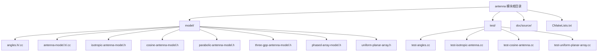
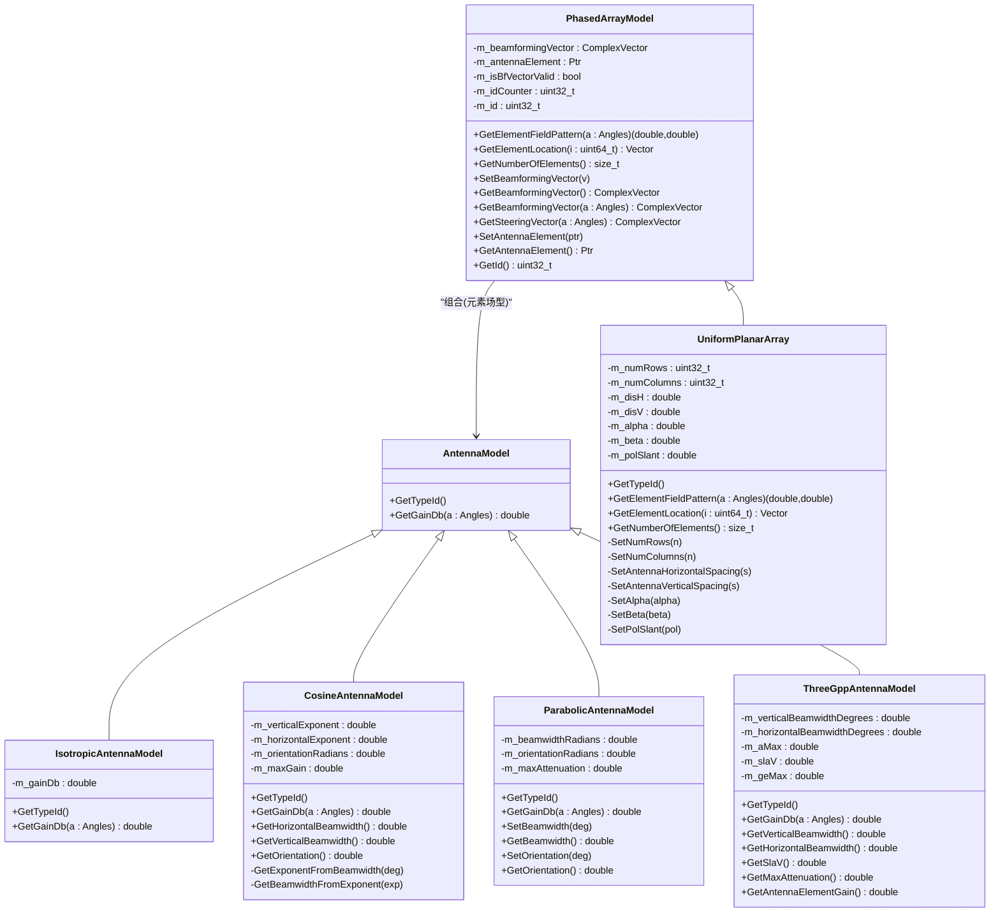
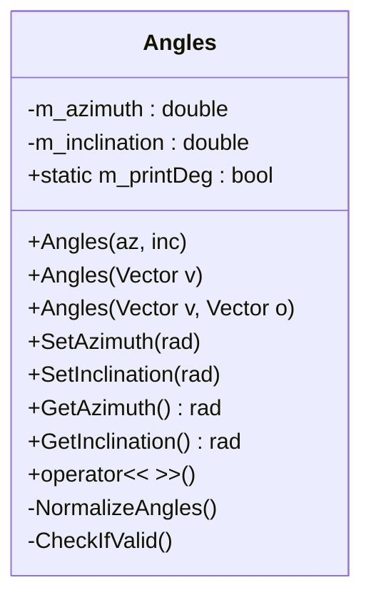
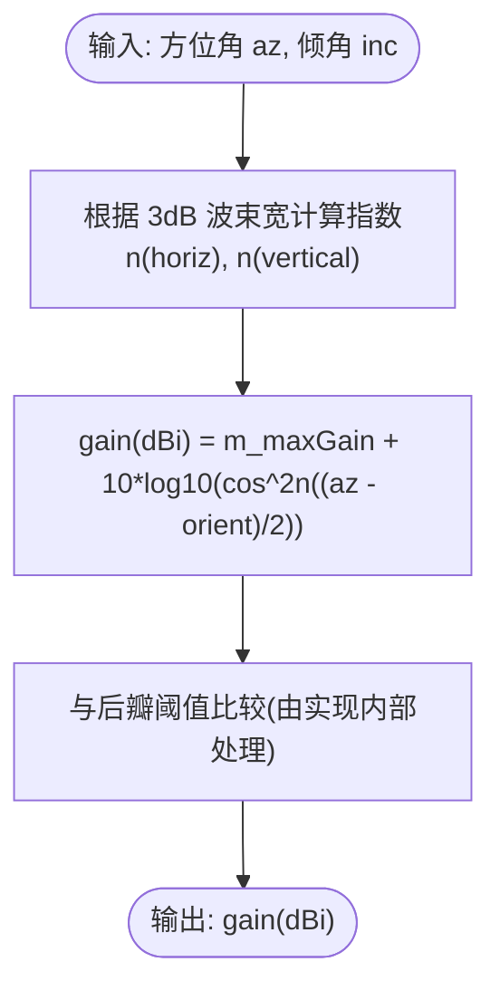
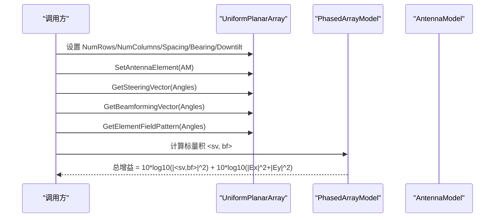
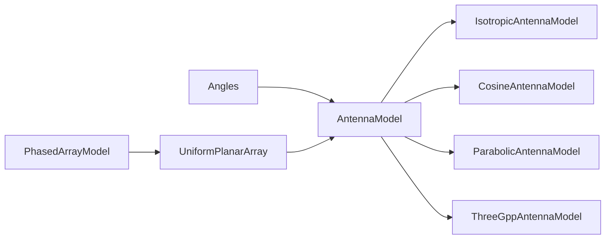

# 天线模块

<cite>
**本文引用的文件**
- [antenna-model.h](file://simulator/ns-3.39/src/antenna/model/antenna-model.h)
- [antenna-model.cc](file://simulator/ns-3.39/src/antenna/model/antenna-model.cc)
- [isotropic-antenna-model.h](file://simulator/ns-3.39/src/antenna/model/isotropic-antenna-model.h)
- [cosine-antenna-model.h](file://simulator/ns-3.39/src/antenna/model/cosine-antenna-model.h)
- [parabolic-antenna-model.h](file://simulator/ns-3.39/src/antenna/model/parabolic-antenna-model.h)
- [three-gpp-antenna-model.h](file://simulator/ns-3.39/src/antenna/model/three-gpp-antenna-model.h)
- [phased-array-model.h](file://simulator/ns-3.39/src/antenna/model/phased-array-model.h)
- [uniform-planar-array.h](file://simulator/ns-3.39/src/antenna/model/uniform-planar-array.h)
- [angles.h](file://simulator/ns-3.39/src/antenna/model/angles.h)
- [CMakeLists.txt](file://simulator/ns-3.39/src/antenna/CMakeLists.txt)
- [antenna-design.rst](file://simulator/ns-3.39/src/antenna/doc/source/antenna-design.rst)
- [antenna-user.rst](file://simulator/ns-3.39/src/antenna/doc/source/antenna-user.rst)
- [test-isotropic-antenna.cc](file://simulator/ns-3.39/src/antenna/test/test-isotropic-antenna.cc)
- [test-cosine-antenna.cc](file://simulator/ns-3.39/src/antenna/test/test-cosine-antenna.cc)
- [test-uniform-planar-array.cc](file://simulator/ns-3.39/src/antenna/test/test-uniform-planar-array.cc)
</cite>

## 目录
1. [简介](#简介)
2. [项目结构](#项目结构)
3. [核心组件](#核心组件)
4. [架构总览](#架构总览)
5. [详细组件分析](#详细组件分析)
6. [依赖关系分析](#依赖关系分析)
7. [性能与复杂度](#性能与复杂度)
8. [故障排查指南](#故障排查指南)
9. [结论](#结论)
10. [附录：使用与最佳实践](#附录使用与最佳实践)

## 简介
本文件为 NS-3 天线模块的详细 API 文档与实现解析，覆盖以下内容：
- 单元天线模型：各向同性天线、余弦天线、抛物面天线、3GPP 天线模型
- 相控阵与平面阵列：相控阵阵列基类、均匀矩形平面阵列（UPA）
- 关键参数：方向图、增益（dBi）、极化、波束赋形、方位/仰角、阵列几何
- 高级主题：大规模 MIMO 阵列、智能反射表面（IRS）建模思路
- 使用示例与最佳实践：如何配置天线、设置方位/仰角、构建多天线系统

## 项目结构
天线模块位于 ns-3.39 源码树的 antenna 子目录中，采用“按模型分层”的组织方式：
- model：核心模型头文件与实现
- test：单元测试
- doc/source：用户与设计文档
- CMakeLists.txt：构建脚本

图表来源
- [CMakeLists.txt:1-30](file://simulator/ns-3.39/src/antenna/CMakeLists.txt#L1-L30)

章节来源
- [CMakeLists.txt:1-30](file://simulator/ns-3.39/src/antenna/CMakeLists.txt#L1-L30)

## 核心组件
- 角度系统：Angles 类封装球坐标系（方位角、倾角），提供角度换算与归一化工具
- 天线接口：AntennaModel 抽象接口，定义辐射方向图查询方法
- 单元天线模型：各向同性、余弦、抛物面、3GPP
- 相控阵基类：PhasedArrayModel 定义波束赋形向量、阵元场型、几何位置等抽象
- 平面阵列：UniformPlanarArray 实现矩形/线性规则格点阵列

章节来源
- [antenna-model.h:41-77](file://simulator/ns-3.39/src/antenna/model/antenna-model.h#L41-L77)
- [angles.h:94-225](file://simulator/ns-3.39/src/antenna/model/angles.h#L94-L225)
- [phased-array-model.h:31-150](file://simulator/ns-3.39/src/antenna/model/phased-array-model.h#L31-L150)
- [uniform-planar-array.h:27-180](file://simulator/ns-3.39/src/antenna/model/uniform-planar-array.h#L27-L180)

## 架构总览
下图展示天线模块的类层次与依赖关系，以及与无线物理层的集成点。

图表来源
- [antenna-model.h:41-77](file://simulator/ns-3.39/src/antenna/model/antenna-model.h#L41-L77)
- [isotropic-antenna-model.h:29-56](file://simulator/ns-3.39/src/antenna/model/isotropic-antenna-model.h#L29-L56)
- [cosine-antenna-model.h:29-116](file://simulator/ns-3.39/src/antenna/model/cosine-antenna-model.h#L29-L116)
- [parabolic-antenna-model.h:29-83](file://simulator/ns-3.39/src/antenna/model/parabolic-antenna-model.h#L29-L83)
- [three-gpp-antenna-model.h:27-85](file://simulator/ns-3.39/src/antenna/model/three-gpp-antenna-model.h#L27-L85)
- [phased-array-model.h:31-150](file://simulator/ns-3.39/src/antenna/model/phased-array-model.h#L31-L150)
- [uniform-planar-array.h:27-180](file://simulator/ns-3.39/src/antenna/model/uniform-planar-array.h#L27-L180)

## 详细组件分析

### 角度系统（Angles）
- 支持球坐标系：方位角（azimuth）[-π, π)，倾角（inclination）[0, π]
- 提供角度单位转换、角度包裹（WrapToX）与有效性检查
- 可从笛卡尔向量或两点相对位置构造

图表来源
- [angles.h:94-225](file://simulator/ns-3.39/src/antenna/model/angles.h#L94-L225)

章节来源
- [angles.h:30-93](file://simulator/ns-3.39/src/antenna/model/angles.h#L30-L93)
- [angles.h:117-225](file://simulator/ns-3.39/src/antenna/model/angles.h#L117-L225)

### 单元天线模型

#### 各向同性天线（IsotropicAntennaModel）
- 增益在所有方向恒定（默认 0 dBi）
- 适合仿真简化场景或作为参考

章节来源
- [isotropic-antenna-model.h:29-56](file://simulator/ns-3.39/src/antenna/model/isotropic-antenna-model.h#L29-L56)

#### 余弦天线（CosineAntennaModel）
- 方向图形式：仅与方位角相关，可独立设置水平/垂直 3dB 波束宽度与方位朝向
- 通过指数项控制主瓣宽度；支持最大增益偏移
- 提供水平/垂直波束宽度、方位朝向的访问器

图表来源
- [cosine-antenna-model.h:29-116](file://simulator/ns-3.39/src/antenna/model/cosine-antenna-model.h#L29-L116)

章节来源
- [cosine-antenna-model.h:29-116](file://simulator/ns-3.39/src/antenna/model/cosine-antenna-model.h#L29-L116)

#### 抛物面天线（ParabolicAntennaModel）
- 主瓣近似为抛物线，仅与方位角相关
- 支持设置波束宽度与方位朝向；最大衰减为常数

章节来源
- [parabolic-antenna-model.h:29-83](file://simulator/ns-3.39/src/antenna/model/parabolic-antenna-model.h#L29-L83)

#### 3GPP 天线模型（ThreeGppAntennaModel）
- 基于 3GPP TR 38.901 的天线元件模型，参数固定
- 提供垂直/水平波束宽、侧瓣抑制、最大衰减、最大增益等属性

章节来源
- [three-gpp-antenna-model.h:27-85](file://simulator/ns-3.39/src/antenna/model/three-gpp-antenna-model.h#L27-L85)

### 相控阵与平面阵列

#### 相控阵阵列基类（PhasedArrayModel）
- 抽象波束赋形与阵列因子：通过波束赋形向量与阵元场型合成总方向图
- 提供：
  - 获取阵元场型（水平/垂直分量）
  - 获取阵元位置（以波长为单位归一化）
  - 获取阵元数量
  - 设置/获取波束赋形向量与指向向量
  - 设置/获取单个阵元天线模型
  - 获取阵列实例 ID

图表来源
- [phased-array-model.h:74-122](file://simulator/ns-3.39/src/antenna/model/phased-array-model.h#L74-L122)
- [uniform-planar-array.h:54-84](file://simulator/ns-3.39/src/antenna/model/uniform-planar-array.h#L54-L84)

章节来源
- [phased-array-model.h:31-150](file://simulator/ns-3.39/src/antenna/model/phased-array-model.h#L31-L150)

#### 均匀矩形平面阵列（UniformPlanarArray）
- 支持矩形与线性格点（NumRows/NumColumns）
- 支持水平/垂直阵元间距（以波长为单位）、方位（BearingAngle）、下倾（DowntiltAngle）、极化斜角（PolSlantAngle）
- 通过 GetElementLocation 实现规则网格扫描顺序

章节来源
- [uniform-planar-array.h:27-180](file://simulator/ns-3.39/src/antenna/model/uniform-planar-array.h#L27-L180)

### 设计与使用文档要点
- 设计文档概述了模块组成、坐标系约定与各模型的数学表达
- 用户文档指出该模块可用于支持的无线物理层（如基于 SpectrumPhy）

章节来源
- [antenna-design.rst:1-195](file://simulator/ns-3.39/src/antenna/doc/source/antenna-design.rst#L1-L195)
- [antenna-user.rst:1-11](file://simulator/ns-3.39/src/antenna/doc/source/antenna-user.rst#L1-L11)

## 依赖关系分析
- 组件内聚高：Angles 与 AntennaModel 为基础；具体天线模型均继承自 AntennaModel
- 相控阵依赖：UniformPlanarArray 继承自 PhasedArrayModel，并组合 AntennaModel 作为阵元
- 构建脚本统一编译模型与测试

图表来源
- [antenna-model.h:41-77](file://simulator/ns-3.39/src/antenna/model/antenna-model.h#L41-L77)
- [phased-array-model.h:31-150](file://simulator/ns-3.39/src/antenna/model/phased-array-model.h#L31-L150)
- [uniform-planar-array.h:27-180](file://simulator/ns-3.39/src/antenna/model/uniform-planar-array.h#L27-L180)

章节来源
- [CMakeLists.txt:1-30](file://simulator/ns-3.39/src/antenna/CMakeLists.txt#L1-L30)

## 性能与复杂度
- 单点方向图查询（AntennaModel::GetGainDb）：O(1)
- 相控阵合成（UPA）：
  - 阵元场型计算：O(N)，N 为阵元数
  - 波束赋形向量与导向向量生成：O(N)
  - 复杂点积：O(N)
- 空间复杂度：O(N) 存储波束赋形/导向向量
- 优化建议：
  - 尽量缓存阵列几何与波束赋形向量
  - 对相同方向的多次查询合并计算
  - 合理选择阵元数与间距，平衡分辨率与开销

[本节为通用性能讨论，不直接分析具体文件]

## 故障排查指南
- 角度范围与归一化
  - 确保方位角在 [-π, π) 范围内；倾角应在 [0, π]
  - 使用 WrapToX 工具函数进行角度包裹
- 增益与后瓣
  - 余弦/抛物面模型在主瓣外侧应低于设定阈值；若出现异常需检查波束宽与朝向设置
- 相控阵一致性
  - 确认阵元数与波束赋形向量长度一致
  - 检查阵元场型返回的水平/垂直分量是否匹配期望极化
- 测试参考
  - 各模型均有对应单元测试，可对照期望值定位问题

章节来源
- [angles.h:62-92](file://simulator/ns-3.39/src/antenna/model/angles.h#L62-L92)
- [test-isotropic-antenna.cc:74-83](file://simulator/ns-3.39/src/antenna/test/test-isotropic-antenna.cc#L74-L83)
- [test-cosine-antenna.cc:115-140](file://simulator/ns-3.39/src/antenna/test/test-cosine-antenna.cc#L115-L140)
- [test-uniform-planar-array.cc:180-206](file://simulator/ns-3.39/src/antenna/test/test-uniform-planar-array.cc#L180-L206)

## 结论
NS-3 天线模块提供了从简单各向同性到复杂相控阵的完整建模能力，接口清晰、扩展性强。通过统一的角度系统与抽象的天线接口，用户可在多种无线物理层中复用这些模型。对于大规模 MIMO 与智能反射表面等前沿场景，可基于现有相控阵框架扩展新的阵列几何与波束赋形策略。

[本节为总结性内容，不直接分析具体文件]

## 附录：使用与最佳实践

### 天线配置与方向设置
- 各向同性天线：适用于无方向性假设或基准对比
- 余弦天线：通过水平/垂直波束宽与方位朝向快速指定主瓣形状
- 抛物面天线：用于扇区场景的主瓣近似
- 3GPP 天线：直接使用固定参数，适配 3GPP 信道模型

章节来源
- [antenna-design.rst:72-136](file://simulator/ns-3.39/src/antenna/doc/source/antenna-design.rst#L72-L136)

### 多天线系统建模
- 使用 UniformPlanarArray 构建矩形/线性阵列
- 设置 NumRows/NumColumns、水平/垂直间距（以 λ 归一）
- 设置 BearingAngle（方位）、DowntiltAngle（下倾）、PolSlantAngle（极化斜角）
- 通过 SetAntennaElement 指定阵元天线模型（如 3GPP）

章节来源
- [uniform-planar-array.h:86-180](file://simulator/ns-3.39/src/antenna/model/uniform-planar-array.h#L86-L180)
- [antenna-design.rst:157-177](file://simulator/ns-3.39/src/antenna/doc/source/antenna-design.rst#L157-L177)

### 波束赋形与空间复用
- 通过 GetSteeringVector(Angles) 与 GetBeamformingVector(Angles) 获取导向与赋形向量
- 使用标量积 <sv, bf> 计算阵列增益，叠加阵元场型功率贡献
- 线性阵列与平面阵列均可获得增益提升（与测试用例一致）

章节来源
- [phased-array-model.h:114-122](file://simulator/ns-3.39/src/antenna/model/phased-array-model.h#L114-L122)
- [test-uniform-planar-array.cc:151-178](file://simulator/ns-3.39/src/antenna/test/test-uniform-planar-array.cc#L151-L178)

### 高级主题与扩展
- 大规模 MIMO 阵列：在 UniformPlanarArray 基础上增大 NumRows/NumColumns，合理设置间距与波束赋形策略
- 智能反射表面（IRS）：可将 IRS 视为“虚拟相控阵”，通过控制反射相移形成波束赋形；在现有框架下扩展新的“阵元”模型与几何布局

章节来源
- [antenna-design.rst:138-177](file://simulator/ns-3.39/src/antenna/doc/source/antenna-design.rst#L138-L177)