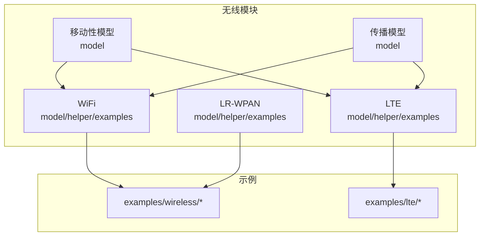
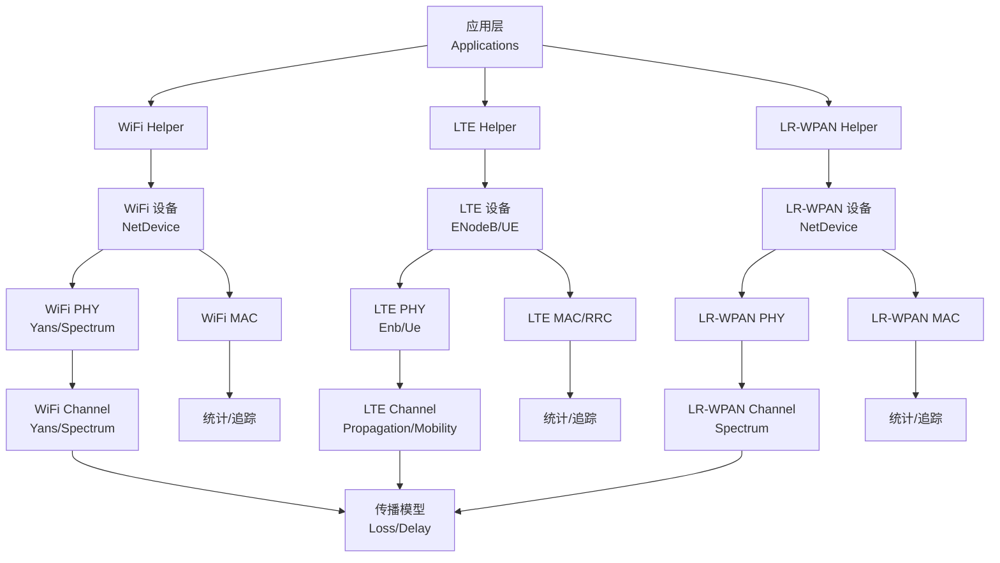
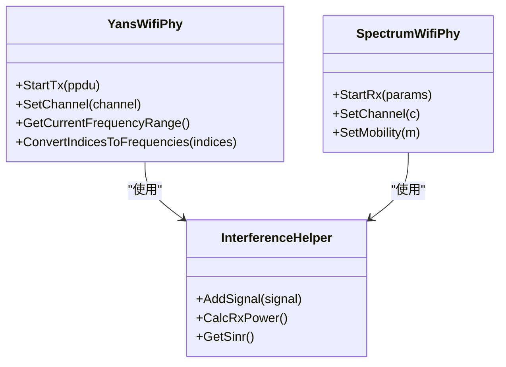
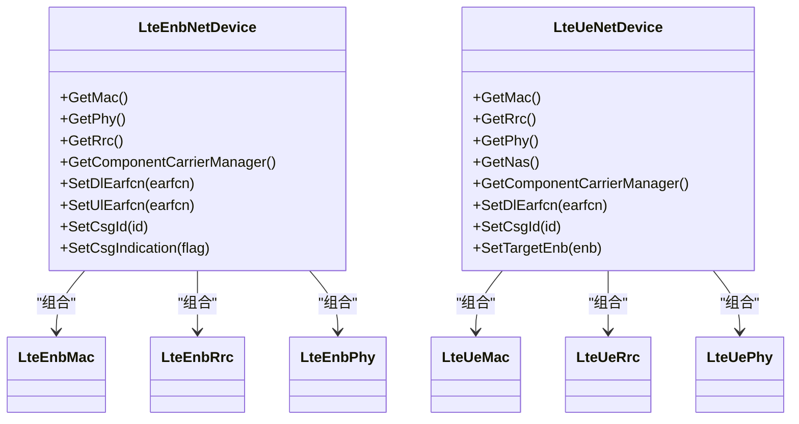
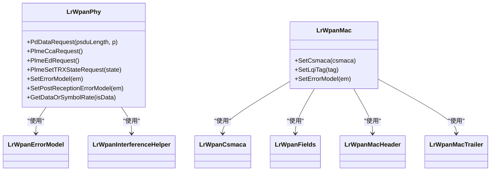
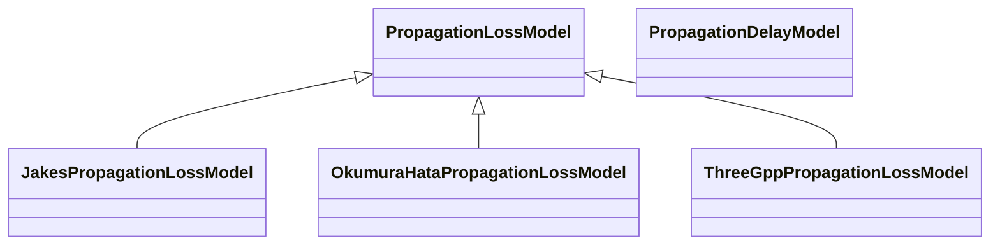
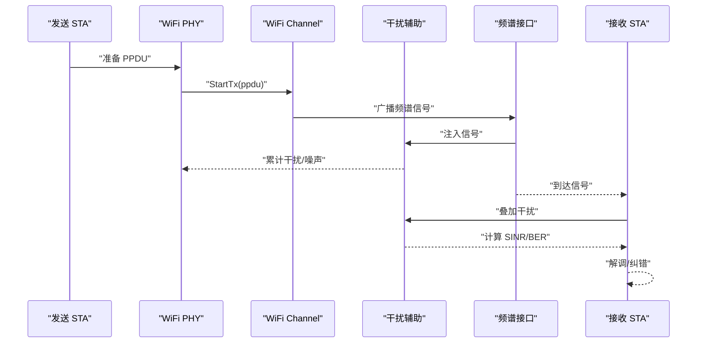
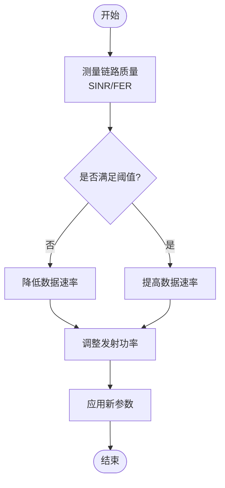
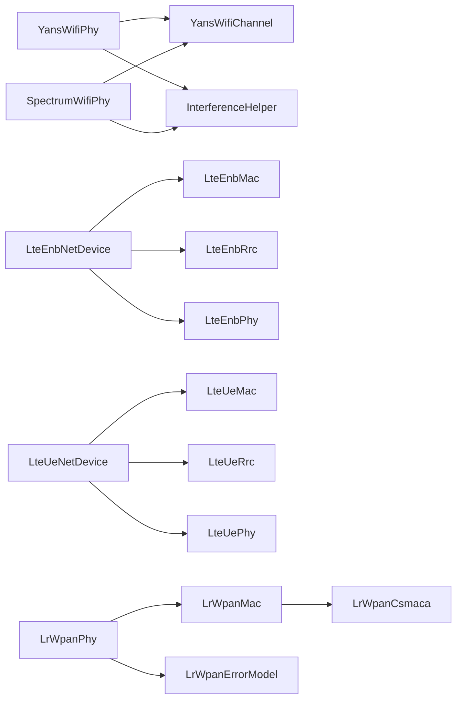

# 无线通信模块

<cite>
**本文引用的文件**
- [README.md](file://simulator/ns-3.39/README.md)
- [YansWifiPhy.h](file://simulator/ns-3.39/src/wifi/model/yans-wifi-phy.h)
- [LteEnbNetDevice.h](file://simulator/ns-3.39/src/lte/model/lte-enb-net-device.h)
- [LteUeNetDevice.h](file://simulator/ns-3.39/src/lte/model/lte-ue-net-device.h)
- [LrWpanPhy.h](file://simulator/ns-3.39/src/lr-wpan/model/lr-wpan-phy.h)
- [PropagationLossModel.h](file://simulator/ns-3.39/src/propagation/model/propagation-loss-model.h)
- [JakesPropagationLossModel.h](file://simulator/ns-3.39/src/propagation/model/jakes-propagation-loss-model.h)
- [OkumuraHataPropagationLossModel.h](file://simulator/ns-3.39/src/propagation/model/okumura-hata-propagation-loss-model.h)
- [ThreeGppPropagationLossModel.h](file://simulator/ns-3.39/src/propagation/model/three-gpp-propagation-loss-model.h)
- [MobilityModel.h](file://simulator/ns-3.39/src/mobility/model/mobility-model.h)
- [RandomWalk2dMobilityModel.h](file://simulator/ns-3.39/src/mobility/model/random-walk-2d-mobility-model.h)
- [ConstantVelocityMobilityModel.h](file://simulator/ns-3.39/src/mobility/model/constant-velocity-mobility-model.h)
- [YansWifiChannel.h](file://simulator/ns-3.39/src/wifi/model/yans-wifi-channel.h)
- [SpectrumWifiPhy.h](file://simulator/ns-3.39/src/wifi/model/spectrum-wifi-phy.h)
- [WifiSpectrumSignalParameters.h](file://simulator/ns-3.39/src/wifi/model/wifi-spectrum-signal-parameters.h)
- [LteHelper.h](file://simulator/ns-3.39/src/lte/helper/lte-helper.h)
- [LteStatsCalculator.h](file://simulator/ns-3.39/src/lte/helper/phy-rx-stats-calculator.h)
- [LrWpanHelper.h](file://simulator/ns-3.39/src/lr-wpan/helper/lr-wpan-helper.h)
- [WifiHelper.h](file://simulator/ns-3.39/src/wifi/helper/wifi-helper.h)
- [YansWifiHelper.h](file://simulator/ns-3.39/src/wifi/helper/yans-wifi-helper.h)
- [SpectrumWifiHelper.h](file://simulator/ns-3.39/src/wifi/helper/spectrum-wifi-helper.h)
- [AthstatsHelper.h](file://simulator/ns-3.39/src/wifi/helper/athstats-helper.h)
- [LtePhy.h](file://simulator/ns-3.39/src/lte/model/lte-phy.h)
- [LteMac.h](file://simulator/ns-3.39/src/lte/model/lte-mac.h)
- [LteRrc.h](file://simulator/ns-3.39/src/lte/model/lte-rrc.h)
- [LteEnbMac.h](file://simulator/ns-3.39/src/lte/model/lte-enb-mac.h)
- [LteUeMac.h](file://simulator/ns-3.39/src/lte/model/lte-ue-mac.h)
- [LteEnbRrc.h](file://simulator/ns-3.39/src/lte/model/lte-enb-rrc.h)
- [LteUeRrc.h](file://simulator/ns-3.39/src/lte/model/lte-ue-rrc.h)
- [LteEnbPhy.h](file://simulator/ns-3.39/src/lte/model/lte-enb-phy.h)
- [LteUePhy.h](file://simulator/ns-3.39/src/lte/model/lte-ue-phy.h)
- [LrWpanMac.h](file://simulator/ns-3.39/src/lr-wpan/model/lr-wpan-mac.h)
- [LrWpanNetDevice.h](file://simulator/ns-3.39/src/lr-wpan/model/lr-wpan-net-device.h)
- [LrWpanErrorModel.h](file://simulator/ns-3.39/src/lr-wpan/model/lr-wpan-error-model.h)
- [LrWpanInterferenceHelper.h](file://simulator/ns-3.39/src/lr-wpan/model/lr-wpan-interference-helper.h)
- [LrWpanCsmaca.h](file://simulator/ns-3.39/src/lr-wpan/model/lr-wpan-csmaca.h)
- [LrWpanFields.h](file://simulator/ns-3.39/src/lr-wpan/model/lr-wpan-fields.h)
- [LrWpanMacHeader.h](file://simulator/ns-3.39/src/lr-wpan/model/lr-wpan-mac-header.h)
- [LrWpanMacTrailer.h](file://simimulator/ns-3.39/src/lr-wpan/model/lr-wpan-mac-trailer.h)
- [LrWpanSpectrumSignalParameters.h](file://simulator/ns-3.39/src/lr-wpan/model/lr-wpan-spectrum-signal-parameters.h)
- [LrWpanSpectrumValueHelper.h](file://simulator/ns-3.39/src/lr-wpan/model/lr-wpan-spectrum-value-helper.h)
- [LrWpanConstants.h](file://simulator/ns-3.39/src/lr-wpan/model/lr-wpan-constants.h)
- [LrWpanLqiTag.h](file://simulator/ns-3.39/src/lr-wpan/model/lr-wpan-lqi-tag.h)
- [LrWpanActiveScan.h](file://simulator/ns-3.39/examples/wireless/lr-wpan-active-scan.cc)
- [LenaSimple.h](file://simulator/ns-3.39/examples/lte/lena-simple.cc)
- [WifiSimpleAdhoc.h](file://simulator/ns-3.39/examples/wireless/wifi-simple-adhoc.cc)
- [WifiPowerAdaptationDistance.h](file://simulator/ns-3.39/examples/wireless/wifi-power-adaptation-distance.cc)
- [WifiPowerAdaptationInterference.h](file://simulator/ns-3.39/examples/wireless/wifi-power-adaptation-interference.cc)
- [WifiRateAdaptationDistance.h](file://simulator/ns-3.39/examples/wireless/wifi-rate-adaptation-distance.cc)
- [WifiHiddenTerminal.h](file://simulator/ns-3.39/examples/wireless/wifi-hidden-terminal.cc)
- [WifiSpectrumPerExample.h](file://simulator/ns-3.39/examples/wireless/wifi-spectrum-per-example.cc)
- [WifiSpectrumSaturationExample.h](file://simulator/ns-3.39/examples/wireless/wifi-spectrum-saturation-example.cc)
- [WifiTcp.h](file://simulator/ns-3.39/examples/wireless/wifi-tcp.cc)
- [WifiMixedNetwork.h](file://simulator/ns-3.39/examples/wireless/wifi-mixed-network.cc)
- [WifiHeNetwork.h](file://simulator/ns-3.39/examples/wireless/wifi-he-network.cc)
- [WifiHtNetwork.h](file://simulator/ns-3.39/examples/wireless/wifi-ht-network.cc)
- [WifiVhtNetwork.h](file://simulator/ns-3.39/examples/wireless/wifi-vht-network.cc)
- [WifiOfdmValidation.h](file://simulator/ns-3.39/examples/wireless/wifi-ofdm-validation.cc)
- [WifiOfdmHeValidation.h](file://simulator/ns-3.39/examples/wireless/wifi-ofdm-he-validation.cc)
- [WifiOfdmHtValidation.h](file://simulator/ns-3.39/examples/wireless/wifi-ofdm-ht-validation.cc)
- [WifiOfdmVhtValidation.h](file://simulator/ns-3.39/examples/wireless/wifi-ofdm-vht-validation.cc)
- [WifiOfdmEhtValidation.h](file://simulator/ns-3.39/examples/wireless/wifi-ofdm-eht-validation.cc)
- [WifiBackwardCompatibility.h](file://simulator/ns-3.39/examples/wireless/wifi-backward-compatibility.cc)
- [WifiErrorModelsComparison.h](file://simulator/ns-3.39/examples/wireless/wifi-error-models-comparison.cc)
- [WifiClearChannelCmu.h](file://simulator/ns-3.39/examples/wireless/wifi-clear-channel-cmu.cc)
- [WifiTimingAttributes.h](file://simulator/ns-3.39/examples/wireless/wifi-timing-attributes.cc)
- [WifiSleep.h](file://simulator/ns-3.39/examples/wireless/wifi-sleep.cc)
- [WifiSpatialReuse.h](file://simulator/ns-3.39/examples/wireless/wifi-spatial-reuse.cc)
- [WifiMultiTos.h](file://simulator/ns-3.39/examples/wireless/wifi-multi-tos.cc)
- [WifiMixedWiredWireless.h](file://simulator/ns-3.39/examples/wireless/mixed-wired-wireless.cc)
- [WifiAp.h](file://simulator/ns-3.39/examples/wireless/wifi-ap.cc)
- [WifiSimpleIntra.h](file://simulator/ns-3.39/examples/wireless/wifi-simple-infra.cc)
- [WifiSimpleAdhocGrid.h](file://simulator/ns-3.39/examples/wireless/wifi-simple-adhoc-grid.cc)
- [WifiSimpleAdhoc.h](file://simulator/ns-3.39/examples/wireless/wifi-simple-adhoc.cc)
- [WifiSimpleHtHiddenStations.h](file://simulator/ns-3.39/examples/wireless/wifi-simple-ht-hidden-stations.cc)
- [WifiAggregation.h](file://simulator/ns-3.39/examples/wireless/wifi-aggregation.cc)
- [WifiBlockack.h](file://simulator/ns-3.39/examples/wireless/wifi-blockack.cc)
- [WifiTxopAggregation.h](file://simulator/ns-3.39/examples/wireless/wifi-txop-aggregation.cc)
- [Wifi80211eTxop.h](file://simulator/ns-3.39/examples/wireless/wifi-80211e-txop.cc)
- [Wifi80211nMimo.h](file://simulator/ns-3.39/examples/wireless/wifi-80211n-mimo.cc)
- [WifiDsssValidation.h](file://simulator/ns-3.39/examples/wireless/wifi-dsss-validation.cc)
- [WifiEhtNetwork.h](file://simulator/ns-3.39/examples/wireless/wifi-eht-network.cc)
- [WifiWiredBridging.h](file://simulator/ns-3.39/examples/wireless/wifi-wired-bridging.cc)
- [WifiTransExample.h](file://simulator/ns-3.39/src/wifi/examples/wifi-trans-example.cc)
- [WifiPhyTest.h](file://simulator/ns-3.39/src/wifi/examples/wifi-phy-test.cc)
- [WifiTestInterferenceHelper.h](file://simulator/ns-3.39/src/wifi/examples/wifi-test-interference-helper.cc)
- [LenaSimpleEpC.h](file://simulator/ns-3.39/examples/lte/lena-simple-epc.cc)
- [LenaIpv6AddrConf.h](file://simulator/ns-3.39/examples/lte/lena-ipv6-addr-conf.cc)
- [LenaRadioLinkFailure.h](file://simulator/ns-3.39/examples/lte/lena-radio-link-failure.cc)
- [LenaUpLinkPowerControl.h](file://simulator/ns-3.39/examples/lte/lena-uplink-power-control.cc)
- [LenaInterCellInterference.h](file://simulator/ns-3.39/examples/lte/lena-intercell-interference.cc)
- [LenaDistributedFfr.h](file://simulator/ns-3.39/examples/lte/lena-distributed-ffr.cc)
- [LenaHexGridEnbTopologyHelper.h](file://simulator/ns-3.39/examples/lte/lena-hex-grid-enb-topology-helper.cc)
- [LenaCqiThreshold.h](file://simulator/ns-3.39/examples/lte/lena-cqi-threshold.cc)
- [LenaDeactivateBearer.h](file://simulator/ns-3.39/examples/lte/lena-deactivate-bearer.cc)
- [LenaX2Handover.h](file://simulator/ns-3.39/examples/lte/lena-x2-handover.cc)
- [LenaProfiling.h](file://simulator/ns-3.39/examples/lte/lena-profiling.cc)
- [LenaRemSectorAntenna.h](file://simulator/ns-3.39/examples/lte/lena-rem-sector-antenna.cc)
- [LenaRem.h](file://simulator/ns-3.39/examples/lte/lena-rem.cc)
- [LenaDualStripe.h](file://simulator/ns-3.39/examples/lte/lena-dual-stripe.cc)
- [LenaFading.h](file://simulator/ns-3.39/examples/lte/lena-fading.cc)
- [LenaFrequencyReuse.h](file://simulator/ns-3.39/examples/lte/lena-frequency-reuse.cc)
- [LenaPathlossTraces.h](file://simulator/ns-3.39/examples/lte/lena-pathloss-traces.cc)
- [LenaSimpleEpcEmu.h](file://simulator/ns-3.39/examples/lte/lena-simple-epc-emu.cc)
- [LenaSimpleEpcBackhaul.h](file://simulator/ns-3.39/examples/lte/lena-simple-epc-backhaul.cc)
- [LenaLenCcHelper.h](file://simulator/ns-3.39/examples/lte/lena-cc-helper.cc)
- [LenaSimple.h](file://simulator/ns-3.39/examples/lte/lena-simple.cc)
- [LenaIpv6UeRh.h](file://simulator/ns-3.39/examples/lte/lena-ipv6-ue-rh.cc)
- [LenaIpv6UeUe.h](file://simulator/ns-3.39/examples/lte/lena-ipv6-ue-ue.cc)
- [LenaRlcTraces.h](file://simulator/ns-3.39/examples/lte/lena-rlc-traces.cc)
- [LenaStatsCalculator.h](file://simulator/ns-3.39/examples/lte/lena-stats-calculator.cc)
- [LenaMacStatsCalculator.h](file://simulator/ns-3.39/examples/lte/lena-mac-stats-calculator.cc)
- [LenaPhyRxStatsCalculator.h](file://simulator/ns-3.39/examples/lte/lena-phy-rx-stats-calculator.cc)
- [LenaPhyTxStatsCalculator.h](file://simulator/ns-3.39/examples/lte/lena-phy-tx-stats-calculator.cc)
- [LenaPhyStatsCalculator.h](file://simulator/ns-3.39/examples/lte/lena-phy-stats-calculator.cc)
- [LenaRadioEnvironmentMapHelper.h](file://simulator/ns-3.39/examples/lte/lena-radio-environment-map-helper.cc)
- [LenaRadioBearerStatsCalculator.h](file://simulator/ns-3.39/examples/lte/lena-radio-bearer-stats-calculator.cc)
- [LenaRadioBearerStatsConnector.h](file://simulator/ns-3.39/examples/lte/lena-radio-bearer-stats-connector.cc)
- [LenaPointToPointEpcHelper.h](file://simulator/ns-3.39/examples/lte/lena-point-to-point-epc-helper.cc)
- [LenaNoBackhaulEpcHelper.h](file://simulator/ns-3.39/examples/lte/lena-no-backhaul-epc-helper.cc)
- [LenaEmuEpcHelper.h](file://simulator/ns-3.39/examples/lte/lena-emu-epc-helper.cc)
- [LenaCcHelper.h](file://simulator/ns-3.39/examples/lte/lena-cc-helper.cc)
- [LenaGlobalPathlossDatabase.h](file://simulator/ns-3.39/examples/lte/lena-global-pathloss-database.cc)
- [LenaSimple.h](file://simulator/ns-3.39/examples/lte/lena-simple.cc)
- [LenaSimpleEpC.h](file://simulator/ns-3.39/examples/lte/lena-simple-epc.cc)
- [LenaIpv6AddrConf.h](file://simulator/ns-3.39/examples/lte/lena-ipv6-addr-conf.cc)
- [LenaRadioLinkFailure.h](file://simulator/ns-3.39/examples/lte/lena-radio-link-failure.cc)
- [LenaUpLinkPowerControl.h](file://simulator/ns-3.39/examples/lte/lena-uplink-power-control.cc)
- [LenaInterCellInterference.h](file://simulator/ns-3.39/examples/lte/lena-intercell-interference.cc)
- [LenaDistributedFfr.h](file://simulator/ns-3.39/examples/lte/lena-distributed-ffr.cc)
- [LenaHexGridEnbTopologyHelper.h](file://simulator/ns-3.39/examples/lte/lena-hex-grid-enb-topology-helper.cc)
- [LenaCqiThreshold.h](file://simulator/ns-3.39/examples/lte/lena-cqi-threshold.cc)
- [LenaDeactivateBearer.h](file://simulator/ns-3.39/examples/lte/lena-deactivate-bearer.cc)
- [LenaX2Handover.h](file://simulator/ns-3.39/examples/lte/lena-x2-handover.cc)
- [LenaProfiling.h](file://simulator/ns-3.39/examples/lte/lena-profiling.cc)
- [LenaRemSectorAntenna.h](file://simulator/ns-3.39/examples/lte/lena-rem-sector-antenna.cc)
- [LenaRem.h](file://simulator/ns-3.39/examples/lte/lena-rem.cc)
- [LenaDualStripe.h](file://simulator/ns-3.39/examples/lte/lena-dual-stripe.cc)
- [LenaFading.h](file://simulator/ns-3.39/examples/lte/lena-fading.cc)
- [LenaFrequencyReuse.h](file://simulator/ns-3.39/examples/lte/lena-frequency-reuse.cc)
- [LenaPathlossTraces.h](file://simulator/ns-3.39/examples/lte/lena-pathloss-traces.cc)
- [LenaSimpleEpcEmu.h](file://simulator/ns-3.39/examples/lte/lena-simple-epc-emu.cc)
- [LenaSimpleEpcBackhaul.h](file://simulator/ns-3.39/examples/lte/lena-simple-epc-backhaul.cc)
- [LenaLenCcHelper.h](file://simulator/ns-3.39/examples/lte/lena-cc-helper.cc)
- [LenaSimple.h](file://simulator/ns-3.39/examples/lte/lena-simple.cc)
- [LenaIpv6UeRh.h](file://simulator/ns-3.39/examples/lte/lena-ipv6-ue-rh.cc)
- [LenaIpv6UeUe.h](file://simulator/ns-3.39/examples/lte/lena-ipv6-ue-ue.cc)
- [LenaRlcTraces.h](file://simulator/ns-3.39/examples/lte/lena-rlc-traces.cc)
- [LenaStatsCalculator.h](file://simulator/ns-3.39/examples/lte/lena-stats-calculator.cc)
- [LenaMacStatsCalculator.h](file://simulator/ns-3.39/examples/lte/lena-mac-stats-calculator.cc)
- [LenaPhyRxStatsCalculator.h](file://simulator/ns-3.39/examples/lte/lena-phy-rx-stats-calculator.cc)
- [LenaPhyTxStatsCalculator.h](file://simulator/ns-3.39/examples/lte/lena-phy-tx-stats-calculator.cc)
- [LenaPhyStatsCalculator.h](file://simulator/ns-3.39/examples/lte/lena-phy-stats-calculator.cc)
- [LenaRadioEnvironmentMapHelper.h](file://simulator/ns-3.39/examples/lte/lena-radio-environment-map-helper.cc)
- [LenaRadioBearerStatsCalculator.h](file://simulator/ns-3.39/examples/lte/lena-radio-bearer-stats-calculator.cc)
- [LenaRadioBearerStatsConnector.h](file://simulator/ns-3.39/examples/lte/lena-radio-bearer-stats-connector.cc)
- [LenaPointToPointEpcHelper.h](file://simulator/ns-3.39/examples/lte/lena-point-to-point-epc-helper.cc)
- [LenaNoBackhaulEpcHelper.h](file://simulator/ns-3.39/examples/lte/lena-no-backhaul-epc-helper.cc)
- [LenaEmuEpcHelper.h](file://simulator/ns-3.39/examples/lte/lena-emu-epc-helper.cc)
- [LenaCcHelper.h](file://simulator/ns-3.39/examples/lte/lena-cc-helper.cc)
- [LenaGlobalPathlossDatabase.h](file://simulator/ns-3.39/examples/lte/lena-global-pathloss-database.cc)
</cite>

## 目录
1. [简介](#简介)
2. [项目结构](#项目结构)
3. [核心组件](#核心组件)
4. [架构总览](#架构总览)
5. [详细组件分析](#详细组件分析)
6. [依赖关系分析](#依赖关系分析)
7. [性能考虑](#性能考虑)
8. [故障排查指南](#故障排查指南)
9. [结论](#结论)
10. [附录](#附录)

## 简介
本文件面向使用 NS-3 的无线通信研究与教学用户，系统化梳理并解释其无线模块的仿真实现，覆盖 WiFi（802.11a/b/g/n/ac/ax/ay/an）、LTE（含载波聚合、多小区、功率控制）以及 LR-WPAN（IEEE 802.15.4）的物理层（PHY）、媒体访问控制（MAC）、移动性模型与传播模型等关键子系统。文档同时给出信道建模、干扰分析、功率控制、无线资源管理、QoS 保障与安全机制的高层说明，并提供大规模无线网络仿真与性能优化建议。

## 项目结构
NS-3 源码按“模块化”组织：每个无线技术在独立子目录下包含 model（核心模型）、helper（构建器）、examples（示例）、test（测试）等层次。无线相关模块主要位于：
- wifi：WiFi 物理与 MAC 实现、Spectrum 接口、干扰辅助工具
- lte：LTE 基站/用户设备、RRC/MAC/PHY、统计计算器、EPC 辅助
- lr-wpan：LR-WPAN 物理、MAC、CSMA-CA、错误模型、频谱接口
- mobility：移动性模型与位置分配器
- propagation：传播损耗与时延模型、车对车（V2V）模型
- examples/wireless：丰富的 WiFi 场景与验证脚本
- examples/lte：LTE 端到端与子系统示例

章节来源
- [README.md: 1-175:1-175](file://simulator/ns-3.39/README.md#L1-L175)

## 核心组件
- WiFi 物理层与 MAC
  - YansWifiPhy：基于 Yet Another Network Simulator 的 802.11a 物理层模型，依赖传播损耗与时延模型；支持频谱接口与干扰分析。
  - SpectrumWifiPhy：更通用的频谱感知与干扰建模接口。
  - 干扰辅助 InterferenceHelper：用于计算接收信号叠加与干扰。
- LTE 子系统
  - LteEnbNetDevice/LteUeNetDevice：eNodeB/UE 设备封装，包含 RRC、MAC、PHY、调度器、功率控制等子模块映射。
  - LteEnbMac/LteUeMac、LteEnbRrc/LteUeRrc、LteEnbPhy/LteUePhy：分层职责清晰。
- LR-WPAN
  - LrWpanPhy：基于频谱的 802.15.4 物理层，支持能量检测、CCA、帧头符号数、速率表等。
  - LrWpanMac：CSMA-CA、帧处理、LQI 标签、错误模型集成。
  - LrWpanErrorModel/LrWpanInterferenceHelper：误码与干扰辅助。
- 移动性与传播
  - MobilityModel 及其实现（随机游走、恒定速度等）。
  - PropagationLossModel 及其变体（Jakes、Okumura-Hata、3GPP V2V 等）。

章节来源
- [YansWifiPhy.h: 47-81:47-81](file://simulator/ns-3.39/src/wifi/model/yans-wifi-phy.h#L47-L81)
- [LteEnbNetDevice.h: 58-272:58-272](file://simulator/ns-3.39/src/lte/model/lte-enb-net-device.h#L58-L272)
- [LteUeNetDevice.h: 56-203:56-203](file://simulator/ns-3.39/src/lte/model/lte-ue-net-device.h#L56-L203)
- [LrWpanPhy.h: 253-540:253-540](file://simulator/ns-3.39/src/lr-wpan/model/lr-wpan-phy.h#L253-L540)
- [PropagationLossModel.h: 1-200:1-200](file://simulator/ns-3.39/src/propagation/model/propagation-loss-model.h#L1-L200)
- [MobilityModel.h: 1-200:1-200](file://simulator/ns-3.39/src/mobility/model/mobility-model.h#L1-L200)

## 架构总览
下图展示 WiFi、LTE、LR-WPAN 三类无线技术在 NS-3 中的典型分层与交互关系：上层应用通过 Helper 组装节点与链路，底层由 PHY/Channel/Propagation/Mobility 共同决定链路质量与吞吐行为。

图表来源
- [YansWifiPhy.h: 47-81:47-81](file://simulator/ns-3.39/src/wifi/model/yans-wifi-phy.h#L47-L81)
- [LteEnbNetDevice.h: 58-120:58-120](file://simulator/ns-3.39/src/lte/model/lte-enb-net-device.h#L58-L120)
- [LteUeNetDevice.h: 56-95:56-95](file://simulator/ns-3.39/src/lte/model/lte-ue-net-device.h#L56-L95)
- [LrWpanPhy.h: 253-320:253-320](file://simulator/ns-3.39/src/lr-wpan/model/lr-wpan-phy.h#L253-L320)
- [PropagationLossModel.h: 1-200:1-200](file://simulator/ns-3.39/src/propagation/model/propagation-loss-model.h#L1-L200)

## 详细组件分析

### WiFi 物理层与频谱接口
- YansWifiPhy
  - 职责：实现 802.11a 物理层，连接 YansWifiChannel，提供频谱带信息、保护带宽、频率范围转换等能力。
  - 关键方法：StartTx、SetChannel、GetCurrentFrequencyRange、ConvertIndicesToFrequencies 等。
- SpectrumWifiPhy
  - 职责：基于频谱接口进行干扰建模，适合复杂场景下的多用户/多频段分析。
- 干扰辅助 InterferenceHelper
  - 职责：累积与评估来自多个发射机的干扰与噪声，为解调与误码率计算提供基础。

图表来源
- [YansWifiPhy.h: 47-81:47-81](file://simulator/ns-3.39/src/wifi/model/yans-wifi-phy.h#L47-L81)
- [SpectrumWifiPhy.h: 1-200:1-200](file://simulator/ns-3.39/src/wifi/model/spectrum-wifi-phy.h#L1-L200)
- [WifiSpectrumSignalParameters.h: 1-200:1-200](file://simulator/ns-3.39/src/wifi/model/wifi-spectrum-signal-parameters.h#L1-L200)

章节来源
- [YansWifiPhy.h: 47-81:47-81](file://simulator/ns-3.39/src/wifi/model/yans-wifi-phy.h#L47-L81)
- [SpectrumWifiPhy.h: 1-200:1-200](file://simulator/ns-3.39/src/wifi/model/spectrum-wifi-phy.h#L1-L200)
- [WifiSpectrumSignalParameters.h: 1-200:1-200](file://simulator/ns-3.39/src/wifi/model/wifi-spectrum-signal-parameters.h#L1-L200)

### WiFi MAC 与高层特性
- WiFi MAC 层通过 Helper（如 WifiHelper、YansWifiHelper、SpectrumWifiHelper）装配，支持多种模式与速率控制。
- 高级特性示例（以示例文件命名体现）：
  - 多流 MIMO（wifi-80211n-mimo）
  - 空间复用（wifi-spatial-reuse）
  - QoS（wifi-multi-tos）
  - 隐藏终端（wifi-hidden-terminal）
  - 功率自适应（wifi-power-adaptation-*）
  - 速率自适应（wifi-rate-adaptation-distance）
  - OFDM 验证（wifi-ofdm-*-validation）
  - HE/VHT/EHT 网络（wifi-*-network）

章节来源
- [WifiHelper.h: 1-200:1-200](file://simulator/ns-3.39/src/wifi/helper/wifi-helper.h#L1-L200)
- [YansWifiHelper.h: 1-200:1-200](file://simulator/ns-3.39/src/wifi/helper/yans-wifi-helper.h#L1-L200)
- [SpectrumWifiHelper.h: 1-200:1-200](file://simulator/ns-3.39/src/wifi/helper/spectrum-wifi-helper.h#L1-L200)
- [Wifi80211nMimo.h: 1-200:1-200](file://simulator/ns-3.39/examples/wireless/wifi-80211n-mimo.cc#L1-L200)
- [WifiSpatialReuse.h: 1-200:1-200](file://simulator/ns-3.39/examples/wireless/wifi-spatial-reuse.cc#L1-L200)
- [WifiMultiTos.h: 1-200:1-200](file://simulator/ns-3.39/examples/wireless/wifi-multi-tos.cc#L1-L200)
- [WifiHiddenTerminal.h: 1-200:1-200](file://simulator/ns-3.39/examples/wireless/wifi-hidden-terminal.cc#L1-L200)
- [WifiPowerAdaptationDistance.h: 1-200:1-200](file://simulator/ns-3.39/examples/wireless/wifi-power-adaptation-distance.cc#L1-L200)
- [WifiPowerAdaptationInterference.h: 1-200:1-200](file://simulator/ns-3.39/examples/wireless/wifi-power-adaptation-interference.cc#L1-L200)
- [WifiRateAdaptationDistance.h: 1-200:1-200](file://simulator/ns-3.39/examples/wireless/wifi-rate-adaptation-distance.cc#L1-L200)
- [WifiOfdmValidation.h: 1-200:1-200](file://simulator/ns-3.39/examples/wireless/wifi-ofdm-validation.cc#L1-L200)
- [WifiOfdmHeValidation.h: 1-200:1-200](file://simulator/ns-3.39/examples/wireless/wifi-ofdm-he-validation.cc#L1-L200)
- [WifiOfdmHtValidation.h: 1-200:1-200](file://simulator/ns-3.39/examples/wireless/wifi-ofdm-ht-validation.cc#L1-L200)
- [WifiOfdmVhtValidation.h: 1-200:1-200](file://simulator/ns-3.39/examples/wireless/wifi-ofdm-vht-validation.cc#L1-L200)
- [WifiOfdmEhtValidation.h: 1-200:1-200](file://simulator/ns-3.39/examples/wireless/wifi-ofdm-eht-validation.cc#L1-L200)
- [WifiHeNetwork.h: 1-200:1-200](file://simulator/ns-3.39/examples/wireless/wifi-he-network.cc#L1-L200)
- [WifiHtNetwork.h: 1-200:1-200](file://simulator/ns-3.39/examples/wireless/wifi-ht-network.cc#L1-L200)
- [WifiVhtNetwork.h: 1-200:1-200](file://simulator/ns-3.39/examples/wireless/wifi-vht-network.cc#L1-L200)
- [WifiEhtNetwork.h: 1-200:1-200](file://simulator/ns-3.39/examples/wireless/wifi-eht-network.cc#L1-L200)

### LTE 子系统与网络架构
- 设备与子模块
  - LteEnbNetDevice：导出 MAC、PHY、RRC、组件载波管理等接口，维护 DL/UL 带宽、EARFCN、CSG 等属性。
  - LteUeNetDevice：导出 UE 的 MAC、RRC、PHY、NAS、组件载波管理等接口，维护 IMSI、目标 eNB、CSG 等。
- 子层职责
  - LteEnbMac/LteUeMac：MAC 层，负责调度、缓冲、RLC/PDCP 适配。
  - LteEnbRrc/LteUeRrc：RRC 层，负责接入、切换、承载建立与修改。
  - LteEnbPhy/LteUePhy：PHY 层，负责资源块、调制解调、功率控制、路径损耗跟踪。
- 示例与统计
  - 提供大量示例（如 lena-simple、lena-uplink-power-control、lena-intercell-interference 等），以及统计计算器（PHY/MAC/RLC/RadioEnvMap 等）。

图表来源
- [LteEnbNetDevice.h: 58-272:58-272](file://simulator/ns-3.39/src/lte/model/lte-enb-net-device.h#L58-L272)
- [LteUeNetDevice.h: 56-203:56-203](file://simulator/ns-3.39/src/lte/model/lte-ue-net-device.h#L56-L203)

章节来源
- [LteEnbNetDevice.h: 58-272:58-272](file://simulator/ns-3.39/src/lte/model/lte-enb-net-device.h#L58-L272)
- [LteUeNetDevice.h: 56-203:56-203](file://simulator/ns-3.39/src/lte/model/lte-ue-net-device.h#L56-L203)
- [LenaSimple.h: 1-200:1-200](file://simulator/ns-3.39/examples/lte/lena-simple.cc#L1-L200)
- [LenaUpLinkPowerControl.h: 1-200:1-200](file://simulator/ns-3.39/examples/lte/lena-uplink-power-control.cc#L1-L200)
- [LenaInterCellInterference.h: 1-200:1-200](file://simulator/ns-3.39/examples/lte/lena-intercell-interference.cc#L1-L200)
- [LenaDistributedFfr.h: 1-200:1-200](file://simulator/ns-3.39/examples/lte/lena-distributed-ffr.cc#L1-L200)
- [LenaHexGridEnbTopologyHelper.h: 1-200:1-200](file://simulator/ns-3.39/examples/lte/lena-hex-grid-enb-topology-helper.cc#L1-L200)
- [LenaCqiThreshold.h: 1-200:1-200](file://simulator/ns-3.39/examples/lte/lena-cqi-threshold.cc#L1-L200)
- [LenaDeactivateBearer.h: 1-200:1-200](file://simulator/ns-3.39/examples/lte/lena-deactivate-bearer.cc#L1-L200)
- [LenaX2Handover.h: 1-200:1-200](file://simulator/ns-3.39/examples/lte/lena-x2-handover.cc#L1-L200)
- [LenaProfiling.h: 1-200:1-200](file://simulator/ns-3.39/examples/lte/lena-profiling.cc#L1-L200)
- [LenaRemSectorAntenna.h: 1-200:1-200](file://simulator/ns-3.39/examples/lte/lena-rem-sector-antenna.cc#L1-L200)
- [LenaRem.h: 1-200:1-200](file://simulator/ns-3.39/examples/lte/lena-rem.cc#L1-L200)
- [LenaDualStripe.h: 1-200:1-200](file://simulator/ns-3.39/examples/lte/lena-dual-stripe.cc#L1-L200)
- [LenaFading.h: 1-200:1-200](file://simulator/ns-3.39/examples/lte/lena-fading.cc#L1-L200)
- [LenaFrequencyReuse.h: 1-200:1-200](file://simulator/ns-3.39/examples/lte/lena-frequency-reuse.cc#L1-L200)
- [LenaPathlossTraces.h: 1-200:1-200](file://simulator/ns-3.39/examples/lte/lena-pathloss-traces.cc#L1-L200)
- [LenaSimpleEpcEmu.h: 1-200:1-200](file://simulator/ns-3.39/examples/lte/lena-simple-epc-emu.cc#L1-L200)
- [LenaSimpleEpcBackhaul.h: 1-200:1-200](file://simulator/ns-3.39/examples/lte/lena-simple-epc-backhaul.cc#L1-L200)
- [LenaLenCcHelper.h: 1-200:1-200](file://simulator/ns-3.39/examples/lte/lena-cc-helper.cc#L1-L200)
- [LenaSimple.h: 1-200:1-200](file://simulator/ns-3.39/examples/lte/lena-simple.cc#L1-L200)
- [LenaIpv6UeRh.h: 1-200:1-200](file://simulator/ns-3.39/examples/lte/lena-ipv6-ue-rh.cc#L1-L200)
- [LenaIpv6UeUe.h: 1-200:1-200](file://simulator/ns-3.39/examples/lte/lena-ipv6-ue-ue.cc#L1-L200)
- [LenaRlcTraces.h: 1-200:1-200](file://simulator/ns-3.39/examples/lte/lena-rlc-traces.cc#L1-L200)
- [LenaStatsCalculator.h: 1-200:1-200](file://simulator/ns-3.39/examples/lte/lena-stats-calculator.cc#L1-L200)
- [LenaMacStatsCalculator.h: 1-200:1-200](file://simulator/ns-3.39/examples/lte/lena-mac-stats-calculator.cc#L1-L200)
- [LenaPhyRxStatsCalculator.h: 1-200:1-200](file://simulator/ns-3.39/examples/lte/lena-phy-rx-stats-calculator.cc#L1-L200)
- [LenaPhyTxStatsCalculator.h: 1-200:1-200](file://simulator/ns-3.39/examples/lte/lena-phy-tx-stats-calculator.cc#L1-L200)
- [LenaPhyStatsCalculator.h: 1-200:1-200](file://simulator/ns-3.39/examples/lte/lena-phy-stats-calculator.cc#L1-L200)
- [LenaRadioEnvironmentMapHelper.h: 1-200:1-200](file://simulator/ns-3.39/examples/lte/lena-radio-environment-map-helper.cc#L1-L200)
- [LenaRadioBearerStatsCalculator.h: 1-200:1-200](file://simulator/ns-3.39/examples/lte/lena-radio-bearer-stats-calculator.cc#L1-L200)
- [LenaRadioBearerStatsConnector.h: 1-200:1-200](file://simulator/ns-3.39/examples/lte/lena-radio-bearer-stats-connector.cc#L1-L200)
- [LenaPointToPointEpcHelper.h: 1-200:1-200](file://simulator/ns-3.39/examples/lte/lena-point-to-point-epc-helper.cc#L1-L200)
- [LenaNoBackhaulEpcHelper.h: 1-200:1-200](file://simulator/ns-3.39/examples/lte/lena-no-backhaul-epc-helper.cc#L1-L200)
- [LenaEmuEpcHelper.h: 1-200:1-200](file://simulator/ns-3.39/examples/lte/lena-emu-epc-helper.cc#L1-L200)
- [LenaCcHelper.h: 1-200:1-200](file://simulator/ns-3.39/examples/lte/lena-cc-helper.cc#L1-L200)
- [LenaGlobalPathlossDatabase.h: 1-200:1-200](file://simulator/ns-3.39/examples/lte/lena-global-pathloss-database.cc#L1-L200)

### LR-WPAN 物理与 MAC
- LrWpanPhy
  - 支持多种通道页与调制（BPSK/OQPSK），提供能量检测（ED）、载波侦听（CCA）、帧头符号与时隙参数查询。
  - 通过频谱接口与干扰辅助共同建模多设备共存。
- LrWpanMac
  - 集成 CSMA-CA（可选滑槽模式）、帧处理、LQI 标签、错误模型。
- 示例与测试
  - 包含活跃扫描、能量检测、错误模型曲线绘制等示例。

图表来源
- [LrWpanPhy.h: 253-540:253-540](file://simulator/ns-3.39/src/lr-wpan/model/lr-wpan-phy.h#L253-L540)
- [LrWpanMac.h: 1-200:1-200](file://simulator/ns-3.39/src/lr-wpan/model/lr-wpan-mac.h#L1-L200)
- [LrWpanErrorModel.h: 1-200:1-200](file://simulator/ns-3.39/src/lr-wpan/model/lr-wpan-error-model.h#L1-L200)
- [LrWpanInterferenceHelper.h: 1-200:1-200](file://simulator/ns-3.39/src/lr-wpan/model/lr-wpan-interference-helper.h#L1-L200)
- [LrWpanCsmaca.h: 1-200:1-200](file://simulator/ns-3.39/src/lr-wpan/model/lr-wpan-csmaca.h#L1-L200)
- [LrWpanFields.h: 1-200:1-200](file://simulator/ns-3.39/src/lr-wpan/model/lr-wpan-fields.h#L1-L200)
- [LrWpanMacHeader.h: 1-200:1-200](file://simulator/ns-3.39/src/lr-wpan/model/lr-wpan-mac-header.h#L1-L200)
- [LrWpanMacTrailer.h: 1-200:1-200](file://simulator/ns-3.39/src/lr-wpan/model/lr-wpan-mac-trailer.h#L1-L200)

章节来源
- [LrWpanPhy.h: 253-540:253-540](file://simulator/ns-3.39/src/lr-wpan/model/lr-wpan-phy.h#L253-L540)
- [LrWpanMac.h: 1-200:1-200](file://simulator/ns-3.39/src/lr-wpan/model/lr-wpan-mac.h#L1-L200)
- [LrWpanActiveScan.h: 1-200:1-200](file://simulator/ns-3.39/examples/wireless/lr-wpan-active-scan.cc#L1-L200)

### 传播模型与移动性
- 传播模型
  - PropagationLossModel：基础接口。
  - JakesPropagationLossModel：瑞利衰落与时变多径。
  - OkumuraHataPropagationLossModel：宏蜂窝常用经验模型。
  - ThreeGppPropagationLossModel：3GPP 规范相关模型（含 V2V）。
- 移动性模型
  - MobilityModel 及其实现（RandomWalk2dMobilityModel、ConstantVelocityMobilityModel 等）。

图表来源
- [PropagationLossModel.h: 1-200:1-200](file://simulator/ns-3.39/src/propagation/model/propagation-loss-model.h#L1-L200)
- [JakesPropagationLossModel.h: 1-200:1-200](file://simulator/ns-3.39/src/propagation/model/jakes-propagation-loss-model.h#L1-L200)
- [OkumuraHataPropagationLossModel.h: 1-200:1-200](file://simulator/ns-3.39/src/propagation/model/okumura-hata-propagation-loss-model.h#L1-L200)
- [ThreeGppPropagationLossModel.h: 1-200:1-200](file://simulator/ns-3.39/src/propagation/model/three-gpp-propagation-loss-model.h#L1-L200)

章节来源
- [PropagationLossModel.h: 1-200:1-200](file://simulator/ns-3.39/src/propagation/model/propagation-loss-model.h#L1-L200)
- [JakesPropagationLossModel.h: 1-200:1-200](file://simulator/ns-3.39/src/propagation/model/jakes-propagation-loss-model.h#L1-L200)
- [OkumuraHataPropagationLossModel.h: 1-200:1-200](file://simulator/ns-3.39/src/propagation/model/okumura-hata-propagation-loss-model.h#L1-L200)
- [ThreeGppPropagationLossModel.h: 1-200:1-200](file://simulator/ns-3.39/src/propagation/model/three-gpp-propagation-loss-model.h#L1-L200)
- [MobilityModel.h: 1-200:1-200](file://simulator/ns-3.39/src/mobility/model/mobility-model.h#L1-L200)
- [RandomWalk2dMobilityModel.h: 1-200:1-200](file://simulator/ns-3.39/src/mobility/model/random-walk-2d-mobility-model.h#L1-L200)
- [ConstantVelocityMobilityModel.h: 1-200:1-200](file://simulator/ns-3.39/src/mobility/model/constant-velocity-mobility-model.h#L1-L200)

### WiFi 信道建模与干扰分析流程
以下序列图展示从发送到接收的关键步骤，包括频谱占用、干扰叠加与误码判断。

图表来源
- [YansWifiPhy.h: 60-68:60-68](file://simulator/ns-3.39/src/wifi/model/yans-wifi-phy.h#L60-L68)
- [WifiSpectrumSignalParameters.h: 1-200:1-200](file://simulator/ns-3.39/src/wifi/model/wifi-spectrum-signal-parameters.h#L1-L200)
- [SpectrumWifiPhy.h: 1-200:1-200](file://simulator/ns-3.39/src/wifi/model/spectrum-wifi-phy.h#L1-L200)

章节来源
- [YansWifiPhy.h: 60-68:60-68](file://simulator/ns-3.39/src/wifi/model/yans-wifi-phy.h#L60-L68)
- [WifiSpectrumSignalParameters.h: 1-200:1-200](file://simulator/ns-3.39/src/wifi/model/wifi-spectrum-signal-parameters.h#L1-L200)
- [SpectrumWifiPhy.h: 1-200:1-200](file://simulator/ns-3.39/src/wifi/model/spectrum-wifi-phy.h#L1-L200)

### WiFi 功率与速率自适应流程

图表来源
- [WifiPowerAdaptationDistance.h: 1-200:1-200](file://simulator/ns-3.39/examples/wireless/wifi-power-adaptation-distance.cc#L1-L200)
- [WifiPowerAdaptationInterference.h: 1-200:1-200](file://simulator/ns-3.39/examples/wireless/wifi-power-adaptation-interference.cc#L1-L200)
- [WifiRateAdaptationDistance.h: 1-200:1-200](file://simulator/ns-3.39/examples/wireless/wifi-rate-adaptation-distance.cc#L1-L200)

章节来源
- [WifiPowerAdaptationDistance.h: 1-200:1-200](file://simulator/ns-3.39/examples/wireless/wifi-power-adaptation-distance.cc#L1-L200)
- [WifiPowerAdaptationInterference.h: 1-200:1-200](file://simulator/ns-3.39/examples/wireless/wifi-power-adaptation-interference.cc#L1-L200)
- [WifiRateAdaptationDistance.h: 1-200:1-200](file://simulator/ns-3.39/examples/wireless/wifi-rate-adaptation-distance.cc#L1-L200)

## 依赖关系分析
- 组件耦合
  - WiFi：PHY 依赖 Channel/Propagation/Mobility；MAC 依赖 PHY 与高层应用；Helper 负责装配。
  - LTE：ENodeB/UE 设备封装多个子模块（RRC/MAC/PHY），属性同步通过 UpdateConfig 完成。
  - LR-WPAN：PHY 与频谱接口耦合，MAC 与 CSMA-CA、错误模型耦合。
- 外部依赖
  - 移动性与传播模型作为插件式组件注入到链路层。
  - 统计计算器与追踪回调贯穿各子层，便于后处理与可视化。

图表来源
- [YansWifiPhy.h: 47-81:47-81](file://simulator/ns-3.39/src/wifi/model/yans-wifi-phy.h#L47-L81)
- [LteEnbNetDevice.h: 58-120:58-120](file://simulator/ns-3.39/src/lte/model/lte-enb-net-device.h#L58-L120)
- [LteUeNetDevice.h: 56-95:56-95](file://simulator/ns-3.39/src/lte/model/lte-ue-net-device.h#L56-L95)
- [LrWpanPhy.h: 253-320:253-320](file://simulator/ns-3.39/src/lr-wpan/model/lr-wpan-phy.h#L253-L320)
- [LrWpanMac.h: 1-200:1-200](file://simulator/ns-3.39/src/lr-wpan/model/lr-wpan-mac.h#L1-L200)
- [LrWpanCsmaca.h: 1-200:1-200](file://simulator/ns-3.39/src/lr-wpan/model/lr-wpan-csmaca.h#L1-L200)
- [LrWpanErrorModel.h: 1-200:1-200](file://simulator/ns-3.39/src/lr-wpan/model/lr-wpan-error-model.h#L1-L200)

章节来源
- [YansWifiPhy.h: 47-81:47-81](file://simulator/ns-3.39/src/wifi/model/yans-wifi-phy.h#L47-L81)
- [LteEnbNetDevice.h: 58-120:58-120](file://simulator/ns-3.39/src/lte/model/lte-enb-net-device.h#L58-L120)
- [LteUeNetDevice.h: 56-95:56-95](file://simulator/ns-3.39/src/lte/model/lte-ue-net-device.h#L56-L95)
- [LrWpanPhy.h: 253-320:253-320](file://simulator/ns-3.39/src/lr-wpan/model/lr-wpan-phy.h#L253-L320)
- [LrWpanMac.h: 1-200:1-200](file://simulator/ns-3.39/src/lr-wpan/model/lr-wpan-mac.h#L1-L200)
- [LrWpanCsmaca.h: 1-200:1-200](file://simulator/ns-3.39/src/lr-wpan/model/lr-wpan-csmaca.h#L1-L200)
- [LrWpanErrorModel.h: 1-200:1-200](file://simulator/ns-3.39/src/lr-wpan/model/lr-wpan-error-model.h#L1-L200)

## 性能考虑
- 大规模网络仿真
  - 合理选择传播模型与移动性模型，避免过度时变导致仿真开销增大。
  - 使用频谱接口与干扰辅助进行集中式干扰评估，减少逐包建模成本。
  - 对 LTE 场景，优先采用统计计算器与环境地图辅助，减少细粒度追踪。
- 无线资源管理与 QoS
  - 利用 WiFi 的 TXOP、BA、空间复用与 HE/VHT 参数提升吞吐。
  - LTE 上行功率控制与多小区干扰协调（ICIC/FFR）显著改善边缘性能。
- 安全机制
  - 在高层（如 LTE NAS/RRC 或 WiFi MAC Security）启用加密与完整性保护，结合统计与追踪验证策略有效性。

## 故障排查指南
- 传播模型与路径损耗
  - 若出现异常高/低吞吐，检查路径损耗模型与频率设置是否匹配场景。
- 移动性与时延
  - 高速移动场景需配合多普勒与时变衰落模型；若仿真时间过长，适当降低移动速度或采样频率。
- 干扰与功率控制
  - 使用频谱 PER/饱和示例验证链路预算与干扰门限；结合功率自适应示例定位功率策略问题。
- 统计与追踪
  - 通过统计计算器与追踪回调输出关键指标（SINR、FER、吞吐、时延），定位瓶颈。

章节来源
- [WifiSpectrumPerExample.h: 1-200:1-200](file://simulator/ns-3.39/examples/wireless/wifi-spectrum-per-example.cc#L1-L200)
- [WifiSpectrumSaturationExample.h: 1-200:1-200](file://simulator/ns-3.39/examples/wireless/wifi-spectrum-saturation-example.cc#L1-L200)
- [LenaUpLinkPowerControl.h: 1-200:1-200](file://simulator/ns-3.39/examples/lte/lena-uplink-power-control.cc#L1-L200)
- [LenaInterCellInterference.h: 1-200:1-200](file://simulator/ns-3.39/examples/lte/lena-intercell-interference.cc#L1-L200)

## 结论
NS-3 的无线模块以模块化设计实现了 WiFi、LTE、LR-WPAN 的关键子系统，具备灵活的频谱接口、传播与移动性插件、完善的统计与追踪能力。通过合理配置传播模型、移动性与功率控制策略，并利用统计计算器与频谱分析工具，可在保证精度的同时高效开展大规模无线网络仿真与性能优化。

## 附录
- 示例索引（部分）
  - WiFi：wifi-simple-adhoc、wifi-power-adaptation-*、wifi-rate-adaptation-*、wifi-*-network、wifi-ofdm-*-validation、wifi-80211n-mimo、wifi-spatial-reuse、wifi-multi-tos、wifi-hidden-terminal、wifi-tcp、wifi-mixed-network、wifi-wired-bridging、wifi-backward-compatibility、wifi-error-models-comparison、wifi-clear-channel-cmu、wifi-timing-attributes、wifi-sleep、wifi-aggregation、wifi-blockack、wifi-txop-aggregation、wifi-80211e-txop、wifi-dsss-validation、wifi-eht-network
  - LTE：lena-simple、lena-uplink-power-control、lena-intercell-interference、lena-distributed-ffr、lena-hex-grid-enb-topology-helper、lena-cqi-threshold、lena-deactivate-bearer、lena-x2-handover、lena-profiling、lena-rem-sector-antenna、lena-rem、lena-dual-stripe、lena-fading、lena-frequency-reuse、lena-pathloss-traces、lena-simple-epc、lena-simple-epc-emu、lena-simple-epc-backhaul、lena-ipv6-addr-conf、lena-ipv6-ue-rh、lena-ipv6-ue-ue、lena-rlc-traces、lena-stats-calculator、lena-mac-stats-calculator、lena-phy-rx-stats-calculator、lena-phy-tx-stats-calculator、lena-phy-stats-calculator、lena-radio-environment-map-helper、lena-radio-bearer-stats-calculator、lena-radio-bearer-stats-connector、lena-point-to-point-epc-helper、lena-no-backhaul-epc-helper、lena-emu-epc-helper、lena-cc-helper、lena-global-pathloss-database
  - LR-WPAN：lr-wpan-active-scan、lr-wpan-bootstrap、lr-wpan-data、lr-wpan-ed-scan、lr-wpan-error-distance-plot、lr-wpan-error-model-plot、lr-wpan-mlme、lr-wpan-orphan-scan、lr-wpan-packet-print、lr-wpan-per-plot、lr-wpan-phy-test

章节来源
- [WifiSimpleAdhoc.h: 1-200:1-200](file://simulator/ns-3.39/examples/wireless/wifi-simple-adhoc.cc#L1-L200)
- [WifiPowerAdaptationDistance.h: 1-200:1-200](file://simulator/ns-3.39/examples/wireless/wifi-power-adaptation-distance.cc#L1-L200)
- [WifiPowerAdaptationInterference.h: 1-200:1-200](file://simulator/ns-3.39/examples/wireless/wifi-power-adaptation-interference.cc#L1-L200)
- [WifiRateAdaptationDistance.h: 1-200:1-200](file://simulator/ns-3.39/examples/wireless/wifi-rate-adaptation-distance.cc#L1-L200)
- [WifiHiddenTerminal.h: 1-200:1-200](file://simulator/ns-3.39/examples/wireless/wifi-hidden-terminal.cc#L1-L200)
- [WifiSpectrumPerExample.h: 1-200:1-200](file://simulator/ns-3.39/examples/wireless/wifi-spectrum-per-example.cc#L1-L200)
- [WifiSpectrumSaturationExample.h: 1-200:1-200](file://simulator/ns-3.39/examples/wireless/wifi-spectrum-saturation-example.cc#L1-L200)
- [WifiTcp.h: 1-200:1-200](file://simulator/ns-3.39/examples/wireless/wifi-tcp.cc#L1-L200)
- [WifiMixedNetwork.h: 1-200:1-200](file://simulator/ns-3.39/examples/wireless/wifi-mixed-network.cc#L1-L200)
- [WifiHeNetwork.h: 1-200:1-200](file://simulator/ns-3.39/examples/wireless/wifi-he-network.cc#L1-L200)
- [WifiHtNetwork.h: 1-200:1-200](file://simulator/ns-3.39/examples/wireless/wifi-ht-network.cc#L1-L200)
- [WifiVhtNetwork.h: 1-200:1-200](file://simulator/ns-3.39/examples/wireless/wifi-vht-network.cc#L1-L200)
- [WifiOfdmValidation.h: 1-200:1-200](file://simulator/ns-3.39/examples/wireless/wifi-ofdm-validation.cc#L1-L200)
- [WifiOfdmHeValidation.h: 1-200:1-200](file://simulator/ns-3.39/examples/wireless/wifi-ofdm-he-validation.cc#L1-L200)
- [WifiOfdmHtValidation.h: 1-200:1-200](file://simulator/ns-3.39/examples/wireless/wifi-ofdm-ht-validation.cc#L1-L200)
- [WifiOfdmVhtValidation.h: 1-200:1-200](file://simulator/ns-3.39/examples/wireless/wifi-ofdm-vht-validation.cc#L1-L200)
- [WifiOfdmEhtValidation.h: 1-200:1-200](file://simulator/ns-3.39/examples/wireless/wifi-ofdm-eht-validation.cc#L1-L200)
- [Wifi80211nMimo.h: 1-200:1-200](file://simulator/ns-3.39/examples/wireless/wifi-80211n-mimo.cc#L1-L200)
- [WifiSpatialReuse.h: 1-200:1-200](file://simulator/ns-3.39/examples/wireless/wifi-spatial-reuse.cc#L1-L200)
- [WifiMultiTos.h: 1-200:1-200](file://simulator/ns-3.39/examples/wireless/wifi-multi-tos.cc#L1-L200)
- [WifiBackwardCompatibility.h: 1-200:1-200](file://simulator/ns-3.39/examples/wireless/wifi-backward-compatibility.cc#L1-L200)
- [WifiErrorModelsComparison.h: 1-200:1-200](file://simulator/ns-3.39/examples/wireless/wifi-error-models-comparison.cc#L1-L200)
- [WifiClearChannelCmu.h: 1-200:1-200](file://simulator/ns-3.39/examples/wireless/wifi-clear-channel-cmu.cc#L1-L200)
- [WifiTimingAttributes.h: 1-200:1-200](file://simulator/ns-3.39/examples/wireless/wifi-timing-attributes.cc#L1-L200)
- [WifiSleep.h: 1-200:1-200](file://simulator/ns-3.39/examples/wireless/wifi-sleep.cc#L1-L200)
- [WifiAggregation.h: 1-200:1-200](file://simulator/ns-3.39/examples/wireless/wifi-aggregation.cc#L1-L200)
- [WifiBlockack.h: 1-200:1-200](file://simulator/ns-3.39/examples/wireless/wifi-blockack.cc#L1-L200)
- [WifiTxopAggregation.h: 1-200:1-200](file://simulator/ns-3.39/examples/wireless/wifi-txop-aggregation.cc#L1-L200)
- [Wifi80211eTxop.h: 1-200:1-200](file://simulator/ns-3.39/examples/wireless/wifi-80211e-txop.cc#L1-L200)
- [WifiDsssValidation.h: 1-200:1-200](file://simulator/ns-3.39/examples/wireless/wifi-dsss-validation.cc#L1-L200)
- [WifiEhtNetwork.h: 1-200:1-200](file://simulator/ns-3.39/examples/wireless/wifi-eht-network.cc#L1-L200)
- [WifiWiredBridging.h: 1-200:1-200](file://simulator/ns-3.39/examples/wireless/wifi-wired-bridging.cc#L1-L200)
- [LenaSimple.h: 1-200:1-200](file://simulator/ns-3.39/examples/lte/lena-simple.cc#L1-L200)
- [LenaUpLinkPowerControl.h: 1-200:1-200](file://simulator/ns-3.39/examples/lte/lena-uplink-power-control.cc#L1-L200)
- [LenaInterCellInterference.h: 1-200:1-200](file://simulator/ns-3.39/examples/lte/lena-intercell-interference.cc#L1-L200)
- [LenaDistributedFfr.h: 1-200:1-200](file://simulator/ns-3.39/examples/lte/lena-distributed-ffr.cc#L1-L200)
- [LenaHexGridEnbTopologyHelper.h: 1-200:1-200](file://simulator/ns-3.39/examples/lte/lena-hex-grid-enb-topology-helper.cc#L1-L200)
- [LenaCqiThreshold.h: 1-200:1-200](file://simulator/ns-3.39/examples/lte/lena-cqi-threshold.cc#L1-L200)
- [LenaDeactivateBearer.h: 1-200:1-200](file://simulator/ns-3.39/examples/lte/lena-deactivate-bearer.cc#L1-L200)
- [LenaX2Handover.h: 1-200:1-200](file://simulator/ns-3.39/examples/lte/lena-x2-handover.cc#L1-L200)
- [LenaProfiling.h: 1-200:1-200](file://simulator/ns-3.39/examples/lte/lena-profiling.cc#L1-L200)
- [LenaRemSectorAntenna.h: 1-200:1-200](file://simulator/ns-3.39/examples/lte/lena-rem-sector-antenna.cc#L1-L200)
- [LenaRem.h: 1-200:1-200](file://simulator/ns-3.39/examples/lte/lena-rem.cc#L1-L200)
- [LenaDualStripe.h: 1-200:1-200](file://simulator/ns-3.39/examples/lte/lena-dual-stripe.cc#L1-L200)
- [LenaFading.h: 1-200:1-200](file://simulator/ns-3.39/examples/lte/lena-fading.cc#L1-L200)
- [LenaFrequencyReuse.h: 1-200:1-200](file://simulator/ns-3.39/examples/lte/lena-frequency-reuse.cc#L1-L200)
- [LenaPathlossTraces.h: 1-200:1-200](file://simulator/ns-3.39/examples/lte/lena-pathloss-traces.cc#L1-L200)
- [LenaSimpleEpC.h: 1-200:1-200](file://simulator/ns-3.39/examples/lte/lena-simple-epc.cc#L1-L200)
- [LenaSimpleEpcEmu.h: 1-200:1-200](file://simulator/ns-3.39/examples/lte/lena-simple-epc-emu.cc#L1-L200)
- [LenaSimpleEpcBackhaul.h: 1-200:1-200](file://simulator/ns-3.39/examples/lte/lena-simple-epc-backhaul.cc#L1-L200)
- [LenaIpv6AddrConf.h: 1-200:1-200](file://simulator/ns-3.39/examples/lte/lena-ipv6-addr-conf.cc#L1-L200)
- [LenaIpv6UeRh.h: 1-200:1-200](file://simulator/ns-3.39/examples/lte/lena-ipv6-ue-rh.cc#L1-L200)
- [LenaIpv6UeUe.h: 1-200:1-200](file://simulator/ns-3.39/examples/lte/lena-ipv6-ue-ue.cc#L1-L200)
- [LenaRlcTraces.h: 1-200:1-200](file://simulator/ns-3.39/examples/lte/lena-rlc-traces.cc#L1-L200)
- [LenaStatsCalculator.h: 1-200:1-200](file://simulator/ns-3.39/examples/lte/lena-stats-calculator.cc#L1-L200)
- [LenaMacStatsCalculator.h: 1-200:1-200](file://simulator/ns-3.39/examples/lte/lena-mac-stats-calculator.cc#L1-L200)
- [LenaPhyRxStatsCalculator.h: 1-200:1-200](file://simulator/ns-3.39/examples/lte/lena-phy-rx-stats-calculator.cc#L1-L200)
- [LenaPhyTxStatsCalculator.h: 1-200:1-200](file://simulator/ns-3.39/examples/lte/lena-phy-tx-stats-calculator.cc#L1-L200)
- [LenaPhyStatsCalculator.h: 1-200:1-200](file://simulator/ns-3.39/examples/lte/lena-phy-stats-calculator.cc#L1-L200)
- [LenaRadioEnvironmentMapHelper.h: 1-200:1-200](file://simulator/ns-3.39/examples/lte/lena-radio-environment-map-helper.cc#L1-L200)
- [LenaRadioBearerStatsCalculator.h: 1-200:1-200](file://simulator/ns-3.39/examples/lte/lena-radio-bearer-stats-calculator.cc#L1-L200)
- [LenaRadioBearerStatsConnector.h: 1-200:1-200](file://simulator/ns-3.39/examples/lte/lena-radio-bearer-stats-connector.cc#L1-L200)
- [LenaPointToPointEpcHelper.h: 1-200:1-200](file://simulator/ns-3.39/examples/lte/lena-point-to-point-epc-helper.cc#L1-L200)
- [LenaNoBackhaulEpcHelper.h: 1-200:1-200](file://simulator/ns-3.39/examples/lte/lena-no-backhaul-epc-helper.cc#L1-L200)
- [LenaEmuEpcHelper.h: 1-200:1-200](file://simulator/ns-3.39/examples/lte/lena-emu-epc-helper.cc#L1-L200)
- [LenaCcHelper.h: 1-200:1-200](file://simulator/ns-3.39/examples/lte/lena-cc-helper.cc#L1-L200)
- [LenaGlobalPathlossDatabase.h: 1-200:1-200](file://simulator/ns-3.39/examples/lte/lena-global-pathloss-database.cc#L1-L200)
- [LrWpanActiveScan.h: 1-200:1-200](file://simulator/ns-3.39/examples/wireless/lr-wpan-active-scan.cc#L1-L200)