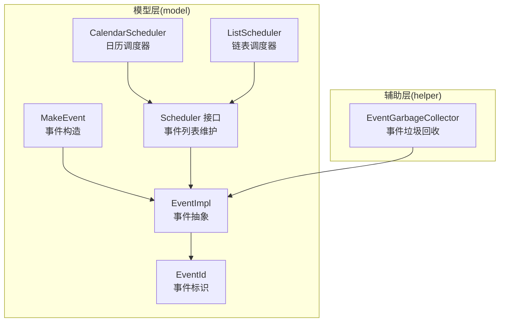
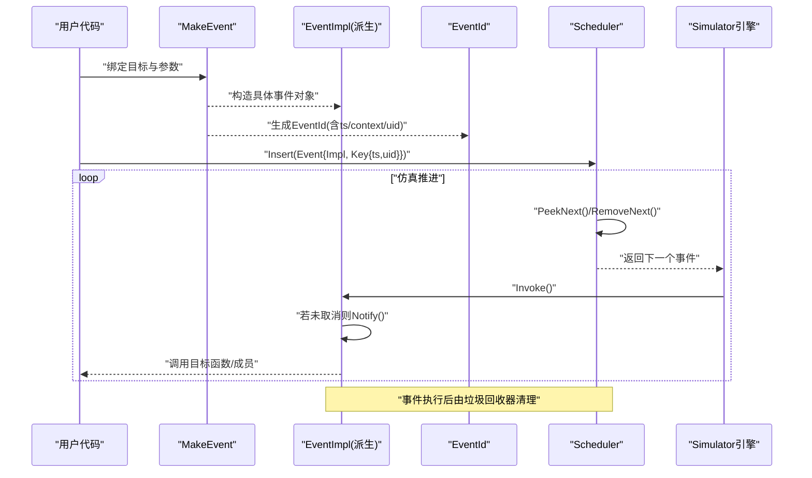
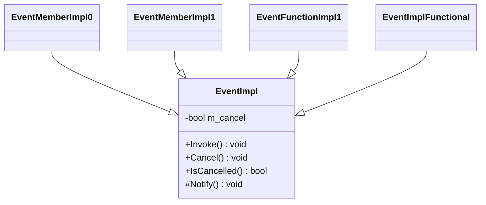
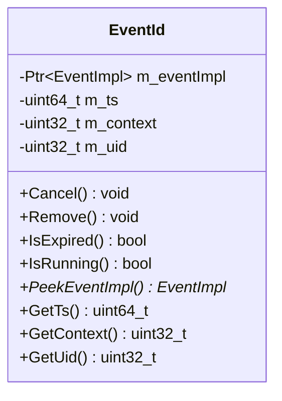
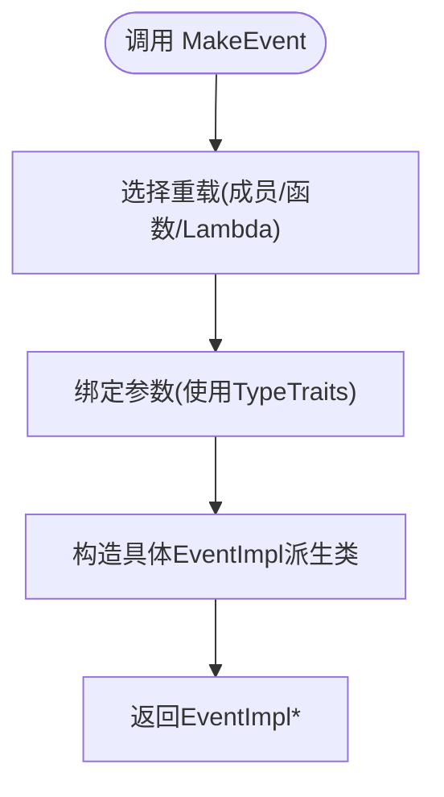
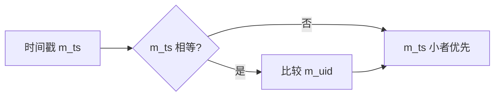
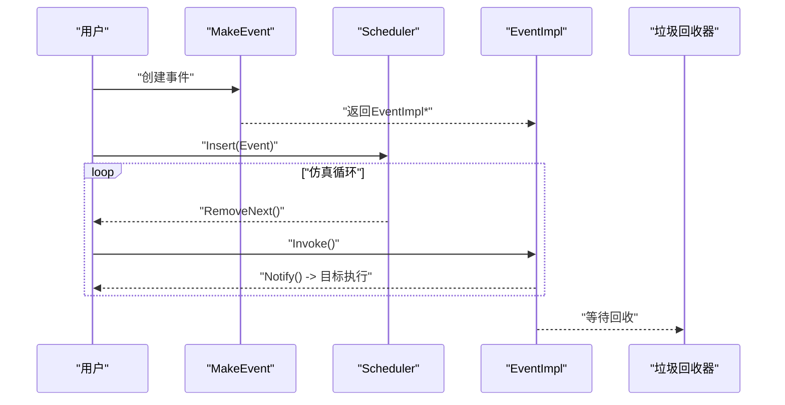
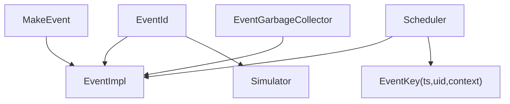

# 事件系统

<cite>
**本文引用的文件**
- [event-impl.h](file://simulator/ns-3.39/src/core/model/event-impl.h)
- [event-impl.cc](file://simulator/ns-3.39/src/core/model/event-impl.cc)
- [event-id.h](file://simulator/ns-3.39/src/core/model/event-id.h)
- [event-id.cc](file://simulator/ns-3.39/src/core/model/event-id.cc)
- [make-event.h](file://simulator/ns-3.39/src/core/model/make-event.h)
- [make-event.cc](file://simulator/ns-3.39/src/core/model/make-event.cc)
- [scheduler.h](file://simulator/ns-3.39/src/core/model/scheduler.h)
- [calendar-scheduler.h](file://simulator/ns-3.39/src/core/model/calendar-scheduler.h)
- [list-scheduler.h](file://simulator/ns-3.39/src/core/model/list-scheduler.h)
- [event-garbage-collector.h](file://simulator/ns-3.39/src/core/helper/event-garbage-collector.h)
- [event-garbage-collector.cc](file://simulator/ns-3.39/src/core/helper/event-garbage-collector.cc)
</cite>

## 目录
1. [引言](#引言)
2. [项目结构](#项目结构)
3. [核心组件](#核心组件)
4. [架构总览](#架构总览)
5. [详细组件分析](#详细组件分析)
6. [依赖关系分析](#依赖关系分析)
7. [性能考量](#性能考量)
8. [故障排查指南](#故障排查指南)
9. [结论](#结论)
10. [附录：使用示例与最佳实践](#附录使用示例与最佳实践)

## 引言
本文件系统化阐述 ns-3 的事件系统设计与实现，重点覆盖以下方面：
- 事件调度机制与生命周期：从事件创建、入队、执行到销毁的完整流程
- 核心类设计：EventImpl 的抽象与多态、EventId 的标识与取消语义
- 事件优先级与排序：基于时间戳与唯一 ID 的稳定排序
- make-event 函数族：从成员函数指针、普通函数指针、lambda 到带参数绑定的通用封装
- 不同类型事件：一次性事件、可取消事件、销毁时事件等
- 性能与内存管理：调度器复杂度、垃圾回收与引用计数策略

## 项目结构
事件系统位于 core 模块的 model 与 helper 子目录中，核心文件如下：
- model 层：事件抽象与调度接口（event-impl.*、event-id.*、make-event.*、scheduler.*）
- helper 层：事件垃圾回收器（event-garbage-collector.*）
- scheduler 实现：如 calendar-scheduler.h、list-scheduler.h 等（在 model 下）

**图表来源**
- [event-impl.h:45-81](file://simulator/ns-3.39/src/core/model/event-impl.h#L45-L81)
- [event-id.h:54-150](file://simulator/ns-3.39/src/core/model/event-id.h#L54-L150)
- [make-event.h:396-424](file://simulator/ns-3.39/src/core/model/make-event.h#L396-L424)
- [scheduler.h:156-229](file://simulator/ns-3.39/src/core/model/scheduler.h#L156-L229)
- [calendar-scheduler.h](file://simulator/ns-3.39/src/core/model/calendar-scheduler.h)
- [list-scheduler.h](file://simulator/ns-3.39/src/core/model/list-scheduler.h)
- [event-garbage-collector.h](file://simulator/ns-3.39/src/core/helper/event-garbage-collector.h)

**章节来源**
- [event-impl.h:1-86](file://simulator/ns-3.39/src/core/model/event-impl.h#L1-L86)
- [event-id.h:1-178](file://simulator/ns-3.39/src/core/model/event-id.h#L1-L178)
- [make-event.h:1-968](file://simulator/ns-3.39/src/core/model/make-event.h#L1-L968)
- [scheduler.h:1-368](file://simulator/ns-3.39/src/core/model/scheduler.h#L1-L368)

## 核心组件
- EventImpl：所有具体事件的基类，负责执行入口 Invoke() 与取消标记 Cancel()/IsCancelled()。Notify() 为子类必须实现的虚函数，实际调用被绑定的目标函数或成员函数。
- EventId：事件的轻量标识，包含底层 EventImpl 指针、虚拟时间戳、上下文与唯一 ID。提供取消、移除、过期判断等便捷方法，并作为调度器内部比较与排序的关键字段。
- MakeEvent：模板函数族，支持成员函数指针、普通函数指针、lambda 及最多六参的参数绑定，返回 EventImpl 派生对象，供调度器插入。
- Scheduler：抽象调度器接口，定义插入、取出、删除、空表检测等操作；并以 EventKey（含时间戳与唯一 ID）进行稳定排序，确保同时刻事件的确定性顺序。

**章节来源**
- [event-impl.h:45-81](file://simulator/ns-3.39/src/core/model/event-impl.h#L45-L81)
- [event-impl.cc:46-68](file://simulator/ns-3.39/src/core/model/event-impl.cc#L46-L68)
- [event-id.h:54-150](file://simulator/ns-3.39/src/core/model/event-id.h#L54-L150)
- [event-id.cc:54-108](file://simulator/ns-3.39/src/core/model/event-id.cc#L54-L108)
- [make-event.h:396-424](file://simulator/ns-3.39/src/core/model/make-event.h#L396-L424)
- [scheduler.h:169-229](file://simulator/ns-3.39/src/core/model/scheduler.h#L169-L229)

## 架构总览
下图展示了事件从创建到执行的端到端流程，以及调度器与垃圾回收的角色分工。

**图表来源**
- [make-event.h:396-424](file://simulator/ns-3.39/src/core/model/make-event.h#L396-L424)
- [event-impl.cc:46-54](file://simulator/ns-3.39/src/core/model/event-impl.cc#L46-L54)
- [scheduler.h:197-228](file://simulator/ns-3.39/src/core/model/scheduler.h#L197-L228)
- [event-garbage-collector.h](file://simulator/ns-3.39/src/core/helper/event-garbage-collector.h)

## 详细组件分析

### EventImpl：事件抽象与执行入口
- 设计要点
  - 继承 SimpleRefCount，通过智能指针管理生命周期
  - Invoke() 在未取消状态下委托 Notify() 执行
  - Cancel()/IsCancelled() 提供事件取消语义
- 关键行为
  - 调用链：Simulator 调用 EventImpl::Invoke -> 子类 EventImpl::Notify -> 目标函数/成员函数
  - 取消标志在调度器遍历时跳过执行，避免重复销毁

**图表来源**
- [event-impl.h:45-81](file://simulator/ns-3.39/src/core/model/event-impl.h#L45-L81)
- [make-event.h:400-424](file://simulator/ns-3.39/src/core/model/make-event.h#L400-L424)
- [make-event.h:681-708](file://simulator/ns-3.39/src/core/model/make-event.h#L681-L708)
- [make-event.h:941-963](file://simulator/ns-3.39/src/core/model/make-event.h#L941-L963)

**章节来源**
- [event-impl.h:45-81](file://simulator/ns-3.39/src/core/model/event-impl.h#L45-L81)
- [event-impl.cc:46-68](file://simulator/ns-3.39/src/core/model/event-impl.cc#L46-L68)

### EventId：事件标识与生命周期控制
- 字段含义
  - m_eventImpl：指向具体事件实现
  - m_ts：虚拟时间戳（用于排序）
  - m_context：执行上下文（用于区分不同执行环境）
  - m_uid：唯一 ID（用于同时刻事件的稳定排序）
- 方法语义
  - Cancel()/Remove() 委托 Simulator 进行取消/移除
  - IsExpired()/IsRunning() 提供状态查询
  - PeekEventImpl()/GetTs()/GetContext()/GetUid() 供调度器内部使用

**图表来源**
- [event-id.h:54-150](file://simulator/ns-3.39/src/core/model/event-id.h#L54-L150)
- [event-id.cc:54-108](file://simulator/ns-3.39/src/core/model/event-id.cc#L54-L108)

**章节来源**
- [event-id.h:54-150](file://simulator/ns-3.39/src/core/model/event-id.h#L54-L150)
- [event-id.cc:54-108](file://simulator/ns-3.39/src/core/model/event-id.cc#L54-L108)

### make-event 函数族：事件创建与参数绑定
- 支持类型
  - 成员函数指针：零至六参版本，自动处理对象引用转换
  - 普通函数指针：零至六参版本
  - Lambda：无参版本
- 参数传递机制
  - 使用 TypeTraits 将实参转换为“引用类型”存储，避免拷贝开销与值传播问题
  - Notify() 中按绑定顺序调用目标函数/成员函数
- 返回值
  - 返回具体 EventImpl 派生对象，随后由调度器插入

**图表来源**
- [make-event.h:396-424](file://simulator/ns-3.39/src/core/model/make-event.h#L396-L424)
- [make-event.h:676-708](file://simulator/ns-3.39/src/core/model/make-event.h#L676-L708)
- [make-event.h:937-963](file://simulator/ns-3.39/src/core/model/make-event.h#L937-L963)

**章节来源**
- [make-event.h:396-424](file://simulator/ns-3.39/src/core/model/make-event.h#L396-L424)
- [make-event.h:676-708](file://simulator/ns-3.39/src/core/model/make-event.h#L676-L708)
- [make-event.h:937-963](file://simulator/ns-3.39/src/core/model/make-event.h#L937-L963)

### 调度器接口与事件优先级
- Scheduler 接口
  - 定义插入、取出、删除、判空等操作
  - EventKey 含 m_ts、m_uid、m_context，用于稳定排序
- 优先级规则
  - 首先按时间戳 m_ts 升序
  - 若时间戳相同，按 m_uid 升序，保证同刻事件的确定性顺序
- 复杂度概览
  - CalendarScheduler/Heap/List/Map/PriorityQueue：见 scheduler.h 表格注释

**图表来源**
- [scheduler.h:273-311](file://simulator/ns-3.39/src/core/model/scheduler.h#L273-L311)

**章节来源**
- [scheduler.h:169-229](file://simulator/ns-3.39/src/core/model/scheduler.h#L169-L229)
- [scheduler.h:273-311](file://simulator/ns-3.39/src/core/model/scheduler.h#L273-L311)

### 事件生命周期：创建、排队、执行、销毁
- 创建
  - 用户通过 MakeEvent 绑定目标与参数，得到 EventImpl 派生对象
- 入队
  - Scheduler::Insert 将 Event{Impl, Key{ts, uid}} 插入事件列表
- 执行
  - Scheduler::RemoveNext 取出最早事件；Simulator::Invoke 调用 EventImpl::Invoke
  - 若未取消，则调用 Notify() 执行目标
- 销毁
  - 事件执行完成后交由垃圾回收器统一清理，避免悬挂指针与重复释放

**图表来源**
- [make-event.h:396-424](file://simulator/ns-3.39/src/core/model/make-event.h#L396-L424)
- [scheduler.h:197-228](file://simulator/ns-3.39/src/core/model/scheduler.h#L197-L228)
- [event-impl.cc:46-54](file://simulator/ns-3.39/src/core/model/event-impl.cc#L46-L54)
- [event-garbage-collector.h](file://simulator/ns-3.39/src/core/helper/event-garbage-collector.h)

**章节来源**
- [event-impl.cc:46-68](file://simulator/ns-3.39/src/core/model/event-impl.cc#L46-L68)
- [scheduler.h:197-228](file://simulator/ns-3.39/src/core/model/scheduler.h#L197-L228)
- [event-garbage-collector.cc](file://simulator/ns-3.39/src/core/helper/event-garbage-collector.cc)

## 依赖关系分析
- 组件耦合
  - EventId 依赖 EventImpl 指针与 Simulator 的取消/移除接口
  - Scheduler 依赖 EventImpl 指针与 EventKey 排序
  - MakeEvent 依赖 EventImpl 抽象，生成具体派生类
- 外部依赖
  - 日志组件用于调试输出
  - 引用计数（SimpleRefCount）与智能指针（Ptr）贯穿事件生命周期管理

**图表来源**
- [make-event.h:396-424](file://simulator/ns-3.39/src/core/model/make-event.h#L396-L424)
- [event-id.h:54-150](file://simulator/ns-3.39/src/core/model/event-id.h#L54-L150)
- [scheduler.h:169-187](file://simulator/ns-3.39/src/core/model/scheduler.h#L169-L187)
- [event-garbage-collector.h](file://simulator/ns-3.39/src/core/helper/event-garbage-collector.h)

**章节来源**
- [event-id.cc:54-108](file://simulator/ns-3.39/src/core/model/event-id.cc#L54-L108)
- [scheduler.h:169-187](file://simulator/ns-3.39/src/core/model/scheduler.h#L169-L187)

## 性能考量
- 调度器复杂度
  - 不同调度器的时间/空间复杂度差异显著，需根据模型特征选择（见 scheduler.h 表格注释）
- 取消策略
  - Cancel 通常只打标记，不立即移除，降低删除成本但增加列表长度
  - 若需要控制内存占用，可结合 Remove 主动清理
- 参数绑定
  - TypeTraits 将参数转为引用类型，减少拷贝与提升稳定性
- 并发与上下文
  - EventId 的 context 字段可用于区分执行上下文，避免跨上下文误触发

[本节为通用指导，无需列出具体文件来源]

## 故障排查指南
- 事件未执行
  - 检查是否调用了 Cancel 或 IsCancelled 返回 true
  - 核对时间戳与当前仿真时间的关系
- 事件重复执行或崩溃
  - 确认事件对象生命周期由引用计数与垃圾回收器管理
  - 避免在事件执行期间修改其关联对象状态导致悬垂指针
- 内存泄漏或崩溃
  - 确保通过 EventId 的 Cancel/Remove 正确管理事件
  - 使用日志宏定位事件创建/执行路径

**章节来源**
- [event-impl.cc:46-68](file://simulator/ns-3.39/src/core/model/event-impl.cc#L46-L68)
- [event-id.cc:54-108](file://simulator/ns-3.39/src/core/model/event-id.cc#L54-L108)
- [event-garbage-collector.cc](file://simulator/ns-3.39/src/core/helper/event-garbage-collector.cc)

## 结论
ns-3 的事件系统通过 EventImpl 的抽象、EventId 的标识与 MakeEvent 的通用绑定，构建了高扩展性的调度框架。Scheduler 的多种实现满足不同性能需求，而垃圾回收器与引用计数保障了内存安全。合理选择调度器、正确使用取消与移除、理解参数绑定机制，是获得高性能与稳定性的关键。

[本节为总结性内容，无需列出具体文件来源]

## 附录：使用示例与最佳实践
- 一次性事件
  - 使用 MakeEvent 绑定目标与参数，随后通过 Scheduler::Insert 入队
  - 示例参考路径：[make-event.h:396-424](file://simulator/ns-3.39/src/core/model/make-event.h#L396-L424)
- 回调事件（成员函数）
  - 绑定对象与成员函数指针，支持零至六参
  - 示例参考路径：[make-event.h:426-458](file://simulator/ns-3.39/src/core/model/make-event.h#L426-L458)
- 回调事件（普通函数/lambda）
  - 函数指针与 lambda 无参版本
  - 示例参考路径：[make-event.h:676-708](file://simulator/ns-3.39/src/core/model/make-event.h#L676-L708), [make-event.h:937-963](file://simulator/ns-3.39/src/core/model/make-event.h#L937-L963)
- 取消与移除
  - 通过 EventId::Cancel/Remove 或 Simulator 接口管理事件
  - 示例参考路径：[event-id.cc:54-108](file://simulator/ns-3.39/src/core/model/event-id.cc#L54-L108)
- 事件优先级与上下文
  - 合理设置时间戳与上下文，确保同刻事件的确定性顺序
  - 示例参考路径：[scheduler.h:273-311](file://simulator/ns-3.39/src/core/model/scheduler.h#L273-L311)
- 性能优化建议
  - 根据模型特征选择合适调度器（见 scheduler.h 表格注释）
  - 控制事件数量与参数拷贝，必要时使用 Remove 清理列表

**章节来源**
- [make-event.h:396-424](file://simulator/ns-3.39/src/core/model/make-event.h#L396-L424)
- [make-event.h:676-708](file://simulator/ns-3.39/src/core/model/make-event.h#L676-L708)
- [make-event.h:937-963](file://simulator/ns-3.39/src/core/model/make-event.h#L937-L963)
- [event-id.cc:54-108](file://simulator/ns-3.39/src/core/model/event-id.cc#L54-L108)
- [scheduler.h:97-137](file://simulator/ns-3.39/src/core/model/scheduler.h#L97-L137)