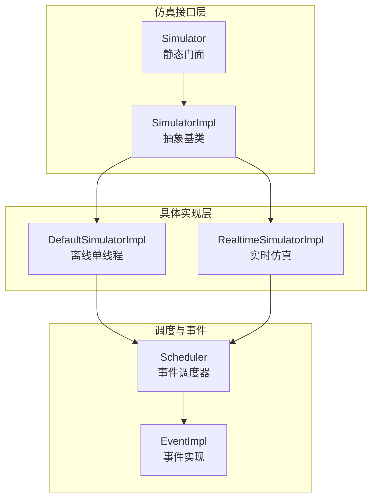
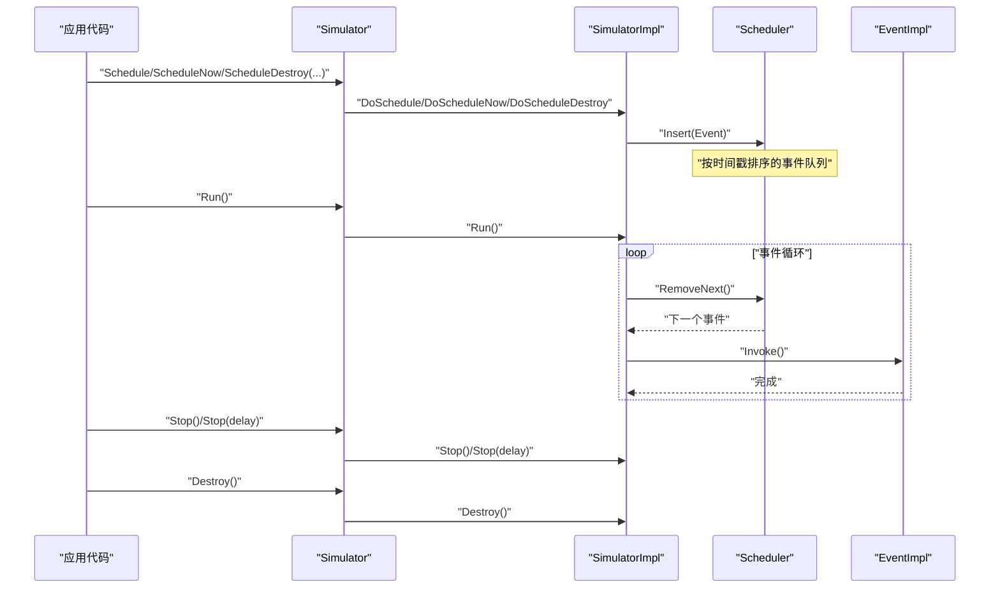
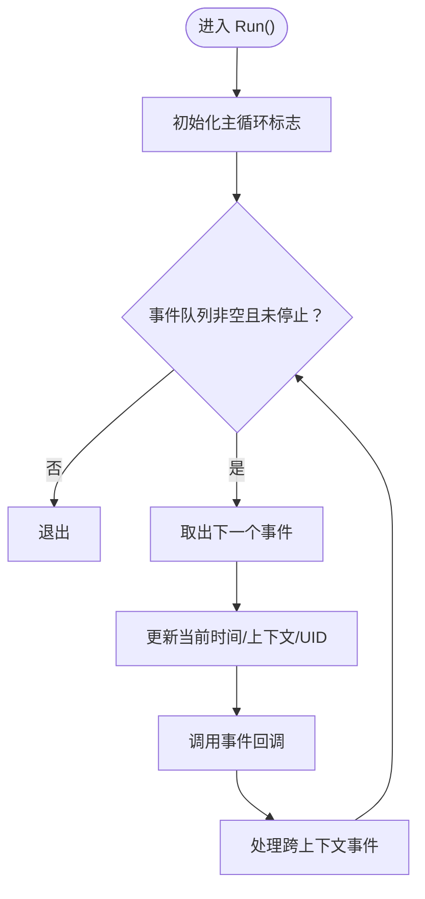
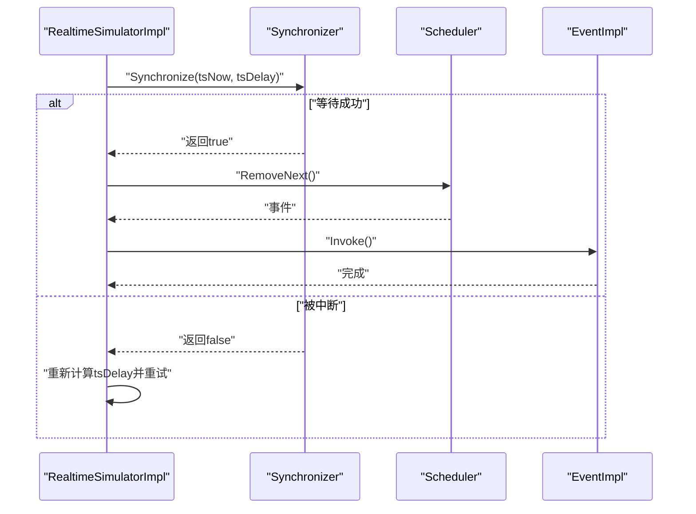
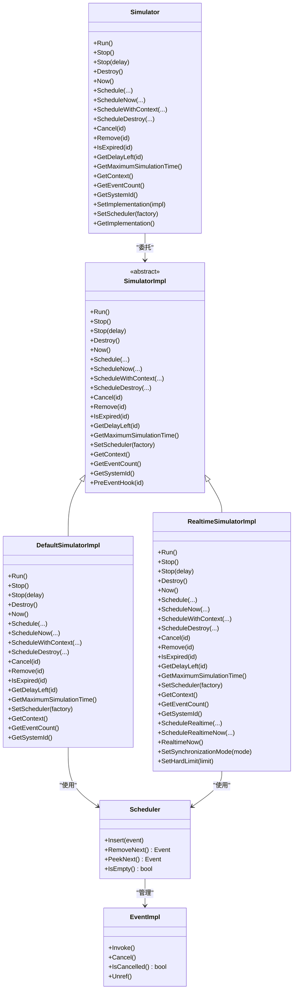

# 仿真引擎

<cite>
**本文引用的文件**   
- [simulator.h](file://simulator/ns-3.39/src/core/model/simulator.h)
- [simulator.cc](file://simulator/ns-3.39/src/core/model/simulator.cc)
- [simulator-impl.h](file://simulator/ns-3.39/src/core/model/simulator-impl.h)
- [simulator-impl.cc](file://simulator/ns-3.39/src/core/model/simulator-impl.cc)
- [default-simulator-impl.h](file://simulator/ns-3.39/src/core/model/default-simulator-impl.h)
- [default-simulator-impl.cc](file://simulator/ns-3.39/src/core/model/default-simulator-impl.cc)
- [realtime-simulator-impl.h](file://simulator/ns-3.39/src/core/model/realtime-simulator-impl.h)
- [realtime-simulator-impl.cc](file://simulator/ns-3.39/src/core/model/realtime-simulator-impl.cc)
- [sample-simulator.cc](file://simulator/ns-3.39/src/core/examples/sample-simulator.cc)
- [hello-simulator.cc](file://simulator/ns-3.39/examples/tutorial/hello-simulator.cc)
</cite>

## 目录
1. [引言](#引言)
2. [项目结构](#项目结构)
3. [核心组件](#核心组件)
4. [体系结构总览](#体系结构总览)
5. [详细组件分析](#详细组件分析)
6. [依赖关系分析](#依赖关系分析)
7. [性能考量](#性能考量)
8. [故障排查指南](#故障排查指南)
9. [结论](#结论)
10. [附录](#附录)

## 引言
本文件系统化梳理 NS-3 仿真引擎中的 Simulator 类及其底层实现，重点覆盖以下方面：
- 仿真时间推进与事件调度机制
- 仿真状态管理（运行、停止、销毁）
- 默认仿真实现与实时仿真实现的差异
- 初始化流程、运行循环与停止条件
- 启动、控制与停止仿真的实践路径
- 实时仿真与离线仿真的配置方法
- 性能优化建议与调试技巧

## 项目结构
围绕仿真引擎的核心代码位于 core 模块的 model 层，主要由三部分构成：
- 接口层：Simulator 与 SimulatorImpl 抽象接口
- 默认实现：DefaultSimulatorImpl（单线程离线仿真）
- 实时实现：RealtimeSimulatorImpl（基于同步器的实时仿真）

**图示来源**
- [simulator.h:67-531](file://simulator/ns-3.39/src/core/model/simulator.h#L67-L531)
- [simulator-impl.h:48-110](file://simulator/ns-3.39/src/core/model/simulator-impl.h#L48-L110)
- [default-simulator-impl.h:46-139](file://simulator/ns-3.39/src/core/model/default-simulator-impl.h#L46-L139)
- [realtime-simulator-impl.h:54-232](file://simulator/ns-3.39/src/core/model/realtime-simulator-impl.h#L54-L232)

**章节来源**
- [simulator.h:67-531](file://simulator/ns-3.39/src/core/model/simulator.h#L67-L531)
- [simulator-impl.h:48-110](file://simulator/ns-3.39/src/core/model/simulator-impl.h#L48-L110)

## 核心组件
- Simulator 静态门面
  - 提供统一入口：设置实现、设置调度器、运行、停止、销毁、查询当前时间、事件调度 API 等
  - 负责延迟初始化内部实现与调度器，并在必要时注册默认日志打印器
- SimulatorImpl 抽象接口
  - 定义所有仿真行为的纯虚函数：Run、Stop、Schedule、Now、GetDelayLeft、GetMaximumSimulationTime、SetScheduler、GetContext、GetEventCount 等
- DefaultSimulatorImpl（默认实现）
  - 单线程、离线模式；维护优先队列式调度器、事件计数、上下文切换缓冲、销毁事件队列等
  - 通过模板重载的 Schedule/Now/Destroy 方法将用户函数包装为 EventImpl 并插入调度器
- RealtimeSimulatorImpl（实时实现）
  - 基于 Synchronizer 的实时仿真，支持“尽力同步”和“硬限制”两种同步策略
  - 在每次事件执行前后调用同步器以保证仿真时间与真实时间对齐

**章节来源**
- [simulator.h:67-531](file://simulator/ns-3.39/src/core/model/simulator.h#L67-L531)
- [simulator-impl.h:48-110](file://simulator/ns-3.39/src/core/model/simulator-impl.h#L48-L110)
- [default-simulator-impl.h:46-139](file://simulator/ns-3.39/src/core/model/default-simulator-impl.h#L46-L139)
- [realtime-simulator-impl.h:54-232](file://simulator/ns-3.39/src/core/model/realtime-simulator-impl.h#L54-232)

## 体系结构总览
下图展示了从应用到仿真内核的关键交互路径。

**图示来源**
- [simulator.cc:175-181](file://simulator/ns-3.39/src/core/model/simulator.cc#L175-L181)
- [default-simulator-impl.cc:186-203](file://simulator/ns-3.39/src/core/model/default-simulator-impl.cc#L186-L203)
- [realtime-simulator-impl.cc:421-480](file://simulator/ns-3.39/src/core/model/realtime-simulator-impl.cc#L421-L480)

## 详细组件分析

### Simulator 类与静态门面
- 关键职责
  - 统一的仿真控制入口：运行、停止、销毁、查询当前时间、事件调度
  - 支持动态替换仿真实现与调度器类型
  - 事件生命周期管理：Schedule/ScheduleNow/ScheduleWithContext/ScheduleDestroy、Cancel/Remove/IsExpired、GetDelayLeft/GetMaximumSimulationTime
- 设计要点
  - 使用延迟初始化：首次调用时才创建 SimulatorImpl 与调度器
  - 通过全局值控制默认实现与调度器类型
  - 对外暴露模板化的 Schedule/Now/Destroy，内部委托给具体实现

**章节来源**
- [simulator.h:67-531](file://simulator/ns-3.39/src/core/model/simulator.h#L67-L531)
- [simulator.cc:88-137](file://simulator/ns-3.39/src/core/model/simulator.cc#L88-L137)
- [simulator.cc:335-368](file://simulator/ns-3.39/src/core/model/simulator.cc#L335-L368)

### SimulatorImpl 抽象接口
- 规定所有实现必须提供的能力：运行、停止、销毁、调度、查询、上下文与事件统计
- 为不同仿真模式（离线/实时）提供一致的对外契约

**章节来源**
- [simulator-impl.h:48-110](file://simulator/ns-3.39/src/core/model/simulator-impl.h#L48-L110)

### DefaultSimulatorImpl（默认仿真实现）
- 运行循环
  - 从调度器取出下一个事件，更新当前时间与上下文，执行后处理跨上下文事件
  - 当事件队列为空或显式停止标志置位时退出
- 事件调度
  - 相对时间计算基于当前仿真时间戳，插入调度器
  - 支持上下文事件缓冲与主线程校验
- 销毁阶段
  - 执行所有“销毁时”事件，确保资源清理与泄漏检测友好
- 状态与度量
  - 记录事件总数、未调度事件计数，提供上下文与事件计数查询

**图示来源**
- [default-simulator-impl.cc:186-203](file://simulator/ns-3.39/src/core/model/default-simulator-impl.cc#L186-L203)
- [default-simulator-impl.cc:130-148](file://simulator/ns-3.39/src/core/model/default-simulator-impl.cc#L130-L148)

**章节来源**
- [default-simulator-impl.h:46-139](file://simulator/ns-3.39/src/core/model/default-simulator-impl.h#L46-L139)
- [default-simulator-impl.cc:186-203](file://simulator/ns-3.39/src/core/model/default-simulator-impl.cc#L186-L203)
- [default-simulator-impl.cc:222-241](file://simulator/ns-3.39/src/core/model/default-simulator-impl.cc#L222-L241)

### RealtimeSimulatorImpl（实时仿真实现）
- 同步策略
  - “尽力同步”：落后时不强制终止，继续推进
  - “硬限制”：超过阈值触发致命错误，严格控制抖动
- 时间推进
  - 通过 Synchronizer 将仿真时间与真实时间对齐，等待至事件到期
  - 外部事件可能打断等待，重新评估下次等待时间
- 事件调度
  - 提供“实时相对时间”与“实时绝对时间”的调度方法
  - 调度后唤醒等待线程，确保及时响应
- 线程安全
  - 关键状态与事件队列受互斥锁保护
  - 运行状态与停止标志独立管理

**图示来源**
- [realtime-simulator-impl.cc:163-395](file://simulator/ns-3.39/src/core/model/realtime-simulator-impl.cc#L163-L395)
- [realtime-simulator-impl.cc:511-538](file://simulator/ns-3.39/src/core/model/realtime-simulator-impl.cc#L511-L538)

**章节来源**
- [realtime-simulator-impl.h:54-232](file://simulator/ns-3.39/src/core/model/realtime-simulator-impl.h#L54-L232)
- [realtime-simulator-impl.cc:421-480](file://simulator/ns-3.39/src/core/model/realtime-simulator-impl.cc#L421-L480)
- [realtime-simulator-impl.cc:511-538](file://simulator/ns-3.39/src/core/model/realtime-simulator-impl.cc#L511-L538)

### 事件调度机制与上下文
- 事件封装
  - 用户函数通过模板包装为 EventImpl，携带时间戳、上下文、唯一 UID
- 上下文切换
  - 不同上下文的事件可由不同线程调度，但需通过专用接口保证一致性
- 销毁事件
  - 在 Destroy 阶段统一执行，避免泄漏误报

**章节来源**
- [simulator.h:214-391](file://simulator/ns-3.39/src/core/model/simulator.h#L214-L391)
- [default-simulator-impl.h:90-139](file://simulator/ns-3.39/src/core/model/default-simulator-impl.h#L90-L139)
- [default-simulator-impl.cc:284-294](file://simulator/ns-3.39/src/core/model/default-simulator-impl.cc#L284-L294)

## 依赖关系分析
- Simulator 依赖 SimulatorImpl 抽象，具体实现通过对象工厂创建
- SimulatorImpl 依赖 Scheduler 与 EventImpl
- DefaultSimulatorImpl 与 RealtimeSimulatorImpl 分别持有各自的调度器实例
- RealtimeSimulatorImpl 依赖 Synchronizer 以实现与真实时间的同步

**图示来源**
- [simulator.h:67-531](file://simulator/ns-3.39/src/core/model/simulator.h#L67-L531)
- [simulator-impl.h:48-110](file://simulator/ns-3.39/src/core/model/simulator-impl.h#L48-L110)
- [default-simulator-impl.h:46-139](file://simulator/ns-3.39/src/core/model/default-simulator-impl.h#L46-L139)
- [realtime-simulator-impl.h:54-232](file://simulator/ns-3.39/src/core/model/realtime-simulator-impl.h#L54-L232)

**章节来源**
- [simulator.cc:101-137](file://simulator/ns-3.39/src/core/model/simulator.cc#L101-L137)
- [default-simulator-impl.cc:106-120](file://simulator/ns-3.39/src/core/model/default-simulator-impl.cc#L106-L120)
- [realtime-simulator-impl.cc:141-160](file://simulator/ns-3.39/src/core/model/realtime-simulator-impl.cc#L141-L160)

## 性能考量
- 事件调度复杂度
  - DefaultSimulatorImpl 使用调度器队列插入/删除，典型为对数级复杂度
  - 取消操作（Cancel）为 O(1)，移除操作（Remove）通常更高，应谨慎使用
- 线程模型
  - DefaultSimulatorImpl 为单线程，避免上下文切换开销
  - RealtimeSimulatorImpl 使用互斥锁保护共享状态，注意临界区长度
- 实时同步
  - RealtimeSimulatorImpl 的等待与唤醒依赖同步器，合理设置同步模式与硬限制阈值
- 日志与开销
  - 避免在高频路径中进行日志输出，以免引发递归或栈溢出

[本节为通用指导，无需特定文件引用]

## 故障排查指南
- 常见问题
  - 在事件回调中调用 Now/IsExpired/GetDelayLeft 等 API 时，若事件已过期或取消，行为符合预期
  - 销毁阶段无法取消/移除“销毁时”事件，否则会触发程序错误
  - DefaultSimulatorImpl 的 Schedule/ScheduleNow/ScheduleDestroy 必须在主线程调用
- 调试技巧
  - 使用示例程序验证调度链路与运行循环
  - 利用事件计数与最大仿真时间接口辅助定位异常
  - 实时模式下关注同步器状态与抖动阈值

**章节来源**
- [simulator.h:394-436](file://simulator/ns-3.39/src/core/model/simulator.h#L394-L436)
- [default-simulator-impl.cc:276-294](file://simulator/ns-3.39/src/core/model/default-simulator-impl.cc#L276-L294)
- [realtime-simulator-impl.cc:397-407](file://simulator/ns-3.39/src/core/model/realtime-simulator-impl.cc#L397-L407)

## 结论
NS-3 的仿真引擎通过 Simulator 静态门面与 SimulatorImpl 抽象接口，将仿真控制、事件调度与时间推进解耦。默认实现适合离线批处理场景，实时实现满足与真实时间对齐的需求。正确选择实现与调度器、合理安排事件上下文与调度时机，是获得稳定与高性能仿真的关键。

[本节为总结性内容，无需特定文件引用]

## 附录

### 启动、控制与停止仿真的示例路径
- 示例程序展示了如何：
  - 使用 Schedule/ScheduleNow/ScheduleWithContext/ScheduleDestroy 安排事件
  - 使用 Cancel 移除事件
  - 使用 Run 开始仿真，使用 Destroy 清理资源

**章节来源**
- [sample-simulator.cc:101-129](file://simulator/ns-3.39/src/core/examples/sample-simulator.cc#L101-L129)

### 默认仿真实现与自定义仿真实现的区别
- 默认实现（DefaultSimulatorImpl）
  - 单线程、离线模式，适合高吞吐与稳定性要求高的场景
  - 事件调度与销毁阶段清晰分离
- 自定义实现（通过 Simulator::SetImplementation 注入）
  - 可替换为多线程、分布式或特殊语义的实现
  - 需遵循 SimulatorImpl 接口契约，确保调度器与事件生命周期一致

**章节来源**
- [simulator.cc:335-368](file://simulator/ns-3.39/src/core/model/simulator.cc#L335-L368)
- [simulator-impl.h:48-110](file://simulator/ns-3.39/src/core/model/simulator-impl.h#L48-L110)

### 实时仿真与离线仿真的配置方法
- 选择实现
  - 默认：离线仿真（DefaultSimulatorImpl）
  - 实时：RealtimeSimulatorImpl（需配置同步器与同步模式）
- 同步模式
  - “尽力同步”：适合容错场景
  - “硬限制”：严格抖动控制，超限即致命错误
- 硬限制阈值
  - 通过属性设置最大允许抖动，用于硬限制模式

**章节来源**
- [realtime-simulator-impl.h:66-83](file://simulator/ns-3.39/src/core/model/realtime-simulator-impl.h#L66-L83)
- [realtime-simulator-impl.cc:53-74](file://simulator/ns-3.39/src/core/model/realtime-simulator-impl.cc#L53-L74)