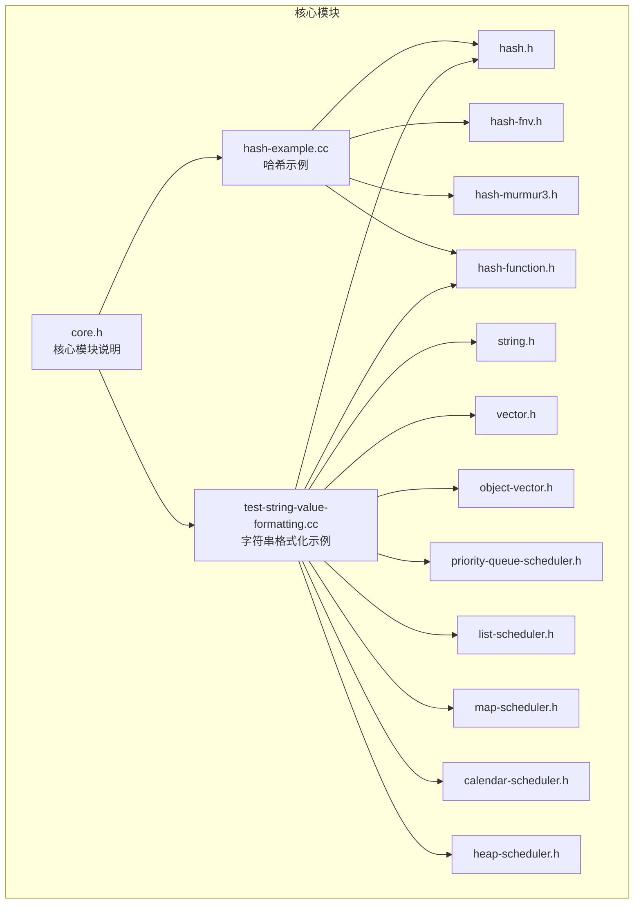
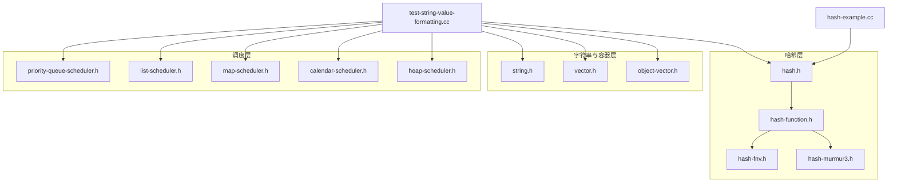
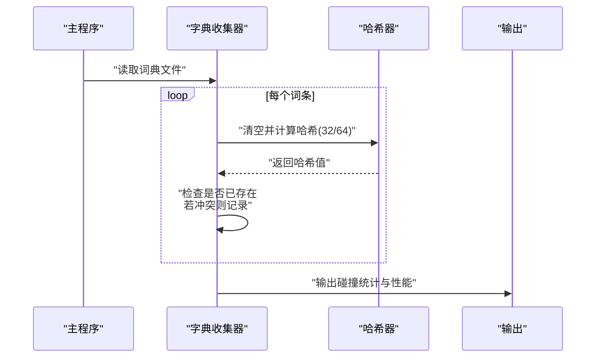
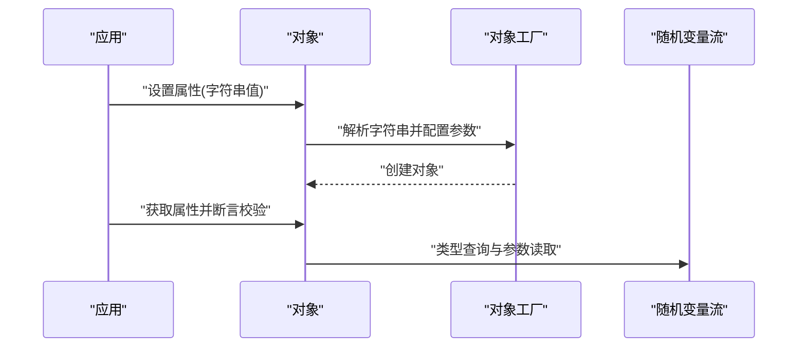
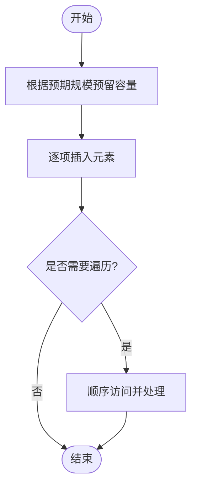
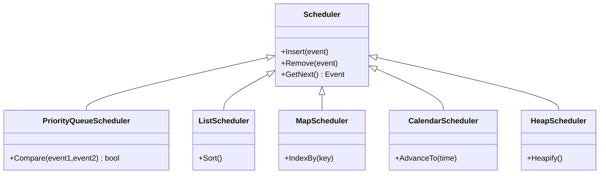
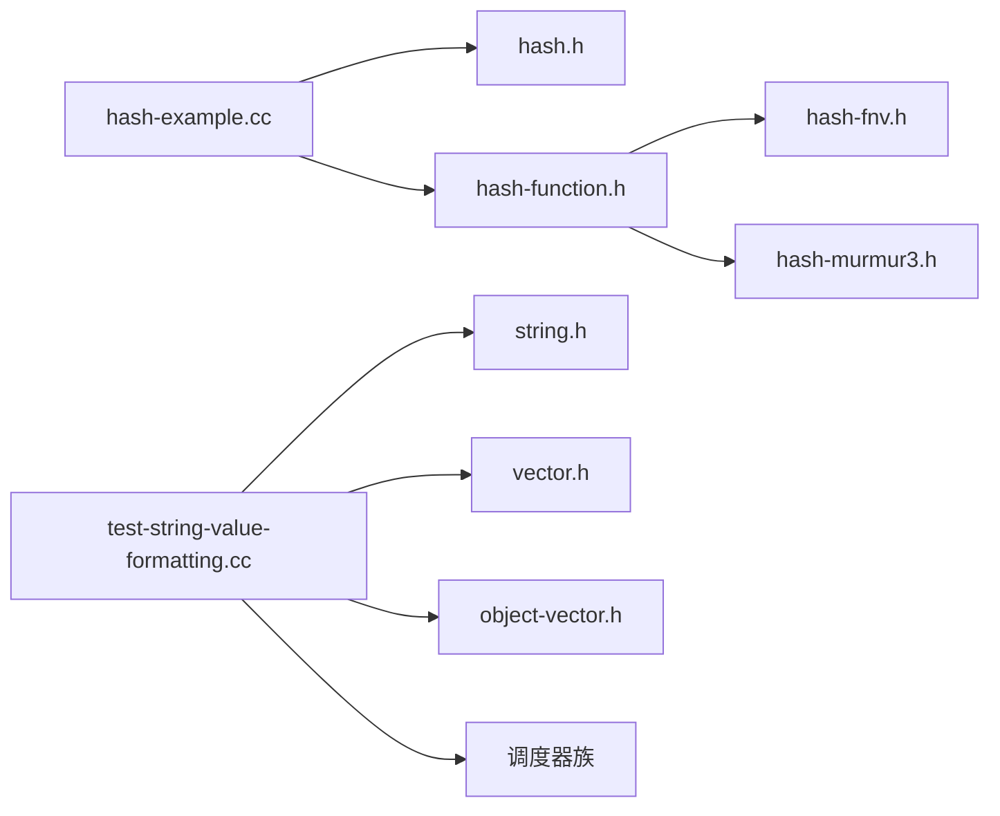

# 实用工具类

<cite>
**本文引用的文件**   
- [util.py](file://simulator/util.py)
- [constants.py](file://simulator/constants.py)
- [core.h](file://simulator/ns-3.39/src/core/doc/core.h)
- [hash-example.cc](file://simulator/ns-3.39/src/core/examples/hash-example.cc)
- [test-string-value-formatting.cc](file://simulator/ns-3.39/src/core/examples/test-string-value-formatting.cc)
- [hash.h](file://simulator/ns-3.39/build/include/ns3/hash.h)
- [hash-function.h](file://simulator/ns-3.39/build/include/ns3/hash-function.h)
- [hash-fnv.h](file://simulator/ns-3.39/build/include/ns3/hash-fnv.h)
- [hash-murmur3.h](file://simulator/ns-3.39/build/include/ns3/hash-murmur3.h)
- [string.h](file://simulator/ns-3.39/build/include/ns3/string.h)
- [vector.h](file://simulator/ns-3.39/build/include/ns3/vector.h)
- [object-vector.h](file://simulator/ns-3.39/build/include/ns3/object-vector.h)
- [calendar-scheduler.h](file://simulator/ns-3.39/build/include/ns3/calendar-scheduler.h)
- [heap-scheduler.h](file://simulator/ns-3.39/build/include/ns3/heap-scheduler.h)
- [list-scheduler.h](file://simulator/ns-3.39/build/include/ns3/list-scheduler.h)
- [map-scheduler.h](file://simulator/ns-3.39/build/include/ns3/map-scheduler.h)
- [priority-queue-scheduler.h](file://simulator/ns-3.39/build/include/ns3/priority-queue-scheduler.h)
</cite>

## 目录
1. [引言](#引言)
2. [项目结构](#项目结构)
3. [核心组件](#核心组件)
4. [架构总览](#架构总览)
5. [详细组件分析](#详细组件分析)
6. [依赖分析](#依赖分析)
7. [性能考虑](#性能考虑)
8. [故障排查指南](#故障排查指南)
9. [结论](#结论)
10. [附录](#附录)

## 引言
本文件聚焦于NS-3实用工具类的系统化文档，围绕以下主题展开：哈希函数族（FNV1a、Murmur3）、字符串处理与格式化、向量容器（基础向量、对象向量）以及调度器（优先队列、列表、映射、日历堆等）。我们将从设计思想、实现特点、性能特征、使用场景、线程安全与内存效率等方面进行深入解析，并结合仓库中的示例程序给出可操作的实践建议。

## 项目结构
NS-3核心模块位于 ns-3.39/src/core，其中包含：
- 文档与示例：doc/core.h、examples/*.cc
- 工具与模型：hash.*、string.h、vector.h、object-vector.h 等
- 调度器：calendar-scheduler.h、heap-scheduler.h、list-scheduler.h、map-scheduler.h、priority-queue-scheduler.h 等

下图概览了与“实用工具类”相关的核心文件与示例之间的关系：

图表来源
- [core.h:30-100](file://simulator/ns-3.39/src/core/doc/core.h#L30-L100)
- [hash-example.cc:16-100](file://simulator/ns-3.39/src/core/examples/hash-example.cc#L16-L100)
- [test-string-value-formatting.cc:18-36](file://simulator/ns-3.39/src/core/examples/test-string-value-formatting.cc#L18-L36)

章节来源
- [core.h:30-100](file://simulator/ns-3.39/src/core/doc/core.h#L30-L100)

## 核心组件
本节概述NS-3中与实用工具类直接相关的组件及其职责：
- 哈希工具：提供多种哈希算法（FNV1a、Murmur3），支持32/64位输出，用于字典构建、碰撞检测与性能评测。
- 字符串处理：通过字符串值格式化机制解析复杂属性配置，支持随机变量流等对象的工厂化创建与参数注入。
- 向量容器：基础向量与对象向量，用于存储同类型或对象指针集合，支持容量预留与迭代访问。
- 调度器：提供多种事件调度策略（优先队列、列表、映射、日历、堆），用于仿真事件的时间推进与管理。

章节来源
- [hash-example.cc:107-262](file://simulator/ns-3.39/src/core/examples/hash-example.cc#L107-L262)
- [test-string-value-formatting.cc:48-138](file://simulator/ns-3.39/src/core/examples/test-string-value-formatting.cc#L48-L138)
- [vector.h](file://simulator/ns-3.39/build/include/ns3/vector.h)
- [object-vector.h](file://simulator/ns-3.39/build/include/ns3/object-vector.h)
- [calendar-scheduler.h](file://simulator/ns-3.39/build/include/ns3/calendar-scheduler.h)
- [heap-scheduler.h](file://simulator/ns-3.39/build/include/ns3/heap-scheduler.h)
- [list-scheduler.h](file://simulator/ns-3.39/build/include/ns3/list-scheduler.h)
- [map-scheduler.h](file://simulator/ns-3.39/build/include/ns3/map-scheduler.h)
- [priority-queue-scheduler.h](file://simulator/ns-3.39/build/include/ns3/priority-queue-scheduler.h)

## 架构总览
下图展示了NS-3核心模块中“实用工具类”的高层交互关系：示例程序调用哈希与字符串处理接口，底层由哈希函数实现与调度器支撑；向量容器作为通用数据结构被广泛使用。

图表来源
- [hash-example.cc:16-32](file://simulator/ns-3.39/src/core/examples/hash-example.cc#L16-L32)
- [test-string-value-formatting.cc:18-30](file://simulator/ns-3.39/src/core/examples/test-string-value-formatting.cc#L18-L30)
- [hash-function.h](file://simulator/ns-3.39/build/include/ns3/hash-function.h)
- [hash-fnv.h](file://simulator/ns-3.39/build/include/ns3/hash-fnv.h)
- [hash-murmur3.h](file://simulator/ns-3.39/build/include/ns3/hash-murmur3.h)
- [hash.h](file://simulator/ns-3.39/build/include/ns3/hash.h)
- [string.h](file://simulator/ns-3.39/build/include/ns3/string.h)
- [vector.h](file://simulator/ns-3.39/build/include/ns3/vector.h)
- [object-vector.h](file://simulator/ns-3.39/build/include/ns3/object-vector.h)
- [priority-queue-scheduler.h](file://simulator/ns-3.39/build/include/ns3/priority-queue-scheduler.h)
- [list-scheduler.h](file://simulator/ns-3.39/build/include/ns3/list-scheduler.h)
- [map-scheduler.h](file://simulator/ns-3.39/build/include/ns3/map-scheduler.h)
- [calendar-scheduler.h](file://simulator/ns-3.39/build/include/ns3/calendar-scheduler.h)
- [heap-scheduler.h](file://simulator/ns-3.39/build/include/ns3/heap-scheduler.h)

## 详细组件分析

### 哈希函数族（FNV1a、Murmur3）
- 设计与用途
  - 提供多种哈希算法实现，支持32位与64位输出，适用于字典构建、键值映射、冲突检测与性能对比。
  - 示例程序通过读取词典文件，统计不同哈希算法的碰撞数量与执行时间，验证算法特性。
- 数据结构与流程
  - 使用字典映射记录每个哈希值首次出现的字符串，使用向量收集后续冲突对，最终输出统计结果与性能报告。
- 性能特征
  - 示例程序对每种算法重复执行多次，计算平均纳秒/哈希，便于横向比较。
- 使用场景
  - 需要快速散列字符串并评估碰撞率时，优先选择64位输出以降低碰撞概率。
  - 对性能敏感且碰撞率要求极低的场景，推荐Murmur3（64位）。
- 线程安全与内存
  - 哈希器在示例中按需构造与复用，未见共享状态；注意避免跨线程共享同一实例而未加锁。
- 最佳实践
  - 在大规模字典上测试前先进行容量预留，减少动态扩容开销。
  - 若需要稳定可复现的哈希序列，确保输入标准化（如统一大小写、去除多余空白）。

图表来源
- [hash-example.cc:147-262](file://simulator/ns-3.39/src/core/examples/hash-example.cc#L147-L262)
- [hash-example.cc:384-420](file://simulator/ns-3.39/src/core/examples/hash-example.cc#L384-L420)

章节来源
- [hash-example.cc:107-262](file://simulator/ns-3.39/src/core/examples/hash-example.cc#L107-L262)
- [hash-example.cc:384-420](file://simulator/ns-3.39/src/core/examples/hash-example.cc#L384-L420)
- [hash.h](file://simulator/ns-3.39/build/include/ns3/hash.h)
- [hash-function.h](file://simulator/ns-3.39/build/include/ns3/hash-function.h)
- [hash-fnv.h](file://simulator/ns-3.39/build/include/ns3/hash-fnv.h)
- [hash-murmur3.h](file://simulator/ns-3.39/build/include/ns3/hash-murmur3.h)

### 字符串处理与格式化
- 设计与用途
  - 通过字符串值解析机制，支持在配置中以字符串形式声明复杂对象（如随机变量流），并在运行时完成参数注入与对象创建。
  - 示例程序演示了属性设置、工厂创建与断言校验，覆盖合法与非法输入的边界情况。
- 处理流程
  - 将字符串转换为对象工厂参数，调用工厂创建对象，随后通过类型查询获取具体子类并验证属性。
- 编码与兼容性
  - 示例采用标准C++字符串与流式I/O，未涉及特殊编码；在多语言环境下应确保输入字符集一致。
- 使用场景
  - 配置驱动的仿真对象创建、参数注入与调试验证。
- 最佳实践
  - 严格遵循参数分隔符与括号闭合规则，避免因语法错误导致的解析失败。
  - 对外部输入进行预校验，提前发现不完整或非法的字符串格式。

图表来源
- [test-string-value-formatting.cc:140-209](file://simulator/ns-3.39/src/core/examples/test-string-value-formatting.cc#L140-L209)

章节来源
- [test-string-value-formatting.cc:48-138](file://simulator/ns-3.39/src/core/examples/test-string-value-formatting.cc#L48-L138)
- [test-string-value-formatting.cc:140-209](file://simulator/ns-3.39/src/core/examples/test-string-value-formatting.cc#L140-L209)
- [string.h](file://simulator/ns-3.39/build/include/ns3/string.h)

### 向量容器（基础向量与对象向量）
- 设计与用途
  - 基础向量用于存储同质元素（如字符串、数值），支持容量预留与顺序访问。
  - 对象向量用于存储对象指针集合，便于统一管理生命周期与类型安全。
- 内存管理策略
  - 容量预留可显著降低频繁扩容带来的拷贝成本；对象向量通过智能指针与引用计数提升安全性。
- 使用场景
  - 批量数据缓存、临时集合构建、对象池管理。
- 最佳实践
  - 在已知规模时预先reserve，避免运行期扩容抖动。
  - 对象向量中存放的对象生命周期需明确，防止悬挂指针与悬空引用。

图表来源
- [hash-example.cc:270-310](file://simulator/ns-3.39/src/core/examples/hash-example.cc#L270-L310)
- [vector.h](file://simulator/ns-3.39/build/include/ns3/vector.h)
- [object-vector.h](file://simulator/ns-3.39/build/include/ns3/object-vector.h)

章节来源
- [hash-example.cc:270-310](file://simulator/ns-3.39/src/core/examples/hash-example.cc#L270-L310)
- [vector.h](file://simulator/ns-3.39/build/include/ns3/vector.h)
- [object-vector.h](file://simulator/ns-3.39/build/include/ns3/object-vector.h)

### 调度器（优先队列、列表、映射、日历、堆）
- 设计与用途
  - 提供多种事件调度策略，满足不同仿真场景下的事件推进需求：优先队列适合高吞吐、低延迟；列表适合简单有序；映射适合键控调度；日历与堆适合大规模事件与时间推进优化。
- 性能特征
  - 不同调度器在插入、删除、查询上的复杂度不同，应依据事件规模与时间分布选择合适实现。
- 使用场景
  - 事件驱动仿真、任务调度、资源分配与时间片管理。
- 最佳实践
  - 在高频事件场景优先选择堆或日历调度器；对需要稳定排序与键控的场景选择映射或列表。
  - 注意调度器的线程安全与并发控制，避免竞态条件。

图表来源
- [priority-queue-scheduler.h](file://simulator/ns-3.39/build/include/ns3/priority-queue-scheduler.h)
- [list-scheduler.h](file://simulator/ns-3.39/build/include/ns3/list-scheduler.h)
- [map-scheduler.h](file://simulator/ns-3.39/build/include/ns3/map-scheduler.h)
- [calendar-scheduler.h](file://simulator/ns-3.39/build/include/ns3/calendar-scheduler.h)
- [heap-scheduler.h](file://simulator/ns-3.39/build/include/ns3/heap-scheduler.h)

章节来源
- [priority-queue-scheduler.h](file://simulator/ns-3.39/build/include/ns3/priority-queue-scheduler.h)
- [list-scheduler.h](file://simulator/ns-3.39/build/include/ns3/list-scheduler.h)
- [map-scheduler.h](file://simulator/ns-3.39/build/include/ns3/map-scheduler.h)
- [calendar-scheduler.h](file://simulator/ns-3.39/build/include/ns3/calendar-scheduler.h)
- [heap-scheduler.h](file://simulator/ns-3.39/build/include/ns3/heap-scheduler.h)

## 依赖分析
- 组件耦合
  - 哈希示例依赖哈希API与算法实现；字符串示例依赖字符串处理与调度器接口；两者均通过容器进行数据组织。
- 外部依赖
  - 示例程序使用标准C++容器与I/O设施；调度器与哈希实现为NS-3内部模块，无额外第三方依赖。
- 循环依赖
  - 未发现循环依赖迹象；各组件职责清晰，接口边界明确。

图表来源
- [hash-example.cc:16-32](file://simulator/ns-3.39/src/core/examples/hash-example.cc#L16-L32)
- [test-string-value-formatting.cc:18-30](file://simulator/ns-3.39/src/core/examples/test-string-value-formatting.cc#L18-L30)
- [hash.h](file://simulator/ns-3.39/build/include/ns3/hash.h)
- [hash-function.h](file://simulator/ns-3.39/build/include/ns3/hash-function.h)
- [hash-fnv.h](file://simulator/ns-3.39/build/include/ns3/hash-fnv.h)
- [hash-murmur3.h](file://simulator/ns-3.39/build/include/ns3/hash-murmur3.h)
- [string.h](file://simulator/ns-3.39/build/include/ns3/string.h)
- [vector.h](file://simulator/ns-3.39/build/include/ns3/vector.h)
- [object-vector.h](file://simulator/ns-3.39/build/include/ns3/object-vector.h)

## 性能考虑
- 哈希算法
  - 64位输出显著降低碰撞概率；Murmur3在大数据量下具备更优的分布与吞吐表现。
  - 示例程序通过重复计时得到纳秒级耗时，便于横向对比。
- 字符串解析
  - 合法的字符串格式可避免解析异常与回退路径；建议在入口处进行语法校验。
- 容器使用
  - 预留容量可减少扩容次数；对象向量需关注指针有效性与生命周期。
- 调度器选择
  - 事件规模大且分布均匀时，优先堆或日历调度器；需要稳定排序时选择列表或映射。

## 故障排查指南
- 哈希示例常见问题
  - 词典文件无法打开：检查路径与权限；确认文件存在且可读。
  - 碰撞过多：切换到64位输出或更换算法（如Murmur3）。
  - 性能异常：确认是否启用了编译优化；避免在热路径中进行不必要的拷贝。
- 字符串格式化
  - 参数缺失或括号不匹配：严格遵循“类型名[参数列表]”格式；参数间使用竖线分隔。
  - 属性不存在：检查类型名与属性名拼写；确保对象注册正确。
- 容器与调度器
  - 迭代期间修改容器：使用临时缓冲或复制策略；避免迭代器失效。
  - 调度器并发问题：在多线程环境中使用互斥保护或选择线程安全实现。

章节来源
- [hash-example.cc:476-496](file://simulator/ns-3.39/src/core/examples/hash-example.cc#L476-L496)
- [test-string-value-formatting.cc:162-192](file://simulator/ns-3.39/src/core/examples/test-string-value-formatting.cc#L162-L192)

## 结论
NS-3的实用工具类围绕哈希、字符串处理、容器与调度器构建，既保证了易用性也兼顾了性能与扩展性。通过示例程序可以快速掌握其使用方式与最佳实践：在需要低碰撞与高性能时优先64位哈希与Murmur3；在配置驱动的场景中严格遵循字符串格式规范；在大规模数据与事件场景中合理选择容器与调度器实现。

## 附录
- 快速参考
  - 哈希：FNV1a、Murmur3（32/64位），示例程序提供碰撞统计与性能评测。
  - 字符串：对象工厂解析与参数注入，支持随机变量流等复杂对象。
  - 容器：vector、object-vector，建议预估规模并预留容量。
  - 调度器：优先队列、列表、映射、日历、堆，按事件规模与时间分布选择。