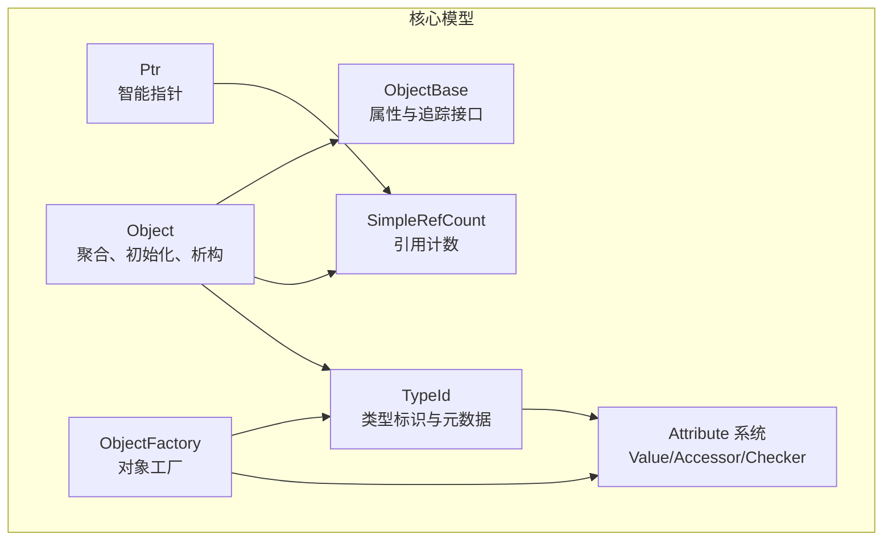
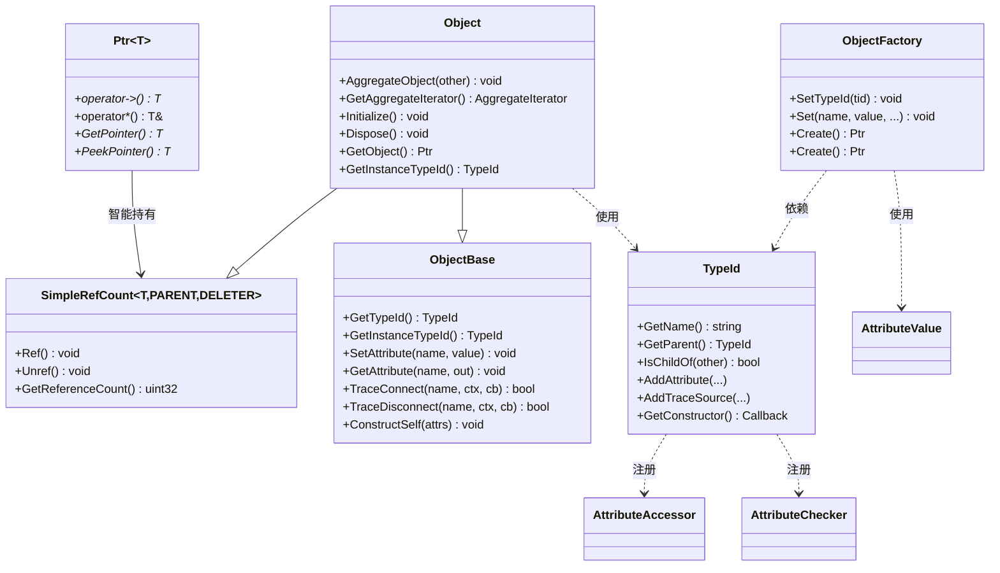
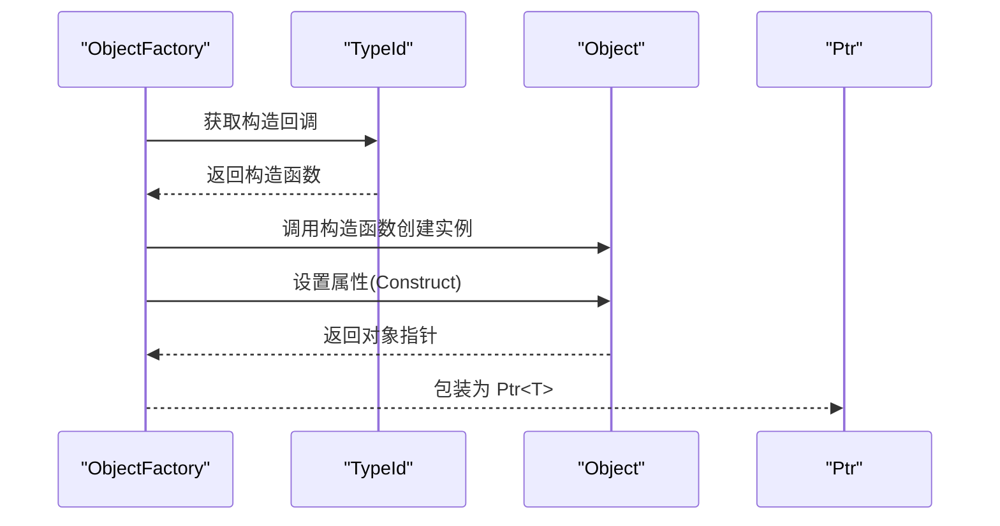
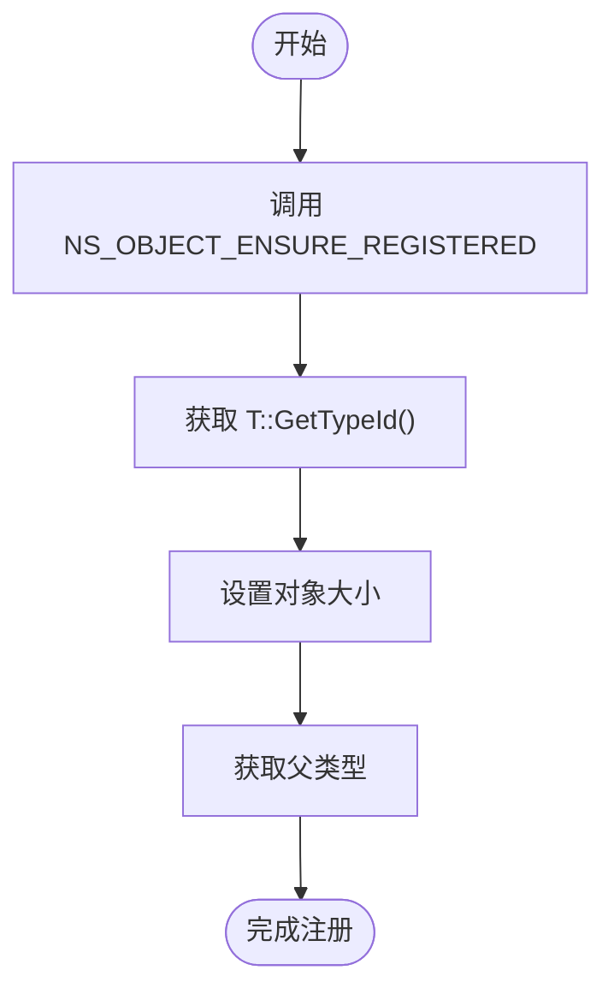
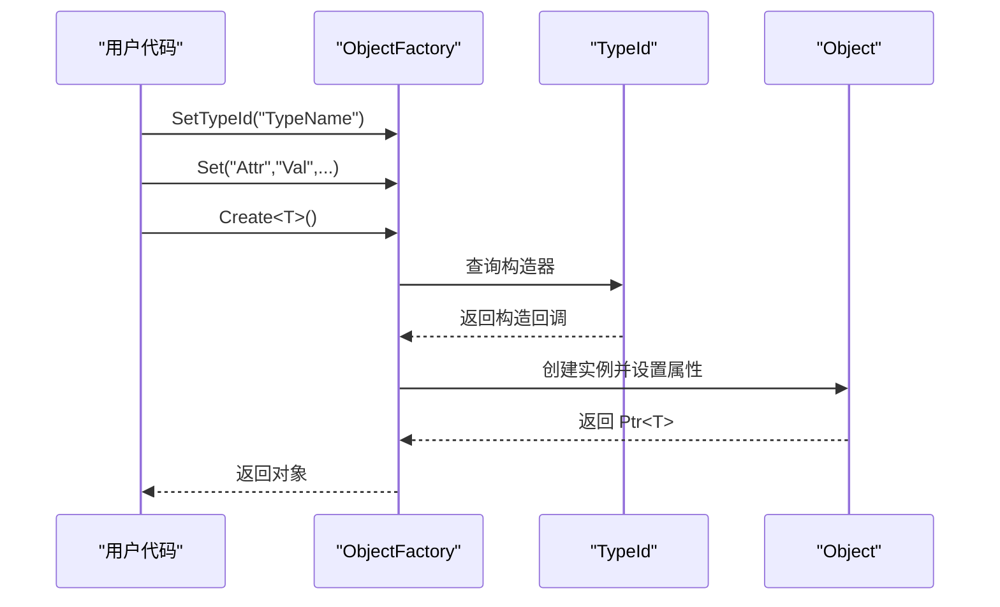
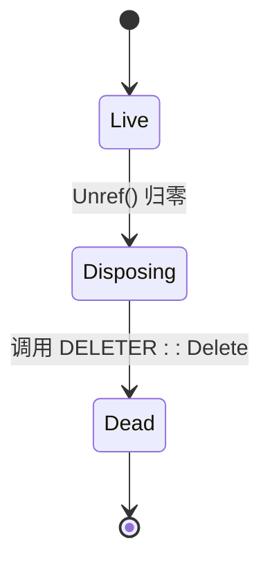
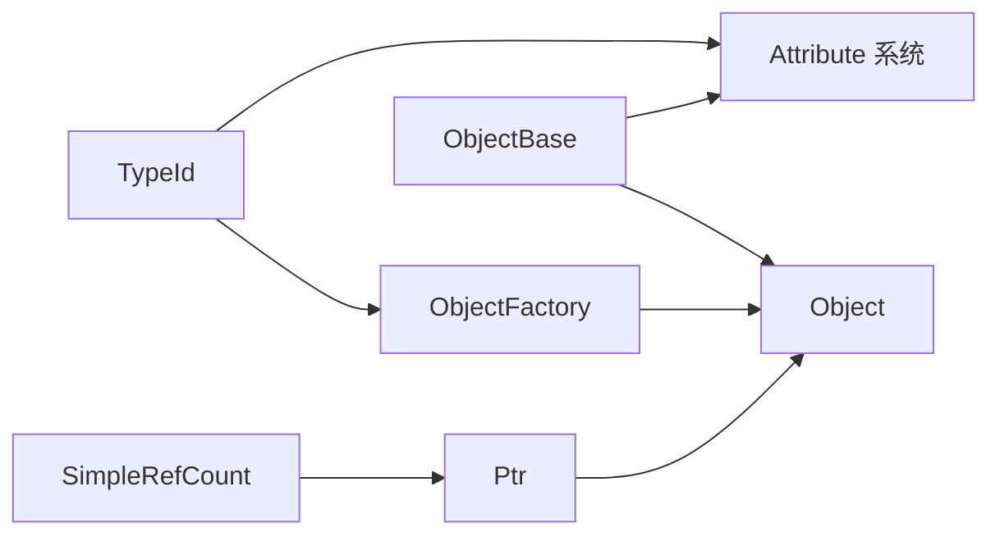

# 对象模型

<cite>
**本文引用的文件**
- [object.h](file://simulator/ns-3.39/src/core/model/object.h)
- [object-base.h](file://simulator/ns-3.39/src/core/model/object-base.h)
- [type-id.h](file://simulator/ns-3.39/src/core/model/type-id.h)
- [object-factory.h](file://simulator/ns-3.39/src/core/model/object-factory.h)
- [simple-ref-count.h](file://simulator/ns-3.39/src/core/model/simple-ref-count.h)
- [attribute.h](file://simulator/ns-3.39/src/core/model/attribute.h)
- [ptr.h](file://simulator/ns-3.39/src/core/model/ptr.h)
- [first.cc](file://simulator/ns-3.39/examples/tutorial/first.cc)
</cite>

## 目录
1. [引言](#引言)
2. [项目结构](#项目结构)
3. [核心组件](#核心组件)
4. [架构总览](#架构总览)
5. [详细组件分析](#详细组件分析)
6. [依赖关系分析](#依赖关系分析)
7. [性能考量](#性能考量)
8. [故障排查指南](#故障排查指南)
9. [结论](#结论)
10. [附录：最佳实践与设计模式](#附录最佳实践与设计模式)

## 引言
本文件系统性梳理 NS-3 的对象模型，围绕 Object 基类、TypeSystem 类型系统（TypeId）、ObjectFactory 对象工厂展开，解释对象的创建、继承、属性访问、聚合与生命周期管理，并给出可直接定位到源码路径的示例，帮助读者快速掌握如何在 NS-3 中定义新类型、创建实例、访问属性与进行类型转换。

## 项目结构
NS-3 对象模型位于 core 模块的 model 子目录中，关键头文件如下：
- 对象基类与聚合：object.h、object-base.h
- 类型系统：type-id.h
- 对象工厂：object-factory.h
- 引用计数与智能指针：simple-ref-count.h、ptr.h
- 属性系统：attribute.h

图表来源
- [object.h:88-447](file://simulator/ns-3.39/src/core/model/object.h#L88-L447)
- [object-base.h:172-336](file://simulator/ns-3.39/src/core/model/object-base.h#L172-L336)
- [type-id.h:58-566](file://simulator/ns-3.39/src/core/model/type-id.h#L58-L566)
- [object-factory.h:47-172](file://simulator/ns-3.39/src/core/model/object-factory.h#L47-L172)
- [simple-ref-count.h:79-155](file://simulator/ns-3.39/src/core/model/simple-ref-count.h#L79-L155)
- [ptr.h:76-200](file://simulator/ns-3.39/src/core/model/ptr.h#L76-L200)
- [attribute.h:69-226](file://simulator/ns-3.39/src/core/model/attribute.h#L69-L226)

章节来源
- [object.h:1-589](file://simulator/ns-3.39/src/core/model/object.h#L1-L589)
- [object-base.h:1-341](file://simulator/ns-3.39/src/core/model/object-base.h#L1-L341)
- [type-id.h:1-670](file://simulator/ns-3.39/src/core/model/type-id.h#L1-L670)
- [object-factory.h:1-239](file://simulator/ns-3.39/src/core/model/object-factory.h#L1-L239)
- [simple-ref-count.h:1-160](file://simulator/ns-3.39/src/core/model/simple-ref-count.h#L1-L160)
- [attribute.h:1-326](file://simulator/ns-3.39/src/core/model/attribute.h#L1-L326)
- [ptr.h:1-831](file://simulator/ns-3.39/src/core/model/ptr.h#L1-L831)

## 核心组件
- Object 基类
  - 提供聚合（AggregateObject）、迭代聚合对象（AggregateIterator）、初始化（Initialize/DoInitialize）、销毁（Dispose/DoDispose）与生命周期管理。
  - 通过 TypeId 跟踪运行时类型，并维护聚合数组以支持跨对象查找。
  - 参考路径：[object.h:88-447](file://simulator/ns-3.39/src/core/model/object.h#L88-L447)

- ObjectBase
  - 为对象提供属性读写（SetAttribute/GetAttribute）、构造完成通知（NotifyConstructionCompleted/ConstructSelf）与追踪连接（TraceConnect/Disconnect）。
  - 参考路径：[object-base.h:172-336](file://simulator/ns-3.39/src/core/model/object-base.h#L172-L336)

- TypeId 类型系统
  - 维护类型名、父类型、构造器回调、属性与追踪源信息、文档隐藏标记、大小等元数据。
  - 支持按名称/哈希查询、父子关系判断、属性与追踪源枚举。
  - 参考路径：[type-id.h:58-566](file://simulator/ns-3.39/src/core/model/type-id.h#L58-L566)

- ObjectFactory 对象工厂
  - 配置 TypeId 与构造期属性，统一创建对象并返回指定类型的 Ptr。
  - 参考路径：[object-factory.h:47-172](file://simulator/ns-3.39/src/core/model/object-factory.h#L47-L172)

- 引用计数与智能指针
  - SimpleRefCount 通过 CRTP 提供轻量引用计数；Ptr 封装 Ref/Unref，实现自动内存管理。
  - 参考路径：[simple-ref-count.h:79-155](file://simulator/ns-3.39/src/core/model/simple-ref-count.h#L79-L155)、[ptr.h:76-200](file://simulator/ns-3.39/src/core/model/ptr.h#L76-L200)

- 属性系统
  - AttributeValue/Accessor/Checker 抽象值、访问器与校验器，配合 TypeId 注册属性与默认值。
  - 参考路径：[attribute.h:69-226](file://simulator/ns-3.39/src/core/model/attribute.h#L69-L226)

章节来源
- [object.h:88-447](file://simulator/ns-3.39/src/core/model/object.h#L88-L447)
- [object-base.h:172-336](file://simulator/ns-3.39/src/core/model/object-base.h#L172-L336)
- [type-id.h:58-566](file://simulator/ns-3.39/src/core/model/type-id.h#L58-L566)
- [object-factory.h:47-172](file://simulator/ns-3.39/src/core/model/object-factory.h#L47-L172)
- [simple-ref-count.h:79-155](file://simulator/ns-3.39/src/core/model/simple-ref-count.h#L79-L155)
- [ptr.h:76-200](file://simulator/ns-3.39/src/core/model/ptr.h#L76-L200)
- [attribute.h:69-226](file://simulator/ns-3.39/src/core/model/attribute.h#L69-L226)

## 架构总览
NS-3 对象模型采用“基类 + 类型系统 + 工厂 + 属性系统”的分层设计：
- Object 继承自 SimpleRefCount 与 ObjectBase，获得引用计数与属性/追踪能力；
- TypeId 记录类型元数据，驱动属性注册与对象创建；
- ObjectFactory 以类型与属性配置为输入，产出对象实例；
- Ptr 作为统一的资源持有者，封装 Ref/Unref，确保生命周期安全。

图表来源
- [object.h:88-447](file://simulator/ns-3.39/src/core/model/object.h#L88-L447)
- [object-base.h:172-336](file://simulator/ns-3.39/src/core/model/object-base.h#L172-L336)
- [type-id.h:58-566](file://simulator/ns-3.39/src/core/model/type-id.h#L58-L566)
- [object-factory.h:47-172](file://simulator/ns-3.39/src/core/model/object-factory.h#L47-L172)
- [simple-ref-count.h:79-155](file://simulator/ns-3.39/src/core/model/simple-ref-count.h#L79-L155)
- [ptr.h:76-200](file://simulator/ns-3.39/src/core/model/ptr.h#L76-L200)
- [attribute.h:69-226](file://simulator/ns-3.39/src/core/model/attribute.h#L69-L226)

## 详细组件分析

### Object 基类与聚合
- 聚合与迭代
  - 通过 AggregateObject 将两个对象聚合，随后可通过 GetObject<T>() 或 GetObject(TypeId) 在聚合集合中查找目标类型。
  - 参考路径：[object.h:199-212](file://simulator/ns-3.39/src/core/model/object.h#L199-L212)、[object.h:469-533](file://simulator/ns-3.39/src/core/model/object.h#L469-L533)
- 生命周期
  - Initialize/DoInitialize：仅在首次调用时执行，适合一次性初始化。
  - Dispose/DoDispose：在引用计数归零前触发，用于释放资源与打破循环引用。
  - 参考路径：[object.h:224-276](file://simulator/ns-3.39/src/core/model/object.h#L224-L276)
- 类型与构造
  - SetTypeId 由工厂设置；Construct 在创建阶段根据 TypeId 初始化成员属性。
  - 参考路径：[object.h:388-399](file://simulator/ns-3.39/src/core/model/object.h#L388-L399)

图表来源
- [object-factory.h:119-132](file://simulator/ns-3.39/src/core/model/object-factory.h#L119-L132)
- [type-id.h:278-279](file://simulator/ns-3.39/src/core/model/type-id.h#L278-L279)
- [object.h:388-399](file://simulator/ns-3.39/src/core/model/object.h#L388-L399)

章节来源
- [object.h:88-447](file://simulator/ns-3.39/src/core/model/object.h#L88-L447)

### TypeId 类型系统
- 元数据与查询
  - 名称、哈希、父类型、构造器、属性与追踪源、文档隐藏标志、对象大小等。
  - 支持按名称/哈希查询、索引遍历、父子关系判断。
  - 参考路径：[type-id.h:131-173](file://simulator/ns-3.39/src/core/model/type-id.h#L131-L173)、[type-id.h:196-215](file://simulator/ns-3.39/src/core/model/type-id.h#L196-L215)
- 属性与追踪源注册
  - AddAttribute/AddTraceSource 记录属性与追踪源信息，含访问器、校验器、支持级别与提示消息。
  - 参考路径：[type-id.h:384-459](file://simulator/ns-3.39/src/core/model/type-id.h#L384-L459)
- 宏注册与模板实例化
  - NS_OBJECT_ENSURE_REGISTERED 保证派生类在进程启动时完成类型注册与父类型检查。
  - NS_OBJECT_TEMPLATE_CLASS_DEFINE/NS_OBJECT_TEMPLATE_CLASS_TWO_DEFINE 支持显式实例化模板类并注册。
  - 参考路径：[object-base.h:46-132](file://simulator/ns-3.39/src/core/model/object-base.h#L46-L132)

图表来源
- [object-base.h:46-57](file://simulator/ns-3.39/src/core/model/object-base.h#L46-L57)

章节来源
- [type-id.h:58-566](file://simulator/ns-3.39/src/core/model/type-id.h#L58-L566)
- [object-base.h:46-132](file://simulator/ns-3.39/src/core/model/object-base.h#L46-L132)

### ObjectFactory 对象工厂
- 配置与创建
  - SetTypeId 支持字符串或 TypeId；Set 接受若干 name/value 对；Create 返回通用 Ptr<Object>，Create<T>() 返回指定类型的 Ptr。
  - 参考路径：[object-factory.h:76-132](file://simulator/ns-3.39/src/core/model/object-factory.h#L76-L132)
- 辅助函数
  - CreateObjectWithAttributes 可从若干 name/value 对直接创建指定类型对象。
  - 参考路径：[object-factory.h:189-190](file://simulator/ns-3.39/src/core/model/object-factory.h#L189-L190)

图表来源
- [object-factory.h:205-209](file://simulator/ns-3.39/src/core/model/object-factory.h#L205-L209)
- [type-id.h:278-279](file://simulator/ns-3.39/src/core/model/type-id.h#L278-L279)

章节来源
- [object-factory.h:47-172](file://simulator/ns-3.39/src/core/model/object-factory.h#L47-L172)

### 引用计数与智能指针
- SimpleRefCount
  - 提供 Ref/Unref 与引用计数查询；当计数归零时调用 DELETER::Delete。
  - 参考路径：[simple-ref-count.h:114-133](file://simulator/ns-3.39/src/core/model/simple-ref-count.h#L114-L133)
- Ptr
  - 封装原始指针，提供 operator->、operator*、GetPointer/PeekPointer；与 Ref/Unref 协作。
  - 参考路径：[ptr.h:134-200](file://simulator/ns-3.39/src/core/model/ptr.h#L134-L200)

图表来源
- [simple-ref-count.h:126-133](file://simulator/ns-3.39/src/core/model/simple-ref-count.h#L126-L133)

章节来源
- [simple-ref-count.h:79-155](file://simulator/ns-3.39/src/core/model/simple-ref-count.h#L79-L155)
- [ptr.h:76-200](file://simulator/ns-3.39/src/core/model/ptr.h#L76-L200)

### 属性系统与类型转换
- 属性读写
  - ObjectBase::SetAttribute/GetAttribute 与 FailSafe 版本；内部通过 AttributeAccessor/Checker 校验与序列化。
  - 参考路径：[object-base.h:212-250](file://simulator/ns-3.39/src/core/model/object-base.h#L212-L250)、[attribute.h:115-151](file://simulator/ns-3.39/src/core/model/attribute.h#L115-L151)
- 类型转换
  - Object::GetObject<T>() 与 GetObject(TypeId) 支持在聚合集合中按类型查找；ObjectFactory::Create<T>() 返回指定类型指针。
  - 参考路径：[object.h:469-533](file://simulator/ns-3.39/src/core/model/object.h#L469-L533)、[object-factory.h:205-209](file://simulator/ns-3.39/src/core/model/object-factory.h#L205-L209)

章节来源
- [object-base.h:212-250](file://simulator/ns-3.39/src/core/model/object-base.h#L212-L250)
- [attribute.h:69-226](file://simulator/ns-3.39/src/core/model/attribute.h#L69-L226)
- [object.h:469-533](file://simulator/ns-3.39/src/core/model/object.h#L469-L533)
- [object-factory.h:205-209](file://simulator/ns-3.39/src/core/model/object-factory.h#L205-L209)

## 依赖关系分析
- 组件耦合
  - Object 依赖 SimpleRefCount 与 ObjectBase；ObjectFactory 依赖 TypeId 与属性系统；Ptr 依赖 SimpleRefCount。
- 外部依赖
  - TypeId 依赖 AttributeAccessor/Checker/Value 与回调系统；ObjectBase 依赖 TypeId 与警告系统。
- 循环依赖
  - 通过友元与模板特化避免直接循环；ObjectFactory 与 TypeId 通过回调间接交互。

图表来源
- [simple-ref-count.h:79-155](file://simulator/ns-3.39/src/core/model/simple-ref-count.h#L79-L155)
- [ptr.h:76-200](file://simulator/ns-3.39/src/core/model/ptr.h#L76-L200)
- [object.h:88-447](file://simulator/ns-3.39/src/core/model/object.h#L88-L447)
- [object-base.h:172-336](file://simulator/ns-3.39/src/core/model/object-base.h#L172-L336)
- [type-id.h:58-566](file://simulator/ns-3.39/src/core/model/type-id.h#L58-L566)
- [object-factory.h:47-172](file://simulator/ns-3.39/src/core/model/object-factory.h#L47-L172)
- [attribute.h:69-226](file://simulator/ns-3.39/src/core/model/attribute.h#L69-L226)

章节来源
- [object.h:88-447](file://simulator/ns-3.39/src/core/model/object.h#L88-L447)
- [object-base.h:172-336](file://simulator/ns-3.39/src/core/model/object-base.h#L172-L336)
- [type-id.h:58-566](file://simulator/ns-3.39/src/core/model/type-id.h#L58-L566)
- [object-factory.h:47-172](file://simulator/ns-3.39/src/core/model/object-factory.h#L47-L172)
- [simple-ref-count.h:79-155](file://simulator/ns-3.39/src/core/model/simple-ref-count.h#L79-L155)
- [ptr.h:76-200](file://simulator/ns-3.39/src/core/model/ptr.h#L76-L200)
- [attribute.h:69-226](file://simulator/ns-3.39/src/core/model/attribute.h#L69-L226)

## 性能考量
- 聚合查找优化
  - Object::GetObject<T>() 内部先尝试动态转换，失败再进行完整类型检查，减少不必要的开销。
  - 参考路径：[object.h:469-487](file://simulator/ns-3.39/src/core/model/object.h#L469-L487)
- 引用计数
  - Ref/Unref 为内联操作，代价极低；注意避免循环引用导致无法自动回收，必要时调用 Dispose 手动打断。
  - 参考路径：[simple-ref-count.h:114-133](file://simulator/ns-3.39/src/core/model/simple-ref-count.h#L114-L133)
- 属性访问
  - 属性设置/读取通过 AttributeAccessor/Checker 进行校验与序列化，建议在高频路径避免频繁字符串格式化。
  - 参考路径：[attribute.h:115-151](file://simulator/ns-3.39/src/core/model/attribute.h#L115-L151)

## 故障排查指南
- 对象未正确注册类型
  - 症状：LookupByName/LookupByHash 失败或行为异常。
  - 排查：确认派生类已使用 NS_OBJECT_ENSURE_REGISTERED；若为模板类，使用 NS_OBJECT_TEMPLATE_CLASS_DEFINE/NS_OBJECT_TEMPLATE_CLASS_TWO_DEFINE 显式实例化并注册。
  - 参考路径：[object-base.h:46-132](file://simulator/ns-3.39/src/core/model/object-base.h#L46-L132)
- 属性设置失败
  - 症状：SetAttribute/GetAttribute 抛错或返回失败。
  - 排查：检查属性名是否正确、是否有 Getter/Setter、类型是否匹配；优先使用 FailSafe 版本定位问题。
  - 参考路径：[object-base.h:212-250](file://simulator/ns-3.39/src/core/model/object-base.h#L212-L250)
- 循环引用导致内存泄漏
  - 症状：对象引用计数不降为零。
  - 排查：在合适位置调用 Dispose 触发 DoDispose，确保打破循环引用链。
  - 参考路径：[object.h:184](file://simulator/ns-3.39/src/core/model/object.h#L184)、[object.h:276](file://simulator/ns-3.39/src/core/model/object.h#L276)
- 工厂创建失败
  - 症状：Create/Create<T>() 返回空指针或抛出异常。
  - 排查：确认 SetTypeId 正确、构造器存在、属性名与类型匹配。
  - 参考路径：[object-factory.h:119-132](file://simulator/ns-3.39/src/core/model/object-factory.h#L119-L132)

章节来源
- [object-base.h:46-132](file://simulator/ns-3.39/src/core/model/object-base.h#L46-L132)
- [object-base.h:212-250](file://simulator/ns-3.39/src/core/model/object-base.h#L212-L250)
- [object.h:184](file://simulator/ns-3.39/src/core/model/object.h#L184)
- [object.h:276](file://simulator/ns-3.39/src/core/model/object.h#L276)
- [object-factory.h:119-132](file://simulator/ns-3.39/src/core/model/object-factory.h#L119-L132)

## 结论
NS-3 对象模型通过 Object、ObjectBase、TypeId、ObjectFactory、SimpleRefCount 与 Ptr 的协同，提供了强类型、可扩展、可追踪且内存安全的对象体系。TypeId 驱动的属性与追踪机制使配置与调试更加直观；工厂与智能指针简化了对象生命周期管理。遵循本文最佳实践，可在 NS-3 中高效地定义与使用新类型。

## 附录：最佳实践与设计模式
- 定义新对象类型
  - 派生类必须实现静态 GetTypeId 并在命名空间内使用 NS_OBJECT_ENSURE_REGISTERED 完成注册。
  - 若为模板类，使用 NS_OBJECT_TEMPLATE_CLASS_DEFINE/NS_OBJECT_TEMPLATE_CLASS_TWO_DEFINE 显式实例化并注册。
  - 参考路径：[object-base.h:46-132](file://simulator/ns-3.39/src/core/model/object-base.h#L46-L132)
- 创建对象实例
  - 推荐使用 ObjectFactory::Create<T>() 或 CreateObjectWithAttributes(...)，避免直接 new 导致的生命周期管理疏漏。
  - 参考路径：[object-factory.h:119-132](file://simulator/ns-3.39/src/core/model/object-factory.h#L119-L132)、[object-factory.h:189-190](file://simulator/ns-3.39/src/core/model/object-factory.h#L189-L190)
- 访问对象属性
  - 使用 ObjectBase::SetAttribute/GetAttribute 或其 FailSafe 版本；在高频路径尽量避免字符串格式化。
  - 参考路径：[object-base.h:212-250](file://simulator/ns-3.39/src/core/model/object-base.h#L212-L250)
- 类型转换与聚合
  - 使用 Object::GetObject<T>() 或 GetObject(TypeId) 在聚合集合中查找；聚合对象间应避免循环引用。
  - 参考路径：[object.h:469-533](file://simulator/ns-3.39/src/core/model/object.h#L469-L533)
- 示例参考
  - 教程示例展示了通过 Helper 设置属性与安装应用的方式，体现了属性系统的典型用法。
  - 参考路径：[first.cc:61-74](file://simulator/ns-3.39/examples/tutorial/first.cc#L61-L74)

章节来源
- [object-base.h:46-132](file://simulator/ns-3.39/src/core/model/object-base.h#L46-L132)
- [object-factory.h:119-132](file://simulator/ns-3.39/src/core/model/object-factory.h#L119-L132)
- [object-factory.h:189-190](file://simulator/ns-3.39/src/core/model/object-factory.h#L189-L190)
- [object-base.h:212-250](file://simulator/ns-3.39/src/core/model/object-base.h#L212-L250)
- [object.h:469-533](file://simulator/ns-3.39/src/core/model/object.h#L469-L533)
- [first.cc:61-74](file://simulator/ns-3.39/examples/tutorial/first.cc#L61-L74)