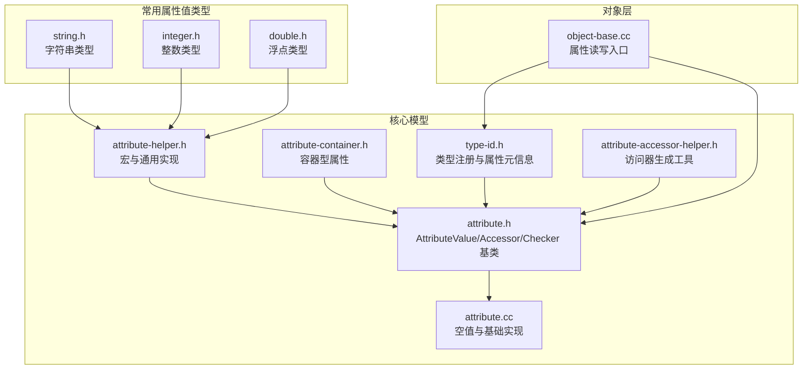
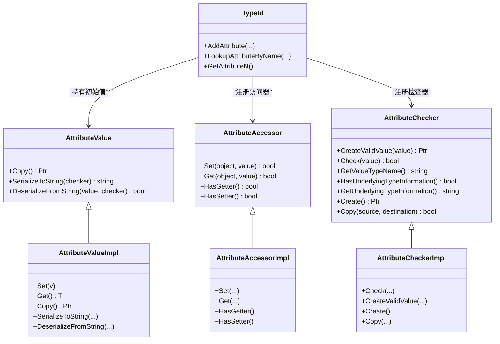
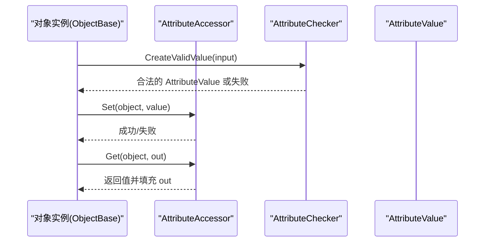
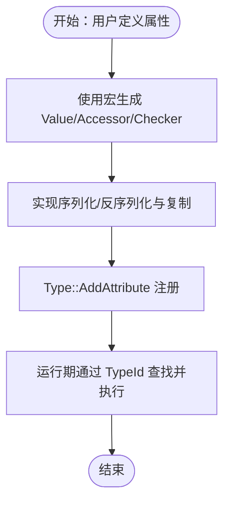
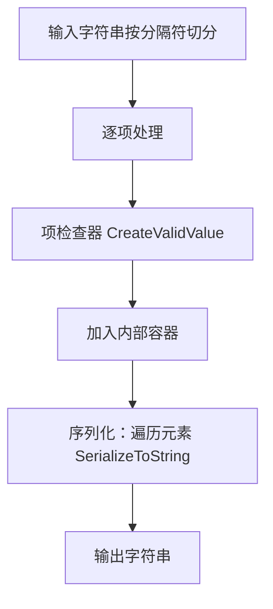
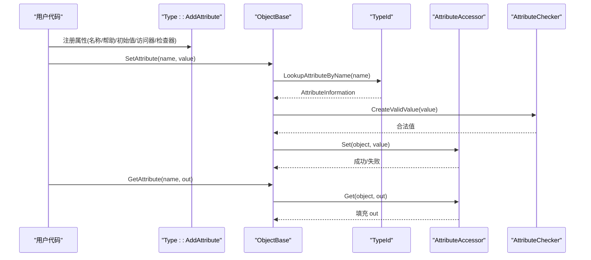
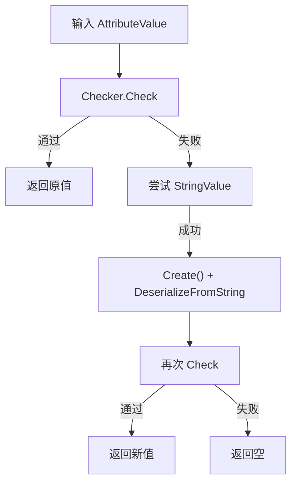

# 属性系统

<cite>
**本文引用的文件**
- [attribute.h](file://simulator/ns-3.39/src/core/model/attribute.h)
- [attribute.cc](file://simulator/ns-3.39/src/core/model/attribute.cc)
- [attribute-helper.h](file://simulator/ns-3.39/src/core/model/attribute-helper.h)
- [attribute-container.h](file://simulator/ns-3.39/src/core/model/attribute-container.h)
- [type-id.h](file://simulator/ns-3.39/src/core/model/type-id.h)
- [string.h](file://simulator/ns-3.39/src/core/model/string.h)
- [integer.h](file://simulator/ns-3.39/src/core/model/integer.h)
- [double.h](file://simulator/ns-3.39/src/core/model/double.h)
- [attribute-accessor-helper.h](file://simulator/ns-3.39/src/core/model/attribute-accessor-helper.h)
- [object-base.cc](file://simulator/ns-3.39/src/core/model/object-base.cc)
</cite>

## 目录
1. [简介](#简介)
2. [项目结构](#项目结构)
3. [核心组件](#核心组件)
4. [架构总览](#架构总览)
5. [详细组件分析](#详细组件分析)
6. [依赖关系分析](#依赖关系分析)
7. [性能考量](#性能考量)
8. [故障排查指南](#故障排查指南)
9. [结论](#结论)
10. [附录：使用示例与最佳实践](#附录使用示例与最佳实践)

## 简介
本文件系统性阐述 NS-3 的属性系统（Attribute System），包括 AttributeValue、AttributeAccessor、AttributeChecker 三大基类的设计理念与协作机制；属性类型系统与辅助宏；属性的声明、注册、读取、设置流程；多数据类型的处理与类型转换；反射与序列化能力；以及与配置系统的集成。文档同时给出面向初学者的渐进式讲解与面向高级用户的代码级图示。

## 项目结构
NS-3 属性系统主要位于 core 模块的 model 子目录中，关键文件如下：
- 基类与空实现：attribute.h、attribute.cc
- 辅助宏与通用实现：attribute-helper.h
- 容器型属性：attribute-container.h
- 类型标识与属性注册：type-id.h
- 典型属性值类型：string.h、integer.h、double.h
- 访问器生成工具：attribute-accessor-helper.h
- 对象基类中的属性读写入口：object-base.cc



**图表来源**
- [attribute.h:69-226](file://simulator/ns-3.39/src/core/model/attribute.h#L69-L226)
- [attribute.cc:39-200](file://simulator/ns-3.39/src/core/model/attribute.cc#L39-L200)
- [attribute-helper.h:1-434](file://simulator/ns-3.39/src/core/model/attribute-helper.h#L1-L434)
- [attribute-container.h:51-585](file://simulator/ns-3.39/src/core/model/attribute-container.h#L51-L585)
- [type-id.h:58-117](file://simulator/ns-3.39/src/core/model/type-id.h#L58-L117)
- [string.h:56-58](file://simulator/ns-3.39/src/core/model/string.h#L56-L58)
- [integer.h:45-76](file://simulator/ns-3.39/src/core/model/integer.h#L45-L76)
- [double.h:42-72](file://simulator/ns-3.39/src/core/model/double.h#L42-L72)
- [attribute-accessor-helper.h](file://simulator/ns-3.39/src/core/model/attribute-accessor-helper.h)
- [object-base.cc:240-274](file://simulator/ns-3.39/src/core/model/object-base.cc#L240-L274)

**章节来源**
- [attribute.h:1-326](file://simulator/ns-3.39/src/core/model/attribute.h#L1-L326)
- [attribute.cc:1-201](file://simulator/ns-3.39/src/core/model/attribute.cc#L1-L201)
- [attribute-helper.h:1-434](file://simulator/ns-3.39/src/core/model/attribute-helper.h#L1-L434)
- [attribute-container.h:1-585](file://simulator/ns-3.39/src/core/model/attribute-container.h#L1-L585)
- [type-id.h:1-670](file://simulator/ns-3.39/src/core/model/type-id.h#L1-L670)
- [string.h:1-63](file://simulator/ns-3.39/src/core/model/string.h#L1-L63)
- [integer.h:1-120](file://simulator/ns-3.39/src/core/model/integer.h#L1-L120)
- [double.h:1-117](file://simulator/ns-3.39/src/core/model/double.h#L1-L117)
- [attribute-accessor-helper.h](file://simulator/ns-3.39/src/core/model/attribute-accessor-helper.h)
- [object-base.cc:159-274](file://simulator/ns-3.39/src/core/model/object-base.cc#L159-L274)

## 核心组件
- AttributeValue：封装具体属性值，提供深拷贝、序列化/反序列化接口，是所有属性值类型的基类。
- AttributeAccessor：屏蔽底层成员变量或方法调用细节，统一提供 Get/Set 能力，并标注是否支持 Getter/Setter。
- AttributeChecker：负责类型检查、范围校验、创建临时值、复制与类型信息查询，是类型安全与反射的基础。
- EmptyAttributeValue/EmptyAttributeAccessor/EmptyAttributeChecker：占位实现，用于无属性场景，避免运行时异常。
- TypeId：记录类的元信息，包括构造函数、属性、跟踪源等；AddAttribute 用于注册属性及其初始值、访问器、检查器。
- 属性值类型：通过宏快速生成常见类型（如 StringValue、IntegerValue、DoubleValue）及配套的访问器与检查器。
- 容器型属性：AttributeContainerValue 提供以分隔符拼接的列表/集合表示，支持序列化/反序列化与批量访问。

**章节来源**
- [attribute.h:69-226](file://simulator/ns-3.39/src/core/model/attribute.h#L69-L226)
- [attribute.cc:92-200](file://simulator/ns-3.39/src/core/model/attribute.cc#L92-L200)
- [type-id.h:384-430](file://simulator/ns-3.39/src/core/model/type-id.h#L384-L430)
- [attribute-helper.h:203-384](file://simulator/ns-3.39/src/core/model/attribute-helper.h#L203-L384)
- [attribute-container.h:51-192](file://simulator/ns-3.39/src/core/model/attribute-container.h#L51-L192)

## 架构总览
属性系统采用“值-访问器-检查器”三层抽象，配合 TypeId 的元信息管理，形成可扩展、可反射、可序列化的属性框架。



**图表来源**
- [attribute.h:69-226](file://simulator/ns-3.39/src/core/model/attribute.h#L69-L226)
- [type-id.h:384-430](file://simulator/ns-3.39/src/core/model/type-id.h#L384-L430)

## 详细组件分析

### 组件一：AttributeValue/Accessor/Checker 设计与协作
- AttributeValue：定义属性值的统一接口，要求实现深拷贝与字符串序列化/反序列化。空值类型 EmptyAttributeValue 用于无意义场景。
- AttributeAccessor：统一 Get/Set 接口，内部委托到具体成员变量或方法；HasGetter/HasSetter 标注能力。
- AttributeChecker：负责类型与范围校验，提供 CreateValidValue 将输入值转换为合法 AttributeValue；提供类型名与底层类型信息；支持复制。



**图表来源**
- [attribute.h:115-151](file://simulator/ns-3.39/src/core/model/attribute.h#L115-L151)
- [attribute.cc:63-90](file://simulator/ns-3.39/src/core/model/attribute.cc#L63-L90)
- [object-base.cc:184-196](file://simulator/ns-3.39/src/core/model/object-base.cc#L184-L196)

**章节来源**
- [attribute.h:69-226](file://simulator/ns-3.39/src/core/model/attribute.h#L69-L226)
- [attribute.cc:39-200](file://simulator/ns-3.39/src/core/model/attribute.cc#L39-L200)
- [object-base.cc:184-274](file://simulator/ns-3.39/src/core/model/object-base.cc#L184-L274)

### 组件二：属性类型系统与辅助宏
- 宏族：ATTRIBUTE_VALUE_DEFINE_WITH_NAME/ATTRIBUTE_VALUE_IMPLEMENT_WITH_NAME/ATTRIBUTE_CHECKER_DEFINE/ATTRIBUTE_CHECKER_IMPLEMENT 等，自动生成属性值类、访问器与检查器。
- 简单字符串检查器：MakeSimpleAttributeChecker 为任意 AttributeValue 派生类生成检查器，提供类型名、底层类型信息与复制能力。
- 常见类型：string.h、integer.h、double.h 中分别声明了 StringValue、IntegerValue、DoubleValue 及其访问器/检查器。



**图表来源**
- [attribute-helper.h:174-431](file://simulator/ns-3.39/src/core/model/attribute-helper.h#L174-L431)
- [string.h:56-58](file://simulator/ns-3.39/src/core/model/string.h#L56-L58)
- [integer.h:45-76](file://simulator/ns-3.39/src/core/model/integer.h#L45-L76)
- [double.h:42-72](file://simulator/ns-3.39/src/core/model/double.h#L42-L72)

**章节来源**
- [attribute-helper.h:1-434](file://simulator/ns-3.39/src/core/model/attribute-helper.h#L1-L434)
- [string.h:1-63](file://simulator/ns-3.39/src/core/model/string.h#L1-L63)
- [integer.h:1-120](file://simulator/ns-3.39/src/core/model/integer.h#L1-L120)
- [double.h:1-117](file://simulator/ns-3.39/src/core/model/double.h#L1-L117)

### 组件三：容器型属性（AttributeContainerValue）
- 支持以分隔符（默认逗号）解析字符串为元素列表，每个元素由项检查器验证后存入内部容器。
- 提供 Get/遍历接口，将内部元素的 Get 结果聚合为标准容器返回。
- 支持 MakeAttributeContainerChecker 与 MakeAttributeContainerAccessor，便于注册到 TypeId。



**图表来源**
- [attribute-container.h:418-466](file://simulator/ns-3.39/src/core/model/attribute-container.h#L418-L466)

**章节来源**
- [attribute-container.h:51-585](file://simulator/ns-3.39/src/core/model/attribute-container.h#L51-L585)

### 组件四：属性的声明、注册、读取与设置流程
- 声明与注册：在类头文件中使用 ATTRIBUTE_HELPER_HEADER 声明 Value/Accessor/Checker；在实现文件中使用 ATTRIBUTE_HELPER_CPP 实现 Value 的序列化/反序列化与检查器。
- 注册到 TypeId：通过 TypeId::AddAttribute(name, help, flags, initialValue, accessor, checker, ...) 完成注册，支持 ATTR_GET/ATTR_SET/ATTR_CONSTRUCT 等标志。
- 读取与设置：ObjectBase::SetAttribute/GetAttribute 通过 TypeId 查找 AttributeInformation，调用 Accessor 的 Set/Get，并借助 Checker 进行类型转换与校验。



**图表来源**
- [type-id.h:384-430](file://simulator/ns-3.39/src/core/model/type-id.h#L384-L430)
- [object-base.cc:240-274](file://simulator/ns-3.39/src/core/model/object-base.cc#L240-L274)
- [attribute.cc:63-90](file://simulator/ns-3.39/src/core/model/attribute.cc#L63-L90)

**章节来源**
- [type-id.h:362-430](file://simulator/ns-3.39/src/core/model/type-id.h#L362-L430)
- [object-base.cc:184-274](file://simulator/ns-3.39/src/core/model/object-base.cc#L184-L274)
- [attribute.cc:63-90](file://simulator/ns-3.39/src/core/model/attribute.cc#L63-L90)

### 组件五：类型转换与序列化机制
- 类型转换：AttributeChecker::CreateValidValue 首先 Check，若失败尝试将输入视为 StringValue 并反序列化为目标类型，再次 Check。
- 序列化/反序列化：AttributeValue::SerializeToString/DeserializeFromString 由各派生类实现；字符串类型通过流式 I/O 完成。
- 反射与类型信息：AttributeChecker::GetValueTypeName/GetUnderlyingTypeInformation 提供类型名与底层类型描述，便于文档与调试。



**图表来源**
- [attribute.cc:63-90](file://simulator/ns-3.39/src/core/model/attribute.cc#L63-L90)
- [attribute-helper.h:315-332](file://simulator/ns-3.39/src/core/model/attribute-helper.h#L315-L332)

**章节来源**
- [attribute.cc:63-90](file://simulator/ns-3.39/src/core/model/attribute.cc#L63-L90)
- [attribute-helper.h:97-156](file://simulator/ns-3.39/src/core/model/attribute-helper.h#L97-L156)
- [string.h:315-332](file://simulator/ns-3.39/src/core/model/string.h#L315-L332)

### 组件六：访问器生成工具（MakeAccessorHelper）
- 支持三种形态：成员变量、成员 get 方法、成员 set 方法；也支持组合的 getter/setter 对。
- 通过模板与内联函数生成具体访问器，隐藏对私有成员的直接访问细节。

**章节来源**
- [attribute-accessor-helper.h:74-82](file://simulator/ns-3.39/src/core/model/attribute-accessor-helper.h#L74-L82)
- [attribute-accessor-helper.h:311-344](file://simulator/ns-3.39/src/core/model/attribute-accessor-helper.h#L311-L344)

## 依赖关系分析
- attribute.h 是所有属性相关类的共同基类，被 attribute-helper.h、attribute-container.h、type-id.h 等广泛依赖。
- attribute-helper.h 通过宏生成具体属性值类型与访问器/检查器，降低重复代码。
- type-id.h 作为元数据中心，集中管理属性注册与查找。
- object-base.cc 作为对象层入口，提供 SetAttribute/GetAttribute 的统一调用路径。
- 容器型属性依赖通用的 AttributeChecker/AttributeValue 抽象，实现复杂序列化逻辑。

```mermaid
graph LR
attribute_h["attribute.h"] <- --> attribute_helper_h["attribute-helper.h"]
attribute_h <- --> attribute_container_h["attribute-container.h"]
attribute_h <- --> type_id_h["type-id.h"]
object_base_cc["object-base.cc"] --> type_id_h
object_base_cc --> attribute_h
attribute_helper_h --> string_h["string.h"]
attribute_helper_h --> integer_h["integer.h"]
attribute_helper_h --> double_h["double.h"]
```

**图表来源**
- [attribute.h:1-326](file://simulator/ns-3.39/src/core/model/attribute.h#L1-L326)
- [attribute-helper.h:1-434](file://simulator/ns-3.39/src/core/model/attribute-helper.h#L1-L434)
- [attribute-container.h:1-585](file://simulator/ns-3.39/src/core/model/attribute-container.h#L1-L585)
- [type-id.h:1-670](file://simulator/ns-3.39/src/core/model/type-id.h#L1-L670)
- [object-base.cc:159-274](file://simulator/ns-3.39/src/core/model/object-base.cc#L159-L274)
- [string.h:1-63](file://simulator/ns-3.39/src/core/model/string.h#L1-L63)
- [integer.h:1-120](file://simulator/ns-3.39/src/core/model/integer.h#L1-L120)
- [double.h:1-117](file://simulator/ns-3.39/src/core/model/double.h#L1-L117)

**章节来源**
- [attribute.h:1-326](file://simulator/ns-3.39/src/core/model/attribute.h#L1-L326)
- [attribute-helper.h:1-434](file://simulator/ns-3.39/src/core/model/attribute-helper.h#L1-L434)
- [attribute-container.h:1-585](file://simulator/ns-3.39/src/core/model/attribute-container.h#L1-L585)
- [type-id.h:1-670](file://simulator/ns-3.39/src/core/model/type-id.h#L1-L670)
- [object-base.cc:159-274](file://simulator/ns-3.39/src/core/model/object-base.cc#L159-L274)
- [string.h:1-63](file://simulator/ns-3.39/src/core/model/string.h#L1-L63)
- [integer.h:1-120](file://simulator/ns-3.39/src/core/model/integer.h#L1-L120)
- [double.h:1-117](file://simulator/ns-3.39/src/core/model/double.h#L1-L117)

## 性能考量
- 类型转换成本：CreateValidValue 在 Check 失败时会尝试字符串反序列化，带来额外开销。建议在高频路径上尽量保证输入类型正确，减少转换次数。
- 容器型属性：AttributeContainerValue 的 Deserialize/String 分割与逐项校验可能成为热点。可通过合理的分隔符与预格式化输入优化。
- 反射与查找：Type::LookupAttributeByName 依赖内部索引，通常为常数时间；但多次查找仍应避免在热路径频繁触发。
- 序列化/反序列化：字符串流式 I/O 在极端情况下可能成为瓶颈，建议在需要高性能时使用更紧凑的二进制序列化方案（需自行扩展）。

[本节为通用指导，不直接分析具体文件]

## 故障排查指南
- 设置属性失败：检查 AttributeChecker::CreateValidValue 是否能将输入转换为合法值；确认 Accessor::Set 返回值与 HasSetter 能力。
- 获取属性失败：确认 Accessor::Get 返回值与 HasGetter 能力；若目标为字符串，确保通过 Checker::Create 创建临时值再获取。
- 类型不匹配：通过 AttributeChecker::GetValueTypeName 与 GetUnderlyingTypeInformation 核对类型信息；必要时使用宏生成正确的 Value/Checker。
- 文档与调试：利用 TypeId 的属性枚举与帮助信息定位问题；在日志组件中启用相关级别以便追踪。

**章节来源**
- [attribute.cc:63-90](file://simulator/ns-3.39/src/core/model/attribute.cc#L63-L90)
- [object-base.cc:240-274](file://simulator/ns-3.39/src/core/model/object-base.cc#L240-L274)

## 结论
NS-3 属性系统通过清晰的三层抽象与完善的元数据管理，实现了类型安全、可扩展、可反射与可序列化的属性框架。借助宏与工具类，开发者可以快速为自定义类型添加属性能力；通过 TypeId 的注册机制，属性得以在对象生命周期内被统一管理与访问。合理运用类型转换、容器属性与访问器生成工具，可在保证灵活性的同时兼顾性能与可维护性。

[本节为总结性内容，不直接分析具体文件]

## 附录：使用示例与最佳实践
- 定义属性值类型与访问器/检查器：参考宏族 ATTRIBUTE_HELPER_HEADER/ATTRIBUTE_HELPER_CPP 的使用位置与参数。
- 注册属性：在类的 TypeId 注册阶段调用 TypeId::AddAttribute，传入名称、帮助文本、初始值、访问器与检查器。
- 读取/设置属性：通过 ObjectBase 的 GetAttribute/SetAttribute 完成；注意错误处理与类型转换。
- 批量设置属性：对于容器型属性，使用 AttributeContainerValue 的 Set/Get 与序列化接口，结合分隔符进行批量赋值。
- 最佳实践：
  - 明确属性标志（ATTR_GET/ATTR_SET/ATTR_CONSTRUCT）以控制生命周期内的可变性。
  - 优先使用强类型检查器，减少字符串转换带来的不确定性。
  - 对于高频路径，尽量避免字符串反序列化，确保输入类型与范围正确。
  - 使用容器型属性时，选择合适的分隔符与容器类型，平衡可读性与性能。

**章节来源**
- [attribute-helper.h:407-431](file://simulator/ns-3.39/src/core/model/attribute-helper.h#L407-L431)
- [type-id.h:384-430](file://simulator/ns-3.39/src/core/model/type-id.h#L384-L430)
- [attribute-container.h:418-466](file://simulator/ns-3.39/src/core/model/attribute-container.h#L418-L466)
- [object-base.cc:240-274](file://simulator/ns-3.39/src/core/model/object-base.cc#L240-L274)