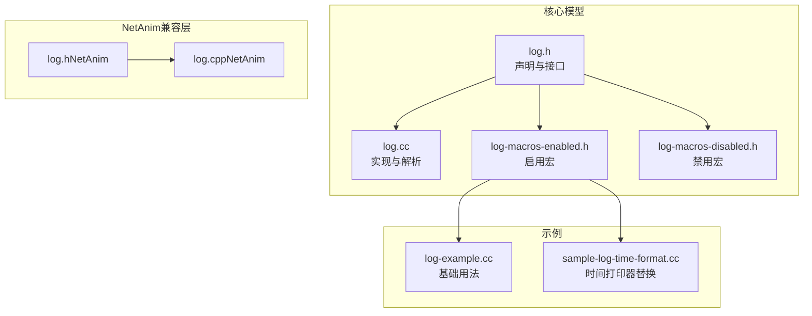
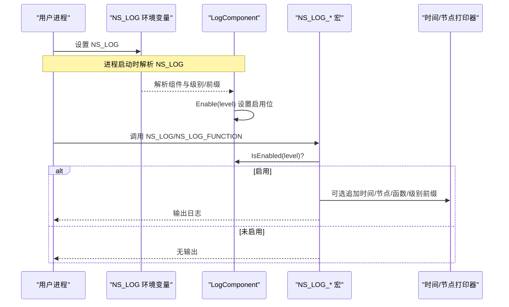
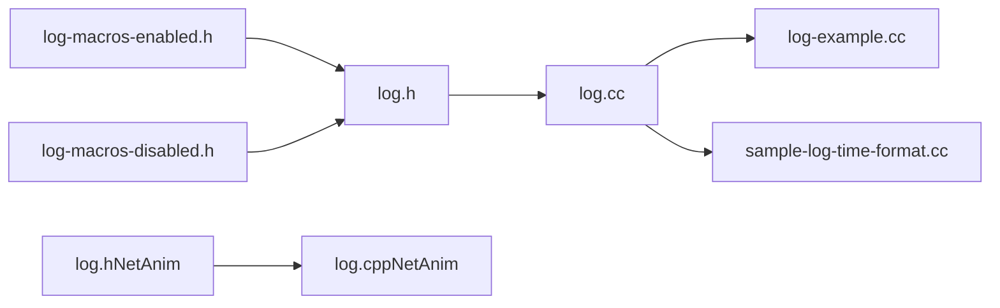

# 日志系统

<cite>
**本文引用的文件列表**
- [log.h](file://simulator/ns-3.39/src/core/model/log.h)
- [log.cc](file://simulator/ns-3.39/src/core/model/log.cc)
- [log-macros-enabled.h](file://simulator/ns-3.39/src/core/model/log-macros-enabled.h)
- [log-macros-disabled.h](file://simulator/ns-3.39/src/core/model/log-macros-disabled.h)
- [log-example.cc](file://simulator/ns-3.39/src/core/examples/log-example.cc)
- [sample-log-time-format.cc](file://simulator/ns-3.39/src/core/examples/sample-log-time-format.cc)
- [log.h（NetAnim）](file://simulator/netanim-3.109/log.h)
- [log.cpp（NetAnim）](file://simulator/netanim-3.109/log.cpp)
</cite>

## 目录
1. [简介](#简介)
2. [项目结构](#项目结构)
3. [核心组件](#核心组件)
4. [架构总览](#架构总览)
5. [详细组件分析](#详细组件分析)
6. [依赖关系分析](#依赖关系分析)
7. [性能考量](#性能考量)
8. [故障排查指南](#故障排查指南)
9. [结论](#结论)
10. [附录：使用示例与最佳实践](#附录使用示例与最佳实践)

## 简介
本文件系统性梳理 NS-3 的日志系统，覆盖日志级别设计、日志宏体系、日志过滤与环境变量解析、前缀控制、时间与节点打印器、以及在仿真运行时的动态配置能力。文档同时给出在开发与生产环境中使用日志进行调试与问题定位的最佳实践，并通过示例文件路径指引读者快速上手。

## 项目结构
NS-3 的日志系统主要位于核心模块的 model 层，采用“头文件声明 + 模板化宏定义 + 运行时实现”的分层设计：
- 头文件定义日志级别、组件类、宏接口与工具函数
- 宏文件根据是否启用日志决定实际展开为无操作或完整日志输出
- 实现文件负责解析 NS_LOG 环境变量、注册组件、维护状态并输出日志

图表来源
- [log.h:1-554](file://simulator/ns-3.39/src/core/model/log.h#L1-L554)
- [log.cc:1-575](file://simulator/ns-3.39/src/core/model/log.cc#L1-L575)
- [log-macros-enabled.h:1-270](file://simulator/ns-3.39/src/core/model/log-macros-enabled.h#L1-L270)
- [log-macros-disabled.h:1-94](file://simulator/ns-3.39/src/core/model/log-macros-disabled.h#L1-L94)
- [log-example.cc:1-136](file://simulator/ns-3.39/src/core/examples/log-example.cc#L1-L136)
- [sample-log-time-format.cc:1-172](file://simulator/ns-3.39/src/core/examples/sample-log-time-format.cc#L1-L172)
- [log.h（NetAnim）:1-432](file://simulator/netanim-3.109/log.h#L1-L432)
- [log.cpp（NetAnim）:1-589](file://simulator/netanim-3.109/log.cpp#L1-L589)

章节来源
- [log.h:1-554](file://simulator/ns-3.39/src/core/model/log.h#L1-L554)
- [log.cc:1-575](file://simulator/ns-3.39/src/core/model/log.cc#L1-L575)
- [log-macros-enabled.h:1-270](file://simulator/ns-3.39/src/core/model/log-macros-enabled.h#L1-L270)
- [log-macros-disabled.h:1-94](file://simulator/ns-3.39/src/core/model/log-macros-disabled.h#L1-L94)

## 核心组件
- 日志级别枚举：定义了错误、警告、信息、函数跟踪、逻辑调试、调试等若干严重等级及“级别集合”（含“全部”“以上”语义）
- 日志组件类：每个源文件可定义一个 LogComponent，用于按组件粒度开启/关闭日志与前缀
- 日志宏族：NS_LOG、NS_LOG_ERROR/WARN/INFO/DEBUG/LOGIC、NS_LOG_FUNCTION/NOARGS、NS_LOG_UNCOND
- 前缀与打印器：支持时间、节点、函数名、日志级别标签等前缀；可自定义时间打印器与节点打印器
- 环境变量解析：NS_LOG 支持组件级与通配符配置，以及“级别集合”“前缀集合”的组合

章节来源
- [log.h:93-123](file://simulator/ns-3.39/src/core/model/log.h#L93-L123)
- [log.h:327-424](file://simulator/ns-3.39/src/core/model/log.h#L327-L424)
- [log-macros-enabled.h:181-265](file://simulator/ns-3.39/src/core/model/log-macros-enabled.h#L181-L265)
- [log.cc:197-244](file://simulator/ns-3.39/src/core/model/log.cc#L197-L244)

## 架构总览
日志系统的关键交互流程如下：
- 组件注册：每个文件通过 NS_LOG_COMPONENT_DEFINE 注册 LogComponent
- 启动阶段：解析 NS_LOG 环境变量，按组件与级别设置启用位
- 运行阶段：宏调用时检查组件是否对当前级别启用，若启用则追加前缀并输出
- 动态配置：可在运行时设置时间打印器与节点打印器，以改变输出格式

图表来源
- [log.cc:197-244](file://simulator/ns-3.39/src/core/model/log.cc#L197-L244)
- [log-macros-enabled.h:181-265](file://simulator/ns-3.39/src/core/model/log-macros-enabled.h#L181-L265)
- [log.h:327-424](file://simulator/ns-3.39/src/core/model/log.h#L327-L424)

## 详细组件分析

### 日志级别与“级别集合”
- 严重等级：ERROR、WARN、INFO、FUNCTION、LOGIC、DEBUG
- 级别集合：如 LOG_LEVEL_ERROR 表示“仅 ERROR”，LOG_LEVEL_ALL 表示“所有级别”
- 前缀集合：LOG_PREFIX_TIME、LOG_PREFIX_NODE、LOG_PREFIX_FUNC、LOG_PREFIX_LEVEL、LOG_PREFIX_ALL

这些枚举值由 NS_LOG 宏解析后写入组件的启用位，从而实现按组件与级别的细粒度控制。

章节来源
- [log.h:93-123](file://simulator/ns-3.39/src/core/model/log.h#L93-L123)

### 日志组件类与注册
- LogComponent 提供构造、启用/禁用、查询、名称与文件、级别标签映射、组件列表访问等能力
- 构造时自动解析 NS_LOG 并设置默认启用位
- 支持掩码（mask）阻断特定级别，避免递归日志

章节来源
- [log.h:327-424](file://simulator/ns-3.39/src/core/model/log.h#L327-L424)
- [log.cc:159-178](file://simulator/ns-3.39/src/core/model/log.cc#L159-L178)
- [log.cc:259-275](file://simulator/ns-3.39/src/core/model/log.cc#L259-L275)

### 日志宏族与前缀控制
- NS_LOG(level, msg)：通用日志输出，内部会按需追加时间、节点、上下文、函数名、级别标签等前缀
- NS_LOG_ERROR/WARN/INFO/DEBUG/LOGIC：对应级别的便捷宏
- NS_LOG_FUNCTION(parameters)/NOARGS：函数入口/参数列表输出
- NS_LOG_UNCOND：无条件输出（不检查级别）

前缀控制通过独立的宏实现，例如 NS_LOG_APPEND_TIME_PREFIX、NS_LOG_APPEND_NODE_PREFIX、NS_LOG_APPEND_FUNC_PREFIX、NS_LOG_APPEND_LEVEL_PREFIX，均受相应前缀位控制。

章节来源
- [log-macros-enabled.h:181-265](file://simulator/ns-3.39/src/core/model/log-macros-enabled.h#L181-L265)
- [log-macros-enabled.h:35-142](file://simulator/ns-3.39/src/core/model/log-macros-enabled.h#L35-L142)
- [log.h:254-282](file://simulator/ns-3.39/src/core/model/log.h#L254-L282)

### 环境变量 NS_LOG 的解析与校验
- 支持组件名、通配符“*”“***”、级别集合“all/level_all/*/**”、前缀集合“prefix_all/func/time/node/level”
- 启动时解析 NS_LOG，若出现未知组件或未知级别，将打印可用组件列表并终止
- 支持“print-list”触发打印组件清单后退出

章节来源
- [log.cc:197-244](file://simulator/ns-3.39/src/core/model/log.cc#L197-L244)
- [log.cc:454-493](file://simulator/ns-3.39/src/core/model/log.cc#L454-L493)
- [log.h:41-84](file://simulator/ns-3.39/src/core/model/log.h#L41-L84)

### 时间打印器与节点打印器
- 默认时间打印器在模拟器实例化后生效，因此仅在 Simulator::Run() 之后的日志才会带有时间前缀
- 可通过 LogSetTimePrinter/LogGetTimePrinter 替换时间打印器
- 可通过 LogSetNodePrinter/LogGetNodePrinter 设置节点标识前缀

章节来源
- [log.h:295-322](file://simulator/ns-3.39/src/core/model/log.h#L295-L322)
- [log.cc:495-522](file://simulator/ns-3.39/src/core/model/log.cc#L495-L522)
- [sample-log-time-format.cc:107-119](file://simulator/ns-3.39/src/core/examples/sample-log-time-format.cc#L107-L119)

### 参数记录器 ParameterLogger
- 用于 NS_LOG_FUNCTION 的参数序列化，自动在多个参数间插入逗号与空格
- 对字符串、C 字符串、整型等类型提供特化，保证输出可读性

章节来源
- [log.h:437-494](file://simulator/ns-3.39/src/core/model/log.h#L437-L494)
- [log.cc:524-572](file://simulator/ns-3.39/src/core/model/log.cc#L524-L572)

### NetAnim 兼容层
- NetAnim 版本的日志头文件与实现提供了与核心版本一致的 API 与行为，便于在 NetAnim 工具链中复用日志能力
- 关键差异在于 NetAnim 的实现中保留了部分历史兼容逻辑与环境变量处理细节

章节来源
- [log.h（NetAnim）:1-432](file://simulator/netanim-3.109/log.h#L1-L432)
- [log.cpp（NetAnim）:1-589](file://simulator/netanim-3.109/log.cpp#L1-L589)

## 依赖关系分析
- 头文件 log.h 依赖宏文件 log-macros-enabled.h 与 log-macros-disabled.h
- 实现文件 log.cc 依赖环境变量解析与字符串分割工具
- 示例文件 log-example.cc 与 sample-log-time-format.cc 展示了典型用法与时间打印器替换

图表来源
- [log.h:23-26](file://simulator/ns-3.39/src/core/model/log.h#L23-L26)
- [log-macros-enabled.h:1-270](file://simulator/ns-3.39/src/core/model/log-macros-enabled.h#L1-L270)
- [log-macros-disabled.h:1-94](file://simulator/ns-3.39/src/core/model/log-macros-disabled.h#L1-L94)
- [log.cc:1-575](file://simulator/ns-3.39/src/core/model/log.cc#L1-L575)
- [log-example.cc:1-136](file://simulator/ns-3.39/src/core/examples/log-example.cc#L1-L136)
- [sample-log-time-format.cc:1-172](file://simulator/ns-3.39/src/core/examples/sample-log-time-format.cc#L1-L172)
- [log.h（NetAnim）:1-432](file://simulator/netanim-3.109/log.h#L1-L432)
- [log.cpp（NetAnim）:1-589](file://simulator/netanim-3.109/log.cpp#L1-L589)

章节来源
- [log.h:23-26](file://simulator/ns-3.39/src/core/model/log.h#L23-L26)
- [log.cc:1-575](file://simulator/ns-3.39/src/core/model/log.cc#L1-L575)

## 性能考量
- 宏在禁用状态下为空操作，避免运行时开销
- 启用状态下，前缀追加与流式输出存在少量 CPU 开销；建议仅在必要时启用 DEBUG 或 LOG_LEVEL_ALL
- 使用 NS_LOG_CONDITION 可在宏外部增加本地条件限制，进一步减少输出
- 在高并发或高频事件场景下，优先使用较低级别日志或按组件精确启用

## 故障排查指南
- 组件不存在：当 NS_LOG 指定的组件未注册时，系统会打印可用组件列表并终止
- 级别无效：NS_LOG 中出现未知级别关键字时，系统会报错并提示有效级别
- 时间前缀缺失：确保在 Simulator::Run() 之后设置时间打印器，或在运行前启用 LOG_PREFIX_TIME
- 前缀冲突：同一组件可同时启用多个前缀，注意输出可读性与冗余

章节来源
- [log.cc:454-493](file://simulator/ns-3.39/src/core/model/log.cc#L454-L493)
- [log.cc:301-317](file://simulator/ns-3.39/src/core/model/log.cc#L301-L317)

## 结论
NS-3 的日志系统以组件为中心，结合“级别集合”“前缀集合”与 NS_LOG 环境变量，实现了灵活可控的日志输出。通过宏与运行时实现的分离，既能在发布构建中保持零开销，又能在调试构建中提供丰富的诊断信息。配合时间与节点打印器，日志在仿真场景中具备良好的可读性与可追踪性。

## 附录：使用示例与最佳实践

### 如何在代码中添加日志
- 在文件顶部定义日志组件：参考 [log-example.cc:38-38](file://simulator/ns-3.39/src/core/examples/log-example.cc#L38-L38)
- 在函数入口与关键位置使用 NS_LOG_FUNCTION/NS_LOG_* 宏：参考 [log-example.cc:47-100](file://simulator/ns-3.39/src/core/examples/log-example.cc#L47-L100)
- 使用 NS_LOG_UNCOND 输出不受级别控制的消息：参考 [log-example.cc:113-132](file://simulator/ns-3.39/src/core/examples/log-example.cc#L113-L132)

章节来源
- [log-example.cc:38-132](file://simulator/ns-3.39/src/core/examples/log-example.cc#L38-L132)

### 如何配置日志输出
- 启用单个组件的所有级别并带前缀：参考 [log-example.cc:122-123](file://simulator/ns-3.39/src/core/examples/log-example.cc#L122-L123)
- 启用全局所有级别并带时间前缀：参考 [sample-log-time-format.cc:128-129](file://simulator/ns-3.39/src/core/examples/sample-log-time-format.cc#L128-L129)

章节来源
- [log-example.cc:122-123](file://simulator/ns-3.39/src/core/examples/log-example.cc#L122-L123)
- [sample-log-time-format.cc:128-129](file://simulator/ns-3.39/src/core/examples/sample-log-time-format.cc#L128-L129)

### 如何控制日志级别
- 使用 NS_LOG 环境变量指定组件与级别/前缀组合：参考 [log.h:54-84](file://simulator/ns-3.39/src/core/model/log.h#L54-L84)
- 通过 API 动态启用/禁用：参考 [log.cc:301-353](file://simulator/ns-3.39/src/core/model/log.cc#L301-L353)

章节来源
- [log.h:54-84](file://simulator/ns-3.39/src/core/model/log.h#L54-L84)
- [log.cc:301-353](file://simulator/ns-3.39/src/core/model/log.cc#L301-L353)

### 如何替换时间打印器
- 在运行时设置自定义时间打印器：参考 [sample-log-time-format.cc:107-119](file://simulator/ns-3.39/src/core/examples/sample-log-time-format.cc#L107-L119)
- 注意：仅在 Simulator::Run() 之后的时间点设置才生效

章节来源
- [sample-log-time-format.cc:107-119](file://simulator/ns-3.39/src/core/examples/sample-log-time-format.cc#L107-L119)

### 不同日志级别的含义与适用场景
- ERROR：仅严重错误，适合致命异常与不可恢复错误
- WARN：潜在问题，适合边界条件与非致命异常
- INFO：一般性信息，适合启动/停止、状态变化等
- FUNCTION：函数入口/出口与参数列表，适合函数级跟踪
- LOGIC：关键分支与决策点，适合调试复杂逻辑
- DEBUG：全量调试信息，适合问题定位与深入分析

章节来源
- [log.h:93-123](file://simulator/ns-3.39/src/core/model/log.h#L93-L123)
- [log.h:15-17](file://simulator/ns-3.39/src/core/model/log.h#L15-L17)

### 最佳实践
- 在开发阶段：启用组件的 LOG_LEVEL_DEBUG 或 LOG_LEVEL_ALL，并开启 LOG_PREFIX_TIME/LEVEL/FUNC，以便快速定位问题
- 在测试阶段：针对关键模块启用 LOG_LEVEL_INFO/LOG_LEVEL_FUNCTION，减少输出体量
- 在生产环境：仅启用 LOG_LEVEL_ERROR/WARN，避免日志成为性能瓶颈
- 使用 NS_LOG_CONDITION 在宏外部增加本地条件，如 MPI rank 过滤
- 避免在高频事件中输出大量 DEBUG 信息，必要时拆分为多个组件分别控制