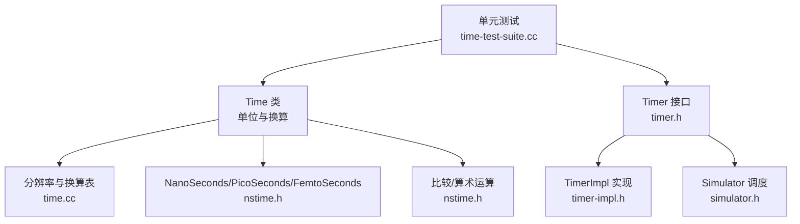
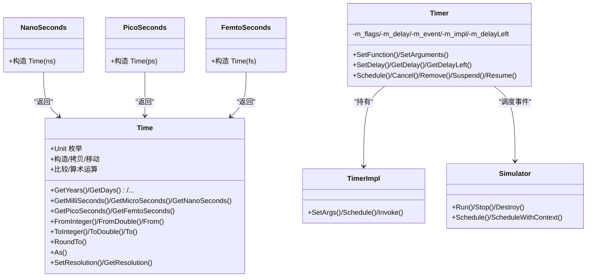
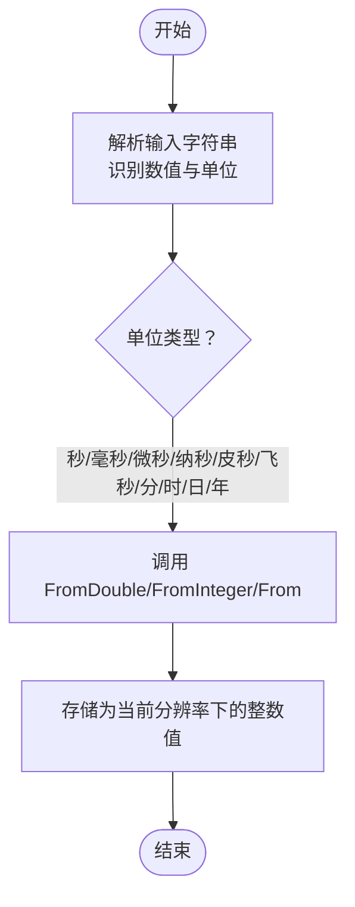
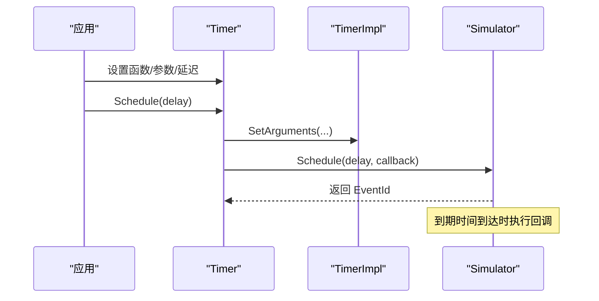
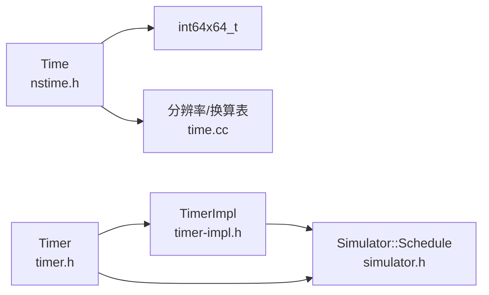

# 时间管理

<cite>
**本文引用的文件**
- [nstime.h](file://simulator/ns-3.39/src/core/model/nstime.h)
- [time.cc](file://simulator/ns-3.39/src/core/model/time.cc)
- [timer.h](file://simulator/ns-3.39/src/core/model/timer.h)
- [timer-impl.h](file://simulator/ns-3.39/src/core/model/timer-impl.h)
- [simulator.h](file://simulator/ns-3.39/src/core/model/simulator.h)
- [time-test-suite.cc](file://simulator/ns-3.39/src/core/test/time-test-suite.cc)
</cite>

## 目录
1. [引言](#引言)
2. [项目结构](#项目结构)
3. [核心组件](#核心组件)
4. [架构总览](#架构总览)
5. [详细组件分析](#详细组件分析)
6. [依赖关系分析](#依赖关系分析)
7. [性能考量](#性能考量)
8. [故障排查指南](#故障排查指南)
9. [结论](#结论)
10. [附录](#附录)

## 引言
本文件系统化梳理 NS-3 的时间管理系统，重点围绕 Time 类与 NanoSeconds 辅助函数的设计与使用，覆盖以下主题：
- 时间单位与精度：秒级与更小单位（纳秒、皮秒、飞秒）的表示与转换
- 精度控制与分辨率：通过全局分辨率设置影响最大仿真时长与精度
- 比较与算术运算：加减、乘除、取整、取余、绝对值等
- 仿真时间表示与调度：仿真时钟以 64 位整数维护，按分辨率运行
- 定时器与事件：Timer/Watchdog 基于 Time 实现未来事件调度
- 转换规则与精度损失：单位换算中的舍入与精度边界
- 最佳实践与常见陷阱：分辨率选择、数值范围、事件排序与精度权衡

## 项目结构
与时间管理直接相关的核心文件位于 core 模块：
- 时间类型与单位：src/core/model/nstime.h
- 分辨率初始化与换算表：src/core/model/time.cc
- 定时器接口与实现：src/core/model/timer.h、src/core/model/timer-impl.h
- 仿真器接口（调度与停止）：src/core/model/simulator.h
- 单元测试（验证算术与转换）：src/core/test/time-test-suite.cc

图表来源
- [nstime.h:104-1506](file://simulator/ns-3.39/src/core/model/nstime.h#L104-L1506)
- [time.cc:37-279](file://simulator/ns-3.39/src/core/model/time.cc#L37-L279)
- [timer.h:73-304](file://simulator/ns-3.39/src/core/model/timer.h#L73-L304)
- [timer-impl.h:42-131](file://simulator/ns-3.39/src/core/model/timer-impl.h#L42-L131)
- [simulator.h:67-200](file://simulator/ns-3.39/src/core/model/simulator.h#L67-L200)
- [time-test-suite.cc:125-332](file://simulator/ns-3.39/src/core/test/time-test-suite.cc#L125-L332)

章节来源
- [nstime.h:104-1506](file://simulator/ns-3.39/src/core/model/nstime.h#L104-L1506)
- [time.cc:37-279](file://simulator/ns-3.39/src/core/model/time.cc#L37-L279)
- [timer.h:73-304](file://simulator/ns-3.39/src/core/model/timer.h#L73-L304)
- [timer-impl.h:42-131](file://simulator/ns-3.39/src/core/model/timer-impl.h#L42-L131)
- [simulator.h:67-200](file://simulator/ns-3.39/src/core/model/simulator.h#L67-L200)
- [time-test-suite.cc:125-332](file://simulator/ns-3.39/src/core/test/time-test-suite.cc#L125-L332)

## 核心组件
- Time 类
  - 表示虚拟仿真时间，内部以当前分辨率下的 64 位整数存储
  - 支持从字符串解析时间表达式（如“1.5ms”、“100ns”）
  - 提供单位换算接口：FromInteger/FromDouble/From(int64x64_t, Unit) 与 ToInteger/ToDouble/To(Unit)
  - 提供比较与算术运算：==、!=、<、>、<=、>=；+、-、+=、-=；*、/、%、Div、Rem；Abs
  - 提供精度控制：SetResolution/GetResolution；支持将 Time 以指定单位输出（As）
  - 提供便捷构造：NanoSeconds、PicoSeconds、FemtoSeconds
- NanoSeconds/PicoSeconds/FemtoSeconds
  - 作为 Time 的工厂函数，返回对应分辨率下的 Time 对象
- Timer/TimerImpl
  - Timer 封装了延迟、回调与生命周期策略，基于 Simulator::Schedule 进行事件调度
  - TimerImpl 是回调绑定与调度的具体实现，支持 0~6 个参数的函数或成员函数
- Simulator
  - 维护内部仿真时钟（64 位整数），按分辨率推进；事件到期按 FIFO 决定同分辨率下先后顺序

章节来源
- [nstime.h:104-1506](file://simulator/ns-3.39/src/core/model/nstime.h#L104-L1506)
- [timer.h:73-304](file://simulator/ns-3.39/src/core/model/timer.h#L73-L304)
- [timer-impl.h:42-131](file://simulator/ns-3.39/src/core/model/timer-impl.h#L42-L131)
- [simulator.h:67-200](file://simulator/ns-3.39/src/core/model/simulator.h#L67-L200)

## 架构总览
Time 类是时间管理的核心抽象，负责：
- 单位与分辨率：通过 Resolution/Information 结构记录当前分辨率与各单位换算因子
- 数值存储：以 64 位整数保存“当前分辨率下的时间步”
- 换算与输出：在不同单位间转换，并可附加单位用于输出
- 全局分辨率：Time::SetResolution 只能调用一次，用于统一所有 Time 的分辨率与换算

Timer/TimerImpl 通过 Simulator::Schedule 将 Time 延迟转换为事件，实现未来动作的调度。

图表来源
- [nstime.h:104-1506](file://simulator/ns-3.39/src/core/model/nstime.h#L104-L1506)
- [timer.h:73-304](file://simulator/ns-3.39/src/core/model/timer.h#L73-L304)
- [timer-impl.h:42-131](file://simulator/ns-3.39/src/core/model/timer-impl.h#L42-L131)
- [simulator.h:67-200](file://simulator/ns-3.39/src/core/model/simulator.h#L67-L200)

## 详细组件分析

### Time 类设计与使用
- 单位与换算
  - 支持年(Y)、日(D)、小时(H)、分钟(MIN)、秒(S)、毫秒(MS)、微秒(US)、纳秒(NS)、皮秒(PS)、飞秒(FS)
  - 换算通过 Resolution/Information 记录：factor、timeFrom、timeTo、toMul/fromMul、isValid
  - 从任意单位构造 Time：FromInteger/FromDouble/From
  - 输出到任意单位：ToInteger/ToDouble/To；并提供 GetSeconds/GetNanoSeconds 等便捷接口
- 精度与分辨率
  - 默认分辨率为纳秒（NS），可通过 SetResolution 更改为其他单位
  - 分辨率提升会降低最大仿真时长（因 64 位整数承载能力限制）
  - 分辨率变更仅允许一次，且会转换已存在的 Time 实例
- 比较与算术
  - 支持全序比较与四则运算；取余与整除分别由 Rem/Div 提供
  - 绝对值 Abs；字符串解析构造（如“1.5ms”）
- 精度损失与舍入
  - 大于等于秒的单位转换返回 double，可能丢失精度
  - 小于秒的单位转换采用四舍五入到最近整数

图表来源
- [nstime.h:279-280](file://simulator/ns-3.39/src/core/model/nstime.h#L279-L280)
- [nstime.h:498-538](file://simulator/ns-3.39/src/core/model/nstime.h#L498-L538)
- [time.cc:129-199](file://simulator/ns-3.39/src/core/model/time.cc#L129-L199)

章节来源
- [nstime.h:104-1506](file://simulator/ns-3.39/src/core/model/nstime.h#L104-L1506)
- [time.cc:37-279](file://simulator/ns-3.39/src/core/model/time.cc#L37-L279)

### NanoSeconds/PicoSeconds/FemtoSeconds 使用
- 作用：快速构造指定分辨率下的 Time 对象，避免手动调用 From
- 设计：内联函数，直接委托 Time::FromInteger/From

章节来源
- [nstime.h:1371-1405](file://simulator/ns-3.39/src/core/model/nstime.h#L1371-L1405)

### 定时器与事件调度
- Timer
  - 生命周期策略：取消/移除/检查销毁
  - 状态：RUNNING、EXPIRED、SUSPENDED
  - 延迟：GetDelay/GetDelayLeft/SetDelay/Schedule
  - 暂停/恢复：Suspend/Resume
- TimerImpl
  - 绑定函数/成员函数与参数（0~6 参数）
  - 通过 Simulator::Schedule 在未来某时刻触发回调
- 事件排序
  - 同一分辨率下，相同到期时间按 FIFO 排序

图表来源
- [timer.h:153-213](file://simulator/ns-3.39/src/core/model/timer.h#L153-L213)
- [timer-impl.h:252-289](file://simulator/ns-3.39/src/core/model/timer-impl.h#L252-L289)
- [simulator.h:140-170](file://simulator/ns-3.39/src/core/model/simulator.h#L140-L170)

章节来源
- [timer.h:73-304](file://simulator/ns-3.39/src/core/model/timer.h#L73-L304)
- [timer-impl.h:42-131](file://simulator/ns-3.39/src/core/model/timer-impl.h#L42-L131)
- [simulator.h:67-200](file://simulator/ns-3.39/src/core/model/simulator.h#L67-L200)

### 时间单位转换规则与精度损失
- 转换规则
  - 通过 UNIT_POWER/UNIT_COEFF 与 UNIT_VALUE 计算单位到最小单位的缩放
  - Resolution 中为每个单位预存 factor、timeFrom、timeTo、toMul/fromMul、isValid
  - FromInteger/FromDouble/From 使用 factor 或 timeFrom 进行乘除换算
  - ToInteger/ToDouble/To 使用 factor 或 timeTo 进行乘除换算
- 精度损失
  - 大于等于秒的单位转换返回 double，可能丢失低位精度
  - 小于秒的单位转换采用四舍五入到最近整数
  - 分辨率提升导致最大仿真时长下降（例如从纳秒到皮秒）

章节来源
- [time.cc:37-89](file://simulator/ns-3.39/src/core/model/time.cc#L37-L89)
- [nstime.h:498-538](file://simulator/ns-3.39/src/core/model/nstime.h#L498-L538)
- [nstime.h:554-593](file://simulator/ns-3.39/src/core/model/nstime.h#L554-L593)
- [nstime.h:370-430](file://simulator/ns-3.39/src/core/model/nstime.h#L370-L430)

### 仿真时间表示与调度
- 仿真时钟
  - 以 64 位整数表示当前仿真时间，单位由全局分辨率决定
  - 事件到期时间相同时，按 FIFO 顺序执行
- 停止条件
  - 无事件、达到 Stop 时间或显式 Stop 调用

章节来源
- [simulator.h:54-66](file://simulator/ns-3.39/src/core/model/simulator.h#L54-L66)
- [simulator.h:139-170](file://simulator/ns-3.39/src/core/model/simulator.h#L139-L170)

### 代码示例路径（不展示具体代码）
- 时间构造与单位换算
  - [构造 Time 并解析字符串:129-199](file://simulator/ns-3.39/src/core/model/nstime.h#L129-L199)
  - [从任意单位构造 Time:498-538](file://simulator/ns-3.39/src/core/model/nstime.h#L498-L538)
  - [输出到指定单位:554-593](file://simulator/ns-3.39/src/core/model/nstime.h#L554-L593)
- 精度与分辨率
  - [设置全局分辨率:468-472](file://simulator/ns-3.39/src/core/model/nstime.h#L468-L472)
  - [分辨率初始化与换算表:202-279](file://simulator/ns-3.39/src/core/model/time.cc#L202-L279)
- 算术与比较
  - [比较与算术运算:771-800](file://simulator/ns-3.39/src/core/model/nstime.h#L771-L800)
  - [取余与整除:1142-1174](file://simulator/ns-3.39/src/core/model/nstime.h#L1142-L1174)
  - [单元测试验证:125-332](file://simulator/ns-3.39/src/core/test/time-test-suite.cc#L125-L332)
- 定时器与事件
  - [Timer 接口:153-213](file://simulator/ns-3.39/src/core/model/timer.h#L153-L213)
  - [TimerImpl 绑定与调度:252-289](file://simulator/ns-3.39/src/core/model/timer-impl.h#L252-L289)
  - [Simulator 调度:140-170](file://simulator/ns-3.39/src/core/model/simulator.h#L140-L170)

章节来源
- [nstime.h:129-199](file://simulator/ns-3.39/src/core/model/nstime.h#L129-L199)
- [nstime.h:498-538](file://simulator/ns-3.39/src/core/model/nstime.h#L498-L538)
- [nstime.h:554-593](file://simulator/ns-3.39/src/core/model/nstime.h#L554-L593)
- [time.cc:202-279](file://simulator/ns-3.39/src/core/model/time.cc#L202-L279)
- [time-test-suite.cc:125-332](file://simulator/ns-3.39/src/core/test/time-test-suite.cc#L125-L332)
- [timer.h:153-213](file://simulator/ns-3.39/src/core/model/timer.h#L153-L213)
- [timer-impl.h:252-289](file://simulator/ns-3.39/src/core/model/timer-impl.h#L252-L289)
- [simulator.h:140-170](file://simulator/ns-3.39/src/core/model/simulator.h#L140-L170)

## 依赖关系分析
- Time 依赖
  - int64x64_t：高精度有理数，用于精确换算
  - 静态分辨率表：在 time.cc 中初始化
- Timer/TimerImpl 依赖
  - Simulator::Schedule：将 Time 延迟映射为事件
  - TypeTraits/IntToType：模板参数推导与特化
- Simulator 依赖
  - Scheduler：事件队列与调度
  - EventId/EventImpl：事件标识与实现

图表来源
- [nstime.h:104-1506](file://simulator/ns-3.39/src/core/model/nstime.h#L104-L1506)
- [time.cc:37-89](file://simulator/ns-3.39/src/core/model/time.cc#L37-L89)
- [timer.h:73-304](file://simulator/ns-3.39/src/core/model/timer.h#L73-L304)
- [timer-impl.h:42-131](file://simulator/ns-3.39/src/core/model/timer-impl.h#L42-L131)
- [simulator.h:67-200](file://simulator/ns-3.39/src/core/model/simulator.h#L67-L200)

章节来源
- [nstime.h:104-1506](file://simulator/ns-3.39/src/core/model/nstime.h#L104-L1506)
- [time.cc:37-89](file://simulator/ns-3.39/src/core/model/time.cc#L37-L89)
- [timer.h:73-304](file://simulator/ns-3.39/src/core/model/timer.h#L73-L304)
- [timer-impl.h:42-131](file://simulator/ns-3.39/src/core/model/timer-impl.h#L42-L131)
- [simulator.h:67-200](file://simulator/ns-3.39/src/core/model/simulator.h#L67-L200)

## 性能考量
- 分辨率与精度
  - 提升分辨率（如从 NS 到 PS）可提高时间细节，但会显著降低最大仿真时长（64 位整数承载上限）
- 换算成本
  - From/To 使用整数乘除或高精度有理数，开销与 factor/timeFrom/timeTo 的大小有关
- 事件排序
  - 同分辨率下相同到期时间按 FIFO 排序，避免额外排序开销
- 算术与取余
  - 整型运算在 CPU 上高效；取余与整除由 Rem/Div 提供，注意与除法的组合使用

## 故障排查指南
- 分辨率变更错误
  - Time::SetResolution 只能调用一次；重复调用会导致不可预期行为
  - 若出现换算异常，检查是否在 Simulator::Run 之前设置了分辨率
- 精度丢失
  - 大单位转 double 可能丢失低位；若需更高精度，尽量使用更小单位或 int64x64_t
- 字符串解析失败
  - 不合法格式会触发致命错误；确保单位后缀正确且无空白字符
- 定时器状态错误
  - 在非运行状态调用 Suspend/Resume 会报错；先确认 IsRunning/IsSuspended
- 事件未按预期执行
  - 检查延迟是否为正，以及是否被 Cancel/Remove 或 DestroyPolicy 影响

章节来源
- [time.cc:212-279](file://simulator/ns-3.39/src/core/model/time.cc#L212-L279)
- [nstime.h:279-280](file://simulator/ns-3.39/src/core/model/nstime.h#L279-L280)
- [timer.h:227-233](file://simulator/ns-3.39/src/core/model/timer.h#L227-L233)
- [timer-impl.h:252-289](file://simulator/ns-3.39/src/core/model/timer-impl.h#L252-L289)

## 结论
NS-3 的时间管理以 Time 类为核心，结合分辨率机制与高精度换算，提供了灵活而可控的仿真时间表示。通过合理选择分辨率、理解单位换算与精度损失、规范使用定时器与事件调度，可在保证性能的同时满足大多数网络仿真场景的精度需求。建议在仿真开始前确定分辨率并避免后续变更，优先使用纳秒级分辨率以兼顾精度与时长。

## 附录
- 常用 API 路径参考
  - [Time 构造与解析:129-199](file://simulator/ns-3.39/src/core/model/nstime.h#L129-L199)
  - [单位换算接口:498-593](file://simulator/ns-3.39/src/core/model/nstime.h#L498-L593)
  - [分辨率设置:468-472](file://simulator/ns-3.39/src/core/model/nstime.h#L468-L472)
  - [算术与比较:771-800](file://simulator/ns-3.39/src/core/model/nstime.h#L771-L800)
  - [取余与整除:1142-1174](file://simulator/ns-3.39/src/core/model/nstime.h#L1142-L1174)
  - [定时器接口:153-213](file://simulator/ns-3.39/src/core/model/timer.h#L153-L213)
  - [定时器实现:252-289](file://simulator/ns-3.39/src/core/model/timer-impl.h#L252-L289)
  - [仿真器调度:140-170](file://simulator/ns-3.39/src/core/model/simulator.h#L140-L170)
  - [单元测试示例:125-332](file://simulator/ns-3.39/src/core/test/time-test-suite.cc#L125-L332)