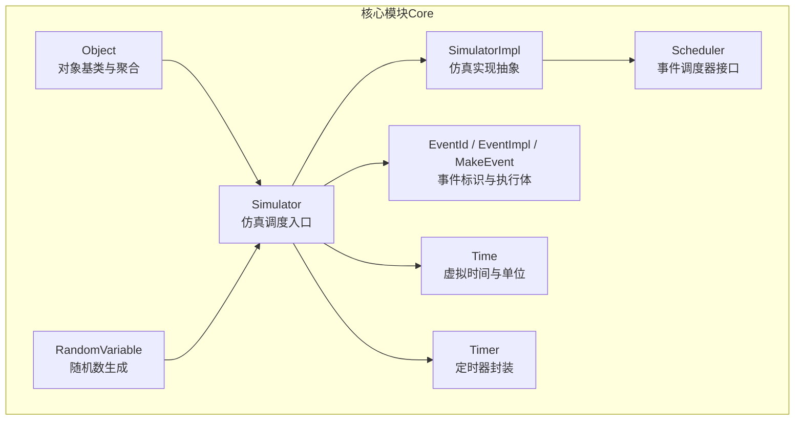
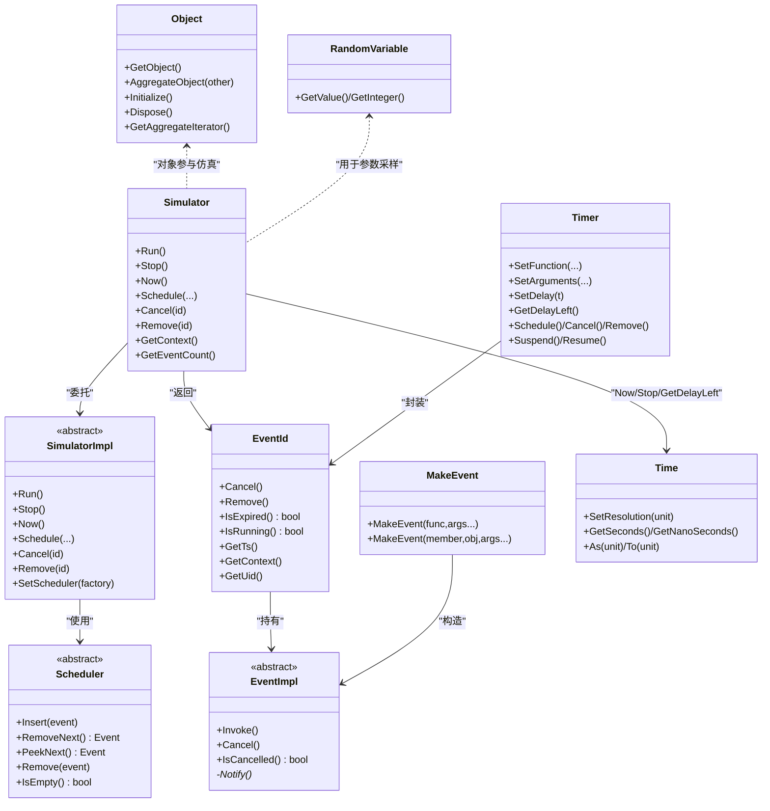
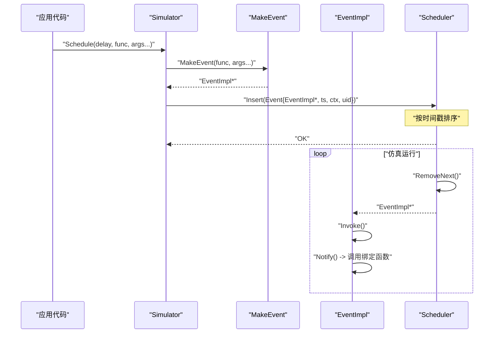
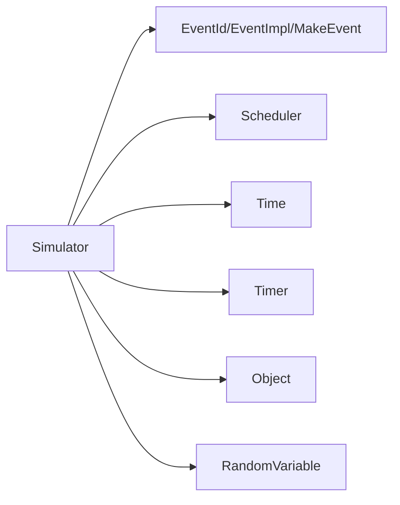

# 核心模块（Core）

<cite>
**本文引用的文件**
- [simulator.h](file://simulator/ns-3.39/src/core/model/simulator.h)
- [simulator-impl.h](file://simulator/ns-3.39/src/core/model/simulator-impl.h)
- [scheduler.h](file://simulator/ns-3.39/src/core/model/scheduler.h)
- [object.h](file://simulator/ns-3.39/src/core/model/object.h)
- [event-id.h](file://simulator/ns-3.39/src/core/model/event-id.h)
- [event-impl.h](file://simulator/ns-3.39/src/core/model/event-impl.h)
- [make-event.h](file://simulator/ns-3.39/src/core/model/make-event.h)
- [nstime.h](file://simulator/ns-3.39/src/core/model/nstime.h)
- [timer.h](file://simulator/ns-3.39/src/core/model/timer.h)
- [random-variable.h](file://simulator/ns-3.39/src/core/model/random-variable.h)
</cite>

## 目录
1. [简介](#简介)
2. [项目结构](#项目结构)
3. [核心组件](#核心组件)
4. [架构总览](#架构总览)
5. [详细组件分析](#详细组件分析)
6. [依赖分析](#依赖分析)
7. [性能考虑](#性能考虑)
8. [故障排查指南](#故障排查指南)
9. [结论](#结论)
10. [附录：常用API与示例路径](#附录常用api与示例路径)

## 简介
本文件为 NS-3 核心模块（Core）的深度技术文档，聚焦于仿真调度器、事件管理系统、对象模型、时间管理等内核能力，并对 Simulator 类、Object 基类、EventId、EventImpl 等关键类进行接口与使用方法详解。文档同时覆盖事件调度机制、内存管理策略、随机数生成器、日志系统等内部组件，提供与模块交互关系、依赖关系、性能优化技巧与最佳实践，帮助底层开发者与模块扩展人员高效理解与使用。

## 项目结构
核心模块位于 ns-3.39/src/core/model，主要由以下子系统构成：
- 仿真控制与调度：Simulator、SimulatorImpl、Scheduler
- 事件系统：EventId、EventImpl、MakeEvent
- 对象模型：Object 及其派生体系
- 时间管理：Time 及单位转换
- 计时器封装：Timer
- 随机数：RandomVariable 系列

图表来源
- [simulator.h:67-531](file://simulator/ns-3.39/src/core/model/simulator.h#L67-L531)
- [simulator-impl.h:48-110](file://simulator/ns-3.39/src/core/model/simulator-impl.h#L48-L110)
- [scheduler.h:156-229](file://simulator/ns-3.39/src/core/model/scheduler.h#L156-L229)
- [event-id.h:54-150](file://simulator/ns-3.39/src/core/model/event-id.h#L54-L150)
- [event-impl.h:45-81](file://simulator/ns-3.39/src/core/model/event-impl.h#L45-L81)
- [make-event.h:34-344](file://simulator/ns-3.39/src/core/model/make-event.h#L34-L344)
- [object.h:88-447](file://simulator/ns-3.39/src/core/model/object.h#L88-L447)
- [nstime.h:104-103](file://simulator/ns-3.39/src/core/model/nstime.h#L104-L103)
- [timer.h:73-260](file://simulator/ns-3.39/src/core/model/timer.h#L73-L260)
- [random-variable.h:60-88](file://simulator/ns-3.39/src/core/model/random-variable.h#L60-L88)

章节来源
- [simulator.h:67-531](file://simulator/ns-3.39/src/core/model/simulator.h#L67-L531)
- [scheduler.h:156-229](file://simulator/ns-3.39/src/core/model/scheduler.h#L156-L229)

## 核心组件
- 仿真调度器（Simulator/SimulatorImpl）
  - 提供 Run/Stop/Now/GetMaximumSimulationTime 等控制接口；支持上下文切换、销毁阶段事件、事件计数统计。
  - 支持动态替换实现（SetImplementation）与调度器（SetScheduler）。
- 事件系统（EventId/EventImpl/MakeEvent）
  - EventId 作为事件唯一标识，支持取消、移除、到期查询；EventImpl 封装事件执行逻辑；MakeEvent 将函数/成员函数绑定为可调度事件。
- 对象模型（Object）
  - 引用计数与 Dispose 生命周期管理；聚合（Aggregate）与初始化（Initialize）；类型系统与属性系统基础。
- 时间管理（Time）
  - 虚拟时间表示与全局分辨率控制；单位换算与输出格式化；支持最小/最大值与比较运算。
- 计时器（Timer）
  - 在虚拟时间上封装延迟触发、暂停/恢复、销毁策略等生命周期管理。
- 随机数（RandomVariable）
  - 提供多种分布（均匀、指数、正态、伽马、泊松等）与序列/经验分布；默认基于 RngStream。

章节来源
- [simulator.h:67-531](file://simulator/ns-3.39/src/core/model/simulator.h#L67-L531)
- [simulator-impl.h:48-110](file://simulator/ns-3.39/src/core/model/simulator-impl.h#L48-L110)
- [event-id.h:54-150](file://simulator/ns-3.39/src/core/model/event-id.h#L54-L150)
- [event-impl.h:45-81](file://simulator/ns-3.39/src/core/model/event-impl.h#L45-L81)
- [make-event.h:34-344](file://simulator/ns-3.39/src/core/model/make-event.h#L34-L344)
- [object.h:88-447](file://simulator/ns-3.39/src/core/model/object.h#L88-L447)
- [nstime.h:104-103](file://simulator/ns-3.39/src/core/model/nstime.h#L104-L103)
- [timer.h:73-260](file://simulator/ns-3.39/src/core/model/timer.h#L73-L260)
- [random-variable.h:60-88](file://simulator/ns-3.39/src/core/model/random-variable.h#L60-L88)

## 架构总览
下图展示了核心模块的关键类与交互关系，体现从 Simulator 到 Scheduler 的调度链路，以及事件、对象、时间、随机数等子系统的协作。

图表来源
- [simulator.h:67-531](file://simulator/ns-3.39/src/core/model/simulator.h#L67-L531)
- [simulator-impl.h:48-110](file://simulator/ns-3.39/src/core/model/simulator-impl.h#L48-L110)
- [scheduler.h:156-229](file://simulator/ns-3.39/src/core/model/scheduler.h#L156-L229)
- [event-id.h:54-150](file://simulator/ns-3.39/src/core/model/event-id.h#L54-L150)
- [event-impl.h:45-81](file://simulator/ns-3.39/src/core/model/event-impl.h#L45-L81)
- [make-event.h:34-344](file://simulator/ns-3.39/src/core/model/make-event.h#L34-L344)
- [object.h:88-447](file://simulator/ns-3.39/src/core/model/object.h#L88-L447)
- [nstime.h:104-103](file://simulator/ns-3.39/src/core/model/nstime.h#L104-L103)
- [timer.h:73-260](file://simulator/ns-3.39/src/core/model/timer.h#L73-L260)
- [random-variable.h:60-88](file://simulator/ns-3.39/src/core/model/random-variable.h#L60-L88)

## 详细组件分析

### 仿真调度器（Simulator 与 SimulatorImpl）
- 角色定位
  - Simulator 为静态门面，提供统一的调度 API；SimulatorImpl 抽象具体实现，允许在运行前设置实现与调度器工厂。
- 关键接口
  - 运行控制：Run、Stop、IsFinished
  - 事件调度：Schedule/ScheduleNow/ScheduleWithContext/ScheduleDestroy
  - 事件管理：Cancel、Remove、IsExpired、GetDelayLeft、GetEventCount
  - 上下文与系统：GetContext、GetSystemId、GetMaximumSimulationTime
- 设计要点
  - 通过模板与 SFINAE 重载区分函数指针、lambda 与普通可调用对象，统一经由 MakeEvent 绑定为 EventImpl。
  - 支持“销毁阶段”事件，确保清理流程可控。
  - 与 Scheduler 解耦，便于替换不同复杂度/空间特性的调度实现。

章节来源
- [simulator.h:67-531](file://simulator/ns-3.39/src/core/model/simulator.h#L67-L531)
- [simulator-impl.h:48-110](file://simulator/ns-3.39/src/core/model/simulator-impl.h#L48-L110)

### 事件系统（EventId、EventImpl、MakeEvent）
- EventId
  - 唯一标识一次调度事件，支持取消（Cancel）、移除（Remove）、到期判断（IsExpired/IsRunning），并暴露底层 EventImpl 指针、时间戳、上下文与 UID。
- EventImpl
  - 事件执行体抽象，Invoke 在到达时间点被调度器调用；Cancel/IsCancelled 控制执行与否。
- MakeEvent
  - 将任意可调用对象（函数指针、lambda、成员函数）绑定为 EventImpl，支持 0~6 个实参版本，内部通过派生类保存绑定状态并在 Notify 中调用。

图表来源
- [simulator.h:568-635](file://simulator/ns-3.39/src/core/model/simulator.h#L568-L635)
- [make-event.h:396-424](file://simulator/ns-3.39/src/core/model/make-event.h#L396-L424)
- [event-impl.h:45-81](file://simulator/ns-3.39/src/core/model/event-impl.h#L45-L81)
- [scheduler.h:196-229](file://simulator/ns-3.39/src/core/model/scheduler.h#L196-L229)

章节来源
- [event-id.h:54-150](file://simulator/ns-3.39/src/core/model/event-id.h#L54-L150)
- [event-impl.h:45-81](file://simulator/ns-3.39/src/core/model/event-impl.h#L45-L81)
- [make-event.h:34-344](file://simulator/ns-3.39/src/core/model/make-event.h#L34-L344)

### 对象模型（Object）
- 生命周期与内存管理
  - 基于引用计数与 Dispose 机制，避免循环引用导致的泄漏；通过 AggregateObject 实现对象聚合，Initialize/Dispose 分别在生命周期开始与结束时调用。
- 聚合与迭代
  - GetObject<T>() 与 GetAggregateIterator() 支持跨对象发现与访问；内部维护聚合数组并按访问频率排序以提升性能。
- 与仿真集成
  - 所有可参与仿真的对象均继承自 Object，便于统一的资源管理与生命周期控制。

章节来源
- [object.h:88-447](file://simulator/ns-3.39/src/core/model/object.h#L88-L447)

### 时间管理（Time）
- 表示与分辨率
  - 内部以 64 位整型存储虚拟时间，分辨率可通过 SetResolution 动态设定；分辨率越高，最大仿真时长越短。
- 单位换算与比较
  - 提供 From/To/As 等接口，支持年/日/时/分/秒/毫微皮飞秒等单位；内置比较运算符与绝对值、最值工具函数。
- 与仿真交互
  - Simulator::Now/Stop/GetDelayLeft 等均基于 Time；Time::StaticInit 保证分辨率变更时现有实例正确转换。

章节来源
- [nstime.h:104-103](file://simulator/ns-3.39/src/core/model/nstime.h#L104-L103)

### 计时器（Timer）
- 能力与策略
  - 支持运行/暂停/恢复/取消/移除/到期查询；销毁策略包括取消/移除/检查三种；支持设置函数与参数。
- 与事件系统的关系
  - 内部持有 EventId 与 TimerImpl，封装了延迟计算与事件生命周期管理，简化上层使用。

章节来源
- [timer.h:73-260](file://simulator/ns-3.39/src/core/model/timer.h#L73-L260)

### 随机数生成器（RandomVariable）
- 分布族
  - 均匀、常数、序列、指数、帕累托、威布尔、正态、经验分布、确定性序列、伽马、爱尔朗、齐夫、泽塔等。
- 默认实现
  - 基于 RngStream，受全局种子与运行号控制；提供 GetValue/GetInteger 接口。

章节来源
- [random-variable.h:60-88](file://simulator/ns-3.39/src/core/model/random-variable.h#L60-L88)

## 依赖分析
- Simulator 依赖
  - 事件系统：EventId/EventImpl/MakeEvent
  - 调度器：Scheduler（通过 SimulatorImpl）
  - 时间：Time
  - 计时器：Timer（封装事件）
  - 对象：Object（对象参与仿真）
  - 随机数：RandomVariable（参数采样）
- 耦合与内聚
  - Simulator 与 Scheduler 通过接口解耦，便于替换调度算法；事件系统通过 MakeEvent 统一绑定，降低上层复杂度。
- 外部依赖
  - 时间分辨率与单位换算依赖内部映射表；随机数依赖 RngStream。

图表来源
- [simulator.h:67-531](file://simulator/ns-3.39/src/core/model/simulator.h#L67-L531)
- [scheduler.h:156-229](file://simulator/ns-3.39/src/core/model/scheduler.h#L156-L229)
- [timer.h:73-260](file://simulator/ns-3.39/src/core/model/timer.h#L73-L260)
- [random-variable.h:60-88](file://simulator/ns-3.39/src/core/model/random-variable.h#L60-L88)

章节来源
- [simulator.h:67-531](file://simulator/ns-3.39/src/core/model/simulator.h#L67-L531)
- [scheduler.h:156-229](file://simulator/ns-3.39/src/core/model/scheduler.h#L156-L229)

## 性能考虑
- 调度器选择
  - 不同 Scheduler 的插入/删除复杂度不同，应根据事件规模与特性（频繁取消 vs 大列表）选择合适实现；可通过 Simulator::SetScheduler 动态切换。
- 事件管理策略
  - Cancel 为 O(1) 标记取消，Remove 为更高复杂度但释放内存；Destroy 阶段事件按 FIFO 排序，避免过早清理。
- 时间分辨率
  - 提升分辨率可提高精度但缩短最大仿真时长；建议在满足需求前提下采用适中分辨率。
- 对象与聚合
  - 合理使用聚合减少指针开销；注意打破循环引用，及时调用 Dispose。
- 随机数
  - 使用批量生成或缓存策略减少重复初始化成本；必要时固定种子以复现实验结果。

## 故障排查指南
- 事件相关
  - 使用 Cancel/Remove 前确认事件非 Destroy 阶段；若误操作可能导致崩溃。
  - 若事件未按预期执行，检查上下文（GetContext）与调度延迟（GetDelayLeft）。
- 时间相关
  - 分辨率变更后需确保所有 Time 实例已转换；避免超出最大仿真时长。
- 对象相关
  - 发生死循环引用时，调用 Dispose 并显式断开关联；检查聚合链路。
- 计时器相关
  - 暂停/恢复必须成对使用；销毁策略会影响事件生命周期与内存占用。

章节来源
- [simulator.h:393-436](file://simulator/ns-3.39/src/core/model/simulator.h#L393-L436)
- [timer.h:226-233](file://simulator/ns-3.39/src/core/model/timer.h#L226-L233)
- [object.h:171-183](file://simulator/ns-3.39/src/core/model/object.h#L171-L183)

## 结论
NS-3 核心模块通过清晰的职责划分与抽象接口，实现了高可扩展的仿真调度与事件管理能力。Simulator 作为统一入口，结合 Scheduler 的可插拔设计、EventId/EventImpl 的轻量绑定、Object 的生命周期管理、Time 的分辨率控制与 Timer 的便捷封装，以及 RandomVariable 的丰富分布族，为上层建模提供了坚实基础。遵循本文的接口使用方式、依赖关系与性能建议，可有效提升仿真效率与稳定性。

## 附录：常用API与示例路径
- 仿真控制
  - [Simulator::Run/Stop/Now/GetMaximumSimulationTime:140-171](file://simulator/ns-3.39/src/core/model/simulator.h#L140-L171)
  - [Simulator::Schedule/ScheduleNow/ScheduleWithContext/ScheduleDestroy:212-391](file://simulator/ns-3.39/src/core/model/simulator.h#L212-L391)
  - [Simulator::Cancel/Remove/IsExpired/GetDelayLeft/GetEventCount:393-453](file://simulator/ns-3.39/src/core/model/simulator.h#L393-L453)
- 事件系统
  - [EventId 接口与比较运算:54-173](file://simulator/ns-3.39/src/core/model/event-id.h#L54-L173)
  - [EventImpl 抽象与 Invoke/Cancel:45-81](file://simulator/ns-3.39/src/core/model/event-impl.h#L45-L81)
  - [MakeEvent 绑定函数/成员函数:34-344](file://simulator/ns-3.39/src/core/model/make-event.h#L34-L344)
- 对象模型
  - [Object 生命周期与聚合:142-212](file://simulator/ns-3.39/src/core/model/object.h#L142-L212)
- 时间管理
  - [Time 分辨率与单位换算:468-593](file://simulator/ns-3.39/src/core/model/nstime.h#L468-L593)
- 计时器
  - [Timer 函数/参数设置与生命周期:124-233](file://simulator/ns-3.39/src/core/model/timer.h#L124-L233)
- 随机数
  - [RandomVariable 基类与分布族:60-756](file://simulator/ns-3.39/src/core/model/random-variable.h#L60-L756)