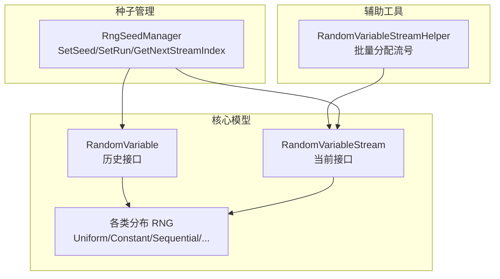
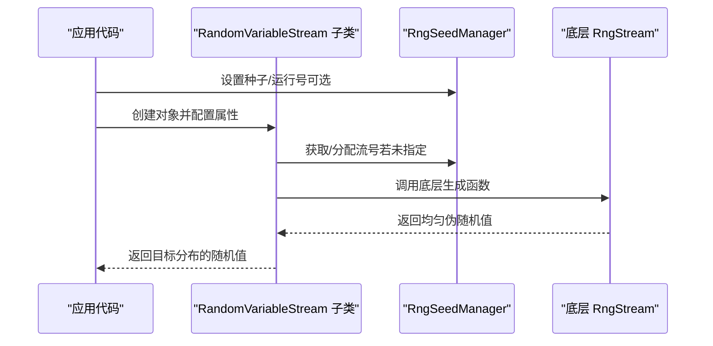
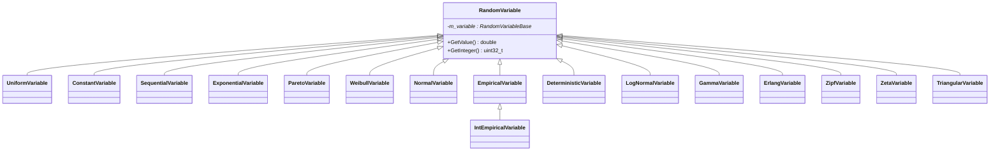
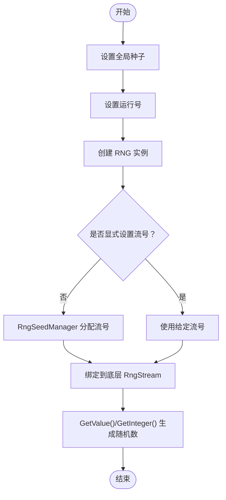
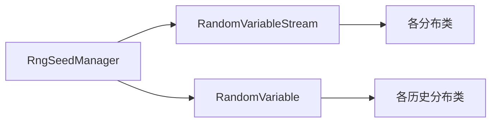

# 随机数生成

<cite>
**本文引用的文件**   
- [random-variable.h](file://simulator/ns-3.39/src/core/model/random-variable.h)
- [random-variable-stream.h](file://simulator/ns-3.39/src/core/model/random-variable-stream.h)
- [random-variable-stream-helper.h](file://simulator/ns-3.39/src/core/helper/random-variable-stream-helper.h)
- [rng-seed-manager.h](file://simulator/ns-3.39/src/core/model/rng-seed-manager.h)
- [rng-seed-manager.cc](file://simulator/ns-3.39/src/core/model/rng-seed-manager.cc)
</cite>

## 目录
1. [引言](#引言)
2. [项目结构](#项目结构)
3. [核心组件](#核心组件)
4. [架构总览](#架构总览)
5. [详细组件分析](#详细组件分析)
6. [依赖关系分析](#依赖关系分析)
7. [性能考虑](#性能考虑)
8. [故障排查指南](#故障排查指南)
9. [结论](#结论)
10. [附录：使用示例与最佳实践](#附录使用示例与最佳实践)

## 引言
本文件系统化梳理 NS-3 的随机数生成体系，重点覆盖以下方面：
- RandomVariable 类族（历史接口）与 RandomVariableStream 类族（当前推荐）的设计与差异
- 各种概率分布的实现要点与适用场景
- 随机数生成算法与底层实现（RngStream）
- 种子与运行号管理（RngSeedManager）
- 流式随机数与单次随机数的区别及使用建议
- 并行仿真中的随机数管理、重现性保证、质量评估与性能优化
- 实战示例路径与最佳实践

## 项目结构
NS-3 的随机数相关代码主要位于 core 模块：
- 核心模型层：random-variable.h（历史 RandomVariable 类族）、random-variable-stream.h（当前 RandomVariableStream 类族）
- 辅助工具层：random-variable-stream-helper.h（批量分配流号）
- 种子管理：rng-seed-manager.h/.cc（全局种子与运行号）

**图示来源**
- [random-variable.h:60-88](file://simulator/ns-3.39/src/core/model/random-variable.h#L60-L88)
- [random-variable-stream.h:98-172](file://simulator/ns-3.39/src/core/model/random-variable-stream.h#L98-L172)
- [random-variable-stream-helper.h:37-70](file://simulator/ns-3.39/src/core/helper/random-variable-stream-helper.h#L37-L70)
- [rng-seed-manager.h:39-107](file://simulator/ns-3.39/src/core/model/rng-seed-manager.h#L39-L107)

**章节来源**
- [random-variable.h:60-88](file://simulator/ns-3.39/src/core/model/random-variable.h#L60-L88)
- [random-variable-stream.h:98-172](file://simulator/ns-3.39/src/core/model/random-variable-stream.h#L98-L172)
- [random-variable-stream-helper.h:37-70](file://simulator/ns-3.39/src/core/helper/random-variable-stream-helper.h#L37-L70)
- [rng-seed-manager.h:39-107](file://simulator/ns-3.39/src/core/model/rng-seed-manager.h#L39-L107)

## 核心组件
- RandomVariable（历史接口）
  - 提供单次随机值生成（GetValue/GetInteger），内部持有 RandomVariableBase 指针
  - 默认以全局种子与运行号初始化，便于重现
- RandomVariableStream（当前接口）
  - 所有分布均基于该基类，支持显式设置流号、抗变异（antithetic）等
  - 每个实例绑定一个底层 RngStream，确保可确定性与可分离性
- RngSeedManager
  - 全局设置种子与运行号；提供自动流号分配
  - 支持命令行参数 --RngSeed 与 --RngRun
- RandomVariableStreamHelper
  - 基于配置路径批量为多个 RNG 分配流号，便于大规模并行

**章节来源**
- [random-variable.h:60-88](file://simulator/ns-3.39/src/core/model/random-variable.h#L60-L88)
- [random-variable-stream.h:98-172](file://simulator/ns-3.39/src/core/model/random-variable-stream.h#L98-L172)
- [rng-seed-manager.h:39-107](file://simulator/ns-3.39/src/core/model/rng-seed-manager.h#L39-L107)
- [random-variable-stream-helper.h:37-70](file://simulator/ns-3.39/src/core/helper/random-variable-stream-helper.h#L37-L70)

## 架构总览
下图展示了从应用到底层流的调用链与职责边界。

**图示来源**
- [random-variable-stream.h:124-172](file://simulator/ns-3.39/src/core/model/random-variable-stream.h#L124-L172)
- [rng-seed-manager.h:59-107](file://simulator/ns-3.39/src/core/model/rng-seed-manager.h#L59-L107)

## 详细组件分析

### RandomVariable 类族（历史）
- 设计定位：面向单次随机值生成，适合简单场景或遗留代码
- 关键点
  - GetValue/GetInteger 提供浮点/整型输出
  - 内部通过 RandomVariableBase 抽象分发具体分布
  - 默认使用全局种子与运行号，便于重现
- 代表性分布
  - UniformVariable、ConstantVariable、SequentialVariable、ExponentialVariable、ParetoVariable、WeibullVariable、NormalVariable、EmpiricalVariable、IntEmpiricalVariable、DeterministicVariable、LogNormalVariable、GammaVariable、ErlangVariable、ZipfVariable、ZetaVariable、TriangularVariable

**图示来源**
- [random-variable.h:60-756](file://simulator/ns-3.39/src/core/model/random-variable.h#L60-L756)

**章节来源**
- [random-variable.h:60-756](file://simulator/ns-3.39/src/core/model/random-variable.h#L60-L756)

### RandomVariableStream 类族（当前）
- 设计定位：面向流式随机数，支持确定性流号、抗变异、批量配置
- 关键点
  - SetStream/GetStream 显式控制流号；-1 表示自动分配
  - SetAntithetic/IsAntithetic 支持抗变异（对称变换）
  - 派生类覆盖 GetValue/GetInteger，按各自分布公式生成
- 代表性分布（节选）
  - UniformRandomVariable、ConstantRandomVariable、SequentialRandomVariable、ExponentialRandomVariable、ParetoRandomVariable、WeibullRandomVariable、NormalRandomVariable、LogNormalRandomVariable、GammaRandomVariable、ErlangRandomVariable、TriangularRandomVariable、ZipfRandomVariable、ZetaRandomVariable、DeterministicRandomVariable、EmpiricalRandomVariable

```mermaid
classDiagram
class RandomVariableStream {
+SetStream(stream)
+GetStream() int64_t
+SetAntithetic(flag)
+IsAntithetic() bool
+GetValue() double
+GetInteger() uint32_t
-Peek() RngStream*
-m_rng : RngStream*
-m_isAntithetic : bool
-m_stream : int64_t
}
class UniformRandomVariable
class ConstantRandomVariable
class SequentialRandomVariable
class ExponentialRandomVariable
class ParetoRandomVariable
class WeibullRandomVariable
class NormalRandomVariable
class LogNormalRandomVariable
class GammaRandomVariable
class ErlangRandomVariable
class TriangularRandomVariable
class ZipfRandomVariable
class ZetaRandomVariable
class DeterministicRandomVariable
class EmpiricalRandomVariable
RandomVariableStream <|-- UniformRandomVariable
RandomVariableStream <|-- ConstantRandomVariable
RandomVariableStream <|-- SequentialRandomVariable
RandomVariableStream <|-- ExponentialRandomVariable
RandomVariableStream <|-- ParetoRandomVariable
RandomVariableStream <|-- WeibullRandomVariable
RandomVariableStream <|-- NormalRandomVariable
RandomVariableStream <|-- LogNormalRandomVariable
RandomVariableStream <|-- GammaRandomVariable
RandomVariableStream <|-- ErlangRandomVariable
RandomVariableStream <|-- TriangularRandomVariable
RandomVariableStream <|-- ZipfRandomVariable
RandomVariableStream <|-- ZetaRandomVariable
RandomVariableStream <|-- DeterministicRandomVariable
RandomVariableStream <|-- EmpiricalRandomVariable
```

**图示来源**
- [random-variable-stream.h:98-172](file://simulator/ns-3.39/src/core/model/random-variable-stream.h#L98-L172)
- [random-variable-stream.h:232-292](file://simulator/ns-3.39/src/core/model/random-variable-stream.h#L232-L292)
- [random-variable-stream.h:551-602](file://simulator/ns-3.39/src/core/model/random-variable-stream.h#L551-L602)
- [random-variable-stream.h:830-888](file://simulator/ns-3.39/src/core/model/random-variable-stream.h#L830-L888)
- [random-variable-stream.h:967-1038](file://simulator/ns-3.39/src/core/model/random-variable-stream.h#L967-L1038)
- [random-variable-stream.h:1130-1187](file://simulator/ns-3.39/src/core/model/random-variable-stream.h#L1130-L1187)
- [random-variable-stream.h:1243-1309](file://simulator/ns-3.39/src/core/model/random-variable-stream.h#L1243-L1309)
- [random-variable-stream.h:1377-1434](file://simulator/ns-3.39/src/core/model/random-variable-stream.h#L1377-L1434)
- [random-variable-stream.h:1507-1565](file://simulator/ns-3.39/src/core/model/random-variable-stream.h#L1507-L1565)
- [random-variable-stream.h:1640-1692](file://simulator/ns-3.39/src/core/model/random-variable-stream.h#L1640-L1692)
- [random-variable-stream.h:1753-1794](file://simulator/ns-3.39/src/core/model/random-variable-stream.h#L1753-L1794)
- [random-variable-stream.h:1833-1881](file://simulator/ns-3.39/src/core/model/random-variable-stream.h#L1833-L1881)
- [random-variable-stream.h:1969-2100](file://simulator/ns-3.39/src/core/model/random-variable-stream.h#L1969-L2100)

**章节来源**
- [random-variable-stream.h:98-172](file://simulator/ns-3.39/src/core/model/random-variable-stream.h#L98-L172)
- [random-variable-stream.h:232-292](file://simulator/ns-3.39/src/core/model/random-variable-stream.h#L232-L292)
- [random-variable-stream.h:551-602](file://simulator/ns-3.39/src/core/model/random-variable-stream.h#L551-L602)
- [random-variable-stream.h:830-888](file://simulator/ns-3.39/src/core/model/random-variable-stream.h#L830-L888)
- [random-variable-stream.h:967-1038](file://simulator/ns-3.39/src/core/model/random-variable-stream.h#L967-L1038)
- [random-variable-stream.h:1130-1187](file://simulator/ns-3.39/src/core/model/random-variable-stream.h#L1130-L1187)
- [random-variable-stream.h:1243-1309](file://simulator/ns-3.39/src/core/model/random-variable-stream.h#L1243-L1309)
- [random-variable-stream.h:1377-1434](file://simulator/ns-3.39/src/core/model/random-variable-stream.h#L1377-L1434)
- [random-variable-stream.h:1507-1565](file://simulator/ns-3.39/src/core/model/random-variable-stream.h#L1507-L1565)
- [random-variable-stream.h:1640-1692](file://simulator/ns-3.39/src/core/model/random-variable-stream.h#L1640-L1692)
- [random-variable-stream.h:1753-1794](file://simulator/ns-3.39/src/core/model/random-variable-stream.h#L1753-L1794)
- [random-variable-stream.h:1833-1881](file://simulator/ns-3.39/src/core/model/random-variable-stream.h#L1833-L1881)
- [random-variable-stream.h:1969-2100](file://simulator/ns-3.39/src/core/model/random-variable-stream.h#L1969-L2100)

### RngSeedManager（种子管理器）
- 职责
  - SetSeed/GetSeed：设置/获取全局种子
  - SetRun/GetRun：设置/获取运行号（用于独立复现）
  - GetNextStreamIndex：自动分配下一个流号
- 交互
  - 通过 Config/GlobalValue 维护全局状态
  - 与 RandomVariableStream 协作，确保每个流的初始状态可确定

**图示来源**
- [rng-seed-manager.h:59-107](file://simulator/ns-3.39/src/core/model/rng-seed-manager.h#L59-L107)
- [rng-seed-manager.cc:73-113](file://simulator/ns-3.39/src/core/model/rng-seed-manager.cc#L73-L113)
- [random-variable-stream.h:124-172](file://simulator/ns-3.39/src/core/model/random-variable-stream.h#L124-L172)

**章节来源**
- [rng-seed-manager.h:39-107](file://simulator/ns-3.39/src/core/model/rng-seed-manager.h#L39-L107)
- [rng-seed-manager.cc:33-113](file://simulator/ns-3.39/src/core/model/rng-seed-manager.cc#L33-L113)

### RandomVariableStreamHelper（批量流号分配）
- 用途
  - 通过配置路径匹配多个 RNG 对象，统一设置流号
  - 支持通配符，便于大规模并行场景
- 使用场景
  - 多节点/多模型共享同一分布但需隔离流
  - 自动化脚本批量配置

**章节来源**
- [random-variable-stream-helper.h:37-70](file://simulator/ns-3.39/src/core/helper/random-variable-stream-helper.h#L37-L70)

## 依赖关系分析
- RandomVariable 与 RandomVariableStream 的关系
  - RandomVariable 是历史接口，RandomVariableStream 是当前统一接口
  - 两者均依赖底层 RngStream（由头文件注释说明）
- 分布类之间的继承关系
  - 均继承自对应基类（RandomVariable 或 RandomVariableStream）
- 种子管理与流的关系
  - RngSeedManager 提供种子/运行号与流号分配，RandomVariableStream 读取并绑定

**图示来源**
- [random-variable-stream.h:98-172](file://simulator/ns-3.39/src/core/model/random-variable-stream.h#L98-L172)
- [random-variable.h:60-88](file://simulator/ns-3.39/src/core/model/random-variable.h#L60-L88)
- [rng-seed-manager.h:39-107](file://simulator/ns-3.39/src/core/model/rng-seed-manager.h#L39-L107)

**章节来源**
- [random-variable-stream.h:98-172](file://simulator/ns-3.39/src/core/model/random-variable-stream.h#L98-L172)
- [random-variable.h:60-88](file://simulator/ns-3.39/src/core/model/random-variable.h#L60-L88)
- [rng-seed-manager.h:39-107](file://simulator/ns-3.39/src/core/model/rng-seed-manager.h#L39-L107)

## 性能考虑
- 流式生成的优势
  - 可避免频繁构造/析构带来的开销
  - 通过显式流号减少状态切换成本
- 抗变异（antithetic）的影响
  - 会引入额外计算（如对称变换），在追求吞吐时可关闭
- 分布算法复杂度
  - 指数/伽马/爱尔朗等涉及多次均匀样本与特殊函数，注意批量化调用
- 并行与可重现
  - 通过 SetRun 与 SetStream 确保不同副本/线程的流不重叠
- I/O 与日志
  - 高频调用 GetValue 时避免开启冗余日志级别

[本节为通用指导，无需特定文件引用]

## 故障排查指南
- 现象：相同种子/运行号得到不同结果
  - 排查：确认是否在创建 RNG 之前设置了种子与运行号
  - 参考：RngSeedManager 的 SetSeed/SetRun
- 现象：并行运行结果相关
  - 排查：检查是否为每个流设置了唯一流号；必要时使用 RandomVariableStreamHelper 批量分配
- 现象：性能异常
  - 排查：是否启用了抗变异；是否频繁切换分布参数；是否过度日志输出

**章节来源**
- [rng-seed-manager.h:59-107](file://simulator/ns-3.39/src/core/model/rng-seed-manager.h#L59-L107)
- [random-variable-stream-helper.h:37-70](file://simulator/ns-3.39/src/core/helper/random-variable-stream-helper.h#L37-L70)

## 结论
NS-3 的随机数体系以 RandomVariableStream 为核心，结合 RngSeedManager 提供了确定性、可重现且可扩展的随机数生成能力。通过显式的流号与运行号管理，可在并行仿真中保持良好的统计独立性与可重复性。对于历史代码，RandomVariable 仍可使用，但建议逐步迁移到 RandomVariableStream 以获得更好的可控性与一致性。

[本节为总结，无需特定文件引用]

## 附录：使用示例与最佳实践

### 示例路径（代码片段路径）
- 均匀分布
  - [UniformRandomVariable 属性与用法:232-292](file://simulator/ns-3.39/src/core/model/random-variable-stream.h#L232-L292)
- 指数分布
  - [ExponentialRandomVariable 属性与用法:551-602](file://simulator/ns-3.39/src/core/model/random-variable-stream.h#L551-L602)
- 正态分布
  - [NormalRandomVariable 属性与用法:967-1038](file://simulator/ns-3.39/src/core/model/random-variable-stream.h#L967-L1038)
- 对数正态分布
  - [LogNormalRandomVariable 属性与用法:1130-1187](file://simulator/ns-3.39/src/core/model/random-variable-stream.h#L1130-L1187)
- 伽马分布
  - [GammaRandomVariable 属性与用法:1243-1309](file://simulator/ns-3.39/src/core/model/random-variable-stream.h#L1243-L1309)
- 爱尔朗分布
  - [ErlangRandomVariable 属性与用法:1377-1434](file://simulator/ns-3.39/src/core/model/random-variable-stream.h#L1377-L1434)
- 三角分布
  - [TriangularRandomVariable 属性与用法:1507-1565](file://simulator/ns-3.39/src/core/model/random-variable-stream.h#L1507-L1565)
- Zipf/Zeta 分布
  - [ZipfRandomVariable 属性与用法:1640-1692](file://simulator/ns-3.39/src/core/model/random-variable-stream.h#L1640-L1692)
  - [ZetaRandomVariable 属性与用法:1753-1794](file://simulator/ns-3.39/src/core/model/random-variable-stream.h#L1753-L1794)
- 确定性序列
  - [DeterministicRandomVariable 属性与用法:1833-1881](file://simulator/ns-3.39/src/core/model/random-variable-stream.h#L1833-L1881)
- 经验分布
  - [EmpiricalRandomVariable 属性与用法:1969-2100](file://simulator/ns-3.39/src/core/model/random-variable-stream.h#L1969-L2100)
- 种子与运行号
  - [RngSeedManager 接口:59-107](file://simulator/ns-3.39/src/core/model/rng-seed-manager.h#L59-L107)
- 批量流号分配
  - [RandomVariableStreamHelper 接口:37-70](file://simulator/ns-3.39/src/core/helper/random-variable-stream-helper.h#L37-L70)

### 最佳实践
- 优先使用 RandomVariableStream，明确设置流号以避免冲突
- 在仿真开始前统一设置种子与运行号，确保可重现
- 并行仿真中为每个流/副本设置不同的运行号
- 需要高吞吐时关闭抗变异；需要方差控制时启用
- 对经验分布，先验证 CDF 的单调性与范围，再进行插值或采样模式切换
- 将 RNG 的创建与配置集中在对象初始化阶段，避免运行期频繁变更

[本节为通用指导，无需特定文件引用]