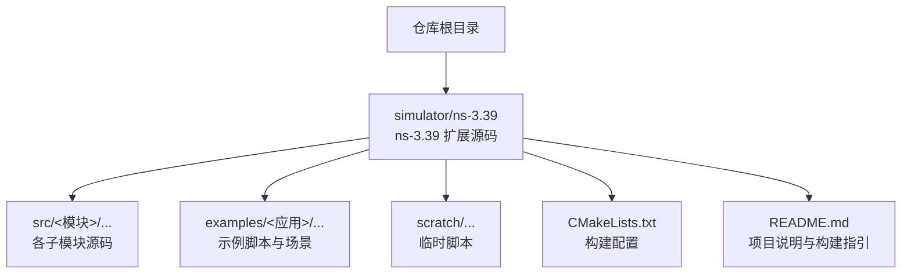
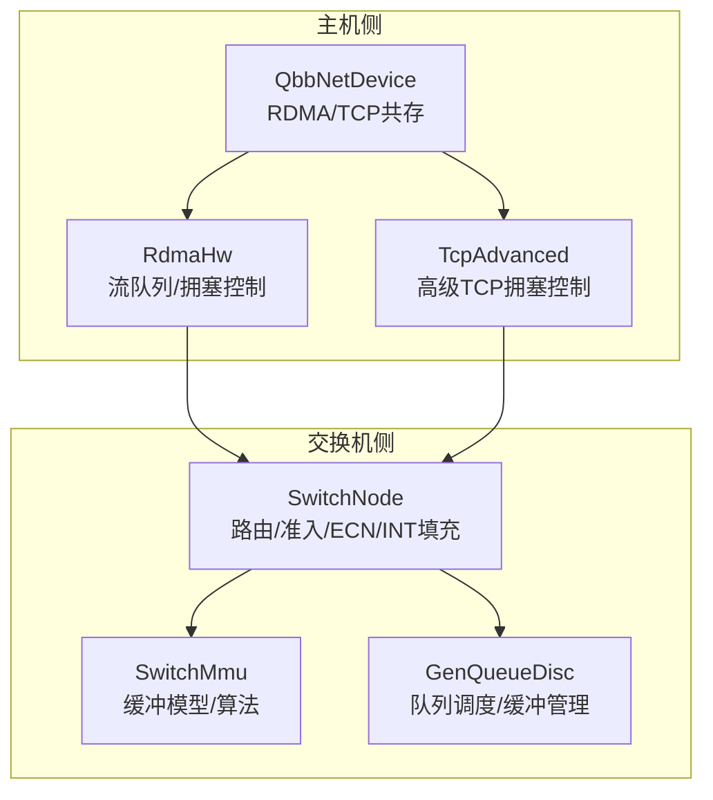
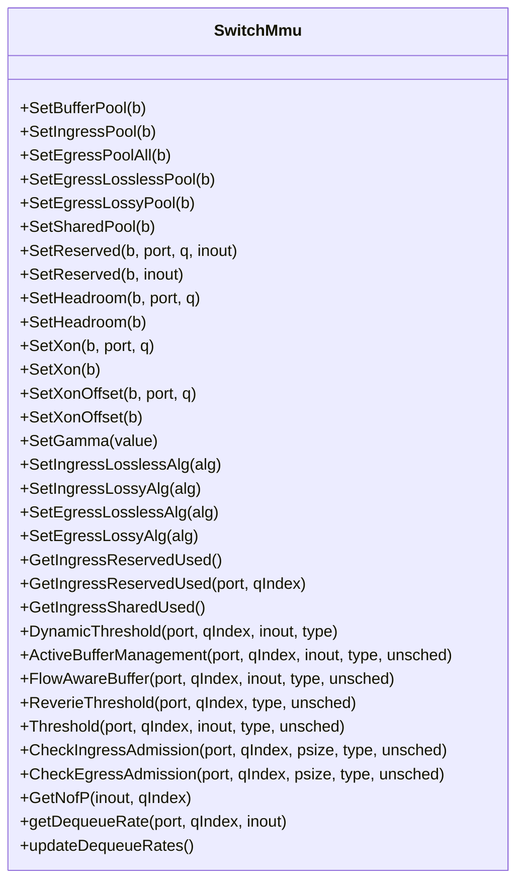
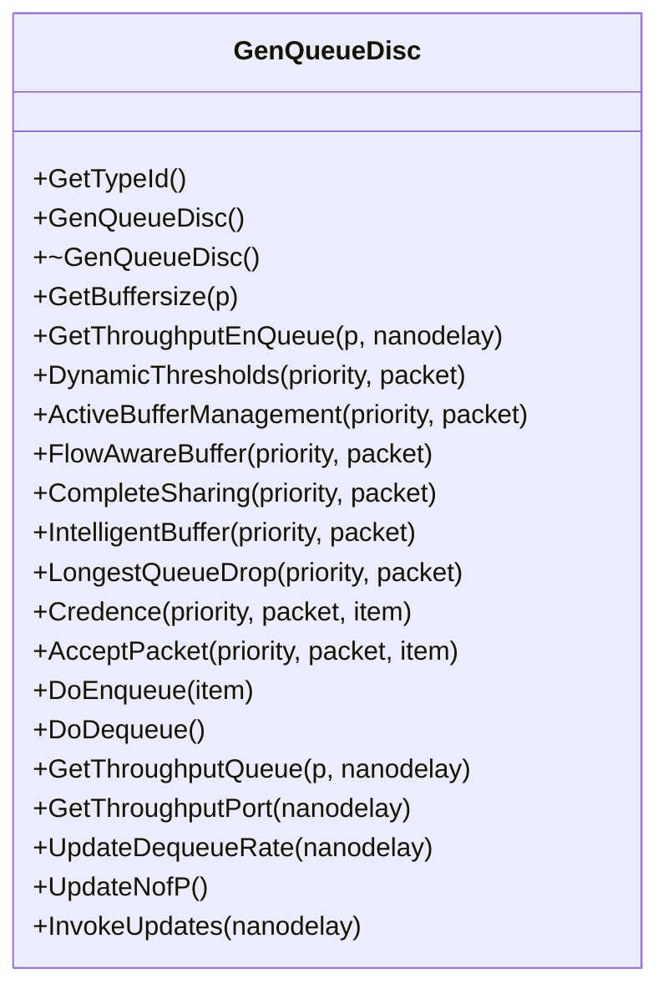
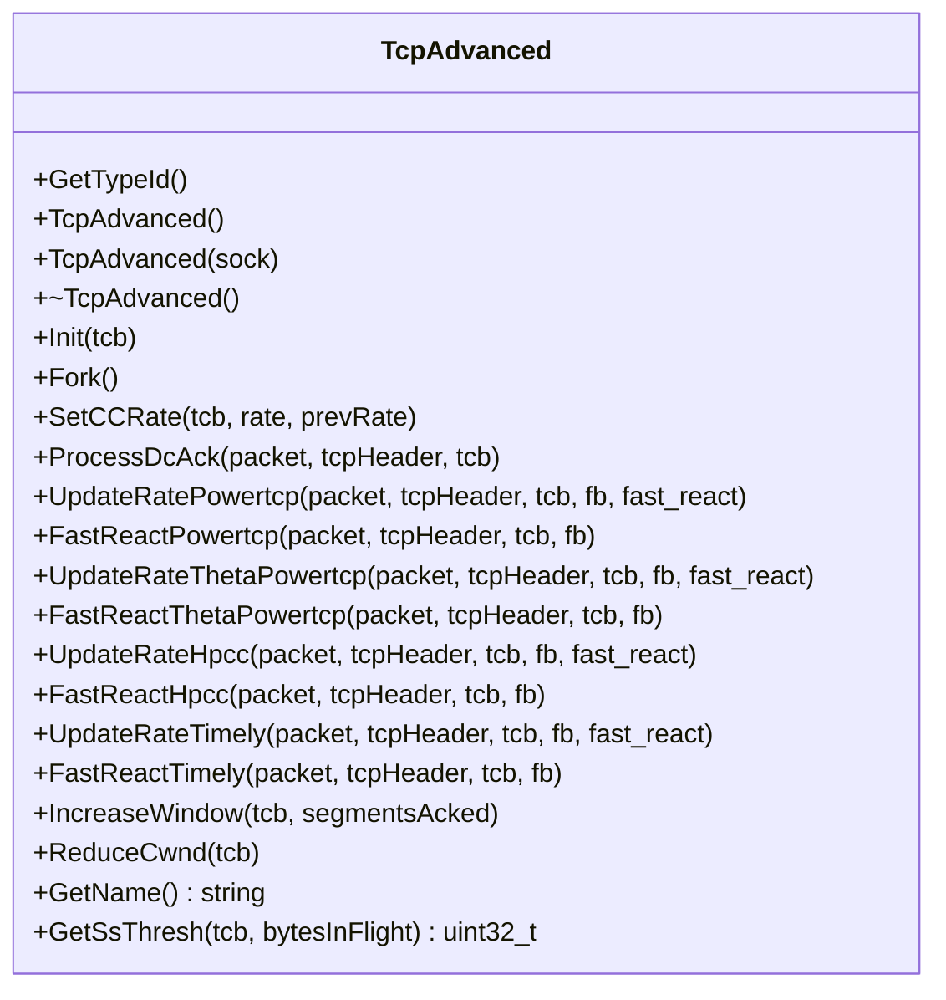
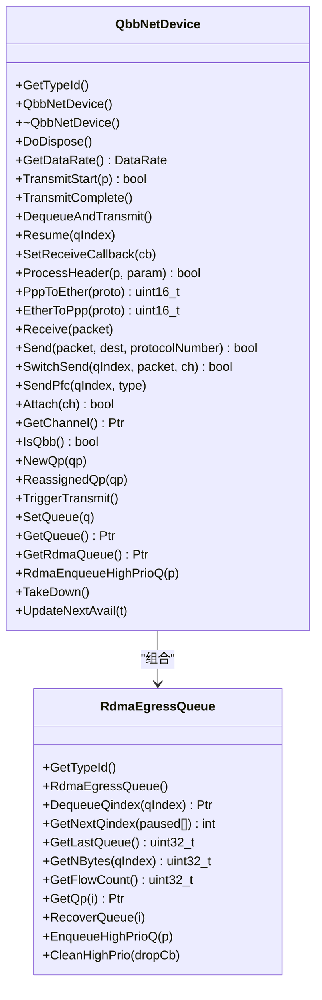
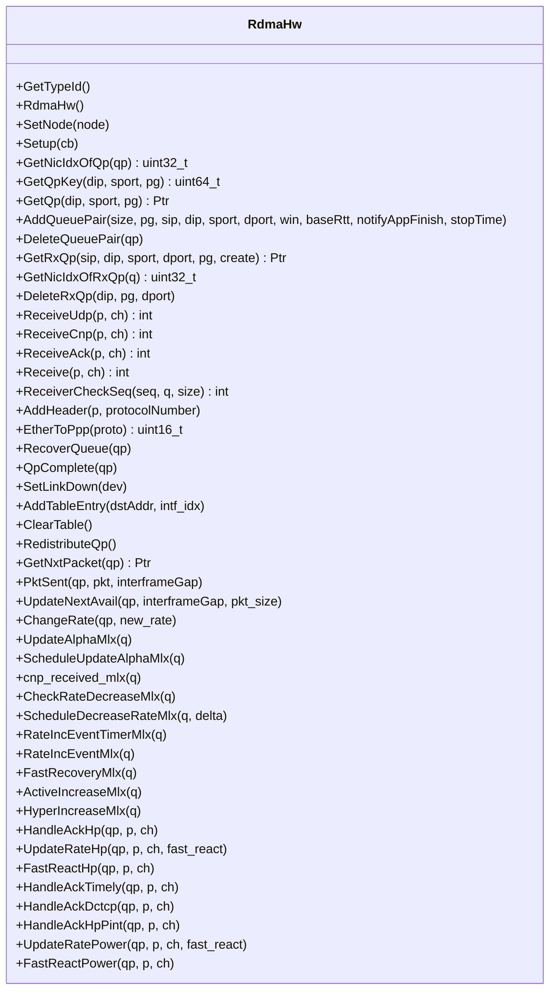
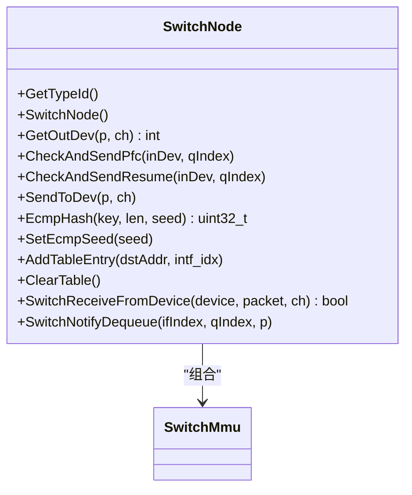
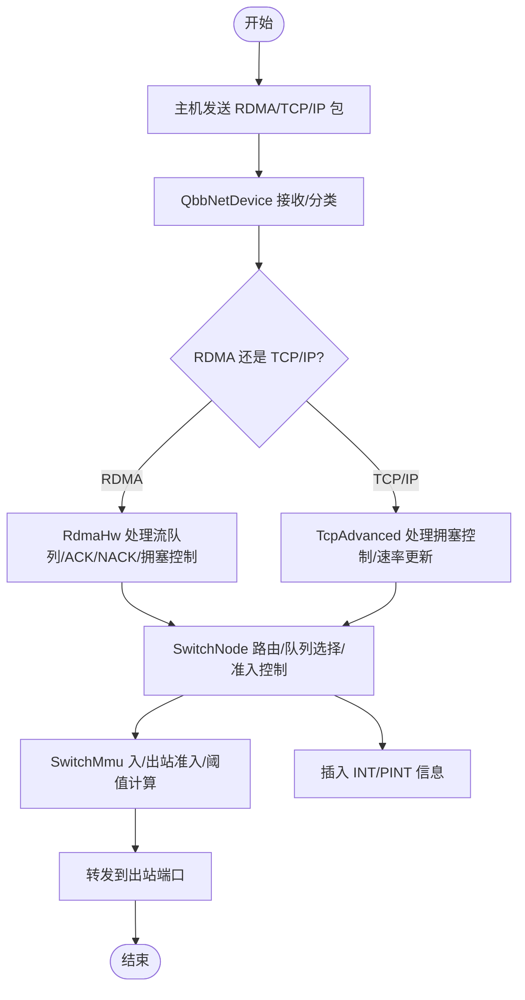
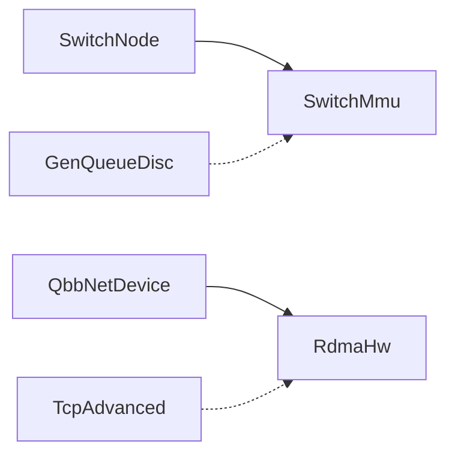

# 模块参考

<cite>
**本文引用的文件**
- [README.md](file://README.md)
- [CMakeLists.txt](file://simulator/ns-3.39/CMakeLists.txt)
- [switch-mmu.cc](file://simulator/ns-3.39/src/point-to-point/model/switch-mmu.cc)
- [gen-queue-disc.cc](file://simulator/ns-3.39/src/traffic-control/model/gen-queue-disc.cc)
- [tcp-advanced.cc](file://simulator/ns-3.39/src/internet/model/tcp-advanced.cc)
- [qbb-net-device.cc](file://simulator/ns-3.39/src/point-to-point/model/qbb-net-device.cc)
- [rdma-hw.cc](file://simulator/ns-3.39/src/point-to-point/model/rdma-hw.cc)
- [switch-node.cc](file://simulator/ns-3.39/src/point-to-point/model/switch-node.cc)
</cite>

## 目录
1. [简介](#简介)
2. [项目结构](#项目结构)
3. [核心组件](#核心组件)
4. [架构总览](#架构总览)
5. [详细组件分析](#详细组件分析)
6. [依赖关系分析](#依赖关系分析)
7. [性能考量](#性能考量)
8. [故障排查指南](#故障排查指南)
9. [结论](#结论)
10. [附录](#附录)

## 简介
本参考手册面向高级开发者与模块扩展人员，系统梳理 ns-3 数据中心平台（基于 ns-3.39）的核心模块与数据平面/控制面扩展点，覆盖以下主题：
- 核心模块：核心（core）、网络（network）、互联网（internet）、流量控制（traffic-control）
- 网络模块：点对点（point-to-point）、以太网桥（bridge，概念性说明）、拓扑读取（topology-read）
- 协议模块：TCP 高级拥塞控制（tcp-advanced）、RDMA 硬件栈（rdma-hw）、INT/反馈标签（feedback-tag）
- 无线模块：WiFi、WiMAX、LR-WPAN、Spectrum、Propagation（概念性说明）

同时，文档给出模块职责、公共接口、配置参数、使用模式、类层次与继承关系、初始化/配置/运行/销毁流程、模块间依赖与集成方式，并通过图示展示关键数据流与调用序列。

## 项目结构
仓库根目录包含仿真器源码与工具链，其中 simulator/ns-3.39 为 ns-3.39 的扩展版本，新增了数据中心相关模块与示例。构建系统采用 CMake，支持按模块启用/禁用、测试、可视化等选项。

图表来源
- [CMakeLists.txt:1-171](file://simulator/ns-3.39/CMakeLists.txt#L1-L171)
- [README.md:66-95](file://README.md#L66-L95)

章节来源
- [CMakeLists.txt:1-171](file://simulator/ns-3.39/CMakeLists.txt#L1-L171)
- [README.md:66-95](file://README.md#L66-L95)

## 核心组件
本节概述数据中心平台的关键组件及其职责：
- 交换机 MMU（SwitchMmu）：实现数据中心交换机共享缓冲区模型（SONIC/Reverie），支持动态阈值（DT）、主动缓冲管理（ABM）、流感知缓冲（FAB）等算法。
- 通用队列调度器（GenQueueDisc）：在 TCP/IP 流量上实现多种缓冲管理策略（DT、ABM、FAB、CS、IB、LQD、Credence），并提供统计与跟踪。
- 高级 TCP 拥塞控制（TcpAdvanced）：在 TCP/IP 上实现 PowerTCP、Theta-PowerTCP、HPCC、Timely 等算法，结合 INT 反馈进行速率更新。
- Qbb 网络设备（QbbNetDevice）：支持 RDMA 与 TCP/IP 共存的端口，维护 RDMA 出站队列、PFC/暂停机制与调度。
- RDMA 硬件栈（RdmaHw）：实现 RDMA 流队列对（RdmaQueuePair）管理、ACK/NACK 处理、拥塞控制（如 DCQCN、HPCC、Timely、PINT）。
- 交换节点（SwitchNode）：路由转发、入出站准入控制、ECN 标记、INT/PINT 填充、PFC/恢复信号发送。

章节来源
- [switch-mmu.cc:1-1054](file://simulator/ns-3.39/src/point-to-point/model/switch-mmu.cc#L1-L1054)
- [gen-queue-disc.cc:1-878](file://simulator/ns-3.39/src/traffic-control/model/gen-queue-disc.cc#L1-L878)
- [tcp-advanced.cc:1-607](file://simulator/ns-3.39/src/internet/model/tcp-advanced.cc#L1-L607)
- [qbb-net-device.cc:1-695](file://simulator/ns-3.39/src/point-to-point/model/qbb-net-device.cc#L1-L695)
- [rdma-hw.cc:1-1288](file://simulator/ns-3.39/src/point-to-point/model/rdma-hw.cc#L1-L1288)
- [switch-node.cc:1-393](file://simulator/ns-3.39/src/point-to-point/model/switch-node.cc#L1-L393)

## 架构总览
数据中心平台的总体架构由“主机侧（NIC/RDMA）+ 交换机（SwitchNode）+ 控制/反馈（INT/反馈标签）”构成。主机侧通过 QbbNetDevice 发送 RDMA/TCP/IP 流量；交换机侧通过 SwitchNode 进行路由与准入控制；控制面通过 RdmaHw/TcpAdvanced 使用 INT/反馈信息进行速率调整。

图表来源
- [qbb-net-device.cc:197-695](file://simulator/ns-3.39/src/point-to-point/model/qbb-net-device.cc#L197-L695)
- [rdma-hw.cc:190-206](file://simulator/ns-3.39/src/point-to-point/model/rdma-hw.cc#L190-L206)
- [tcp-advanced.cc:18-98](file://simulator/ns-3.39/src/internet/model/tcp-advanced.cc#L18-L98)
- [switch-node.cc:23-56](file://simulator/ns-3.39/src/point-to-point/model/switch-node.cc#L23-L56)
- [switch-mmu.cc:28-33](file://simulator/ns-3.39/src/point-to-point/model/switch-mmu.cc#L28-L33)
- [gen-queue-disc.cc:55-131](file://simulator/ns-3.39/src/traffic-control/model/gen-queue-disc.cc#L55-L131)

## 详细组件分析

### 交换机 MMU（SwitchMmu）
- 职责：建模交换机共享缓冲池（ASIC 缓冲），实现入/出站准入控制与拥塞处理；支持 SONIC 与 Reverie 模型；提供 DT/ABM/FAB 等阈值算法。
- 关键接口与属性（节选）
  - 设置/查询缓冲池大小：SetBufferPool/SetIngressPool/SetEgressPoolAll/SetEgressLosslessPool/SetEgressLossyPool/SetSharedPool
  - 设置保留/头房间隔：SetReserved/SetHeadroom/SetXon/SetXonOffset
  - 设置算法：SetIngressLosslessAlg/SetIngressLossyAlg/SetEgressLosslessAlg/SetEgressLossyAlg
  - 入/出站准入检查：CheckIngressAdmission/CheckEgressAdmission
  - 阈值计算：DynamicThreshold/ActiveBufferManagement/FlowAwareBuffer/ReverieThreshold/Threshold
  - 统计与状态：GetIngressReservedUsed/GetNofP/getDequeueRate/updateDequeueRates
- 使用模式
  - 在 SwitchNode 中调用 CheckIngressAdmission/CheckEgressAdmission 进行准入控制
  - 在 RdmaHw/TcpAdvanced 中根据反馈更新阈值与速率
- 类层次与继承
  - 继承自 ns3::Object，注册 TypeId 并暴露属性

图表来源
- [switch-mmu.cc:28-33](file://simulator/ns-3.39/src/point-to-point/model/switch-mmu.cc#L28-L33)
- [switch-mmu.cc:149-320](file://simulator/ns-3.39/src/point-to-point/model/switch-mmu.cc#L149-L320)
- [switch-mmu.cc:340-654](file://simulator/ns-3.39/src/point-to-point/model/switch-mmu.cc#L340-L654)
- [switch-mmu.cc:656-800](file://simulator/ns-3.39/src/point-to-point/model/switch-mmu.cc#L656-L800)

章节来源
- [switch-mmu.cc:1-1054](file://simulator/ns-3.39/src/point-to-point/model/switch-mmu.cc#L1-L1054)

### 通用队列调度器（GenQueueDisc）
- 职责：在多优先级队列上实现缓冲共享与丢弃策略，支持 DT、ABM、FAB、CS、IB、LQD、Credence 等算法；提供到达/离开统计与跟踪。
- 关键接口与属性（节选）
  - 属性：nPrior、sat、BufferAlgorithm、enableDPPQueue、enableINT、alphaUnsched、portBW、addError、updateInterval、staticBuffer、RoundRobin、StrictPriority、predict
  - 接口：DynamicThresholds/ActiveBufferManagement/FlowAwareBuffer/CompleteSharing/IntelligentBuffer/LongestQueueDrop/Credence/AcceptPacket/DoEnqueue/DoDequeue
  - 统计：GetBuffersize/GetThroughputEnQueue/GetThroughputQueue/GetThroughputPort/UpdateDequeueRate/UpdateNofP/InvokeUpdates
- 使用模式
  - 在 TCP/IP 流量上作为队列调度器使用，结合 SwitchMmu 的剩余缓冲与饱和度信息决定丢弃
  - 支持与 INT/反馈标签联动，记录队列长度、占用等指标
- 类层次与继承
  - 继承自 ns3::QueueDisc，注册 TypeId 并添加大量属性与追踪源

图表来源
- [gen-queue-disc.cc:55-131](file://simulator/ns-3.39/src/traffic-control/model/gen-queue-disc.cc#L55-L131)
- [gen-queue-disc.cc:133-166](file://simulator/ns-3.39/src/traffic-control/model/gen-queue-disc.cc#L133-L166)
- [gen-queue-disc.cc:183-297](file://simulator/ns-3.39/src/traffic-control/model/gen-queue-disc.cc#L183-L297)
- [gen-queue-disc.cc:353-443](file://simulator/ns-3.39/src/traffic-control/model/gen-queue-disc.cc#L353-L443)
- [gen-queue-disc.cc:527-556](file://simulator/ns-3.39/src/traffic-control/model/gen-queue-disc.cc#L527-L556)
- [gen-queue-disc.cc:583-683](file://simulator/ns-3.39/src/traffic-control/model/gen-queue-disc.cc#L583-L683)
- [gen-queue-disc.cc:701-799](file://simulator/ns-3.39/src/traffic-control/model/gen-queue-disc.cc#L701-L799)

章节来源
- [gen-queue-disc.cc:1-878](file://simulator/ns-3.39/src/traffic-control/model/gen-queue-disc.cc#L1-L878)

### 高级 TCP 拥塞控制（TcpAdvanced）
- 职责：在 TCP/IP 上实现多种数据中心拥塞控制算法（PowerTCP、Theta-PowerTCP、HPCC、Timely），利用 INT/反馈标签进行速率更新。
- 关键接口与属性（节选）
  - 属性：Alpha、Beta、Gamma（用于窗口上下界）
  - 接口：Init/Fork/SetCCRate/ProcessDcAck/UpdateRatePowertcp/UpdateRateThetaPowertcp/UpdateRateHpcc/UpdateRateTimely
  - 行为：根据反馈更新目标速率、抑制/增加窗口、设置 pacing 等
- 使用模式
  - 在 TcpSocketState 回调中被调用，依据 INT/反馈标签中的队列长度、时间戳、带宽等信息计算新速率
- 类层次与继承
  - 继承自 TcpNewReno，注册 TypeId 并添加属性

图表来源
- [tcp-advanced.cc:18-98](file://simulator/ns-3.39/src/internet/model/tcp-advanced.cc#L18-L98)
- [tcp-advanced.cc:101-185](file://simulator/ns-3.39/src/internet/model/tcp-advanced.cc#L101-L185)
- [tcp-advanced.cc:189-507](file://simulator/ns-3.39/src/internet/model/tcp-advanced.cc#L189-L507)
- [tcp-advanced.cc:511-570](file://simulator/ns-3.39/src/internet/model/tcp-advanced.cc#L511-L570)
- [tcp-advanced.cc:576-604](file://simulator/ns-3.39/src/internet/model/tcp-advanced.cc#L576-L604)

章节来源
- [tcp-advanced.cc:1-607](file://simulator/ns-3.39/src/internet/model/tcp-advanced.cc#L1-L607)

### Qbb 网络设备（QbbNetDevice）
- 职责：支持 RDMA 与 TCP/IP 共存的端口，维护 RDMA 出站队列、PFC/暂停机制、轮询/优先级调度。
- 关键接口与属性（节选）
  - 属性：QbbEnabled/QcnEnabled/PauseTime/TxBeQueue/RdmaEgressQueue
  - 接口：Send/SendPfc/Receive/DequeueAndTransmit/Resume/TakeDown/UpdateNextAvail
  - 内部结构：RdmaEgressQueue（高优先级 ACK 队列、RDMA 队列对组、RR 调度）
- 使用模式
  - 主机侧：发送 TCP/IP 或 RDMA 包；接收时区分 PFC/ACK/NACK/CNP 并触发暂停/恢复
  - 交换机侧：根据队列索引与优先级转发，插入 INT/PINT 信息
- 类层次与继承
  - 继承自 PointToPointNetDevice，注册 TypeId 并添加属性与追踪源

图表来源
- [qbb-net-device.cc:199-243](file://simulator/ns-3.39/src/point-to-point/model/qbb-net-device.cc#L199-L243)
- [qbb-net-device.cc:245-263](file://simulator/ns-3.39/src/point-to-point/model/qbb-net-device.cc#L245-L263)
- [qbb-net-device.cc:277-320](file://simulator/ns-3.39/src/point-to-point/model/qbb-net-device.cc#L277-L320)
- [qbb-net-device.cc:320-424](file://simulator/ns-3.39/src/point-to-point/model/qbb-net-device.cc#L320-L424)
- [qbb-net-device.cc:427-451](file://simulator/ns-3.39/src/point-to-point/model/qbb-net-device.cc#L427-L451)
- [qbb-net-device.cc:483-551](file://simulator/ns-3.39/src/point-to-point/model/qbb-net-device.cc#L483-L551)
- [qbb-net-device.cc:571-587](file://simulator/ns-3.39/src/point-to-point/model/qbb-net-device.cc#L571-L587)
- [qbb-net-device.cc:589-614](file://simulator/ns-3.39/src/point-to-point/model/qbb-net-device.cc#L589-L614)
- [qbb-net-device.cc:617-694](file://simulator/ns-3.39/src/point-to-point/model/qbb-net-device.cc#L617-L694)

章节来源
- [qbb-net-device.cc:1-695](file://simulator/ns-3.39/src/point-to-point/model/qbb-net-device.cc#L1-L695)

### RDMA 硬件栈（RdmaHw）
- 职责：管理 RDMA 流队列对（RdmaQueuePair）、ACK/NACK/UDP 处理、拥塞控制（DCQCN、HPCC、Timely、PINT）、速率更新与窗口管理。
- 关键接口与属性（节选）
  - 属性：MinRate/Mtu/CcMode/NACKGenerationInterval/L2ChunkSize/L2AckInterval/L2BackToZero/EwmaGain、RateOnFirstCnp、ClampTargetRate、RPTimer、RateDecreaseInterval、FastRecoveryTimes、AlphaResumInterval、RateAI/RateHAI、VarWin、FastReact、MiThresh、TargetUtil/UtilHigh、RateBound、MultiRate/SampleFeedback、TimelyAlpha/Beta/TLow/THigh/MinRtt、DctcpRateAI、PintSmplThresh、PowerTCPEnabled/PowerTCPdelay
  - 接口：Setup/AddQueuePair/DeleteQueuePair/GetQp/Receive/ReceiveUdp/ReceiveCnp/ReceiveAck/HandleAckHp/HandleAckTimely/HandleAckDctcp/HandleAckHpPint/UpdateRatePower/FastReactPower 等
- 使用模式
  - 与 QbbNetDevice 协作：通过回调接收/发送 RDMA 包，更新速率与窗口
  - 与 TcpAdvanced 协作：在启用 PowerTCP 时，使用反馈信息进行速率更新
- 类层次与继承
  - 继承自 ns3::Object，注册 TypeId 并添加大量属性

图表来源
- [rdma-hw.cc:19-182](file://simulator/ns-3.39/src/point-to-point/model/rdma-hw.cc#L19-L182)
- [rdma-hw.cc:184-206](file://simulator/ns-3.39/src/point-to-point/model/rdma-hw.cc#L184-L206)
- [rdma-hw.cc:226-277](file://simulator/ns-3.39/src/point-to-point/model/rdma-hw.cc#L226-L277)
- [rdma-hw.cc:318-406](file://simulator/ns-3.39/src/point-to-point/model/rdma-hw.cc#L318-L406)
- [rdma-hw.cc:459-470](file://simulator/ns-3.39/src/point-to-point/model/rdma-hw.cc#L459-L470)
- [rdma-hw.cc:472-500](file://simulator/ns-3.39/src/point-to-point/model/rdma-hw.cc#L472-L500)
- [rdma-hw.cc:567-634](file://simulator/ns-3.39/src/point-to-point/model/rdma-hw.cc#L567-L634)
- [rdma-hw.cc:636-647](file://simulator/ns-3.39/src/point-to-point/model/rdma-hw.cc#L636-L647)
- [rdma-hw.cc:653-774](file://simulator/ns-3.39/src/point-to-point/model/rdma-hw.cc#L653-L774)
- [rdma-hw.cc:779-800](file://simulator/ns-3.39/src/point-to-point/model/rdma-hw.cc#L779-L800)

章节来源
- [rdma-hw.cc:1-1288](file://simulator/ns-3.39/src/point-to-point/model/rdma-hw.cc#L1-L1288)

### 交换节点（SwitchNode）
- 职责：路由查找、队列选择、入/出站准入控制、ECN 标记、INT/PINT 填充、PFC/恢复信号发送。
- 关键接口与属性（节选）
  - 属性：EcnEnabled/CcMode/AckHighPrio/MaxRtt/PowerEnabled
  - 接口：GetOutDev/SendToDev/SwitchReceiveFromDevice/SwitchNotifyDequeue/CheckAndSendPfc/CheckAndSendResume
  - 内部状态：路由表、字节数统计、ECMP 种子、INT/PINT 计算
- 使用模式
  - 根据目的地址与五元组哈希选择下一跳；根据包类型与优先级标签选择队列
  - 在入/出站进行准入检查，必要时发送 PFC/恢复
  - 插入 INT/PINT 信息，供端到端反馈使用
- 类层次与继承
  - 继承自 Node，注册 TypeId 并添加属性

图表来源
- [switch-node.cc:23-56](file://simulator/ns-3.39/src/point-to-point/model/switch-node.cc#L23-L56)
- [switch-node.cc:58-72](file://simulator/ns-3.39/src/point-to-point/model/switch-node.cc#L58-L72)
- [switch-node.cc:74-177](file://simulator/ns-3.39/src/point-to-point/model/switch-node.cc#L74-L177)
- [switch-node.cc:231-234](file://simulator/ns-3.39/src/point-to-point/model/switch-node.cc#L231-L234)
- [switch-node.cc:236-369](file://simulator/ns-3.39/src/point-to-point/model/switch-node.cc#L236-L369)

章节来源
- [switch-node.cc:1-393](file://simulator/ns-3.39/src/point-to-point/model/switch-node.cc#L1-L393)

### 概念性概览
以下为数据中心网络的概念性工作流，展示从主机到交换机再到端系统的数据路径与控制反馈。

图表来源
- [qbb-net-device.cc:483-551](file://simulator/ns-3.39/src/point-to-point/model/qbb-net-device.cc#L483-L551)
- [rdma-hw.cc:459-470](file://simulator/ns-3.39/src/point-to-point/model/rdma-hw.cc#L459-L470)
- [tcp-advanced.cc:143-185](file://simulator/ns-3.39/src/internet/model/tcp-advanced.cc#L143-L185)
- [switch-node.cc:127-177](file://simulator/ns-3.39/src/point-to-point/model/switch-node.cc#L127-L177)
- [switch-mmu.cc:656-739](file://simulator/ns-3.39/src/point-to-point/model/switch-mmu.cc#L656-L739)

## 依赖关系分析
- 模块耦合
  - SwitchNode 依赖 SwitchMmu 进行准入控制与阈值计算
  - QbbNetDevice 依赖 RdmaHw 进行 RDMA 包处理与速率更新
  - TcpAdvanced 与 RdmaHw 可共同使用 INT/反馈标签进行速率更新
  - GenQueueDisc 与 SwitchMmu 协同实现共享缓冲区的公平分配
- 外部依赖
  - 构建系统：CMake，支持按模块启用/禁用、测试、可视化等选项
  - 示例：examples 下包含 PowerTCP、ABM、Credence、Reverie 等场景脚本

图表来源
- [switch-node.cc:61-61](file://simulator/ns-3.39/src/point-to-point/model/switch-node.cc#L61-L61)
- [qbb-net-device.cc:199-243](file://simulator/ns-3.39/src/point-to-point/model/qbb-net-device.cc#L199-L243)
- [rdma-hw.cc:190-206](file://simulator/ns-3.39/src/point-to-point/model/rdma-hw.cc#L190-L206)
- [gen-queue-disc.cc:55-131](file://simulator/ns-3.39/src/traffic-control/model/gen-queue-disc.cc#L55-L131)
- [switch-mmu.cc:28-33](file://simulator/ns-3.39/src/point-to-point/model/switch-mmu.cc#L28-L33)

章节来源
- [CMakeLists.txt:94-108](file://simulator/ns-3.39/CMakeLists.txt#L94-L108)
- [README.md:83-95](file://README.md#L83-L95)

## 性能考量
- 缓冲区模型与算法
  - SONIC/Reverie 模型下，入/出站池与头房间隔影响延迟与丢包率；ABM/DT/FAB 等算法需合理设置 alpha、更新间隔与饱和阈值
- 调度与并发
  - GenQueueDisc 的 round-robin/严格优先级与多队列策略影响公平性与时延
  - RdmaHw 的速率更新与窗口管理需避免过高的 CPU 开销
- 反馈与测量
  - INT/PINT 的采样与编码精度影响控制面响应质量；建议结合实际拓扑设定采样阈值与最大 RTT

## 故障排查指南
- 构建问题
  - 确认已执行配置与构建脚本；检查 CMake 选项（如 NS3_EXAMPLES、NS3_TESTS、NS3_VISUALIZER 等）
- 运行问题
  - 若出现未知类型或阈值异常，检查 SwitchMmu 的 bufferModel 与算法设置
  - 若 RDMA 包未正确处理，确认 QbbNetDevice 的 Receive 分支与 RdmaHw 的回调是否建立
  - 若 TCP 拥塞控制不生效，检查 TcpAdvanced 的属性与反馈标签是否正确注入
- 统计与调试
  - 利用模块提供的追踪源（如 QbbEnqueue/QbbDequeue、QbbDrop、QbbPfc、genEnqueue/genDequeue、arrival/departure 等）定位瓶颈

章节来源
- [CMakeLists.txt:20-92](file://simulator/ns-3.39/CMakeLists.txt#L20-L92)
- [qbb-net-device.cc:230-240](file://simulator/ns-3.39/src/point-to-point/model/qbb-net-device.cc#L230-L240)
- [gen-queue-disc.cc:111-129](file://simulator/ns-3.39/src/traffic-control/model/gen-queue-disc.cc#L111-L129)
- [switch-mmu.cc:656-739](file://simulator/ns-3.39/src/point-to-point/model/switch-mmu.cc#L656-L739)

## 结论
本参考手册系统梳理了 ns-3 数据中心平台的核心模块与关键扩展点，给出了职责、接口、配置参数、使用模式与依赖关系。通过模块化设计与丰富的属性/追踪能力，平台支持在 RDMA 与 TCP/IP 叠加场景下进行高性能、可扩展的数据中心网络仿真与算法评估。

## 附录
- 快速开始
  - 配置与构建：参见 README 的“Configure and Build”
  - 运行示例：PowerTCP/ABM/Credence/Reverie 场景位于 examples 目录
- 相关文件
  - README.md：项目背景、构建与运行说明
  - CMakeLists.txt：构建选项与模块过滤

章节来源
- [README.md:66-95](file://README.md#L66-L95)
- [CMakeLists.txt:94-108](file://simulator/ns-3.39/CMakeLists.txt#L94-L108)