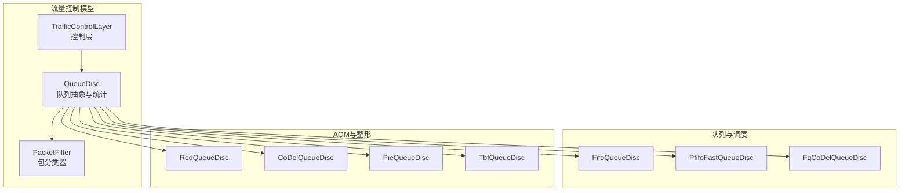
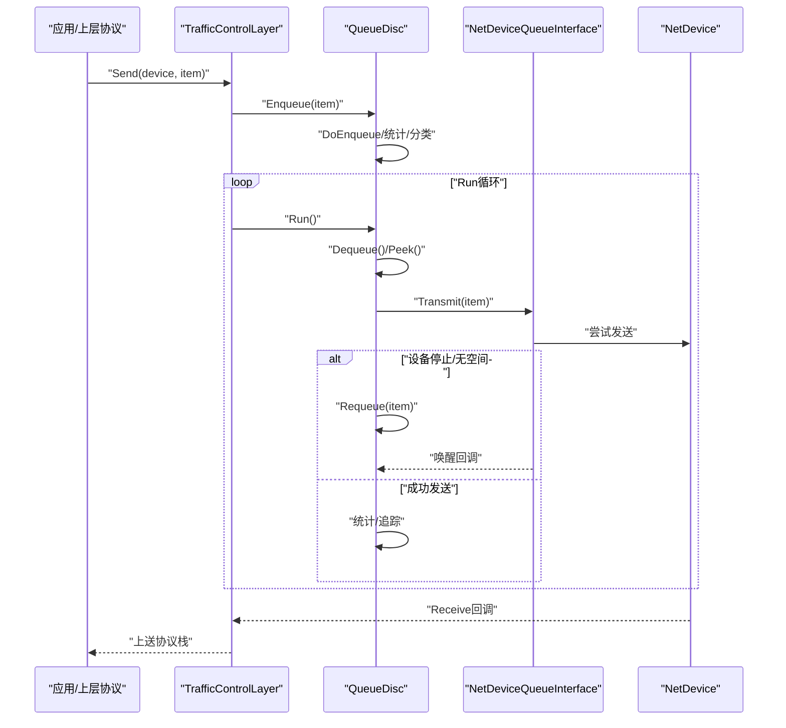
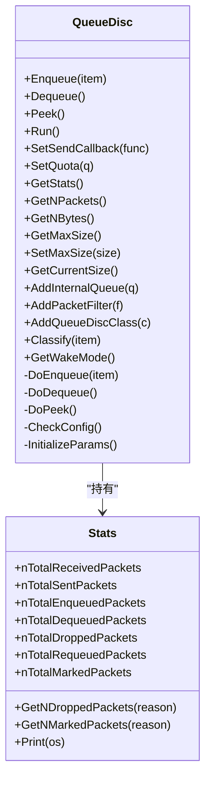
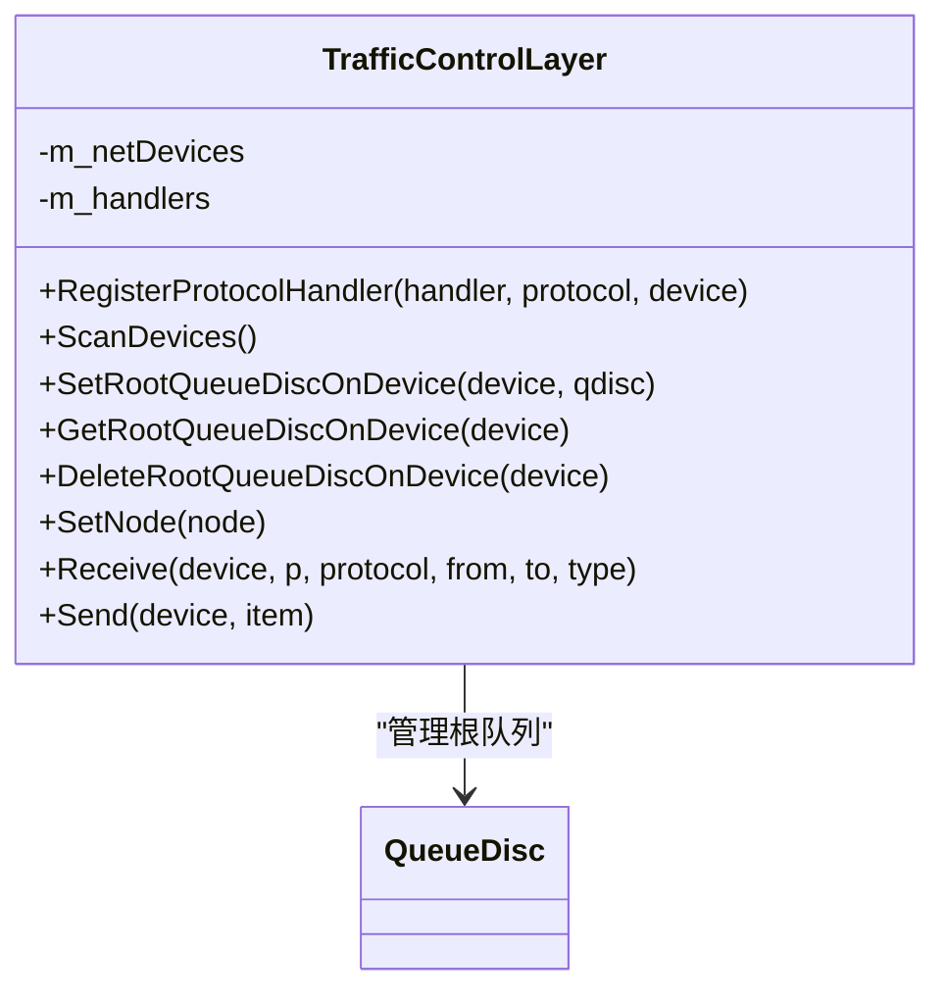
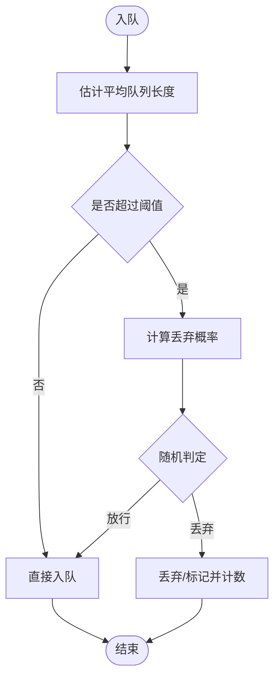
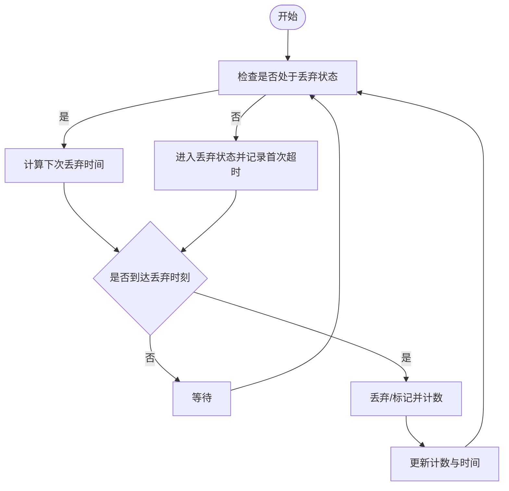
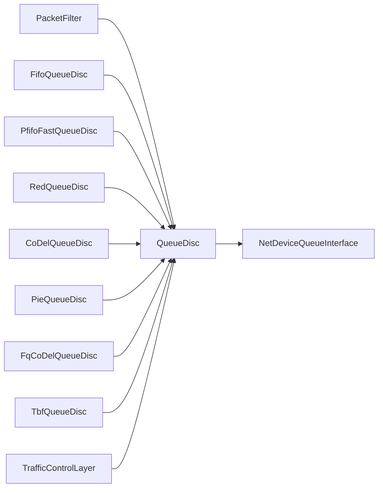

# 流量控制模块（Traffic Control）

<cite>
**本文引用的文件**
- [queue-disc.h](file://simulator/ns-3.39/src/traffic-control/model/queue-disc.h)
- [traffic-control-layer.h](file://simulator/ns-3.39/src/traffic-control/model/traffic-control-layer.h)
- [packet-filter.h](file://simulator/ns-3.39/src/traffic-control/model/packet-filter.h)
- [fifo-queue-disc.h](file://simulator/ns-3.39/src/traffic-control/model/fifo-queue-disc.h)
- [pfifo-fast-queue-disc.h](file://simulator/ns-3.39/src/traffic-control/model/pfifo-fast-queue-disc.h)
- [red-queue-disc.h](file://simulator/ns-3.39/src/traffic-control/model/red-queue-disc.h)
- [codel-queue-disc.h](file://simulator/ns-3.39/src/traffic-control/model/codel-queue-disc.h)
- [pie-queue-disc.h](file://simulator/ns-3.39/src/traffic-control/model/pie-queue-disc.h)
- [fq-codel-queue-disc.h](file://simulator/ns-3.39/src/traffic-control/model/fq-codel-queue-disc.h)
- [tbf-queue-disc.h](file://simulator/ns-3.39/src/traffic-control/model/tbf-queue-disc.h)
- [traffic-control.cc](file://simulator/ns-3.39/examples/traffic-control/traffic-control.cc)
- [queue-discs-benchmark.cc](file://simulator/ns-3.39/examples/traffic-control/queue-discs-benchmark.cc)
</cite>

## 目录
1. [简介](#简介)
2. [项目结构](#项目结构)
3. [核心组件](#核心组件)
4. [架构总览](#架构总览)
5. [详细组件分析](#详细组件分析)
6. [依赖关系分析](#依赖关系分析)
7. [性能考量](#性能考量)
8. [故障排查指南](#故障排查指南)
9. [结论](#结论)
10. [附录：API参考与示例路径](#附录api参考与示例路径)

## 简介
本文件系统化梳理NS-3流量控制模块的API与实现，覆盖队列管理、拥塞控制、流量调度与丢包检测等核心能力，并重点解析FIFO、RED、CoDel、PIE、Fq-CoDel、TBF等队列调度与AQM算法。文档同时给出数据中心网络与RDMA场景下的配置建议、与网络层的集成方式以及性能优化策略，帮助读者在大规模数据中心网络中实现流量工程与QoS保障。

## 项目结构
流量控制模块位于traffic-control子目录下，核心由以下层次构成：
- 基础设施层：队列抽象与统计追踪（QueueDisc、Stats）
- 分类与调度层：包分类器（PacketFilter）、优先级/多队列调度（PfifoFast、Fq-CoDel）
- 拥塞管理层：主动队列管理（RED、CoDel、PIE）与令牌桶整形（TBF）
- 控制层：TrafficControlLayer作为上层协议与设备之间的适配器

图表来源
- [queue-disc.h:183-748](file://simulator/ns-3.39/src/traffic-control/model/queue-disc.h#L183-L748)
- [traffic-control-layer.h:92-263](file://simulator/ns-3.39/src/traffic-control/model/traffic-control-layer.h#L92-L263)
- [packet-filter.h:34-80](file://simulator/ns-3.39/src/traffic-control/model/packet-filter.h#L34-L80)
- [fifo-queue-disc.h:34-61](file://simulator/ns-3.39/src/traffic-control/model/fifo-queue-disc.h#L34-L61)
- [pfifo-fast-queue-disc.h:49-82](file://simulator/ns-3.39/src/traffic-control/model/pfifo-fast-queue-disc.h#L49-L82)
- [fq-codel-queue-disc.h:113-190](file://simulator/ns-3.39/src/traffic-control/model/fq-codel-queue-disc.h#L113-L190)
- [red-queue-disc.h:79-315](file://simulator/ns-3.39/src/traffic-control/model/red-queue-disc.h#L79-L315)
- [codel-queue-disc.h:61-220](file://simulator/ns-3.39/src/traffic-control/model/codel-queue-disc.h#L61-L220)
- [pie-queue-disc.h:53-180](file://simulator/ns-3.39/src/traffic-control/model/pie-queue-disc.h#L53-L180)
- [tbf-queue-disc.h:48-164](file://simulator/ns-3.39/src/traffic-control/model/tbf-queue-disc.h#L48-L164)

章节来源
- [queue-disc.h:183-748](file://simulator/ns-3.39/src/traffic-control/model/queue-disc.h#L183-L748)
- [traffic-control-layer.h:92-263](file://simulator/ns-3.39/src/traffic-control/model/traffic-control-layer.h#L92-L263)

## 核心组件
- 队列抽象与运行时控制：QueueDisc定义了统一的入队/出队/窥视接口、统计收集、运行配额、唤醒模式、丢弃/标记回调等；派生类仅需实现DoEnqueue/DoDequeue/DoPeek/CheckConfig/InitializeParams。
- 控制层：TrafficControlLayer连接上层协议与设备，负责注册协议处理器、扫描设备、设置根队列、接收/发送数据包。
- 包分类器：PacketFilter用于将不同协议或五元组的流量映射到对应队列或类。
- 典型队列与算法：FIFO、PfifoFast（优先级三队列）、RED（自适应/非线性）、CoDel（目标延迟控制）、PIE（概率自适应）、Fq-CoDel（按流哈希分片+CoDel）、TBF（令牌桶整形）。

章节来源
- [queue-disc.h:183-748](file://simulator/ns-3.39/src/traffic-control/model/queue-disc.h#L183-L748)
- [traffic-control-layer.h:92-263](file://simulator/ns-3.39/src/traffic-control/model/traffic-control-layer.h#L92-L263)
- [packet-filter.h:34-80](file://simulator/ns-3.39/src/traffic-control/model/packet-filter.h#L34-L80)

## 架构总览
流量控制在NS-3中的工作流如下：上层协议（如IP）通过TrafficControlLayer的Send方法提交待发包；TrafficControlLayer根据设备查找其根队列（QueueDisc），调用Enqueue进行队列处理；随后通过Run驱动多次Dequeue，结合设备传输队列状态决定是否直接发送或重入队列；接收方向通过回调链路将包上送至相应上层协议。

图表来源
- [traffic-control-layer.h:194-206](file://simulator/ns-3.39/src/traffic-control/model/traffic-control-layer.h#L194-L206)
- [queue-disc.h:425-676](file://simulator/ns-3.39/src/traffic-control/model/queue-disc.h#L425-L676)

## 详细组件分析

### 队列抽象与统计（QueueDisc）
- 统一接口：Enqueue/Dequeue/Peek、Run、SetSendCallback、SetQuota、GetStats。
- 统计结构：Stats包含收发、入队/出队、丢弃（前/后）、重入队、标记等计数与字节量，并支持按原因聚合。
- 运行机制：RunBegin/RunEnd/Restart/DequeuePacket/Requeue/Transmit，模拟Linux qdisc行为。
- 规模策略：QueueDiscSizePolicy支持单内部队列、单子队列、多队列/多类、无限制等策略，配合MaxSize与当前尺寸查询。
- 回调与追踪：入队/出队/重入队/丢弃/标记等TracedCallback，SojournTime用于端到端驻留时间统计。

图表来源
- [queue-disc.h:183-748](file://simulator/ns-3.39/src/traffic-control/model/queue-disc.h#L183-L748)

章节来源
- [queue-disc.h:183-748](file://simulator/ns-3.39/src/traffic-control/model/queue-disc.h#L183-L748)

### 控制层（TrafficControlLayer）
- 职责：注册/分发上层协议回调、扫描节点设备、设置根队列、接收/发送数据包。
- 设备信息：为每个安装队列的设备维护根队列、NetDeviceQueueInterface与唤醒队列列表。
- IN方向：通过RegisterProtocolHandler注册回调，Receive时根据设备与协议号分发至上层。
- OUT方向：Send调用对应设备根队列的Enqueue，再由Run驱动Dequeue与发送。

图表来源
- [traffic-control-layer.h:92-263](file://simulator/ns-3.39/src/traffic-control/model/traffic-control-layer.h#L92-L263)

章节来源
- [traffic-control-layer.h:92-263](file://simulator/ns-3.39/src/traffic-control/model/traffic-control-layer.h#L92-L263)

### 包分类器（PacketFilter）
- 抽象接口：Classify根据协议与过滤条件返回类索引或未匹配。
- 协议检查：DoClassify与CheckProtocol区分协议类型与匹配条件。
- 作用：为QueueDisc提供分类入口，确保每条流进入正确队列或类。

章节来源
- [packet-filter.h:34-80](file://simulator/ns-3.39/src/traffic-control/model/packet-filter.h#L34-L80)

### FIFO队列（FifoQueueDisc）
- 行为：严格FIFO，容量受MaxSize限制，超限丢弃。
- 适用：简单场景或作为子队列使用。

章节来源
- [fifo-queue-disc.h:34-61](file://simulator/ns-3.39/src/traffic-control/model/fifo-queue-disc.h#L34-L61)

### 优先级队列（PfifoFastQueueDisc）
- 行为：基于优先级的三队列调度（映射表固定），高优先级先出队。
- 容量：默认每带宽1000包，可替换内部队列但必须满足约束。

章节来源
- [pfifo-fast-queue-disc.h:49-82](file://simulator/ns-3.39/src/traffic-control/model/pfifo-fast-queue-disc.h#L49-L82)

### RED队列（RedQueueDisc）
- 特性：基于平均队列长度的随机早期检测，支持自适应RED（ARED）、Feng自适应RED、非线性RED、ECN标记、强制丢弃阈值。
- 关键参数：最小/最大阈值、队列权重、目标延迟、更新间隔、上下界与增减系数、RTT、带宽/延迟、等待/温和模式等。
- 机制：估计器计算平均队列长度，动态调整最大丢弃概率，按概率早-drop/早-mark，超过上限强制drop。

图表来源
- [red-queue-disc.h:209-314](file://simulator/ns-3.39/src/traffic-control/model/red-queue-disc.h#L209-L314)

章节来源
- [red-queue-disc.h:79-315](file://simulator/ns-3.39/src/traffic-control/model/red-queue-disc.h#L79-L315)

### CoDel队列（CoDelQueueDisc）
- 目标：维持队列延迟不超过目标值，采用滑动最小值窗口与控制律确定丢弃时机。
- 关键参数：target、interval、CE阈值、最小丢弃字节数、ECN/L4S支持。
- 算法要点：Newton迭代求平方根倒数近似，避免开方与除法；控制律t + interval/sqrt(count)；OkToDrop判断驻留时间是否持续高于目标。

图表来源
- [codel-queue-disc.h:120-220](file://simulator/ns-3.39/src/traffic-control/model/codel-queue-disc.h#L120-L220)

章节来源
- [codel-queue-disc.h:61-220](file://simulator/ns-3.39/src/traffic-control/model/codel-queue-disc.h#L61-L220)

### PIE队列（PieQueueDisc）
- 目标：基于延迟趋势与突发状态的概率自适应丢弃，支持ECN、L4S、Cap Drop Adjust、Derandomization等RFC 8033特性。
- 关键参数：期望队列延迟、更新周期、均值包长、最大突发、控制器参数a/b、去队率估计开关、激活阈值、CE阈值等。
- 状态：无突发/突发/保护突发，周期性更新丢弃概率以跟踪延迟趋势。

章节来源
- [pie-queue-disc.h:53-180](file://simulator/ns-3.39/src/traffic-control/model/pie-queue-disc.h#L53-L180)

### Fq-CoDel队列（FqCoDelQueueDisc）
- 结构：按流哈希分片为多个子队列（类），每个子队列内执行CoDel策略；支持集合相联哈希、量子轮转、批量丢弃等。
- 参数：quantum、flows、setWays、dropBatchSize、perturbation、CE阈值、L4S支持等。
- 优势：抑制长流拥塞，提升公平性与低延迟。

章节来源
- [fq-codel-queue-disc.h:113-190](file://simulator/ns-3.39/src/traffic-control/model/fq-codel-queue-disc.h#L113-L190)

### 令牌桶整形（TbfQueueDisc）
- 功能：两级令牌桶整形，支持峰值速率与突发，具备事件驱动的唤醒机制。
- 参数：burst、mtu、rate、peakRate；变量：第一/二桶令牌数、时间检查点、唤醒事件。

章节来源
- [tbf-queue-disc.h:48-164](file://simulator/ns-3.39/src/traffic-control/model/tbf-queue-disc.h#L48-L164)

## 依赖关系分析
- 组件耦合：QueueDisc为所有具体队列/算法的基类，TrafficControlLayer依赖QueueDisc与NetDeviceQueueInterface；PacketFilter独立于具体队列，仅提供分类接口。
- 外部依赖：与NetDevice、QueueItem、QueueSize、TracedCallback等NS-3基础设施紧密耦合。
- 可能的环依赖：模块间通过指针与回调解耦，未见直接循环包含。

图表来源
- [queue-disc.h:183-748](file://simulator/ns-3.39/src/traffic-control/model/queue-disc.h#L183-L748)
- [traffic-control-layer.h:92-263](file://simulator/ns-3.39/src/traffic-control/model/traffic-control-layer.h#L92-L263)
- [packet-filter.h:34-80](file://simulator/ns-3.39/src/traffic-control/model/packet-filter.h#L34-L80)

## 性能考量
- 小设备队列：减少设备层排队导致的bufferbloat，将排队移至TC层以便AQM管理。
- 合理配额：Run的quota影响吞吐与延迟权衡，默认64；可根据链路特征调整。
- 队列规模策略：多队列/多类场景下，合理设置MaxSize与内部队列容量，避免“队列溢出但未达上限”的误判。
- AQM选择：短RTT/低延迟场景倾向CoDel/PIE/Fq-CoDel；高负载/长肥管道可考虑RED（自适应/非线性）。
- ECN/L4S：启用ECN可降低尾部丢弃，提升吞吐稳定性；L4S在CE阈值处标记ECT1。
- BQL：瓶颈设备启用Byte Queue Limits可进一步抑制缓冲膨胀。

## 故障排查指南
- 丢弃原因定位：通过QueueDisc::Stats按原因聚合统计（丢弃前/后、标记原因），结合Trace回调定位丢弃位置。
- 设备队列与TC队列对比：通过示例脚本对设备队列与TC队列长度进行对比，确认是否出现bufferbloat。
- 参数校验：CheckConfig失败通常源于内部队列/子队列/过滤器配置不一致，应检查添加顺序与数量。
- 唤醒问题：若设备停止后未被唤醒，检查WakeMode与NetDeviceQueueInterface回调设置。

章节来源
- [queue-disc.h:548-748](file://simulator/ns-3.39/src/traffic-control/model/queue-disc.h#L548-L748)
- [traffic-control.cc:137-150](file://simulator/ns-3.39/examples/traffic-control/traffic-control.cc#L137-L150)

## 结论
NS-3流量控制模块提供了从基础队列抽象到多种AQM/整形算法的完整实现，能够满足数据中心网络的低延迟、高公平性与QoS需求。通过TrafficControlLayer与QueueDisc的清晰分层，用户可在瓶颈链路部署合适的AQM（如CoDel/PIE/Fq-CoDel），在接入链路使用PfifoFast等优先级调度，并结合ECN/L4S与BQL策略，实现稳健的流量工程与拥塞控制。

## 附录：API参考与示例路径
- 基础API
  - 队列抽象与统计：[QueueDisc:183-748](file://simulator/ns-3.39/src/traffic-control/model/queue-disc.h#L183-L748)
  - 控制层接口：[TrafficControlLayer:92-263](file://simulator/ns-3.39/src/traffic-control/model/traffic-control-layer.h#L92-L263)
  - 包分类器：[PacketFilter:34-80](file://simulator/ns-3.39/src/traffic-control/model/packet-filter.h#L34-L80)
- 队列与算法
  - FIFO：[FifoQueueDisc:34-61](file://simulator/ns-3.39/src/traffic-control/model/fifo-queue-disc.h#L34-L61)
  - 优先级：[PfifoFastQueueDisc:49-82](file://simulator/ns-3.39/src/traffic-control/model/pfifo-fast-queue-disc.h#L49-L82)
  - RED：[RedQueueDisc:79-315](file://simulator/ns-3.39/src/traffic-control/model/red-queue-disc.h#L79-L315)
  - CoDel：[CoDelQueueDisc:61-220](file://simulator/ns-3.39/src/traffic-control/model/codel-queue-disc.h#L61-L220)
  - PIE：[PieQueueDisc:53-180](file://simulator/ns-3.39/src/traffic-control/model/pie-queue-disc.h#L53-L180)
  - Fq-CoDel：[FqCoDelQueueDisc:113-190](file://simulator/ns-3.39/src/traffic-control/model/fq-codel-queue-disc.h#L113-L190)
  - TBF：[TbfQueueDisc:48-164](file://simulator/ns-3.39/src/traffic-control/model/tbf-queue-disc.h#L48-L164)
- 示例与基准
  - 基本安装与追踪：[traffic-control.cc:137-150](file://simulator/ns-3.39/examples/traffic-control/traffic-control.cc#L137-L150)
  - 多队列算法对比与BQL：[queue-discs-benchmark.cc:190-243](file://simulator/ns-3.39/examples/traffic-control/queue-discs-benchmark.cc#L190-L243)