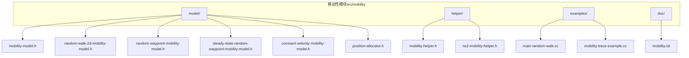
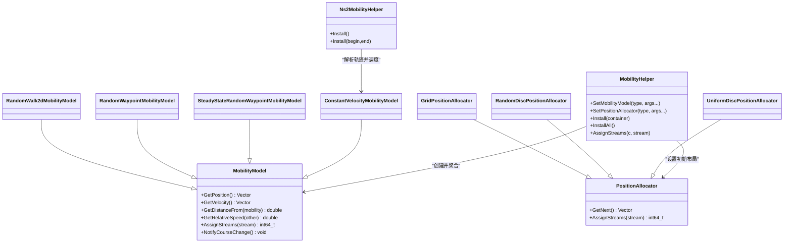
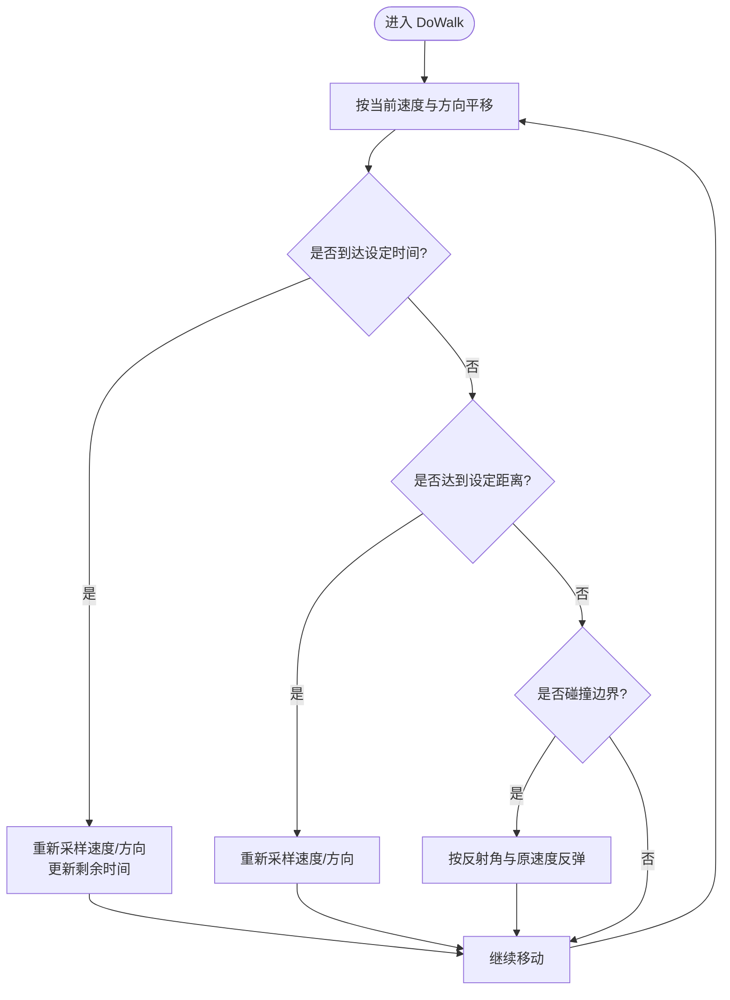
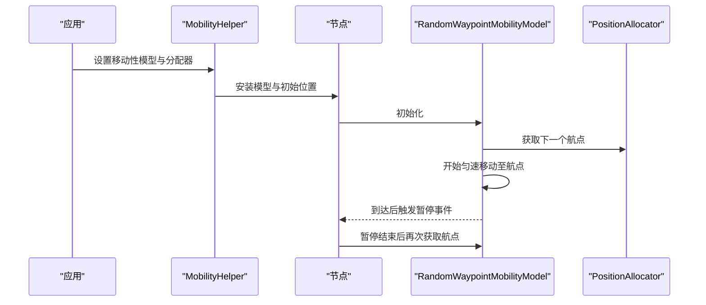
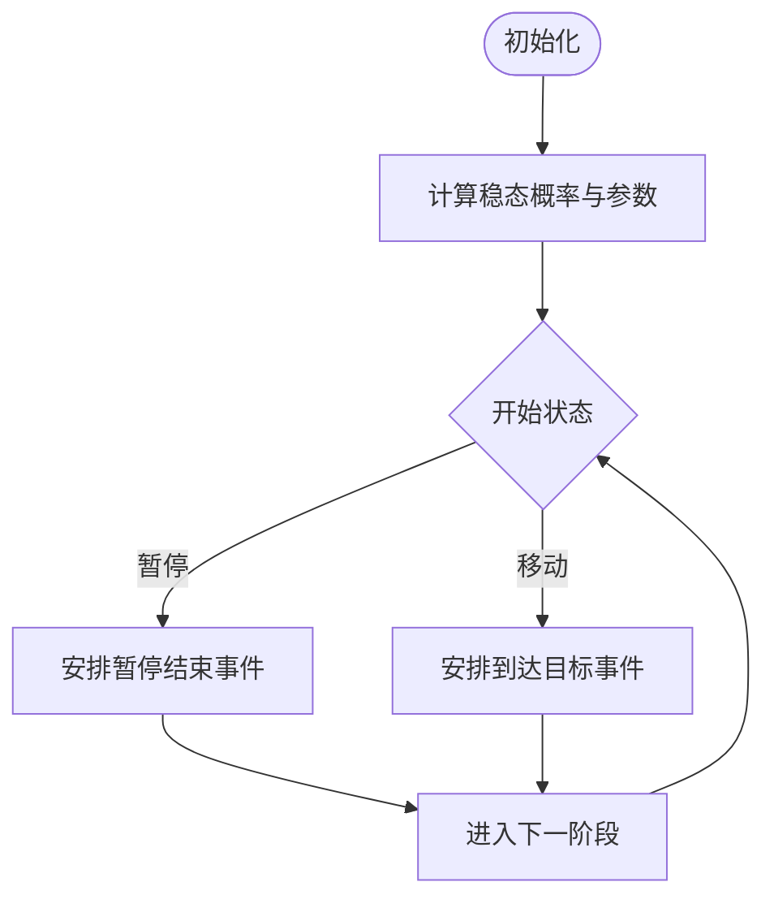
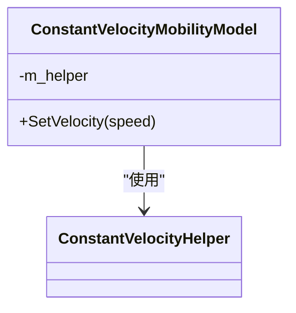
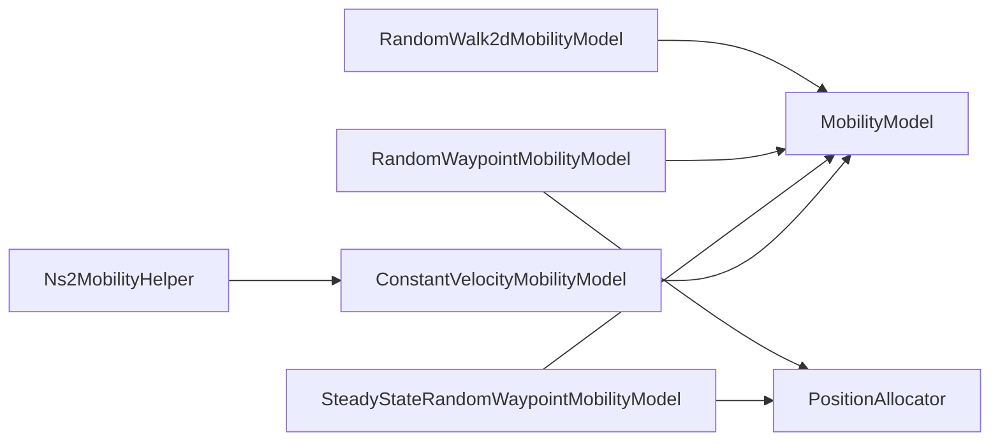

# 移动性模块（Mobility）

<cite>
**本文引用的文件**
- [mobility-model.h](file://simulator/ns-3.39/src/mobility/model/mobility-model.h)
- [random-walk-2d-mobility-model.h](file://simulator/ns-3.39/src/mobility/model/random-walk-2d-mobility-model.h)
- [random-waypoint-mobility-model.h](file://simulator/ns-3.39/src/mobility/model/random-waypoint-mobility-model.h)
- [steady-state-random-waypoint-mobility-model.h](file://simulator/ns-3.39/src/mobility/model/steady-state-random-waypoint-mobility-model.h)
- [constant-velocity-mobility-model.h](file://simulator/ns-3.39/src/mobility/model/constant-velocity-mobility-model.h)
- [position-allocator.h](file://simulator/ns-3.39/src/mobility/model/position-allocator.h)
- [mobility-helper.h](file://simulator/ns-3.39/src/mobility/helper/mobility-helper.h)
- [ns2-mobility-helper.h](file://simulator/ns-3.39/src/mobility/helper/ns2-mobility-helper.h)
- [main-random-walk.cc](file://simulator/ns-3.39/src/mobility/examples/main-random-walk.cc)
- [mobility-trace-example.cc](file://simulator/ns-3.39/src/mobility/examples/mobility-trace-example.cc)
- [mobility.rst](file://simulator/ns-3.39/src/mobility/doc/mobility.rst)
</cite>

## 目录
1. [简介](#简介)
2. [项目结构](#项目结构)
3. [核心组件](#核心组件)
4. [架构总览](#架构总览)
5. [详细组件分析](#详细组件分析)
6. [依赖关系分析](#依赖关系分析)
7. [性能考量](#性能考量)
8. [故障排查指南](#故障排查指南)
9. [结论](#结论)
10. [附录](#附录)

## 简介
本文件为 NS-3 移动性模块的完整 API 文档，覆盖移动性模型、位置管理、轨迹生成、速度控制、边界处理、轨迹文件导入、与无线传播模型的集成以及大规模移动网络仿真的优化策略。内容基于仓库中的源码头文件、示例程序与官方文档，面向不同层次读者提供从入门到进阶的系统化说明。

## 项目结构
移动性模块位于 ns-3 源码树的 src/mobility 目录下，主要由以下子目录构成：
- model：移动性模型与位置分配器的实现头文件
- helper：辅助工具，用于批量安装移动性模型与解析轨迹文件
- examples：使用示例，展示常见用法
- doc：官方文档，包含设计说明与使用指导

图表来源
- [mobility-model.h:1-157](file://simulator/ns-3.39/src/mobility/model/mobility-model.h#L1-L157)
- [random-walk-2d-mobility-model.h:1-98](file://simulator/ns-3.39/src/mobility/model/random-walk-2d-mobility-model.h#L1-L98)
- [random-waypoint-mobility-model.h:1-89](file://simulator/ns-3.39/src/mobility/model/random-waypoint-mobility-model.h#L1-L89)
- [steady-state-random-waypoint-mobility-model.h:1-122](file://simulator/ns-3.39/src/mobility/model/steady-state-random-waypoint-mobility-model.h#L1-L122)
- [constant-velocity-mobility-model.h:1-71](file://simulator/ns-3.39/src/mobility/model/constant-velocity-mobility-model.h#L1-L71)
- [position-allocator.h:1-421](file://simulator/ns-3.39/src/mobility/model/position-allocator.h#L1-L421)
- [mobility-helper.h:1-268](file://simulator/ns-3.39/src/mobility/helper/mobility-helper.h#L1-L268)
- [ns2-mobility-helper.h:1-183](file://simulator/ns-3.39/src/mobility/helper/ns2-mobility-helper.h#L1-L183)
- [main-random-walk.cc:1-80](file://simulator/ns-3.39/src/mobility/examples/main-random-walk.cc#L1-L80)
- [mobility-trace-example.cc:1-70](file://simulator/ns-3.39/src/mobility/examples/mobility-trace-example.cc#L1-L70)
- [mobility.rst:1-469](file://simulator/ns-3.39/src/mobility/doc/mobility.rst#L1-L469)

章节来源
- [mobility.rst:23-47](file://simulator/ns-3.39/src/mobility/doc/mobility.rst#L23-L47)

## 核心组件
- 基类与接口
  - 基类：MobilityModel 提供位置、速度查询与课程变更通知机制，并定义纯虚函数接口供子类实现。
  - 关键能力：获取当前位置/速度、相对距离与相对速度、课程变更回调、随机流分配。
- 位置分配器 PositionAllocator 及其派生类
  - 支持列表、网格、矩形/盒内、圆盘（含均匀分布）等初始布局策略。
- 辅助器
  - MobilityHelper：统一设置移动性模型与初始位置分配器，批量安装到节点容器。
  - Ns2MobilityHelper：解析 ns-2 轨迹文件，转换为 NS-3 的常速移动事件。

章节来源
- [mobility-model.h:39-152](file://simulator/ns-3.39/src/mobility/model/mobility-model.h#L39-L152)
- [position-allocator.h:35-62](file://simulator/ns-3.39/src/mobility/model/position-allocator.h#L35-L62)
- [mobility-helper.h:43-243](file://simulator/ns-3.39/src/mobility/helper/mobility-helper.h#L43-L243)
- [ns2-mobility-helper.h:77-141](file://simulator/ns-3.39/src/mobility/helper/ns2-mobility-helper.h#L77-L141)

## 架构总览
移动性系统采用“模型-分配器-助手”的分层设计：
- 模型层：具体移动性模型（随机游走、随机路径、稳态随机路径、常速等）
- 分配层：位置分配器负责初始布局或作为模型的“航点”来源
- 助手层：封装对象工厂与属性设置，简化批量安装与轨迹导入

图表来源
- [mobility-model.h:39-152](file://simulator/ns-3.39/src/mobility/model/mobility-model.h#L39-L152)
- [random-walk-2d-mobility-model.h:46-93](file://simulator/ns-3.39/src/mobility/model/random-walk-2d-mobility-model.h#L46-L93)
- [random-waypoint-mobility-model.h:53-84](file://simulator/ns-3.39/src/mobility/model/random-waypoint-mobility-model.h#L53-L84)
- [steady-state-random-waypoint-mobility-model.h:56-117](file://simulator/ns-3.39/src/mobility/model/steady-state-random-waypoint-mobility-model.h#L56-L117)
- [constant-velocity-mobility-model.h:38-66](file://simulator/ns-3.39/src/mobility/model/constant-velocity-mobility-model.h#L38-L66)
- [position-allocator.h:35-421](file://simulator/ns-3.39/src/mobility/model/position-allocator.h#L35-L421)
- [mobility-helper.h:43-243](file://simulator/ns-3.39/src/mobility/helper/mobility-helper.h#L43-L243)
- [ns2-mobility-helper.h:77-141](file://simulator/ns-3.39/src/mobility/helper/ns2-mobility-helper.h#L77-L141)

## 详细组件分析

### 随机游走 2D（RandomWalk2dMobilityModel）
- 角色定位：二维布朗运动风格的随机游走，支持按时间或距离切换方向与速度，并在边界处进行反射。
- 关键属性与行为
  - 工作模式：按时间或按距离两种模式
  - 边界处理：在给定矩形区域内反弹
  - 速度/方向：通过随机变量采样
- 典型应用场景：室内随机移动、人员随机漫步仿真

图表来源
- [random-walk-2d-mobility-model.h:62-93](file://simulator/ns-3.39/src/mobility/model/random-walk-2d-mobility-model.h#L62-L93)

章节来源
- [random-walk-2d-mobility-model.h:34-93](file://simulator/ns-3.39/src/mobility/model/random-walk-2d-mobility-model.h#L34-L93)

### 随机路径（RandomWaypointMobilityModel）
- 角色定位：以常速向随机航点移动，到达后暂停一段时间再选择下一个航点；航点由 PositionAllocator 提供。
- 关键属性与行为
  - 速度/暂停：均来自随机变量
  - 航点来源：PositionAllocator（可为矩形/盒/圆盘等）
  - 无内置边界限制，受分配器约束
- 典型应用场景：车辆/无人机路径规划、区域巡逻

图表来源
- [random-waypoint-mobility-model.h:53-84](file://simulator/ns-3.39/src/mobility/model/random-waypoint-mobility-model.h#L53-L84)
- [position-allocator.h:226-299](file://simulator/ns-3.39/src/mobility/model/position-allocator.h#L226-L299)
- [mobility-helper.h:144-174](file://simulator/ns-3.39/src/mobility/helper/mobility-helper.h#L144-L174)

章节来源
- [random-waypoint-mobility-model.h:32-84](file://simulator/ns-3.39/src/mobility/model/random-waypoint-mobility-model.h#L32-L84)
- [position-allocator.h:226-299](file://simulator/ns-3.39/src/mobility/model/position-allocator.h#L226-L299)

### 稳态随机路径（SteadyStateRandomWaypointMobilityModel）
- 角色定位：在参数满足特定稳态分布时，从稳态分布初始化状态，减少瞬态影响。
- 关键属性与行为
  - 速度/暂停/位置：参数来自均匀分布，初始状态按稳态分布生成
  - 仅二维实现，Z 平面固定
- 典型应用场景：需要统计稳态指标的仿真（如平均连接时间、吞吐量）

图表来源
- [steady-state-random-waypoint-mobility-model.h:56-117](file://simulator/ns-3.39/src/mobility/model/steady-state-random-waypoint-mobility-model.h#L56-L117)

章节来源
- [steady-state-random-waypoint-mobility-model.h:32-117](file://simulator/ns-3.39/src/mobility/model/steady-state-random-waypoint-mobility-model.h#L32-L117)

### 常速移动（ConstantVelocityMobilityModel）
- 角色定位：保持恒定速度直至显式修改；通常作为轨迹导入的底层执行模型。
- 关键属性与行为
  - 通过 SetVelocity 显式设置速度
  - 位置随时间线性演进
- 典型应用场景：轨迹导入、手动控制移动节点

图表来源
- [constant-velocity-mobility-model.h:38-66](file://simulator/ns-3.39/src/mobility/model/constant-velocity-mobility-model.h#L38-L66)

章节来源
- [constant-velocity-mobility-model.h:32-66](file://simulator/ns-3.39/src/mobility/model/constant-velocity-mobility-model.h#L32-L66)

### 位置分配器（PositionAllocator）
- 角色定位：负责初始位置布局或为移动模型提供航点来源。
- 主要类型
  - ListPositionAllocator：从列表或文件读取位置
  - GridPositionAllocator：规则网格布局
  - RandomRectanglePositionAllocator / RandomBoxPositionAllocator：矩形/盒内随机
  - RandomDiscPositionAllocator / UniformDiscPositionAllocator：圆盘内随机（含均匀分布版本）
- 典型应用场景：大规模部署、热点区域建模

章节来源
- [position-allocator.h:35-421](file://simulator/ns-3.39/src/mobility/model/position-allocator.h#L35-L421)

### 辅助器（MobilityHelper 与 Ns2MobilityHelper）
- MobilityHelper
  - 统一设置移动性模型与位置分配器
  - 批量安装到 NodeContainer 或全部节点
  - 支持课程变更 ASCII 输出与随机流分配
- Ns2MobilityHelper
  - 解析 ns-2 轨迹文件，生成 NS-3 的常速移动事件
  - 支持全局 NodeList 或自定义对象序列安装

章节来源
- [mobility-helper.h:43-243](file://simulator/ns-3.39/src/mobility/helper/mobility-helper.h#L43-L243)
- [ns2-mobility-helper.h:77-141](file://simulator/ns-3.39/src/mobility/helper/ns2-mobility-helper.h#L77-L141)

## 依赖关系分析
- 组件耦合
  - 移动性模型依赖于基类接口与常速辅助器（部分模型）
  - RandomWaypoint 与稳态随机路径依赖 PositionAllocator 提供航点
  - Ns2MobilityHelper 依赖 ConstantVelocityMobilityModel 执行轨迹
- 外部依赖
  - 随机变量流（RandomVariableStream）用于速度、方向、暂停、航点等
  - 时间事件（EventId）用于调度移动与暂停

图表来源
- [random-walk-2d-mobility-model.h:46-93](file://simulator/ns-3.39/src/mobility/model/random-walk-2d-mobility-model.h#L46-L93)
- [random-waypoint-mobility-model.h:53-84](file://simulator/ns-3.39/src/mobility/model/random-waypoint-mobility-model.h#L53-L84)
- [steady-state-random-waypoint-mobility-model.h:56-117](file://simulator/ns-3.39/src/mobility/model/steady-state-random-waypoint-mobility-model.h#L56-L117)
- [constant-velocity-mobility-model.h:38-66](file://simulator/ns-3.39/src/mobility/model/constant-velocity-mobility-model.h#L38-L66)
- [position-allocator.h:35-421](file://simulator/ns-3.39/src/mobility/model/position-allocator.h#L35-L421)
- [ns2-mobility-helper.h:77-141](file://simulator/ns-3.39/src/mobility/helper/ns2-mobility-helper.h#L77-L141)

章节来源
- [mobility-helper.h:144-174](file://simulator/ns-3.39/src/mobility/helper/mobility-helper.h#L144-L174)
- [mobility.rst:25-47](file://simulator/ns-3.39/src/mobility/doc/mobility.rst#L25-L47)

## 性能考量
- 随机流与可重复性
  - 使用 AssignStreams 固定随机种子，确保结果可复现
  - 在使用 PositionAllocator 时需在 Install 前调用 AssignStreams
- 事件调度与时间精度
  - 轨迹导入与路径切换涉及大量事件调度，建议合理设置仿真步长与事件合并策略
- 大规模场景优化
  - 合理选择分配器（如网格/列表）降低初始布局开销
  - 对频繁边界检测的模型（如随机游走），可考虑增大边界或减少边界反射频率
- 与传播模型的协同
  - 移动性变化直接影响链路状态与路径损耗，应结合合适的传播模型与信道更新频率

章节来源
- [mobility.rst:372-408](file://simulator/ns-3.39/src/mobility/doc/mobility.rst#L372-L408)
- [mobility-helper.h:206-223](file://simulator/ns-3.39/src/mobility/helper/mobility-helper.h#L206-L223)

## 故障排查指南
- 未产生课程变更输出
  - 确认已启用 ASCII 输出或注册课程变更回调
  - 示例参考：[mobility-trace-example.cc:61-62](file://simulator/ns-3.39/src/mobility/examples/mobility-trace-example.cc#L61-L62)
- 轨迹导入不生效
  - 检查节点数量与轨迹文件中节点数一致
  - 确认轨迹文件格式符合 ns-2 setdest/set 语法
  - 示例参考：[ns2-mobility-helper.h:43-76](file://simulator/ns-3.39/src/mobility/helper/ns2-mobility-helper.h#L43-L76)
- 随机性不可重现
  - 在 Install 之前调用 AssignStreams，或在安装后对节点容器调用 AssignStreams
  - 参考：[mobility.rst:384-408](file://simulator/ns-3.39/src/mobility/doc/mobility.rst#L384-L408)

章节来源
- [mobility-trace-example.cc:61-62](file://simulator/ns-3.39/src/mobility/examples/mobility-trace-example.cc#L61-L62)
- [ns2-mobility-helper.h:43-76](file://simulator/ns-3.39/src/mobility/helper/ns2-mobility-helper.h#L43-L76)
- [mobility.rst:384-408](file://simulator/ns-3.39/src/mobility/doc/mobility.rst#L384-L408)

## 结论
NS-3 移动性模块提供了从基础位置/速度管理到复杂轨迹导入的完整能力。通过清晰的基类接口、多样化的移动性模型与灵活的位置分配策略，用户可以快速搭建从简单随机游走到真实轨迹导入的大规模移动网络仿真。配合随机流管理与合理的事件调度，可在保证可重复性的同时获得良好的性能表现。

## 附录

### 常用 API 一览（按类别）
- 基类接口（MobilityModel）
  - 查询：GetPosition、GetVelocity、GetDistanceFrom、GetRelativeSpeed
  - 控制：SetPosition、AssignStreams
  - 通知：课程变更回调（TracedCallback）
- 位置分配器（PositionAllocator）
  - 查询：GetNext
  - 控制：AssignStreams
- 辅助器
  - 设置模型与分配器：SetMobilityModel、SetPositionAllocator
  - 批量安装：Install、InstallAll
  - 轨迹导入：Ns2MobilityHelper::Install
  - 输出与随机流：EnableAscii*、AssignStreams

章节来源
- [mobility-model.h:50-152](file://simulator/ns-3.39/src/mobility/model/mobility-model.h#L50-L152)
- [position-allocator.h:46-61](file://simulator/ns-3.39/src/mobility/model/position-allocator.h#L46-L61)
- [mobility-helper.h:63-243](file://simulator/ns-3.39/src/mobility/helper/mobility-helper.h#L63-L243)
- [ns2-mobility-helper.h:84-106](file://simulator/ns-3.39/src/mobility/helper/ns2-mobility-helper.h#L84-L106)

### 示例程序路径
- 随机游走示例：[main-random-walk.cc:41-71](file://simulator/ns-3.39/src/mobility/examples/main-random-walk.cc#L41-L71)
- 轨迹导出示例：[mobility-trace-example.cc:34-62](file://simulator/ns-3.39/src/mobility/examples/mobility-trace-example.cc#L34-L62)

章节来源
- [main-random-walk.cc:41-71](file://simulator/ns-3.39/src/mobility/examples/main-random-walk.cc#L41-L71)
- [mobility-trace-example.cc:34-62](file://simulator/ns-3.39/src/mobility/examples/mobility-trace-example.cc#L34-L62)