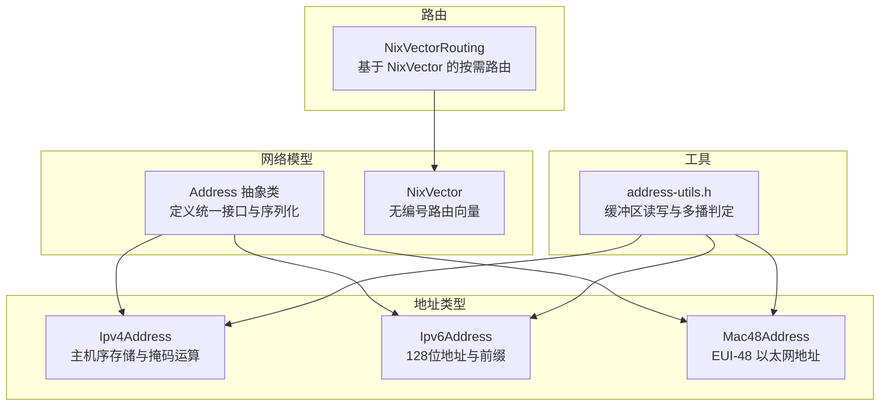
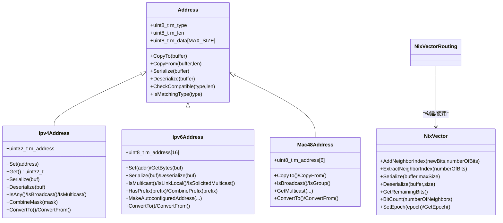
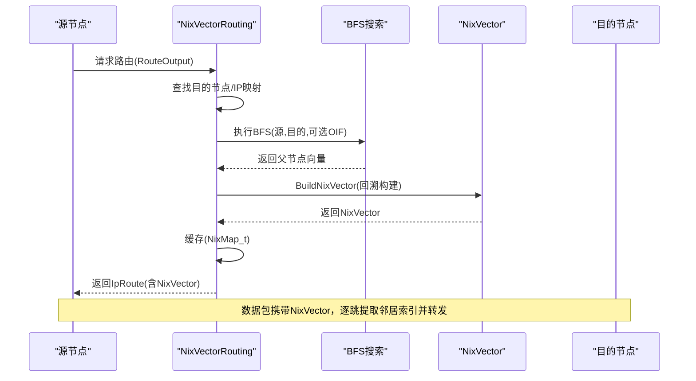
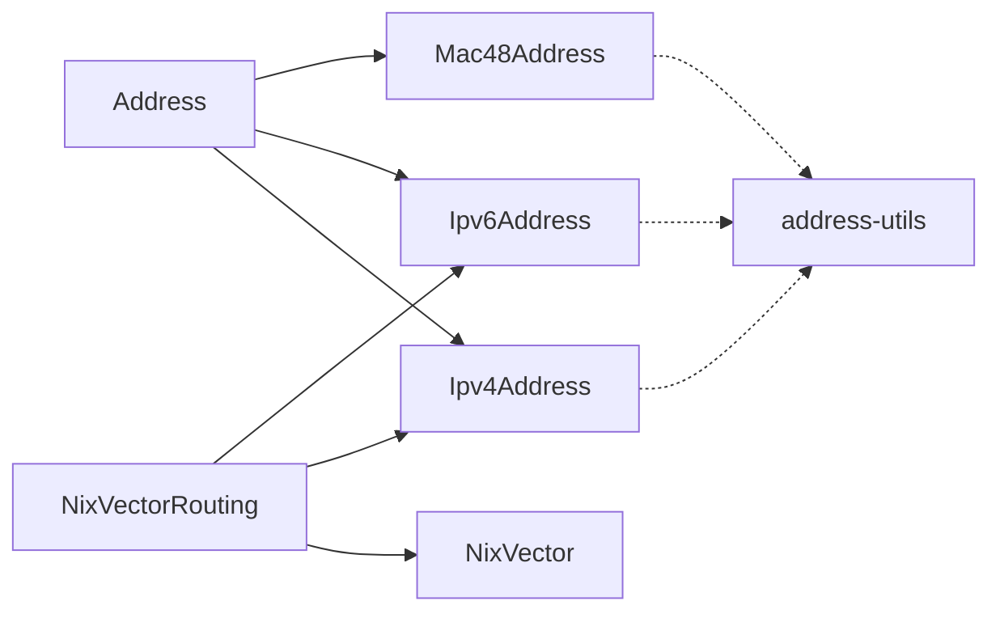

# 地址管理（Address Management）

<cite>
**本文引用的文件**
- [address.h](file://simulator/ns-3.39/src/network/model/address.h)
- [ipv4-address.h](file://simulator/ns-3.39/src/network/utils/ipv4-address.h)
- [ipv6-address.h](file://simulator/ns-3.39/src/network/utils/ipv6-address.h)
- [mac48-address.h](file://simulator/ns-3.39/src/network/utils/mac48-address.h)
- [address-utils.h](file://simulator/ns-3.39/src/network/utils/address-utils.h)
- [nix-vector.h](file://simulator/ns-3.39/src/network/model/nix-vector.h)
- [nix-vector-routing.h](file://simulator/ns-3.39/src/nix-vector-routing/model/nix-vector-routing.h)
</cite>

## 目录
1. [简介](#简介)
2. [项目结构](#项目结构)
3. [核心组件](#核心组件)
4. [架构总览](#架构总览)
5. [详细组件分析](#详细组件分析)
6. [依赖关系分析](#依赖关系分析)
7. [性能考量](#性能考量)
8. [故障排查指南](#故障排查指南)
9. [结论](#结论)
10. [附录：使用示例与最佳实践](#附录使用示例与最佳实践)

## 简介
本文件系统化梳理 NS-3 的地址管理体系，围绕 Address 抽象类及其派生类型（IPv4、IPv6、MAC 等）进行设计与实现解析，并深入阐述地址编码/解码、比较与转换机制；同时覆盖 NixVector 类的“无编号路由向量”实现与应用场景，以及地址在设备与节点之间的分配、冲突检测、路由表构建与网络寻址的关键流程。

## 项目结构
NS-3 将地址相关能力分布在以下模块：
- 抽象与通用：network/model/address.h
- 具体地址类型：network/utils 下的 ipv4-address.h、ipv6-address.h、mac48-address.h 等
- 地址工具：network/utils/address-utils.h（缓冲区读写、多协议族判断）
- 路由与向量：network/model/nix-vector.h 与 nix-vector-routing/model/nix-vector-routing.h

图表来源
- [address.h:99-283](file://simulator/ns-3.39/src/network/model/address.h#L99-L283)
- [ipv4-address.h:41-243](file://simulator/ns-3.39/src/network/utils/ipv4-address.h#L41-L243)
- [ipv6-address.h:48-445](file://simulator/ns-3.39/src/network/utils/ipv6-address.h#L48-L445)
- [mac48-address.h:45-217](file://simulator/ns-3.39/src/network/utils/mac48-address.h#L45-L217)
- [address-utils.h:34-126](file://simulator/ns-3.39/src/network/utils/address-utils.h#L34-L126)
- [nix-vector.h:63-205](file://simulator/ns-3.39/src/network/model/nix-vector.h#L63-L205)
- [nix-vector-routing.h:68-520](file://simulator/ns-3.39/src/nix-vector-routing/model/nix-vector-routing.h#L68-L520)

章节来源
- [address.h:99-283](file://simulator/ns-3.39/src/network/model/address.h#L99-L283)
- [ipv4-address.h:41-243](file://simulator/ns-3.39/src/network/utils/ipv4-address.h#L41-L243)
- [ipv6-address.h:48-445](file://simulator/ns-3.39/src/network/utils/ipv6-address.h#L48-L445)
- [mac48-address.h:45-217](file://simulator/ns-3.39/src/network/utils/mac48-address.h#L45-L217)
- [address-utils.h:34-126](file://simulator/ns-3.39/src/network/utils/address-utils.h#L34-L126)
- [nix-vector.h:63-205](file://simulator/ns-3.39/src/network/model/nix-vector.h#L63-L205)
- [nix-vector-routing.h:68-520](file://simulator/ns-3.39/src/nix-vector-routing/model/nix-vector-routing.h#L68-L520)

## 核心组件
- Address 抽象类：统一承载地址类型、长度与字节数据，提供序列化/反序列化、拷贝与类型兼容性检查。
- Ipv4Address：主机序 32 位地址，支持字符串解析、掩码组合、广播/组播/回环判定、序列化/反序列化。
- Ipv6Address：128 位地址，支持字符串解析、前缀匹配、自动配置地址生成（含 IPv4 映射）、多播/链路本地/文档地址等判定。
- Mac48Address：EUI-48 以太网地址，支持从/到 Address 的转换、组播地址生成、广播与组标志判断。
- NixVector：按需构建的“邻居索引向量”，以位打包方式高效携带下一跳邻居索引，支持序列化/反序列化与剩余位统计。
- NixVectorRouting：面向大规模拓扑的按需路由协议，结合 BFS 构建 NixVector 并缓存，支持 IPv4/IPv6。

章节来源
- [address.h:99-283](file://simulator/ns-3.39/src/network/model/address.h#L99-L283)
- [ipv4-address.h:41-243](file://simulator/ns-3.39/src/network/utils/ipv4-address.h#L41-L243)
- [ipv6-address.h:48-445](file://simulator/ns-3.39/src/network/utils/ipv6-address.h#L48-L445)
- [mac48-address.h:45-217](file://simulator/ns-3.39/src/network/utils/mac48-address.h#L45-L217)
- [nix-vector.h:63-205](file://simulator/ns-3.39/src/network/model/nix-vector.h#L63-L205)
- [nix-vector-routing.h:68-520](file://simulator/ns-3.39/src/nix-vector-routing/model/nix-vector-routing.h#L68-L520)

## 架构总览
Address 抽象层为上层协议栈提供统一的地址表示与传输格式；具体地址类型（IPv4/IPv6/MAC）通过 ConvertTo/ConvertFrom 与 Address 互转；NixVector 将路由路径压缩为可随包传输的位串，NixVectorRouting 在需要时构建并缓存，减少全局维护成本。

图表来源
- [address.h:99-283](file://simulator/ns-3.39/src/network/model/address.h#L99-L283)
- [ipv4-address.h:41-243](file://simulator/ns-3.39/src/network/utils/ipv4-address.h#L41-L243)
- [ipv6-address.h:48-445](file://simulator/ns-3.39/src/network/utils/ipv6-address.h#L48-L445)
- [mac48-address.h:45-217](file://simulator/ns-3.39/src/network/utils/mac48-address.h#L45-L217)
- [nix-vector.h:63-205](file://simulator/ns-3.39/src/network/model/nix-vector.h#L63-L205)
- [nix-vector-routing.h:68-520](file://simulator/ns-3.39/src/nix-vector-routing/model/nix-vector-routing.h#L68-L520)

## 详细组件分析

### Address 抽象类
- 设计要点
  - 统一的类型标识与长度字段，配合内部固定大小缓冲区，保证不同地址族的统一表示。
  - 提供 CopyTo/CopyFrom 与 CopyAllTo/CopyAllFrom，分别用于地址值与带类型/长度的完整序列化。
  - 支持 CheckCompatible 与 IsMatchingType，确保类型安全转换。
  - 序列化接口使用 TagBuffer，便于与 Packet/Queue 等底层缓冲区集成。
- 编码/解码与比较
  - 编码：CopyAllTo 将 type/len/data 写入连续缓冲区；Serialize 使用 TagBuffer 写入。
  - 解码：CopyAllFrom 与 Deserialize 从缓冲区恢复类型、长度与数据。
  - 比较：重载相等/不等/小于操作符，便于排序与哈希键使用。
- 适用场景
  - 作为上层协议（如 SocketAddress）的基类，屏蔽具体地址族差异。

章节来源
- [address.h:99-283](file://simulator/ns-3.39/src/network/model/address.h#L99-L283)

### Ipv4Address 与掩码
- 存储与格式
  - 主机序 32 位整数存储，便于快速算术与掩码运算。
  - 支持字符串解析（点分十进制）、序列化/反序列化（网络序）。
- 功能特性
  - 常用地址判定：Any/Broadcast/Loopback/LocalMulticast。
  - 掩码运算：CombineMask 生成网络地址；GetSubnetDirectedBroadcast 计算子网广播；IsSubnetDirectedBroadcast 验证。
  - 类型转换：ConvertTo/ConvertFrom 与 Address 互转。
- 复杂度与性能
  - 单次比较/掩码运算 O(1)，掩码匹配 O(1)。

章节来源
- [ipv4-address.h:41-243](file://simulator/ns-3.39/src/network/utils/ipv4-address.h#L41-L243)

### Ipv6Address 与前缀
- 存储与格式
  - 16 字节数组存储，支持字符串解析（冒号十六进制），序列化/反序列化。
- 功能特性
  - 多播/链路本地/文档/回送等地址判定。
  - 前缀匹配：HasPrefix/CombinePrefix；前缀类 Ipv6Prefix 提供长度与最小前缀长度计算。
  - 自动配置：支持从 MAC 地址生成链路本地或全局单播地址（含 RFC 2464/EUI-64 变体）。
  - IPv4 映射：MakeIpv4MappedAddress/GetIpv4MappedAddress。
- 复杂度与性能
  - 地址比较/掩码匹配 O(16)（常数时间），但通常视为 O(1)。

章节来源
- [ipv6-address.h:48-445](file://simulator/ns-3.39/src/network/utils/ipv6-address.h#L48-L445)

### Mac48Address
- 存储与格式
  - 6 字节网络序存储，支持十六进制字符串输入输出。
- 功能特性
  - 组播地址生成：GetMulticast(Ipv4Address)/GetMulticast(Ipv6Address)。
  - 广播与组标志：IsBroadcast/IsGroup。
  - 分配与重置：Allocate/ResetAllocationIndex，用于自动化测试与仿真场景。
  - 与 Address 转换：ConvertTo/ConvertFrom。
- 复杂度与性能
  - 比较/拷贝 O(6)（常数时间）。

章节来源
- [mac48-address.h:45-217](file://simulator/ns-3.39/src/network/utils/mac48-address.h#L45-L217)

### NixVector（无编号路由向量）
- 设计目标
  - 将路由路径压缩为位串，每段携带一个“邻居索引”，随包传输并在每个节点按位提取，避免维护全局路由表。
- 关键接口
  - AddNeighborIndex/ExtractNeighborIndex：按位打包/提取，每次最多 32 位。
  - Serialize/Deserialize：原始缓冲区序列化/反序列化。
  - BitCount：根据邻居总数计算所需位宽。
  - GetRemainingBits/SetEpoch/GetEpoch：跟踪剩余位与向量生命周期。
- 数据结构与复杂度
  - 内部使用 vector<uint32_t> 存储位块，按需增长；位操作实现紧凑存储。
  - 每次提取/添加为 O(1)（单块操作）。
- 适用场景
  - 大规模拓扑、动态链路变化频繁的场景，降低全局状态维护开销。

章节来源
- [nix-vector.h:63-205](file://simulator/ns-3.39/src/network/model/nix-vector.h#L63-L205)

### NixVectorRouting（按需路由协议）
- 工作流程
  - 当需要转发时，根据源节点、目的地址与可选出站接口，执行：
    - 查找目的节点（IP 到 Node 映射，加速查找）。
    - 对全网执行 BFS，记录父节点以便回溯路径。
    - 递归回溯构建 NixVector（每段对应一个邻居索引）。
    - 缓存结果（按目的地址），支持周期性刷新。
- 关键方法
  - GetNixVector/GetNixVectorInCache：按需构建/缓存查询。
  - BFS/BuildNixVector：广度优先搜索与路径回溯。
  - FlushGlobalNixRoutingCache/CheckCacheStateAndFlush：拓扑变化时清理缓存。
  - RouteOutput/RouteInput：与 L3 协议交互，处理单播/多播/本地投递。
- 性能与扩展
  - 通过缓存与映射表减少重复计算；支持 IPv4/IPv6 双栈模板特化。

图表来源
- [nix-vector-routing.h:175-272](file://simulator/ns-3.39/src/nix-vector-routing/model/nix-vector-routing.h#L175-L272)
- [nix-vector.h:96-151](file://simulator/ns-3.39/src/network/model/nix-vector.h#L96-L151)

章节来源
- [nix-vector-routing.h:145-520](file://simulator/ns-3.39/src/nix-vector-routing/model/nix-vector-routing.h#L145-L520)
- [nix-vector.h:63-205](file://simulator/ns-3.39/src/network/model/nix-vector.h#L63-L205)

## 依赖关系分析
- Address 是所有具体地址类型的基类，提供统一的序列化/转换接口。
- Ipv4Address/Ipv6Address/Mac48Address 各自实现类型注册、转换与特定语义（掩码/前缀/自动配置）。
- address-utils.h 提供对 Buffer::Iterator 的地址读写封装，简化报文组装/解析。
- NixVectorRouting 依赖 NixVector 进行按需构建与缓存，同时与 IPv4/IPv6 路由接口对接。

图表来源
- [address.h:99-283](file://simulator/ns-3.39/src/network/model/address.h#L99-L283)
- [ipv4-address.h:41-243](file://simulator/ns-3.39/src/network/utils/ipv4-address.h#L41-L243)
- [ipv6-address.h:48-445](file://simulator/ns-3.39/src/network/utils/ipv6-address.h#L48-L445)
- [mac48-address.h:45-217](file://simulator/ns-3.39/src/network/utils/mac48-address.h#L45-L217)
- [address-utils.h:34-126](file://simulator/ns-3.39/src/network/utils/address-utils.h#L34-L126)
- [nix-vector.h:63-205](file://simulator/ns-3.39/src/network/model/nix-vector.h#L63-L205)
- [nix-vector-routing.h:68-520](file://simulator/ns-3.39/src/nix-vector-routing/model/nix-vector-routing.h#L68-L520)

章节来源
- [address.h:99-283](file://simulator/ns-3.39/src/network/model/address.h#L99-L283)
- [ipv4-address.h:41-243](file://simulator/ns-3.39/src/network/utils/ipv4-address.h#L41-L243)
- [ipv6-address.h:48-445](file://simulator/ns-3.39/src/network/utils/ipv6-address.h#L48-L445)
- [mac48-address.h:45-217](file://simulator/ns-3.39/src/network/utils/mac48-address.h#L45-L217)
- [address-utils.h:34-126](file://simulator/ns-3.39/src/network/utils/address-utils.h#L34-L126)
- [nix-vector.h:63-205](file://simulator/ns-3.39/src/network/model/nix-vector.h#L63-L205)
- [nix-vector-routing.h:68-520](file://simulator/ns-3.39/src/nix-vector-routing/model/nix-vector-routing.h#L68-L520)

## 性能考量
- 地址比较与掩码运算均为 O(1) 或常数时间复杂度，适合高频调用。
- NixVector 的位打包与按需构建，避免了全局路由表的维护成本，适合大规模拓扑。
- 缓存命中可显著降低 BFS 与 NixVector 构建开销；拓扑变化时及时刷新缓存。
- Buffer 读写接口（address-utils）提供零拷贝式封装，减少额外内存复制。

## 故障排查指南
- 类型不匹配
  - 现象：ConvertFrom 断言失败。
  - 排查：确认 Address 的类型与目标地址类型一致，使用 CheckCompatible/IsMatchingType 进行预检。
- 缓冲区长度不足
  - 现象：CopyAllTo/CopyFrom 返回值小于期望长度。
  - 排查：确保传入缓冲区容量至少包含类型/长度字节与地址数据长度。
- NixVector 位宽错误
  - 现象：ExtractNeighborIndex 与邻居数量不匹配导致下一跳错误。
  - 排查：使用 BitCount 计算所需位宽；确保 AddNeighborIndex/ExtractNeighborIndex 成对使用且顺序正确。
- 路由缓存陈旧
  - 现象：拓扑变更后仍沿用旧路径。
  - 排查：调用 FlushGlobalNixRoutingCache 或触发 CheckCacheStateAndFlush；必要时手动重置 m_totalNeighbors。

章节来源
- [address.h:196-232](file://simulator/ns-3.39/src/network/model/address.h#L196-L232)
- [nix-vector.h:96-151](file://simulator/ns-3.39/src/network/model/nix-vector.h#L96-L151)
- [nix-vector-routing.h:128-163](file://simulator/ns-3.39/src/nix-vector-routing/model/nix-vector-routing.h#L128-L163)

## 结论
NS-3 的地址管理以 Address 抽象为核心，统一了 IPv4/IPv6/MAC 等地址族的表示与传输；通过 Ipv4Address/Ipv6Address 的掩码/前缀能力与 Mac48Address 的自动配置机制，满足典型网络场景需求。NixVector 与 NixVectorRouting 将路由路径压缩为可随包传输的位串，结合缓存与按需构建，在大规模拓扑中取得良好的性能与可扩展性。

## 附录：使用示例与最佳实践
- 创建与格式化
  - IPv4：通过构造函数或 Set 接口设置主机序地址，使用 Print/<< 输出标准点分十进制格式。
  - IPv6：通过字符串或 16 字节数组设置，使用 Print/<< 输出冒号十六进制格式。
  - MAC：通过字符串或 6 字节数组设置，使用 << 输出十六进制冒号分隔格式。
- 验证与转换
  - 使用 ConvertTo/ConvertFrom 在具体地址类型与 Address 之间互转；注意类型一致性。
  - 使用 IsAny/IsBroadcast/IsMulticast 等判定方法进行地址合法性校验。
- 编码/解码
  - 使用 address-utils 的 WriteTo/ReadFrom 将地址写入/读取 Buffer::Iterator，适配 Packet/Queue 的报文组装/解析。
- 地址分配与冲突检测
  - 使用 Mac48Address::Allocate 进行自动化分配；在大规模场景下建议集中管理分配索引。
  - 冲突检测：利用地址唯一性假设（节点 IP 唯一）与映射表快速定位冲突节点。
- 路由表构建与网络寻址
  - NixVectorRouting 在需要时构建并缓存 NixVector；拓扑变化时及时刷新缓存。
  - 通过 GetNixVector/BuildNixVector 实现按需路径构建，避免全局状态同步开销。

章节来源
- [ipv4-address.h:41-243](file://simulator/ns-3.39/src/network/utils/ipv4-address.h#L41-L243)
- [ipv6-address.h:48-445](file://simulator/ns-3.39/src/network/utils/ipv6-address.h#L48-L445)
- [mac48-address.h:45-217](file://simulator/ns-3.39/src/network/utils/mac48-address.h#L45-L217)
- [address-utils.h:34-126](file://simulator/ns-3.39/src/network/utils/address-utils.h#L34-L126)
- [nix-vector-routing.h:175-272](file://simulator/ns-3.39/src/nix-vector-routing/model/nix-vector-routing.h#L175-L272)