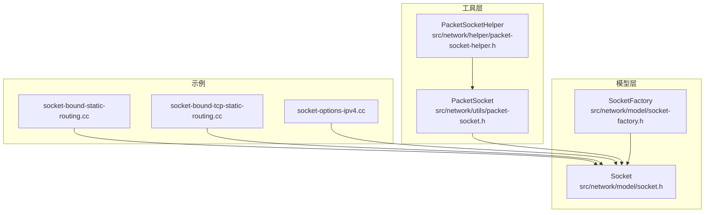
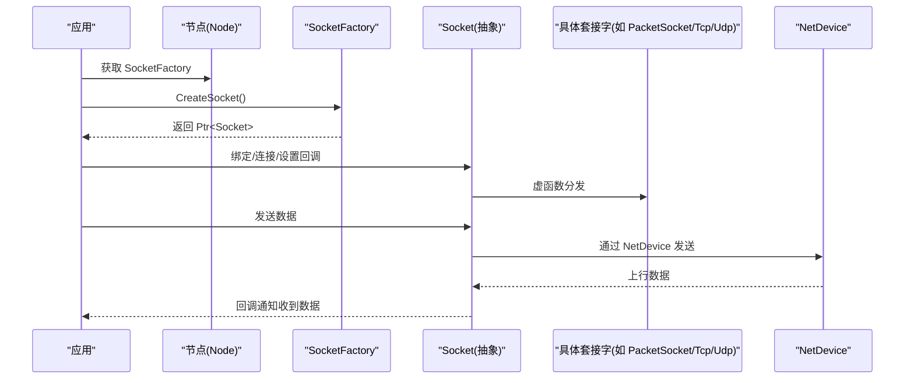
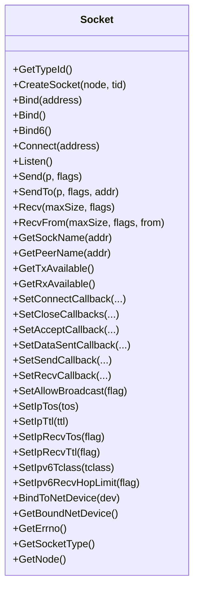
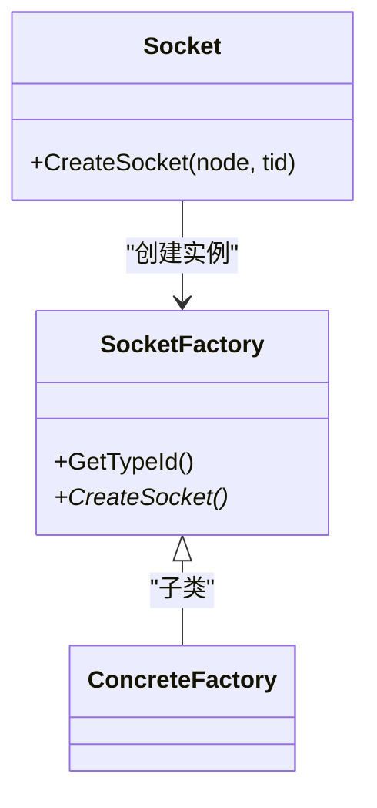
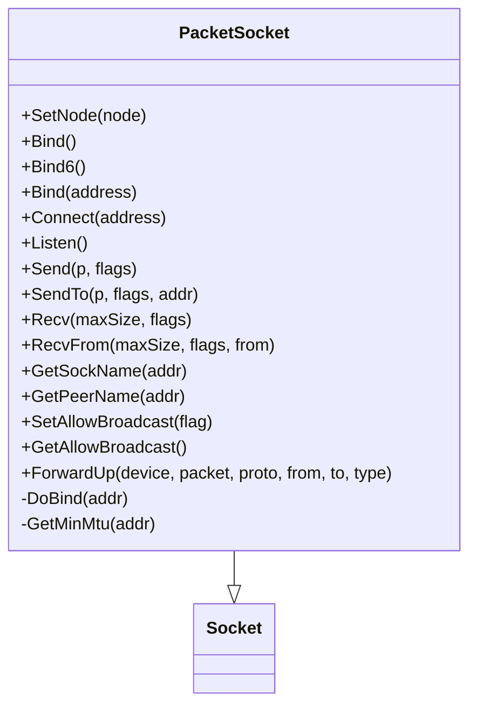
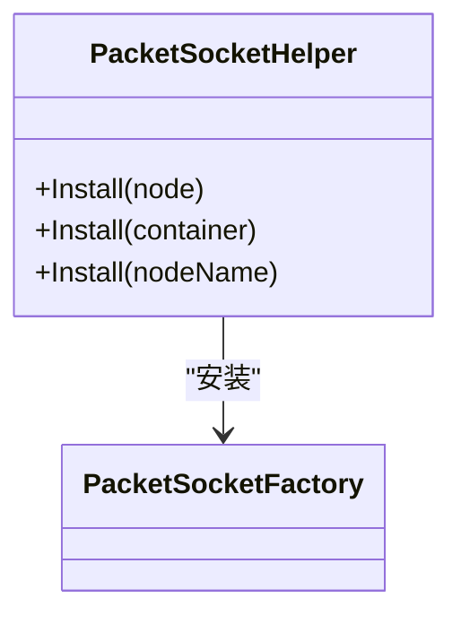
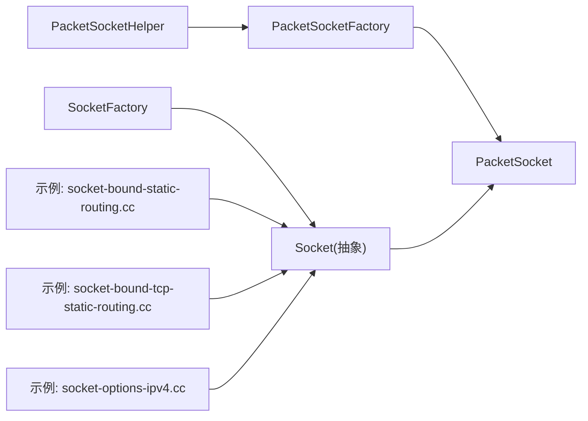

# 套接字API（Socket API）

<cite>
**本文引用的文件**
- [socket.h](file://simulator/ns-3.39/src/network/model/socket.h)
- [socket-factory.h](file://simulator/ns-3.39/src/network/model/socket-factory.h)
- [packet-socket.h](file://simulator/ns-3.39/src/network/utils/packet-socket.h)
- [packet-socket-helper.h](file://simulator/ns-3.39/src/network/helper/packet-socket-helper.h)
- [socket-bound-static-routing.cc](file://simulator/ns-3.39/examples/socket/socket-bound-static-routing.cc)
- [socket-bound-tcp-static-routing.cc](file://simulator/ns-3.39/examples/socket/socket-bound-tcp-static-routing.cc)
- [socket-options-ipv4.cc](file://simulator/ns-3.39/examples/socket/socket-options-ipv4.cc)
</cite>

## 目录
1. [简介](#简介)
2. [项目结构](#项目结构)
3. [核心组件](#核心组件)
4. [架构总览](#架构总览)
5. [详细组件分析](#详细组件分析)
6. [依赖关系分析](#依赖关系分析)
7. [性能考虑](#性能考虑)
8. [故障排查指南](#故障排查指南)
9. [结论](#结论)
10. [附录：示例与最佳实践](#附录示例与最佳实践)

## 简介
本文件系统化梳理 NS-3 的套接字 API，重点覆盖：
- Socket 抽象类的设计理念与接口规范
- 具体套接字类型（如 PacketSocket）的实现要点
- SocketFactory 工厂类的作用与套接字创建流程
- PacketSocketHelper 高层封装的安装与使用方式
- 套接字生命周期：创建、绑定、连接、数据收发
- 参数设置、性能优化与错误处理策略
- 调试、监控与故障诊断方法

## 项目结构
围绕套接字 API 的关键源码位于以下路径：
- 模型层（抽象与工厂）
  - src/network/model/socket.h
  - src/network/model/socket-factory.h
- 工具层（高层封装与辅助）
  - src/network/utils/packet-socket.h
  - src/network/helper/packet-socket-helper.h
- 示例（演示用法）
  - examples/socket/socket-bound-static-routing.cc
  - examples/socket/socket-bound-tcp-static-routing.cc
  - examples/socket/socket-options-ipv4.cc

**图示来源**
- [socket.h:67-1115](file://simulator/ns-3.39/src/network/model/socket.h#L67-L1115)
- [socket-factory.h:48-65](file://simulator/ns-3.39/src/network/model/socket-factory.h#L48-L65)
- [packet-socket.h:94-217](file://simulator/ns-3.39/src/network/utils/packet-socket.h#L94-L217)
- [packet-socket-helper.h:31-58](file://simulator/ns-3.39/src/network/helper/packet-socket-helper.h#L31-L58)
- [socket-bound-static-routing.cc:135-146](file://simulator/ns-3.39/examples/socket/socket-bound-static-routing.cc#L135-L146)
- [socket-bound-tcp-static-routing.cc:148-155](file://simulator/ns-3.39/examples/socket/socket-bound-tcp-static-routing.cc#L148-L155)
- [socket-options-ipv4.cc:117-141](file://simulator/ns-3.39/examples/socket/socket-options-ipv4.cc#L117-L141)

**章节来源**
- [socket.h:48-1115](file://simulator/ns-3.39/src/network/model/socket.h#L48-L1115)
- [socket-factory.h:30-65](file://simulator/ns-3.39/src/network/model/socket-factory.h#L30-L65)
- [packet-socket.h:40-217](file://simulator/ns-3.39/src/network/utils/packet-socket.h#L40-L217)
- [packet-socket-helper.h:28-58](file://simulator/ns-3.39/src/network/helper/packet-socket-helper.h#L28-L58)

## 核心组件
- Socket 抽象类
  - 定义统一的 BSD 风格异步套接字接口，支持回调驱动的数据收发
  - 提供错误码、套接字类型、优先级、IPv4/IPv6 头部参数控制等能力
  - 关键能力：绑定、连接、监听、发送/接收、半关闭、广播允许、设备绑定等
- SocketFactory 工厂类
  - 为节点提供创建具体传输层套接字实例的能力
  - 子类需实现 CreateSocket 并在节点上聚合以供应用调用
- PacketSocket
  - 面向链路层的“原始包”套接字，连接应用与 NetDevice
  - 支持按协议号与物理地址进行绑定与连接，提供额外标签信息（如设备名、目的地址、包类型）
- PacketSocketHelper
  - 在节点上安装 PacketSocketFactory，使节点具备 PacketSocket 能力

**章节来源**
- [socket.h:67-1115](file://simulator/ns-3.39/src/network/model/socket.h#L67-L1115)
- [socket-factory.h:48-65](file://simulator/ns-3.39/src/network/model/socket-factory.h#L48-L65)
- [packet-socket.h:94-217](file://simulator/ns-3.39/src/network/utils/packet-socket.h#L94-L217)
- [packet-socket-helper.h:31-58](file://simulator/ns-3.39/src/network/helper/packet-socket-helper.h#L31-L58)

## 架构总览
下图展示从应用到网络栈的关键交互路径，以及工厂与具体套接字的装配关系。

**图示来源**
- [socket.h:157-169](file://simulator/ns-3.39/src/network/model/socket.h#L157-L169)
- [socket-factory.h:64-64](file://simulator/ns-3.39/src/network/model/socket-factory.h#L64-L64)
- [packet-socket.h:116-149](file://simulator/ns-3.39/src/network/utils/packet-socket.h#L116-L149)

## 详细组件分析

### Socket 抽象类
- 设计要点
  - 异步 I/O：无阻塞语义，通过回调感知可写、可读、连接成功/失败、对端关闭或异常
  - 地址族与类型：支持流式、有序报文、数据报、原始套接字
  - 选项与优先级：支持 TOS/TTL、IPv6 TCLASS/HopLimit、优先级、广播、设备绑定等
- 关键接口
  - 生命周期：Bind/Bind6/Connect/Listen/Close/ShutdownSend/ShutdownRecv
  - 数据收发：Send/SendTo/Recv/RecvFrom；并提供基于字节缓冲区的重载版本
  - 属性查询：GetSockName/GetPeerName/GetTxAvailable/GetRxAvailable
  - 回调注册：SetConnectCallback/SetCloseCallbacks/SetAcceptCallback/SetDataSentCallback/SetSendCallback/SetRecvCallback
  - 选项设置：SetAllowBroadcast/SetIpTos/SetIpTtl/SetIpRecvTos/SetIpRecvTtl/SetIpv6Tclass/SetIpv6RecvHopLimit 等
- 错误处理
  - GetErrno 返回上次失败对应的错误码，便于定位问题

**图示来源**
- [socket.h:157-1115](file://simulator/ns-3.39/src/network/model/socket.h#L157-L1115)

**章节来源**
- [socket.h:67-1115](file://simulator/ns-3.39/src/network/model/socket.h#L67-L1115)

### SocketFactory 工厂类
- 作用
  - 为节点提供创建具体套接字实例的统一入口
  - 子类负责实现具体传输层（如 TCP/UDP/Packet）的套接字创建逻辑
- 使用流程
  - 应用侧通过 Socket::CreateSocket(node, TypeId) 获取套接字
  - 实际由对应 SocketFactory::CreateSocket 返回具体套接字对象

**图示来源**
- [socket-factory.h:48-65](file://simulator/ns-3.39/src/network/model/socket-factory.h#L48-L65)
- [socket.h:157-157](file://simulator/ns-3.39/src/network/model/socket.h#L157-L157)

**章节来源**
- [socket-factory.h:30-65](file://simulator/ns-3.39/src/network/model/socket-factory.h#L30-L65)
- [socket.h:148-157](file://simulator/ns-3.39/src/network/model/socket.h#L148-L157)

### PacketSocket
- 角色与语义
  - 连接应用与 NetDevice 的“原始包”套接字，类似 Linux/ BSD 的 packet 套接字
  - 绑定仅使用协议号与设备字段；连接设置默认目的地；SendTo 可指定设备与物理地址
  - 接收时填充物理地址、设备名与包类型等标签
- 关键行为
  - 绑定/连接：支持无参 Bind、Bind6、Bind(address)；Connect(address)
  - 发送/接收：Send/SendTo、Recv/RecvFrom；支持获取可用发送/接收字节数
  - 状态机：OPEN/BOUND/CONNECTED/CLOSED
  - 选项：SetAllowBroadcast/GetAllowBroadcast
  - 设备绑定：BindToNetDevice 与 GetBoundNetDevice
- 标签体系
  - PacketSocketTag：携带目的地址与包类型
  - DeviceNameTag：携带设备名称
  - SocketIpTosTag/SocketIpTtlTag/SocketIpv6HopLimitTag 等用于头部参数透传

**图示来源**
- [packet-socket.h:94-217](file://simulator/ns-3.39/src/network/utils/packet-socket.h#L94-L217)
- [socket.h:67-1115](file://simulator/ns-3.39/src/network/model/socket.h#L67-L1115)

**章节来源**
- [packet-socket.h:40-217](file://simulator/ns-3.39/src/network/utils/packet-socket.h#L40-L217)

### PacketSocketHelper
- 作用
  - 在节点上安装 PacketSocketFactory，使节点具备创建 PacketSocket 的能力
- 使用方式
  - Install(Node)、Install(NodeContainer)、Install(string nodeName)

**图示来源**
- [packet-socket-helper.h:31-58](file://simulator/ns-3.39/src/network/helper/packet-socket-helper.h#L31-L58)

**章节来源**
- [packet-socket-helper.h:28-58](file://simulator/ns-3.39/src/network/helper/packet-socket-helper.h#L28-L58)

## 依赖关系分析
- Socket 作为抽象基类被多种具体实现继承（例如 TCP/UDP/Packet）
- SocketFactory 为 Socket 的创建提供统一入口，典型工厂包括 UdpSocketFactory、TcpSocketFactory、PacketSocketFactory
- PacketSocketHelper 将 PacketSocketFactory 聚合到节点，简化应用侧安装流程
- 示例程序展示了如何通过 Socket::CreateSocket 选择工厂并完成绑定、连接与数据收发

**图示来源**
- [socket.h:157-157](file://simulator/ns-3.39/src/network/model/socket.h#L157-L157)
- [socket-factory.h:64-64](file://simulator/ns-3.39/src/network/model/socket-factory.h#L64-L64)
- [packet-socket.h:116-149](file://simulator/ns-3.39/src/network/utils/packet-socket.h#L116-L149)
- [packet-socket-helper.h:31-58](file://simulator/ns-3.39/src/network/helper/packet-socket-helper.h#L31-L58)
- [socket-bound-static-routing.cc:135-146](file://simulator/ns-3.39/examples/socket/socket-bound-static-routing.cc#L135-L146)
- [socket-bound-tcp-static-routing.cc:148-155](file://simulator/ns-3.39/examples/socket/socket-bound-tcp-static-routing.cc#L148-L155)
- [socket-options-ipv4.cc:117-141](file://simulator/ns-3.39/examples/socket/socket-options-ipv4.cc#L117-L141)

**章节来源**
- [socket.h:148-157](file://simulator/ns-3.39/src/network/model/socket.h#L148-L157)
- [socket-factory.h:48-65](file://simulator/ns-3.39/src/network/model/socket-factory.h#L48-L65)
- [packet-socket.h:94-149](file://simulator/ns-3.39/src/network/utils/packet-socket.h#L94-L149)
- [packet-socket-helper.h:31-58](file://simulator/ns-3.39/src/network/helper/packet-socket-helper.h#L31-L58)

## 性能考虑
- 异步 I/O 与回调
  - 利用 SetSendCallback/SetRecvCallback 避免阻塞等待，提升吞吐
  - 结合 GetTxAvailable/GetRxAvailable 控制发送窗口与接收缓冲
- 设备绑定
  - 使用 BindToNetDevice 强制出站接口，减少路由开销并便于 QoS 控制
- 选项设置
  - 合理设置优先级、TOS/TTL、DF 标志等，有助于路径选择与队列调度
- 标签与拷贝
  - 通过 Packet 与标签传递元数据，避免额外内存拷贝

[本节为通用指导，无需列出具体文件来源]

## 故障排查指南
- 常见错误码
  - 通过 GetErrno 获取上次失败的错误码，结合接口返回值定位问题
- 回调验证
  - 设置 SetRecvCallback/SetSendCallback/SetCloseCallbacks，确认事件触发
- 设备绑定检查
  - 使用 GetBoundNetDevice 验证是否正确绑定到目标接口
- 选项核对
  - 检查 SetIpTos/SetIpTtl/SetIpRecvTos/SetIpRecvTtl 等选项是否按预期生效
- 标签解析
  - 对于 PacketSocket，解析 PacketSocketTag/DeviceNameTag 等标签辅助定位来源与类型

**章节来源**
- [socket.h:83-100](file://simulator/ns-3.39/src/network/model/socket.h#L83-L100)
- [socket.h:165-165](file://simulator/ns-3.39/src/network/model/socket.h#L165-L165)
- [socket.h:247-258](file://simulator/ns-3.39/src/network/model/socket.h#L247-L258)
- [socket.h:620-631](file://simulator/ns-3.39/src/network/model/socket.h#L620-L631)
- [packet-socket.h:223-301](file://simulator/ns-3.39/src/network/utils/packet-socket.h#L223-L301)

## 结论
NS-3 套接字 API 以 Socket 抽象为核心，通过 SocketFactory 提供统一的创建入口，并辅以 PacketSocket 与 PacketSocketHelper 实现面向链路层的灵活封装。借助丰富的选项与回调机制，用户可在仿真中高效地构建多协议、多接口的网络场景，并通过标签与设备绑定实现精细的控制与可观测性。

[本节为总结性内容，无需列出具体文件来源]

## 附录：示例与最佳实践

### 套接字创建、绑定、连接、数据收发（步骤化）
- 创建套接字
  - 使用 Socket::CreateSocket(node, TypeId) 获取套接字实例
- 绑定
  - 无参 Bind 或 Bind(address) 完成本地端点分配
  - 对于设备定向，使用 BindToNetDevice(device)
- 连接
  - Connect(address) 建立连接（流式套接字）
- 注册回调
  - SetRecvCallback/SetSendCallback/SetCloseCallbacks 等
- 发送/接收
  - Send/SendTo 与 Recv/RecvFrom；根据 GetTxAvailable/GetRxAvailable 控制节奏
- 关闭
  - Close 或 ShutdownSend/ShutdownRecv 半关闭

**章节来源**
- [socket.h:264-316](file://simulator/ns-3.39/src/network/model/socket.h#L264-L316)
- [socket.h:330-476](file://simulator/ns-3.39/src/network/model/socket.h#L330-L476)
- [socket.h:620-654](file://simulator/ns-3.39/src/network/model/socket.h#L620-L654)

### 示例参考（路径）
- 绑定设备与静态路由场景（UDP）
  - [socket-bound-static-routing.cc:135-168](file://simulator/ns-3.39/examples/socket/socket-bound-static-routing.cc#L135-L168)
- 设备绑定与 TCP 流量（TCP）
  - [socket-bound-tcp-static-routing.cc:148-186](file://simulator/ns-3.39/examples/socket/socket-bound-tcp-static-routing.cc#L148-L186)
- IPv4 选项（TOS/TTL/RECVTOS/RECVTTL）与标签解析
  - [socket-options-ipv4.cc:117-141](file://simulator/ns-3.39/examples/socket/socket-options-ipv4.cc#L117-L141)

### 参数设置与优化建议
- 优先级与 TOS/TTL
  - 使用 SetPriority/SetIpTos/SetIpTtl/SetIpv6Tclass/SetIpv6HopLimit 控制头部参数
- 广播与 DF
  - SetAllowBroadcast 与 SocketSetDontFragmentTag 控制广播与分片
- 设备绑定
  - BindToNetDevice 限定出站接口，提升路径可控性

**章节来源**
- [socket.h:688-798](file://simulator/ns-3.39/src/network/model/socket.h#L688-L798)
- [socket.h:834-954](file://simulator/ns-3.39/src/network/model/socket.h#L834-L954)
- [socket.h:1217-1262](file://simulator/ns-3.39/src/network/model/socket.h#L1217-L1262)

### 调试与监控技巧
- 打印标签
  - 解析 SocketIpTosTag/SocketIpTtlTag/SocketIpv6HopLimitTag 等标签，核对头部参数
- 设备名与目的地址
  - 通过 DeviceNameTag/PacketSocketTag 辅助定位来源与类型
- 回调日志
  - 在 SetRecvCallback/SetSendCallback 中记录事件时间与字节数，辅助性能分析

**章节来源**
- [socket-options-ipv4.cc:37-51](file://simulator/ns-3.39/examples/socket/socket-options-ipv4.cc#L37-L51)
- [packet-socket.h:223-301](file://simulator/ns-3.39/src/network/utils/packet-socket.h#L223-L301)