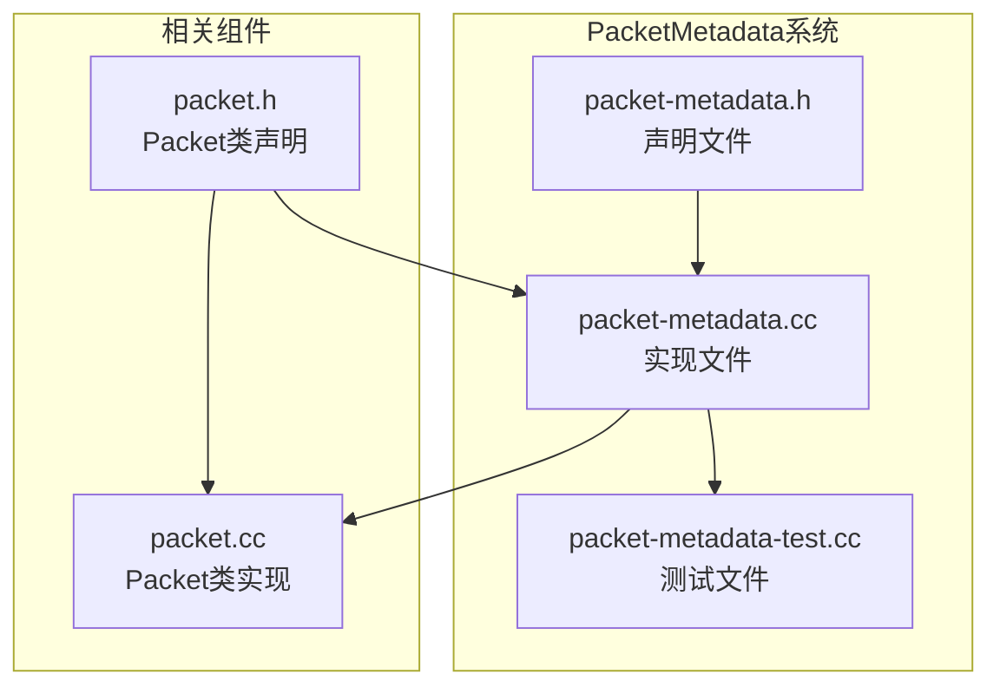
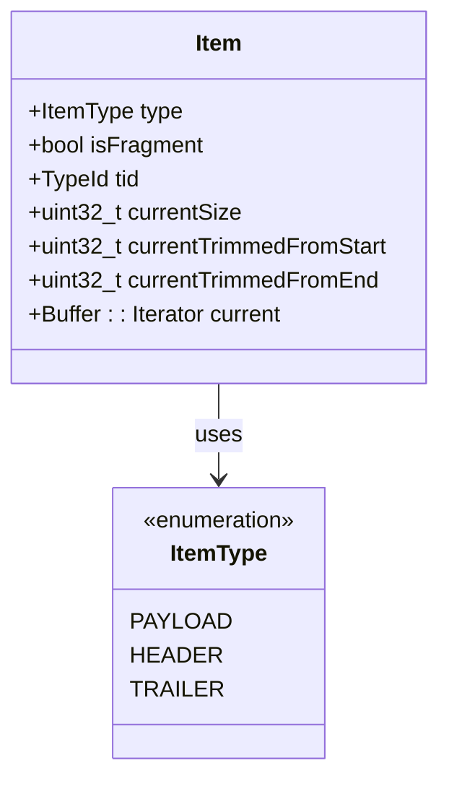
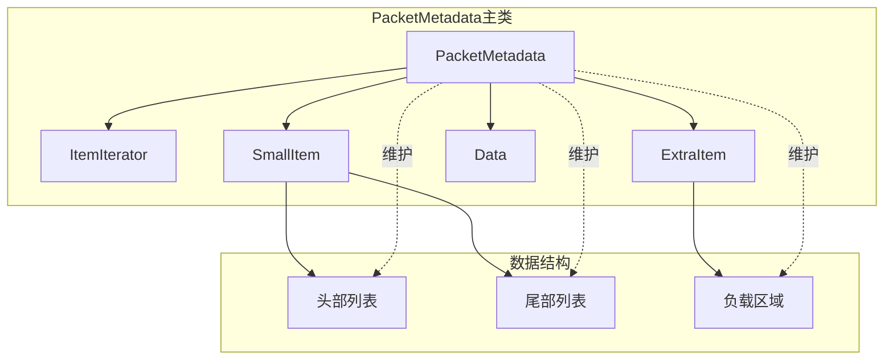
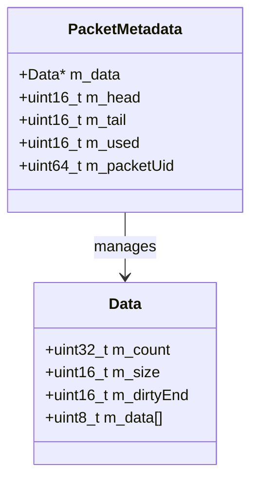
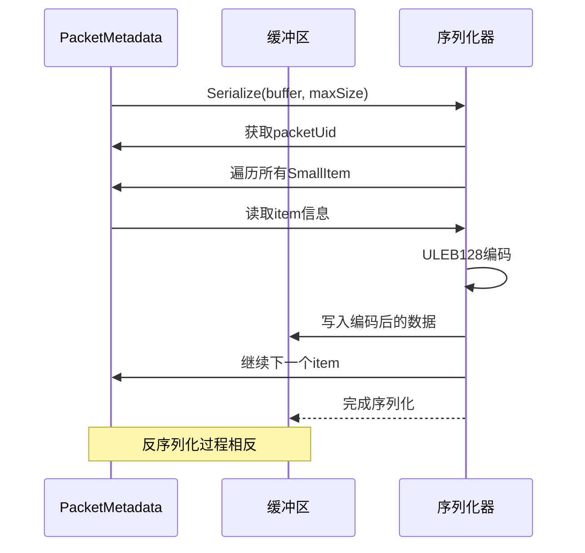
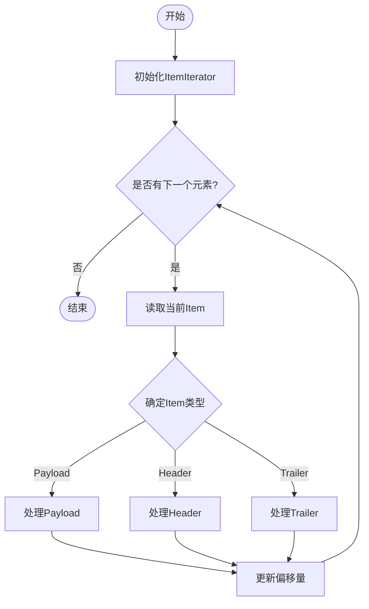
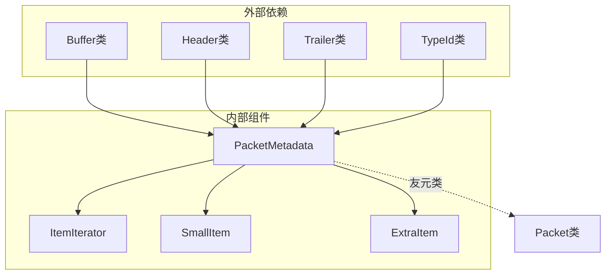
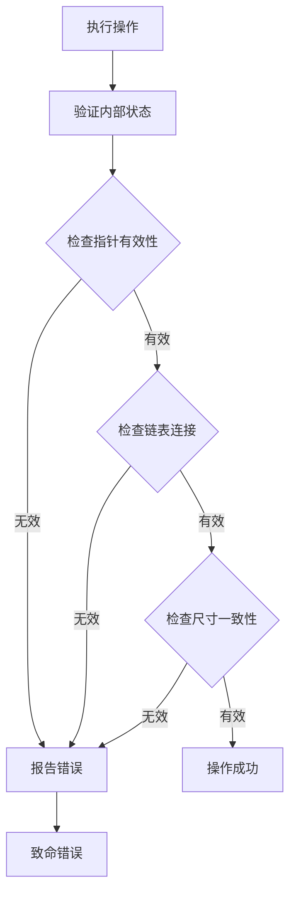

# PacketMetadata元数据管理

<cite>
**本文档引用的文件**
- [packet-metadata.h](file://simulator/ns-3.39/src/network/model/packet-metadata.h)
- [packet-metadata.cc](file://simulator/ns-3.39/src/network/model/packet-metadata.cc)
- [packet-metadata-test.cc](file://simulator/ns-3.39/src/network/test/packet-metadata-test.cc)
- [packet.cc](file://simulator/ns-3.39/src/network/model/packet.cc)
- [packet.h](file://simulator/ns-3.39/src/network/model/packet.h)
</cite>

## 目录
1. [简介](#简介)
2. [项目结构](#项目结构)
3. [核心组件](#核心组件)
4. [架构概览](#架构概览)
5. [详细组件分析](#详细组件分析)
6. [依赖关系分析](#依赖关系分析)
7. [性能考虑](#性能考虑)
8. [故障排除指南](#故障排除指南)
9. [结论](#结论)
10. [附录](#附录)

## 简介

PacketMetadata是ns-3网络模拟器中用于管理数据包元数据的核心组件。它负责跟踪数据包的头部（Header）、尾部（Trailer）和负载（Payload）信息，提供序列化和反序列化功能，以及BeginItem迭代器来遍历数据包内容。该系统通过维护一个双向链表结构来记录每个操作对数据包缓冲区执行的动作，从而支持数据包的片段化处理、大小调整和边界管理。

## 项目结构

PacketMetadata系统主要由以下文件组成：



**图表来源**
- [packet-metadata.h:1-771](file://simulator/ns-3.39/src/network/model/packet-metadata.h#L1-L771)
- [packet-metadata.cc:1-1470](file://simulator/ns-3.39/src/network/model/packet-metadata.cc#L1-L1470)

**章节来源**
- [packet-metadata.h:1-771](file://simulator/ns-3.39/src/network/model/packet-metadata.h#L1-L771)
- [packet-metadata.cc:1-1470](file://simulator/ns-3.39/src/network/model/packet-metadata.cc#L1-L1470)

## 核心组件

### PacketMetadata类

PacketMetadata类是整个元数据管理系统的核心，提供了以下关键功能：

- **元数据存储**：维护一个可变大小的字节缓冲区来存储元数据项
- **类型识别**：区分HEADER、TRAILER和PAYLOAD三种类型的条目
- **链接列表管理**：通过SmallItem和ExtraItem结构维护双向链表
- **序列化支持**：提供完整的序列化和反序列化机制
- **迭代器支持**：通过ItemIterator遍历元数据项

### Item结构体设计

Item结构体是元数据系统的基础数据结构，包含以下关键字段：



**图表来源**
- [packet-metadata.h:86-131](file://simulator/ns-3.39/src/network/model/packet-metadata.h#L86-L131)

**章节来源**
- [packet-metadata.h:86-131](file://simulator/ns-3.39/src/network/model/packet-metadata.h#L86-L131)

## 架构概览

PacketMetadata系统采用分层架构设计，通过多个辅助结构体来管理复杂的数据结构：



**图表来源**
- [packet-metadata.h:426-510](file://simulator/ns-3.39/src/network/model/packet-metadata.h#L426-L510)

### 数据存储结构

系统使用Data结构体作为底层存储容器：



**图表来源**
- [packet-metadata.h:426-436](file://simulator/ns-3.39/src/network/model/packet-metadata.h#L426-L436)

**章节来源**
- [packet-metadata.h:426-436](file://simulator/ns-3.39/src/network/model/packet-metadata.h#L426-L436)

## 详细组件分析

### SmallItem结构体

SmallItem用于存储基本的元数据信息，包含固定大小的字段：

| 字段名 | 类型 | 描述 | 大小 |
|--------|------|------|------|
| next | uint16_t | 下一个元素的偏移量 | 2字节 |
| prev | uint16_t | 上一个元素的偏移量 | 2字节 |
| typeUid | uint32_t | 类型标识符（ULEB128编码） | 变长 |
| size | uint32_t | 元素大小（ULEB128编码） | 变长 |
| chunkUid | uint16_t | 实例唯一标识符 | 2字节 |

**章节来源**
- [packet-metadata.h:447-487](file://simulator/ns-3.39/src/network/model/packet-metadata.h#L447-L487)

### ExtraItem结构体

ExtraItem用于存储额外的片段信息，仅在需要时使用：

| 字段名 | 类型 | 描述 | 大小 |
|--------|------|------|------|
| fragmentStart | uint32_t | 片段起始偏移（ULEB128编码） | 变长 |
| fragmentEnd | uint32_t | 片段结束偏移（ULEB128编码） | 变长 |
| packetUid | uint64_t | 包UID | 8字节 |

**章节来源**
- [packet-metadata.h:492-510](file://simulator/ns-3.39/src/network/model/packet-metadata.h#L492-L510)

### 序列化和反序列化机制

系统使用ULEB128（无符号小端变长整数）编码来优化存储空间：



**图表来源**
- [packet-metadata.cc:1160-1264](file://simulator/ns-3.39/src/network/model/packet-metadata.cc#L1160-L1264)

**章节来源**
- [packet-metadata.cc:1160-1264](file://simulator/ns-3.39/src/network/model/packet-metadata.cc#L1160-L1264)

### BeginItem迭代器使用

BeginItem迭代器提供了访问数据包内容的统一接口：



**图表来源**
- [packet-metadata.cc:1032-1113](file://simulator/ns-3.39/src/network/model/packet-metadata.cc#L1032-L1113)

**章节来源**
- [packet-metadata.cc:1032-1113](file://simulator/ns-3.39/src/network/model/packet-metadata.cc#L1032-L1113)

### 数据包片段化处理

系统支持复杂的片段化操作，包括：

1. **CreateFragment**：创建指定范围的片段
2. **RemoveAtStart**：从开始位置移除指定大小的数据
3. **RemoveAtEnd**：从结束位置移除指定大小的数据
4. **AddAtEnd**：将另一个数据包的元数据添加到末尾

**章节来源**
- [packet-metadata.cc:639-865](file://simulator/ns-3.39/src/network/model/packet-metadata.cc#L639-L865)

## 依赖关系分析

PacketMetadata系统与多个组件存在紧密的依赖关系：



**图表来源**
- [packet-metadata.h:22-39](file://simulator/ns-3.39/src/network/model/packet-metadata.h#L22-L39)

**章节来源**
- [packet-metadata.h:22-39](file://simulator/ns-3.39/src/network/model/packet-metadata.h#L22-L39)

### 错误处理和状态验证

系统实现了全面的状态检查机制：



**图表来源**
- [packet-metadata.cc:135-165](file://simulator/ns-3.39/src/network/model/packet-metadata.cc#L135-L165)

**章节来源**
- [packet-metadata.cc:135-165](file://simulator/ns-3.39/src/network/model/packet-metadata.cc#L135-L165)

## 性能考虑

### 内存管理策略

PacketMetadata采用了高效的内存管理策略：

1. **对象池模式**：使用DataFreeList重用内存分配
2. **延迟分配**：只有在需要时才分配新的内存块
3. **引用计数**：避免不必要的数据复制

### 时间复杂度分析

- **添加操作**：O(1) 平均时间复杂度
- **删除操作**：O(1) 平均时间复杂度  
- **迭代操作**：O(n) 线性时间复杂度
- **序列化操作**：O(n) 线性时间复杂度

### 存储效率优化

1. **ULEB128编码**：减少小数值的存储开销
2. **条件存储**：只在需要时存储ExtraItem
3. **紧凑布局**：最小化内存碎片

## 故障排除指南

### 常见问题和解决方案

| 问题类型 | 症状 | 可能原因 | 解决方案 |
|----------|------|----------|----------|
| 元数据未启用 | Packet::Print输出为空 | 未调用Enable() | 在程序开始处调用PacketMetadata::Enable() |
| 操作顺序错误 | 运行时断言失败 | 移除了不存在的头部/尾部 | 确保操作顺序与添加顺序相反 |
| 内存不足 | 分配失败 | 元数据过大 | 调整PacketMetadata::m_maxSize或清理缓存 |
| 序列化错误 | 反序列化失败 | 数据损坏 | 检查序列化/反序列化过程的一致性 |

**章节来源**
- [packet-metadata.cc:54-74](file://simulator/ns-3.39/src/network/model/packet-metadata.cc#L54-L74)

### 调试技巧

1. **启用检查模式**：调用EnableChecking()获取更详细的错误信息
2. **使用测试套件**：参考packet-metadata-test.cc中的测试用例
3. **逐步验证**：在每个操作后调用IsStateOk()检查状态

**章节来源**
- [packet-metadata-test.cc:326-439](file://simulator/ns-3.39/src/network/test/packet-metadata-test.cc#L326-L439)

## 结论

PacketMetadata元数据管理系统为ns-3网络模拟器提供了强大而灵活的数据包管理能力。通过精心设计的数据结构和算法，它能够高效地跟踪数据包的头部、尾部和负载信息，支持复杂的片段化操作，并提供完整的序列化和反序列化功能。

该系统的主要优势包括：
- **高性能**：O(1)的平均操作复杂度
- **内存效率**：智能的内存管理和重用策略
- **功能完整**：支持所有必要的数据包操作
- **易于使用**：简洁的API设计和强大的迭代器支持

对于数据包分析和性能监控，PacketMetadata提供了以下价值：
- **精确的元数据追踪**：准确记录每个数据包的操作历史
- **灵活的查询接口**：通过BeginItem迭代器轻松访问数据包内容
- **可靠的调试支持**：内置的状态检查和错误报告机制
- **高效的序列化**：支持数据包的完整保存和恢复

## 附录

### 使用示例

以下是一些常见的使用场景：

1. **启用元数据系统**：
```cpp
PacketMetadata::Enable();
// 或者启用检查模式
PacketMetadata::EnableChecking();
```

2. **遍历数据包内容**：
```cpp
PacketMetadata::ItemIterator iter = packet.BeginItem();
while (iter.HasNext()) {
    PacketMetadata::Item item = iter.Next();
    // 处理每个元数据项
}
```

3. **创建数据包片段**：
```cpp
PacketMetadata fragment = packet.CreateFragment(start, end);
```

4. **序列化和反序列化**：
```cpp
uint32_t size = packet.GetSerializedSize();
uint8_t* buffer = new uint8_t[size];
packet.Serialize(buffer, size);
// 创建新包
Ptr<Packet> newPacket = Create<Packet>(buffer, size, true);
```

这些功能使得PacketMetadata成为ns-3网络模拟器中不可或缺的重要组件，为网络协议的研究和开发提供了强有力的支持。