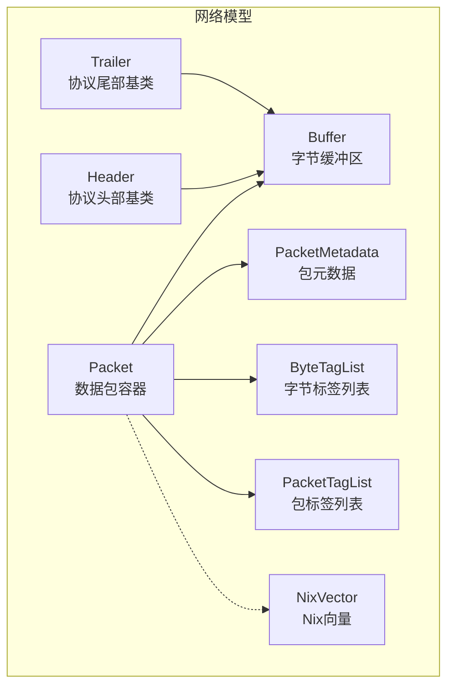
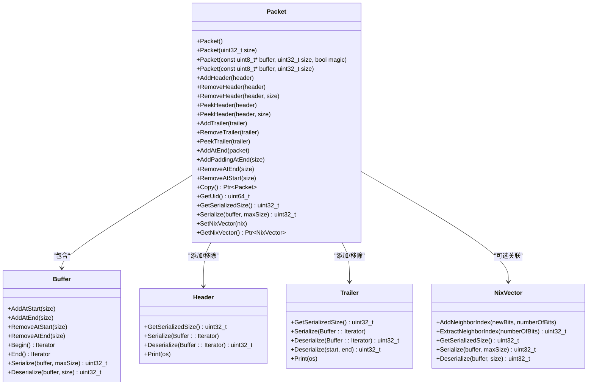
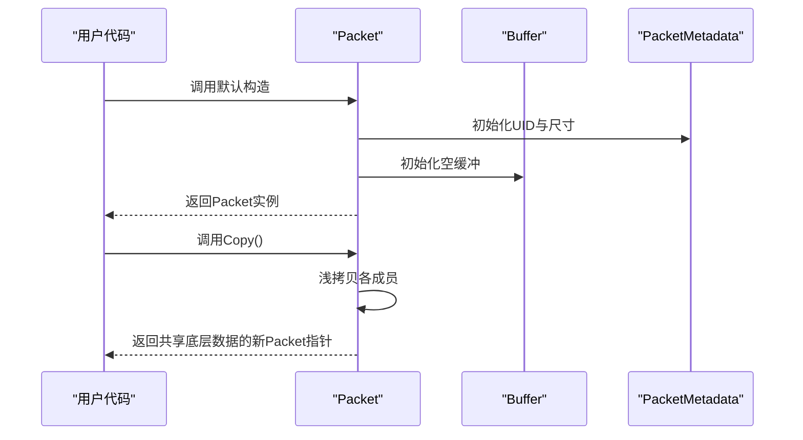
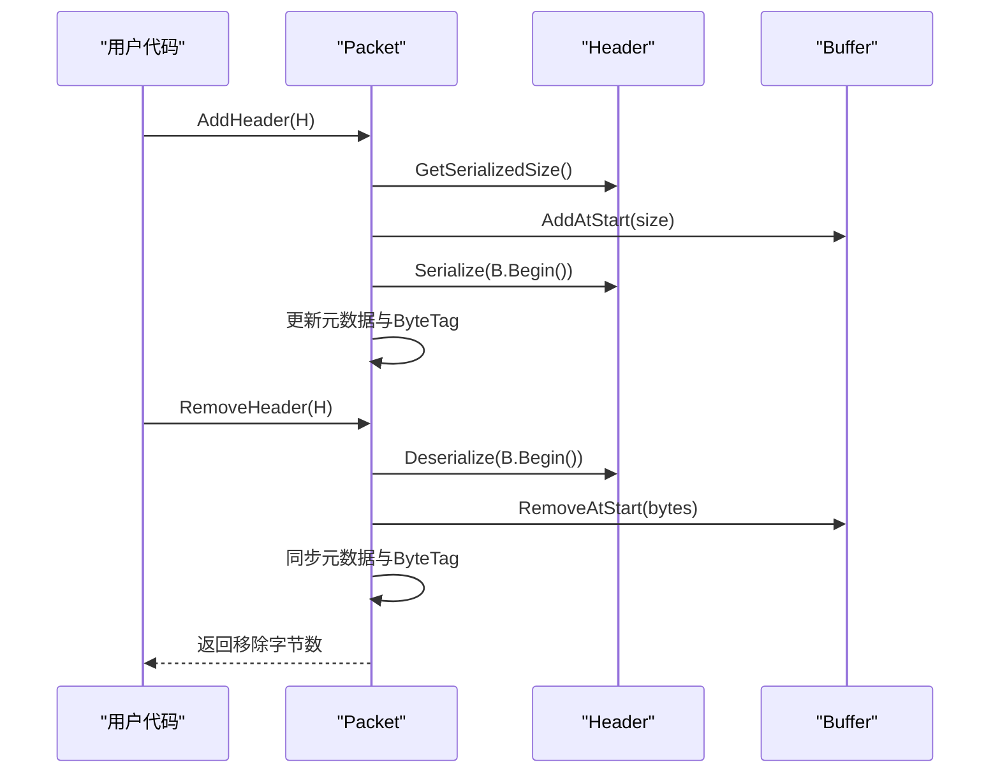
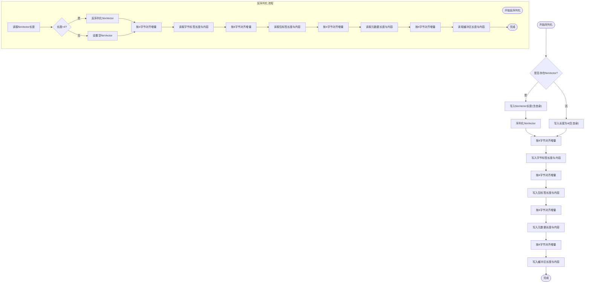
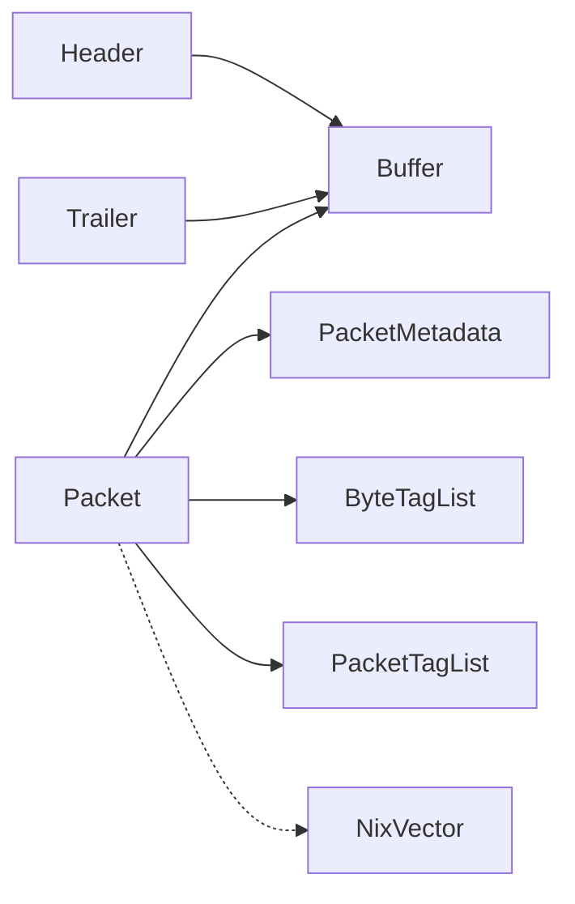

# Packet核心类

<cite>
**本文档引用的文件**
- [packet.h](file://simulator/ns-3.39/src/network/model/packet.h)
- [packet.cc](file://simulator/ns-3.39/src/network/model/packet.cc)
- [header.h](file://simulator/ns-3.39/src/network/model/header.h)
- [trailer.h](file://simulator/ns-3.39/src/network/model/trailer.h)
- [buffer.h](file://simulator/ns-3.39/src/network/model/buffer.h)
- [nix-vector.h](file://simulator/ns-3.39/src/network/model/nix-vector.h)
- [main-packet-header.cc](file://simulator/ns-3.39/src/network/examples/main-packet-header.cc)
- [packets.rst](file://simulator/ns-3.39/src/network/doc/packets.rst)
</cite>

## 目录
1. [简介](#简介)
2. [项目结构](#项目结构)
3. [核心组件](#核心组件)
4. [架构概览](#架构概览)
5. [详细组件分析](#详细组件分析)
6. [依赖关系分析](#依赖关系分析)
7. [性能考量](#性能考量)
8. [故障排除指南](#故障排除指南)
9. [结论](#结论)
10. [附录：使用示例与最佳实践](#附录使用示例与最佳实践)

## 简介
本文件系统性阐述NS-3仿真器中Packet核心类的API设计与实现细节，覆盖构造/析构与拷贝语义、基本操作（添加/移除头部与尾部）、序列化/反序列化机制、UID管理、元数据处理以及NixVector支持。同时提供面向实际使用的场景化示例与网络设备间传递流程的性能分析，帮助读者在保证正确性的前提下高效利用Packet。

## 项目结构
Packet位于网络模型子系统中，围绕以下关键模块组织：
- 核心类：Packet（数据包容器）
- 协议扩展点：Header（协议头部）、Trailer（协议尾部）
- 数据存储：Buffer（字节缓冲区）
- 元数据与标签：PacketMetadata、ByteTagList、PacketTagList
- 特殊支持：NixVector（Nix向量路由）

**图表来源**
- [packet.h:190-238](file://simulator/ns-3.39/src/network/model/packet.h#L190-L238)
- [header.h:43-105](file://simulator/ns-3.39/src/network/model/header.h#L43-L105)
- [trailer.h:40-116](file://simulator/ns-3.39/src/network/model/trailer.h#L40-L116)
- [buffer.h:93-120](file://simulator/ns-3.39/src/network/model/buffer.h#L93-L120)
- [nix-vector.h:63-142](file://simulator/ns-3.39/src/network/model/nix-vector.h#L63-L142)

**章节来源**
- [packet.h:190-238](file://simulator/ns-3.39/src/network/model/packet.h#L190-L238)
- [buffer.h:93-120](file://simulator/ns-3.39/src/network/model/buffer.h#L93-L120)

## 核心组件
- Packet：封装Buffer、标签与元数据，提供头部/尾部的添加/移除、片段化/拼接、序列化/反序列化、打印与UID管理。
- Header/Trailer：协议层扩展点，通过虚接口定义序列化/反序列化与打印。
- Buffer：基于Copy-on-Write的可自动扩容字节缓冲区，支持迭代器与零填充虚拟区域。
- PacketMetadata：可选的包级元数据，记录头部/尾部类型与位置，用于打印与运行时校验。
- ByteTagList/PacketTagList：两类标签容器，分别随字节或随包移动。
- NixVector：Nix向量路由支持，随包传输并在每跳提取下一跳邻居索引。

**章节来源**
- [packet.h:190-238](file://simulator/ns-3.39/src/network/model/packet.h#L190-L238)
- [header.h:43-105](file://simulator/ns-3.39/src/network/model/header.h#L43-L105)
- [trailer.h:40-116](file://simulator/ns-3.39/src/network/model/trailer.h#L40-L116)
- [buffer.h:93-120](file://simulator/ns-3.39/src/network/model/buffer.h#L93-L120)
- [nix-vector.h:63-142](file://simulator/ns-3.39/src/network/model/nix-vector.h#L63-L142)

## 架构概览
Packet采用“字节缓冲+标签+元数据”的组合设计，既保持与真实网络帧一致的序列化表示，又允许模拟期扩展信息（标签）。Buffer实现COW以降低复制成本；PacketMetadata可选启用以支持打印与运行时校验；NixVector作为特殊成员随包传递。

**图表来源**
- [packet.h:238-718](file://simulator/ns-3.39/src/network/model/packet.h#L238-L718)
- [header.h:43-105](file://simulator/ns-3.39/src/network/model/header.h#L43-L105)
- [trailer.h:40-116](file://simulator/ns-3.39/src/network/model/trailer.h#L40-L116)
- [buffer.h:93-120](file://simulator/ns-3.39/src/network/model/buffer.h#L93-L120)
- [nix-vector.h:63-142](file://simulator/ns-3.39/src/network/model/nix-vector.h#L63-L142)

## 详细组件分析

### 构造函数、析构函数与拷贝语义
- 默认构造：分配新UID并初始化空缓冲与空标签/元数据。
- 零填充构造：创建指定大小的“虚拟零填充”负载，按需才分配内存。
- 反序列化构造：从原始字节流构建Packet（magic=true），内部调用Deserialize。
- 字节缓冲构造：从用户缓冲复制内容到Packet。
- 拷贝构造/赋值：浅拷贝底层数据结构，必要时对NixVector执行深拷贝。
- Copy：返回共享底层数据的独立视图，真正写入时触发COW。

**图表来源**
- [packet.cc:139-193](file://simulator/ns-3.39/src/network/model/packet.cc#L139-L193)
- [packet.cc:155-177](file://simulator/ns-3.39/src/network/model/packet.cc#L155-L177)
- [packet.cc:130-137](file://simulator/ns-3.39/src/network/model/packet.cc#L130-L137)

**章节来源**
- [packet.cc:139-193](file://simulator/ns-3.39/src/network/model/packet.cc#L139-L193)
- [packet.cc:155-177](file://simulator/ns-3.39/src/network/model/packet.cc#L155-L177)
- [packet.cc:130-137](file://simulator/ns-3.39/src/network/model/packet.cc#L130-L137)

### 基本操作：头部与尾部管理
- 添加头部：计算头部序列化长度，前置到Buffer前端，更新ByteTag与元数据。
- 移除头部：从Buffer前端反序列化头部，移除对应字节并同步元数据。
- 查看头部：不移除地反序列化头部，仅读取。
- 添加尾部：计算尾部序列化长度，追加到Buffer末尾，更新元数据。
- 移除尾部：从Buffer末尾反序列化尾部，移除对应字节并同步元数据。
- 查看尾部：不移除地反序列化尾部，仅读取。

**图表来源**
- [packet.cc:268-302](file://simulator/ns-3.39/src/network/model/packet.cc#L268-L302)
- [header.h:62-91](file://simulator/ns-3.39/src/network/model/header.h#L62-L91)

**章节来源**
- [packet.cc:268-302](file://simulator/ns-3.39/src/network/model/packet.cc#L268-L302)
- [packet.cc:323-351](file://simulator/ns-3.39/src/network/model/packet.cc#L323-L351)
- [header.h:62-91](file://simulator/ns-3.39/src/network/model/header.h#L62-L91)
- [trailer.h:57-84](file://simulator/ns-3.39/src/network/model/trailer.h#L57-L84)

### 序列化与反序列化机制
- GetSerializedSize：计算NixVector、字节标签、包标签、元数据与缓冲区总序列化大小，并按4字节边界对齐。
- Serialize：依次写入NixVector长度与内容、字节标签长度与内容、包标签长度与内容、元数据长度与内容、缓冲区长度与内容。
- Deserialize：按相反顺序读取并重建各部分，进行长度与边界检查，最终返回是否完全解析。

**图表来源**
- [packet.cc:609-821](file://simulator/ns-3.39/src/network/model/packet.cc#L609-L821)
- [packet.cc:823-931](file://simulator/ns-3.39/src/network/model/packet.cc#L823-L931)

**章节来源**
- [packet.cc:609-821](file://simulator/ns-3.39/src/network/model/packet.cc#L609-L821)
- [packet.cc:823-931](file://simulator/ns-3.39/src/network/model/packet.cc#L823-L931)

### UID管理与元数据
- UID：Packet通过PacketMetadata维护全局唯一标识，高位保存系统ID，低位保存全局自增UID。
- 打印与校验：可通过EnablePrinting/EnableChecking启用元数据，用于打印与运行时一致性检查。
- 迭代器：BeginItem遍历元数据项，配合Print输出人类可读的分层结构。

**章节来源**
- [packet.h:481-539](file://simulator/ns-3.39/src/network/model/packet.h#L481-L539)
- [packet.cc:455-587](file://simulator/ns-3.39/src/network/model/packet.cc#L455-L587)

### NixVector支持
- 设置/获取：SetNixVector/GetNixVector提供可变成员访问（const包装以支持const对象设置）。
- 序列化：在GetSerializedSize/Serialize中按4字节对齐处理长度与内容。
- 生命周期：拷贝构造/赋值时对NixVector执行Copy，确保跨引用安全。

**章节来源**
- [packet.h:694-718](file://simulator/ns-3.39/src/network/model/packet.h#L694-L718)
- [packet.cc:255-265](file://simulator/ns-3.39/src/network/model/packet.cc#L255-L265)
- [packet.cc:155-177](file://simulator/ns-3.39/src/network/model/packet.cc#L155-L177)
- [nix-vector.h:117-141](file://simulator/ns-3.39/src/network/model/nix-vector.h#L117-L141)

## 依赖关系分析
- 继承与组合：Packet组合Buffer、标签列表与元数据；Header/Trailer继承Chunk并依赖Buffer::Iterator。
- 外部依赖：SimpleRefCount用于引用计数；Ptr智能指针管理生命周期。
- 循环依赖：无直接循环；NixVector为可选附加组件。

**图表来源**
- [packet.h:238-239](file://simulator/ns-3.39/src/network/model/packet.h#L238-L239)
- [header.h:43-44](file://simulator/ns-3.39/src/network/model/header.h#L43-L44)
- [trailer.h:40-41](file://simulator/ns-3.39/src/network/model/trailer.h#L40-L41)

**章节来源**
- [packet.h:238-239](file://simulator/ns-3.39/src/network/model/packet.h#L238-L239)
- [header.h:43-44](file://simulator/ns-3.39/src/network/model/header.h#L43-L44)
- [trailer.h:40-41](file://simulator/ns-3.39/src/network/model/trailer.h#L40-L41)

## 性能考量
- COW优化：复制、添加/移除头部/尾部、片段化、前后删除、数据复制等为非脏操作，通常无需深拷贝。
- 脏操作：添加头部/尾部、两种AddAtEnd、RemovePacketTag会触发潜在深拷贝，代价较高但已针对常见用例优化。
- 内存策略：零填充虚拟区域避免不必要的内存分配；Buffer自动扩容与对齐减少重分配次数。
- 打印/校验：启用元数据会增加开销，建议仅在调试阶段开启。

**章节来源**
- [packets.rst:814-853](file://simulator/ns-3.39/src/network/doc/packets.rst#L814-L853)
- [buffer.h:47-73](file://simulator/ns-3.39/src/network/model/buffer.h#L47-L73)

## 故障排除指南
- 反序列化失败：Deserialize返回非零但未完全解析，检查输入缓冲长度与各部分长度字段一致性。
- 边界断言：反序列化/序列化过程中对长度与边界进行断言，若失败请确认GetSerializedSize与Serialize/Deserialize实现匹配。
- 元数据校验：启用EnableChecking后，错误操作（如移除不存在的头部）将触发致命错误，便于定位问题。

**章节来源**
- [packet.cc:823-931](file://simulator/ns-3.39/src/network/model/packet.cc#L823-L931)
- [packet.h:527-538](file://simulator/ns-3.39/src/network/model/packet.h#L527-L538)

## 结论
Packet通过“字节缓冲+标签+元数据”的统一抽象，实现了与真实网络帧一致的序列化表示与高效的COW内存管理。其清晰的扩展点（Header/Trailer）与灵活的标签系统使其既能满足协议开发需求，又能承载模拟期扩展信息。结合NixVector支持与可选元数据，Packet为NS-3提供了高性能且易用的数据包抽象。

## 附录：使用示例与最佳实践

### 创建与基础操作
- 创建空包与零填充包
- 添加/移除头部（固定/可变长度）
- 添加/移除尾部
- 连接与填充/裁剪
- 复制与片段化

参考示例路径：
- [main-packet-header.cc:117-146](file://simulator/ns-3.39/src/network/examples/main-packet-header.cc#L117-L146)
- [packets.rst:267-303](file://simulator/ns-3.39/src/network/doc/packets.rst#L267-L303)

### 序列化/反序列化与网络设备传递
- 获取序列化大小并分配缓冲
- 调用Serialize写入完整包结构
- 在设备侧调用反序列化构造或手动Deserialize
- 传递前可查询UID与打印辅助诊断

参考示例路径：
- [packet.cc:609-821](file://simulator/ns-3.39/src/network/model/packet.cc#L609-L821)
- [packet.cc:823-931](file://simulator/ns-3.39/src/network/model/packet.cc#L823-L931)

### 最佳实践
- 优先使用固定长度头部以简化RemoveHeader调用。
- 对可变长头部，先计算长度再调用带长度参数的RemoveHeader。
- 使用Copy()进行无侵入复制，避免不必要的深拷贝。
- 仅在调试阶段启用EnablePrinting/EnableChecking。
- 通过NixVector传递路由信息时，确保序列化/反序列化长度与对齐逻辑一致。

**章节来源**
- [packets.rst:500-505](file://simulator/ns-3.39/src/network/doc/packets.rst#L500-L505)
- [main-packet-header.cc:117-146](file://simulator/ns-3.39/src/network/examples/main-packet-header.cc#L117-L146)