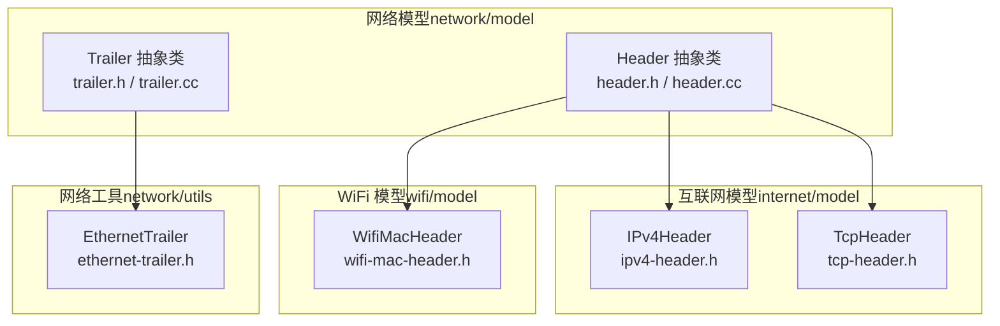
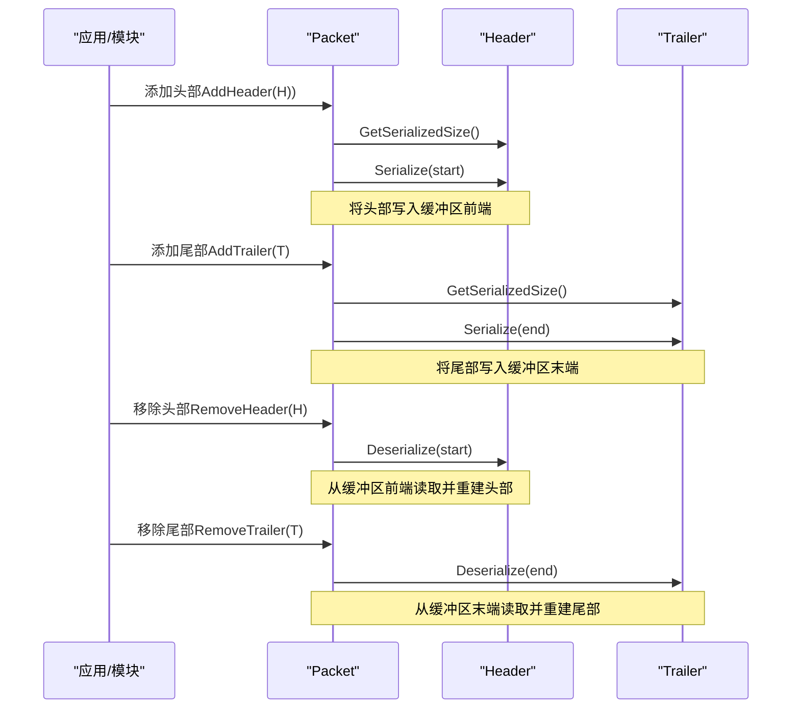
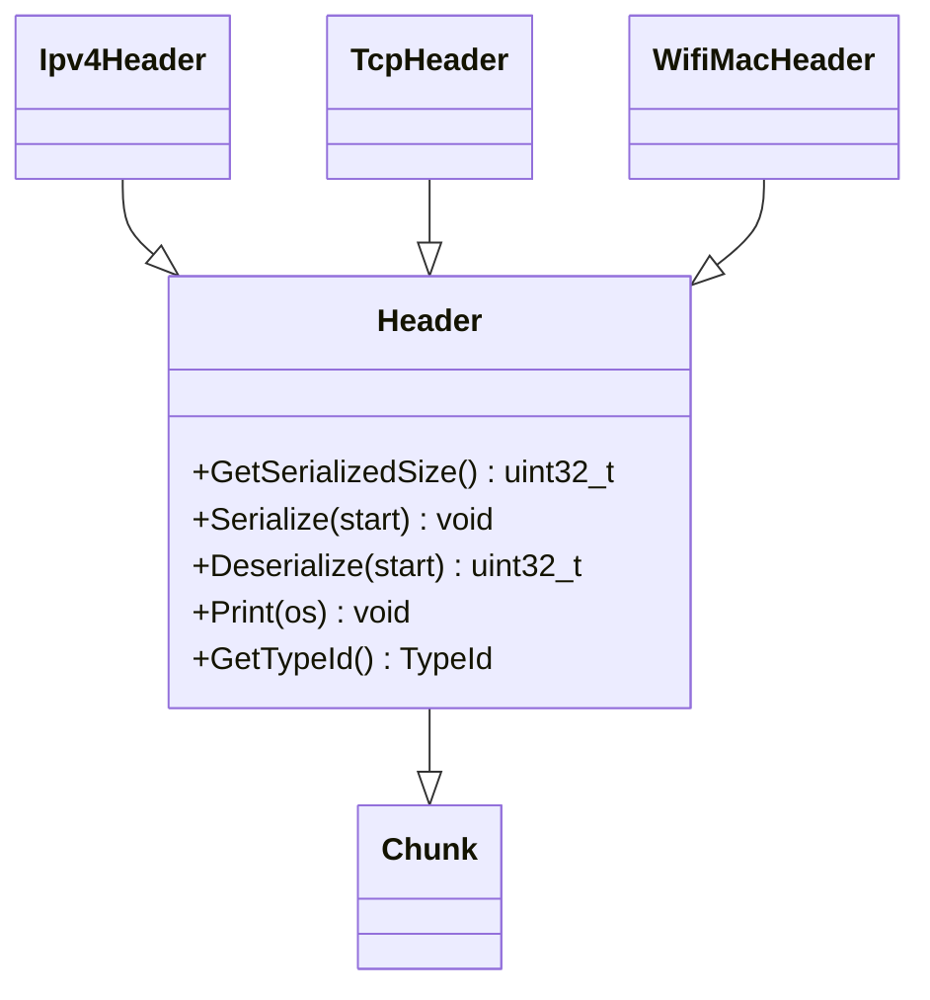
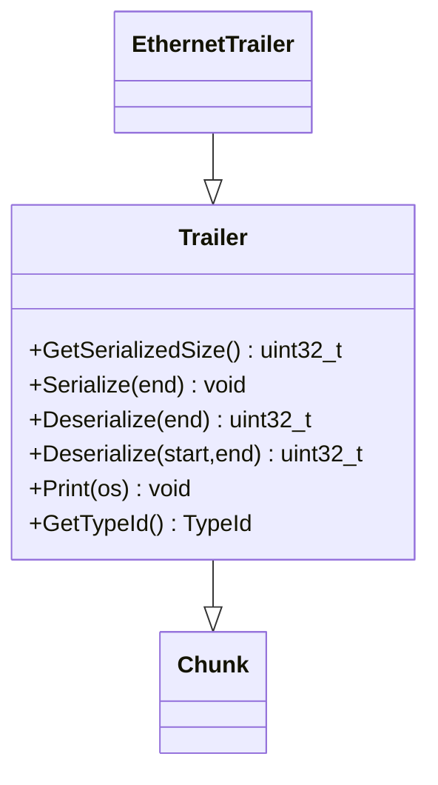
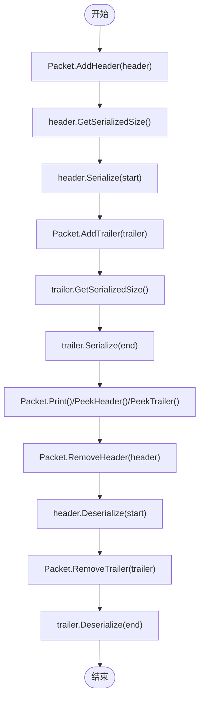
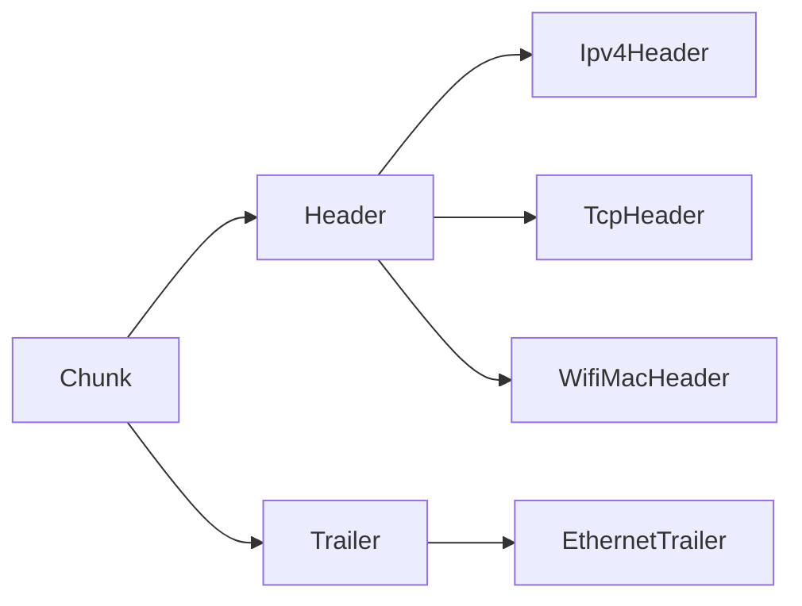

# 头部和尾部结构（Header & Trailer）

<cite>
**本文引用的文件**
- [header.h](file://simulator/ns-3.39/src/network/model/header.h)
- [header.cc](file://simulator/ns-3.39/src/network/model/header.cc)
- [trailer.h](file://simulator/ns-3.39/src/network/model/trailer.h)
- [trailer.cc](file://simulator/ns-3.39/src/network/model/trailer.cc)
- [ipv4-header.h](file://simulator/ns-3.39/src/internet/model/ipv4-header.h)
- [tcp-header.h](file://simulator/ns-3.39/src/internet/model/tcp-header.h)
- [wifi-mac-header.h](file://simulator/ns-3.39/src/wifi/model/wifi-mac-header.h)
- [ethernet-trailer.h](file://simulator/ns-3.39/src/network/utils/ethernet-trailer.h)
- [packet-test-suite.cc](file://simulator/ns-3.39/src/network/test/packet-test-suite.cc)
</cite>

## 目录
1. [简介](#简介)
2. [项目结构](#项目结构)
3. [核心组件](#核心组件)
4. [架构总览](#架构总览)
5. [详细组件分析](#详细组件分析)
6. [依赖关系分析](#依赖关系分析)
7. [性能考量](#性能考量)
8. [故障排查指南](#故障排查指南)
9. [结论](#结论)
10. [附录：常见协议头部与尾部示例](#附录常见协议头部与尾部示例)

## 简介
本文件系统性梳理 NS-3 中“头部（Header）”与“尾部（Trailer）”的抽象设计与实现机制，覆盖以下主题：
- Header/Trailer 基类的设计理念与继承体系
- 核心方法：GetSerializedSize、Serialize、Deserialize 的职责与调用时机
- 数据包中头部/尾部的添加、移除与查看流程
- 序列化顺序与数据布局（头部在前、尾部在后）
- 典型协议头部示例：IPv4Header、TcpHeader、WifiMacHeader
- 典型协议尾部示例：EthernetTrailer
- 在不同网络层的应用场景与自定义头部/尾部的开发方法
- 调试技巧与性能优化建议

## 项目结构
与 Header/Trailer 相关的核心源码位于 network 模块的 model 层，典型路径如下：
- Header 抽象类：src/network/model/header.h、header.cc
- Trailer 抽象类：src/network/model/trailer.h、trailer.cc
- 协议头部示例：src/internet/model/ipv4-header.h、tcp-header.h、src/wifi/model/wifi-mac-header.h
- 协议尾部示例：src/network/utils/ethernet-trailer.h
- 测试用例（含自定义 Header/Trailer 示例）：src/network/test/packet-test-suite.cc

**图表来源**
- [header.h:1-119](file://simulator/ns-3.39/src/network/model/header.h#L1-L119)
- [trailer.h:1-130](file://simulator/ns-3.39/src/network/model/trailer.h#L1-L130)
- [ipv4-header.h:1-271](file://simulator/ns-3.39/src/internet/model/ipv4-header.h#L1-L271)
- [tcp-header.h:1-358](file://simulator/ns-3.39/src/internet/model/tcp-header.h#L1-L358)
- [wifi-mac-header.h:1-706](file://simulator/ns-3.39/src/wifi/model/wifi-mac-header.h#L1-L706)
- [ethernet-trailer.h:1-116](file://simulator/ns-3.39/src/network/utils/ethernet-trailer.h#L1-L116)

**章节来源**
- [header.h:1-119](file://simulator/ns-3.39/src/network/model/header.h#L1-L119)
- [trailer.h:1-130](file://simulator/ns-3.39/src/network/model/trailer.h#L1-L130)

## 核心组件
- Header 抽象类
  - 职责：定义协议头部的序列化/反序列化接口，用于将头部写入或从 Packet 的缓冲区中读出
  - 关键方法：
    - GetSerializedSize：返回头部字节长度（供 Packet::AddHeader 预分配空间）
    - Serialize(Buffer::Iterator)：将头部按位精确地写入缓冲区
    - Deserialize(Buffer::Iterator)：从缓冲区读取并重建头部
    - Print(std::ostream&)：以人类可读方式打印头部内容
- Trailer 抽象类
  - 职责：定义协议尾部的序列化/反序列化接口，通常用于帧校验（如 FCS）
  - 关键方法：
    - GetSerializedSize：返回尾部字节长度（供 Packet::AddTrailer 预分配空间）
    - Serialize(Buffer::Iterator)：将尾部按位精确地写入缓冲区末尾
    - Deserialize(Buffer::Iterator)：从缓冲区末尾读取并重建尾部
    - Deserialize(Buffer::Iterator start, Buffer::Iterator end)：可选变体，支持范围读取
    - Print(std::ostream&)：以人类可读方式打印尾部内容

两者均继承自 Chunk，作为 Packet 内部的可序列化片段参与整体打包/解包。

**章节来源**
- [header.h:43-105](file://simulator/ns-3.39/src/network/model/header.h#L43-L105)
- [header.cc:36-48](file://simulator/ns-3.39/src/network/model/header.cc#L36-L48)
- [trailer.h:40-116](file://simulator/ns-3.39/src/network/model/trailer.h#L40-L116)
- [trailer.cc:36-56](file://simulator/ns-3.39/src/network/model/trailer.cc#L36-L56)

## 架构总览
下图展示 Header/Trailer 在 Packet 打包/解包过程中的协作关系与调用时序。

**图表来源**
- [header.h:62-91](file://simulator/ns-3.39/src/network/model/header.h#L62-L91)
- [trailer.h:57-102](file://simulator/ns-3.39/src/network/model/trailer.h#L57-L102)

## 详细组件分析

### Header 抽象类与继承体系
- 设计要点
  - Header 继承自 Chunk，作为 Packet 的有序片段之一
  - GetSerializedSize 返回固定或动态长度，用于预分配缓冲区
  - Serialize/Deserialize 保证与真实网络头部的二进制表示一致
  - Print 提供统一的人类可读输出格式，便于调试
- 继承关系示意

**图表来源**
- [header.h:43-105](file://simulator/ns-3.39/src/network/model/header.h#L43-L105)
- [ipv4-header.h:33-242](file://simulator/ns-3.39/src/internet/model/ipv4-header.h#L33-L242)
- [tcp-header.h:45-300](file://simulator/ns-3.39/src/internet/model/tcp-header.h#L45-L300)
- [wifi-mac-header.h:97-141](file://simulator/ns-3.39/src/wifi/model/wifi-mac-header.h#L97-L141)

**章节来源**
- [header.h:43-105](file://simulator/ns-3.39/src/network/model/header.h#L43-L105)
- [ipv4-header.h:33-242](file://simulator/ns-3.39/src/internet/model/ipv4-header.h#L33-L242)
- [tcp-header.h:45-300](file://simulator/ns-3.39/src/internet/model/tcp-header.h#L45-L300)
- [wifi-mac-header.h:97-141](file://simulator/ns-3.39/src/wifi/model/wifi-mac-header.h#L97-L141)

### Trailer 抽象类与继承体系
- 设计要点
  - Trailer 同样继承自 Chunk
  - Serialize/Deserialize 面向缓冲区末尾，使用 Buffer::Iterator::Prev 进行逆序写入/读取
  - 提供双参数 Deserialize(start,end) 支持可变长尾部的范围解析
  - Print 提供统一输出格式
- 继承关系示意

**图表来源**
- [trailer.h:40-116](file://simulator/ns-3.39/src/network/model/trailer.h#L40-L116)
- [ethernet-trailer.h:39-102](file://simulator/ns-3.39/src/network/utils/ethernet-trailer.h#L39-L102)

**章节来源**
- [trailer.h:40-116](file://simulator/ns-3.39/src/network/model/trailer.h#L40-L116)
- [ethernet-trailer.h:39-102](file://simulator/ns-3.39/src/network/utils/ethernet-trailer.h#L39-L102)

### 核心方法实现机制详解

#### Header::GetSerializedSize / Serialize / Deserialize
- GetSerializedSize
  - 作用：返回头部字节数，供 Packet 预分配空间
  - 调用方：Packet::AddHeader
- Serialize(Buffer::Iterator start)
  - 作用：将头部按位精确写入缓冲区（通常从起始位置开始写）
  - 注意：迭代器指向写入起点；具体写入顺序由子类决定
- Deserialize(Buffer::Iterator start)
  - 作用：从缓冲区读取并重建头部
  - 调用方：Packet::RemoveHeader/Packet::PeekHeader

**章节来源**
- [header.h:62-91](file://simulator/ns-3.39/src/network/model/header.h#L62-L91)

#### Trailer::GetSerializedSize / Serialize / Deserialize
- GetSerializedSize
  - 作用：返回尾部字节数，供 Packet 预分配空间
  - 调用方：Packet::AddTrailer
- Serialize(Buffer::Iterator end)
  - 作用：将尾部按位精确写入缓冲区末尾
  - 注意：迭代器指向写入终点（通常为缓冲区末尾），子类需使用 Prev 逆序写入
- Deserialize(Buffer::Iterator end)
  - 作用：从缓冲区末尾读取并重建尾部
  - 变体 Deserialize(start,end)：支持可变长尾部的范围解析
- 默认行为
  - 双参数 Deserialize(start,end) 默认委托到单参数 Deserialize(end)，兼容旧实现

**章节来源**
- [trailer.h:57-102](file://simulator/ns-3.39/src/network/model/trailer.h#L57-L102)
- [trailer.cc:43-49](file://simulator/ns-3.39/src/network/model/trailer.cc#L43-L49)

### 数据包中的添加、移除与查看流程

**图表来源**
- [header.h:62-91](file://simulator/ns-3.39/src/network/model/header.h#L62-L91)
- [trailer.h:57-102](file://simulator/ns-3.39/src/network/model/trailer.h#L57-L102)

### 序列化顺序与数据布局
- 顺序规则
  - 头部在前：Packet 缓冲区前端存放头部
  - 尾部在后：Packet 缓冲区末端存放尾部
- 数据布局
  - 头部与尾部均以二进制形式精确映射到网络标准格式
  - 反序列化时严格遵循字段顺序与位宽

**章节来源**
- [header.h:67-72](file://simulator/ns-3.39/src/network/model/header.h#L67-L72)
- [trailer.h:64-69](file://simulator/ns-3.39/src/network/model/trailer.h#L64-L69)

### 自定义头部/尾部开发指南
- 开发步骤
  - 新建类继承 Header 或 Trailer
  - 实现 GetSerializedSize、Serialize、Deserialize、Print
  - 注册类型（GetTypeId/SetParent），设置组名与文档隐藏策略
  - 在 Packet 上通过 AddHeader/AddTrailer 安装，RemoveHeader/RemoveTrailer 移除
- 测试参考
  - 可参考测试套件中的自定义 Header/Trailer 示例，验证序列化/反序列化正确性

**章节来源**
- [packet-test-suite.cc:339-382](file://simulator/ns-3.39/src/network/test/packet-test-suite.cc#L339-L382)
- [header.h:49-50](file://simulator/ns-3.39/src/network/model/header.h#L49-L50)
- [trailer.h:46-47](file://simulator/ns-3.39/src/network/model/trailer.h#L46-L47)

## 依赖关系分析
- Header/Trailer 依赖关系
  - Header/Trailer 均继承自 Chunk
  - 具体协议头/尾依赖于各自协议模型（如 Internet、WiFi）
- 关键外部依赖
  - Buffer/Buffer::Iterator：提供字节级读写与逆序访问能力
  - TypeId：对象注册与类型识别
  - 日志组件：NS_LOG_FUNCTION 记录生命周期与关键事件

**图表来源**
- [header.h:43](file://simulator/ns-3.39/src/network/model/header.h#L43)
- [trailer.h:40](file://simulator/ns-3.39/src/network/model/trailer.h#L40)
- [ipv4-header.h:33](file://simulator/ns-3.39/src/internet/model/ipv4-header.h#L33)
- [tcp-header.h:45](file://simulator/ns-3.39/src/internet/model/tcp-header.h#L45)
- [wifi-mac-header.h:97](file://simulator/ns-3.39/src/wifi/model/wifi-mac-header.h#L97)
- [ethernet-trailer.h:39](file://simulator/ns-3.39/src/network/utils/ethernet-trailer.h#L39)

**章节来源**
- [header.h:23-24](file://simulator/ns-3.39/src/network/model/header.h#L23-L24)
- [trailer.h:23-24](file://simulator/ns-3.39/src/network/model/trailer.h#L23-L24)

## 性能考量
- 预分配与拷贝
  - 使用 GetSerializedSize 预先计算大小，避免多次扩容
  - 尽量减少不必要的缓冲区复制（例如批量序列化时复用迭代器）
- 反序列化成本
  - 对可变长尾部，优先使用 Deserialize(start,end) 精确范围读取，降低错误分支开销
- 校验与调试
  - 合理启用校验（如 IPv4/TCP 校验和、Ethernet FCS），在性能与可靠性之间权衡
- 输出与日志
  - Print 方法仅在调试阶段使用，避免在高频路径中频繁调用

## 故障排查指南
- 常见问题
  - 字段顺序错误：确保 Serialize/Deserialize 与协议规范一致
  - 长度不匹配：检查 GetSerializedSize 与实际写入/读取字节数
  - 校验失败：确认 EnableChecksum/EnableFcs 已正确初始化，并在正确的上下文中计算
- 调试技巧
  - 使用 Packet::Print 查看头部/尾部人类可读输出
  - 在构造函数/析构函数中记录日志，定位生命周期异常
  - 在测试中使用自定义 Header/Trailer 验证边界条件与错误输入

**章节来源**
- [header.cc:31-34](file://simulator/ns-3.39/src/network/model/header.cc#L31-L34)
- [trailer.cc:31-34](file://simulator/ns-3.39/src/network/model/trailer.cc#L31-L34)
- [packet-test-suite.cc:357-382](file://simulator/ns-3.39/src/network/test/packet-test-suite.cc#L357-L382)

## 结论
Header/Trailer 抽象类为 NS-3 的分层网络仿真提供了统一且严格的协议头部/尾部序列化框架。通过明确的接口约定与严谨的数据布局，开发者可以在各网络层快速实现自定义协议头部与尾部，并在 Packet 生命周期内安全地进行添加、移除与查看。配合测试与调试手段，可在保证正确性的同时兼顾性能表现。

## 附录：常见协议头部与尾部示例

### IPv4Header
- 角色：网络层头部，封装 IPv4 报文元信息（源/目的地址、TTL、协议、标识、分片等）
- 关键点
  - 支持 DSCP/ECN 设置与校验和控制
  - 分片相关标志与偏移字段
- 应用场景：IP 层转发、路由决策、分片重组

**章节来源**
- [ipv4-header.h:33-242](file://simulator/ns-3.39/src/internet/model/ipv4-header.h#L33-L242)

### TcpHeader
- 角色：传输层头部，封装 TCP 连接与控制信息（端口、序列号、标志、窗口、选项等）
- 关键点
  - 支持可变长选项列表（最大 40 字节）
  - 提供校验和初始化与校验逻辑
- 应用场景：可靠传输、拥塞控制、流量控制

**章节来源**
- [tcp-header.h:45-300](file://simulator/ns-3.39/src/internet/model/tcp-header.h#L45-L300)

### WifiMacHeader
- 角色：链路层头部，封装 802.11 MAC 控制/管理/数据帧头
- 关键点
  - 类型/子类型枚举覆盖控制帧、管理帧与数据帧
  - 支持 QoS 参数（TID、ACK 策略、EOSP、A-MSDU 等）
- 应用场景：无线局域网帧调度、关联/认证、QoS 保障

**章节来源**
- [wifi-mac-header.h:97-141](file://simulator/ns-3.39/src/wifi/model/wifi-mac-header.h#L97-L141)

### EthernetTrailer
- 角色：链路层尾部，封装以太网帧校验（FCS）
- 关键点
  - 支持启用/禁用 FCS 计算与校验
  - 提供手动设置与自动计算两种模式
- 应用场景：链路层完整性检测

**章节来源**
- [ethernet-trailer.h:39-102](file://simulator/ns-3.39/src/network/utils/ethernet-trailer.h#L39-L102)