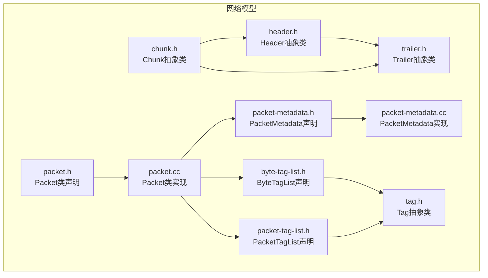
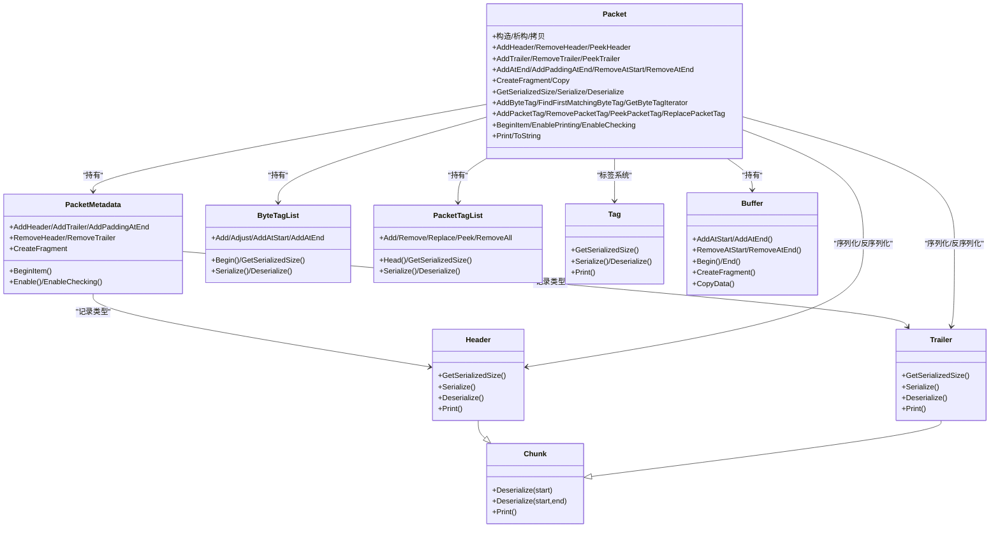
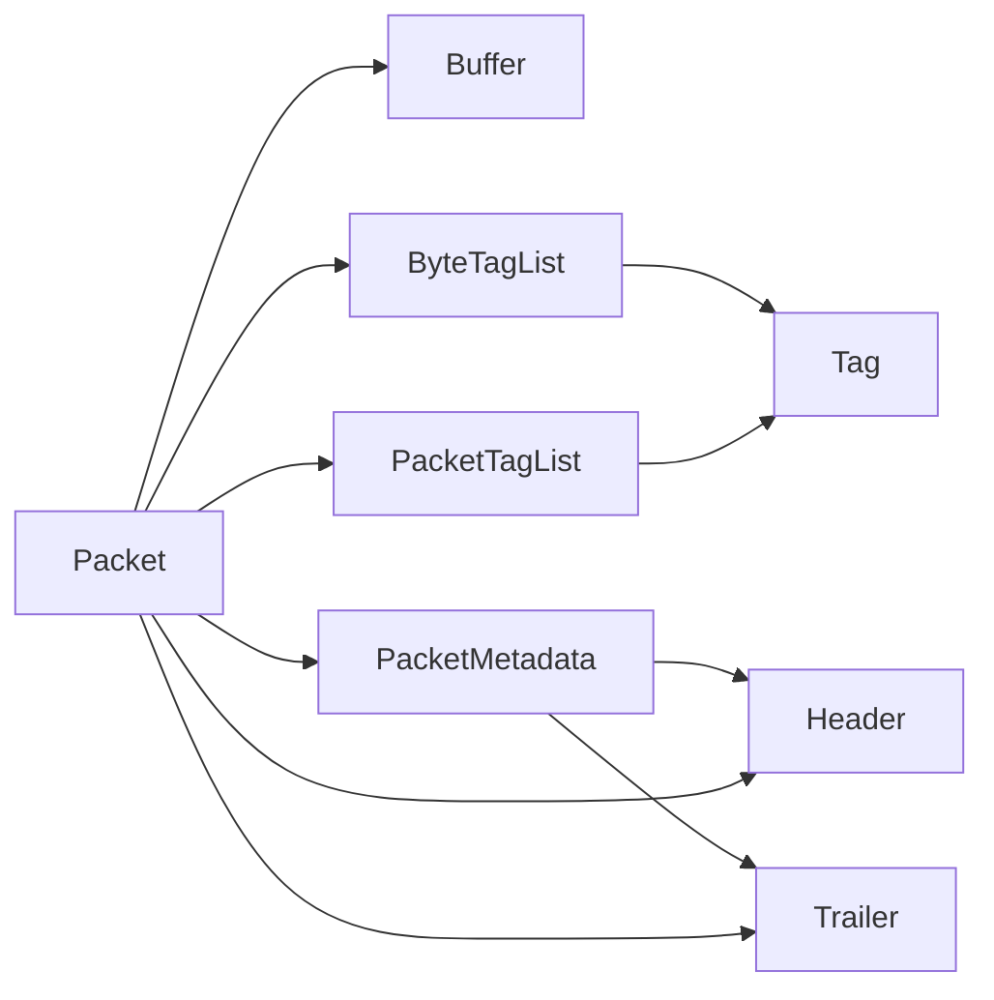

# 数据包处理（Packet Processing）

<cite>
**本文引用的文件**
- [packet.h](file://simulator/ns-3.39/src/network/model/packet.h)
- [packet.cc](file://simulator/ns-3.39/src/network/model/packet.cc)
- [header.h](file://simulator/ns-3.39/src/network/model/header.h)
- [trailer.h](file://simulator/ns-3.39/src/network/model/trailer.h)
- [chunk.h](file://simulator/ns-3.39/src/network/model/chunk.h)
- [packet-metadata.h](file://simulator/ns-3.39/src/network/model/packet-metadata.h)
- [packet-metadata.cc](file://simulator/ns-3.39/src/network/model/packet-metadata.cc)
- [byte-tag-list.h](file://simulator/ns-3.39/src/network/model/byte-tag-list.h)
- [packet-tag-list.h](file://simulator/ns-3.39/src/network/model/packet-tag-list.h)
- [tag.h](file://simulator/ns-3.39/src/network/model/tag.h)
- [packets.rst](file://simulator/ns-3.39/src/network/doc/packets.rst)
</cite>

## 目录
1. [简介](#简介)
2. [项目结构](#项目结构)
3. [核心组件](#核心组件)
4. [架构总览](#架构总览)
5. [详细组件分析](#详细组件分析)
6. [依赖关系分析](#依赖关系分析)
7. [性能考量](#性能考量)
8. [故障排查指南](#故障排查指南)
9. [结论](#结论)
10. [附录：常见用法与示例路径](#附录常见用法与示例路径)

## 简介
本文件面向NS-3网络仿真器中的“数据包处理”子系统，围绕Packet类及其配套组件（Header、Trailer、Chunk、PacketMetadata、ByteTagList、PacketTagList、Tag）进行系统化API文档编写。内容覆盖数据包的构造、序列化/反序列化、头部与尾部的添加/移除/窥视、元数据管理、字节级与包级标签系统、数据在仿真网络中的传递流程与时点、性能优化建议以及调试与故障排查技巧。

## 项目结构
与数据包处理直接相关的核心源码位于network模型目录下，主要文件如下：
- Packet类定义与实现：packet.h、packet.cc
- 协议头/尾抽象基类：header.h、trailer.h、chunk.h
- 元数据管理：packet-metadata.h、packet-metadata.cc
- 标签系统：byte-tag-list.h、packet-tag-list.h、tag.h
- 文档与示例参考：packets.rst

图表来源
- [packet.h:1-873](file://simulator/ns-3.39/src/network/model/packet.h#L1-L873)
- [packet.cc:1-1058](file://simulator/ns-3.39/src/network/model/packet.cc#L1-L1058)
- [header.h:1-119](file://simulator/ns-3.39/src/network/model/header.h#L1-L119)
- [trailer.h:1-130](file://simulator/ns-3.39/src/network/model/trailer.h#L1-L130)
- [chunk.h:1-81](file://simulator/ns-3.39/src/network/model/chunk.h#L1-L81)
- [packet-metadata.h:1-487](file://simulator/ns-3.39/src/network/model/packet-metadata.h#L1-L487)
- [packet-metadata.cc:1-789](file://simulator/ns-3.39/src/network/model/packet-metadata.cc#L1-L789)
- [byte-tag-list.h:1-302](file://simulator/ns-3.39/src/network/model/byte-tag-list.h#L1-L302)
- [packet-tag-list.h:1-384](file://simulator/ns-3.39/src/network/model/packet-tag-list.h#L1-L384)
- [tag.h:1-83](file://simulator/ns-3.39/src/network/model/tag.h#L1-L83)

章节来源
- [packet.h:1-873](file://simulator/ns-3.39/src/network/model/packet.h#L1-L873)
- [packet.cc:1-1058](file://simulator/ns-3.39/src/network/model/packet.cc#L1-L1058)

## 核心组件
- Packet：网络数据包的统一容器，内含字节缓冲区、字节级标签列表、包级标签列表、以及可选的PacketMetadata元数据。支持构造、序列化/反序列化、头部/尾部操作、片段创建、标签迭代与查询、打印与调试等。
- Header/Trailer/Chunk：协议头/尾的抽象基类，定义了序列化、反序列化、打印接口；Packet通过调用这些接口将协议头/尾写入或从缓冲区读出。
- PacketMetadata：可选的元数据系统，记录每个被加入/移除的头部、尾部、填充及片段信息，用于打印与一致性检查。
- ByteTagList/PacketTagList/Tag：两类标签系统。ByteTag作用于字节范围，随字节移动；PacketTag作用于包整体，随包复制/分片行为遵循不同规则。
- Buffer：底层字节缓冲区抽象，为Packet提供可变长的字节存储与迭代器访问能力。

章节来源
- [packet.h:190-800](file://simulator/ns-3.39/src/network/model/packet.h#L190-L800)
- [packet.cc:268-800](file://simulator/ns-3.39/src/network/model/packet.cc#L268-L800)
- [header.h:31-119](file://simulator/ns-3.39/src/network/model/header.h#L31-L119)
- [trailer.h:31-130](file://simulator/ns-3.39/src/network/model/trailer.h#L31-L130)
- [chunk.h:30-81](file://simulator/ns-3.39/src/network/model/chunk.h#L30-L81)
- [packet-metadata.h:40-487](file://simulator/ns-3.39/src/network/model/packet-metadata.h#L40-L487)
- [byte-tag-list.h:34-302](file://simulator/ns-3.39/src/network/model/byte-tag-list.h#L34-L302)
- [packet-tag-list.h:37-384](file://simulator/ns-3.39/src/network/model/packet-tag-list.h#L37-L384)
- [tag.h:31-83](file://simulator/ns-3.39/src/network/model/tag.h#L31-L83)

## 架构总览
Packet类作为核心枢纽，协调以下子系统：
- 底层缓冲区Buffer：负责实际字节存储与迭代。
- 头部/尾部系统：通过Header/Trailer接口，将协议头/尾序列化到缓冲区前端或后端，并维护ByteTagList以标注字节范围。
- 元数据系统：PacketMetadata记录每次头部/尾部/填充/片段操作，支持打印与运行时一致性检查。
- 标签系统：ByteTagList与PacketTagList分别管理字节级与包级标签，均支持序列化/反序列化与迭代。

图表来源
- [packet.h:190-800](file://simulator/ns-3.39/src/network/model/packet.h#L190-L800)
- [packet.cc:268-800](file://simulator/ns-3.39/src/network/model/packet.cc#L268-L800)
- [header.h:31-119](file://simulator/ns-3.39/src/network/model/header.h#L31-L119)
- [trailer.h:31-130](file://simulator/ns-3.39/src/network/model/trailer.h#L31-L130)
- [chunk.h:30-81](file://simulator/ns-3.39/src/network/model/chunk.h#L30-L81)
- [packet-metadata.h:40-487](file://simulator/ns-3.39/src/network/model/packet-metadata.h#L40-L487)
- [byte-tag-list.h:34-302](file://simulator/ns-3.39/src/network/model/byte-tag-list.h#L34-L302)
- [packet-tag-list.h:37-384](file://simulator/ns-3.39/src/network/model/packet-tag-list.h#L37-L384)
- [tag.h:31-83](file://simulator/ns-3.39/src/network/model/tag.h#L31-L83)

## 详细组件分析

### Packet类：数据包核心
- 构造与生命周期
  - 默认构造、零填充构造、从缓冲区构造、从序列化缓冲区构造（需magic开关）、拷贝构造与赋值。
  - 片段创建：CreateFragment基于共享缓冲区与偏移生成新Packet，同时调整ByteTagList与PacketMetadata。
- 序列化/反序列化
  - GetSerializedSize按顺序计算NixVector、包级标签、字节级标签、元数据、缓冲区各部分所需空间并按4字节对齐。
  - Serialize按固定顺序写入各部分长度与内容，确保边界安全。
  - Deserialize从输入缓冲区恢复各子系统状态。
- 头部/尾部处理
  - AddHeader/RemoveHeader/PeekHeader：在缓冲区前端写入/移除/窥视，同步更新ByteTagList与PacketMetadata。
  - AddTrailer/RemoveTrailer/PeekTrailer：在缓冲区末端写入/移除/窥视，同步更新PacketMetadata。
- 字节/包级标签
  - 字节级标签：AddByteTag（全包或指定范围），通过ByteTagList记录起止位置与序列化数据；GetByteTagIterator遍历；PrintByteTags打印。
  - 包级标签：AddPacketTag/RemovePacketTag/PeekPacketTag/ReplacePacketTag，通过PacketTagList管理，支持COW语义。
- 元数据与打印
  - EnablePrinting/EnableChecking启用元数据记录与校验；BeginItem/Print/ToString用于调试输出。
- 迭代器
  - ByteTagIterator/PacketTagIterator提供Java风格遍历，便于统计与分析。

章节来源
- [packet.h:238-800](file://simulator/ns-3.39/src/network/model/packet.h#L238-L800)
- [packet.cc:130-800](file://simulator/ns-3.39/src/network/model/packet.cc#L130-L800)
- [packets.rst:377-631](file://simulator/ns-3.39/src/network/doc/packets.rst#L377-L631)

### Header/Trailer/Chunk：协议头/尾抽象
- Chunk：定义通用反序列化接口（固定/可变大小）与打印接口。
- Header：派生自Chunk，要求实现序列化/反序列化/打印，且序列化结果应与真实网络头一致。
- Trailer：派生自Chunk，序列化/反序列化从缓冲区末端开始，支持可变长度场景。

章节来源
- [chunk.h:30-81](file://simulator/ns-3.39/src/network/model/chunk.h#L30-L81)
- [header.h:31-119](file://simulator/ns-3.39/src/network/model/header.h#L31-L119)
- [trailer.h:31-130](file://simulator/ns-3.39/src/network/model/trailer.h#L31-L130)

### PacketMetadata：元数据管理
- 记录项结构：Item包含类型（头部/尾部/负载）、原始大小、类型UID、实例UID、片段起止等。
- 链表存储：以小项/扩展项形式扁平化存储于2^16-1字节上限的缓冲区中，采用ULEB128等编码策略。
- 操作接口：AddHeader/RemoveHeader/AddTrailer/RemoveTrailer/AddPaddingAtEnd/RemoveAtStart/RemoveAtEnd/CreateFragment等，配合Packet类同步维护。
- 调试与校验：Enable/EnableChecking控制打印与运行时一致性检查；IsStateOk断言内部一致性。

章节来源
- [packet-metadata.h:40-487](file://simulator/ns-3.39/src/network/model/packet-metadata.h#L40-L487)
- [packet-metadata.cc:724-789](file://simulator/ns-3.39/src/network/model/packet-metadata.cc#L724-L789)

### ByteTagList/Tag：字节级标签系统
- 存储布局：单缓冲区存储每条标签的类型ID、数据大小、起止偏移与序列化数据；支持COW共享与延迟解耦。
- 接口要点：Add/Adjust/AddAtStart/AddAtEnd/Begin/GetSerializedSize/Semantic Serialize/Deserialize。
- 使用注意：偏移相对虚拟字节缓冲区；当包增长/缩小或插入/删除字节时，ByteTagList会自动调整或裁剪标签范围。

章节来源
- [byte-tag-list.h:34-302](file://simulator/ns-3.39/src/network/model/byte-tag-list.h#L34-L302)
- [tag.h:31-83](file://simulator/ns-3.39/src/network/model/tag.h#L31-L83)

### PacketTagList/Tag：包级标签系统
- 结构：以TagData树形链表存储序列化标签，支持COW语义：Add不改原链，Copy仅增加计数，Remove/Replace在必要时复制共享分支。
- 接口要点：Add/Remove/Replace/Peek/RemoveAll/Head/GetSerializedSize/Semantic Serialize/Deserialize。
- 语义差异：字节级标签随字节移动，包级标签随包移动；删除语义上，字节标签不可移除，包级标签可精确移除一次。

章节来源
- [packet-tag-list.h:37-384](file://simulator/ns-3.39/src/network/model/packet-tag-list.h#L37-L384)
- [tag.h:31-83](file://simulator/ns-3.39/src/network/model/tag.h#L31-L83)

## 依赖关系分析
- 组件耦合
  - Packet强依赖Buffer、ByteTagList、PacketTagList、PacketMetadata；弱依赖Header/Trailer/Chunk接口。
  - PacketMetadata与Header/Trailer类型ID绑定，形成“类型-尺寸-位置”的记录链。
  - ByteTagList与PacketTagList均依赖Tag接口完成序列化/反序列化。
- 可能的循环依赖
  - 无直接循环：Packet包含各子系统；各子系统不反向依赖Packet。
- 外部依赖
  - 类型系统（TypeId）、日志（Log）、致命错误（FatalError）、SIM_ID（分布式仿真系统标识）等。

图表来源
- [packet.h:22-29](file://simulator/ns-3.39/src/network/model/packet.h#L22-L29)
- [packet-metadata.h:22-38](file://simulator/ns-3.39/src/network/model/packet-metadata.h#L22-L38)
- [byte-tag-list.h:22-26](file://simulator/ns-3.39/src/network/model/byte-tag-list.h#L22-L26)
- [packet-tag-list.h:26-31](file://simulator/ns-3.39/src/network/model/packet-tag-list.h#L26-L31)

章节来源
- [packet.h:22-29](file://simulator/ns-3.39/src/network/model/packet.h#L22-L29)
- [packet-metadata.h:22-38](file://simulator/ns-3.39/src/network/model/packet-metadata.h#L22-L38)
- [byte-tag-list.h:22-26](file://simulator/ns-3.39/src/network/model/byte-tag-list.h#L22-L26)
- [packet-tag-list.h:26-31](file://simulator/ns-3.39/src/network/model/packet-tag-list.h#L26-L31)

## 性能考量
- 写时复制（COW）
  - PacketTagList与ByteTagList均采用COW，复制/分片时避免深拷贝，显著降低内存与CPU开销。
- 对齐与边界
  - 各子系统序列化时采用4字节对齐，GetSerializedSize/Serialize严格计算，避免越界与额外拷贝。
- 元数据成本
  - EnablePrinting/EnableChecking会带来额外开销；仅在调试阶段启用。
- 头/尾操作复杂度
  - 在包前端/末端插入/删除为O(1)（缓冲区迭代器+元数据链表），但涉及标签调整与元数据维护。
- 标签遍历
  - ByteTagIterator/PacketTagIterator为线性遍历，注意在高频路径中避免频繁打印与深度拷贝。

[本节为通用性能讨论，无需列出具体文件来源]

## 故障排查指南
- 打印与调试
  - 启用元数据打印：调用Packet::EnablePrinting后，可通过Packet::Print/ToString查看头部/尾部/负载的顺序与尺寸。
  - 启用元数据校验：调用Packet::EnableChecking，运行时对头部/尾部匹配进行断言，快速定位错配问题。
- 常见问题定位
  - 头/尾移除失败：若RemoveHeader/RemoveTrailer返回值小于期望，检查是否与AddHeader/AddTrailer顺序一致，或是否存在可变长头/尾未提供正确size。
  - 标签读取异常：ByteTagIterator::Item::GetTag会进行类型校验，若类型不匹配将触发致命错误；确认Add时使用的Tag类型与Peek/Remove时一致。
  - 分片后标签错位：CreateFragment会调整ByteTagList偏移，确保标签范围与字节范围一致；如发现越界，检查起止参数。
- 日志与断言
  - PacketMetadata在Add/Remove时进行状态断言，若出现异常，优先检查EnableChecking是否开启并观察断言位置。

章节来源
- [packet.cc:596-607](file://simulator/ns-3.39/src/network/model/packet.cc#L596-L607)
- [packet-metadata.cc:724-789](file://simulator/ns-3.39/src/network/model/packet-metadata.cc#L724-L789)
- [byte-tag-list.h:102-154](file://simulator/ns-3.39/src/network/model/byte-tag-list.h#L102-L154)

## 结论
NS-3的数据包处理系统以Packet为核心，通过Header/Trailer/Chunk抽象协议头/尾，借助PacketMetadata记录元数据，结合ByteTagList与PacketTagList实现灵活的标签体系。其设计兼顾性能（COW、对齐、最小化拷贝）与可调试性（可选打印与校验）。遵循本文档的构造、序列化/反序列化、头部/尾部与标签使用规范，可在保证正确性的前提下获得良好的仿真性能。

[本节为总结性内容，无需列出具体文件来源]

## 附录：常见用法与示例路径
- 创建与修改数据包
  - 默认构造、零填充构造、从缓冲区构造、从序列化缓冲区构造、拷贝与片段创建
  - 添加/移除/窥视头部与尾部
  - 追加/删除字节与填充
  - 参考路径：[packet.h:245-303](file://simulator/ns-3.39/src/network/model/packet.h#L245-L303)、[packet.cc:139-253](file://simulator/ns-3.39/src/network/model/packet.cc#L139-L253)
- 序列化与反序列化
  - 获取序列化大小、序列化到缓冲区、从缓冲区反序列化
  - 参考路径：[packet.h:551-561](file://simulator/ns-3.39/src/network/model/packet.h#L551-L561)、[packet.cc:609-800](file://simulator/ns-3.39/src/network/model/packet.cc#L609-L800)
- 头部/尾部处理
  - 固定/可变长度头部/尾部的添加/移除/窥视
  - 参考路径：[header.h:53-104](file://simulator/ns-3.39/src/network/model/header.h#L53-L104)、[trailer.h:49-115](file://simulator/ns-3.39/src/network/model/trailer.h#L49-L115)、[packet.cc:268-351](file://simulator/ns-3.39/src/network/model/packet.cc#L268-L351)
- 标签系统
  - 字节级标签：AddByteTag（全包/范围）、迭代、查找、打印
  - 包级标签：AddPacketTag/RemovePacketTag/PeekPacketTag/ReplacePacketTag、迭代
  - 参考路径：[packets.rst:377-631](file://simulator/ns-3.39/src/network/doc/packets.rst#L377-L631)、[byte-tag-list.h:189-263](file://simulator/ns-3.39/src/network/model/byte-tag-list.h#L189-L263)、[packet-tag-list.h:186-244](file://simulator/ns-3.39/src/network/model/packet-tag-list.h#L186-L244)