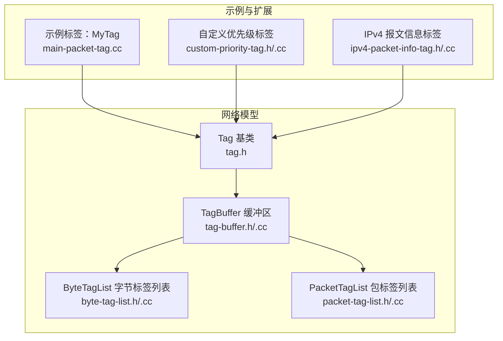
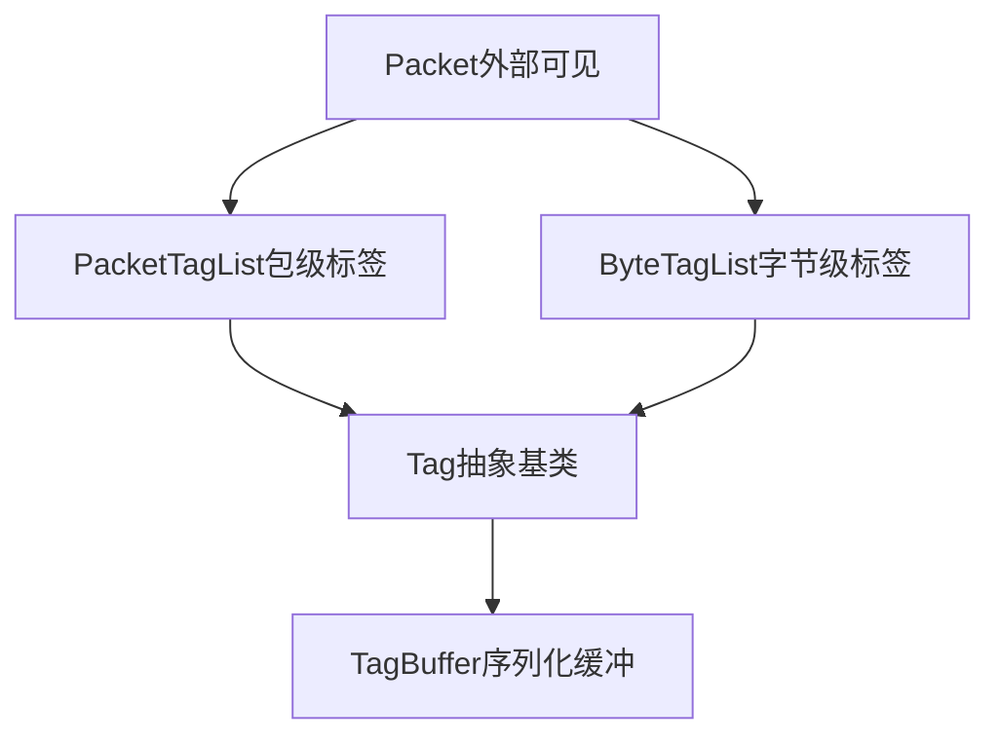
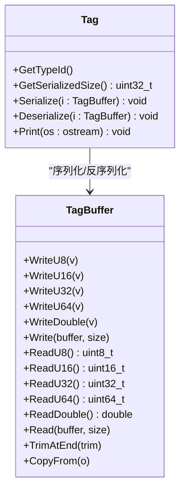
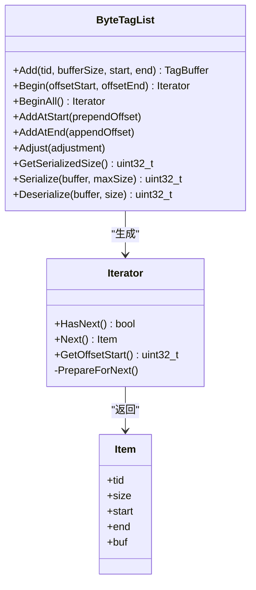
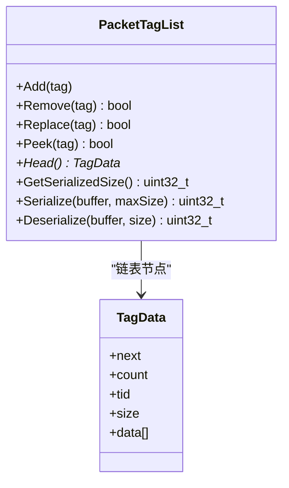
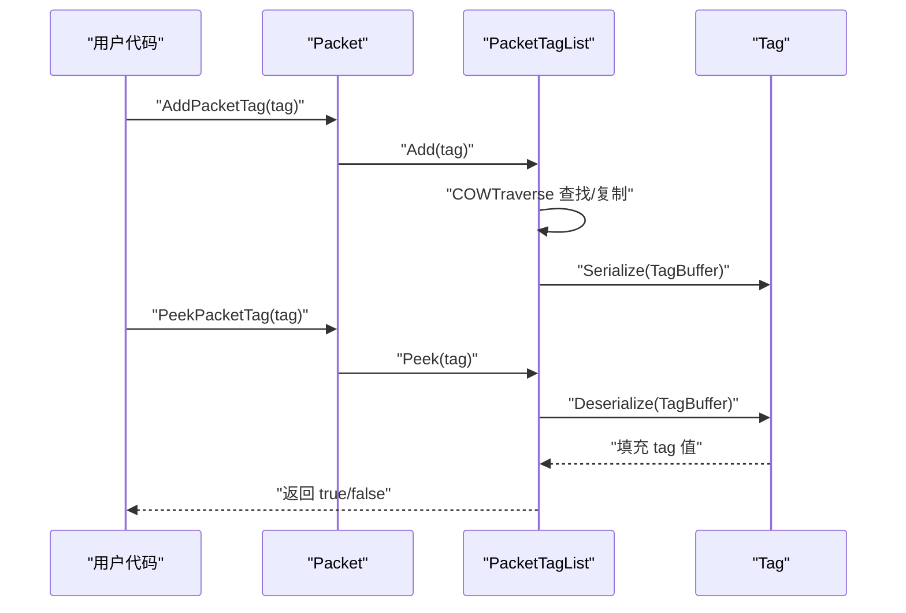
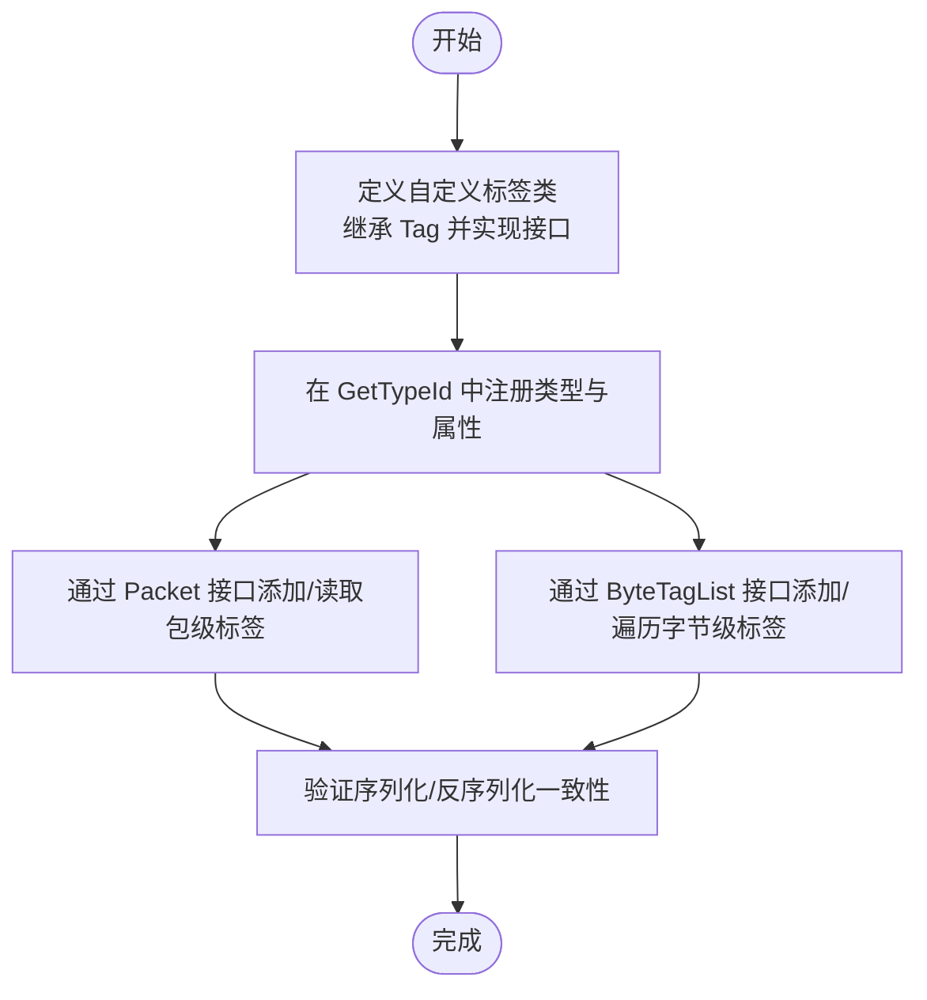
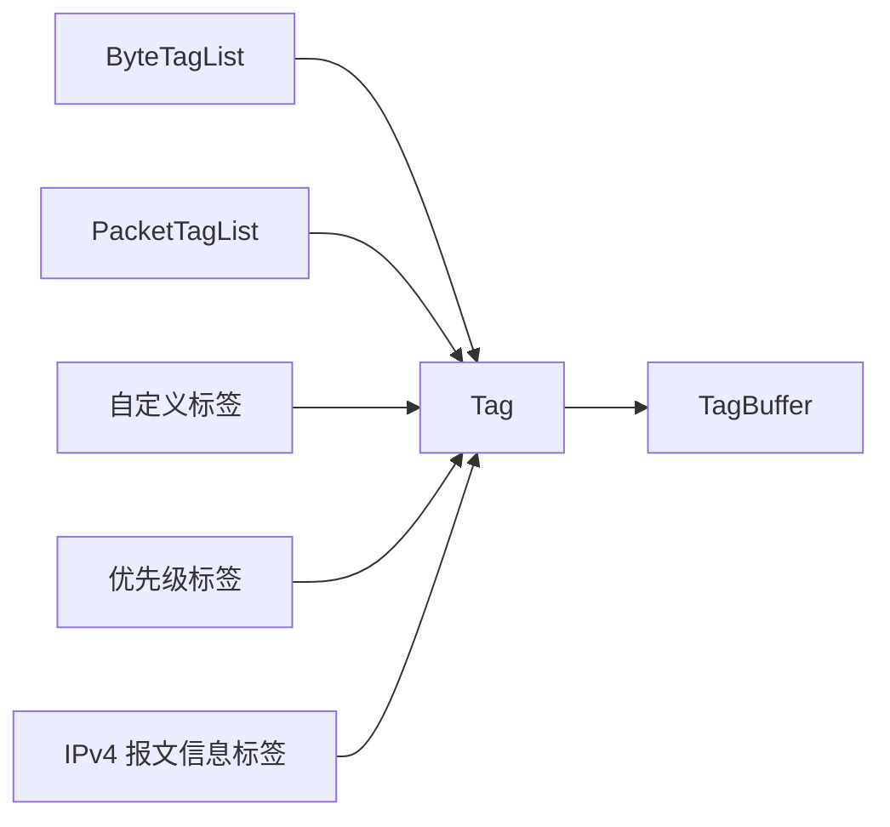

# 标签系统（ByteTagList 与 PacketTagList）

<cite>
**本文引用的文件**
- [tag.h](file://src/network/model/tag.h)
- [tag-buffer.h](file://src/network/model/tag-buffer.h)
- [tag-buffer.cc](file://src/network/model/tag-buffer.cc)
- [byte-tag-list.h](file://src/network/model/byte-tag-list.h)
- [byte-tag-list.cc](file://src/network/model/byte-tag-list.cc)
- [packet-tag-list.h](file://src/network/model/packet-tag-list.h)
- [packet-tag-list.cc](file://src/network/model/packet-tag-list.cc)
- [main-packet-tag.cc](file://src/network/examples/main-packet-tag.cc)
- [custom-priority-tag.h](file://src/network/utils/custom-priority-tag.h)
- [custom-priority-tag.cc](file://src/network/utils/custom-priority-tag.cc)
- [ipv4-packet-info-tag.h](file://src/internet/model/ipv4-packet-info-tag.h)
- [ipv4-packet-info-tag.cc](file://src/internet/model/ipv4-packet-info-tag.cc)
</cite>

## 目录
1. [简介](#简介)
2. [项目结构](#项目结构)
3. [核心组件](#核心组件)
4. [架构总览](#架构总览)
5. [详细组件分析](#详细组件分析)
6. [依赖关系分析](#依赖关系分析)
7. [性能考量](#性能考量)
8. [故障排查指南](#故障排查指南)
9. [结论](#结论)
10. [附录：自定义标签示例与最佳实践](#附录自定义标签示例与最佳实践)

## 简介
本文件系统性梳理 NS-3 的标签系统，重点覆盖两类标签列表：ByteTagList（按字节范围标注）与 PacketTagList（按包级标注）。文档从设计原则、数据结构、序列化/反序列化、迭代器机制、TagBuffer 数据访问接口入手，给出自定义标签的创建步骤与使用范式，并结合实际标签示例（如 QoS 优先级、IPv4 报文信息等）说明典型应用场景与性能优化建议。

## 项目结构
标签系统主要位于网络模块的 model 层，核心文件如下：
- 基类与缓冲区：tag.h、tag-buffer.h/.cc
- 字节级标签列表：byte-tag-list.h/.cc
- 包级标签列表：packet-tag-list.h/.cc
- 示例与扩展标签：examples 中的 main-packet-tag.cc；utils 中的自定义优先级标签；internet 模块中的 IPv4 报文信息标签

图表来源
- [tag.h:1-83](file://src/network/model/tag.h#L1-L83)
- [tag-buffer.h:1-238](file://src/network/model/tag-buffer.h#L1-L238)
- [byte-tag-list.h:1-302](file://src/network/model/byte-tag-list.h#L1-L302)
- [packet-tag-list.h:1-384](file://src/network/model/packet-tag-list.h#L1-L384)
- [main-packet-tag.cc:1-144](file://src/network/examples/main-packet-tag.cc#L1-L144)
- [custom-priority-tag.h:1-54](file://src/network/utils/custom-priority-tag.h#L1-L54)
- [custom-priority-tag.cc:1-63](file://src/network/utils/custom-priority-tag.cc#L1-L63)
- [ipv4-packet-info-tag.h:1-123](file://src/internet/model/ipv4-packet-info-tag.h#L1-L123)
- [ipv4-packet-info-tag.cc:1-138](file://src/internet/model/ipv4-packet-info-tag.cc#L1-L138)

章节来源
- [tag.h:1-83](file://src/network/model/tag.h#L1-L83)
- [tag-buffer.h:1-238](file://src/network/model/tag-buffer.h#L1-L238)
- [byte-tag-list.h:1-302](file://src/network/model/byte-tag-list.h#L1-L302)
- [packet-tag-list.h:1-384](file://src/network/model/packet-tag-list.h#L1-L384)

## 核心组件
- Tag 基类：定义标签的统一接口，包括序列化大小、序列化、反序列化、打印等抽象方法，作为所有具体标签的父类。
- TagBuffer：为 Tag 提供流式读写接口，支持多种基本类型与原始字节块的读写，内部维护当前位置指针与边界检查。
- ByteTagList：按“字节范围”存储标签，每个标签记录起止偏移（相对包起点），适合对分片/重组后的特定字节段附加元数据。
- PacketTagList：按“包级”存储标签，采用树形共享与写时复制（COW）策略，适合不随分片变化的包属性（如 QoS、分类、统计）。

章节来源
- [tag.h:31-78](file://src/network/model/tag.h#L31-L78)
- [tag-buffer.h:35-160](file://src/network/model/tag-buffer.h#L35-L160)
- [byte-tag-list.h:34-64](file://src/network/model/byte-tag-list.h#L34-L64)
- [packet-tag-list.h:37-124](file://src/network/model/packet-tag-list.h#L37-L124)

## 架构总览
下图展示标签系统在数据包生命周期中的角色与交互：

图表来源
- [packet-tag-list.h:124-125](file://src/network/model/packet-tag-list.h#L124-L125)
- [byte-tag-list.h:65-66](file://src/network/model/byte-tag-list.h#L65-L66)
- [tag.h:38-39](file://src/network/model/tag.h#L38-L39)
- [tag-buffer.h:51-52](file://src/network/model/tag-buffer.h#L51-L52)

## 详细组件分析

### Tag 基类与 TagBuffer
- 设计要点
  - Tag 基类通过纯虚函数约束子类必须实现：序列化大小、序列化、反序列化、打印。
  - TagBuffer 提供流式读写 API，封装了边界检查与字节序处理细节，保证序列化一致性。
- 使用建议
  - 在 GetSerializedSize 中精确返回所需字节数，避免运行期断言失败。
  - Serialize/Deserialize 必须严格一一对应，顺序与类型一致。
  - Print 用于调试输出，便于日志与可视化。

图表来源
- [tag.h:40-78](file://src/network/model/tag.h#L40-L78)
- [tag-buffer.h:51-160](file://src/network/model/tag-buffer.h#L51-L160)

章节来源
- [tag.h:31-78](file://src/network/model/tag.h#L31-L78)
- [tag-buffer.h:35-160](file://src/network/model/tag-buffer.h#L35-L160)
- [tag-buffer.cc:33-219](file://src/network/model/tag-buffer.cc#L33-L219)

### ByteTagList（字节级标签）
- 存储模型
  - 将所有标签以单缓冲区形式紧凑存储，每条记录包含：TypeId、数据长度、起始偏移、结束偏移，以及序列化后的标签数据。
  - 内部数据结构采用引用计数共享，必要时进行“写时复制”，模拟 COW 行为。
- 迭代器机制
  - 迭代器 Item 提供当前标签的 TypeId、数据长度、起止偏移与 TagBuffer 视图。
  - 迭代器在构造时根据传入的 offsetStart/offsetEnd 对标签边界进行裁剪，确保只返回落在目标范围内的标签片段。
- 关键方法
  - Add：添加新标签并返回可写入的 TagBuffer。
  - Begin/BeginAll：生成迭代器，遍历指定范围或全部标签。
  - AddAtStart/AddAtEnd：在包头/尾部扩展时，裁剪越界标签，保持语义正确。
  - Adjust：当包内容移动导致偏移变化时，调整内部偏移量。
  - Serialize/Deserialize：按固定格式打包/解包，保证跨进程/跨版本兼容。

图表来源
- [byte-tag-list.h:67-154](file://src/network/model/byte-tag-list.h#L67-L154)
- [byte-tag-list.h:156-291](file://src/network/model/byte-tag-list.h#L156-L291)
- [byte-tag-list.cc:84-148](file://src/network/model/byte-tag-list.cc#L84-L148)
- [byte-tag-list.cc:203-237](file://src/network/model/byte-tag-list.cc#L203-L237)
- [byte-tag-list.cc:264-285](file://src/network/model/byte-tag-list.cc#L264-L285)
- [byte-tag-list.cc:287-350](file://src/network/model/byte-tag-list.cc#L287-L350)
- [byte-tag-list.cc:436-556](file://src/network/model/byte-tag-list.cc#L436-L556)
- [byte-tag-list.cc:558-609](file://src/network/model/byte-tag-list.cc#L558-L609)

章节来源
- [byte-tag-list.h:34-64](file://src/network/model/byte-tag-list.h#L34-L64)
- [byte-tag-list.cc:84-148](file://src/network/model/byte-tag-list.cc#L84-L148)
- [byte-tag-list.cc:203-237](file://src/network/model/byte-tag-list.cc#L203-L237)
- [byte-tag-list.cc:264-285](file://src/network/model/byte-tag-list.cc#L264-L285)
- [byte-tag-list.cc:287-350](file://src/network/model/byte-tag-list.cc#L287-L350)
- [byte-tag-list.cc:436-609](file://src/network/model/byte-tag-list.cc#L436-L609)

### PacketTagList（包级标签）
- 存储模型
  - 以链表形式存储标签，节点为 TagData，包含 TypeId、数据长度与序列化数据。
  - 采用“树形共享 + 写时复制”策略：拷贝构造/赋值仅增加引用计数；修改时才复制到首次分支点。
- 关键方法
  - Add：向链表头部插入新标签（常数时间）。
  - Remove/Replace/Ppeek：基于 COW 遍历查找目标标签，若在首次分支前则原地修改，否则复制后修改。
  - Head：返回链表头节点（用于遍历）。
  - Serialize/Deserialize：将链表整体打包/解包，包含标签数量、每项大小与序列化数据。

图表来源
- [packet-tag-list.h:124-125](file://src/network/model/packet-tag-list.h#L124-L125)
- [packet-tag-list.h:142-149](file://src/network/model/packet-tag-list.h#L142-L149)
- [packet-tag-list.cc:55-173](file://src/network/model/packet-tag-list.cc#L55-L173)
- [packet-tag-list.cc:261-279](file://src/network/model/packet-tag-list.cc#L261-L279)
- [packet-tag-list.cc:281-297](file://src/network/model/packet-tag-list.cc#L281-L297)
- [packet-tag-list.cc:305-397](file://src/network/model/packet-tag-list.cc#L305-L397)
- [packet-tag-list.cc:399-461](file://src/network/model/packet-tag-list.cc#L399-L461)

章节来源
- [packet-tag-list.h:37-124](file://src/network/model/packet-tag-list.h#L37-L124)
- [packet-tag-list.cc:55-173](file://src/network/model/packet-tag-list.cc#L55-L173)
- [packet-tag-list.cc:261-297](file://src/network/model/packet-tag-list.cc#L261-L297)
- [packet-tag-list.cc:305-461](file://src/network/model/packet-tag-list.cc#L305-L461)

### 迭代器与遍历机制
- ByteTagIterator
  - 通过 Begin(offsetStart, offsetEnd) 获取迭代器，Next() 返回 Item，其中 buf 为该标签片段的 TagBuffer 视图。
  - 迭代器内部会跳过不相交的标签，并对相交部分进行裁剪，确保返回的 start/end 在给定范围内。
- PacketTagIterator
  - 通过 Head() 获取链表头，逐个节点遍历，节点中 data 即为该标签的序列化数据，可通过 Tag::Deserialize 反序列化得到具体值。

图表来源
- [packet-tag-list.cc:261-279](file://src/network/model/packet-tag-list.cc#L261-L279)
- [packet-tag-list.cc:281-297](file://src/network/model/packet-tag-list.cc#L281-L297)
- [packet-tag-list.cc:55-173](file://src/network/model/packet-tag-list.cc#L55-L173)

章节来源
- [byte-tag-list.cc:84-148](file://src/network/model/byte-tag-list.cc#L84-L148)
- [packet-tag-list.cc:281-297](file://src/network/model/packet-tag-list.cc#L281-L297)

### TagBuffer 数据访问与操作
- 写入接口：WriteU8/U16/U32/U64、WriteDouble、Write(const uint8_t*, size)。
- 读取接口：ReadU8/U16/U32/U64、ReadDouble、Read(uint8_t*, size)。
- 辅助接口：TrimAtEnd、CopyFrom，用于裁剪与复制片段。
- 边界与断言：所有读写均进行边界检查，防止越界访问。

章节来源
- [tag-buffer.h:51-160](file://src/network/model/tag-buffer.h#L51-L160)
- [tag-buffer.cc:33-219](file://src/network/model/tag-buffer.cc#L33-L219)

### 自定义标签的创建与使用流程
- 定义标签类：继承 Tag，实现 GetSerializedSize、Serialize、Deserialize、Print。
- 注册类型：在 GetTypeId 中声明父类、构造器与属性（可选）。
- 序列化策略：在 Serialize 中按顺序写出字段，在 Deserialize 中按相同顺序读取。
- 使用方式：通过 Packet 的 AddPacketTag/PeekPacketTag/RemovePacketTag 等接口管理包级标签；通过 ByteTagList 的 Add/Begin 等接口管理字节级标签。

图表来源
- [main-packet-tag.cc:32-116](file://src/network/examples/main-packet-tag.cc#L32-L116)
- [custom-priority-tag.h:21-48](file://src/network/utils/custom-priority-tag.h#L21-L48)
- [custom-priority-tag.cc:12-60](file://src/network/utils/custom-priority-tag.cc#L12-L60)

章节来源
- [main-packet-tag.cc:32-116](file://src/network/examples/main-packet-tag.cc#L32-L116)
- [custom-priority-tag.h:21-48](file://src/network/utils/custom-priority-tag.h#L21-L48)
- [custom-priority-tag.cc:12-60](file://src/network/utils/custom-priority-tag.cc#L12-L60)

## 依赖关系分析
- 组件耦合
  - Tag 与 TagBuffer 强耦合：序列化/反序列化完全依赖 TagBuffer 的读写 API。
  - ByteTagList 与 PacketTagList 分别独立管理不同粒度的标签，互不直接依赖。
  - 具体标签类仅依赖 Tag 基类，不依赖具体列表实现，降低耦合度。
- 外部依赖
  - 类型系统：TypeId 用于标识标签类型，序列化时以哈希形式保存。
  - 断言与日志：大量 NS_ASSERT 与 NS_LOG 用于边界检查与调试。

图表来源
- [tag.h:38-39](file://src/network/model/tag.h#L38-L39)
- [tag-buffer.h:22-23](file://src/network/model/tag-buffer.h#L22-L23)
- [byte-tag-list.h:23-25](file://src/network/model/byte-tag-list.h#L23-L25)
- [packet-tag-list.h:27-30](file://src/network/model/packet-tag-list.h#L27-L30)
- [main-packet-tag.cc:32-44](file://src/network/examples/main-packet-tag.cc#L32-L44)
- [custom-priority-tag.cc:12-25](file://src/network/utils/custom-priority-tag.cc#L12-L25)
- [ipv4-packet-info-tag.cc:82-90](file://src/internet/model/ipv4-packet-info-tag.cc#L82-L90)

章节来源
- [tag.h:38-39](file://src/network/model/tag.h#L38-L39)
- [tag-buffer.h:22-23](file://src/network/model/tag-buffer.h#L22-L23)
- [byte-tag-list.h:23-25](file://src/network/model/byte-tag-list.h#L23-L25)
- [packet-tag-list.h:27-30](file://src/network/model/packet-tag-list.h#L27-L30)

## 性能考量
- 写时复制（COW）
  - PacketTagList 通过共享 TagData 节点并在首次修改时复制，显著降低拷贝成本，适合频繁复制但低频修改的场景。
- 内存池与自由列表
  - ByteTagListData 支持自由列表缓存，减少频繁分配/释放带来的开销；在高并发/高频标签增删场景收益明显。
- 序列化对齐
  - 所有标签数据与类型哈希均按 4 字节对齐，提升内存访问效率并简化解析逻辑。
- 迭代器裁剪
  - ByteTagIterator 在遍历时自动裁剪越界标签，避免无效数据处理，提高遍历效率。
- 建议
  - 控制标签数量与大小，避免过度膨胀包头。
  - 优先使用包级标签承载稳定属性，字节级标签用于分片敏感的局部元数据。
  - 合理复用标签类型，避免重复序列化/反序列化。

[本节为通用性能指导，无需列出章节来源]

## 故障排查指南
- 序列化/反序列化不匹配
  - 症状：断言失败或数据错乱。
  - 排查：确认 GetSerializedSize 返回值与实际写出/读取字节数一致；Serialize/Deserialize 顺序与类型严格对应。
- 越界访问
  - 症状：运行时断言触发。
  - 排查：检查 TagBuffer 的写入/读取范围，确保不超过已分配空间；ByteTagIterator 的 offsetStart/offsetEnd 设置是否合理。
- 标签未生效或丢失
  - 症状：Peek 返回 false 或值不正确。
  - 排查：确认 Add 是否成功、类型是否唯一（PacketTagList 不允许同类型重复添加）、分片/重组后是否仍处于有效范围（字节级标签）。
- COW 导致的意外修改
  - 症状：原对象被修改。
  - 排查：理解 PacketTagList 的 COW 行为，避免在首次分支点之后再修改同一标签；必要时先 Peek 再 Replace。

章节来源
- [tag-buffer.cc:33-101](file://src/network/model/tag-buffer.cc#L33-L101)
- [packet-tag-list.cc:261-279](file://src/network/model/packet-tag-list.cc#L261-L279)
- [packet-tag-list.cc:281-297](file://src/network/model/packet-tag-list.cc#L281-L297)
- [byte-tag-list.cc:84-148](file://src/network/model/byte-tag-list.cc#L84-L148)

## 结论
NS-3 的标签系统通过 Tag 基类与 TagBuffer 提供统一的序列化接口，配合 ByteTagList 与 PacketTagList 实现“字节级”与“包级”的差异化标注能力。前者适用于分片敏感的局部元数据，后者适用于稳定的包属性。借助 COW 与内存池等优化手段，标签系统在功能与性能之间取得良好平衡。遵循本文的接口规范与最佳实践，可高效构建自定义标签并安全地应用于 QoS、流量分类、性能统计等场景。

[本节为总结性内容，无需列出章节来源]

## 附录：自定义标签示例与最佳实践

### 示例一：基础包级标签（MyTag）
- 步骤
  - 定义类 MyTag 继承 Tag，实现接口。
  - 在 GetTypeId 中注册类型与属性。
  - 通过 Packet 的 AddPacketTag/PeekPacketTag 使用。
- 参考路径
  - [main-packet-tag.cc:32-116](file://src/network/examples/main-packet-tag.cc#L32-L116)

章节来源
- [main-packet-tag.cc:32-116](file://src/network/examples/main-packet-tag.cc#L32-L116)

### 示例二：自定义优先级标签（MyPriorityTag）
- 场景：为数据包设置优先级，便于队列调度或拥塞控制。
- 步骤
  - 定义 MyPriorityTag，实现序列化/反序列化。
  - 在发送端设置优先级，在接收端读取并应用策略。
- 参考路径
  - [custom-priority-tag.h:21-48](file://src/network/utils/custom-priority-tag.h#L21-L48)
  - [custom-priority-tag.cc:12-60](file://src/network/utils/custom-priority-tag.cc#L12-L60)

章节来源
- [custom-priority-tag.h:21-48](file://src/network/utils/custom-priority-tag.h#L21-L48)
- [custom-priority-tag.cc:12-60](file://src/network/utils/custom-priority-tag.cc#L12-L60)

### 示例三：IPv4 报文信息标签（Ipv4PacketInfoTag）
- 场景：传递目的地址、接收接口索引、TTL 等辅助信息。
- 步骤
  - 定义 Ipv4PacketInfoTag，实现序列化/反序列化。
  - 在网络层或套接字层读取并使用这些信息。
- 参考路径
  - [ipv4-packet-info-tag.h:48-119](file://src/internet/model/ipv4-packet-info-tag.h#L48-L119)
  - [ipv4-packet-info-tag.cc:106-136](file://src/internet/model/ipv4-packet-info-tag.cc#L106-L136)

章节来源
- [ipv4-packet-info-tag.h:48-119](file://src/internet/model/ipv4-packet-info-tag.h#L48-L119)
- [ipv4-packet-info-tag.cc:106-136](file://src/internet/model/ipv4-packet-info-tag.cc#L106-L136)

### 最佳实践清单
- 明确标签粒度
  - 稳定属性用 PacketTagList；分片敏感的局部元数据用 ByteTagList。
- 控制标签体积
  - 尽量紧凑编码，避免冗余字段。
- 保持类型唯一性
  - 同一包内避免重复添加同类型包级标签。
- 严格对齐与边界
  - 使用 TagBuffer 的读写接口，确保按 4 字节对齐与边界检查。
- 谨慎使用 COW
  - 修改前先 Peek，避免无意间影响共享节点。
- 日志与调试
  - 在 Print 中输出关键字段，便于问题定位。

[本节为实践建议，无需列出章节来源]