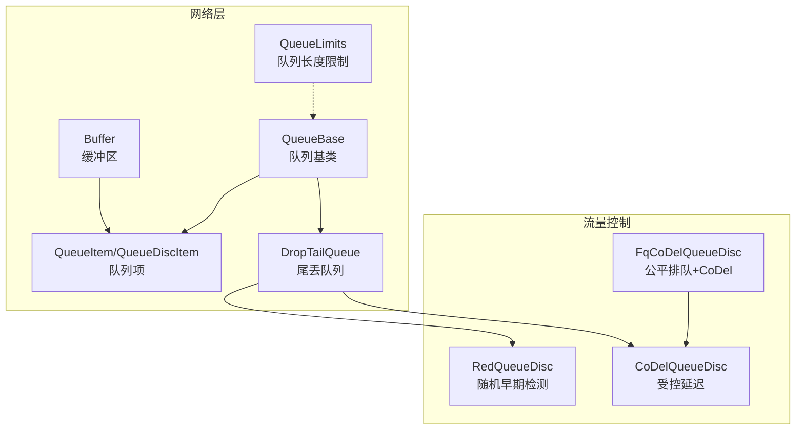
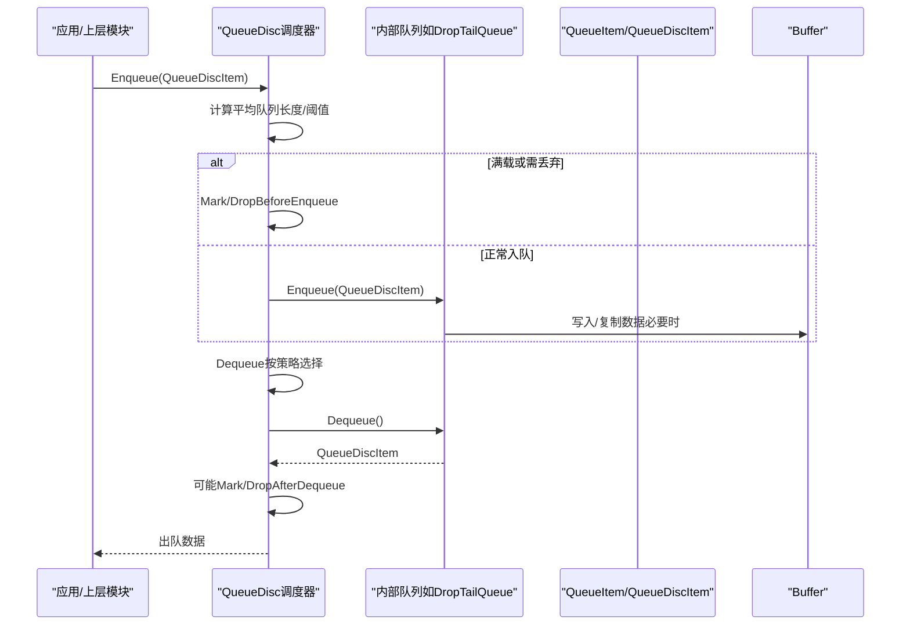
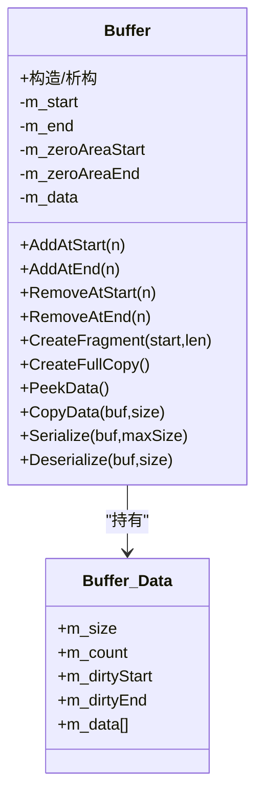
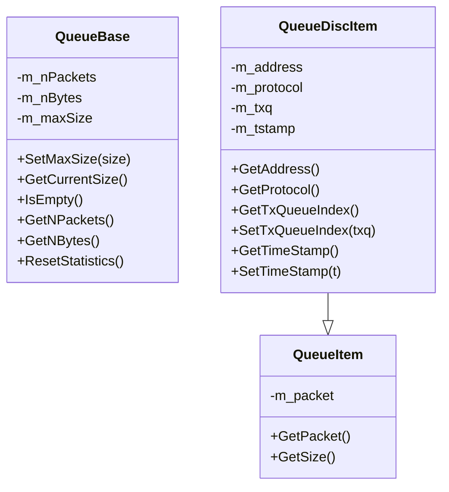
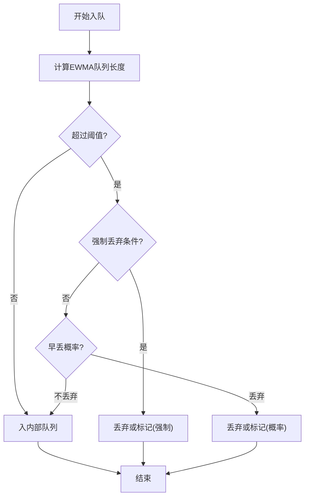
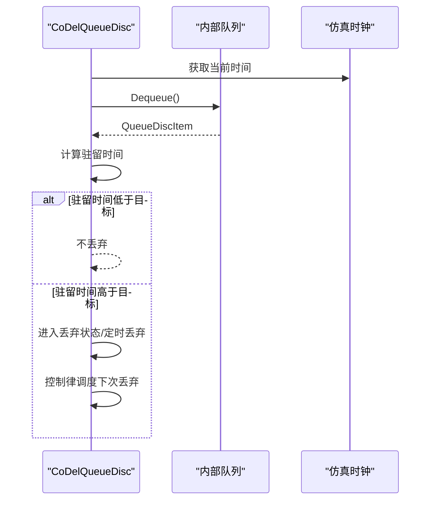
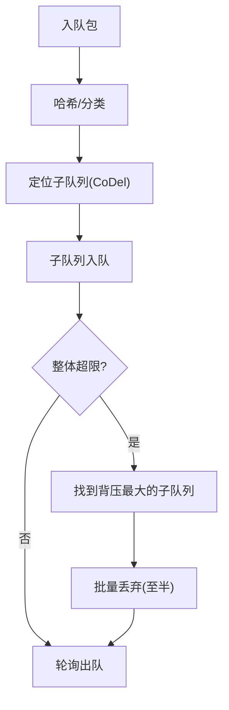
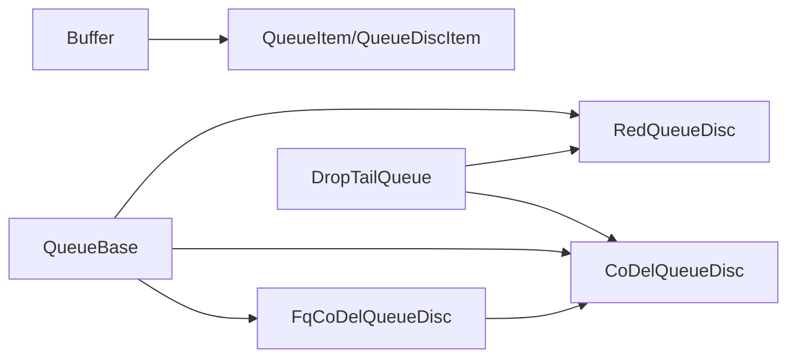

# 缓冲区与队列（Buffer & Queue）

<cite>
**本文引用的文件**
- [buffer.cc](file://simulator/ns-3.39/src/network/model/buffer.cc)
- [queue.cc](file://simulator/ns-3.39/src/network/utils/queue.cc)
- [queue-item.cc](file://simulator/ns-3.39/src/network/utils/queue-item.cc)
- [drop-tail-queue.cc](file://simulator/ns-3.39/src/network/utils/drop-tail-queue.cc)
- [red-queue-disc.cc](file://simulator/ns-3.39/src/traffic-control/model/red-queue-disc.cc)
- [codel-queue-disc.cc](file://simulator/ns-3.39/src/traffic-control/model/codel-queue-disc.cc)
- [fq-codel-queue-disc.cc](file://simulator/ns-3.39/src/traffic-control/model/fq-codel-queue-disc.cc)
- [queue-limits.cc](file://simulator/ns-3.39/src/network/utils/queue-limits.cc)
</cite>

## 目录
1. [引言](#引言)
2. [项目结构](#项目结构)
3. [核心组件](#核心组件)
4. [架构总览](#架构总览)
5. [详细组件分析](#详细组件分析)
6. [依赖关系分析](#依赖关系分析)
7. [性能考量](#性能考量)
8. [故障排查指南](#故障排查指南)
9. [结论](#结论)
10. [附录：实用示例与参数参考](#附录实用示例与参数参考)

## 引言
本文件面向NS-3网络仿真器中的缓冲区与队列系统，系统性梳理Buffer类的数据存储与读写模型、队列基类与通用项封装、典型队列实现（如DropTailQueue）以及主动队列管理（RED、CoDel、Fq-CoDel）的算法与配置要点。文档旨在帮助读者快速掌握缓冲区管理、队列参数配置、性能调优与拥塞控制机制，并提供可直接映射到源码的路径指引，便于在实际仿真中落地应用。

## 项目结构
围绕缓冲区与队列的关键目录与文件如下：
- 网络层缓冲区与队列基础
  - Buffer实现：src/network/model/buffer.cc
  - 队列基类与统计：src/network/utils/queue.cc
  - 队列项抽象：src/network/utils/queue-item.cc
  - 基础队列实现：src/network/utils/drop-tail-queue.cc
  - 队列长度限制：src/network/utils/queue-limits.cc
- 主动队列管理（流量控制）
  - RED队列调度：src/traffic-control/model/red-queue-disc.cc
  - CoDel队列调度：src/traffic-control/model/codel-queue-disc.cc
  - Fq-CoDel队列调度：src/traffic-control/model/fq-codel-queue-disc.cc

图示来源
- [buffer.cc:1-1235](file://simulator/ns-3.39/src/network/model/buffer.cc#L1-L1235)
- [queue.cc:1-237](file://simulator/ns-3.39/src/network/utils/queue.cc#L1-L237)
- [queue-item.cc:1-150](file://simulator/ns-3.39/src/network/utils/queue-item.cc#L1-L150)
- [drop-tail-queue.cc:1-29](file://simulator/ns-3.39/src/network/utils/drop-tail-queue.cc#L1-L29)
- [red-queue-disc.cc:1-897](file://simulator/ns-3.39/src/traffic-control/model/red-queue-disc.cc#L1-L897)
- [codel-queue-disc.cc:1-508](file://simulator/ns-3.39/src/traffic-control/model/codel-queue-disc.cc#L1-L508)
- [fq-codel-queue-disc.cc:1-505](file://simulator/ns-3.39/src/traffic-control/model/fq-codel-queue-disc.cc#L1-L505)
- [queue-limits.cc:1-45](file://simulator/ns-3.39/src/network/utils/queue-limits.cc#L1-L45)

章节来源
- [buffer.cc:1-1235](file://simulator/ns-3.39/src/network/model/buffer.cc#L1-L1235)
- [queue.cc:1-237](file://simulator/ns-3.39/src/network/utils/queue.cc#L1-L237)
- [queue-item.cc:1-150](file://simulator/ns-3.39/src/network/utils/queue-item.cc#L1-L150)
- [drop-tail-queue.cc:1-29](file://simulator/ns-3.39/src/network/utils/drop-tail-queue.cc#L1-L29)
- [red-queue-disc.cc:1-897](file://simulator/ns-3.39/src/traffic-control/model/red-queue-disc.cc#L1-L897)
- [codel-queue-disc.cc:1-508](file://simulator/ns-3.39/src/traffic-control/model/codel-queue-disc.cc#L1-L508)
- [fq-codel-queue-disc.cc:1-505](file://simulator/ns-3.39/src/traffic-control/model/fq-codel-queue-disc.cc#L1-L505)
- [queue-limits.cc:1-45](file://simulator/ns-3.39/src/network/utils/queue-limits.cc#L1-L45)

## 核心组件
- Buffer（缓冲区）
  - 设计要点：采用共享数据块与零拷贝片段化策略，支持在头部/尾部高效插入与删除；内部维护“零区域”以优化连续零字节填充；提供序列化/反序列化接口，支持对齐与边界处理。
  - 关键能力：AddAtStart/AddAtEnd、RemoveAtStart/RemoveAtEnd、CreateFragment、CreateFullCopy、PeekData、CopyData、序列化/反序列化。
- QueueBase（队列基类）
  - 设计要点：统一统计计数（包/字节）、最大尺寸设置与溢出判断、空队列判定；提供TraceSource用于观测队列状态。
  - 关键能力：SetMaxSize、GetCurrentSize、IsEmpty、GetNPackets/GetNBytes、重置统计。
- QueueItem/QueueDiscItem（队列项）
  - 设计要点：封装Packet并扩展目标地址、协议、传输队列索引、时间戳等；为调度器提供分类与标记依据。
- DropTailQueue（尾丢队列）
  - 设计要点：模板化实现，继承自QueueBase；作为RED、CoDel等调度器的内部队列使用。
- 队列长度限制（QueueLimits）
  - 设计要点：抽象队列长度策略，配合QueueBase进行容量约束。

章节来源
- [buffer.cc:192-780](file://simulator/ns-3.39/src/network/model/buffer.cc#L192-L780)
- [queue.cc:51-236](file://simulator/ns-3.39/src/network/utils/queue.cc#L51-L236)
- [queue-item.cc:30-150](file://simulator/ns-3.39/src/network/utils/queue-item.cc#L30-L150)
- [drop-tail-queue.cc:23-28](file://simulator/ns-3.39/src/network/utils/drop-tail-queue.cc#L23-L28)
- [queue-limits.cc:30-45](file://simulator/ns-3.39/src/network/utils/queue-limits.cc#L30-L45)

## 架构总览
下图展示从应用层到调度器再到底层队列的整体调用链路与职责划分。

图示来源
- [queue.cc:34-236](file://simulator/ns-3.39/src/network/utils/queue.cc#L34-L236)
- [queue-item.cc:30-150](file://simulator/ns-3.39/src/network/utils/queue-item.cc#L30-L150)
- [drop-tail-queue.cc:23-28](file://simulator/ns-3.39/src/network/utils/drop-tail-queue.cc#L23-L28)
- [red-queue-disc.cc:342-446](file://simulator/ns-3.39/src/traffic-control/model/red-queue-disc.cc#L342-L446)
- [codel-queue-disc.cc:174-418](file://simulator/ns-3.39/src/traffic-control/model/codel-queue-disc.cc#L174-L418)
- [fq-codel-queue-disc.cc:233-394](file://simulator/ns-3.39/src/traffic-control/model/fq-codel-queue-disc.cc#L233-L394)

## 详细组件分析

### Buffer 类设计与实现
- 数据存储
  - 共享数据块：通过引用计数避免重复分配；提供Create/Recycle/Deallocate生命周期管理。
  - 零区域优化：在起始与结束处维护零字节区域，减少真实内存占用与拷贝成本。
  - 对齐与序列化：序列化时对齐到4字节边界，包含零区域长度、起始/结束数据长度与数据段。
- 读写操作
  - 头部/尾部插入：AddAtStart/AddAtEnd在空间充足时更新偏移，在不足时复制到新块。
  - 片段化与复制：CreateFragment/FullCopy支持无拷贝拼接与安全复制。
  - 数据访问：PeekData/CopyData支持流式输出与内存复制。
- 容量管理
  - 过载保护：序列化/反序列化返回值指示是否成功；内部状态校验（可选）保障一致性。
- 性能特性
  - 小对象频繁分配/回收时，自由列表（可选宏）显著降低分配开销；零区域减少大块零填充的内存压力。

图示来源
- [buffer.cc:192-780](file://simulator/ns-3.39/src/network/model/buffer.cc#L192-L780)

章节来源
- [buffer.cc:192-780](file://simulator/ns-3.39/src/network/model/buffer.cc#L192-L780)

### 队列基类与队列项
- QueueBase
  - 统计与容量：维护包/字节数、累计收发/丢弃计数；支持按包或字节单位的MaxSize设置与溢出判断。
  - 接口：IsEmpty、GetNPackets、GetNBytes、GetCurrentSize、SetMaxSize、重置统计。
- QueueItem/QueueDiscItem
  - 封装Packet并扩展：目的地址、协议、传输队列索引、时间戳；支持Hash与打印。

图示来源
- [queue.cc:51-236](file://simulator/ns-3.39/src/network/utils/queue.cc#L51-L236)
- [queue-item.cc:30-150](file://simulator/ns-3.39/src/network/utils/queue-item.cc#L30-L150)

章节来源
- [queue.cc:51-236](file://simulator/ns-3.39/src/network/utils/queue.cc#L51-L236)
- [queue-item.cc:30-150](file://simulator/ns-3.39/src/network/utils/queue-item.cc#L30-L150)

### DropTailQueue（尾丢队列）
- 实现要点
  - 模板化类定义，作为调度器内部队列使用；提供标准入队/出队接口。
- 适用场景
  - 简单公平队列、作为RED/CoDel/Fq-CoDel的底层队列；适合低复杂度场景或作为对比基准。

章节来源
- [drop-tail-queue.cc:23-28](file://simulator/ns-3.39/src/network/utils/drop-tail-queue.cc#L23-L28)

### RED（随机早期检测）
- 算法要点
  - 基于指数加权移动平均（EWMA）估计队列长度；在最小/最大阈值之间按概率丢弃或标记ECN；支持多种变体：ARED、Feng自适应RED、非线性RED、温和模式、等待间隔等。
  - 关键参数：最小/最大阈值、队列权重、目标延迟、自适应周期、上下界、带宽/延迟、是否启用ECN/硬丢弃等。
- 流程
  - 入队前计算EWMA与当前包数；根据阈值与概率决定丢弃/标记；否则入内部队列。
  - 可选自适应调整m_curMaxP以维持目标队列范围。

图示来源
- [red-queue-disc.cc:342-446](file://simulator/ns-3.39/src/traffic-control/model/red-queue-disc.cc#L342-L446)
- [red-queue-disc.cc:455-577](file://simulator/ns-3.39/src/traffic-control/model/red-queue-disc.cc#L455-L577)
- [red-queue-disc.cc:632-651](file://simulator/ns-3.39/src/traffic-control/model/red-queue-disc.cc#L632-L651)

章节来源
- [red-queue-disc.cc:75-226](file://simulator/ns-3.39/src/traffic-control/model/red-queue-disc.cc#L75-L226)
- [red-queue-disc.cc:342-446](file://simulator/ns-3.39/src/traffic-control/model/red-queue-disc.cc#L342-L446)
- [red-queue-disc.cc:455-577](file://simulator/ns-3.39/src/traffic-control/model/red-queue-disc.cc#L455-L577)
- [red-queue-disc.cc:632-651](file://simulator/ns-3.39/src/traffic-control/model/red-queue-disc.cc#L632-L651)

### CoDel（受控延迟）
- 算法要点
  - 基于包驻留时间（sojourn time）判断是否超时；进入“丢弃状态”后按控制律（ControlLaw）定时丢弃/标记；支持ECN与L4S（仅ECT1标记）。
  - 关键参数：目标延迟、采样间隔、最小字节数、CE阈值、是否启用ECN/L4S。
- 流程
  - 出队时计算包驻留时间；若持续高于目标延迟且达到间隔要求，则进入丢弃状态；按控制律循环丢弃/标记直至恢复。

图示来源
- [codel-queue-disc.cc:196-418](file://simulator/ns-3.39/src/traffic-control/model/codel-queue-disc.cc#L196-L418)

章节来源
- [codel-queue-disc.cc:72-134](file://simulator/ns-3.39/src/traffic-control/model/codel-queue-disc.cc#L72-L134)
- [codel-queue-disc.cc:196-418](file://simulator/ns-3.39/src/traffic-control/model/codel-queue-disc.cc#L196-L418)

### Fq-CoDel（公平排队+CoDel）
- 设计要点
  - 将输入流量按哈希分到多个子队列（CoDel），每个子队列独立执行CoDel策略；支持集关联哈希（Set-Associative Hash）以提升缓存命中与负载均衡。
  - 关键参数：队列数量、量子（quantum）、丢弃批大小、扰动因子、CE阈值、是否启用ECN/L4S。
- 流程
  - 入队：根据包分类哈希定位子队列；若整体超限则触发“胖流”丢弃（丢弃半数背压）。
  - 出队：轮转各子队列，按 deficit 调度，保证公平性。

图示来源
- [fq-codel-queue-disc.cc:233-313](file://simulator/ns-3.39/src/traffic-control/model/fq-codel-queue-disc.cc#L233-L313)
- [fq-codel-queue-disc.cc:315-394](file://simulator/ns-3.39/src/traffic-control/model/fq-codel-queue-disc.cc#L315-L394)
- [fq-codel-queue-disc.cc:465-502](file://simulator/ns-3.39/src/traffic-control/model/fq-codel-queue-disc.cc#L465-L502)

章节来源
- [fq-codel-queue-disc.cc:110-175](file://simulator/ns-3.39/src/traffic-control/model/fq-codel-queue-disc.cc#L110-L175)
- [fq-codel-queue-disc.cc:233-394](file://simulator/ns-3.39/src/traffic-control/model/fq-codel-queue-disc.cc#L233-L394)
- [fq-codel-queue-disc.cc:465-502](file://simulator/ns-3.39/src/traffic-control/model/fq-codel-queue-disc.cc#L465-L502)

## 依赖关系分析
- Buffer与队列项
  - Buffer为QueueItem/QueueDiscItem提供底层数据承载与序列化能力；在需要复制/拼接时被调用。
- 队列基类与调度器
  - QueueBase为所有队列提供统一统计与容量控制；调度器（RED/CoDel/Fq-CoDel）在其之上实现不同策略。
- 内部队列
  - RED/CoDel/Fq-CoDel通常以内置DropTailQueue作为子队列；Fq-CoDel进一步将流量拆分为多个子CoDel队列。

图示来源
- [buffer.cc:192-780](file://simulator/ns-3.39/src/network/model/buffer.cc#L192-L780)
- [queue.cc:51-236](file://simulator/ns-3.39/src/network/utils/queue.cc#L51-L236)
- [queue-item.cc:30-150](file://simulator/ns-3.39/src/network/utils/queue-item.cc#L30-L150)
- [drop-tail-queue.cc:23-28](file://simulator/ns-3.39/src/network/utils/drop-tail-queue.cc#L23-L28)
- [red-queue-disc.cc:342-446](file://simulator/ns-3.39/src/traffic-control/model/red-queue-disc.cc#L342-L446)
- [codel-queue-disc.cc:174-418](file://simulator/ns-3.39/src/traffic-control/model/codel-queue-disc.cc#L174-L418)
- [fq-codel-queue-disc.cc:233-394](file://simulator/ns-3.39/src/traffic-control/model/fq-codel-queue-disc.cc#L233-L394)

章节来源
- [queue.cc:51-236](file://simulator/ns-3.39/src/network/utils/queue.cc#L51-L236)
- [drop-tail-queue.cc:23-28](file://simulator/ns-3.39/src/network/utils/drop-tail-queue.cc#L23-L28)
- [red-queue-disc.cc:342-446](file://simulator/ns-3.39/src/traffic-control/model/red-queue-disc.cc#L342-L446)
- [codel-queue-disc.cc:174-418](file://simulator/ns-3.39/src/traffic-control/model/codel-queue-disc.cc#L174-L418)
- [fq-codel-queue-disc.cc:233-394](file://simulator/ns-3.39/src/traffic-control/model/fq-codel-queue-disc.cc#L233-L394)

## 性能考量
- 缓冲区
  - 零区域与共享数据块可显著降低小包场景下的内存与拷贝开销；序列化时的4字节对齐会引入少量填充。
- 队列容量
  - 合理设置MaxSize（包/字节）与队列单位，避免过小导致频繁丢弃，过大导致延迟抖动。
- RED
  - EWMA权重影响响应速度；阈值设置与自适应参数（ARED/Feng NLRED）影响稳定性与收敛速度。
- CoDel
  - 目标延迟与采样间隔决定控制精度；ECN/L4S可降低尾部丢弃，但需网络设备支持。
- Fq-CoDel
  - 子队列数量与量子影响公平性与CPU开销；集关联哈希可改善热点分布。

## 故障排查指南
- 常见问题
  - 入队失败：检查QueueBase::SetMaxSize与WouldOverflow判断；确认内部队列回调是否正确触发DropBeforeEnqueue。
  - RED异常丢弃/标记：核对阈值、EWMA权重、是否启用ECN/硬丢弃；关注自适应参数更新周期。
  - CoDel无效标记：确认UseEcn/L4S配置与CE阈值；检查包头DSField（L4S）。
  - Fq-CoDel“胖流”丢弃：增大MaxSize或降低丢弃批大小；评估flows与set-ways配置。
- 关键日志与追踪
  - QueueBase提供包/字节计数追踪；CoDel/Fq-CoDel提供丢弃状态、计数与下次丢弃时间追踪；RED提供DropEarly/Mark事件记录。

章节来源
- [queue.cc:200-236](file://simulator/ns-3.39/src/network/utils/queue.cc#L200-L236)
- [red-queue-disc.cc:342-446](file://simulator/ns-3.39/src/traffic-control/model/red-queue-disc.cc#L342-L446)
- [codel-queue-disc.cc:174-418](file://simulator/ns-3.39/src/traffic-control/model/codel-queue-disc.cc#L174-L418)
- [fq-codel-queue-disc.cc:233-394](file://simulator/ns-3.39/src/traffic-control/model/fq-codel-queue-disc.cc#L233-L394)

## 结论
NS-3的缓冲区与队列体系以Buffer为核心数据承载，结合QueueBase与QueueItem/QueueDiscItem形成统一的队列抽象；在流量控制层面，RED、CoDel与Fq-CoDel分别覆盖了基于概率的早期丢弃、基于延迟控制的主动管理与基于公平排队的多流调度。通过合理配置参数与容量限制，可在仿真中有效模拟与优化拥塞控制行为。

## 附录：实用示例与参数参考
- 设置队列容量
  - 使用QueueBase::SetMaxSize设定包/字节上限；注意不可小于当前队列大小。
  - 参考路径：[queue.cc:200-221](file://simulator/ns-3.39/src/network/utils/queue.cc#L200-L221)
- RED参数
  - 关键属性：MinTh/MaxTh、QW、LInterm、TargetDelay、Interval、ARED/NLRED/Gentle/Wait、UseEcn/UseHardDrop。
  - 参考路径：[red-queue-disc.cc:75-226](file://simulator/ns-3.39/src/traffic-control/model/red-queue-disc.cc#L75-L226)
- CoDel参数
  - 关键属性：Target、Interval、MinBytes、CeThreshold、UseEcn/UseL4s。
  - 参考路径：[codel-queue-disc.cc:72-134](file://simulator/ns-3.39/src/traffic-control/model/codel-queue-disc.cc#L72-L134)
- Fq-CoDel参数
  - 关键属性：Flows、DropBatchSize、Perturbation、CeThreshold、EnableSetAssociativeHash/SetWays、UseEcn/UseL4s。
  - 参考路径：[fq-codel-queue-disc.cc:110-175](file://simulator/ns-3.39/src/traffic-control/model/fq-codel-queue-disc.cc#L110-L175)
- 队列长度限制
  - 通过QueueLimits派生类与QueueBase配合实现灵活的容量策略。
  - 参考路径：[queue-limits.cc:30-45](file://simulator/ns-3.39/src/network/utils/queue-limits.cc#L30-L45)