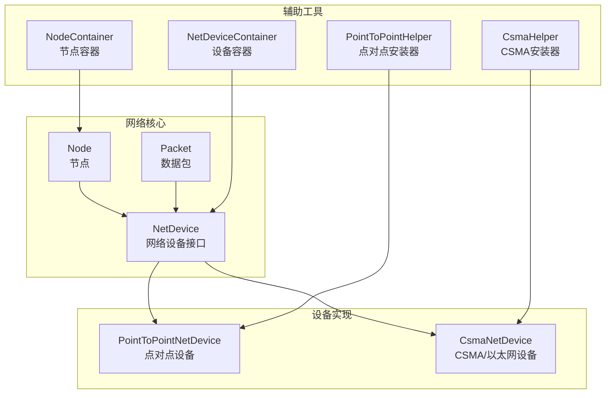
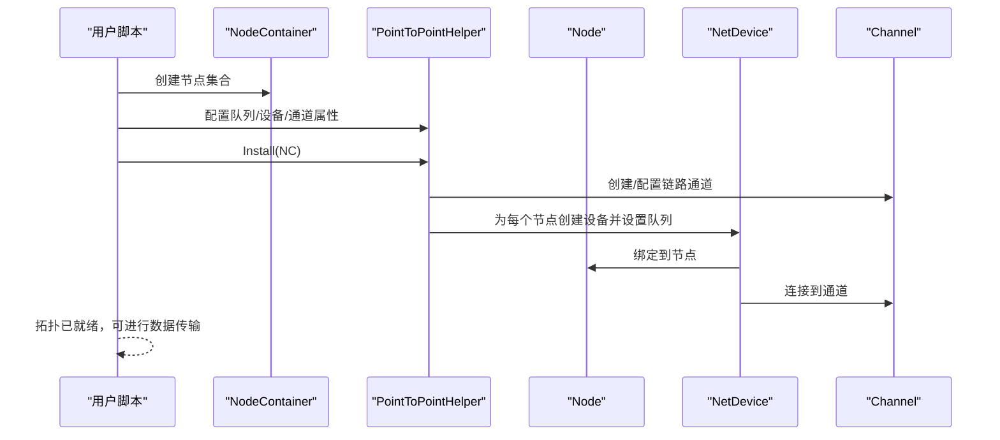
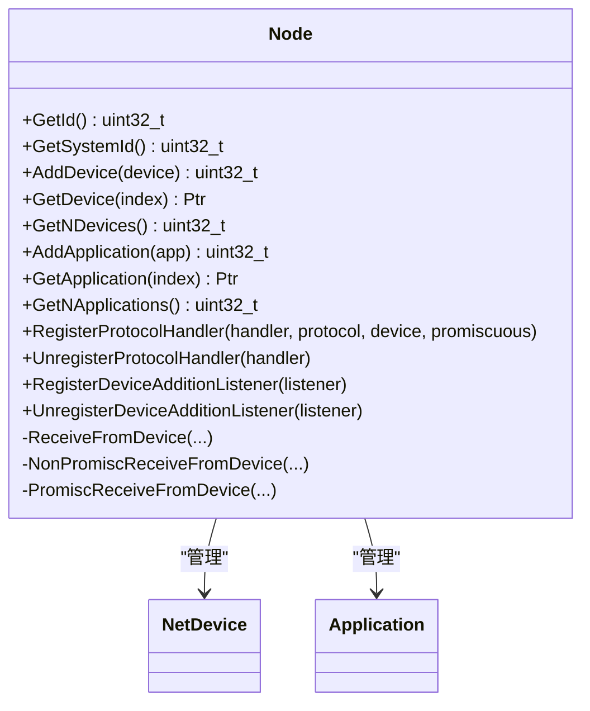
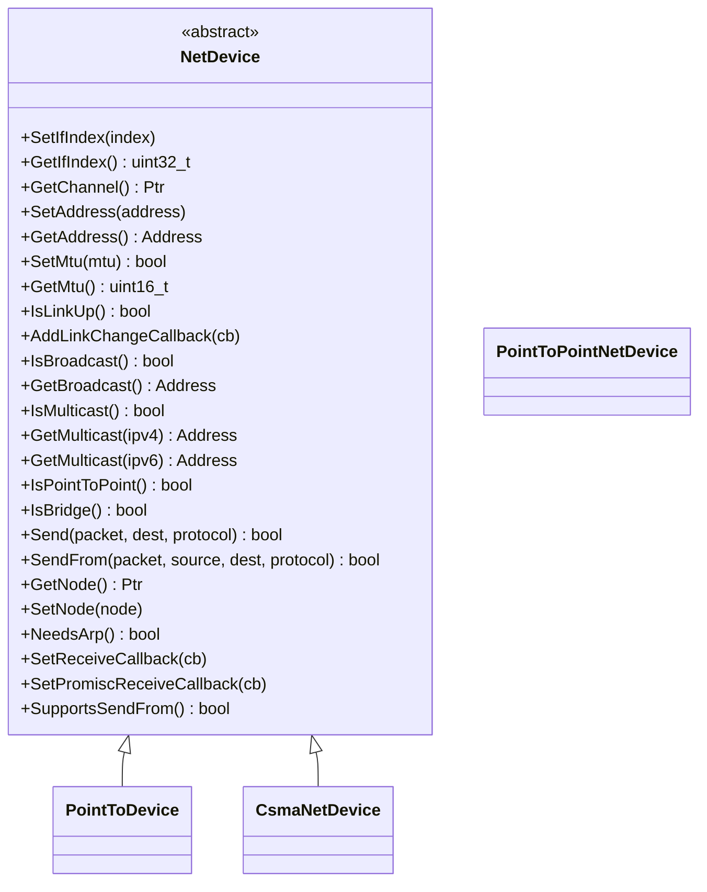
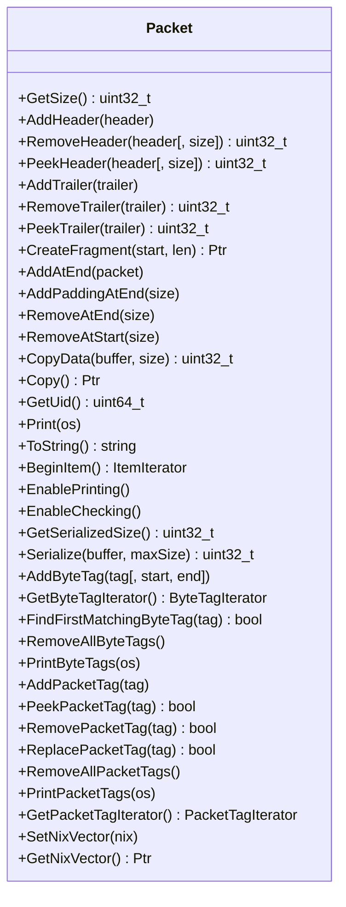
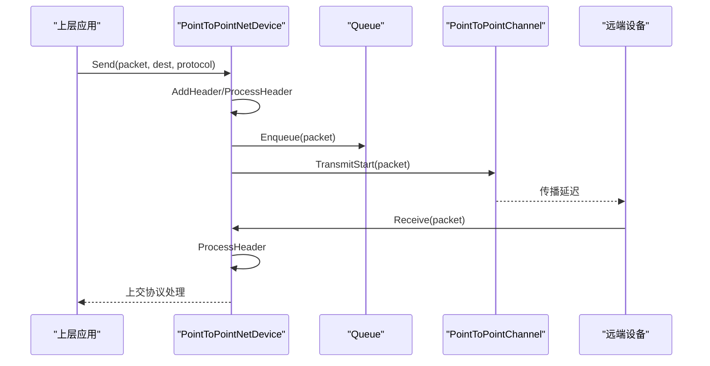
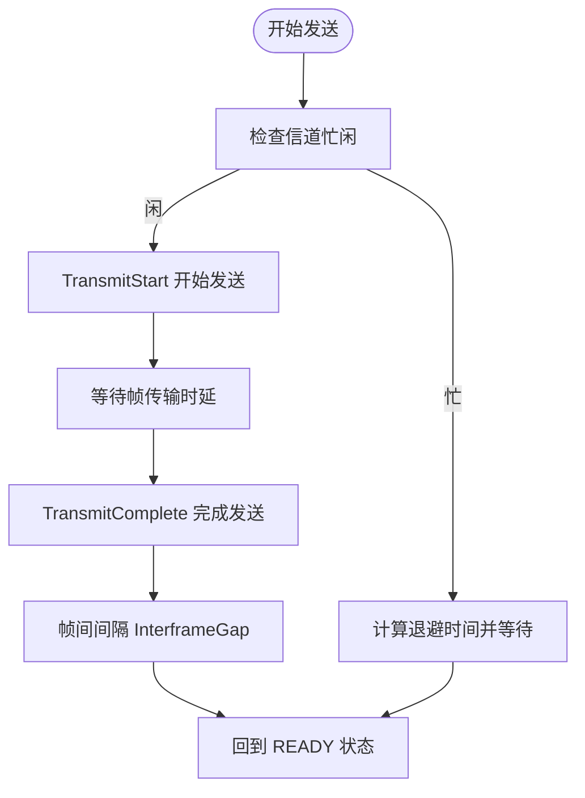
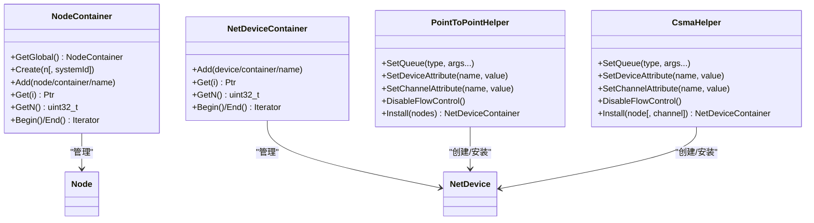
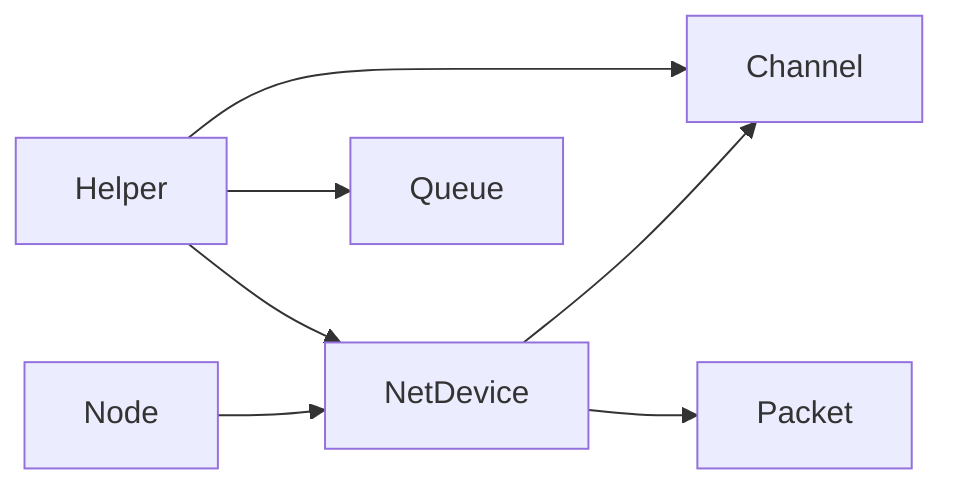

# 网络模块 (Network)

<cite>
**本文引用的文件**
- [network/model/node.h](file://simulator/ns-3.39/src/network/model/node.h)
- [network/model/net-device.h](file://simulator/ns-3.39/src/network/model/net-device.h)
- [network/model/packet.h](file://simulator/ns-3.39/src/network/model/packet.h)
- [point-to-point/model/point-to-point-net-device.h](file://simulator/ns-3.39/src/point-to-point/model/point-to-point-net-device.h)
- [csma/model/csma-net-device.h](file://simulator/ns-3.39/src/csma/model/csma-net-device.h)
- [network/helper/node-container.h](file://simulator/ns-3.39/src/network/helper/node-container.h)
- [network/helper/net-device-container.h](file://simulator/ns-3.39/src/network/helper/net-device-container.h)
- [point-to-point/helper/point-to-point-helper.h](file://simulator/ns-3.39/src/point-to-point/helper/point-to-point-helper.h)
- [csma/helper/csma-helper.h](file://simulator/ns-3.39/src/csma/helper/csma-helper.h)
</cite>

## 目录
1. [引言](#引言)
2. [项目结构](#项目结构)
3. [核心组件](#核心组件)
4. [架构总览](#架构总览)
5. [详细组件分析](#详细组件分析)
6. [依赖关系分析](#依赖关系分析)
7. [性能考量](#性能考量)
8. [故障排查指南](#故障排查指南)
9. [结论](#结论)
10. [附录](#附录)

## 引言
本文件系统化梳理 NS-3 网络模块的 API 设计与实现，聚焦于节点（Node）、网络设备（NetDevice）、数据包（Packet）三大核心实体，阐述网络拓扑构建、地址管理、数据包转发机制，并覆盖点对点（PointToPointNetDevice）与以太网（CsmaNetDevice）两类典型设备类型。同时给出网络配置、连接建立、数据传输的使用流程与最佳实践，说明与上层协议栈及下层物理层的接口关系，并提供性能优化与故障诊断建议。

## 项目结构
NS-3 的网络模块采用分层与按功能域划分相结合的组织方式：
- 核心模型层：位于 network/model，定义 Node、NetDevice、Packet 等基础抽象与通用能力
- 具体设备层：位于 point-to-point/model 与 csma/model，分别实现点对点与以太网设备
- 辅助工具层：位于 network/helper、point-to-point/helper、csma/helper，提供容器与安装器（Helper），简化拓扑构建与配置
- 示例与测试：位于各模块 examples 与 test 子目录，便于学习与验证

图表来源
- [network/model/node.h:58-331](file://simulator/ns-3.39/src/network/model/node.h#L58-L331)
- [network/model/net-device.h:101-380](file://simulator/ns-3.39/src/network/model/net-device.h#L101-L380)
- [network/model/packet.h:238-800](file://simulator/ns-3.39/src/network/model/packet.h#L238-L800)
- [point-to-point/model/point-to-point-net-device.h:63-480](file://simulator/ns-3.39/src/point-to-point/model/point-to-point-net-device.h#L63-L480)
- [csma/model/csma-net-device.h:60-740](file://simulator/ns-3.39/src/csma/model/csma-net-device.h#L60-L740)
- [network/helper/node-container.h:39-274](file://simulator/ns-3.39/src/network/helper/node-container.h#L39-L274)
- [network/helper/net-device-container.h:42-200](file://simulator/ns-3.39/src/network/helper/net-device-container.h#L42-L200)
- [point-to-point/helper/point-to-point-helper.h:43-212](file://simulator/ns-3.39/src/point-to-point/helper/point-to-point-helper.h#L43-L212)
- [csma/helper/csma-helper.h:47-280](file://simulator/ns-3.39/src/csma/helper/csma-helper.h#L47-L280)

章节来源
- [network/model/node.h:58-331](file://simulator/ns-3.39/src/network/model/node.h#L58-L331)
- [network/model/net-device.h:101-380](file://simulator/ns-3.39/src/network/model/net-device.h#L101-L380)
- [network/model/packet.h:238-800](file://simulator/ns-3.39/src/network/model/packet.h#L238-L800)
- [point-to-point/model/point-to-point-net-device.h:63-480](file://simulator/ns-3.39/src/point-to-point/model/point-to-point-net-device.h#L63-L480)
- [csma/model/csma-net-device.h:60-740](file://simulator/ns-3.39/src/csma/model/csma-net-device.h#L60-L740)
- [network/helper/node-container.h:39-274](file://simulator/ns-3.39/src/network/helper/node-container.h#L39-L274)
- [network/helper/net-device-container.h:42-200](file://simulator/ns-3.39/src/network/helper/net-device-container.h#L42-L200)
- [point-to-point/helper/point-to-point-helper.h:43-212](file://simulator/ns-3.39/src/point-to-point/helper/point-to-point-helper.h#L43-L212)
- [csma/helper/csma-helper.h:47-280](file://simulator/ns-3.39/src/csma/helper/csma-helper.h#L47-L280)

## 核心组件
- 节点（Node）
  - 角色：承载网络接口（NetDevice）、应用（Application）、唯一标识（Id、SystemId），并负责从设备接收数据包、分发到协议处理回调
  - 关键职责：添加/获取设备、注册/注销协议处理回调、注册/注销设备新增监听器、通知设备加入、在非混杂/混杂模式下接收数据包
  - 扩展：支持自定义节点类型标记、交换机相关接收与出队通知接口
- 网络设备（NetDevice）
  - 角色：抽象链路层到设备的接口，屏蔽不同 MAC 地址格式差异，向上层提供统一发送/接收 API
  - 关键职责：设置/获取接口索引、通道关联、地址设置/获取、MTU 设置/获取、链路状态与回调、广播/组播支持、发送/接收回调、是否需要 ARP、是否点对点/桥接等属性查询
  - 扩展：支持交换机直通发送与队列选择等扩展接口
- 数据包（Packet）
  - 角色：承载序列化缓冲区、字节标签（ByteTag）、包标签（PacketTag）、元数据（Metadata），并提供头部/尾部序列化/反序列化、片段化、拷贝、打印与跟踪回调等能力
  - 关键职责：头部/尾部添加/移除、片段化、标签管理、序列化/反序列化、打印与检查开关、跟踪回调签名

章节来源
- [network/model/node.h:58-331](file://simulator/ns-3.39/src/network/model/node.h#L58-L331)
- [network/model/net-device.h:101-380](file://simulator/ns-3.39/src/network/model/net-device.h#L101-L380)
- [network/model/packet.h:238-800](file://simulator/ns-3.39/src/network/model/packet.h#L238-L800)

## 架构总览
NS-3 网络模块通过“对象工厂 + 容器 + Helper”的方式快速构建拓扑。NodeContainer 与 NetDeviceContainer 提供批量节点与设备管理；PointToPointHelper 与 CsmaHelper 则封装了设备、队列、通道的创建与安装细节，使用户能以最少代码完成拓扑搭建与参数配置。

图表来源
- [network/helper/node-container.h:39-274](file://simulator/ns-3.39/src/network/helper/node-container.h#L39-L274)
- [point-to-point/helper/point-to-point-helper.h:43-212](file://simulator/ns-3.39/src/point-to-point/helper/point-to-point-helper.h#L43-L212)
- [network/model/node.h:106-118](file://simulator/ns-3.39/src/network/model/node.h#L106-L118)
- [network/model/net-device.h:114-127](file://simulator/ns-3.39/src/network/model/net-device.h#L114-L127)

章节来源
- [network/helper/node-container.h:39-274](file://simulator/ns-3.39/src/network/helper/node-container.h#L39-L274)
- [point-to-point/helper/point-to-point-helper.h:43-212](file://simulator/ns-3.39/src/point-to-point/helper/point-to-point-helper.h#L43-L212)
- [network/model/node.h:106-118](file://simulator/ns-3.39/src/network/model/node.h#L106-L118)
- [network/model/net-device.h:114-127](file://simulator/ns-3.39/src/network/model/net-device.h#L114-L127)

## 详细组件分析

### 节点（Node）分析
- 结构与职责
  - 设备列表与应用列表：通过 AddDevice/AddApplication 管理，GetDevice/GetApplication/GetNDevices/GetNApplications 访问
  - 协议处理回调：RegisterProtocolHandler/UnregisterProtocolHandler 支持按协议号与设备过滤，以及混杂模式
  - 设备新增监听：RegisterDeviceAdditionListener/UnregisterDeviceAdditionListener 用于发现新设备
  - 接收路径：ReceiveFromDevice/NonPromiscReceiveFromDevice/PromiscReceiveFromDevice 将链路层数据包分发至对应协议处理回调
- 关键接口要点
  - 协议处理回调签名包含设备指针、数据包、协议号、源地址、目的地址、包类型
  - 设备新增监听器在添加监听时会收到已有设备的通知，便于自动发现
- 扩展接口
  - 交换机相关：SwitchReceiveFromDevice 与 SwitchNotifyDequeue 用于交换机场景下的特殊处理

图表来源
- [network/model/node.h:58-331](file://simulator/ns-3.39/src/network/model/node.h#L58-L331)

章节来源
- [network/model/node.h:58-331](file://simulator/ns-3.39/src/network/model/node.h#L58-L331)

### 网络设备（NetDevice）分析
- 抽象接口
  - 基本属性：接口索引、通道、地址、MTU、链路状态与回调、广播/组播支持
  - 发送接口：Send/SendFrom（支持源地址伪造），NeedsArp 判断是否需要 ARP
  - 回调接口：SetReceiveCallback/SetPromiscReceiveCallback
  - 类型判定：IsBroadcast/IsMulticast/IsPointToPoint/IsBridge/IsBridge
- 设备类型差异
  - 点对点：PointToPointNetDevice，强调单跳链路、帧级封装、可配置数据率与帧间间隔
  - 以太网：CsmaNetDevice，强调共享介质、退避算法、可配置封装模式（DIX/LLC）

图表来源
- [network/model/net-device.h:101-380](file://simulator/ns-3.39/src/network/model/net-device.h#L101-L380)
- [point-to-point/model/point-to-point-net-device.h:63-480](file://simulator/ns-3.39/src/point-to-point/model/point-to-point-net-device.h#L63-L480)
- [csma/model/csma-net-device.h:60-740](file://simulator/ns-3.39/src/csma/model/csma-net-device.h#L60-L740)

章节来源
- [network/model/net-device.h:101-380](file://simulator/ns-3.39/src/network/model/net-device.h#L101-L380)
- [point-to-point/model/point-to-point-net-device.h:63-480](file://simulator/ns-3.39/src/point-to-point/model/point-to-point-net-device.h#L63-L480)
- [csma/model/csma-net-device.h:60-740](file://simulator/ns-3.39/src/csma/model/csma-net-device.h#L60-L740)

### 数据包（Packet）分析
- 结构组成
  - 缓冲区（Buffer）：存储序列化的头部/尾部内容
  - 字节标签（ByteTag）：对字节范围打标，适合流级或路径级信息
  - 包标签（PacketTag）：对整包打标，适合跨层交互
  - 元数据（Metadata）：可选，用于打印与校验
- 关键操作
  - 头部/尾部添加/移除/窥视（AddHeader/RemoveHeader/PeekHeader/AddTrailer/RemoveTrailer/PeekTrailer）
  - 片段化与拼接（CreateFragment/AddAtEnd）
  - 序列化/反序列化（Serialize/Deserialize）
  - 标签迭代与查找（GetByteTagIterator/GetPacketTagIterator/FindFirstMatchingByteTag/PeekPacketTag/RemovePacketTag/ReplacePacketTag）
  - 打印与检查开关（EnablePrinting/EnableChecking/Print/ToString）
- 性能特性
  - 支持写时复制（Copy-on-Write）语义，减少不必要的内存拷贝

图表来源
- [network/model/packet.h:238-800](file://simulator/ns-3.39/src/network/model/packet.h#L238-L800)

章节来源
- [network/model/packet.h:238-800](file://simulator/ns-3.39/src/network/model/packet.h#L238-L800)

### 点对点设备（PointToPointNetDevice）分析
- 关键能力
  - 数据率与帧间间隔配置（SetDataRate/SetInterframeGap）
  - 队列接入（SetQueue/GetQueue），默认 MTU 为 1500
  - 错误模型（SetReceiveErrorModel）
  - 发送状态机：READY/BUSY，TransmitStart/TransmitComplete
  - 回调与追踪：MAC/PHY 层多级追踪回调，支持嗅探回调
- 接口映射
  - Send/SendFrom：封装协议号映射（PPP↔以太网协议号互转），入队后触发传输
  - Receive：由通道通知到达后，解封装并上交协议层
- 适用场景
  - 简单链路建模、串行链路仿真、端到端时延与吞吐评估

图表来源
- [point-to-point/model/point-to-point-net-device.h:153-283](file://simulator/ns-3.39/src/point-to-point/model/point-to-point-net-device.h#L153-L283)
- [network/model/net-device.h:258-275](file://simulator/ns-3.39/src/network/model/net-device.h#L258-L275)

章节来源
- [point-to-point/model/point-to-point-net-device.h:63-480](file://simulator/ns-3.39/src/point-to-point/model/point-to-point-net-device.h#L63-L480)
- [network/model/net-device.h:258-275](file://simulator/ns-3.39/src/network/model/net-device.h#L258-L275)

### 以太网设备（CsmaNetDevice）分析
- 关键能力
  - 封装模式：DIX（Ethernet II）与 LLC/SNAP 可选
  - 退避参数：SlotTime、最小/最大槽位、最大重试次数、指数退避上限
  - 发送/接收使能控制（SetSendEnable/SetReceiveEnable）
  - 队列接入（SetQueue/GetQueue），默认 MTU 为 1500
  - 错误模型（SetReceiveErrorModel）
  - 发送状态机：READY/BUSY/GAP/BACKOFF，支持帧间间隔与冲突退避
- 接口映射
  - Send/SendFrom：根据封装模式添加以太网头，入队后进入冲突检测与退避流程
  - Receive：接收来自通道的数据包，上交协议层
- 适用场景
  - 广播域建模、共享介质仿真、冲突与退避行为研究

图表来源
- [csma/model/csma-net-device.h:404-438](file://simulator/ns-3.39/src/csma/model/csma-net-device.h#L404-L438)

章节来源
- [csma/model/csma-net-device.h:60-740](file://simulator/ns-3.39/src/csma/model/csma-net-device.h#L60-L740)

### 容器与安装器（Helper）分析
- 容器
  - NodeContainer：批量创建/添加节点，支持迭代访问与全局节点集合
  - NetDeviceContainer：批量持有设备指针，支持合并与迭代
- 安装器
  - PointToPointHelper：统一设置队列、设备与通道属性，Install 方法一键完成设备创建与链路连接
  - CsmaHelper：统一设置队列、设备与通道属性，支持单节点/多节点安装与通道复用

图表来源
- [network/helper/node-container.h:39-274](file://simulator/ns-3.39/src/network/helper/node-container.h#L39-L274)
- [network/helper/net-device-container.h:42-200](file://simulator/ns-3.39/src/network/helper/net-device-container.h#L42-L200)
- [point-to-point/helper/point-to-point-helper.h:43-212](file://simulator/ns-3.39/src/point-to-point/helper/point-to-point-helper.h#L43-L212)
- [csma/helper/csma-helper.h:47-280](file://simulator/ns-3.39/src/csma/helper/csma-helper.h#L47-L280)

章节来源
- [network/helper/node-container.h:39-274](file://simulator/ns-3.39/src/network/helper/node-container.h#L39-L274)
- [network/helper/net-device-container.h:42-200](file://simulator/ns-3.39/src/network/helper/net-device-container.h#L42-L200)
- [point-to-point/helper/point-to-point-helper.h:43-212](file://simulator/ns-3.39/src/point-to-point/helper/point-to-point-helper.h#L43-L212)
- [csma/helper/csma-helper.h:47-280](file://simulator/ns-3.39/src/csma/helper/csma-helper.h#L47-L280)

## 依赖关系分析
- 组件耦合
  - Node 与 NetDevice：双向绑定（Node 持有 NetDevice 列表，NetDevice 持有 Node 指针），Node 通过回调驱动 NetDevice 的上交与分发
  - NetDevice 与 Channel：NetDevice 通过 GetChannel 获取连接的链路，设备生命周期内保持关联
  - Packet 与 NetDevice：NetDevice 在发送/接收路径中直接操作 Packet，包括头部/尾部处理与序列化
- 外部依赖
  - Helper 依赖 ObjectFactory 动态创建设备/队列/通道实例
  - Trace 回调贯穿 MAC/PHY 层，便于观测与调试

图表来源
- [network/model/node.h:106-118](file://simulator/ns-3.39/src/network/model/node.h#L106-L118)
- [network/model/net-device.h:114-127](file://simulator/ns-3.39/src/network/model/net-device.h#L114-L127)
- [point-to-point/helper/point-to-point-helper.h:192-193](file://simulator/ns-3.39/src/point-to-point/helper/point-to-point-helper.h#L192-L193)
- [csma/helper/csma-helper.h:257-260](file://simulator/ns-3.39/src/csma/helper/csma-helper.h#L257-L260)

章节来源
- [network/model/node.h:106-118](file://simulator/ns-3.39/src/network/model/node.h#L106-L118)
- [network/model/net-device.h:114-127](file://simulator/ns-3.39/src/network/model/net-device.h#L114-L127)
- [point-to-point/helper/point-to-point-helper.h:192-193](file://simulator/ns-3.39/src/point-to-point/helper/point-to-point-helper.h#L192-L193)
- [csma/helper/csma-helper.h:257-260](file://simulator/ns-3.39/src/csma/helper/csma-helper.h#L257-L260)

## 性能考量
- 队列与调度
  - 合理设置队列类型与容量，避免频繁丢包导致重传开销上升
  - 对高并发场景，优先选择低开销队列（如 DropTail）并结合流量控制策略
- 传输参数
  - 点对点：适当增大数据率与减小帧间间隔可提升吞吐，但需考虑链路传播时延与抖动
  - 以太网：合理配置退避参数与帧间间隔，平衡冲突概率与公平性
- 标签与元数据
  - 仅在需要时启用 Packet 元数据打印/检查，避免运行时额外开销
- 追踪与日志
  - 使用 Helper 的追踪接口输出必要事件，避免全量日志带来的性能损耗

## 故障排查指南
- 链路状态问题
  - 检查 NetDevice 的 IsLinkUp 与 AddLinkChangeCallback 注册情况，确认链路状态变化回调是否被触发
- 广播/组播异常
  - 确认设备 IsBroadcast/IsMulticast 返回值与 GetBroadcast/GetMulticast 行为是否符合预期
- 发送失败
  - 检查 Send/SendFrom 返回值，关注队列满、错误模型、通道未连接等情况
- 接收异常
  - 核对协议处理回调注册（含混杂模式），确保协议号映射正确
- 调试技巧
  - 使用 Helper 的 EnablePcap/EnableAscii 输出链路层事件
  - 通过追踪回调观察 MAC/PHY 层事件（发送/接收、丢弃、回退等）

章节来源
- [network/model/net-device.h:157-170](file://simulator/ns-3.39/src/network/model/net-device.h#L157-L170)
- [point-to-point/model/point-to-point-net-device.h:181-194](file://simulator/ns-3.39/src/point-to-point/model/point-to-point-net-device.h#L181-L194)
- [csma/model/csma-net-device.h:278-333](file://simulator/ns-3.39/src/csma/model/csma-net-device.h#L278-L333)

## 结论
NS-3 网络模块通过清晰的抽象层次与丰富的工具集，为网络仿真提供了灵活而强大的基础设施。Node/NetDevice/Packet 三者协同，辅以 Helper 与容器，能够高效构建从简单点对点到复杂广播域的多种拓扑。针对不同设备类型（点对点与以太网），模块在接口设计与行为建模上保持一致的风格，既满足教学演示，也适用于深入研究与工程验证。

## 附录
- 与上层协议栈接口
  - Node 通过协议处理回调向上传递数据包，回调签名包含设备、数据包、协议号、源/目的地址与包类型
  - NetDevice 的 Send/SendFrom 由上层调用，协议号用于匹配更高层协议
- 与下层物理层关系
  - NetDevice 通过 Channel 抽象与物理层交互，设备侧负责 MAC 层逻辑（封装/解封装、退避/调度），Channel 负责传播时延与冲突建模
- 使用建议
  - 优先使用 Helper 快速搭建拓扑，再逐步精细化配置队列、错误模型与追踪
  - 在复杂场景下，结合容器与批量安装接口提高脚本可维护性