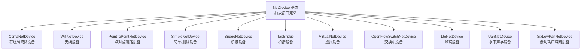
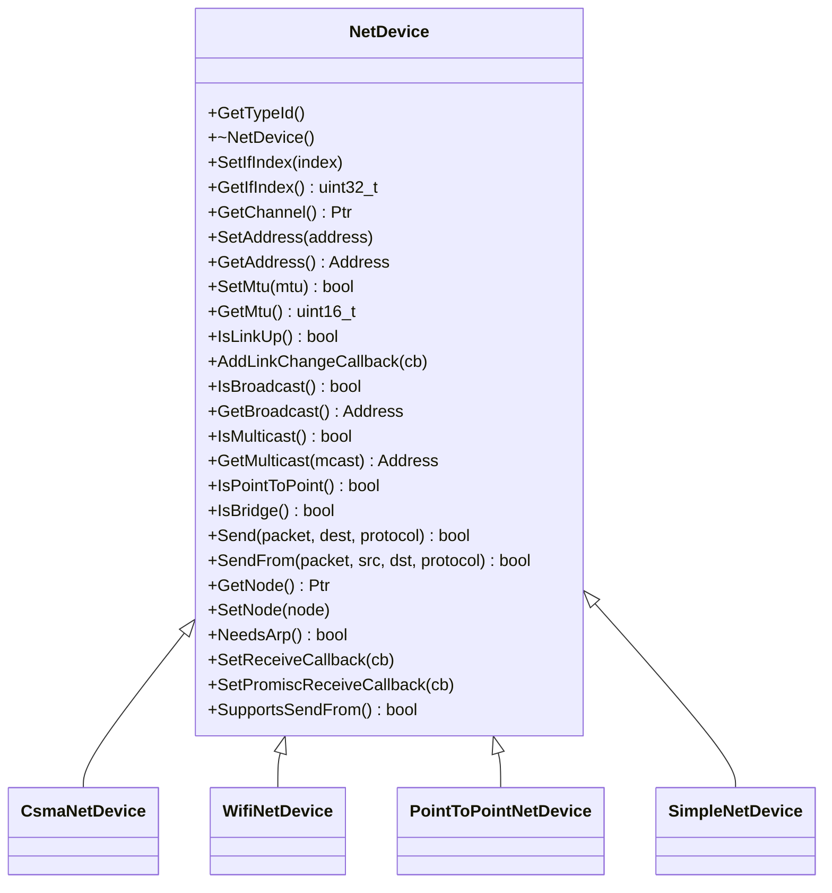
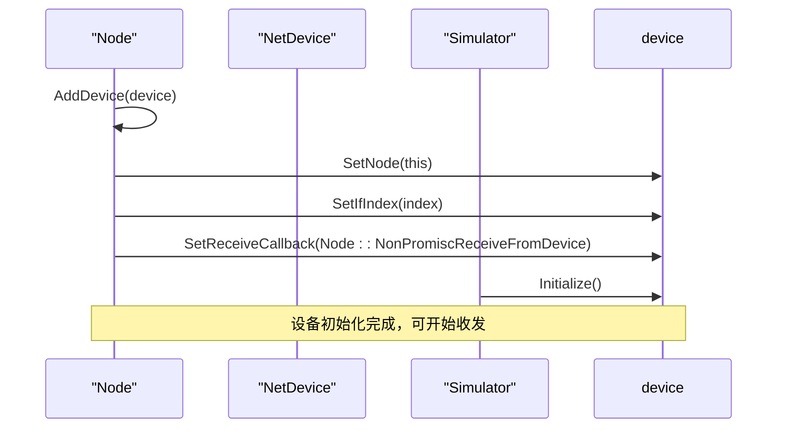
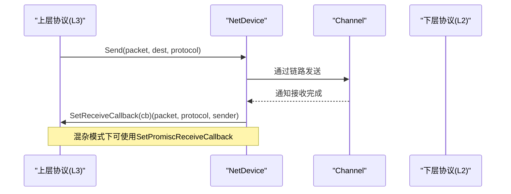
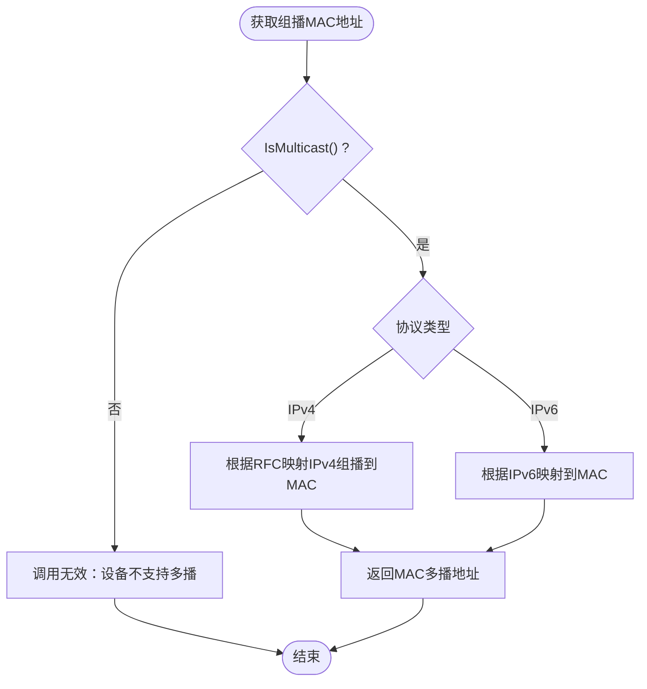
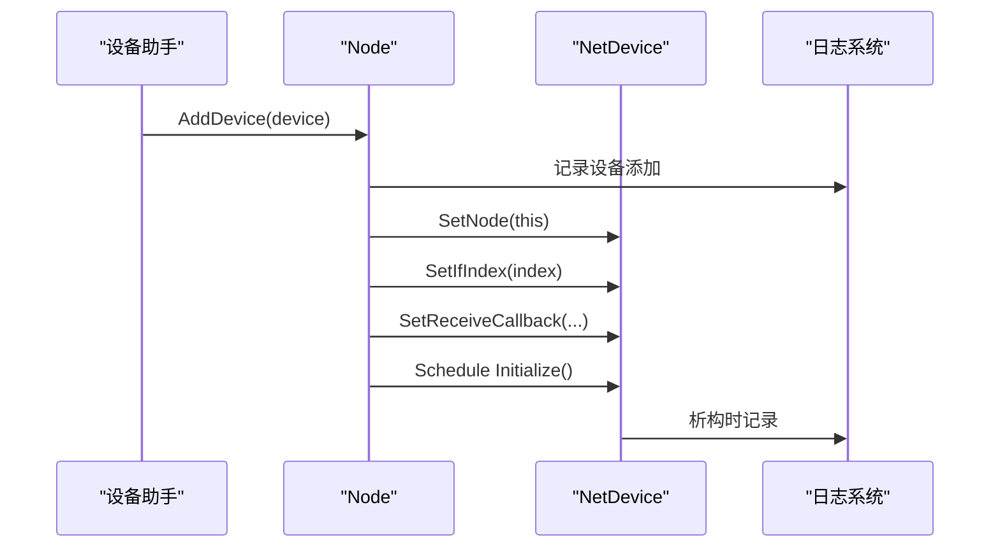
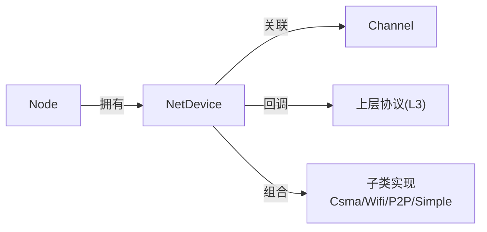

# NetDevice接口规范

<cite>
**本文档引用的文件**
- [net-device.h](file://simulator/ns-3.39/src/network/model/net-device.h)
- [net-device.cc](file://simulator/ns-3.39/src/network/model/net-device.cc)
- [csma-net-device.h](file://simulator/ns-3.39/src/csma/model/csma-net-device.h)
- [wifi-net-device.h](file://simulator/ns-3.39/src/wifi/model/wifi-net-device.h)
- [point-to-point-net-device.h](file://simulator/ns-3.39/src/point-to-point/model/point-to-point-net-device.h)
- [simple-net-device.h](file://simulator/ns-3.39/src/network/utils/simple-net-device.h)
- [node.cc](file://simulator/ns-3.39/src/network/model/node.cc)
- [wimax-net-device.h](file://simulator/ns-3.39/src/wimax/model/wimax-net-device.h)
</cite>

## 目录
1. [简介](#简介)
2. [项目结构](#项目结构)
3. [核心组件](#核心组件)
4. [架构总览](#架构总览)
5. [详细组件分析](#详细组件分析)
6. [依赖关系分析](#依赖关系分析)
7. [性能考虑](#性能考虑)
8. [故障排查指南](#故障排查指南)
9. [结论](#结论)
10. [附录](#附录)

## 简介
本文件系统化梳理NS-3中NetDevice抽象接口的设计与实现，覆盖基类设计理念、核心接口规范（设备生命周期、数据包收发、MAC地址管理、状态查询）、继承体系与多态机制、设备注册流程、类型标识符管理、日志记录机制，以及扩展与自定义设备实现的最佳实践。目标是帮助开发者在不深入底层协议细节的前提下，快速理解并正确使用该抽象层。

## 项目结构
NetDevice位于网络模块的模型层，作为L3到L2/MAC之间的统一抽象接口，向上屏蔽不同MAC协议差异，向下对接具体链路与物理层。典型子类包括CSMA、WiFi、点对点、虚拟设备等，均通过继承NetDevice并实现纯虚接口完成定制。

图示来源
- [net-device.h:101-379](file://simulator/ns-3.39/src/network/model/net-device.h#L101-L379)
- [csma-net-device.h:60-60](file://simulator/ns-3.39/src/csma/model/csma-net-device.h#L60-L60)
- [wifi-net-device.h:58-58](file://simulator/ns-3.39/src/wifi/model/wifi-net-device.h#L58-L58)
- [point-to-point-net-device.h:63-63](file://simulator/ns-3.39/src/point-to-point/model/point-to-point-net-device.h#L63-L63)
- [simple-net-device.h:54-54](file://simulator/ns-3.39/src/network/utils/simple-net-device.h#L54-L54)

章节来源
- [net-device.h:101-379](file://simulator/ns-3.39/src/network/model/net-device.h#L101-L379)

## 核心组件
- 抽象基类NetDevice：定义统一的设备接口，屏蔽MAC细节，向上为L3协议栈提供一致访问入口。
- 设备生命周期：通过Node::AddDevice完成注册、初始化回调、接口索引分配；设备自身Initialize/Dispose生命周期由框架调度。
- 数据包收发接口：Send/SendFrom用于上层下发数据包；SetReceiveCallback/SetPromiscReceiveCallback注册上行回调。
- 地址与链路：SetAddress/GetAddress管理MAC地址；GetChannel返回连接的链路对象；IsBroadcast/IsMulticast/GetMulticast支持广播与组播。
- 链路状态：IsLinkUp/LinkChange回调用于通知链路状态变化；NeedsArp决定是否需要ARP解析。
- MTU与能力：SetMtu/GetMtu设置最大传输单元；SupportsSendFrom指示是否支持源地址伪造（MAC欺骗）。

章节来源
- [net-device.h:111-379](file://simulator/ns-3.39/src/network/model/net-device.h#L111-L379)
- [net-device.cc:31-55](file://simulator/ns-3.39/src/network/model/net-device.cc#L31-L55)
- [node.cc:137-149](file://simulator/ns-3.39/src/network/model/node.cc#L137-L149)

## 架构总览
NetDevice采用面向对象的纯虚接口设计，结合NS-3的对象系统（TypeId/属性/回调），形成“抽象接口 + 多态实现 + 生命周期管理”的整体架构。

图示来源
- [net-device.h:101-379](file://simulator/ns-3.39/src/network/model/net-device.h#L101-L379)
- [csma-net-device.h:60-60](file://simulator/ns-3.39/src/csma/model/csma-net-device.h#L60-L60)
- [wifi-net-device.h:58-58](file://simulator/ns-3.39/src/wifi/model/wifi-net-device.h#L58-L58)
- [point-to-point-net-device.h:63-63](file://simulator/ns-3.39/src/point-to-point/model/point-to-point-net-device.h#L63-L63)
- [simple-net-device.h:54-54](file://simulator/ns-3.39/src/network/utils/simple-net-device.h#L54-L54)

## 详细组件分析

### NetDevice基类与生命周期
- 类型标识与日志：通过GetTypeId提供统一类型识别；NetDevice日志组件已注册，便于调试与追踪。
- 生命周期：Node::AddDevice负责将设备加入节点、设置Node指针与接口索引，并在下一仿真时刻调用设备Initialize；设备析构时触发日志输出。
- 多队列与流控：注释明确指出支持多队列与动态队列限制的设备需在NotifyNewAggregate中缓存队列接口、设置选择队列回调，并在初始化前配置队列数量与追踪连接。

图示来源
- [node.cc:137-149](file://simulator/ns-3.39/src/network/model/node.cc#L137-L149)
- [net-device.cc:31-41](file://simulator/ns-3.39/src/network/model/net-device.cc#L31-L41)

章节来源
- [net-device.h:78-100](file://simulator/ns-3.39/src/network/model/net-device.h#L78-L100)
- [net-device.cc:27-41](file://simulator/ns-3.39/src/network/model/net-device.cc#L27-L41)
- [node.cc:137-149](file://simulator/ns-3.39/src/network/model/node.cc#L137-L149)

### 数据包发送与接收
- 发送接口：Send(packet, dest, protocol)用于常规发送；SendFrom(packet, src, dst, protocol)支持源地址伪造（MAC欺骗）。返回值表示是否成功入队或发送。
- 接收回调：SetReceiveCallback注册非_PROMISC回调；SetPromiscReceiveCallback注册混杂模式回调。回调签名包含设备指针、收到的包、协议号、发送方地址等。
- 协议映射：部分设备（如点对点）提供PPP/Ethernet协议号映射工具函数，便于跨协议栈互通。

图示来源
- [net-device.h:246-379](file://simulator/ns-3.39/src/network/model/net-device.h#L246-L379)
- [point-to-point-net-device.h:471-479](file://simulator/ns-3.39/src/point-to-point/model/point-to-point-net-device.h#L471-L479)

章节来源
- [net-device.h:246-379](file://simulator/ns-3.39/src/network/model/net-device.h#L246-L379)
- [point-to-point-net-device.h:471-479](file://simulator/ns-3.39/src/point-to-point/model/point-to-point-net-device.h#L471-L479)

### MAC地址管理与多播
- 地址设置：SetAddress/GetAddress管理设备MAC地址；不同子类使用不同地址类型（如Mac48Address）。
- 广播与多播：IsBroadcast/GetBroadcast支持广播；IsMulticast/GetMulticast支持IPv4/IPv6组播地址映射至MAC层格式。
- 能力判定：IsPointToPoint/IsBridge等标志位用于上层行为决策。

图示来源
- [net-device.h:172-226](file://simulator/ns-3.39/src/network/model/net-device.h#L172-L226)

章节来源
- [net-device.h:172-226](file://simulator/ns-3.39/src/network/model/net-device.h#L172-L226)

### 设备类型与子类实现要点
- CSMA设备：支持封装模式（DIX/LLC），具备队列、错误模型、背压与帧间间隔控制；提供启用/禁用收发侧的开关。
- WiFi设备：组合PHY/MAC/速率控制等子模块；支持多种标准与多链路场景；维护MTU上限。
- 点对点设备：简化模型，强调时延与带宽；提供PPP/Ethernet协议映射。
- 简单设备：面向测试与教学，支持错误模型与广播模式，无限带宽默认配置。

章节来源
- [csma-net-device.h:60-60](file://simulator/ns-3.39/src/csma/model/csma-net-device.h#L60-L60)
- [wifi-net-device.h:58-58](file://simulator/ns-3.39/src/wifi/model/wifi-net-device.h#L58-L58)
- [point-to-point-net-device.h:63-63](file://simulator/ns-3.39/src/point-to-point/model/point-to-point-net-device.h#L63-L63)
- [simple-net-device.h:54-54](file://simulator/ns-3.39/src/network/utils/simple-net-device.h#L54-L54)

### 设备注册、类型标识符与日志
- 注册流程：Node::AddDevice自动完成设备注册、接口索引分配、回调绑定与初始化调度。
- 类型标识：NetDevice::GetTypeId返回类型ID，配合SetGroupName("Network")统一命名空间。
- 日志记录：NS_LOG_COMPONENT_DEFINE("NetDevice")确保设备相关事件可被日志系统捕获。

图示来源
- [node.cc:137-149](file://simulator/ns-3.39/src/network/model/node.cc#L137-L149)
- [net-device.cc:27-41](file://simulator/ns-3.39/src/network/model/net-device.cc#L27-L41)

章节来源
- [node.cc:137-149](file://simulator/ns-3.39/src/network/model/node.cc#L137-L149)
- [net-device.cc:27-41](file://simulator/ns-3.39/src/network/model/net-device.cc#L27-L41)

## 依赖关系分析
- 继承关系：所有具体设备类均直接继承自NetDevice，遵循单一职责与开闭原则。
- 关联关系：设备与Node双向关联（SetNode/GetNode），与Channel单向关联（GetChannel）；通过回调与队列进行数据通路。
- 外部依赖：依赖NS-3对象系统（TypeId/属性）、回调系统（Callback）、时间/数据率等基础类型。

图示来源
- [net-device.h:101-127](file://simulator/ns-3.39/src/network/model/net-device.h#L101-L127)
- [node.cc:137-149](file://simulator/ns-3.39/src/network/model/node.cc#L137-L149)

章节来源
- [net-device.h:101-127](file://simulator/ns-3.39/src/network/model/net-device.h#L101-L127)
- [node.cc:137-149](file://simulator/ns-3.39/src/network/model/node.cc#L137-L149)

## 性能考虑
- 队列与背压：CSMA/点对点等设备内置队列与背压参数（如slotTime/minSlots/maxSlots/maxRetries/ceiling），合理配置可降低拥塞与重传。
- MTU与分片：上层IP层依据GetMtu进行分片，建议根据链路特性设置合理MTU以减少碎片化。
- 回调与追踪：过多的Promisc回调会增加CPU开销，应按需启用；利用追踪回调进行观测而非长期常驻。
- 多队列与流控：多队列设备需在聚合阶段缓存队列接口并连接队列追踪，避免运行期频繁查找带来的额外开销。

## 故障排查指南
- 链路未就绪：检查IsLinkUp与AddLinkChangeCallback回调是否正确触发；确认设备已Attach到有效Channel。
- 回包不通：核对SetReceiveCallback/SetPromiscReceiveCallback是否设置；确认回调函数签名与协议号匹配。
- 地址问题：确认SetAddress/GetAddress一致性；多播场景下先调用IsMulticast再调用GetMulticast。
- MTU异常：若上层出现分片失败，检查SetMtu返回值与GetMtu实际值是否一致。
- 日志定位：启用NetDevice日志组件，观察设备初始化、发送/接收、丢弃等关键事件。

章节来源
- [net-device.h:155-170](file://simulator/ns-3.39/src/network/model/net-device.h#L155-L170)
- [net-device.h:333-379](file://simulator/ns-3.39/src/network/model/net-device.h#L333-L379)
- [net-device.cc:27-27](file://simulator/ns-3.39/src/network/model/net-device.cc#L27-L27)

## 结论
NetDevice通过清晰的抽象接口与完善的生命周期管理，为NS-3的多MAC协议支持提供了统一的L2/MAC接入面。借助多态与回调机制，上层协议无需关心具体设备实现即可完成数据收发与状态查询。遵循本文档的接口规范、最佳实践与扩展指导，可高效构建稳定可靠的自定义网络设备。

## 附录

### 接口使用示例（步骤说明）
- 创建并安装设备：通过对应模块的Helper创建设备对象，设置队列/通道/错误模型等属性，最后调用Node::AddDevice完成注册。
- 设置回调：在Node侧绑定非Promisc与Promisc回调，以便接收上行数据包。
- 启动与验证：启动仿真后，观察日志与追踪输出，确认链路状态、收发计数与回调触发情况。

章节来源
- [node.cc:137-149](file://simulator/ns-3.39/src/network/model/node.cc#L137-L149)
- [net-device.h:333-379](file://simulator/ns-3.39/src/network/model/net-device.h#L333-L379)

### 扩展与自定义设备实现指导
- 继承NetDevice并实现全部纯虚接口；在DoDispose中释放资源，避免循环引用。
- 在Node::AddDevice后完成必要的初始化（如Attach到Channel、设置队列与回调）。
- 如支持多队列/流控，遵循注释中的流程在NotifyNewAggregate与Initialize前后完成队列接口缓存与追踪连接。
- 提供合理的默认MTU与能力判断（IsBroadcast/IsMulticast/IsPointToPoint/IsBridge/NeedsArp）。
- 使用NS_LOG_COMPONENT_DEFINE记录关键事件，便于调试与审计。

章节来源
- [net-device.h:78-100](file://simulator/ns-3.39/src/network/model/net-device.h#L78-L100)
- [net-device.cc:27-27](file://simulator/ns-3.39/src/network/model/net-device.cc#L27-L27)