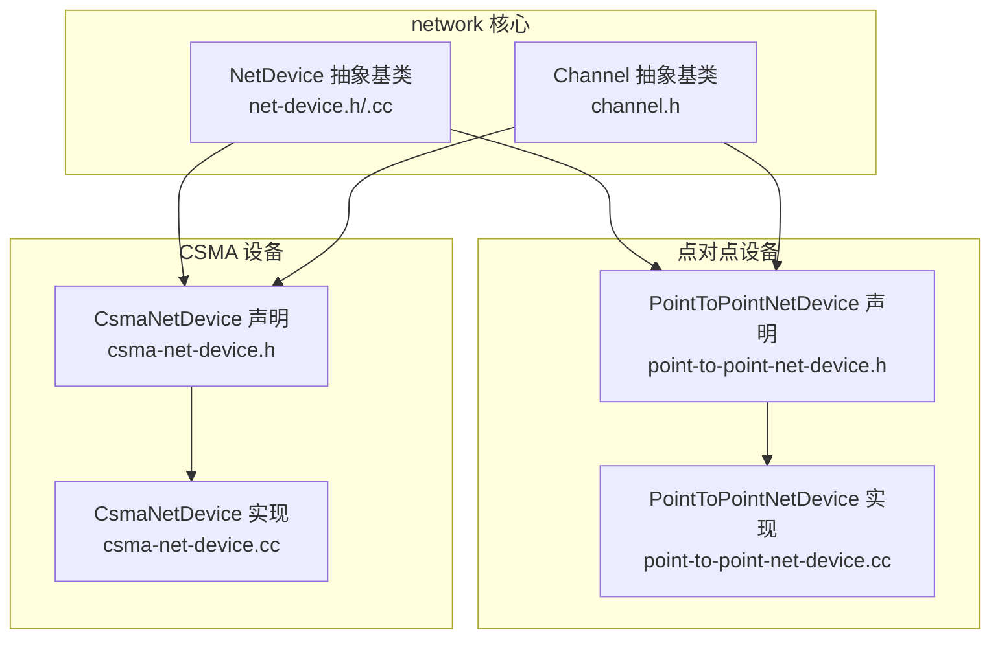
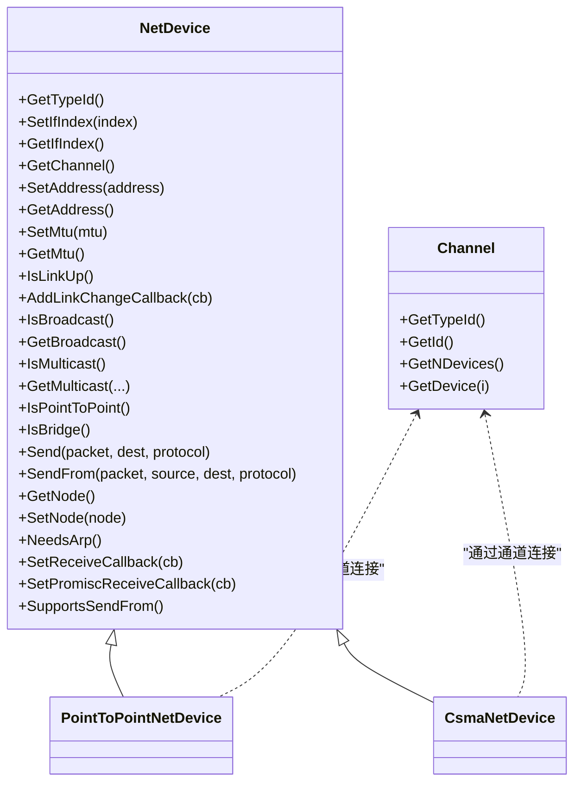
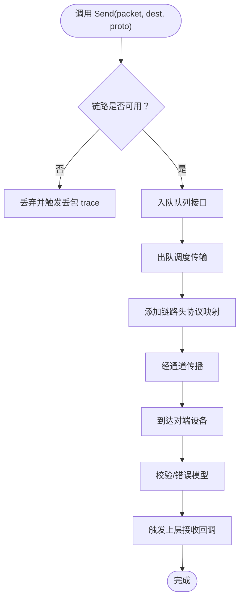
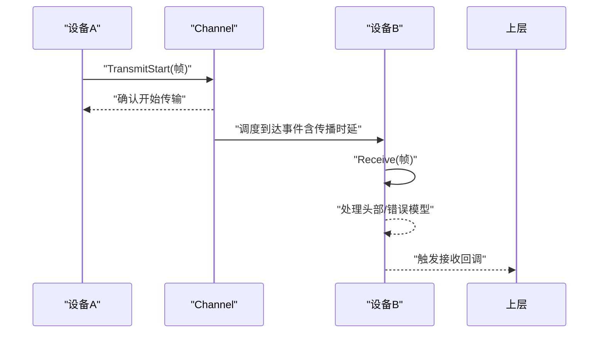
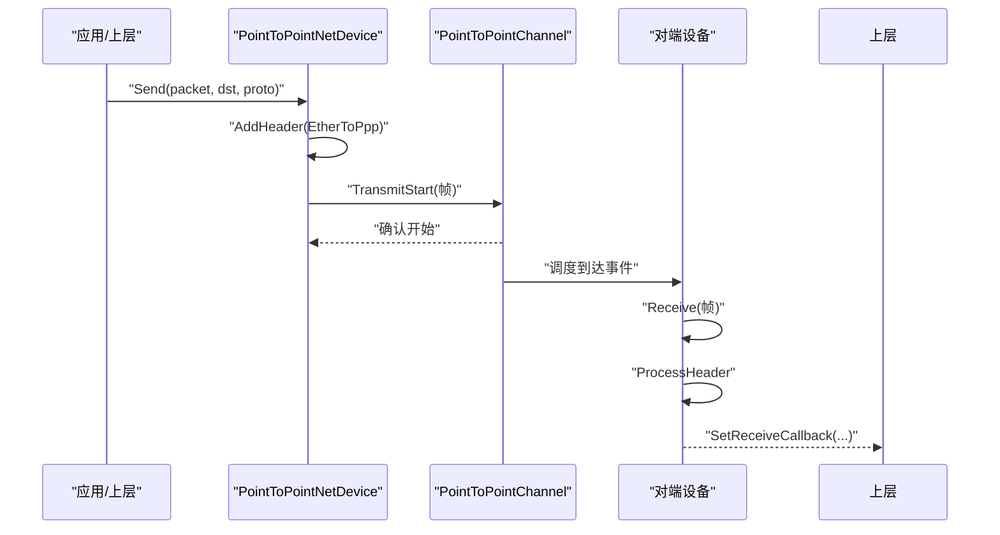
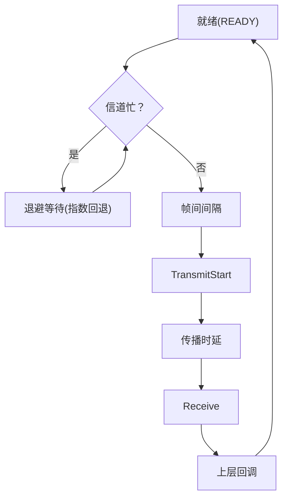
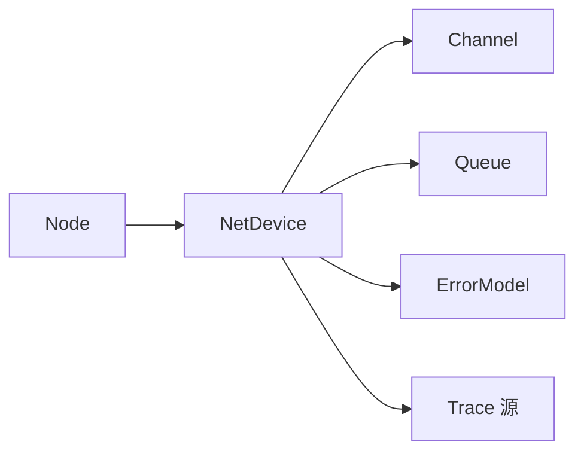

# 网络设备模型（NetDevice Model）

<cite>
**本文引用的文件**
- [net-device.h](file://simulator/ns-3.39/src/network/model/net-device.h)
- [channel.h](file://simulator/ns-3.39/src/network/model/channel.h)
- [net-device.cc](file://simulator/ns-3.39/src/network/model/net-device.cc)
- [point-to-point-net-device.h](file://simulator/ns-3.39/src/point-to-point/model/point-to-point-net-device.h)
- [point-to-point-net-device.cc](file://simulator/ns-3.39/src/point-to-point/model/point-to-point-net-device.cc)
- [csma-net-device.h](file://simulator/ns-3.39/src/csma/model/csma-net-device.h)
- [csma-net-device.cc](file://simulator/ns-3.39/src/csma/model/csma-net-device.cc)
- [first.cc](file://examples/tutorial/first.cc)
</cite>

## 目录
1. [引言](#引言)
2. [项目结构](#项目结构)
3. [核心组件](#核心组件)
4. [架构总览](#架构总览)
5. [详细组件分析](#详细组件分析)
6. [依赖关系分析](#依赖关系分析)
7. [性能考虑](#性能考虑)
8. [故障与排障指南](#故障与排障指南)
9. [结论](#结论)
10. [附录：实用示例与最佳实践](#附录实用示例与最佳实践)

## 引言
本文件系统性梳理 NS-3 中网络设备模型（NetDevice）与通信介质（Channel）的架构设计与实现要点，覆盖抽象基类接口规范、设备初始化与状态管理、数据收发流程、通道建模与信号传播、典型设备类型（点对点与CSMA）的实现差异，并提供可直接参考的示例脚本路径与配置建议。目标是帮助读者在不深入源码细节的前提下，快速掌握如何创建、配置、连接与优化网络设备。

## 项目结构
NS-3 的网络设备与通道位于 network 模块中，典型设备类型分别由 point-to-point 与 csma 子模块提供。下图给出与本文相关的文件级结构映射：

**图表来源**
- [net-device.h:101-384](file://simulator/ns-3.39/src/network/model/net-device.h#L101-L384)
- [channel.h:44-85](file://simulator/ns-3.39/src/network/model/channel.h#L44-L85)
- [point-to-point-net-device.h:63-485](file://simulator/ns-3.39/src/point-to-point/model/point-to-point-net-device.h#L63-L485)
- [csma-net-device.h:60-740](file://simulator/ns-3.39/src/csma/model/csma-net-device.h#L60-L740)

**章节来源**
- [net-device.h:101-384](file://simulator/ns-3.39/src/network/model/net-device.h#L101-L384)
- [channel.h:44-85](file://simulator/ns-3.39/src/network/model/channel.h#L44-L85)

## 核心组件
- NetDevice 抽象基类：定义网络层与设备之间的统一接口，屏蔽 MAC 细节，支持链路状态回调、地址族能力、发送/接收回调、广播/组播支持等。
- Channel 抽象基类：表示逻辑链路，提供设备枚举与唯一标识，子类负责具体介质建模与事件调度。
- 具体设备：
  - PointToPointNetDevice：面向点对点链路，具备数据速率、帧间间隔、队列与错误模型等属性；内部维护发送状态机与多种 trace 源。
  - CsmaNetDevice：面向共享总线型链路，具备封装模式（DIX/LLC）、发送/接收使能、退避算法、队列与错误模型等属性；内部维护 CSMA 发送状态机与丰富的 trace 源。

**章节来源**
- [net-device.h:101-384](file://simulator/ns-3.39/src/network/model/net-device.h#L101-L384)
- [channel.h:44-85](file://simulator/ns-3.39/src/network/model/channel.h#L44-L85)
- [point-to-point-net-device.h:63-485](file://simulator/ns-3.39/src/point-to-point/model/point-to-point-net-device.h#L63-L485)
- [csma-net-device.h:60-740](file://simulator/ns-3.39/src/csma/model/csma-net-device.h#L60-L740)

## 架构总览
下图展示 NetDevice 与 Channel 的继承与组合关系，以及典型设备类型与其通道的关系：

**图表来源**
- [net-device.h:101-384](file://simulator/ns-3.39/src/network/model/net-device.h#L101-L384)
- [channel.h:44-85](file://simulator/ns-3.39/src/network/model/channel.h#L44-L85)
- [point-to-point-net-device.h:63-120](file://simulator/ns-3.39/src/point-to-point/model/point-to-point-net-device.h#L63-L120)
- [csma-net-device.h:60-130](file://simulator/ns-3.39/src/csma/model/csma-net-device.h#L60-L130)

## 详细组件分析

### NetDevice 抽象基类
- 职责边界：向上对接网络层（IP/ARP），向下对接物理/链路层（通道）。通过统一接口屏蔽不同 MAC 地址格式与多播映射规则。
- 关键接口：
  - 链路与地址：设置/获取接口索引、链路状态、广播/组播支持、多播地址映射。
  - 数据面：发送（含源 MAC 欺骗）、接收回调注册、混杂模式回调注册。
  - 生命周期：与 Node 聚合、ARP 需求查询。
- 状态与事件：链路状态变化回调用于刷新 ARP/NDISC 缓存；设备需在连接到 Channel 后上报“链路已上”。

**图表来源**
- [net-device.h:258-384](file://simulator/ns-3.39/src/network/model/net-device.h#L258-L384)

**章节来源**
- [net-device.h:101-384](file://simulator/ns-3.39/src/network/model/net-device.h#L101-L384)
- [net-device.cc:31-55](file://simulator/ns-3.39/src/network/model/net-device.cc#L31-L55)

### Channel 抽象基类
- 职责边界：作为设备间的“逻辑链路”，提供设备集合访问与唯一 ID；子类负责事件调度与信号传播。
- 关键接口：设备数量与设备枚举；子类必须正确使用仿真器上下文调度。

**图表来源**
- [channel.h:69-76](file://simulator/ns-3.39/src/network/model/channel.h#L69-L76)
- [point-to-point-net-device.h:144-153](file://simulator/ns-3.39/src/point-to-point/model/point-to-point-net-device.h#L144-L153)
- [csma-net-device.h:174-174](file://simulator/ns-3.39/src/csma/model/csma-net-device.h#L174-L174)

**章节来源**
- [channel.h:44-85](file://simulator/ns-3.39/src/network/model/channel.h#L44-L85)

### PointToPointNetDevice（点对点）
- 设计要点：
  - 以数据速率与帧间间隔控制发送节奏；默认 MTU 为 1500 字节。
  - 内部维护发送状态机（就绪/忙碌），支持队列、错误模型与多种 trace 源。
  - 支持链路状态回调与混杂接收回调；支持源 MAC 欺骗发送。
- 关键属性与行为：
  - 属性：MTU、MAC 地址、数据速率、接收错误模型、帧间间隔、发送队列。
  - trace 源：MAC 层与 PHY 层的发送/接收、丢包、嗅探等。
  - 发送流程：入队 -> 出队 -> 添加 PPP 头 -> 通过通道传播 -> 对端接收 -> 上层回调。

**图表来源**
- [point-to-point-net-device.h:181-182](file://simulator/ns-3.39/src/point-to-point/model/point-to-point-net-device.h#L181-L182)
- [point-to-point-net-device.cc:38-172](file://simulator/ns-3.39/src/point-to-point/model/point-to-point-net-device.cc#L38-L172)

**章节来源**
- [point-to-point-net-device.h:63-485](file://simulator/ns-3.39/src/point-to-point/model/point-to-point-net-device.h#L63-L485)
- [point-to-point-net-device.cc:190-200](file://simulator/ns-3.39/src/point-to-point/model/point-to-point-net-device.cc#L190-L200)

### CsmaNetDevice（CSMA 共享总线）
- 设计要点：
  - 支持 DIX/LLC 封装模式；具备发送/接收使能开关；内置退避算法（Backoff）。
  - 发送状态机包含就绪、忙碌、帧间间隔、退避等待等状态；支持队列、错误模型与丰富 trace 源。
- 关键属性与行为：
  - 属性：MAC 地址、MTU、封装模式、发送/接收使能、接收错误模型、发送队列。
  - trace 源：MAC 层与 PHY 层的发送/接收、丢包、退避、嗅探等。
  - 发送流程：检测信道空闲 -> 退避/重试 -> 开始传输 -> 传播延迟 -> 对端接收 -> 上层回调。

**图表来源**
- [csma-net-device.h:474-486](file://simulator/ns-3.39/src/csma/model/csma-net-device.h#L474-L486)
- [csma-net-device.cc:44-185](file://simulator/ns-3.39/src/csma/model/csma-net-device.cc#L44-L185)

**章节来源**
- [csma-net-device.h:60-740](file://simulator/ns-3.39/src/csma/model/csma-net-device.h#L60-L740)
- [csma-net-device.cc:187-200](file://simulator/ns-3.39/src/csma/model/csma-net-device.cc#L187-L200)

## 依赖关系分析
- 组件耦合：
  - NetDevice 与 Channel 为松耦合：设备仅通过 GetChannel() 获取通道指针，不关心具体实现。
  - 设备与 Node：设备聚合 Node，便于日志、统计与生命周期管理。
  - 设备与队列：设备拥有队列所有权，负责队列的入/出队与 trace。
- 可能的循环依赖：
  - 设备与通道相互协作，但无直接头文件循环包含；通过 Ptr 智能指针解耦。
- 外部依赖：
  - 时间与时钟：通过仿真器进行事件调度与传播时延。
  - 错误模型：可选地接入接收错误模型以模拟误码。

**图表来源**
- [point-to-point-net-device.h:329-334](file://simulator/ns-3.39/src/point-to-point/model/point-to-point-net-device.h#L329-L334)
- [csma-net-device.h:537-544](file://simulator/ns-3.39/src/csma/model/csma-net-device.h#L537-L544)

**章节来源**
- [point-to-point-net-device.h:329-334](file://simulator/ns-3.39/src/point-to-point/model/point-to-point-net-device.h#L329-L334)
- [csma-net-device.h:537-544](file://simulator/ns-3.39/src/csma/model/csma-net-device.h#L537-L544)

## 性能考虑
- 队列与背压：合理设置队列容量与调度策略，避免频繁丢包；对高带宽/长肥管道场景，适当增大队列以减少排队时延。
- 数据速率与帧间间隔：过小的帧间间隔可能导致冲突或仿真抖动；过大则降低吞吐。
- 传播时延：长距离链路应匹配真实时延，避免过短导致统计偏差。
- trace 源开销：大量 trace 会显著增加仿真开销，建议在调试阶段启用，正式实验关闭或按需选择。
- 错误模型：误码率过高会显著影响吞吐与延迟统计，应结合实际链路质量设定。

## 故障与排障指南
- 常见问题
  - 链路未上：检查设备是否成功连接到 Channel；关注链路状态回调是否被触发。
  - 接收不到包：确认接收回调已注册；若使用混杂模式，确保已设置混杂回调。
  - 丢包过多：检查队列长度、数据速率与帧间间隔；评估错误模型与传播时延。
- 定位手段
  - 使用设备提供的 trace 源定位丢包阶段（MAC/PKT/PHY）。
  - 通过链路状态回调与日志组件辅助判断链路切换异常。
- 参考实现
  - NetDevice 默认链路状态回调与错误处理入口可作为排查起点。

**章节来源**
- [net-device.cc:31-55](file://simulator/ns-3.39/src/network/model/net-device.cc#L31-L55)

## 结论
NS-3 的网络设备模型通过 NetDevice 抽象统一了上层与底层的交互契约，借助 Channel 提供灵活的介质建模能力。点对点与 CSMA 设备分别针对串行链路与共享总线场景提供了完备的实现，包括发送状态机、队列、错误模型与丰富的 trace 源。遵循本文的配置与优化建议，可在保证仿真精度的同时提升性能与可维护性。

## 附录：实用示例与最佳实践

### 示例一：点对点链路创建与配置
- 示例脚本路径：[examples/tutorial/first.cc:46-51](file://examples/tutorial/first.cc#L46-L51)
- 关键步骤
  - 创建节点容器与点对点助手；
  - 设置设备属性（数据速率）与通道属性（延迟）；
  - 安装设备与互联网栈，分配地址；
  - 部署客户端/服务器应用并运行仿真。

**章节来源**
- [first.cc:46-51](file://examples/tutorial/first.cc#L46-L51)

### 设备属性设置与参数调整清单
- 点对点（PointToPointNetDevice）
  - 属性：MTU、MAC 地址、数据速率、接收错误模型、帧间间隔、发送队列
  - 建议：根据链路带宽与时延设置数据速率与帧间间隔；必要时配置队列为 RED 或 PIE 以抑制拥塞。
- CSMA（CsmaNetDevice）
  - 属性：MTU、MAC 地址、封装模式（DIX/LLC）、发送/接收使能、接收错误模型、发送队列
  - 建议：根据拓扑密度与负载设置退避参数；在广播/组播场景下评估封装模式与多播支持。

**章节来源**
- [point-to-point-net-device.cc:38-172](file://simulator/ns-3.39/src/point-to-point/model/point-to-point-net-device.cc#L38-L172)
- [csma-net-device.cc:44-185](file://simulator/ns-3.39/src/csma/model/csma-net-device.cc#L44-L185)

### 设备创建、配置与连接最佳实践
- 明确拓扑与需求：根据链路类型（点对点/共享总线）选择对应设备与通道。
- 参数一致性：设备数据速率与通道传播时延需匹配实际链路特性。
- 队列策略：优先采用基于公平性的队列（如 RED/PIE），避免 DropTail 导致的尾部丢弃。
- trace 溯源：分阶段启用 trace（先 MAC，再 PHY），逐步定位瓶颈。
- 故障模拟：仅在需要验证鲁棒性时启用错误模型，并记录误码率与位置。