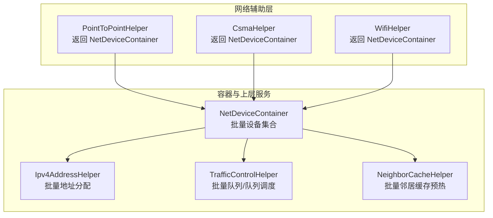
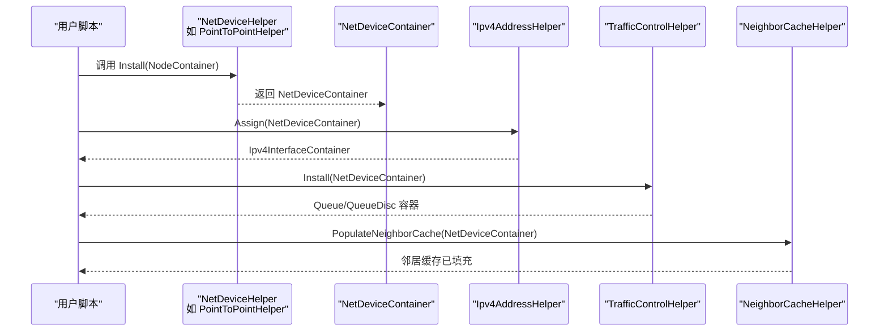
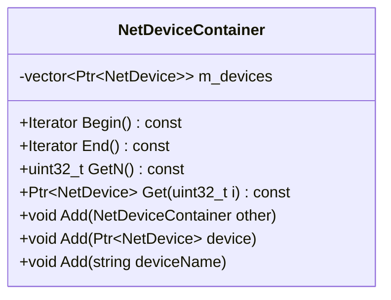
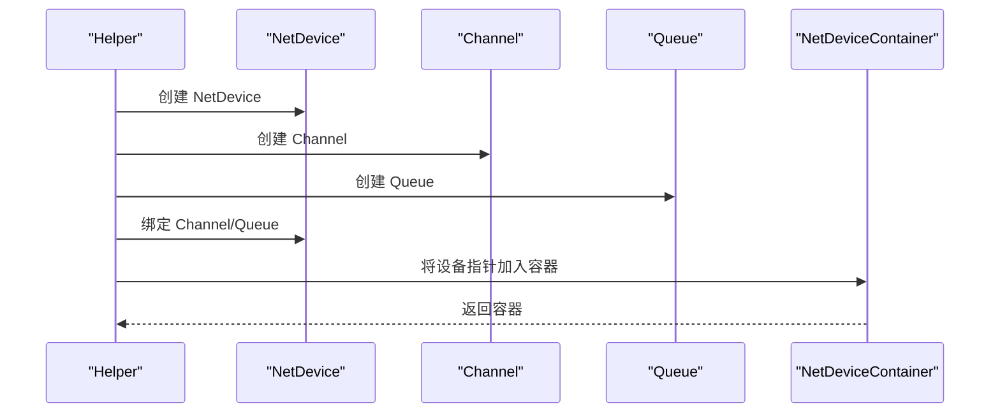
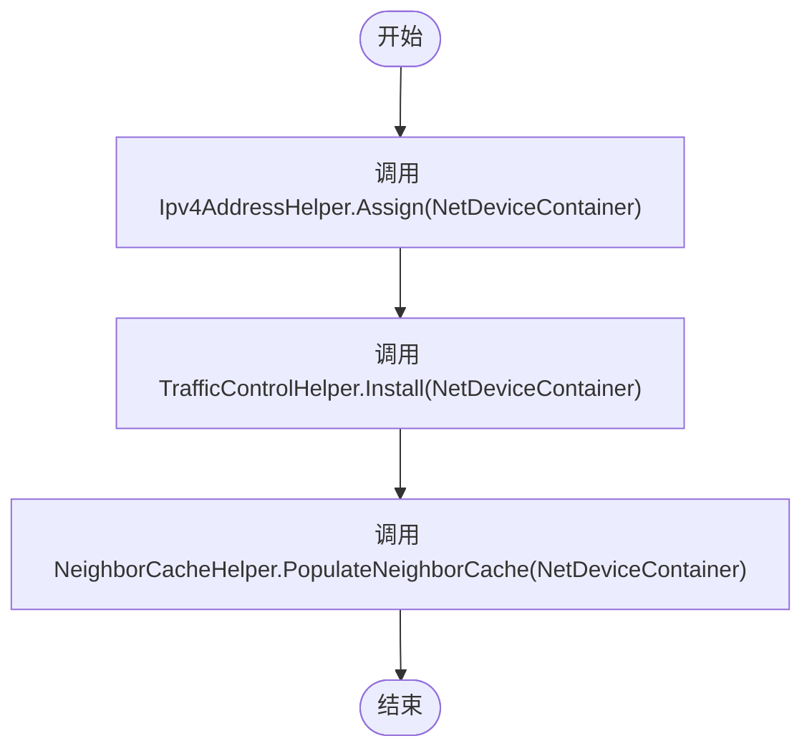
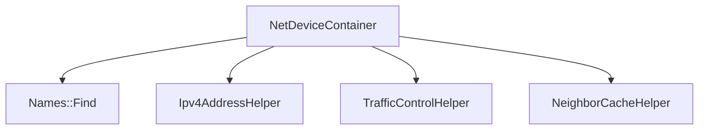

# 设备容器与批量管理

<cite>
**本文引用的文件**   
- [net-device-container.h](file://simulator/ns-3.39/src/network/helper/net-device-container.h)
- [net-device-container.cc](file://simulator/ns-3.39/src/network/helper/net-device-container.cc)
- [point-to-point-helper.h](file://simulator/ns-3.39/src/point-to-point/helper/point-to-point-helper.h)
- [ipv4-address-helper.h](file://simulator/ns-3.39/src/internet/helper/ipv4-address-helper.h)
- [neighbor-cache-test.cc](file://simulator/ns-3.39/src/internet/test/neighbor-cache-test.cc)
- [neighbor-cache-example.cc](file://simulator/ns-3.39/src/internet/examples/neighbor-cache-example.cc)
- [abm-evaluation.cc](file://simulator/ns-3.39/examples/ABM/abm-evaluation.cc)
- [nix-vector-routing.h](file://simulator/ns-3.39/src/nix-vector-routing/model/nix-vector-routing.h)
</cite>

## 目录
1. [引言](#引言)
2. [项目结构](#项目结构)
3. [核心组件](#核心组件)
4. [架构总览](#架构总览)
5. [详细组件分析](#详细组件分析)
6. [依赖关系分析](#依赖关系分析)
7. [性能考虑](#性能考虑)
8. [故障排查指南](#故障排查指南)
9. [结论](#结论)
10. [附录：实用示例与最佳实践](#附录实用示例与最佳实践)

## 引言
本文件围绕 NS-3 网络仿真框架中的 NetDeviceContainer 设备容器展开，系统阐述其设计目标、批量管理能力（设备集合操作、迭代访问、批量属性设置）、与具体设备类型的关联机制与生命周期管理，并结合真实示例展示在复杂网络拓扑构建中的应用与最佳实践。同时给出性能优化与内存管理建议，帮助读者高效、安全地进行大规模网络仿真。

## 项目结构
NetDeviceContainer 位于网络辅助模块中，作为各类 NetDevice 辅助安装器返回的统一容器类型，贯穿从点对点链路到无线、桥接、CSMA 等多种设备类型的安装与后续处理流程。其典型使用路径如下：
- 辅助安装器（如 PointToPointHelper）返回 NetDeviceContainer
- 上层逻辑通过容器进行批量地址分配、队列/队列调度安装、邻居缓存预热等
- 在复杂拓扑中，多个容器可被合并或分别作用于不同子图

**图表来源**
- [point-to-point-helper.h:106-154](file://simulator/ns-3.39/src/point-to-point/helper/point-to-point-helper.h#L106-L154)
- [net-device-container.h:42-87](file://simulator/ns-3.39/src/network/helper/net-device-container.h#L42-L87)
- [ipv4-address-helper.h:151-179](file://simulator/ns-3.39/src/internet/helper/ipv4-address-helper.h#L151-L179)

**章节来源**
- [net-device-container.h:1-205](file://simulator/ns-3.39/src/network/helper/net-device-container.h#L1-L205)
- [point-to-point-helper.h:1-212](file://simulator/ns-3.39/src/point-to-point/helper/point-to-point-helper.h#L1-L212)

## 核心组件
- NetDeviceContainer：封装一组 Ptr<NetDevice> 智能指针，提供索引访问、迭代遍历、数量查询与批量追加等能力；支持通过对象名称查找设备并加入容器。
- NetDevice 辅助安装器：如 PointToPointHelper、CsmaHelper、WifiHelper 等，负责为节点创建设备、通道、队列等，并将生成的设备放入 NetDeviceContainer 返回。
- 上层服务容器与工具：如 Ipv4AddressHelper、TrafficControlHelper、NeighborCacheHelper 等，均以 NetDeviceContainer 为输入，完成批量地址分配、队列/队列调度安装、邻居缓存预热等任务。

**章节来源**
- [net-device-container.h:42-201](file://simulator/ns-3.39/src/network/helper/net-device-container.h#L42-L201)
- [net-device-container.cc:27-94](file://simulator/ns-3.39/src/network/helper/net-device-container.cc#L27-L94)
- [point-to-point-helper.h:106-154](file://simulator/ns-3.39/src/point-to-point/helper/point-to-point-helper.h#L106-L154)
- [ipv4-address-helper.h:151-179](file://simulator/ns-3.39/src/internet/helper/ipv4-address-helper.h#L151-L179)

## 架构总览
下图展示了 NetDeviceContainer 在典型安装与配置流程中的角色与交互：

**图表来源**
- [point-to-point-helper.h:106-154](file://simulator/ns-3.39/src/point-to-point/helper/point-to-point-helper.h#L106-L154)
- [ipv4-address-helper.h:151-179](file://simulator/ns-3.39/src/internet/helper/ipv4-address-helper.h#L151-L179)
- [neighbor-cache-test.cc:652-686](file://simulator/ns-3.39/src/internet/test/neighbor-cache-test.cc#L652-L686)

## 详细组件分析

### NetDeviceContainer 类设计与接口
- 数据结构：内部以 std::vector<Ptr<NetDevice>> 存储设备指针，便于随机访问与顺序遍历。
- 迭代访问：提供 Begin()/End() 常量迭代器，支持范围 for 循环与传统 for+迭代器遍历。
- 数量与索引：GetN() 返回设备数量，Get(i) 返回指定索引的设备指针。
- 批量追加：Add(NetDeviceContainer)、Add(Ptr<NetDevice>)、Add(字符串设备名) 支持灵活合并与扩展。
- 构造方式：支持空容器、单设备、按名称查找设备、两个容器拼接等多种构造场景。

**图表来源**
- [net-device-container.h:42-201](file://simulator/ns-3.39/src/network/helper/net-device-container.h#L42-L201)
- [net-device-container.cc:48-94](file://simulator/ns-3.39/src/network/helper/net-device-container.cc#L48-L94)

**章节来源**
- [net-device-container.h:42-201](file://simulator/ns-3.39/src/network/helper/net-device-container.h#L42-L201)
- [net-device-container.cc:27-94](file://simulator/ns-3.39/src/network/helper/net-device-container.cc#L27-L94)

### 与具体设备类型的关联机制
- NetDeviceContainer 本身不直接创建设备，而是由各类 Helper（如 PointToPointHelper、CsmaHelper、WifiHelper 等）在 Install 流程中创建设备、通道、队列等，并将设备指针放入容器返回。
- 容器与设备的生命周期：容器持有设备智能指针，随容器销毁时自动释放设备资源；但实际设备的生命周期还受节点、通道、队列等对象影响，需遵循 NS-3 对象生命周期管理规范。

**图表来源**
- [point-to-point-helper.h:106-154](file://simulator/ns-3.39/src/point-to-point/helper/point-to-point-helper.h#L106-L154)

**章节来源**
- [point-to-point-helper.h:106-154](file://simulator/ns-3.39/src/point-to-point/helper/point-to-point-helper.h#L106-L154)

### 批量属性设置与统一管理
- 地址分配：通过 Ipv4AddressHelper.Assign(NetDeviceContainer) 对容器内所有设备批量分配接口地址。
- 队列/队列调度：通过 TrafficControlHelper.Install(NetDeviceContainer) 对容器内设备批量安装队列或队列调度。
- 邻居缓存预热：通过 NeighborCacheHelper.PopulateNeighborCache(NetDeviceContainer) 对容器内设备批量预热邻居缓存。

**图表来源**
- [ipv4-address-helper.h:151-179](file://simulator/ns-3.39/src/internet/helper/ipv4-address-helper.h#L151-L179)
- [neighbor-cache-test.cc:652-686](file://simulator/ns-3.39/src/internet/test/neighbor-cache-test.cc#L652-L686)

**章节来源**
- [ipv4-address-helper.h:151-179](file://simulator/ns-3.39/src/internet/helper/ipv4-address-helper.h#L151-L179)
- [neighbor-cache-test.cc:652-686](file://simulator/ns-3.39/src/internet/test/neighbor-cache-test.cc#L652-L686)

### 复杂拓扑中的应用场景与最佳实践
- 分层拓扑：先为接入层创建 NetDeviceContainer，再逐级向上合并至汇聚/核心层，最后统一进行地址分配与队列安装。
- 动态合并：使用 NetDeviceContainer 的拼接构造与 Add 方法，将不同链路或子网的设备容器合并为一个大容器，便于统一处理。
- 名称驱动：借助对象命名服务，通过设备名称快速定位并加入容器，减少显式指针传递带来的耦合。
- 示例参考：ABM 示例中对多级叶脊网络的链路逐一安装并批量配置队列/队列调度，体现了容器在大规模拓扑中的可维护性与可扩展性。

**图表来源**
- [abm-evaluation.cc:730-894](file://simulator/ns-3.39/examples/ABM/abm-evaluation.cc#L730-L894)

**章节来源**
- [abm-evaluation.cc:730-894](file://simulator/ns-3.39/examples/ABM/abm-evaluation.cc#L730-L894)

## 依赖关系分析
- NetDeviceContainer 依赖 NS-3 的智能指针与容器库（std::vector<Ptr<NetDevice>>），以及对象命名服务（Names::Find）用于按名称查找设备。
- 与上层服务的依赖：Ipv4AddressHelper、TrafficControlHelper、NeighborCacheHelper 等均以 NetDeviceContainer 为输入参数，形成“安装器 -> 容器 -> 工具”的流水线式依赖关系。
- 与具体设备类型的依赖：通过 Helper 的 Install 接口间接关联到具体设备类型（如 PointToPointNetDevice、WifiNetDevice 等），但容器本身不直接实例化设备。

**图表来源**
- [net-device-container.cc:36-92](file://simulator/ns-3.39/src/network/helper/net-device-container.cc#L36-L92)
- [ipv4-address-helper.h:151-179](file://simulator/ns-3.39/src/internet/helper/ipv4-address-helper.h#L151-L179)

**章节来源**
- [net-device-container.cc:36-92](file://simulator/ns-3.39/src/network/helper/net-device-container.cc#L36-L92)
- [ipv4-address-helper.h:151-179](file://simulator/ns-3.39/src/internet/helper/ipv4-address-helper.h#L151-L179)

## 性能考虑
- 访问模式：GetN()/Get(i) 为 O(1)，Begin()/End() 提供常量时间迭代，适合大规模设备集合的线性扫描与批量处理。
- 内存占用：容器内部存储 Ptr<NetDevice> 智能指针，避免重复拷贝设备对象；但需注意避免重复添加相同设备导致的冗余指针。
- 合并策略：Add(NetDeviceContainer) 会遍历另一个容器并逐个 push_back，建议在需要频繁合并时优先使用拼接构造或一次性收集后再合并，减少多次扩容与拷贝。
- 批量操作：尽量将地址分配、队列安装、邻居缓存预热等操作以容器为单位进行，减少重复查找与状态切换开销。
- 名称查找：通过名称查找设备（Names::Find）在大型仿真中可能成为瓶颈，建议在关键路径上缓存名称到指针映射，或在安装阶段即建立容器以避免运行期查找。

[本节为通用性能指导，无需特定文件引用]

## 故障排查指南
- 设备未找到：当通过名称添加设备失败时，检查对象命名是否正确、设备是否已在安装阶段注册到命名服务。
- 迭代越界：确保在循环前使用 GetN() 或 End() 作为终止条件，避免越界访问。
- 容器为空：在执行批量操作前校验 GetN() 是否大于零，防止对空容器进行地址分配或队列安装。
- 邻居缓存未生效：确认容器内的设备确实连接到同一信道或具有可达邻居，必要时使用 PopulateNeighborCache 对容器进行预热。
- 示例参考：测试用例展示了如何通过 NetDeviceContainer 对设备进行地址分配与邻居缓存预热，可对照验证自身脚本。

**章节来源**
- [neighbor-cache-test.cc:652-686](file://simulator/ns-3.39/src/internet/test/neighbor-cache-test.cc#L652-L686)
- [neighbor-cache-example.cc:435-467](file://simulator/ns-3.39/src/internet/examples/neighbor-cache-example.cc#L435-L467)

## 结论
NetDeviceContainer 作为 NS-3 中设备批量管理的核心抽象，提供了简洁而强大的集合操作能力，配合各类 Helper 与上层服务，能够高效地支撑从简单链路到复杂叶脊网络的统一配置与管理。通过合理的容器组织、批量操作与性能优化策略，可在保证可读性的同时显著提升大规模仿真的可维护性与执行效率。

## 附录：实用示例与最佳实践
- 使用容器进行批量地址分配与队列安装：参考 Ipv4AddressHelper.Assign 与 TrafficControlHelper.Install 的容器输入形式。
- 通过名称驱动快速定位设备：在安装后立即为设备命名，随后通过 Names::Find 加入容器，减少指针传递。
- 复杂拓扑的分层与合并：先为各子域创建容器，再逐步合并为更大容器，最后统一处理。
- 邻居缓存预热：在大规模拓扑中，先对关键链路容器进行邻居缓存预热，有助于缩短收敛时间。
- 参考示例：ABM 示例展示了多级网络中对每个链路的设备容器进行批量队列/队列调度配置的完整流程。

**章节来源**
- [ipv4-address-helper.h:151-179](file://simulator/ns-3.39/src/internet/helper/ipv4-address-helper.h#L151-L179)
- [abm-evaluation.cc:730-894](file://simulator/ns-3.39/examples/ABM/abm-evaluation.cc#L730-L894)
- [neighbor-cache-example.cc:435-467](file://simulator/ns-3.39/src/internet/examples/neighbor-cache-example.cc#L435-L467)